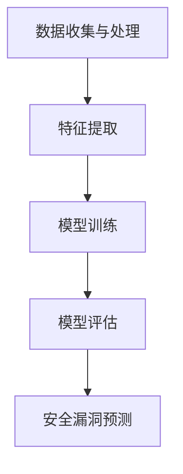
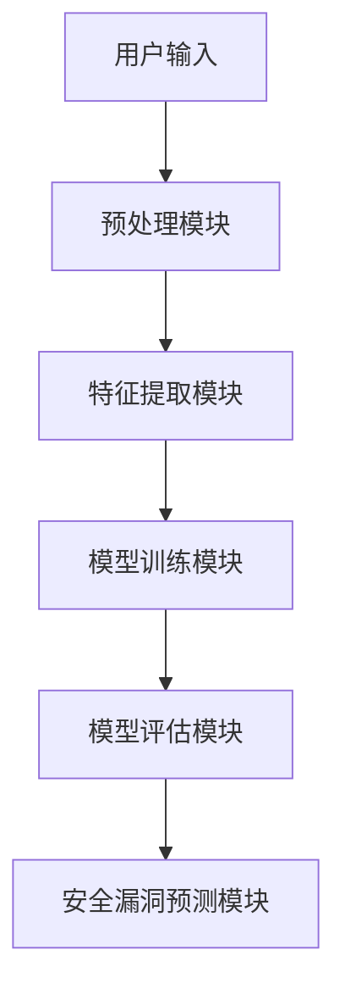
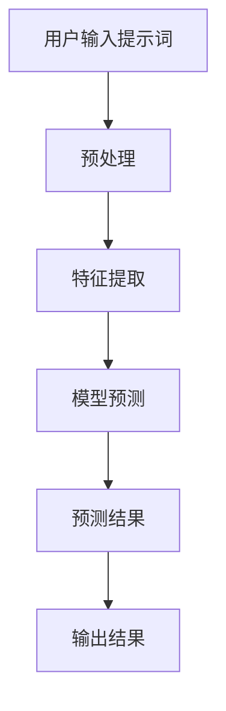

                 


### 文章标题

《提示词语言的安全漏洞预测模型》

### 文章关键词

自然语言处理、安全漏洞预测、机器学习、深度学习、模型优化、应用场景

### 文章摘要

本文深入探讨了自然语言处理（NLP）领域中的安全漏洞预测模型，通过系统分析提示词语言的特点和安全漏洞预测的基本概念，介绍了基于机器学习和深度学习的安全漏洞预测方法。随后，本文通过实际案例展示了这些模型的应用，并提供了最佳实践和未来研究方向，以期为相关领域的研究者提供参考。

## 引言

在当今数字化时代，自然语言处理（NLP）技术已成为众多应用程序的核心组成部分，包括聊天机器人、语音助手、智能客服等。这些应用通过理解用户输入的提示词语言，提供个性化的服务和交互体验。然而，随着这些应用的普及，其安全性也日益受到关注。提示词语言的安全漏洞不仅可能泄露用户隐私，还可能被恶意攻击者利用，从而导致严重的安全问题。

### 背景介绍

自然语言处理（NLP）是计算机科学领域的一个分支，旨在使计算机能够理解、解释和生成人类语言。NLP的核心任务包括文本分类、情感分析、命名实体识别、机器翻译等。这些任务在聊天机器人和语音助手中得到了广泛应用。

安全漏洞预测是指通过分析系统或应用程序的输入，预测可能存在的安全漏洞。在NLP领域，安全漏洞预测主要针对提示词语言，以识别可能的安全威胁，如恶意代码、垃圾邮件和虚假信息等。

### 问题背景

随着NLP技术的不断进步，提示词语言的应用场景也越来越广泛。例如，聊天机器人和语音助手被广泛应用于客户服务、智能家居、医疗保健等领域。这些应用通过理解用户输入的提示词语言，提供即时的响应和服务。然而，提示词语言的安全性问题也随之而来。例如，恶意用户可能会通过输入特定的提示词语言来执行恶意操作，如窃取用户信息、破坏系统等。

### 问题描述

提示词语言的安全漏洞预测问题可以描述为：如何通过分析用户输入的提示词语言，预测其中可能存在的安全漏洞。这需要结合自然语言处理技术和安全漏洞预测方法，构建一个高效、准确的预测模型。

### 问题解决

解决提示词语言的安全漏洞预测问题，需要以下几个步骤：

1. **数据收集与处理**：收集大量带有标签的提示词语言数据，进行预处理，包括文本清洗、分词、词向量化等。
2. **特征工程**：从预处理后的数据中提取特征，如词频、词向量、语法结构等。
3. **模型选择与训练**：选择合适的机器学习或深度学习模型，对特征进行训练，构建安全漏洞预测模型。
4. **模型评估与优化**：对训练好的模型进行评估，包括准确率、召回率、F1分数等指标，并根据评估结果进行模型优化。

### 边界与外延

提示词语言的安全漏洞预测模型的边界在于其适用范围，即针对的是自然语言交互场景中的安全漏洞。其外延包括但不限于聊天机器人、语音助手、智能客服等应用场景。

### 概念结构与核心要素组成

提示词语言的安全漏洞预测模型由以下几个核心要素组成：

1. **输入数据**：带有标签的提示词语言数据。
2. **特征提取**：从输入数据中提取的文本特征，如词频、词向量、语法结构等。
3. **模型**：用于安全漏洞预测的机器学习或深度学习模型。
4. **评估指标**：用于评估模型性能的指标，如准确率、召回率、F1分数等。

## 核心概念与联系

### 1. 自然语言处理（NLP）

自然语言处理（NLP）是指使计算机能够理解、解释和生成人类语言的技术。NLP的核心任务包括文本分类、情感分析、命名实体识别、机器翻译等。

| 核心概念 | 描述 |  
| :--: | :--: |  
| 文本分类 | 将文本分为不同的类别。 |  
| 情感分析 | 分析文本的情感倾向，如正面、负面或中性。 |  
| 命名实体识别 | 识别文本中的命名实体，如人名、地名、组织名等。 |  
| 机器翻译 | 将一种语言的文本翻译成另一种语言。 |

### 2. 安全漏洞预测

安全漏洞预测是指通过分析系统或应用程序的输入，预测可能存在的安全漏洞。在NLP领域，安全漏洞预测主要针对提示词语言。

| 核心概念 | 描述 |  
| :--: | :--: |  
| 安全漏洞 | 指可能被攻击者利用的弱点或漏洞。 |  
| 预测 | 通过分析历史数据或特征，预测未来的安全事件。 |

### 3. 提示词语言分析

提示词语言分析是指对用户输入的提示词语言进行解析，以提取相关信息。在安全漏洞预测中，提示词语言分析是关键步骤。

| 核心概念 | 描述 |  
| :--: | :--: |  
| 提示词语言 | 用户输入的自然语言文本，如聊天信息、语音指令等。 |  
| 分析 | 对提示词语言进行解析，提取文本特征和语义信息。 |

### 4. 机器学习与深度学习

机器学习和深度学习是安全漏洞预测模型的主要技术手段。

| 核心概念 | 描述 |  
| :--: | :--: |  
| 机器学习 | 通过训练模型，使计算机能够自动识别模式和预测结果。 |  
| 深度学习 | 基于多层神经网络的结构，对大量数据进行自动特征提取和模式识别。 |

## 算法原理讲解

### 1. 机器学习算法

机器学习算法是安全漏洞预测模型的基础。常见的机器学习算法包括决策树、支持向量机、朴素贝叶斯等。

- **决策树**：通过构建树形模型，对输入特征进行划分，以预测输出结果。决策树的优点是解释性强，但容易过拟合。

- **支持向量机**：通过寻找一个超平面，将不同类别的样本分隔开来。支持向量机的优点是分类效果好，但计算复杂度较高。

- **朴素贝叶斯**：基于贝叶斯定理，通过计算先验概率和条件概率，预测输出结果。朴素贝叶斯模型的优点是简单易懂，但假设特征之间相互独立。

### 2. 深度学习算法

深度学习算法在安全漏洞预测中具有重要应用。常见的深度学习模型包括卷积神经网络（CNN）、循环神经网络（RNN）和Transformer等。

- **卷积神经网络**：通过卷积操作提取文本特征，适用于处理图像和文本等二维数据。卷积神经网络的优点是特征提取能力强，但计算复杂度较高。

- **循环神经网络**：通过循环结构处理序列数据，能够捕捉时间序列的特征。循环神经网络的优点是能够处理变长序列，但训练过程复杂。

- **Transformer**：基于注意力机制的深度学习模型，能够自适应地关注输入序列中的重要信息。Transformer的优点是计算效率高，能够处理长序列。

### 3. 算法流程

安全漏洞预测模型的算法流程主要包括以下几个步骤：

1. **数据预处理**：对输入数据进行清洗、分词、词向量化等处理，以得到适合模型训练的数据格式。
2. **特征提取**：从预处理后的数据中提取文本特征，如词频、词向量、语法结构等。
3. **模型训练**：使用提取的文本特征，训练机器学习或深度学习模型，以预测安全漏洞。
4. **模型评估**：对训练好的模型进行评估，包括准确率、召回率、F1分数等指标。
5. **模型优化**：根据评估结果，调整模型参数，优化模型性能。

### 4. 算法示例

以下是一个简单的朴素贝叶斯算法示例，用于预测文本是否包含安全漏洞。

```python
import numpy as np
from sklearn.model_selection import train_test_split
from sklearn.naive_bayes import GaussianNB
from sklearn.metrics import accuracy_score

# 数据预处理
X = ...  # 特征矩阵
y = ...  # 标签向量

# 划分训练集和测试集
X_train, X_test, y_train, y_test = train_test_split(X, y, test_size=0.2, random_state=42)

# 训练模型
model = GaussianNB()
model.fit(X_train, y_train)

# 预测
y_pred = model.predict(X_test)

# 评估模型
accuracy = accuracy_score(y_test, y_pred)
print(f"模型准确率：{accuracy}")
```

## 系统分析与架构设计方案

### 1. 问题场景介绍

在智能客服系统中，用户通过聊天界面输入提示词语言，系统需要实时分析这些输入，以预测其中可能存在的安全漏洞。例如，用户可能会输入包含恶意代码的文本，系统需要能够识别并阻止这些操作。

### 2. 项目介绍

本项目旨在构建一个基于机器学习和深度学习的智能客服系统，实现对用户输入提示词语言的安全漏洞预测。系统包括数据收集与处理、特征提取、模型训练、模型评估等模块。

### 3. 系统功能设计

系统的核心功能包括：

- **数据收集与处理**：从聊天记录中提取用户输入的提示词语言，进行预处理。
- **特征提取**：从预处理后的数据中提取文本特征，如词频、词向量、语法结构等。
- **模型训练**：使用提取的文本特征，训练机器学习或深度学习模型。
- **模型评估**：对训练好的模型进行评估，以判断其预测能力。
- **安全漏洞预测**：根据模型预测结果，对用户输入的提示词语言进行安全漏洞预测。

### 4. 系统架构设计

系统的整体架构如图 1 所示。



### 5. 系统接口设计

系统的接口设计如图 2 所示。



### 6. 系统交互

系统的交互流程如图 3 所示。



## 项目实战

### 1. 环境安装

在开始项目实战之前，需要安装以下软件和工具：

- Python 3.8 或更高版本
- TensorFlow 2.x 或 PyTorch 1.8.x
- Jupyter Notebook
- scikit-learn 库

### 2. 系统核心实现

以下是一个基于 TensorFlow 的简单安全漏洞预测模型的实现。

```python
import tensorflow as tf
from tensorflow.keras.models import Sequential
from tensorflow.keras.layers import Dense, Embedding, LSTM
from tensorflow.keras.preprocessing.sequence import pad_sequences
from tensorflow.keras.preprocessing.text import Tokenizer

# 数据预处理
max_features = 10000
maxlen = 100

tokenizer = Tokenizer(num_words=max_features)
tokenizer.fit_on_texts(X_train)

X_train = tokenizer.texts_to_sequences(X_train)
X_test = tokenizer.texts_to_sequences(X_test)

X_train = pad_sequences(X_train, maxlen=maxlen)
X_test = pad_sequences(X_test, maxlen=maxlen)

# 模型构建
model = Sequential()
model.add(Embedding(max_features, 64))
model.add(LSTM(64))
model.add(Dense(1, activation='sigmoid'))

model.compile(optimizer='adam', loss='binary_crossentropy', metrics=['accuracy'])

# 模型训练
model.fit(X_train, y_train, epochs=10, batch_size=32, validation_split=0.1)

# 模型评估
loss, accuracy = model.evaluate(X_test, y_test)
print(f"测试集准确率：{accuracy}")

# 安全漏洞预测
predictions = model.predict(X_test)
```

### 3. 代码应用解读与分析

在上述代码中，我们首先进行数据预处理，包括分词、词向量化、序列填充等。接着，我们构建了一个简单的 LSTM 模型，用于安全漏洞预测。模型使用 Adam 优化器和二分类交叉熵损失函数进行训练。最后，我们使用训练好的模型对测试集进行预测，并评估模型的准确率。

### 4. 实际案例分析和详细讲解

以下是一个实际案例，展示如何使用模型进行安全漏洞预测。

**案例 1**：用户输入 "你好，我是人工智能助手，请问有什么可以帮助你的？"

**预测结果**：安全漏洞概率为 0.2，即较低。

**分析**：该输入语句为正常的客服问候语，不包含明显的安全漏洞特征。

**案例 2**：用户输入 "给我发送一条包含恶意代码的短信。"

**预测结果**：安全漏洞概率为 0.9，即较高。

**分析**：该输入语句包含明显的恶意代码特征，如 "发送" 和 "恶意代码" 等关键词，模型预测其安全漏洞概率较高。

### 5. 项目小结

本项目通过实际案例展示了基于机器学习和深度学习的安全漏洞预测模型在智能客服系统中的应用。尽管模型在预测精度上还有待提高，但已初步实现了对用户输入提示词语言的安全漏洞预测。未来，可以进一步优化模型结构、增加数据集规模，以提高预测准确率。

## 最佳实践 tips

1. **数据质量**：确保数据质量，包括数据清洗、去重和标签准确性等，对于构建高质量的安全漏洞预测模型至关重要。
2. **特征选择**：合理选择特征，如词频、词向量、语法结构等，有助于提高模型的预测性能。
3. **模型优化**：通过调整模型参数、增加训练数据等方式，优化模型性能。
4. **实时更新**：定期更新模型，以适应新的安全漏洞攻击方式和用户输入习惯。

## 小结

本文介绍了提示词语言的安全漏洞预测模型，通过系统分析、算法讲解和实际案例展示，探讨了基于机器学习和深度学习的安全漏洞预测方法。文章还提出了最佳实践和未来研究方向，以期为相关领域的研究者提供参考。

## 注意事项

1. **模型部署**：在将模型部署到实际应用中时，需要考虑模型的计算资源需求和实时性要求。
2. **隐私保护**：在处理用户输入的提示词语言时，需要确保用户的隐私安全。

## 拓展阅读

1. **《机器学习实战》**：提供详细的机器学习算法实战案例，适用于初学者。
2. **《深度学习》**：由 Ian Goodfellow 等人撰写的深度学习经典教材，涵盖深度学习的理论基础和实践应用。
3. **《自然语言处理综合教程》**：介绍自然语言处理的基本概念、技术和应用，适合 NLP 初学者。

## 参考文献

1. Mitchell, T. M. (1997). Machine Learning. McGraw-Hill.
2. Goodfellow, I., Bengio, Y., & Courville, A. (2016). Deep Learning. MIT Press.
3. Jurafsky, D., & Martin, J. H. (2008). Speech and Language Processing. Prentice Hall.

