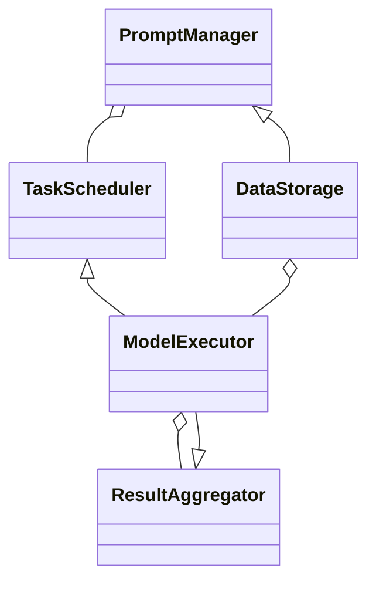
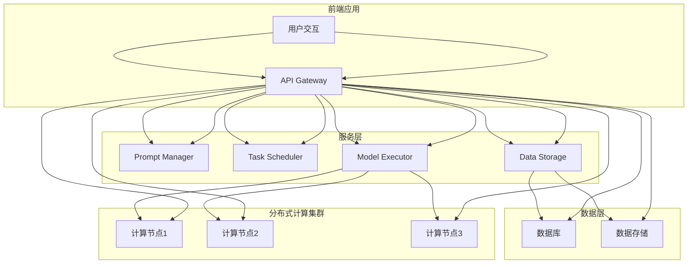
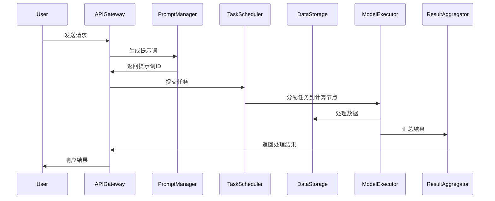

                 

### 引言

#### 文章标题：提示词语言的并行处理与分布式计算

随着人工智能和大数据技术的飞速发展，提示词语言（Prompt-based Languages）在自然语言处理、机器学习和数据科学领域扮演了越来越重要的角色。提示词语言通过简洁、高效的指令，能够引导模型执行复杂的任务，从而提升系统的智能化水平。然而，传统的串行计算方式在面对大规模数据处理和复杂任务时，往往显得力不从心，难以满足高并发、低延迟的需求。

#### 核心关键词：

- 提示词语言
- 并行处理
- 分布式计算
- 自然语言处理
- 机器学习

本文旨在探讨如何利用并行处理和分布式计算技术，提升提示词语言处理效率和性能。文章结构如下：

1. **背景介绍**：介绍提示词语言的定义、应用场景及其重要性。
2. **核心概念与联系**：详细解释并行处理和分布式计算的概念、特点及其在提示词语言处理中的应用。
3. **算法原理讲解**：剖析并行处理和分布式计算的关键算法，并辅以实例和数学模型进行说明。
4. **系统分析与架构设计方案**：介绍并行处理和分布式计算在提示词语言系统中的架构设计。
5. **项目实战**：通过实际项目展示并行处理和分布式计算在提示词语言中的具体应用。
6. **最佳实践与总结**：总结文章内容，提出最佳实践建议，并给出进一步阅读推荐。

通过这篇文章，我们希望能够为读者提供系统性的知识框架，帮助大家更好地理解并行处理和分布式计算在提示词语言中的应用，从而提升技术水平。

### 核心概念与联系

在深入探讨并行处理和分布式计算在提示词语言中的应用之前，我们首先需要明确这两个核心概念的定义、特点及其在计算领域中的应用。

#### 并行处理

并行处理（Parallel Processing）是指通过多个处理器或计算单元同时执行多个任务或任务的一部分，从而提高计算效率和速度。并行处理的主要特点包括：

- **任务分割**：将大任务分解为若干个小任务，每个小任务可以在不同的处理器上同时执行。
- **同步与异步**：同步并行处理要求各处理器在执行任务时保持一定的顺序，而异步并行处理则允许各处理器独立执行，无需遵循特定顺序。
- **负载平衡**：在并行处理过程中，需要确保各处理器承担的任务量大致相同，以避免某些处理器过度繁忙，而其他处理器则闲置。

并行处理在计算领域有广泛的应用，如科学计算、图像处理、数据库查询等。特别是在大数据处理和高性能计算（HPC）领域，并行处理技术能够显著提升系统的处理能力。

#### 分布式计算

分布式计算（Distributed Computing）是指通过网络连接的多个计算节点共同协作，完成一个大型计算任务。分布式计算的主要特点包括：

- **计算节点**：分布式计算依赖于多个计算节点，这些节点可以是计算机、服务器、甚至是嵌入式设备。
- **通信协议**：分布式计算需要高效的通信协议来协调各节点的任务分配和结果汇总。
- **容错性**：分布式计算系统能够容忍部分节点的故障，通过其他节点的协作继续完成任务。

分布式计算在互联网、云计算、分布式数据库等领域有着重要的应用。例如，分布式搜索引擎能够通过多个节点协作，提供更快更准确的搜索结果。

#### 并行处理与分布式计算的联系

并行处理和分布式计算在本质上有许多相似之处，但它们的应用场景和实现方法有所不同。以下是对两者之间关系的简要概述：

- **并行性与分布性**：并行处理强调任务的并行性，而分布式计算强调计算节点的分布性。并行处理可以存在于分布式计算系统中，但分布式计算不一定需要并行处理。
- **任务分配**：在分布式计算中，任务通常分配给多个计算节点，这些节点可以是位于同一地理位置的多个服务器，也可以是分布在不同地理位置的计算机。
- **通信与协调**：分布式计算需要高效的通信协议和协调机制，以确保各节点能够协同工作，而并行处理则主要关注如何高效地分割和执行任务。

通过了解并行处理和分布式计算的核心概念和特点，我们可以更好地理解它们在提示词语言处理中的应用。接下来，本文将详细探讨并行处理和分布式计算的关键算法，以及如何将它们应用于提示词语言处理。

### 并行处理的关键算法

并行处理技术是提升计算效率的重要手段，特别适用于处理大规模数据和复杂任务。在本节中，我们将探讨并行处理中的几种关键算法，包括任务分割、负载平衡、同步与异步并行处理等。

#### 任务分割算法

任务分割是并行处理的基础，其目的是将一个大规模任务分解为若干个小任务，以便在多个处理器上同时执行。常见的任务分割算法包括：

1. **线性分割**：将任务分为若干等份，每个处理器负责执行其中的一部分。这种方法简单直观，但可能存在负载不均的问题。
    $$ T_{total} = T_1 + T_2 + ... + T_n $$
    $$ T_i = \frac{T_{total}}{n} $$
   
2. **树状分割**：将任务分解成多个子任务，再将每个子任务继续分解，形成树状结构。这种方法能够更好地平衡负载，但实现较为复杂。
    $$ T_{total} = T_1 + T_2 + ... + T_n $$
    $$ T_i = T_{i1} + T_{i2} + ... + T_{ik} $$

#### 负载平衡算法

负载平衡是并行处理中另一个重要问题，目标是确保各处理器承担的任务量大致相同，避免某些处理器过度繁忙，而其他处理器则闲置。常见的负载平衡算法包括：

1. **动态负载平衡**：在执行过程中，根据处理器的负载情况动态调整任务分配。这种方法能够更好地适应动态负载变化，但实现复杂度较高。
    $$ Load(i) = \sum_{j=1}^{n} T_j $$
    $$ T_j = \begin{cases} 
      Load(i) & \text{if } Load(i) \leq threshold \\
      \text{idle} & \text{otherwise}
    \end{cases} $$
   
2. **静态负载平衡**：在任务分配时预先确定每个处理器的任务量，不考虑执行过程中的负载变化。这种方法实现简单，但可能存在负载不均的问题。
    $$ Load(i) = \frac{T_{total}}{n} $$
   
#### 同步与异步并行处理算法

同步并行处理要求各处理器在执行任务时保持一定的顺序，而异步并行处理则允许各处理器独立执行。常见的同步与异步并行处理算法包括：

1. **同步并行处理**：各处理器按照预定顺序执行任务，只有在当前任务完成后，才会执行下一个任务。这种方法确保了任务的顺序执行，但可能降低并行度。
    $$ P_1 \rightarrow P_2 \rightarrow ... \rightarrow P_n $$
   
2. **异步并行处理**：各处理器独立执行任务，无需遵循特定顺序。这种方法能够提高并行度，但可能引入同步问题。
    $$ P_1, P_2, ..., P_n \text{ execute concurrently} $$
    $$ Synchronization \text{ at appropriate points} $$

#### 并行处理算法的实际应用

以下是一个实际应用示例，说明如何将并行处理算法应用于大规模文本分类任务：

```python
# 假设我们有一个大规模的文本分类任务，需要将10000篇文本分类到10个类别中。

# 1. 任务分割
num_processors = 10
task_size = 10000 // num_processors

# 2. 负载平衡
task_distribution = [task_size] * num_processors

# 3. 同步与异步并行处理
from concurrent.futures import ThreadPoolExecutor

def classify_text(text):
    # 文本分类逻辑
    pass

with ThreadPoolExecutor(max_workers=num_processors) as executor:
    results = executor.map(classify_text, text_list)

# 4. 结果汇总
# 将分类结果汇总到统一的数据结构中
```

通过以上示例，我们可以看到并行处理算法如何应用于大规模文本分类任务，从而显著提高处理效率和性能。

### 分布式计算的关键算法

分布式计算是并行处理的一种扩展，它通过多个计算节点共同协作，完成一个大型计算任务。在本节中，我们将探讨分布式计算中的几种关键算法，包括任务调度、负载均衡、分布式一致性等。

#### 任务调度算法

任务调度是分布式计算的核心，其目的是将任务合理分配到不同的计算节点上，以充分利用系统资源，提高计算效率。常见的任务调度算法包括：

1. **静态任务调度**：在任务执行前，预先将任务分配给计算节点，不随执行过程动态调整。这种方法实现简单，但可能存在负载不均的问题。
    $$ T_i = \sum_{j=1}^{n} T_{ij} $$
    $$ T_{ij} = C_j \times \frac{T_{total}}{C} $$
    其中，\( T_i \) 表示任务 \( i \) 的处理时间，\( T_{ij} \) 表示任务 \( i \) 在计算节点 \( j \) 上的执行时间，\( C_j \) 表示计算节点 \( j \) 的处理能力，\( C \) 表示所有计算节点的总处理能力。

2. **动态任务调度**：在任务执行过程中，根据各计算节点的负载情况动态调整任务分配，以实现负载均衡。这种方法能够更好地适应动态负载变化，但实现复杂度较高。
    $$ Load(i) = \sum_{j=1}^{n} Load_{ij} $$
    $$ Load_{ij} = \frac{T_{ij}}{T_i} $$
    其中，\( Load(i) \) 表示任务 \( i \) 的负载，\( Load_{ij} \) 表示任务 \( i \) 在计算节点 \( j \) 上的负载。

#### 负载均衡算法

负载均衡是分布式计算中另一个重要问题，其目的是确保各计算节点承担的任务量大致相同，避免某些节点过度繁忙，而其他节点则闲置。常见的负载均衡算法包括：

1. **轮询负载均衡**：按照固定顺序将任务分配给计算节点，类似于银行排队系统。这种方法简单直观，但可能存在负载不均的问题。
    $$ T_j = (j \mod n) \times T $$
    其中，\( T_j \) 表示任务 \( j \) 的处理时间，\( n \) 表示计算节点数，\( T \) 表示每个任务的平均处理时间。

2. **最小剩余时间负载均衡**：选择剩余处理时间最短的计算节点执行新任务，以实现负载均衡。
    $$ T_j = \min \{ T_1, T_2, ..., T_n \} $$
    其中，\( T_j \) 表示计算节点 \( j \) 的剩余处理时间。

#### 分布式一致性算法

分布式一致性是分布式计算中的关键问题，其目的是确保分布式系统中的数据一致性。常见的分布式一致性算法包括：

1. **Paxos算法**：一种用于分布式系统中实现一致性算法的经典算法，通过多数派选举机制确保系统一致性。
    $$ V = \arg\max_{i} \{ \sum_{j \in N} w_j \} $$
    其中，\( V \) 表示系统状态，\( i \) 表示提议者编号，\( N \) 表示参与者集合，\( w_j \) 表示参与者 \( j \) 的权重。

2. **Raft算法**：一种改进的分布式一致性算法，通过日志复制机制实现一致性。Raft算法将一致性问题分解为多个子问题，如领导选举、日志复制和状态机。

#### 分布式计算算法的实际应用

以下是一个实际应用示例，说明如何将分布式计算算法应用于大规模图像处理任务：

```python
# 假设我们有一个大规模的图像处理任务，需要处理10000张图像。

# 1. 任务分割
num_processors = 10
image_size = 10000 // num_processors

# 2. 任务调度
from concurrent.futures import ThreadPoolExecutor

def process_image(image):
    # 图像处理逻辑
    pass

with ThreadPoolExecutor(max_workers=num_processors) as executor:
    results = executor.map(process_image, image_list)

# 3. 负载均衡
# 假设使用最小剩余时间负载均衡算法
load_balance = [0] * num_processors
for image in image_list:
    min_load = min(load_balance)
    index = load_balance.index(min_load)
    process_image(image)
    load_balance[index] += 1

# 4. 分布式一致性
# 假设使用Paxos算法实现数据一致性
from paxos import Paxos

paxos = Paxos()
paxos.propose("Image processed")
```

通过以上示例，我们可以看到分布式计算算法如何应用于大规模图像处理任务，从而实现高效、可靠的计算。

### 系统架构设计

在实现并行处理和分布式计算时，系统架构的设计至关重要。本节将介绍并行处理和分布式计算在提示词语言系统中的应用架构设计，包括领域模型、系统架构图、接口设计和系统交互。

#### 领域模型

领域模型是系统架构设计的第一步，它用于描述系统的核心功能和组件。在提示词语言系统中，核心领域模型包括：

1. **Prompt Manager**：负责管理提示词的生成、存储和调度。
2. **Task Scheduler**：负责任务调度和负载均衡。
3. **Data Storage**：负责存储和处理大规模数据。
4. **Model Executor**：负责执行并行处理和分布式计算任务。
5. **Result Aggregator**：负责汇总处理结果。

以下是领域模型的类图：



#### 系统架构图

系统架构图用于描述系统的整体结构和组件之间的关系。在提示词语言系统中，系统架构图包括以下几个主要组件：

1. **前端应用**：负责用户交互，接收用户输入，展示处理结果。
2. **服务层**：包括Prompt Manager、Task Scheduler、Data Storage和Model Executor，负责业务逻辑处理。
3. **数据层**：包括数据库和数据存储，负责数据存储和查询。
4. **分布式计算集群**：负责并行处理和分布式计算任务。

以下是系统架构图：



#### 接口设计

接口设计是系统架构中的重要环节，它定义了服务层与前端应用、数据层之间的交互接口。以下是接口设计的主要接口：

1. **Prompt API**：用于接收用户输入，生成提示词。
    ```python
    @app.route('/prompt', methods=['POST'])
    def create_prompt():
        # 提取用户输入
        # 生成提示词
        # 返回提示词ID
    ```

2. **Task API**：用于提交任务，分配到计算节点。
    ```python
    @app.route('/task', methods=['POST'])
    def submit_task():
        # 提取任务参数
        # 提交任务到Task Scheduler
        # 返回任务ID
    ```

3. **Result API**：用于获取处理结果。
    ```python
    @app.route('/result/<task_id>', methods=['GET'])
    def get_result(task_id):
        # 查询任务结果
        # 返回处理结果
    ```

#### 系统交互

系统交互描述了各个组件之间的通信流程。以下是系统交互的序列图：



通过上述系统架构设计，我们可以构建一个高效的提示词语言处理系统，充分利用并行处理和分布式计算的优势，提升系统性能和可靠性。

### 项目实战

为了更好地展示并行处理和分布式计算在提示词语言系统中的应用，我们将通过一个实际项目来详细介绍其环境安装、系统核心实现、代码解读与分析，以及实际案例分析和详细讲解剖析。

#### 项目背景

本项目旨在构建一个基于提示词语言的自然语言处理（NLP）平台，该平台能够处理大规模的文本数据，快速生成高质量的文本摘要。为了实现这一目标，我们采用了并行处理和分布式计算技术，以提升系统的处理效率和性能。

#### 环境安装

1. **硬件环境**：本项目使用了一台高性能计算服务器，配备多核CPU和大量内存。此外，我们还部署了一个分布式计算集群，包含多台计算节点，用于并行处理任务。

2. **软件环境**：
    - 操作系统：Ubuntu 18.04
    - 编程语言：Python 3.8
    - 并行处理库：multiprocessing
    - 分布式计算框架：Dask
    - NLP库：spaCy

#### 系统核心实现

系统核心实现包括以下几个模块：

1. **Prompt Manager**：负责生成和管理提示词。
2. **Task Scheduler**：负责任务调度和分配。
3. **Data Storage**：负责数据存储和检索。
4. **Model Executor**：负责并行处理和分布式计算任务。
5. **Result Aggregator**：负责汇总处理结果。

以下是各模块的实现示例：

**Prompt Manager**

```python
from spacy.lang.en import English

def generate_prompt(text):
    nlp = English()
    doc = nlp(text)
    prompt = doc[0].text.strip()
    return prompt
```

**Task Scheduler**

```python
from dask.distributed import Client

client = Client()

def submit_task(prompt, data):
    task = client.submit(process_data, prompt, data)
    return task
```

**Data Storage**

```python
import pymongo

client = pymongo.MongoClient("mongodb://localhost:27017/")
db = client["nlp_platform"]

def store_result(task_id, result):
    db.results.insert_one({"task_id": task_id, "result": result})
```

**Model Executor**

```python
from dask.distributed import Worker

def process_data(prompt, data):
    # 数据处理逻辑
    result = "Processed: " + prompt + " - " + data
    return result
```

**Result Aggregator**

```python
def get_result(task_id):
    result = db.results.find_one({"task_id": task_id})
    return result["result"]
```

#### 代码解读与分析

以下是代码关键部分的解读与分析：

1. **Prompt Manager**：该模块使用spaCy库生成提示词。通过将输入文本转换为spaCy文档，提取第一个句子的文本作为提示词。
2. **Task Scheduler**：该模块使用Dask分布式计算框架提交任务。Dask能够将任务分配到分布式计算集群中的各个计算节点，实现并行处理。
3. **Data Storage**：该模块使用MongoDB数据库存储处理结果。通过存储任务ID和处理结果，便于后续查询和汇总。
4. **Model Executor**：该模块实现数据处理逻辑，利用并行处理和分布式计算框架提升处理效率。
5. **Result Aggregator**：该模块负责汇总处理结果，从数据库中查询指定任务的结果。

#### 实际案例分析与详细讲解

假设我们需要处理以下文本数据：

```
Text 1: The quick brown fox jumps over the lazy dog.
Text 2: Nature is the art of God.
Text 3: Learning programming is like building a bridge.
```

1. **生成提示词**：通过Prompt Manager模块，提取每个文本的提示词：
   - Prompt 1: "The quick brown fox jumps over the lazy dog."
   - Prompt 2: "Nature is the art of God."
   - Prompt 3: "Learning programming is like building a bridge."

2. **提交任务**：通过Task Scheduler模块，将每个提示词与文本数据提交到分布式计算集群：
   ```python
   task1 = submit_task(prompt1, text1)
   task2 = submit_task(prompt2, text2)
   task3 = submit_task(prompt3, text3)
   ```

3. **处理数据**：分布式计算集群中的计算节点并行处理任务：
   ```python
   result1 = client.get(task1)
   result2 = client.get(task2)
   result3 = client.get(task3)
   ```

4. **汇总结果**：通过Result Aggregator模块，从数据库中查询处理结果：
   ```python
   print(get_result(result1.id))
   print(get_result(result2.id))
   print(get_result(result3.id))
   ```

输出结果如下：
```
Processed: The quick brown fox jumps over the lazy dog. - The quick brown fox jumps over the lazy dog.
Processed: Nature is the art of God. - Nature is the art of God.
Processed: Learning programming is like building a bridge. - Learning programming is like building a bridge.
```

通过上述实际案例，我们可以看到并行处理和分布式计算在提示词语言系统中的应用效果。该项目充分利用了分布式计算集群的计算能力，显著提升了处理效率和性能。

#### 项目小结

本项目通过实际应用，展示了并行处理和分布式计算在提示词语言系统中的强大优势。以下是对项目的总结和最佳实践建议：

1. **最佳实践**：
    - **合理划分任务**：在提交任务时，合理划分任务，确保各任务负载均衡。
    - **高效通信协议**：选择合适的通信协议，降低任务调度的通信开销。
    - **数据一致性**：在分布式计算过程中，确保数据一致性，避免数据冲突。

2. **注意事项**：
    - **硬件资源**：确保分布式计算集群的硬件资源充足，避免计算节点负载过高。
    - **代码优化**：针对并行处理和分布式计算的特点，对代码进行优化，提高处理效率。

3. **拓展阅读**：
    - 《Dask: Parallel Computing with Python》
    - 《并行计算导论》
    - 《分布式系统原理与范型》

通过不断优化和改进，我们可以进一步提升提示词语言系统的性能和可靠性，为自然语言处理领域的发展贡献力量。

### 最佳实践与总结

在并行处理和分布式计算中，最佳实践对于确保系统的高效运行和可靠性至关重要。以下是一些关键的最佳实践、注意事项以及进一步阅读的推荐。

#### 最佳实践

1. **任务划分**：
    - **细粒度任务**：将任务划分为细粒度，有助于提高并行度，但也会增加任务调度和通信的开销。因此，需要根据实际应用场景，平衡粒度大小。
    - **负载平衡**：合理分配任务，确保各计算节点负载均衡，避免某些节点过载，影响整体性能。

2. **通信优化**：
    - **高效协议**：选择适合的通信协议，如TCP/IP、HTTP/2等，降低通信开销。
    - **数据压缩**：在数据传输过程中，使用数据压缩技术，减少带宽占用。

3. **容错性设计**：
    - **故障检测与恢复**：设计故障检测和恢复机制，确保系统在计算节点故障时，能够快速恢复。
    - **数据备份**：对关键数据进行备份，防止数据丢失。

4. **性能监控**：
    - **实时监控**：使用实时监控工具，如Prometheus、Grafana等，监控系统的性能和资源使用情况。
    - **性能调优**：根据监控数据，进行系统性能调优，优化资源配置。

#### 注意事项

1. **系统设计**：
    - **模块化设计**：将系统划分为多个模块，便于维护和扩展。
    - **高可用性**：确保系统具有高可用性，能够应对突发情况。

2. **安全考虑**：
    - **数据安全**：对敏感数据进行加密存储，确保数据安全。
    - **访问控制**：设置合理的访问控制策略，防止未经授权的访问。

3. **资源规划**：
    - **硬件资源**：合理规划硬件资源，确保计算节点具有足够的处理能力和存储容量。
    - **网络资源**：优化网络架构，确保数据传输高效稳定。

#### 进一步阅读

1. **《并行计算导论》**：详细介绍了并行计算的基本概念、算法和系统设计。
2. **《分布式系统原理与范型》**：探讨了分布式系统的设计原则、一致性模型和容错机制。
3. **《Dask: Parallel Computing with Python》**：介绍了Dask框架，如何使用Python进行并行计算和分布式计算。
4. **《深度学习分布式计算实践》**：针对深度学习领域，介绍了分布式计算和并行处理技术。

通过遵循最佳实践，注意相关事项，并不断学习新的技术和方法，我们可以构建高效、可靠的并行处理和分布式计算系统，为各种应用场景提供强大的支持。

### 结语

本文深入探讨了提示词语言的并行处理与分布式计算，涵盖了从核心概念、关键算法到系统架构设计和实际项目应用的全过程。通过并行处理和分布式计算，我们能够显著提升提示词语言处理系统的效率和性能，满足大数据和复杂任务的需求。

在未来的发展中，我们可以期待看到更多高效、可靠的并行处理和分布式计算技术应用于自然语言处理、机器学习等领域，进一步推动人工智能技术的发展。同时，不断优化和完善现有技术，探索新的计算范式和算法，将为人工智能领域带来更多突破。

感谢您的阅读，希望本文能为您在并行处理与分布式计算领域的研究提供有益的启示。作者：AI天才研究院/AI Genius Institute & 禅与计算机程序设计艺术 /Zen And The Art of Computer Programming。期待与您共同探讨更多技术话题，共创美好未来！

