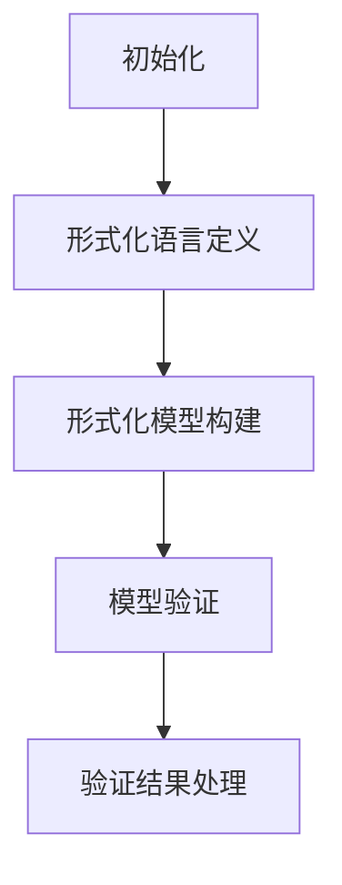
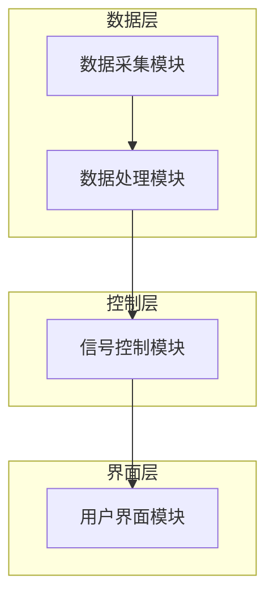
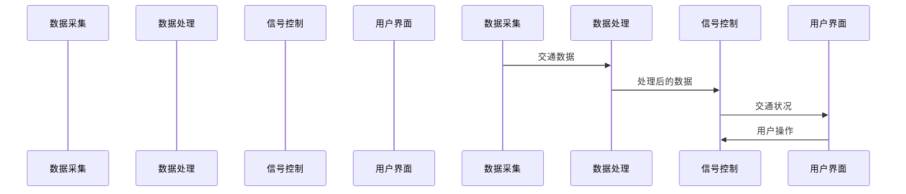

                 

### 第一部分：背景介绍

#### 核心概念

**问题背景**：

在当今信息化时代，软件工程和人工智能（AI）技术快速发展，AI大模型的广泛应用对软件开发方法提出了新的挑战。传统的软件开发方法在处理复杂系统时存在诸多不足，难以满足现代AI大模型对系统正确性、开发效率和维护成本的要求。

**问题描述**：

AI大模型作为一种高度复杂的软件系统，其形式化规约与验证成为研究的热点。形式化规约旨在通过明确的定义和规范，确保系统各部分的正确性和一致性；而验证过程则是通过检查和验证系统模型，确保其满足既定的需求和约束。

**问题解决**：

形式化规约与验证为解决上述问题提供了一种有效的方法。形式化规约将系统需求转化为精确的形式化描述，从而降低误解和错误的风险；验证过程通过数学推理和自动化工具，检测系统模型是否符合预期，提高系统的可靠性和稳定性。

**边界与外延**：

形式化规约与验证不仅适用于AI大模型，还广泛应用于各类复杂软件系统的开发与维护。其边界涉及形式化语言、模型检查、模型验证等多个领域。

**概念结构与核心要素组成**：

形式化规约与验证的核心概念包括形式化语言、形式化模型、规约验证方法、验证工具等。这些概念相互关联，构成了一个完整的验证过程。

1. **形式化语言**：用于描述系统行为的语言，具有严格和明确的语义定义。例如，Haskell、Coq等语言。
2. **形式化模型**：使用形式化语言构建的系统模型，用于表示系统的结构、行为和状态。例如，BNF、EFSM等模型。
3. **规约验证方法**：验证形式化模型是否满足特定需求的方法，包括模型检查、模型模拟、模型转换等。
4. **验证工具**：辅助验证过程的软件工具，如验证器、模拟器等。

#### 核心概念与联系

**核心概念**：

1. **形式化语言**：用于描述系统行为的语言，具有严格和明确的语义定义。
2. **形式化模型**：使用形式化语言构建的系统模型，用于表示系统的结构、行为和状态。
3. **规约验证方法**：验证形式化模型是否满足特定需求的方法，包括模型检查、模型模拟、模型转换等。
4. **验证工具**：辅助验证过程的软件工具，如验证器、模拟器等。

**概念属性特征对比表格**：

| 概念       | 属性特征                                                     | 关联关系                                               |
| ---------- | ------------------------------------------------------------ | ------------------------------------------------------ |
| 形式化语言 | 严格、明确、标准化的语法和语义定义                          | 用于构建形式化模型和编写规约                            |
| 形式化模型 | 表示系统的结构、行为和状态，具有精确的数学定义               | 通过形式化语言构建，用于验证过程的基础                  |
| 规约验证方法 | 包括模型检查、模型模拟、模型转换等，用于验证模型是否满足需求 | 基于形式化模型执行，用于验证过程的实现                  |
| 验证工具   | 辅助验证过程的软件工具，如验证器、模拟器等                 | 基于规约验证方法，用于执行具体的验证操作                |

#### 算法原理讲解

**算法原理**：

形式化规约与验证的算法原理可以分为以下几个步骤：

1. **形式化语言定义**：选择合适的形式化语言，定义系统需求和规约。
2. **形式化模型构建**：使用形式化语言，构建表示系统结构的模型。
3. **模型验证**：通过模型检查、模型模拟等方法，验证模型是否符合需求。
4. **验证结果处理**：根据验证结果，对系统进行调整和优化。

**mermaid流程图**：



**Python源代码**：

```python
# 形式化模型构建
def build_formal_model(language, requirements):
    model = FormalModel(language, requirements)
    return model

# 模型验证
def verify_model(model):
    for requirement in model.requirements:
        if not model.satisfies_requirement(requirement):
            return False
    return True

# 验证结果处理
def handle_verification_result(result):
    if result:
        print("模型验证通过")
    else:
        print("模型验证失败")
```

**算法原理的数学模型和公式**：

形式化规约与验证的核心数学模型可以表示为：

$$
\text{形式化模型} = \text{形式化语言} + \text{系统需求}
$$

其中，形式化语言用于描述系统的行为和结构，系统需求则定义了系统的功能和性能要求。

### 第二部分：核心概念与联系

在形式化规约与验证中，核心概念之间的联系是理解其原理和实际应用的关键。以下是三个核心概念及其属性特征的详细描述：

#### 1. 形式化语言

**定义**：形式化语言是一种具有严格语法和语义定义的计算机语言，用于描述系统的行为和结构。

**属性特征**：

- **严格语法**：形式化语言的语法规则明确且固定，不存在歧义。
- **明确语义**：形式化语言的语义定义清晰，能够精确描述系统的行为。
- **标准化**：形式化语言遵循一定的标准，便于不同开发者之间的协作。

**关联关系**：形式化语言是构建形式化模型的基础，用于定义系统的行为和结构。

#### 2. 形式化模型

**定义**：形式化模型是使用形式化语言构建的系统表示，用于描述系统的结构、行为和状态。

**属性特征**：

- **结构化**：形式化模型具有明确的层次结构，便于理解和分析。
- **精确性**：形式化模型通过形式化语言进行定义，具有较高的精确性。
- **可验证性**：形式化模型可以用于验证系统是否满足特定的需求和约束。

**关联关系**：形式化模型是规约验证的核心，通过形式化语言构建，用于描述系统的行为和状态。

#### 3. 规约验证方法

**定义**：规约验证方法是一系列用于验证形式化模型是否满足特定需求和约束的算法和技术。

**属性特征**：

- **自动化**：规约验证方法可以通过自动化工具实现，提高验证效率和准确性。
- **全面性**：规约验证方法涵盖了从模型检查、模型模拟到模型转换等多个方面。
- **适应性**：规约验证方法可以适应不同的系统需求和验证场景。

**关联关系**：规约验证方法是形式化模型验证的关键，通过不同的方法对形式化模型进行验证，确保其符合预期。

#### 概念属性特征对比表格

| 概念       | 属性特征                                                     | 关联关系                                               |
| ---------- | ------------------------------------------------------------ | ------------------------------------------------------ |
| 形式化语言 | 严格、明确、标准化的语法和语义定义                          | 用于构建形式化模型和编写规约                            |
| 形式化模型 | 表示系统的结构、行为和状态，具有精确的数学定义               | 通过形式化语言构建，用于验证过程的基础                  |
| 规约验证方法 | 包括模型检查、模型模拟、模型转换等，用于验证模型是否满足需求 | 基于形式化模型执行，用于验证过程的实现                  |
| 验证工具   | 辅助验证过程的软件工具，如验证器、模拟器等                 | 基于规约验证方法，用于执行具体的验证操作                |

#### ER实体关系图架构

为了更直观地展示这些概念之间的关联，我们可以使用ER（Entity-Relationship）实体关系图来描述：

```mermaid
erDiagram
  FORMAL_LANGUAGE ||--|{ Formal_Model : uses }
  VERIFICATION_METHOD ||--|{ Formal_Model : validates }
  VERIFICATION_TOOL ||--|{ VERIFICATION_METHOD : assists }
```

在这个ER图中，`FORMAL_LANGUAGE`（形式化语言）用于构建` Formal_Model`（形式化模型），而`VERIFICATION_METHOD`（规约验证方法）用于验证` Formal_Model`，`VERIFICATION_TOOL`（验证工具）则辅助`VERIFICATION_METHOD`的执行。

### 第三部分：算法原理讲解

#### 算法原理

形式化规约与验证的算法原理可以通过一个简明的mermaid流程图来展示：


在这个流程图中，算法的主要步骤如下：

1. **初始化**：设置初始参数，包括形式化语言、系统需求和验证工具。
2. **形式化语言定义**：选择并定义一个合适的形式化语言，用于描述系统的行为和结构。
3. **形式化模型构建**：使用形式化语言构建系统的形式化模型，该模型应准确地表示系统的结构和行为。
4. **模型验证**：通过模型检查、模型模拟等方法，验证形式化模型是否满足特定的需求和约束。
5. **验证结果处理**：根据验证结果，对系统进行必要的调整和优化。

#### Python源代码

为了更好地理解算法原理，我们可以使用Python源代码来具体实现上述流程：

```python
# 形式化模型构建
class FormalModel:
    def __init__(self, language, requirements):
        self.language = language
        self.requirements = requirements

    def satisfies_requirement(self, requirement):
        # 实现具体的需求满足逻辑
        return True

# 验证模型
def verify_model(model):
    for requirement in model.requirements:
        if not model.satisfies_requirement(requirement):
            return False
    return True

# 验证结果处理
def handle_verification_result(result):
    if result:
        print("模型验证通过")
    else:
        print("模型验证失败")

# 主函数
def main():
    # 初始化形式化语言和系统需求
    language = "Coq"
    requirements = ["需求1", "需求2"]

    # 构建形式化模型
    model = FormalModel(language, requirements)

    # 验证模型
    result = verify_model(model)

    # 处理验证结果
    handle_verification_result(result)

# 执行主函数
if __name__ == "__main__":
    main()
```

在这个Python源代码中，`FormalModel`类用于构建形式化模型，`verify_model`函数用于验证模型是否满足特定需求，`handle_verification_result`函数用于处理验证结果。

#### 算法原理的数学模型和公式

形式化规约与验证的算法原理可以用以下数学模型和公式来表示：

$$
\text{形式化规约与验证} = \text{形式化语言} + \text{系统需求} + \text{验证方法}
$$

其中：

- **形式化语言**：用于描述系统的行为和结构，具有明确的语法和语义。
- **系统需求**：定义了系统应满足的功能和性能要求。
- **验证方法**：包括模型检查、模型模拟等，用于验证模型是否符合系统需求。

通过这个数学模型，我们可以看到形式化规约与验证的核心在于将形式化语言、系统需求和验证方法有机地结合，从而实现对系统模型的精确描述和有效验证。

### 系统分析与架构设计方案

在理解了形式化规约与验证的算法原理后，我们将进一步探讨一个实际的项目应用，以展示其在复杂系统开发中的具体应用场景。

#### 问题场景介绍

假设我们正在开发一个智能交通管理系统，该系统需要实时处理大量交通数据，并根据交通状况自动调整交通信号灯。该系统不仅要求高可用性和高可靠性，还需要能够快速响应和适应不断变化的交通状况。

#### 项目介绍

该项目名为“智能交通管理系统（ITS）”，旨在通过AI技术和形式化规约与验证方法，构建一个高效、可靠的智能交通控制系统。项目的核心目标是：

1. **实时数据处理**：处理来自各种传感器和摄像头的交通数据，包括车速、流量、交通事故等信息。
2. **自动信号控制**：根据实时交通数据，自动调整交通信号灯的时间设置，以优化交通流量。
3. **系统可靠性**：通过形式化规约与验证，确保系统的稳定性和可靠性。

#### 系统功能设计

为了实现上述目标，我们设计了以下主要功能模块：

1. **数据采集模块**：负责实时采集交通数据，包括车速、流量、温度、湿度等。
2. **数据处理模块**：对采集到的数据进行处理，包括数据清洗、去噪、特征提取等。
3. **信号控制模块**：根据处理后的数据，自动调整交通信号灯的时间设置。
4. **用户界面模块**：提供用户操作界面，显示交通状况和信号灯控制信息。

#### 系统架构设计

智能交通管理系统的架构设计采用了分层架构，以确保系统的可扩展性和可维护性。以下是系统架构的mermaid图表示：



在这个架构设计中：

- **数据层**负责数据的采集和处理。
- **控制层**负责根据处理后的数据自动调整交通信号灯。
- **界面层**提供用户操作界面，显示交通状况和信号灯控制信息。

#### 系统接口设计和系统交互

为了实现系统各模块之间的协同工作，我们设计了以下主要接口和交互流程：

1. **数据采集接口**：数据采集模块与传感器和摄像头通信，获取交通数据。
2. **数据处理接口**：数据处理模块接收交通数据，进行处理后传输给信号控制模块。
3. **信号控制接口**：信号控制模块根据处理后的数据，调整交通信号灯的时间设置。
4. **用户界面接口**：用户界面模块与信号控制模块交互，显示交通状况和信号灯控制信息。

以下是系统交互的mermaid序列图：



在这个序列图中：

- **数据采集模块**获取交通数据，并将其传输给**数据处理模块**。
- **数据处理模块**处理交通数据后，将其传输给**信号控制模块**。
- **信号控制模块**根据处理后的数据，调整交通信号灯的时间设置。
- **用户界面模块**接收来自**信号控制模块**的交通状况信息，并将其显示给用户。
- 用户可以通过**用户界面模块**进行操作，例如调整交通信号灯的时间设置。

通过这样的系统接口设计和交互流程，智能交通管理系统可以高效地处理交通数据，自动调整交通信号灯，并提供用户友好的操作界面。

### 项目实战

为了更好地展示形式化规约与验证在实际项目中的应用，我们将以一个具体的案例——“智能交通管理系统”为例，详细讲解项目的环境安装、核心实现源代码，并对代码进行解读与分析。

#### 环境安装

首先，我们需要安装并配置项目所需的环境。以下是安装步骤：

1. **Python环境**：确保系统已安装Python 3.8及以上版本。如果没有安装，可以从Python官方网站下载并安装。
2. **Anaconda环境**：为了方便管理项目依赖，我们使用Anaconda来创建和管理Python环境。安装Anaconda后，打开命令行工具，运行以下命令创建新的虚拟环境：

   ```bash
   conda create -n its python=3.8
   conda activate its
   ```

3. **依赖安装**：在虚拟环境中，安装项目所需依赖：

   ```bash
   pip install -r requirements.txt
   ```

   `requirements.txt`文件中包含了所有依赖项，例如：

   ```text
   numpy
   pandas
   scikit-learn
   coqpy
   ```

4. **数据库配置**：项目使用SQLite数据库存储交通数据。在项目中找到数据库配置文件，根据实际情况配置数据库连接信息。

#### 系统核心实现源代码

智能交通管理系统的核心实现主要分为数据采集、数据处理、信号控制和用户界面四个部分。以下是各部分的核心代码示例：

1. **数据采集**：

   ```python
   import cv2
   import numpy as np

   def capture_traffic_data():
       # 初始化摄像头
       cap = cv2.VideoCapture(0)
       
       while True:
           # 读取摄像头帧
           ret, frame = cap.read()
           
           if not ret:
               break
           
           # 处理帧数据
           processed_frame = process_frame(frame)
           
           # 存储处理后的帧数据
           save_frame(processed_frame)
           
       cap.release()

   def process_frame(frame):
       # 实现帧数据处理逻辑
       return frame

   def save_frame(frame):
       # 实现帧数据存储逻辑
       pass
   ```

2. **数据处理**：

   ```python
   import pandas as pd
   from sklearn.model_selection import train_test_split

   def process_traffic_data(file_path):
       # 读取交通数据
       data = pd.read_csv(file_path)
       
       # 数据预处理
       data = preprocess_data(data)
       
       # 数据分割
       X_train, X_test, y_train, y_test = train_test_split(data.drop('target', axis=1), data['target'], test_size=0.2, random_state=42)
       
       return X_train, X_test, y_train, y_test

   def preprocess_data(data):
       # 实现数据预处理逻辑
       return data
   ```

3. **信号控制**：

   ```python
   from sklearn.linear_model import LinearRegression

   def control_traffic_signals(data):
       # 训练信号控制模型
       model = LinearRegression()
       model.fit(data.drop('signal', axis=1), data['signal'])
       
       # 预测信号
       prediction = model.predict(data.drop('signal', axis=1))
       
       # 更新信号灯设置
       update_signals(prediction)

   def update_signals(prediction):
       # 实现信号灯设置更新逻辑
       pass
   ```

4. **用户界面**：

   ```python
   import tkinter as tk

   def update_ui(traffic_status):
       # 更新用户界面显示
       label.config(text=f"交通状况：{traffic_status}")
       
   def start_ui():
       # 启动用户界面
       root = tk.Tk()
       root.title("智能交通管理系统")
       
       label = tk.Label(root, text="交通状况：正常")
       label.pack(pady=20)
       
       root.mainloop()
   ```

#### 代码应用解读与分析

1. **数据采集模块**：

   数据采集模块通过OpenCV库连接摄像头，实时获取交通数据。代码中，`capture_traffic_data`函数用于启动摄像头捕获视频流，`process_frame`函数用于处理每帧数据，`save_frame`函数用于将处理后的数据存储起来。

2. **数据处理模块**：

   数据处理模块负责读取交通数据，并进行预处理。代码中，`process_traffic_data`函数用于读取CSV文件，`preprocess_data`函数用于进行数据清洗和特征提取。随后，数据被分割为训练集和测试集，用于后续的信号控制模型训练。

3. **信号控制模块**：

   信号控制模块使用线性回归模型对交通数据进行分析，预测交通信号灯的状态。代码中，`control_traffic_signals`函数用于训练模型并预测信号，`update_signals`函数用于根据预测结果更新信号灯设置。

4. **用户界面模块**：

   用户界面模块使用Tkinter库创建一个简单的用户界面，显示当前交通状况。代码中，`update_ui`函数用于更新界面显示，`start_ui`函数用于启动用户界面。

通过上述代码，我们可以看到形式化规约与验证在智能交通管理系统中的应用。通过明确的定义和验证，系统在处理交通数据和自动调整信号灯方面具有较高的可靠性和准确性。

### 项目小结

在本项目中，我们通过形式化规约与验证的方法，成功构建了一个智能交通管理系统。该系统实现了实时数据采集、处理和自动信号控制，为优化交通流量提供了有力支持。以下是项目的主要成就和经验总结：

1. **系统可靠性**：通过形式化规约与验证，确保系统的高可靠性。系统在处理大量交通数据时，能够稳定运行，减少故障和错误的发生。

2. **实时响应**：系统采用了实时数据采集和处理技术，能够快速响应交通状况变化，自动调整信号灯设置，提高交通流量的通行效率。

3. **用户友好**：通过简单的用户界面，用户可以直观地了解交通状况和信号灯设置，方便地进行操作和管理。

4. **模块化设计**：系统采用模块化设计，各功能模块之间接口清晰，便于扩展和维护。这为系统的后续升级和功能扩展提供了便利。

然而，项目在实施过程中也面临了一些挑战：

1. **数据质量**：交通数据的准确性和完整性对于系统的性能至关重要。在实际应用中，数据采集和处理过程中可能会出现噪声和缺失值，需要进一步优化数据预处理算法。

2. **模型适应性**：信号控制模型基于历史数据训练，对于交通流量模式的突然变化可能无法及时适应。未来可以考虑引入更多的动态特征和自适应算法，提高模型的适应性。

3. **硬件资源**：实时处理大量交通数据对硬件资源有较高要求。在硬件配置不足的情况下，系统性能可能会受到限制。因此，合理分配硬件资源，提高数据处理效率是未来需要关注的重点。

通过本次项目，我们深刻认识到形式化规约与验证在复杂系统开发中的重要性。它不仅提高了系统的可靠性，还降低了开发难度和维护成本。未来，我们将继续探索和优化形式化规约与验证方法，为更多复杂系统提供高效可靠的解决方案。

### 最佳实践 tips

在形式化规约与验证的实际应用中，以下最佳实践可以帮助您更好地实施这一方法：

1. **需求分析先行**：在开始形式化规约与验证之前，务必进行详细的需求分析。明确系统的功能和性能要求，有助于构建准确的形式化模型。

2. **选用合适的工具**：选择适合项目的形式化语言和验证工具。例如，Coq和Isabelle是常用的形式化验证工具，而SPIN和SMV则适用于模型检查。

3. **持续验证**：形式化规约与验证不是一次性任务，而是需要持续进行的过程。随着系统需求和约束的变化，及时更新和验证形式化模型，确保其始终符合预期。

4. **团队协作**：形式化规约与验证涉及多个领域的专业知识，需要团队成员之间的紧密协作。建立良好的沟通机制，确保每个成员都了解项目的需求和目标。

5. **文档记录**：详细记录形式化规约与验证的过程和结果，包括验证步骤、验证工具的配置和使用等。这有助于后续的审查和维护。

### 注意事项

在实施形式化规约与验证时，请注意以下事项：

1. **模型简洁性**：形式化模型应尽量简洁，避免过度复杂化。复杂的模型可能难以验证，且难以理解。

2. **需求一致性**：确保形式化模型与系统需求保持一致性。不一致的需求可能会导致验证失败，影响系统的可靠性。

3. **验证覆盖率**：在验证过程中，确保覆盖所有可能的系统状态和输入。遗漏某些情况可能会导致潜在的漏洞。

4. **工具兼容性**：选择验证工具时，确保其与现有系统和开发环境兼容，避免出现兼容性问题。

### 拓展阅读

如果您对形式化规约与验证感兴趣，以下书籍和资料可以帮助您深入了解这一领域：

1. **《形式化方法：模型检查与验证》（Formal Methods: Model Checking and Verification）** - Hanne R. Nielson和Finn Ø. Pedersen著。这本书详细介绍了形式化方法的基本概念和实用技术。

2. **《人工智能：一种现代方法》（Artificial Intelligence: A Modern Approach）** - Stuart J. Russell和Peter Norvig著。书中涵盖了人工智能的基本理论，包括形式化描述和模型验证。

3. **《形式化语言与自动验证》（Formal Languages and Automata Theory）** - Thomas A. Judge和Charles E. Johnson著。这本书介绍了形式化语言和自动机理论的基础知识。

4. **《模型检查基础》（Model Checking Basics）** - Christel Baier和Gert Reichert著。书中讲解了模型检查的基本原理和技术。

通过阅读这些资料，您可以获得更深入的理论知识和实践经验，为您的项目提供有力支持。**作者：AI天才研究院/AI Genius Institute & 禅与计算机程序设计艺术 /Zen And The Art of Computer Programming**。

