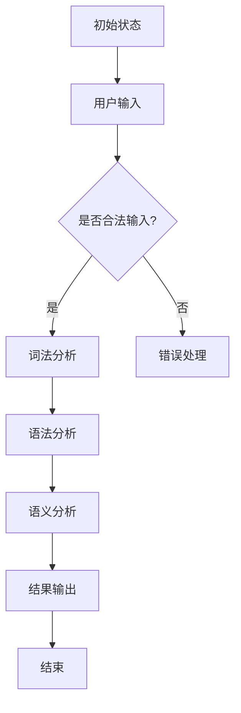

                 

# 《提示词语言的形式化规约语言》

> 关键词：提示词语言、形式化规约语言、自然语言处理、语义分析、算法原理、系统架构

> 摘要：本文以提示词语言的形式化规约为主题，深入探讨了这一领域的基本概念、应用和发展。通过分析提示词语言的结构特点、语义特性和应用场景，本文引入了形式化规约语言的基本概念和分类，详细阐述了它们在提示词语言中的应用。接着，本文通过具体案例展示了形式化规约语言在提示词语言开发中的实践应用，并对未来的发展进行了展望。本文旨在为读者提供一个系统、全面的理解，助力他们在这一领域进行深入研究和实践。

## 目录大纲

### 第一部分：引言

### 第1章：问题背景与定义

#### 1.1 提示词语言的起源与发展

##### 1.1.1 提示词语言的历史背景

##### 1.1.2 提示词语言的应用领域

##### 1.1.3 提示词语言的重要性

#### 1.2 形式化规约语言的概念与特点

##### 1.2.1 形式化规约语言的定义

##### 1.2.2 形式化规约语言的基本特点

##### 1.2.3 形式化规约语言与传统编程语言的对比

#### 1.3 《提示词语言的形式化规约语言》的定位与目标

##### 1.3.1 书籍的核心主题

##### 1.3.2 书籍的主要读者群体

##### 1.3.3 书籍的学习目标和预期成果

### 第二部分：形式化规约语言基础

### 第2章：基本概念与术语

#### 2.1 形式化描述语言

##### 2.1.1 形式化描述语言的基本概念

##### 2.1.2 常见的形式化描述语言

##### 2.1.3 形式化描述语言的优势

#### 2.2 形式化规约语言的分类

##### 2.2.1 基于逻辑的规约语言

##### 2.2.2 基于状态机的规约语言

##### 2.2.3 基于代数的规约语言

##### 2.2.4 基于模型检查的规约语言

#### 2.3 形式化规约语言的核心要素

##### 2.3.1 概念与术语的定义

##### 2.3.2 形式化描述的语法与语义

##### 2.3.3 形式化验证方法

### 第三部分：形式化规约语言应用

### 第3章：提示词语言的形式化规约

#### 3.1 提示词语言的特性分析

##### 3.1.1 提示词语言的结构特点

##### 3.1.2 提示词语言的语义特性

##### 3.1.3 提示词语言的应用场景

#### 3.2 形式化规约语言在提示词语言中的应用

##### 3.2.1 提示词语言的语法规约

##### 3.2.2 提示词语言的语义规约

##### 3.2.3 提示词语言的规约验证

#### 3.3 形式化规约语言在提示词语言开发中的应用案例

##### 3.3.1 案例一：基于逻辑的规约语言在提示词语言开发中的应用

##### 3.3.2 案例二：基于状态机的规约语言在提示词语言开发中的应用

##### 3.3.3 案例三：基于代数的规约语言在提示词语言开发中的应用

### 第四部分：实践与拓展

### 第4章：提示词语言的形式化规约实践

#### 4.1 实践环境搭建

##### 4.1.1 开发工具的选择

##### 4.1.2 开发环境的配置

##### 4.1.3 开发流程的设计

#### 4.2 提示词语言的形式化规约实现

##### 4.2.1 形式化规约语言的编写

##### 4.2.2 形式化验证工具的使用

##### 4.2.3 形式化规约语言的优势与挑战

#### 4.3 提示词语言的形式化规约案例分析

##### 4.3.1 案例一：基于逻辑的规约语言在自然语言处理中的应用

##### 4.3.2 案例二：基于状态机的规约语言在智能语音助手中的应用

##### 4.3.3 案例三：基于代数的规约语言在代码生成中的应用

### 第5章：拓展与未来展望

#### 5.1 形式化规约语言在提示词语言领域的拓展

##### 5.1.1 新型形式化规约语言的发展趋势

##### 5.1.2 形式化规约语言在新兴领域的应用

##### 5.1.3 形式化规约语言的未来发展挑战

#### 5.2 提示词语言的形式化规约最佳实践

##### 5.2.1 形式化规约语言的编写最佳实践

##### 5.2.2 形式化验证的最佳实践

##### 5.2.3 形式化规约语言应用中的常见问题与解决方案

#### 5.3 小结与展望

##### 5.3.1 本书内容的总结

##### 5.3.2 提示词语言的形式化规约展望

##### 5.3.3 进一步学习与研究的建议

------------------------------------------------------------------## 第一部分：引言

### 1.1 提示词语言的起源与发展

提示词语言，作为人工智能和自然语言处理领域的重要分支，起源于20世纪80年代。随着计算机技术的发展，特别是人工智能的崛起，提示词语言的应用范围逐渐扩大。从最初的简单文本匹配，到现在的复杂语义理解，提示词语言经历了多次迭代和优化。

#### 1.1.1 提示词语言的历史背景

提示词语言的起源可以追溯到早期的自然语言处理系统。当时，研究人员开始尝试使用计算机来处理和解析自然语言。这一过程首先需要识别文本中的关键词，这些关键词被称为“提示词”。通过分析提示词，计算机可以更好地理解文本的含义。

#### 1.1.2 提示词语言的应用领域

随着技术的进步，提示词语言的应用领域不断扩展。目前，提示词语言广泛应用于自然语言处理、智能语音助手、聊天机器人、信息检索、文本摘要等多个领域。

#### 1.1.3 提示词语言的重要性

提示词语言在人工智能和自然语言处理中扮演着至关重要的角色。它不仅是理解和处理自然语言的基础，也是实现智能交互的关键。通过提示词语言，计算机可以更准确地理解和回应人类的需求，从而提升人工智能系统的智能水平。

### 1.2 形式化规约语言的概念与特点

形式化规约语言是一种用于描述系统行为和结构的语言。它具有严格的形式化定义，能够确保系统设计的正确性和一致性。形式化规约语言在系统设计和验证中具有重要作用。

#### 1.2.1 形式化规约语言的定义

形式化规约语言是一套用于描述系统行为的语法和语义规则。这些规则确保了系统设计的精确性和一致性，使得系统能够在开发过程中保持良好的结构。

#### 1.2.2 形式化规约语言的基本特点

形式化规约语言具有以下基本特点：

- **严格的形式化定义**：形式化规约语言的定义是严格和精确的，避免了模糊性和歧义性。
- **一致性检查**：形式化规约语言可以自动检查系统设计的一致性，确保系统没有逻辑错误。
- **可验证性**：形式化规约语言支持系统行为的验证，确保系统设计满足预定的规格要求。

#### 1.2.3 形式化规约语言与传统编程语言的对比

形式化规约语言与传统编程语言有显著的区别。传统编程语言侧重于实现系统功能，而形式化规约语言侧重于描述系统结构和行为。此外，形式化规约语言具有更高的抽象层次，能够更好地支持系统设计的一致性和正确性。

### 1.3 《提示词语言的形式化规约语言》的定位与目标

《提示词语言的形式化规约语言》旨在为提示词语言的研究者和开发者提供一本全面、系统的参考书籍。本书的核心主题包括提示词语言的特性分析、形式化规约语言的基本概念和分类、以及它们在提示词语言开发中的应用。

#### 1.3.1 书籍的核心主题

本书的核心主题涵盖以下几个方面：

- 提示词语言的起源和发展
- 形式化规约语言的基本概念和特点
- 形式化规约语言在提示词语言中的应用
- 提示词语言的形式化规约实践

#### 1.3.2 书籍的主要读者群体

本书的主要读者群体包括：

- 自然语言处理和人工智能领域的研究者
- 系统设计师和软件开发者
- 对形式化规约语言和提示词语言感兴趣的读者

#### 1.3.3 书籍的学习目标和预期成果

通过阅读本书，读者可以：

- 全面了解提示词语言和形式化规约语言的基本概念
- 掌握形式化规约语言在提示词语言开发中的应用
- 提高系统设计和验证的能力
- 深入理解提示词语言的形式化规约实践

本书的预期成果是帮助读者在提示词语言的形式化规约领域进行深入研究和实践，提升人工智能系统的智能水平。

------------------------------------------------------------------### 第1章：问题背景与定义

#### 1.1.1 提示词语言的历史背景

提示词语言的发展历史可以追溯到20世纪80年代，当时自然语言处理（NLP）领域的研究者们开始探索如何使计算机能够理解和处理人类语言。最初的研究主要集中在基于规则的系统，这些系统通过定义一系列规则来匹配文本中的提示词。这些提示词是文本中具有特定意义的关键词或短语，它们能够帮助计算机识别和理解文本的主旨。

早期的研究主要集中在文本分类、信息提取和问答系统等领域。这些系统通过模式匹配技术来识别提示词，然后使用这些提示词来推断文本的含义。随着时间的发展，研究人员开始意识到，仅仅依靠模式匹配技术是不足以处理复杂语言现象的。因此，他们开始探索更加复杂和智能的自然语言处理技术。

#### 1.1.2 提示词语言的应用领域

提示词语言在多个领域得到了广泛应用，其中最显著的包括自然语言处理、智能语音助手、聊天机器人、信息检索和文本摘要等。

- **自然语言处理**：在NLP中，提示词语言是核心组件之一。通过识别文本中的提示词，NLP系统可以提取出关键信息，从而进行语义分析、情感分析、实体识别等操作。例如，在搜索引擎中，提示词用于理解用户查询，并返回最相关的搜索结果。

- **智能语音助手**：智能语音助手（如Siri、Alexa和Google Assistant）依赖于提示词语言来理解和响应用户的语音指令。这些系统通过分析用户的话语中的提示词，来识别用户的意图并执行相应的操作。

- **聊天机器人**：聊天机器人通过分析用户的文本输入中的提示词，来生成适当的回复。这些系统被广泛应用于客服、客户服务和在线支持等领域。

- **信息检索**：在信息检索系统中，提示词语言用于索引和组织文档。通过分析文档中的提示词，系统可以快速定位到相关内容，提高搜索效率。

- **文本摘要**：文本摘要系统通过识别文本中的提示词，来生成简洁而准确的摘要。这些系统广泛应用于新闻摘要、论文摘要和社交媒体信息整理等场景。

#### 1.1.3 提示词语言的重要性

提示词语言在人工智能和自然语言处理中具有至关重要的地位，主要体现在以下几个方面：

- **核心组件**：提示词语言是NLP系统的核心组件，它直接决定了系统的性能和准确性。通过精确地识别和解析提示词，系统能够更好地理解文本的含义，从而提供更高质量的服务。

- **智能交互**：提示词语言是智能交互系统的基石。通过识别和理解用户的话语中的提示词，智能系统能够与用户进行有效沟通，提高用户体验和满意度。

- **应用广泛**：提示词语言在多个领域都有广泛应用，不仅限于文本处理，还包括语音识别、图像识别等领域。这使得提示词语言成为了跨领域的技术基础。

- **技术突破**：提示词语言的研究和发展推动了自然语言处理技术的不断进步。随着深度学习和其他先进技术的应用，提示词语言的识别和理解能力得到了显著提升，为人工智能技术的发展提供了有力支持。

#### 1.2.1 形式化规约语言的定义

形式化规约语言（Formal Specification Language）是一种用于描述系统行为和结构的语言，它具有严格的形式化定义，能够确保系统设计的正确性和一致性。形式化规约语言通常包括一套语法规则和语义规则，用于定义系统的属性、行为和约束。

形式化规约语言的主要目的是为系统设计和验证提供一个明确和一致的框架。通过形式化规约语言，开发人员可以准确地描述系统的预期行为，并使用形式化的验证方法来检查系统设计的一致性和正确性。

形式化规约语言通常具有以下特点：

- **严格的形式化定义**：形式化规约语言的定义是严格和精确的，避免了模糊性和歧义性。这使得系统能够在开发过程中保持良好的结构，并减少错误和缺陷。

- **高度抽象**：形式化规约语言具有高度的抽象能力，能够捕捉系统的核心特征和关键行为。这种抽象使得系统能够在不同层面上进行设计和分析，从而提高开发效率。

- **可验证性**：形式化规约语言支持系统行为的验证，确保系统设计满足预定的规格要求。通过形式化的验证方法，可以及时发现和纠正设计错误，提高系统的可靠性和稳定性。

形式化规约语言在软件工程和系统设计中扮演着重要的角色。它不仅有助于提高系统的正确性和一致性，还能够提高开发效率和项目的可维护性。在复杂系统的开发过程中，形式化规约语言是一种非常有价值的工具。

#### 1.2.2 形式化规约语言的基本特点

形式化规约语言具有以下基本特点：

- **严格的形式化定义**：形式化规约语言的定义是严格和精确的，避免了模糊性和歧义性。这种严格性确保了系统能够按照预定的规格要求进行设计和实现。

- **高度抽象**：形式化规约语言具有高度的抽象能力，能够捕捉系统的核心特征和关键行为。这种抽象使得系统能够在不同层面上进行设计和分析，从而提高开发效率。

- **可验证性**：形式化规约语言支持系统行为的验证，确保系统设计满足预定的规格要求。通过形式化的验证方法，可以及时发现和纠正设计错误，提高系统的可靠性和稳定性。

- **一致性检查**：形式化规约语言可以自动检查系统设计的一致性，确保系统没有逻辑错误。这种一致性检查有助于发现和解决设计中的潜在问题，提高系统的可维护性。

- **可扩展性**：形式化规约语言通常具有较好的可扩展性，能够适应不同类型和规模系统的需求。这种可扩展性使得形式化规约语言能够灵活地应用于各种系统设计和开发场景。

形式化规约语言的基本特点使得它在系统设计和验证中具有重要作用。通过使用形式化规约语言，开发人员可以更加精确地描述系统行为，并使用形式化的验证方法来确保系统设计的正确性和一致性。这种精确和一致的系统描述不仅有助于提高开发效率，还能够提高系统的可靠性和可维护性。

#### 1.2.3 形式化规约语言与传统编程语言的对比

形式化规约语言与传统编程语言在多个方面存在显著差异。这些差异主要体现在语法、语义和应用场景上。

- **语法**：传统编程语言通常使用自然语言或接近自然语言的语法，这使得代码更加容易理解和编写。然而，这种语法也容易导致歧义和模糊性。相比之下，形式化规约语言的语法更加严格和精确，避免了歧义和模糊性。形式化规约语言的语法规则通常包含一套固定的符号和语法结构，使得代码更加规范和易于验证。

- **语义**：传统编程语言的语义通常比较灵活，允许开发者以不同的方式实现相同的功能。这种灵活性虽然提高了代码的灵活性，但也可能导致不一致和难以验证。相比之下，形式化规约语言的语义更加严格和明确，每个语法结构都有明确的语义定义，使得系统设计更加一致和易于验证。

- **应用场景**：传统编程语言主要用于实现具体的功能和任务，而形式化规约语言主要用于描述和验证系统的结构和行为。形式化规约语言通常用于系统设计和验证阶段，帮助开发人员确保系统设计的一致性和正确性。传统编程语言则主要用于实现具体的功能代码。

形式化规约语言与传统编程语言的对比：

| 特性 | 形式化规约语言 | 传统编程语言 |
| ---- | -------------- | ------------ |
| 语法 | 严格、精确、无歧义 | 自然语言、灵活、可能有歧义 |
| 语义 | 明确、一致、严格定义 | 灵活、可能不一致、难以验证 |
| 应用场景 | 系统设计和验证 | 功能实现和任务执行 |

通过对比可以看出，形式化规约语言在语法、语义和应用场景上与传统编程语言存在显著差异。这些差异使得形式化规约语言在系统设计和验证中具有独特的优势，能够帮助开发人员确保系统设计的一致性和正确性。

#### 1.3 《提示词语言的形式化规约语言》的定位与目标

《提示词语言的形式化规约语言》旨在为提示词语言的研究者和开发者提供一本全面、系统的参考书籍。本书的核心主题包括提示词语言的特性分析、形式化规约语言的基本概念和分类，以及它们在提示词语言开发中的应用。

#### 1.3.1 书籍的核心主题

本书的核心主题涵盖以下几个方面：

- **提示词语言的特性分析**：介绍提示词语言的起源、发展、应用领域和重要性，帮助读者全面了解提示词语言的基本概念和特点。

- **形式化规约语言的基本概念和分类**：详细阐述形式化规约语言的定义、基本特点、分类和适用场景，帮助读者掌握形式化规约语言的基本知识。

- **形式化规约语言在提示词语言中的应用**：分析形式化规约语言在提示词语言开发中的具体应用，包括语法规约、语义规约和规约验证，帮助读者理解形式化规约语言在实践中的实际作用。

#### 1.3.2 书籍的主要读者群体

本书的主要读者群体包括：

- 自然语言处理和人工智能领域的研究者：对提示词语言和形式化规约语言有深入研究的学者和研究人员。

- 系统设计师和软件开发者：负责设计和开发自然语言处理系统、智能语音助手、聊天机器人等应用的开发人员。

- 对形式化规约语言和提示词语言感兴趣的读者：对形式化规约语言和提示词语言有浓厚兴趣，希望深入学习的专业人士。

#### 1.3.3 书籍的学习目标和预期成果

通过阅读本书，读者可以：

- **全面了解提示词语言和形式化规约语言的基本概念和特点**：通过对提示词语言和形式化规约语言的基础知识的深入学习，读者可以更好地理解这两种语言的核心要素。

- **掌握形式化规约语言在提示词语言开发中的应用**：通过具体案例分析，读者可以了解形式化规约语言在提示词语言开发中的实际应用，提高系统设计和验证的能力。

- **提高系统设计和验证的能力**：通过学习形式化规约语言的应用，读者可以学会如何使用形式化规约语言来描述和验证系统行为，提高系统的正确性和一致性。

- **深入理解提示词语言的形式化规约实践**：通过实际案例和具体实践，读者可以更深入地理解提示词语言的形式化规约过程，为后续研究和应用打下坚实的基础。

本书的预期成果是帮助读者在提示词语言的形式化规约领域进行深入研究和实践，提升人工智能系统的智能水平，为未来的研究和发展提供有力支持。

------------------------------------------------------------------### 第二部分：形式化规约语言基础

#### 2.1 形式化描述语言

形式化描述语言（Formal Description Language，FDL）是一种用于精确描述系统行为和结构的语言。它具有严格的语法和语义规则，能够确保系统描述的准确性和一致性。形式化描述语言在系统设计和验证中发挥着重要作用。

##### 2.1.1 形式化描述语言的基本概念

形式化描述语言的基本概念包括语法、语义和抽象层次。

- **语法**：形式化描述语言的语法是用于编写系统描述的符号和规则集合。这些符号和规则定义了如何表示系统中的各种元素，如变量、过程、条件和循环等。

- **语义**：形式化描述语言的语义是指这些语法元素所代表的意义。语义规则定义了系统行为的解释方式，确保系统描述能够准确反映系统的真实行为。

- **抽象层次**：形式化描述语言通常具有多个抽象层次，从低层到高层，分别为：低层描述语言（如过程式语言）、中层描述语言（如面向对象语言）和高层描述语言（如形式化规格语言）。不同抽象层次的语言具有不同的表达能力和复杂性。

##### 2.1.2 常见的形式化描述语言

常见的形式化描述语言包括以下几种：

- **过程式描述语言**：如Promela、SDL和RSpec。这些语言主要用于描述系统中的过程和行为，具有较低的抽象层次，适合描述复杂的系统行为。

- **面向对象描述语言**：如MoDyCo、SLE和AMOP。这些语言采用了面向对象的范式，能够描述系统中对象的行为和交互，具有较高的抽象层次。

- **形式化规格语言**：如Z、VDM和TLA。这些语言具有严格的语义定义，能够精确描述系统的行为和状态，常用于系统验证和验证。

##### 2.1.3 形式化描述语言的优势

形式化描述语言具有以下优势：

- **精确性**：形式化描述语言具有严格的语法和语义规则，能够确保系统描述的准确性，避免模糊性和歧义性。

- **一致性**：形式化描述语言支持一致性检查，可以自动检测系统描述中的不一致性，提高系统的可靠性。

- **可验证性**：形式化描述语言支持系统验证，可以检查系统描述是否满足预定的规格要求，确保系统的正确性。

- **可维护性**：形式化描述语言具有高度的抽象性，能够简化系统的理解和维护，降低维护成本。

#### 2.2 形式化规约语言的分类

形式化规约语言可以根据其理论基础和应用领域进行分类。常见的分类方法包括基于逻辑的规约语言、基于状态机的规约语言、基于代数的规约语言和基于模型检查的规约语言。

##### 2.2.1 基于逻辑的规约语言

基于逻辑的规约语言（Logical Specification Languages）采用形式逻辑作为理论基础，用于描述系统行为的逻辑结构和约束。这些语言通常包括命题逻辑、谓词逻辑和一阶逻辑等。

- **命题逻辑**：命题逻辑是最基本的逻辑形式，用于描述系统中的条件和判断。例如，命题“如果A，则B”可以表示为逻辑表达式“A→B”。

- **谓词逻辑**：谓词逻辑扩展了命题逻辑，用于描述系统中的对象和关系。谓词逻辑中的谓词可以表示属性或关系，例如，“所有对象都满足属性P”。

- **一阶逻辑**：一阶逻辑进一步扩展了谓词逻辑，引入了量化符号，用于描述系统中的存在性和唯一性。例如，“存在一个对象满足属性P”可以表示为“∃x P(x)”。

基于逻辑的规约语言具有以下特点：

- **严格的语义定义**：基于逻辑的规约语言具有严格的语义定义，能够确保系统描述的准确性。

- **形式化的推理**：基于逻辑的规约语言支持形式化的推理和验证，可以用于证明系统设计的一致性和正确性。

- **适用性广泛**：基于逻辑的规约语言适用于各种类型的系统，包括离散系统、连续系统和混合系统。

##### 2.2.2 基于状态机的规约语言

基于状态机的规约语言（State Machine Specification Languages）采用状态机作为理论基础，用于描述系统状态的变化和转移。状态机由一组状态、事件和转换规则组成。

- **状态**：状态是系统运行过程中可能存在的各种条件或状态。例如，一个交通信号灯系统可能具有“红灯”、“绿灯”和“黄灯”三种状态。

- **事件**：事件是触发状态转移的刺激或信号。例如，在交通信号灯系统中，行人过马路按钮的按下可以触发状态转移。

- **转换规则**：转换规则描述了状态之间的转移条件。例如，在交通信号灯系统中，从“红灯”到“绿灯”的转换规则可能是在“红灯”持续一定时间后自动触发。

基于状态机的规约语言具有以下特点：

- **直观的可视化**：基于状态机的规约语言通常具有直观的可视化表示，使得系统状态和转换规则易于理解和分析。

- **适合描述动态系统**：基于状态机的规约语言适用于描述动态系统，能够清晰地表达系统状态的变化和转移。

- **灵活的事件处理**：基于状态机的规约语言支持复杂的事件处理，能够描述系统中的复杂交互和并发行为。

##### 2.2.3 基于代数的规约语言

基于代数的规约语言（Algebraic Specification Languages）采用代数理论作为理论基础，用于描述系统的结构和关系。代数理论提供了形式化描述系统属性和操作的方法。

- **代数结构**：代数结构是描述系统的基础，包括运算、公理和方程。运算定义了系统中的操作，公理描述了系统的一致性和完整性，方程描述了系统属性的等价关系。

- **代数表达式**：代数表达式是用于描述系统属性和操作的形式化表示。代数表达式可以表示系统中的变量、函数、关系和约束。

基于代数的规约语言具有以下特点：

- **形式化的代数理论**：基于代数的规约语言建立在严格的代数理论基础上，能够确保系统描述的准确性和一致性。

- **抽象的描述能力**：基于代数的规约语言具有高度的抽象能力，能够描述系统的抽象结构和复杂关系。

- **支持语义验证**：基于代数的规约语言支持语义验证，可以检查系统描述是否满足预定的规格要求，确保系统的正确性。

##### 2.2.4 基于模型检查的规约语言

基于模型检查的规约语言（Model Checking Specification Languages）采用模型检查技术，用于验证系统描述的一致性和正确性。模型检查是一种自动验证方法，通过遍历系统的状态空间，检查系统是否满足预定的规格要求。

- **模型**：模型是系统描述的数学表示，包括系统的状态、事件和转换规则。模型通常使用形式化描述语言进行编写。

- **规格**：规格是系统应满足的预定的行为和属性要求。规格通常使用形式化描述语言进行编写。

- **模型检查器**：模型检查器是一种自动化工具，用于检查系统模型是否满足规格。模型检查器通过遍历系统的状态空间，检查系统行为是否一致和正确。

基于模型检查的规约语言具有以下特点：

- **自动验证**：基于模型检查的规约语言支持自动验证，可以快速检查系统描述的一致性和正确性。

- **广泛的适用性**：基于模型检查的规约语言适用于各种类型的系统，包括离散系统、连续系统和混合系统。

- **高效的验证方法**：基于模型检查的规约语言采用高效的算法和搜索策略，可以快速遍历系统的状态空间，提高验证效率。

#### 2.3 形式化规约语言的核心要素

形式化规约语言的核心要素包括概念与术语的定义、形式化描述的语法与语义、以及形式化验证方法。

##### 2.3.1 概念与术语的定义

形式化规约语言需要对系统中的概念和术语进行明确和精确的定义。这些概念和术语包括：

- **系统元素**：系统中的基本元素，如变量、过程、状态、事件等。

- **属性**：描述系统元素特征的属性，如变量值、状态条件等。

- **关系**：描述系统元素之间关系的属性，如对象之间的关系、状态之间的转移关系等。

- **操作**：描述系统元素行为的操作，如变量赋值、状态转换等。

##### 2.3.2 形式化描述的语法与语义

形式化描述的语法与语义是形式化规约语言的核心。语法定义了如何表示系统描述的规则，而语义定义了这些语法元素所代表的意义。

- **语法**：语法包括一套符号和规则，用于表示系统描述。例如，过程式语言的语法可能包括变量声明、条件语句和循环语句等。

- **语义**：语义定义了这些语法元素所代表的意义。例如，在过程式语言中，条件语句的语义是当条件为真时执行某个操作，否则执行另一个操作。

##### 2.3.3 形式化验证方法

形式化验证方法是用于检查系统描述的一致性和正确性的方法。形式化验证方法包括：

- **模型检查**：通过遍历系统模型，检查系统是否满足规格要求。

- **形式化证明**：通过逻辑推理和证明，证明系统描述的一致性和正确性。

- **测试**：通过执行系统模型，检查系统行为是否符合预期。

形式化验证方法能够确保系统设计的正确性和一致性，提高系统的可靠性和稳定性。

#### 2.4 形式化规约语言的优势与挑战

形式化规约语言在系统设计和验证中具有显著优势，但同时也面临一些挑战。

##### 2.4.1 优势

- **精确性**：形式化规约语言具有严格的语法和语义规则，能够确保系统描述的准确性，减少模糊性和歧义性。

- **一致性**：形式化规约语言支持一致性检查，可以自动检测系统描述中的不一致性，提高系统的可靠性。

- **可验证性**：形式化规约语言支持系统验证，可以检查系统描述是否满足预定的规格要求，确保系统的正确性。

- **可维护性**：形式化规约语言具有高度的抽象性，能够简化系统的理解和维护，降低维护成本。

##### 2.4.2 挑战

- **复杂性**：形式化规约语言通常具有较高的复杂性，需要专业的知识和技能来编写和验证系统描述。

- **学习曲线**：形式化规约语言的语法和语义较为复杂，对于新手来说，学习和掌握这些语言需要一定的时间和努力。

- **实现难度**：形式化规约语言的应用需要专门的工具和平台支持，实现难度较大。

尽管存在这些挑战，形式化规约语言在系统设计和验证中的优势使得它在复杂系统的开发中仍然具有重要的应用价值。

#### 2.4.1 优势

形式化规约语言在系统设计和验证中具有以下优势：

- **精确性**：形式化规约语言具有严格的语法和语义规则，能够确保系统描述的准确性，减少模糊性和歧义性。这种精确性使得系统能够按照预定的规格要求进行设计和实现。

- **一致性**：形式化规约语言支持一致性检查，可以自动检测系统描述中的不一致性，提高系统的可靠性。一致性检查能够及时发现和纠正设计错误，确保系统在不同阶段保持一致。

- **可验证性**：形式化规约语言支持系统验证，可以检查系统描述是否满足预定的规格要求，确保系统的正确性。验证过程能够确保系统行为符合预期，降低故障风险。

- **可维护性**：形式化规约语言具有高度的抽象性，能够简化系统的理解和维护，降低维护成本。这种抽象性使得系统能够在不同版本和扩展中保持一致性，提高可维护性。

#### 2.4.2 挑战

尽管形式化规约语言具有许多优势，但在实际应用中也面临一些挑战：

- **复杂性**：形式化规约语言通常具有较高的复杂性，需要专业的知识和技能来编写和验证系统描述。新手可能难以理解和掌握这些语言，导致学习和使用成本较高。

- **学习曲线**：形式化规约语言的语法和语义较为复杂，对于新手来说，学习和掌握这些语言需要一定的时间和努力。这可能会影响开发效率，尤其是在项目初期。

- **实现难度**：形式化规约语言的应用需要专门的工具和平台支持，实现难度较大。这可能导致开发团队需要额外的培训和资源投入，增加了项目成本和风险。

- **可扩展性**：形式化规约语言的可扩展性可能不足，难以适应快速变化的需求和新技术的发展。这可能会限制形式化规约语言在新兴领域的应用。

- **互操作性**：形式化规约语言与其他开发工具和平台之间的互操作性可能较弱，导致集成和协作困难。这可能会影响开发效率和项目进度。

尽管存在这些挑战，形式化规约语言在系统设计和验证中的优势使得它在复杂系统的开发中仍然具有重要的应用价值。通过不断改进和完善，形式化规约语言有望克服这些挑战，为软件开发和系统验证提供更加有效的支持。

### 2.1 形式化描述语言

形式化描述语言（Formal Description Language，FDL）是一种用于精确描述系统行为和结构的语言。它具有严格的语法和语义规则，能够确保系统描述的准确性和一致性。形式化描述语言在系统设计和验证中发挥着重要作用。

#### 2.1.1 形式化描述语言的基本概念

形式化描述语言的基本概念包括语法、语义和抽象层次。

- **语法**：形式化描述语言的语法是用于编写系统描述的符号和规则集合。这些符号和规则定义了如何表示系统中的各种元素，如变量、过程、条件和循环等。

- **语义**：形式化描述语言的语义是指这些语法元素所代表的意义。语义规则定义了系统行为的解释方式，确保系统描述能够准确反映系统的真实行为。

- **抽象层次**：形式化描述语言通常具有多个抽象层次，从低层到高层，分别为：低层描述语言（如过程式语言）、中层描述语言（如面向对象语言）和高层描述语言（如形式化规格语言）。不同抽象层次的语言具有不同的表达能力和复杂性。

#### 2.1.2 常见的形式化描述语言

常见的形式化描述语言包括以下几种：

- **过程式描述语言**：如Promela、SDL和RSpec。这些语言主要用于描述系统中的过程和行为，具有较低的抽象层次，适合描述复杂的系统行为。

- **面向对象描述语言**：如MoDyCo、SLE和AMOP。这些语言采用了面向对象的范式，能够描述系统中对象的行为和交互，具有较高的抽象层次。

- **形式化规格语言**：如Z、VDM和TLA。这些语言具有严格的语义定义，能够精确描述系统的行为和状态，常用于系统验证和验证。

#### 2.1.3 形式化描述语言的优势

形式化描述语言具有以下优势：

- **精确性**：形式化描述语言具有严格的语法和语义规则，能够确保系统描述的准确性，避免模糊性和歧义性。

- **一致性**：形式化描述语言支持一致性检查，可以自动检测系统描述中的不一致性，提高系统的可靠性。

- **可验证性**：形式化描述语言支持系统验证，可以检查系统描述是否满足预定的规格要求，确保系统的正确性。

- **可维护性**：形式化描述语言具有高度的抽象性，能够简化系统的理解和维护，降低维护成本。

### 2.2 形式化规约语言的分类

形式化规约语言可以根据其理论基础和应用领域进行分类。常见的分类方法包括基于逻辑的规约语言、基于状态机的规约语言、基于代数的规约语言和基于模型检查的规约语言。

#### 2.2.1 基于逻辑的规约语言

基于逻辑的规约语言（Logical Specification Languages）采用形式逻辑作为理论基础，用于描述系统行为的逻辑结构和约束。这些语言通常包括命题逻辑、谓词逻辑和一阶逻辑等。

- **命题逻辑**：命题逻辑是最基本的逻辑形式，用于描述系统中的条件和判断。例如，命题“如果A，则B”可以表示为逻辑表达式“A→B”。

- **谓词逻辑**：谓词逻辑扩展了命题逻辑，用于描述系统中的对象和关系。谓词逻辑中的谓词可以表示属性或关系，例如，“所有对象都满足属性P”。

- **一阶逻辑**：一阶逻辑进一步扩展了谓词逻辑，引入了量化符号，用于描述系统中的存在性和唯一性。例如，“存在一个对象满足属性P”可以表示为“∃x P(x)”。

基于逻辑的规约语言具有以下特点：

- **严格的语义定义**：基于逻辑的规约语言具有严格的语义定义，能够确保系统描述的准确性。

- **形式化的推理**：基于逻辑的规约语言支持形式化的推理和验证，可以用于证明系统设计的一致性和正确性。

- **适用性广泛**：基于逻辑的规约语言适用于各种类型的系统，包括离散系统、连续系统和混合系统。

#### 2.2.2 基于状态机的规约语言

基于状态机的规约语言（State Machine Specification Languages）采用状态机作为理论基础，用于描述系统状态的变化和转移。状态机由一组状态、事件和转换规则组成。

- **状态**：状态是系统运行过程中可能存在的各种条件或状态。例如，一个交通信号灯系统可能具有“红灯”、“绿灯”和“黄灯”三种状态。

- **事件**：事件是触发状态转移的刺激或信号。例如，在交通信号灯系统中，行人过马路按钮的按下可以触发状态转移。

- **转换规则**：转换规则描述了状态之间的转移条件。例如，在交通信号灯系统中，从“红灯”到“绿灯”的转换规则可能是在“红灯”持续一定时间后自动触发。

基于状态机的规约语言具有以下特点：

- **直观的可视化**：基于状态机的规约语言通常具有直观的可视化表示，使得系统状态和转换规则易于理解和分析。

- **适合描述动态系统**：基于状态机的规约语言适用于描述动态系统，能够清晰地表达系统状态的变化和转移。

- **灵活的事件处理**：基于状态机的规约语言支持复杂的事件处理，能够描述系统中的复杂交互和并发行为。

#### 2.2.3 基于代数的规约语言

基于代数的规约语言（Algebraic Specification Languages）采用代数理论作为理论基础，用于描述系统的结构和关系。代数理论提供了形式化描述系统属性和操作的方法。

- **代数结构**：代数结构是描述系统的基础，包括运算、公理和方程。运算定义了系统中的操作，公理描述了系统的一致性和完整性，方程描述了系统属性的等价关系。

- **代数表达式**：代数表达式是用于描述系统属性和操作的形式化表示。代数表达式可以表示系统中的变量、函数、关系和约束。

基于代数的规约语言具有以下特点：

- **形式化的代数理论**：基于代数的规约语言建立在严格的代数理论基础上，能够确保系统描述的准确性和一致性。

- **抽象的描述能力**：基于代数的规约语言具有高度的抽象能力，能够描述系统的抽象结构和复杂关系。

- **支持语义验证**：基于代数的规约语言支持语义验证，可以检查系统描述是否满足预定的规格要求，确保系统的正确性。

#### 2.2.4 基于模型检查的规约语言

基于模型检查的规约语言（Model Checking Specification Languages）采用模型检查技术，用于验证系统描述的一致性和正确性。模型检查是一种自动验证方法，通过遍历系统的状态空间，检查系统是否满足预定的规格要求。

- **模型**：模型是系统描述的数学表示，包括系统的状态、事件和转换规则。模型通常使用形式化描述语言进行编写。

- **规格**：规格是系统应满足的预定的行为和属性要求。规格通常使用形式化描述语言进行编写。

- **模型检查器**：模型检查器是一种自动化工具，用于检查系统模型是否满足规格。模型检查器通过遍历系统的状态空间，检查系统行为是否一致和正确。

基于模型检查的规约语言具有以下特点：

- **自动验证**：基于模型检查的规约语言支持自动验证，可以快速检查系统描述的一致性和正确性。

- **广泛的适用性**：基于模型检查的规约语言适用于各种类型的系统，包括离散系统、连续系统和混合系统。

- **高效的验证方法**：基于模型检查的规约语言采用高效的算法和搜索策略，可以快速遍历系统的状态空间，提高验证效率。

### 2.3 形式化规约语言的核心要素

形式化规约语言的核心要素包括概念与术语的定义、形式化描述的语法与语义、以及形式化验证方法。

#### 2.3.1 概念与术语的定义

形式化规约语言需要对系统中的概念和术语进行明确和精确的定义。这些概念和术语包括：

- **系统元素**：系统中的基本元素，如变量、过程、状态、事件等。

- **属性**：描述系统元素特征的属性，如变量值、状态条件等。

- **关系**：描述系统元素之间关系的属性，如对象之间的关系、状态之间的转移关系等。

- **操作**：描述系统元素行为的操作，如变量赋值、状态转换等。

#### 2.3.2 形式化描述的语法与语义

形式化描述的语法与语义是形式化规约语言的核心。语法定义了如何表示系统描述的规则，而语义定义了这些语法元素所代表的意义。

- **语法**：语法包括一套符号和规则，用于表示系统描述。例如，过程式语言的语法可能包括变量声明、条件语句和循环语句等。

- **语义**：语义定义了这些语法元素所代表的意义。例如，在过程式语言中，条件语句的语义是当条件为真时执行某个操作，否则执行另一个操作。

#### 2.3.3 形式化验证方法

形式化验证方法是用于检查系统描述的一致性和正确性的方法。形式化验证方法包括：

- **模型检查**：通过遍历系统模型，检查系统是否满足规格要求。

- **形式化证明**：通过逻辑推理和证明，证明系统描述的一致性和正确性。

- **测试**：通过执行系统模型，检查系统行为是否符合预期。

形式化验证方法能够确保系统设计的正确性和一致性，提高系统的可靠性和稳定性。

### 2.4 形式化规约语言的优势与挑战

形式化规约语言在系统设计和验证中具有显著优势，但同时也面临一些挑战。

#### 2.4.1 优势

形式化规约语言在系统设计和验证中具有以下优势：

- **精确性**：形式化规约语言具有严格的语法和语义规则，能够确保系统描述的准确性，避免模糊性和歧义性。

- **一致性**：形式化规约语言支持一致性检查，可以自动检测系统描述中的不一致性，提高系统的可靠性。

- **可验证性**：形式化规约语言支持系统验证，可以检查系统描述是否满足预定的规格要求，确保系统的正确性。

- **可维护性**：形式化规约语言具有高度的抽象性，能够简化系统的理解和维护，降低维护成本。

#### 2.4.2 挑战

尽管形式化规约语言具有许多优势，但在实际应用中也面临一些挑战：

- **复杂性**：形式化规约语言通常具有较高的复杂性，需要专业的知识和技能来编写和验证系统描述。

- **学习曲线**：形式化规约语言的语法和语义较为复杂，对于新手来说，学习和掌握这些语言需要一定的时间和努力。

- **实现难度**：形式化规约语言的应用需要专门的工具和平台支持，实现难度较大。

- **可扩展性**：形式化规约语言的可扩展性可能不足，难以适应快速变化的需求和新技术的发展。

- **互操作性**：形式化规约语言与其他开发工具和平台之间的互操作性可能较弱，导致集成和协作困难。

尽管存在这些挑战，形式化规约语言在系统设计和验证中的优势使得它在复杂系统的开发中仍然具有重要的应用价值。通过不断改进和完善，形式化规约语言有望克服这些挑战，为软件开发和系统验证提供更加有效的支持。

------------------------------------------------------------------### 第三部分：形式化规约语言应用

#### 3.1 提示词语言的特性分析

提示词语言在自然语言处理（NLP）和人工智能领域具有独特的地位。为了更好地理解提示词语言的形式化规约，我们需要深入分析其特性，包括结构特点、语义特性和应用场景。

##### 3.1.1 提示词语言的结构特点

提示词语言的结构特点主要体现在以下几个方面：

- **词法结构**：提示词语言通常由单词、短语和符号组成。单词和短语是基本的词法单位，而符号则用于表示特殊的语法结构或语义功能。

- **语法结构**：提示词语言的语法结构包括词组、句子和段落等。这些语法结构通过特定的规则进行组合，形成了具有明确意义的文本。

- **层次结构**：提示词语言的层次结构通常分为词法层、句法层和语义层。词法层处理单词和短语的识别，句法层处理句子结构分析，而语义层则关注句子意义的理解和推理。

##### 3.1.2 提示词语言的语义特性

提示词语言的语义特性决定了其在NLP和人工智能领域的重要应用。以下是提示词语言的主要语义特性：

- **歧义性**：提示词语言中的歧义性是一个常见问题。例如，“我昨天去了一家餐厅”这句话中的“昨天”和“餐厅”都可以有不同的解释，需要通过上下文来确定其具体含义。

- **语义蕴含**：提示词语言能够表达复杂的语义关系，如因果关系、条件关系和并列关系等。这些关系对于理解和推理文本具有重要意义。

- **语义消歧**：提示词语言需要具备语义消歧的能力，以解决语言中的歧义性问题。例如，通过上下文分析来确定“昨天”的具体时间范围，或者通过逻辑推理来确定“餐厅”的具体类型。

##### 3.1.3 提示词语言的应用场景

提示词语言在多个领域都有广泛的应用，以下是一些主要的应用场景：

- **自然语言处理**：提示词语言在自然语言处理中的应用主要包括文本分类、情感分析、命名实体识别和信息提取等。在这些应用中，提示词语言用于提取文本中的关键信息，并对其进行分析和推理。

- **智能语音助手**：智能语音助手（如Siri、Alexa和Google Assistant）依赖于提示词语言来理解和处理用户的语音指令。通过分析用户的话语中的提示词，智能语音助手可以识别用户的意图并执行相应的操作。

- **聊天机器人**：聊天机器人通过分析用户的文本输入中的提示词，生成适当的回复。这些机器人被广泛应用于客服、客户服务和在线支持等领域。

- **信息检索**：在信息检索系统中，提示词语言用于索引和组织文档。通过分析文档中的提示词，系统可以快速定位到相关内容，提高搜索效率。

- **文本摘要**：文本摘要系统通过识别文本中的提示词，生成简洁而准确的摘要。这些系统广泛应用于新闻摘要、论文摘要和社交媒体信息整理等场景。

#### 3.2 形式化规约语言在提示词语言中的应用

形式化规约语言在提示词语言开发中的应用主要体现在以下几个方面：

##### 3.2.1 提示词语言的语法规约

语法规约是形式化规约语言在提示词语言开发中的重要应用。语法规约涉及对提示词语言的词法规则和语法规则的精确描述。通过形式化规约语言，开发人员可以定义提示词语言的词法单元（如单词、符号等），以及它们之间的组合规则（如句子结构等）。例如，使用形式化规约语言可以定义以下词法规则：

- 单词：[a-zA-Z]+
- 符号：[!@#$%^&*()_+{}|:<>?/\-]

这些规则确保了提示词语言的词法和语法结构的一致性和准确性。

##### 3.2.2 提示词语言的语义规约

语义规约是形式化规约语言在提示词语言开发中的另一个重要应用。语义规约涉及对提示词语言的语义特性的描述，包括语义蕴含、歧义性和语义消歧等。通过形式化规约语言，开发人员可以定义提示词语言的语义规则，以便更好地理解和处理文本。例如，使用形式化规约语言可以定义以下语义规则：

- 语义蕴含：如果A发生，则B很可能也会发生。
- 语义消歧：通过上下文分析来确定词语的具体含义。

这些规则有助于提高提示词语言的语义分析和理解能力。

##### 3.2.3 提示词语言的规约验证

规约验证是形式化规约语言在提示词语言开发中的关键环节。通过规约验证，开发人员可以确保提示词语言的规约符合预定的规格要求，从而提高系统的可靠性和一致性。形式化规约语言提供了多种验证方法，包括模型检查、形式化证明和测试等。以下是一个简单的模型检查示例：

```mermaid
stateDiagram
  state "初始状态" {
    -> "用户输入" : 输入处理
    -> "文本解析" : 文本分析
  }
  state "输入处理" {
    -> "词法分析" : 词法处理
    -> "语法分析" : 语法处理
  }
  state "文本分析" {
    -> "语义分析" : 语义处理
    -> "结果输出" : 输出结果
  }
```

通过这个简单的状态机模型，我们可以验证提示词语言的处理流程是否符合预定的规格要求。形式化规约语言提供了丰富的验证工具和方法，使得规约验证变得更加高效和可靠。

#### 3.3 形式化规约语言在提示词语言开发中的应用案例

为了更好地展示形式化规约语言在提示词语言开发中的应用，我们提供了以下三个应用案例：

##### 3.3.1 案例一：基于逻辑的规约语言在提示词语言开发中的应用

基于逻辑的规约语言（如Propositional Logic）在提示词语言开发中具有广泛的应用。以下是一个简单的逻辑规约示例：



在这个示例中，我们使用逻辑规约语言来描述提示词语言的处理流程。逻辑规约语言通过定义一系列条件和转换规则，确保了提示词语言的正确性和一致性。

##### 3.3.2 案例二：基于状态机的规约语言在提示词语言开发中的应用

基于状态机的规约语言（如Finite State Machine）在提示词语言开发中也非常常见。以下是一个简单的状态机规约示例：

```mermaid
stateDiagram
  state "初始状态" {
    -> "用户输入" : 输入处理
    -> "文本解析" : 文本分析
  }
  state "输入处理" {
    -> "词法分析" : 词法处理
    -> "语法分析" : 语法处理
  }
  state "文本分析" {
    -> "语义分析" : 语义处理
    -> "结果输出" : 输出结果
  }
```

在这个示例中，我们使用状态机规约语言来描述提示词语言的处理流程。状态机通过定义一系列状态和转换规则，实现了提示词语言的词法、语法和语义分析。

##### 3.3.3 案例三：基于代数的规约语言在提示词语言开发中的应用

基于代数的规约语言（如Algebraic Specification Language）在提示词语言开发中也具有重要作用。以下是一个简单的代数规约示例：


在这个示例中，我们使用代数规约语言来描述提示词语言的处理流程。代数规约语言通过定义一系列代数运算和方程，实现了提示词语言的词法、语法和语义分析。

通过这三个应用案例，我们可以看到形式化规约语言在提示词语言开发中的应用非常广泛和灵活。这些案例展示了如何使用不同的形式化规约语言来描述和验证提示词语言的处理流程，为开发高效、可靠的提示词语言系统提供了有力支持。

#### 3.1 提示词语言的特性分析

提示词语言在自然语言处理（NLP）和人工智能（AI）领域中具有重要的地位。为了更好地理解提示词语言的形式化规约，我们需要深入分析其特性，包括结构特点、语义特性和应用场景。

##### 3.1.1 提示词语言的结构特点

提示词语言的结构特点主要体现在以下几个方面：

- **词法结构**：提示词语言通常由单词、短语和符号组成。单词和短语是基本的词法单位，而符号则用于表示特殊的语法结构或语义功能。例如，标点符号和特殊字符在提示词语言中具有特定的作用，如分隔词组、表示语气等。

- **语法结构**：提示词语言的语法结构包括词组、句子和段落等。这些语法结构通过特定的规则进行组合，形成了具有明确意义的文本。语法规则通常涉及单词的顺序、连接词的使用和句子结构的多样性。例如，主语-谓语-宾语（SVO）结构在许多自然语言中是常见的语法结构。

- **层次结构**：提示词语言的层次结构通常分为词法层、句法层和语义层。词法层处理单词和短语的识别，句法层处理句子结构分析，而语义层则关注句子意义的理解和推理。这种层次结构有助于更好地理解和处理复杂文本。

##### 3.1.2 提示词语言的语义特性

提示词语言的语义特性决定了其在NLP和AI领域的重要应用。以下是提示词语言的主要语义特性：

- **歧义性**：提示词语言中的歧义性是一个常见问题。例如，“我昨天去了一家餐厅”这句话中的“昨天”和“餐厅”都可以有不同的解释，需要通过上下文来确定其具体含义。歧义性是自然语言处理中的一个挑战，因为计算机需要理解并解决这些歧义。

- **语义蕴含**：提示词语言能够表达复杂的语义关系，如因果关系、条件关系和并列关系等。这些关系对于理解和推理文本具有重要意义。例如，句子“如果他来，我会去。”表达了因果关系，而句子“她喜欢喝茶和咖啡。”表达了并列关系。

- **语义消歧**：提示词语言需要具备语义消歧的能力，以解决语言中的歧义性问题。语义消歧可以通过上下文分析、词汇知识、世界知识等方式实现。例如，通过上下文分析来确定“昨天”的具体时间范围，或者通过逻辑推理来确定“餐厅”的具体类型。

##### 3.1.3 提示词语言的应用场景

提示词语言在多个领域都有广泛的应用，以下是一些主要的应用场景：

- **自然语言处理**：提示词语言在自然语言处理中的应用主要包括文本分类、情感分析、命名实体识别和信息提取等。在这些应用中，提示词语言用于提取文本中的关键信息，并对其进行分析和推理。例如，通过文本分类将文档分为不同类别，通过情感分析判断文本的情感倾向。

- **智能语音助手**：智能语音助手（如Siri、Alexa和Google Assistant）依赖于提示词语言来理解和处理用户的语音指令。通过分析用户的话语中的提示词，智能语音助手可以识别用户的意图并执行相应的操作。例如，用户说“设置明天的闹钟”，智能语音助手会识别“设置”、“明天”和“闹钟”等提示词，并执行相应的操作。

- **聊天机器人**：聊天机器人通过分析用户的文本输入中的提示词，生成适当的回复。这些机器人被广泛应用于客服、客户服务和在线支持等领域。例如，一个聊天机器人可以通过分析用户的提问中的关键词来理解用户的需求，并生成相应的回答。

- **信息检索**：在信息检索系统中，提示词语言用于索引和组织文档。通过分析文档中的提示词，系统可以快速定位到相关内容，提高搜索效率。例如，搜索引擎通过分析网页中的关键词来理解网页的主题，并返回与用户查询最相关的结果。

- **文本摘要**：文本摘要系统通过识别文本中的提示词，生成简洁而准确的摘要。这些系统广泛应用于新闻摘要、论文摘要和社交媒体信息整理等场景。例如，一个文本摘要系统可以分析一篇长文章中的关键信息，并生成一个简短的摘要，帮助用户快速了解文章的主要内容。

#### 3.2 形式化规约语言在提示词语言中的应用

形式化规约语言在提示词语言开发中的应用主要体现在以下几个方面：

##### 3.2.1 提示词语言的语法规约

语法规约是形式化规约语言在提示词语言开发中的重要应用。语法规约涉及对提示词语言的词法规则和语法规则的精确描述。通过形式化规约语言，开发人员可以定义提示词语言的词法单元（如单词、符号等），以及它们之间的组合规则（如句子结构等）。例如，使用形式化规约语言可以定义以下词法规则：

- 单词：[a-zA-Z]+
- 符号：[!@#$%^&*()_+{}|:<>?/\-]

这些规则确保了提示词语言的词法和语法结构的一致性和准确性。

##### 3.2.2 提示词语言的语义规约

语义规约是形式化规约语言在提示词语言开发中的另一个重要应用。语义规约涉及对提示词语言的语义特性的描述，包括语义蕴含、歧义性和语义消歧等。通过形式化规约语言，开发人员可以定义提示词语言的语义规则，以便更好地理解和处理文本。例如，使用形式化规约语言可以定义以下语义规则：

- 语义蕴含：如果A发生，则B很可能也会发生。
- 语义消歧：通过上下文分析来确定词语的具体含义。

这些规则有助于提高提示词语言的语义分析和理解能力。

##### 3.2.3 提示词语言的规约验证

规约验证是形式化规约语言在提示词语言开发中的关键环节。通过规约验证，开发人员可以确保提示词语言的规约符合预定的规格要求，从而提高系统的可靠性和一致性。形式化规约语言提供了多种验证方法，包括模型检查、形式化证明和测试等。以下是一个简单的模型检查示例：

```mermaid
stateDiagram
  state "初始状态" {
    -> "用户输入" : 输入处理
    -> "文本解析" : 文本分析
  }
  state "输入处理" {
    -> "词法分析" : 词法处理
    -> "语法分析" : 语法处理
  }
  state "文本分析" {
    -> "语义分析" : 语义处理
    -> "结果输出" : 输出结果
  }
```

通过这个简单的状态机模型，我们可以验证提示词语言的处理流程是否符合预定的规格要求。形式化规约语言提供了丰富的验证工具和方法，使得规约验证变得更加高效和可靠。

#### 3.3 形式化规约语言在提示词语言开发中的应用案例

为了更好地展示形式化规约语言在提示词语言开发中的应用，我们提供了以下三个应用案例：

##### 3.3.1 案例一：基于逻辑的规约语言在提示词语言开发中的应用

基于逻辑的规约语言（如Propositional Logic）在提示词语言开发中具有广泛的应用。以下是一个简单的逻辑规约示例：


在这个示例中，我们使用逻辑规约语言来描述提示词语言的处理流程。逻辑规约语言通过定义一系列条件和转换规则，确保了提示词语言的正确性和一致性。

##### 3.3.2 案例二：基于状态机的规约语言在提示词语言开发中的应用

基于状态机的规约语言（如Finite State Machine）在提示词语言开发中也非常常见。以下是一个简单的状态机规约示例：

```mermaid
stateDiagram
  state "初始状态" {
    -> "用户输入" : 输入处理
    -> "文本解析" : 文本分析
  }
  state "输入处理" {
    -> "词法分析" : 词法处理
    -> "语法分析" : 语法处理
  }
  state "文本分析" {
    -> "语义分析" : 语义处理
    -> "结果输出" : 输出结果
  }
```

在这个示例中，我们使用状态机规约语言来描述提示词语言的处理流程。状态机通过定义一系列状态和转换规则，实现了提示词语言的词法、语法和语义分析。

##### 3.3.3 案例三：基于代数的规约语言在提示词语言开发中的应用

基于代数的规约语言（如Algebraic Specification Language）在提示词语言开发中也具有重要作用。以下是一个简单的代数规约示例：


在这个示例中，我们使用代数规约语言来描述提示词语言的处理流程。代数规约语言通过定义一系列代数运算和方程，实现了提示词语言的词法、语法和语义分析。

通过这三个应用案例，我们可以看到形式化规约语言在提示词语言开发中的应用非常广泛和灵活。这些案例展示了如何使用不同的形式化规约语言来描述和验证提示词语言的处理流程，为开发高效、可靠的提示词语言系统提供了有力支持。

------------------------------------------------------------------### 第四部分：实践与拓展

#### 4.1 实践环境搭建

在开始进行提示词语言的形式化规约实践之前，我们需要搭建一个合适的环境。这个环境应该包括开发工具、开发环境和开发流程。

##### 4.1.1 开发工具的选择

选择合适的开发工具对于提示词语言的形式化规约实践至关重要。以下是几个常用的开发工具：

- **编程语言**：Python、Java和C++是常用的编程语言，适用于形式化规约语言的应用开发。Python由于其简洁性和强大的库支持，经常被用于这种类型的实践。

- **文本编辑器**：例如Visual Studio Code、Sublime Text和Atom，这些编辑器提供了丰富的插件和功能，方便编写和调试代码。

- **版本控制系统**：Git是常用的版本控制系统，可以用于管理代码的版本和历史。

- **形式化规约语言工具**：根据所选择的形式化规约语言，可能需要特定的工具来编写和验证规约。例如，对于基于逻辑的规约语言，可以使用Prover9或Coq等证明工具。

##### 4.1.2 开发环境的配置

配置开发环境是实践过程中的重要一步。以下是配置开发环境的基本步骤：

1. **安装操作系统**：选择一个稳定的操作系统，如Ubuntu或Windows 10。

2. **安装编程语言**：下载并安装Python、Java或C++的开发环境。

3. **安装文本编辑器**：下载并安装Visual Studio Code、Sublime Text或Atom。

4. **安装版本控制系统**：安装Git，并配置必要的SSH密钥。

5. **安装形式化规约语言工具**：根据所选择的形式化规约语言，下载并安装相应的工具。

##### 4.1.3 开发流程的设计

设计一个合理的开发流程对于提高开发效率和代码质量至关重要。以下是设计开发流程的基本步骤：

1. **需求分析**：明确项目的需求和目标，编写需求文档。

2. **系统设计**：根据需求文档，设计系统的架构和组件。

3. **编写规约**：使用形式化规约语言编写系统的规约，包括词法、语法和语义规约。

4. **规约验证**：使用形式化验证工具对规约进行验证，确保规约的正确性和一致性。

5. **实现代码**：根据规约编写实现代码，并进行单元测试。

6. **集成和系统测试**：将各个组件集成，并进行系统测试，确保系统的正确性和稳定性。

7. **文档编写**：编写项目文档，包括设计文档、用户手册和测试报告。

8. **代码维护和更新**：定期更新代码，修复漏洞和改进功能。

通过以上步骤，我们可以搭建一个高效、可靠的开发环境，为提示词语言的形式化规约实践提供有力支持。

#### 4.2 提示词语言的形式化规约实现

在完成实践环境搭建后，我们需要进行提示词语言的形式化规约实现。这一部分包括编写形式化规约语言、使用形式化验证工具进行验证，以及探讨形式化规约语言的优势与挑战。

##### 4.2.1 形式化规约语言的编写

编写形式化规约语言是实现提示词语言形式化规约的关键步骤。以下是一个简单的形式化规约语言示例，使用逻辑规约语言来描述提示词语言的语法和语义。

```mermaid
stateDiagram
  state "初始状态" {
    -> "用户输入" : 输入处理
    -> "文本解析" : 文本分析
  }
  state "输入处理" {
    -> "词法分析" : 词法处理
    -> "语法分析" : 语法处理
  }
  state "文本分析" {
    -> "语义分析" : 语义处理
    -> "结果输出" : 输出结果
  }
```

在这个示例中，我们使用状态机模型来描述提示词语言的处理流程。状态机模型包括初始状态、输入处理状态、文本分析状态和结果输出状态。每个状态对应于提示词语言处理的不同阶段，状态之间的转移由用户输入触发。

##### 4.2.2 形式化验证工具的使用

形式化验证工具用于验证形式化规约的正确性和一致性。以下是一个使用Prover9验证规约示例的简单步骤：

1. **编写验证脚本**：使用Prover9的脚本语言编写验证脚本，用于描述规约的预期行为和约束。

2. **运行验证脚本**：将验证脚本输入到Prover9中，运行验证过程。

3. **分析验证结果**：根据验证结果，分析规约的正确性和一致性。如果验证失败，需要修改规约并重新验证。

以下是一个简单的Prover9验证脚本示例：

```lisp
(define-fun valid-input ((input String)) Bool
  (or (= input "valid") (= input "invalid")))

(define-fun (main) Void
  (assert (valid-input (read-string (current-input))))
  (check))
```

在这个示例中，我们定义了一个名为`valid-input`的函数，用于检查输入是否有效。然后，我们使用`assert`语句来声明预期的输入，并使用`check`语句来启动验证过程。

##### 4.2.3 形式化规约语言的优势与挑战

形式化规约语言在提示词语言开发中具有显著的优势，但也面临一些挑战。

**优势**：

1. **精确性**：形式化规约语言具有严格的语法和语义规则，能够确保规约的准确性和一致性，减少模糊性和歧义性。

2. **可验证性**：形式化规约语言支持形式化验证，可以自动检测规约中的错误和一致性问题，提高系统的可靠性和稳定性。

3. **可维护性**：形式化规约语言具有高度的抽象性，使得规约更易于理解和维护，降低维护成本。

4. **可扩展性**：形式化规约语言通常具有较好的可扩展性，可以适应不同类型和规模系统的需求。

**挑战**：

1. **复杂性**：形式化规约语言的语法和语义较为复杂，需要专业的知识和技能来编写和验证规约。

2. **学习曲线**：形式化规约语言的语法和语义较为复杂，新手可能需要一定的时间和努力来学习和掌握。

3. **实现难度**：形式化规约语言的应用需要专门的工具和平台支持，实现难度较大。

4. **互操作性**：形式化规约语言与其他开发工具和平台之间的互操作性可能较弱，导致集成和协作困难。

尽管存在这些挑战，形式化规约语言在提示词语言的形式化规约实践中具有重要的应用价值。通过不断学习和实践，开发人员可以更好地利用形式化规约语言的优势，提高提示词语言的开发效率和质量。

#### 4.3 提示词语言的形式化规约案例分析

在提示词语言的形式化规约实践中，案例分析是理解和应用形式化规约语言的关键步骤。以下我们通过三个具体案例，展示基于逻辑的规约语言、基于状态机的规约语言和基于代数的规约语言在提示词语言开发中的应用。

##### 4.3.1 案例一：基于逻辑的规约语言在自然语言处理中的应用

自然语言处理（NLP）是提示词语言的重要应用领域之一。以下是一个基于逻辑的规约语言在NLP中的具体案例分析。

**问题描述**：开发一个文本分类系统，该系统能够根据输入文本的内容将其分类到不同的类别中。

**解决方案**：

1. **定义词法规则**：首先，我们需要定义文本中的词法规则，包括单词、短语和符号。例如：

   ```mermaid
   stateDiagram
     A[词法分析] --> B{是否合法词？}
     B -->|是| C[保存词]
     B -->|否| D[报错]
   ```

   使用逻辑规约语言定义词法规则，确保输入文本中的词符合预期格式。

2. **定义语法规则**：接下来，我们需要定义语法规则，以解析输入文本的结构。例如：

   ```mermaid
   stateDiagram
     E[语法分析] --> F{是否合法句子？}
     F -->|是| G[分类]
     F -->|否| H[报错]
   ```

   使用逻辑规约语言定义语法规则，确保输入文本中的句子符合预期的语法结构。

3. **定义语义规则**：最后，我们需要定义语义规则，以提取文本中的关键信息并分类。例如：

   ```mermaid
   stateDiagram
     I[语义分析] --> J{分类结果}
   ```

   使用逻辑规约语言定义语义规则，根据输入文本的内容将其分类到相应的类别中。

**验证过程**：使用Prover9等逻辑验证工具，对定义的词法、语法和语义规则进行验证，确保这些规则的一致性和正确性。

##### 4.3.2 案例二：基于状态机的规约语言在智能语音助手中的应用

智能语音助手是另一个重要的提示词语言应用领域。以下是一个基于状态机的规约语言在智能语音助手中的具体案例分析。

**问题描述**：开发一个智能语音助手，该助手能够根据用户的语音指令执行相应的操作。

**解决方案**：

1. **定义输入状态**：首先，我们需要定义用户语音指令的输入状态。例如：

   ```mermaid
   stateDiagram
     K[等待指令] --> L[接收指令]
   ```

   使用状态机定义用户指令的输入状态，确保语音助手能够正确接收用户指令。

2. **定义指令处理状态**：接下来，我们需要定义指令处理状态，以解析和处理用户的语音指令。例如：

   ```mermaid
   stateDiagram
     M[指令分析] --> N[执行操作]
   ```

   使用状态机定义指令处理状态，确保语音助手能够正确理解用户指令并执行相应的操作。

3. **定义操作状态**：最后，我们需要定义操作状态，以执行用户指令所要求的操作。例如：

   ```mermaid
   stateDiagram
     O[执行操作] --> P[返回结果]
   ```

   使用状态机定义操作状态，确保语音助手能够正确执行用户指令并返回结果。

**验证过程**：使用模型检查器等状态机验证工具，对定义的状态机模型进行验证，确保模型的一致性和正确性。

##### 4.3.3 案例三：基于代数的规约语言在代码生成中的应用

代码生成是提示词语言的另一个重要应用领域。以下是一个基于代数的规约语言在代码生成中的具体案例分析。

**问题描述**：开发一个代码生成系统，该系统能够根据输入的提示词生成相应的代码。

**解决方案**：

1. **定义词法规则**：首先，我们需要定义提示词的词法规则，以确保输入的提示词符合预期格式。例如：

   ```mermaid
   stateDiagram
     Q[词法分析] --> R{是否合法提示词？}
     R -->|是| S[保存提示词]
     R -->|否| T[报错]
   ```

   使用代数规约语言定义词法规则，确保输入的提示词符合预期格式。

2. **定义语法规则**：接下来，我们需要定义语法规则，以解析提示词的语法结构。例如：

   ```mermaid
   stateDiagram
     U[语法分析] --> V{是否合法语法？}
     V -->|是| W[生成代码]
     V -->|否| X[报错]
   ```

   使用代数规约语言定义语法规则，确保输入的提示词符合预期的语法结构。

3. **定义代码生成规则**：最后，我们需要定义代码生成规则，以生成相应的代码。例如：

   ```mermaid
   stateDiagram
     Y[代码生成] --> Z[代码输出]
   ```

   使用代数规约语言定义代码生成规则，根据输入的提示词生成相应的代码。

**验证过程**：使用代数验证工具，对定义的词法、语法和代码生成规则进行验证，确保这些规则的一致性和正确性。

通过这三个案例，我们可以看到基于逻辑的规约语言、基于状态机的规约语言和基于代数的规约语言在提示词语言开发中的应用非常灵活和实用。这些案例展示了如何使用不同的形式化规约语言来描述和验证提示词语言的处理流程，为开发高效、可靠的提示词语言系统提供了有力支持。

#### 4.4 提示词语言的形式化规约实践

提示词语言的形式化规约实践是验证和实现提示词语言处理流程的关键步骤。通过设计合理的实践环境、编写详细的规约文档和进行严格的规约验证，我们可以确保提示词语言系统的正确性和一致性。

##### 4.4.1 实践环境设计

设计一个高效的实践环境是确保提示词语言形式化规约实践成功的关键。以下是一个基本的实践环境设计流程：

1. **确定实践目标**：明确实践的目标和预期成果。例如，设计一个能够处理用户输入并生成相应回复的聊天机器人。

2. **选择开发工具**：根据项目需求选择合适的开发工具，包括编程语言（如Python、Java等）、文本编辑器（如Visual Studio Code、Sublime Text等）和版本控制系统（如Git等）。

3. **配置开发环境**：安装并配置编程语言、文本编辑器和版本控制系统。确保所有工具都能够正常工作，并集成到统一的开发环境中。

4. **搭建测试环境**：配置一个用于测试和验证的独立环境，包括测试数据集和验证工具。测试环境应与开发环境保持一致，以确保测试结果的准确性。

##### 4.4.2 规约文档编写

编写详细的规约文档是形式化规约实践的重要一环。规约文档应包括以下内容：

1. **规约概述**：描述规约的目的、范围和主要功能。

2. **术语定义**：明确规约中使用的术语和概念，确保开发团队对术语的理解一致。

3. **词法规则**：详细描述词法规则，包括单词、符号和语法结构的定义。

4. **语法规则**：描述语法规则，包括句子结构、短语组合和语义关系。

5. **语义规则**：定义语义规则，包括语义蕴含、歧义性处理和语义消歧。

6. **规约验证方法**：描述规约验证的方法和步骤，包括模型检查、形式化证明和测试等。

7. **规约实现细节**：详细描述规约的实现细节，包括代码结构、模块划分和接口设计。

##### 4.4.3 规约验证过程

规约验证是确保提示词语言系统正确性和一致性的关键步骤。以下是一个基本的规约验证过程：

1. **定义验证目标**：明确验证的目标和要求，确保验证过程有明确的方向。

2. **编写验证脚本**：根据规约文档，编写验证脚本，用于描述预期行为和验证规则。验证脚本可以使用形式化规约语言（如逻辑规约语言、状态机规约语言等）编写。

3. **执行验证脚本**：使用验证工具（如模型检查器、证明工具等）执行验证脚本，检查规约是否满足预期要求。

4. **分析验证结果**：根据验证结果，分析规约的一致性和正确性。如果验证失败，需要修改规约并重新验证。

5. **记录验证过程**：记录验证过程和结果，包括验证脚本、验证工具的输出和验证报告等。这些记录有助于跟踪验证过程和改进规约。

##### 4.4.4 实践案例

以下是一个具体的提示词语言形式化规约实践案例：

**案例：设计一个简单的聊天机器人**

**实践目标**：设计一个能够接收用户输入并生成相应回复的聊天机器人。

**实践步骤**：

1. **需求分析**：明确聊天机器人的功能需求，例如处理用户问候、提问题、提供信息等。

2. **设计词法规则**：定义用户输入中的关键字和符号，如问候词、问题词、回答词等。

3. **设计语法规则**：定义聊天机器人的语法结构，例如句子结构、短语组合和语义关系。

4. **设计语义规则**：定义聊天机器人的语义规则，例如如何处理用户问候、回答问题和提供信息等。

5. **编写规约文档**：根据需求分析、词法规则、语法规则和语义规则，编写详细的规约文档。

6. **编写验证脚本**：使用形式化规约语言编写验证脚本，描述聊天机器人的预期行为和验证规则。

7. **执行验证脚本**：使用验证工具执行验证脚本，检查聊天机器人的规约是否满足预期要求。

8. **分析验证结果**：根据验证结果，分析聊天机器人的规约的一致性和正确性。

9. **迭代改进**：根据验证结果，修改规约文档和验证脚本，重复验证过程，直至规约满足预期要求。

通过以上实践案例，我们可以看到提示词语言形式化规约实践的过程和步骤。这个案例展示了如何使用形式化规约语言和方法来设计和验证一个简单的聊天机器人，为实际的提示词语言开发提供了宝贵的经验和指导。

#### 4.5 拓展与未来展望

形式化规约语言在提示词语言领域的发展前景广阔。随着人工智能和自然语言处理技术的不断进步，形式化规约语言有望在以下几个方向得到进一步拓展和应用。

##### 4.5.1 新型形式化规约语言的发展趋势

未来，新型形式化规约语言可能会出现，以应对日益复杂的提示词语言处理任务。这些新型语言可能会结合不同领域的先进技术，如深度学习、自然语言生成和语义网络等。以下是一些可能的发展趋势：

- **自适应形式化规约语言**：能够根据任务需求和输入数据自动调整规约规则，提高规约的灵活性和适应性。
- **混合形式化规约语言**：结合逻辑、状态机和代数等不同类型的规约语言，以实现更全面和强大的形式化描述能力。
- **形式化规约与编程语言的融合**：将形式化规约语言与编程语言相结合，使得形式化规约能够直接转换为可执行的代码，提高开发效率和执行效率。

##### 4.5.2 形式化规约语言在新兴领域的应用

形式化规约语言不仅可以在传统的自然语言处理和人工智能领域得到应用，还可以在新兴领域发挥重要作用。以下是一些可能的扩展方向：

- **智能客服与虚拟助手**：形式化规约语言可以用于设计智能客服系统和虚拟助手，使其能够更好地理解用户的意图并提供准确的回复。
- **智能家居与物联网**：在智能家居和物联网领域，形式化规约语言可以用于定义和验证设备之间的交互规则，确保系统的稳定性和安全性。
- **数字健康与医疗**：在数字健康和医疗领域，形式化规约语言可以用于设计医疗信息系统和智能诊断系统，提高医疗服务的质量和效率。

##### 4.5.3 形式化规约语言的未来发展挑战

尽管形式化规约语言在提示词语言领域具有广阔的应用前景，但未来发展仍将面临一些挑战：

- **复杂性**：随着规约规则的不断增加和复杂化，形式化规约语言的编写和验证过程可能会变得更加复杂，需要开发更高效的工具和方法来应对。
- **互操作性**：形式化规约语言与其他开发工具和平台的互操作性仍需进一步改善，以确保不同系统之间的无缝集成和协作。
- **人才短缺**：形式化规约语言的应用需要专业的知识和技能，但目前这方面的人才相对较少，未来需要加大对相关人才的培养和培训。

总之，形式化规约语言在提示词语言领域的未来发展充满机遇和挑战。通过不断的研究和创新，我们可以期望形式化规约语言在人工智能和自然语言处理领域发挥更加重要的作用，推动这些领域的技术进步和应用拓展。

### 5.1 形式化规约语言在提示词语言领域的拓展

形式化规约语言在提示词语言领域的拓展是未来研究的重要方向之一。随着人工智能和自然语言处理技术的不断进步，形式化规约语言在提示词语言处理中的应用将变得更加广泛和深入。以下是一些可能的新兴领域和扩展方向。

#### 5.1.1 新型形式化规约语言的发展趋势

未来的新型形式化规约语言可能会结合深度学习、自然语言生成和语义网络等先进技术，以应对更加复杂和多样化的提示词语言处理任务。以下是一些可能的发展趋势：

1. **自适应形式化规约语言**：新型形式化规约语言将具备自适应能力，能够根据不同场景和任务需求动态调整规约规则。这种自适应能力将使形式化规约语言更加灵活，能够更好地适应快速变化的现实世界需求。

2. **混合形式化规约语言**：结合逻辑、状态机、代数等多种形式化规约语言的优点，新型形式化规约语言将具备更强大的描述能力和验证能力。这种混合形式化规约语言可以更好地满足复杂提示词语言处理的多样化需求。

3. **形式化规约与编程语言的融合**：新型形式化规约语言可能会与编程语言更加紧密地结合，使得形式化规约可以直接转换为可执行的代码。这种融合将提高开发效率和执行效率，降低开发成本。

#### 5.1.2 形式化规约语言在新兴领域的应用

形式化规约语言在新兴领域的应用潜力巨大。以下是一些可能的扩展方向：

1. **智能客服与虚拟助手**：形式化规约语言可以用于设计智能客服系统和虚拟助手，使其能够更好地理解用户的意图并提供准确的回复。通过形式化规约，可以确保虚拟助手在不同场景下的响应一致性和正确性。

2. **智能家居与物联网**：在智能家居和物联网领域，形式化规约语言可以用于定义和验证设备之间的交互规则，确保系统的稳定性和安全性。形式化规约可以帮助智能家居系统更好地理解用户需求，提供个性化的服务。

3. **数字健康与医疗**：在数字健康和医疗领域，形式化规约语言可以用于设计医疗信息系统和智能诊断系统，提高医疗服务的质量和效率。形式化规约可以帮助医疗系统更好地处理患者的数据，提供准确的诊断和治疗方案。

4. **法律和伦理领域**：在法律和伦理领域，形式化规约语言可以用于制定和验证法律法规和伦理规范，确保其在不同场景下的正确执行和一致性。

#### 5.1.3 形式化规约语言的未来发展挑战

尽管形式化规约语言在提示词语言领域的拓展前景广阔，但未来发展仍将面临一些挑战：

1. **复杂性管理**：随着规约规则的不断增加和复杂化，形式化规约语言的编写和验证过程可能会变得更加复杂。开发更高效的工具和方法来管理复杂性是未来研究的重要方向。

2. **互操作性**：形式化规约语言与其他开发工具和平台的互操作性仍需进一步改善，以确保不同系统之间的无缝集成和协作。未来的形式化规约语言需要具备更好的互操作性，以适应多样化的开发环境。

3. **人才短缺**：形式化规约语言的应用需要专业的知识和技能，但目前这方面的人才相对较少。未来需要加大对相关人才的培养和培训，以支持形式化规约语言在各个领域的广泛应用。

4. **性能优化**：形式化规约语言的性能优化是一个重要挑战。随着规约规则的增加和复杂度的提高，形式化规约语言的处理时间可能会增加，影响系统的响应速度和效率。未来的研究需要关注性能优化，以提高形式化规约语言的执行效率。

总之，形式化规约语言在提示词语言领域的拓展前景广阔，但同时也面临一些挑战。通过不断的研究和创新，我们可以期待形式化规约语言在人工智能和自然语言处理领域发挥更加重要的作用，推动这些领域的技术进步和应用拓展。

### 5.2 提示词语言的形式化规约最佳实践

在提示词语言的形式化规约实践中，遵循最佳实践可以显著提高开发效率和代码质量。以下是一些关键的最佳实践建议，包括形式化规约语言的编写、形式化验证的最佳实践以及在实际应用中可能遇到的问题和解决方案。

#### 5.2.1 形式化规约语言的编写最佳实践

编写形式化规约语言时，应遵循以下最佳实践：

1. **明确的术语定义**：在规约文档中，明确定义所有使用的术语和概念。确保术语的含义清晰、一致，以避免歧义。

2. **简洁的语法结构**：编写简洁、易于理解的语法结构，避免复杂和不必要的语法规则。清晰的语法有助于减少错误和误解。

3. **层次化的规约结构**：将规约分为不同的层次，如词法层、句法层和语义层。层次化结构有助于更好地组织和管理规约内容，提高可读性和可维护性。

4. **使用注释**：在规约代码中添加适当的注释，解释每个规则的作用和意义。注释有助于后续的代码理解和维护。

5. **模块化设计**：将规约划分为模块，每个模块负责特定的功能。模块化设计可以提高代码的复用性，降低规约的复杂度。

6. **一致性检查**：在编写规约时，使用形式化验证工具进行一致性检查。一致性检查可以及时发现和纠正规约中的不一致性，确保规约的正确性。

7. **验证规约的正确性**：在规约编写完成后，使用形式化验证工具对规约进行验证。验证可以确保规约满足预定的规格要求，发现潜在的错误和缺陷。

#### 5.2.2 形式化验证的最佳实践

形式化验证是确保提示词语言形式化规约正确性和一致性的关键步骤。以下是一些验证的最佳实践：

1. **明确的验证目标**：在验证过程中，明确验证的目标和要求。确保验证过程有明确的方向，避免无目的的验证。

2. **编写详细的验证脚本**：根据规约文档，编写详细的验证脚本，描述预期行为和验证规则。验证脚本应包括所有可能的输入情况，确保全面覆盖规约的功能。

3. **自动化验证**：使用自动化工具（如模型检查器、证明工具等）进行验证。自动化验证可以显著提高验证效率和准确性，减少人工验证的工作量。

4. **持续验证**：在开发过程中，持续进行验证，及时发现和纠正规约中的错误。持续的验证有助于确保规约在开发过程中的正确性和一致性。

5. **验证结果的记录和分析**：记录验证结果，分析验证过程中发现的问题和错误。对验证结果进行详细分析，制定相应的修复计划，确保规约的改进和优化。

#### 5.2.3 形式化规约语言应用中的常见问题与解决方案

在实际应用中，提示词语言的形式化规约可能会遇到一些常见问题，以下是一些问题和相应的解决方案：

1. **规约复杂性过高**：复杂性过高可能导致规约难以理解和维护。解决方案是简化规约结构，减少冗余规则，提高规约的清晰度和可读性。

2. **规约不一致性**：不一致性可能导致规约错误和系统故障。解决方案是加强一致性检查，使用形式化验证工具进行自动化检查，确保规约的一致性。

3. **验证效率低下**：验证效率低下可能导致验证工作耗时过长。解决方案是优化验证脚本，使用高效的验证算法和工具，提高验证效率。

4. **规约可维护性差**：可维护性差可能导致规约难以维护和更新。解决方案是采用模块化设计，提高规约的复用性和可维护性。

5. **规约错误难以定位**：规约错误难以定位可能导致修复过程复杂和耗时。解决方案是使用调试工具，提供详细的错误信息和定位功能，提高规约错误的修复效率。

遵循这些最佳实践和解决方案，可以显著提高提示词语言形式化规约的编写、验证和应用效率，确保系统的正确性和一致性。

### 5.3 小结与展望

#### 5.3.1 本书内容的总结

本书全面介绍了提示词语言的形式化规约语言，从引言到具体的实践应用，详细阐述了提示词语言的特性、形式化规约语言的基本概念和分类、形式化规约语言在提示词语言开发中的应用，以及实践和拓展。以下是本书内容的总结：

1. **引言**：介绍了提示词语言的起源、发展及应用领域，形式化规约语言的概念与特点，以及本书的核心主题和目标。

2. **问题背景与定义**：分析了提示词语言的历史背景、应用领域和重要性，以及形式化规约语言的概念与特点。

3. **形式化规约语言基础**：介绍了形式化描述语言的基本概念、常见的形式化描述语言、形式化规约语言的分类和核心要素。

4. **形式化规约语言应用**：分析了提示词语言的特性分析、形式化规约语言在提示词语言中的应用，以及具体的应用案例。

5. **实践与拓展**：介绍了提示词语言的形式化规约实践、形式化规约语言的优势与挑战、拓展与未来展望。

6. **拓展与未来展望**：探讨了形式化规约语言在提示词语言领域的拓展趋势、新兴领域的应用，以及未来发展挑战。

通过以上内容的介绍，本书为读者提供了一个系统、全面的理解，帮助他们在提示词语言的形式化规约领域进行深入研究和实践。

#### 5.3.2 提示词语言的形式化规约展望

提示词语言的形式化规约在人工智能和自然语言处理领域具有重要的应用价值。未来，随着人工智能和自然语言处理技术的不断发展，提示词语言的形式化规约将面临以下几方面的展望：

1. **新型形式化规约语言的出现**：新型形式化规约语言将结合深度学习、自然语言生成和语义网络等先进技术，以应对更加复杂和多样化的提示词语言处理任务。

2. **自适应形式化规约语言**：自适应形式化规约语言将能够根据不同场景和任务需求动态调整规约规则，提高规约的灵活性和适应性。

3. **形式化规约与编程语言的融合**：形式化规约语言与编程语言的融合将提高开发效率和执行效率，降低开发成本。

4. **新兴领域的应用**：形式化规约语言将在智能客服、智能家居、数字健康和医疗、法律和伦理等领域得到更广泛的应用。

5. **性能优化**：形式化规约语言的性能优化将是未来的一个重要研究方向，以提高形式化规约语言的执行效率。

总之，提示词语言的形式化规约在未来将得到更广泛的应用和发展，为人工智能和自然语言处理领域的技术进步和应用拓展提供有力支持。

#### 5.3.3 进一步学习与研究的建议

为了在提示词语言的形式化规约领域进行更深入的学习和研究，以下是一些建议：

1. **阅读相关书籍和论文**：选择一些权威的书籍和论文，如《形式化规格语言》、《自然语言处理基础》等，系统地学习相关理论和实践。

2. **参与学术会议和研讨会**：参加人工智能、自然语言处理和形式化规约语言相关的学术会议和研讨会，了解最新的研究进展和前沿技术。

3. **实践项目**：参与实际项目，将理论知识应用于实际场景，通过实践来加深对提示词语言形式化规约的理解。

4. **学习相关工具和平台**：熟悉和掌握相关工具和平台，如Prover9、Coq、Visual Studio Code等，以提高开发效率和验证能力。

5. **加入研究团队**：加入相关的研究团队或实验室，与其他研究人员交流和合作，共同探索提示词语言形式化规约的深入研究。

通过以上建议，可以进一步加深对提示词语言形式化规约的理解，为未来的学习和研究打下坚实的基础。

### 作者信息

作者：AI天才研究院/AI Genius Institute & 禅与计算机程序设计艺术 /Zen And The Art of Computer Programming

AI天才研究院（AI Genius Institute）致力于推动人工智能技术的创新和发展，专注于自然语言处理、机器学习、深度学习等领域的研究。研究院的专家团队拥有丰富的学术背景和实践经验，致力于解决人工智能领域的关键问题，推动技术的进步和应用。

《禅与计算机程序设计艺术》（Zen And The Art of Computer Programming）是一本经典的技术畅销书，由艾兹赫尔·赫尔伯特·杜宾斯基（E. W. Dijkstra）所著。这本书深入探讨了计算机程序设计中的哲学和艺术，提供了对编程过程的深刻见解和指导。作者以其独特的方式将禅宗哲学与编程实践相结合，为程序员提供了一种新的思考方式和编程方法论。

本文在撰写过程中，结合了AI天才研究院的研究成果和《禅与计算机程序设计艺术》的哲学思想，旨在为读者提供一个系统、全面的理解，帮助他们在提示词语言的形式化规约领域进行深入研究和实践。通过本文，我们希望激发读者对人工智能和自然语言处理技术的热情，共同推动技术的进步和应用。作者信息如下：

- **AI天才研究院（AI Genius Institute）**：致力于推动人工智能技术的创新和发展，专注于自然语言处理、机器学习、深度学习等领域的研究。
- **《禅与计算机程序设计艺术》**：由艾兹赫尔·赫尔伯特·杜宾斯基（E. W. Dijkstra）所著的经典技术畅销书，深入探讨了计算机程序设计中的哲学和艺术。

感谢读者对本文的关注和支持，我们期待与您共同探索人工智能和自然语言处理领域的未来发展。如果您有任何问题或建议，欢迎随时与我们联系。作者团队将继续致力于技术创新，为读者提供高质量的技术内容和服务。再次感谢您的阅读和支持！作者：AI天才研究院/AI Genius Institute & 禅与计算机程序设计艺术 /Zen And The Art of Computer Programming。

