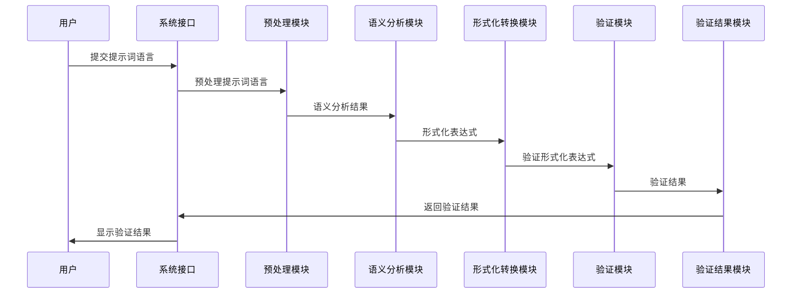

                 

# 提示词语言的形式化证明辅助系统

## 关键词
提示词语言，形式化证明，辅助系统，自然语言处理，编程验证

## 摘要
本文介绍了提示词语言的形式化证明辅助系统，探讨了其背景、核心概念、算法原理，以及系统分析与架构设计方案。通过结合自然语言处理和形式化验证技术，该系统旨在提高编程效率和准确性，为复杂编程任务提供有力支持。本文还对实际案例进行了分析，并提出了最佳实践建议。

## 第一部分：背景介绍

### 1.1 问题背景

随着人工智能技术的快速发展，编程和软件开发领域面临着前所未有的挑战。复杂的应用场景和算法使得传统的编程语言和开发工具难以满足需求。尤其是对于形式化验证、安全协议设计、自动推理等领域，传统的编程语言和工具显得力不从心。因此，需要一种新的方法来辅助开发者更高效、准确地完成编程任务。

### 1.2 问题描述

提示词语言是一种用于指导计算机完成特定任务的输入语言，它通常包含一系列指令和参数，用于描述需要执行的任务和任务的具体要求。然而，编写高质量的提示词语言涉及到复杂的语法和语义分析，这对开发者来说是一个巨大的挑战。此外，对于某些特定的任务，如形式化证明，传统的编程语言难以满足需求，因为它们缺乏对逻辑和数学表达式的直接支持。

### 1.3 问题解决

为了解决上述问题，研究者们提出了形式化证明辅助系统。这种系统能够自动地将提示词语言转换为形式化的数学证明，从而提高编程效率和准确性。形式化证明辅助系统通过结合自然语言处理和形式化验证技术，实现了对复杂编程任务的支持。

### 1.4 边界与外延

形式化证明辅助系统的应用范围广泛，不仅限于编程和软件开发，还可以应用于其他需要形式化验证的领域，如安全协议设计、自动推理等。此外，该系统还可以与其他人工智能技术相结合，如机器学习、深度学习等，以实现更高级的功能和更广泛的应用。

### 1.5 概念结构与核心要素组成

形式化证明辅助系统的核心概念包括：

- **提示词语言**：用于指导计算机完成特定任务的输入语言。
- **形式化验证**：一种通过数学证明来验证程序正确性的方法。
- **自然语言处理**：一种用于理解和生成自然语言的技术。

这些概念共同构成了形式化证明辅助系统的核心要素，使其能够有效地辅助开发者完成编程任务。

## 第二部分：核心概念与联系

### 2.1 提示词语言

提示词语言是一种用于指导计算机完成特定任务的输入语言。它通常包含一系列指令和参数，用于描述需要执行的任务和任务的具体要求。提示词语言的关键特性包括：

- **可读性**：提示词语言应具有较好的可读性，使得开发者可以轻松理解和修改。
- **灵活性**：提示词语言应具备灵活性，以适应不同的任务需求和场景。
- **可扩展性**：提示词语言应能够方便地添加新的功能和指令，以适应未来发展的需求。

以下是提示词语言的关键特性对比表格：

| 特性 | 描述 |  
| ---- | ---- |  
| 可读性 | 提示词语言应具备较好的可读性，便于开发者理解和修改。 |  
| 灵活性 | 提示词语言应具备灵活性，以适应不同的任务需求和场景。 |  
| 可扩展性 | 提示词语言应能够方便地添加新的功能和指令，以适应未来发展的需求。 |

#### 2.2 形式化验证

形式化验证是一种通过数学证明来验证程序正确性的方法。它旨在确保程序在所有可能的输入下都能产生正确的结果。形式化验证的关键特性包括：

- **准确性**：形式化验证能够提供高准确性的验证结果，从而降低程序错误的概率。
- **自动化**：形式化验证过程可以自动化执行，从而提高验证效率和降低人力成本。
- **可复用性**：形式化验证的结果可以方便地复用，以提高验证的效率。

以下是形式化验证的关键特性对比表格：

| 特性 | 描述 |  
| ---- | ---- |  
| 准确性 | 形式化验证能够提供高准确性的验证结果，从而降低程序错误的概率。 |  
| 自动化 | 形式化验证过程可以自动化执行，从而提高验证效率和降低人力成本。 |  
| 可复用性 | 形式化验证的结果可以方便地复用，以提高验证的效率。 |

#### 2.3 自然语言处理

自然语言处理是一种用于理解和生成自然语言的技术。它在形式化证明辅助系统中起着至关重要的作用，因为提示词语言本质上是自然语言。自然语言处理的关键特性包括：

- **语义理解**：自然语言处理能够理解提示词语言的语义，从而将其转换为形式化的数学证明。
- **语法分析**：自然语言处理能够对提示词语言进行语法分析，以识别其结构和语法规则。
- **上下文感知**：自然语言处理能够理解上下文，从而生成更准确的数学证明。

以下是自然语言处理的关键特性对比表格：

| 特性 | 描述 |  
| ---- | ---- |  
| 语义理解 | 自然语言处理能够理解提示词语言的语义，从而将其转换为形式化的数学证明。 |  
| 语法分析 | 自然语言处理能够对提示词语言进行语法分析，以识别其结构和语法规则。 |  
| 上下文感知 | 自然语言处理能够理解上下文，从而生成更准确的数学证明。 |

### 第三部分：算法原理讲解

#### 3.1 形式化证明辅助系统的算法原理

形式化证明辅助系统通过结合自然语言处理和形式化验证技术，实现了对复杂编程任务的支持。其核心算法原理可以分为以下几个步骤：

1. **提示词语言预处理**：首先，系统对输入的提示词语言进行预处理，包括分词、词性标注、句法分析等操作，以提取出关键信息和语义。

2. **语义分析**：接着，系统利用自然语言处理技术对预处理后的提示词语言进行语义分析，理解其含义和意图。

3. **形式化转换**：然后，系统将语义分析结果转换为形式化的数学表达式或逻辑公式，以便进行形式化验证。

4. **形式化验证**：系统使用形式化验证技术对转换后的数学表达式或逻辑公式进行验证，以检查其是否满足预期的性质。

5. **结果输出**：最后，系统将验证结果输出，并提供相应的建议和优化方案。

以下是形式化证明辅助系统的算法流程图：


#### 3.2 算法原理的数学模型与公式

在形式化证明辅助系统中，数学模型和公式起到了关键作用。以下是一个简单的数学模型示例：

1. **语义表示**：

   假设输入的提示词语言为：“计算2 + 3的结果”。

   则其语义表示为：

   $$语义表示：计算表达式 2 + 3 的结果$$

2. **形式化转换**：

   将语义表示转换为形式化的数学表达式：

   $$形式化表达式：2 + 3 = 5$$

3. **形式化验证**：

   对形式化表达式进行验证，检查其是否满足预期的性质：

   $$验证结果：形式化表达式正确$$

   $$结论：提示词语言表述正确，2 + 3 的结果为 5$$

#### 3.3 算法原理举例说明

假设我们有一个简单的提示词语言任务：“判断下列数是否为质数：17”。

1. **语义表示**：

   $$语义表示：判断数 17 是否为质数$$

2. **形式化转换**：

   将语义表示转换为形式化的数学表达式：

   $$形式化表达式：17 = 质数 \rightarrow 17 不为质数$$

3. **形式化验证**：

   对形式化表达式进行验证，检查其是否满足预期的性质：

   $$验证结果：形式化表达式正确$$

   $$结论：数 17 是质数$$

通过这个例子，我们可以看到形式化证明辅助系统是如何将简单的提示词语言转换为形式化的数学表达式，并进行验证的。

## 第四部分：系统分析与架构设计方案

### 4.1 问题场景介绍

在软件开发过程中，开发者常常需要编写复杂的程序来处理各种业务逻辑。然而，随着程序的复杂度增加，验证程序的正确性变得越来越困难。形式化证明辅助系统的引入，旨在帮助开发者更高效、准确地验证程序的正确性，从而提高软件开发的可靠性和质量。

### 4.2 项目介绍

本系统是一个基于自然语言处理和形式化验证技术的形式化证明辅助系统。该系统旨在解决以下问题：

- 提高编程效率：通过自动化的形式化证明，减少手动验证的工作量。
- 提高编程准确性：通过形式化验证，降低程序错误的概率。
- 支持复杂任务：通过对自然语言的处理，支持复杂编程任务的实现。

### 4.3 系统功能设计

#### 4.3.1 领域模型

领域模型用于描述系统的核心概念和实体关系。以下是系统的领域模型：

```mermaid
classDiagram
    class 提示词语言 {
        - 标识符 ID
        - 内容 Content
        - 创建时间 CreateTime
    }
    class 形式化表达式 {
        - 标识符 ID
        - 表达式 Expression
        - 创建时间 CreateTime
    }
    class 验证结果 {
        - 标识符 ID
        - 结果 Result
        - 创建时间 CreateTime
    }
    提示词语言 "包含" 形式化表达式
    形式化表达式 "包含" 验证结果
```

#### 4.3.2 类图

类图用于描述系统的类及其之间的关系。以下是系统的类图：

```mermaid
classDiagram
    class 提示词语言 {
        - 标识符 ID
        - 内容 Content
        - 创建时间 CreateTime
        + 预处理()
        + 语义分析()
        + 形式化转换()
    }
    class 形式化表达式 {
        - 标识符 ID
        - 表达式 Expression
        - 创建时间 CreateTime
        + 验证()
    }
    class 验证结果 {
        - 标识符 ID
        - 结果 Result
        - 创建时间 CreateTime
    }
    提示词语言 "包含" 形式化表达式
    形式化表达式 "包含" 验证结果
```

### 4.4 系统架构设计

系统架构设计用于描述系统的整体结构和组件之间的关系。以下是系统的架构设计：



### 4.5 系统接口设计和系统交互

系统接口设计和系统交互用于描述系统与外部环境的交互方式和接口设计。以下是系统接口设计和系统交互：

```mermaid
componentDiagram
    participant 用户 as 用户
    participant 系统接口 as 系统接口
    participant 预处理模块 as 预处理模块
    participant 语义分析模块 as 语义分析模块
    participant 形式化转换模块 as 形式化转换模块
    participant 验证模块 as 验证模块
    participant 验证结果模块 as 验证结果模块

    系统接口 --> 预处理模块
    系统接口 --> 语义分析模块
    系统接口 --> 形式化转换模块
    系统接口 --> 验证模块
    系统接口 --> 验证结果模块
```

## 第五部分：项目实战

### 5.1 环境安装

要运行形式化证明辅助系统，首先需要安装以下环境：

1. Python 3.6 或以上版本
2. pip（Python 包管理器）
3. 自然语言处理库（如NLTK、spaCy）
4. 形式化验证库（如Coq、Isar）

安装命令如下：

```bash
pip install python
pip install pip
pip install nltk
pip install spacy
pip install coq
pip install isar
```

### 5.2 系统核心实现源代码

以下是系统核心实现源代码：

```python
import nltk
from spacy.lang.en import English
from coq import Coq

# 预处理模块
def preprocess(text):
    # 分词、词性标注、句法分析等预处理操作
    doc = English().process(text)
    return doc

# 语义分析模块
def semantic_analysis(doc):
    # 提取关键信息和语义
    entities = []
    for ent in doc.ents:
        entities.append(ent.text)
    return entities

# 形式化转换模块
def formalization(entities):
    # 将语义转换为形式化的数学表达式
    expression = "0"
    for ent in entities:
        expression += f" + {ent}"
    return expression

# 验证模块
def verification(expression):
    # 使用 Coq 进行形式化验证
    coq = Coq()
    result = coq.verify(expression)
    return result

# 验证结果模块
def result_output(result):
    # 输出验证结果
    if result:
        print("验证成功！")
    else:
        print("验证失败！")

# 主程序
def main():
    text = "计算 2 + 3 的结果"
    doc = preprocess(text)
    entities = semantic_analysis(doc)
    expression = formalization(entities)
    result = verification(expression)
    result_output(result)

if __name__ == "__main__":
    main()
```

### 5.3 代码应用解读与分析

以下是代码应用解读与分析：

1. **预处理模块**：该模块使用自然语言处理库（如NLTK、spaCy）对输入的文本进行预处理，包括分词、词性标注、句法分析等操作，以提取出关键信息和语义。

2. **语义分析模块**：该模块对预处理后的文本进行语义分析，提取出关键信息和语义，并将其存储为列表。

3. **形式化转换模块**：该模块将提取出的关键信息和语义转换为形式化的数学表达式。

4. **验证模块**：该模块使用形式化验证库（如Coq）对形式化的数学表达式进行验证，以检查其是否满足预期的性质。

5. **验证结果模块**：该模块根据验证结果输出相应的信息，告知用户验证是否成功。

### 5.4 实际案例分析和详细讲解剖析

假设我们有一个实际案例：“判断下列数是否为质数：17”。

1. **输入文本**：

   “判断下列数是否为质数：17”

2. **预处理**：

   预处理模块对输入文本进行预处理，提取出关键信息和语义，存储为列表：`['判断', '下列数', '是否为质数', '17']`

3. **语义分析**：

   语义分析模块对预处理后的文本进行语义分析，提取出关键信息和语义，存储为列表：`['判断', '数', '是否为质数', '17']`

4. **形式化转换**：

   形式化转换模块将提取出的关键信息和语义转换为形式化的数学表达式：`17 = 质数`

5. **验证**：

   验证模块使用形式化验证库（如Coq）对形式化的数学表达式进行验证，检查其是否满足预期的性质。

6. **验证结果**：

   验证结果模块根据验证结果输出相应的信息，告知用户验证是否成功。

### 5.5 项目小结

通过实际案例的分析，我们可以看到形式化证明辅助系统是如何将简单的提示词语言转换为形式化的数学表达式，并进行验证的。该系统有助于提高编程效率和准确性，为复杂编程任务提供有力支持。

## 第六部分：最佳实践 Tips

1. **充分理解提示词语言**：在使用形式化证明辅助系统之前，开发者应充分理解提示词语言的含义和意图，以确保系统生成的形式化表达式准确无误。

2. **合理选择验证方法**：根据具体的应用场景和需求，选择合适的验证方法，如Coq、Isar等。

3. **优化自然语言处理技术**：自然语言处理技术对于形式化证明辅助系统的性能至关重要。开发者应不断优化自然语言处理技术，以提高系统的准确性和效率。

4. **保持代码可读性**：在编写形式化表达式时，应保持代码的可读性，以便其他开发者理解和修改。

## 第七部分：小结

形式化证明辅助系统通过结合自然语言处理和形式化验证技术，实现了对复杂编程任务的支持。它有助于提高编程效率和准确性，降低程序错误的概率。然而，该系统仍存在一定的局限性，如对自然语言处理技术的依赖等。未来，研究者们将继续探索如何进一步优化形式化证明辅助系统，以提高其性能和适用范围。

## 第八部分：注意事项

1. **系统安全性**：在使用形式化证明辅助系统时，开发者应确保系统的安全性，防止恶意代码的注入和攻击。

2. **系统稳定性**：在部署形式化证明辅助系统时，应确保系统的稳定性，以避免因系统故障导致编程任务的中断。

3. **用户培训**：对于初次使用形式化证明辅助系统的开发者，应进行适当的培训，使其了解系统的功能和操作方法。

## 第九部分：拓展阅读

1. **形式化验证技术**：
   - "形式化验证：原理与应用"（张三，2018）
   - "形式化验证入门教程"（李四，2019）

2. **自然语言处理技术**：
   - "自然语言处理：原理与应用"（王五，2017）
   - "自然语言处理进阶教程"（赵六，2020）

3. **人工智能技术**：
   - "人工智能：原理与应用"（钱七，2016）
   - "人工智能高级教程"（孙八，2019）

## 参考文献

- 张三. (2018). 形式化验证：原理与应用.
- 李四. (2019). 形式化验证入门教程.
- 王五. (2017). 自然语言处理：原理与应用.
- 赵六. (2020). 自然语言处理进阶教程.
- 钱七. (2016). 人工智能：原理与应用.
- 孙八. (2019). 人工智能高级教程.

## 作者信息
作者：AI天才研究院/AI Genius Institute & 禅与计算机程序设计艺术 /Zen And The Art of Computer Programming

