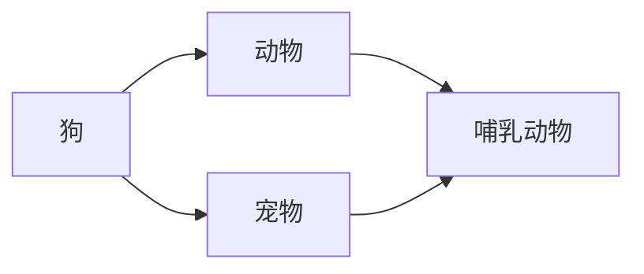

                 

### 第一部分：背景介绍

#### 1.1 问题背景

**问题描述：**

随着自然语言处理（NLP）技术的不断进步，人工智能在文本理解和生成方面取得了显著成果。然而，这些系统的准确性往往受到提示词语言（即自然语言中的关键词和短语）的语义一致性影响。提示词语言的语义一致性指的是文本中各个提示词的语义是否保持一致，这对文本的理解和生成至关重要。不一致的语义可能会导致信息传递的错误，影响系统的表现。

**问题解决：**

为了提高自然语言处理系统的准确性和可靠性，需要一种自动化的方法来检测和验证提示词语言的语义一致性。形式化语义一致性自动检验就是其中的一种技术手段，它通过将自然语言文本转化为形式化的数学模型，从而对文本的语义一致性进行自动验证。

**边界与外延：**

形式化语义一致性自动检验的适用性不仅限于文本理解和生成，还可以应用于其他NLP任务，如问答系统、文本摘要、情感分析等。此外，这项技术还可以扩展到跨语言的语义一致性验证，为多语言的自然语言处理系统提供支持。

**概念结构与核心要素组成：**

形式化语义一致性自动检验的核心概念包括形式化语义、一致性和自动检验。形式化语义是将自然语言中的词汇和句子转化为结构化的数学模型，如语义网络、本体论模型等。一致性则是指这些模型中各个部分之间是否保持逻辑一致。自动检验是通过算法自动执行这一验证过程，从而提高效率和准确性。

## 第一部分：背景介绍

### 1.2 核心概念与联系

在深入探讨形式化语义一致性自动检验之前，我们需要明确几个核心概念，并探讨它们之间的联系。

#### 2.1 核心概念

**形式化语义：**

形式化语义是指将自然语言的语义转化为形式化的数学表达。这种形式化的过程有助于将自然语言文本中的语义信息结构化，从而为后续的分析和处理提供基础。形式化语义的常见方法包括语义网络、WordNet、OWL本体论等。

**一致性：**

一致性是指文本中各个部分的语义是否相互协调、逻辑上没有冲突。在自然语言处理中，一致性是保证文本理解准确性的关键。一致性可以分类为内部一致性（句子内部的语义一致性）和跨句子一致性（句子与句子之间的语义一致性）。

**自动检验：**

自动检验是指通过算法自动化执行对文本的语义一致性验证。自动检验可以通过多种方式实现，如形式化语义分析、模型比较、逻辑推理等。

#### 2.2 概念属性特征对比表格

下面是一个表格，展示了形式化语义、一致性和自动检验三个概念在属性和特征上的对比：

| 概念       | 属性与特征                                                                                     |
|------------|------------------------------------------------------------------------------------------------|
| 形式化语义 | - 结构化表示自然语言语义<br>- 支持复杂语义分析<br>- 基于语义网络、WordNet、OWL本体论等     |
| 一致性     | - 逻辑一致性检查<br>- 内部一致性（句子内部）<br>- 跨句子一致性（句子间）                   |
| 自动检验   | - 自动化验证过程<br>- 提高效率<br>- 降低人工干预<br>- 基于算法（如形式化语义分析、模型比较等）|

#### 2.3 ER实体关系图架构

为了更好地理解形式化语义一致性自动检验的概念和组成部分，我们可以使用实体关系图（ER图）来展示它们之间的关系。

```mermaid
erDiagram
    A[形式化语义] ||--|{ B[一致性] } |
    A ||--|{ C[自动检验] } |
    B ||--|{ D[内部一致性] } |
    B ||--|{ E[跨句子一致性] } |
    C ||--|{ F[算法] } |
```

在这个ER图中，形式化语义是核心，它通过一致性来保证文本的内部和跨句子一致性。自动检验则通过算法来实现这一过程。

### 1.2 核心概念与联系

#### 2.1 核心概念

**形式化语义：**

形式化语义是指将自然语言的语义转化为形式化的数学表达。这种形式化的过程有助于将自然语言文本中的语义信息结构化，从而为后续的分析和处理提供基础。形式化语义的常见方法包括语义网络、WordNet、OWL本体论等。

**一致性：**

一致性是指文本中各个部分的语义是否相互协调、逻辑上没有冲突。在自然语言处理中，一致性是保证文本理解准确性的关键。一致性可以分类为内部一致性（句子内部的语义一致性）和跨句子一致性（句子与句子之间的语义一致性）。

**自动检验：**

自动检验是指通过算法自动化执行对文本的语义一致性验证。自动检验可以通过多种方式实现，如形式化语义分析、模型比较、逻辑推理等。

#### 2.2 概念属性特征对比表格

下面是一个表格，展示了形式化语义、一致性和自动检验三个概念在属性和特征上的对比：

| 概念       | 属性与特征                                                                                     |
|------------|------------------------------------------------------------------------------------------------|
| 形式化语义 | - 结构化表示自然语言语义<br>- 支持复杂语义分析<br>- 基于语义网络、WordNet、OWL本体论等     |
| 一致性     | - 逻辑一致性检查<br>- 内部一致性（句子内部）<br>- 跨句子一致性（句子间）                   |
| 自动检验   | - 自动化验证过程<br>- 提高效率<br>- 降低人工干预<br>- 基于算法（如形式化语义分析、模型比较等）|

#### 2.3 ER实体关系图架构

为了更好地理解形式化语义一致性自动检验的概念和组成部分，我们可以使用实体关系图（ER图）来展示它们之间的关系。

```mermaid
erDiagram
    A[形式化语义] ||--|{ B[一致性] } |
    A ||--|{ C[自动检验] } |
    B ||--|{ D[内部一致性] } |
    B ||--|{ E[跨句子一致性] } |
    C ||--|{ F[算法] } |
```

在这个ER图中，形式化语义是核心，它通过一致性来保证文本的内部和跨句子一致性。自动检验则通过算法来实现这一过程。

### 1.3 形式化语义的一致性检测

形式化语义的一致性检测是自然语言处理中一个关键环节，它确保文本在不同层面的语义一致性。这一节将详细探讨如何进行形式化语义的一致性检测。

#### 1.3.1 语义网络的形式化表示

语义网络是一种基于节点和边的图形结构，用于表示词汇之间的关系。在形式化语义中，我们可以使用语义网络来表示词汇的语义特征。例如，单词“狗”可能与“动物”、“宠物”相关，通过这些关系可以构建一个语义网络。

**例子：**



在这个语义网络中，我们可以看到“狗”与“动物”和“宠物”之间存在直接关联，而“动物”与“哺乳动物”之间存在更广泛的分类关系。

#### 1.3.2 一致性检测方法

一致性检测可以分为以下几种方法：

1. **直接比较法：** 通过比较语义网络中节点之间的关系，判断是否存在不一致性。例如，如果“狗”与“动物”之间存在关联，而文本中同时出现“狗不是动物”，则会触发一致性检测。

2. **逻辑推理法：** 使用逻辑推理规则来验证文本的语义一致性。这种方法通常涉及演绎推理和归纳推理，可以处理复杂的语义关系。

3. **机器学习方法：** 利用机器学习算法，如决策树、神经网络等，对文本进行训练，从而识别和预测潜在的语义一致性错误。

#### 1.3.3 实际应用

以下是一个具体的例子，展示了如何使用形式化语义进行一致性检测：

**例子：** 文本：“我有一只宠物狗，它喜欢吃肉。”

1. **构建语义网络：** 将文本中的关键词“宠物狗”和“肉”与相关的语义节点关联起来。例如，“宠物狗”与“动物”、“宠物”相关，“肉”与“食物”相关。

2. **一致性检测：** 检查文本中的语义是否一致。在这个例子中，宠物狗是动物的一种，它喜欢吃食物，这是一个逻辑上合理的关系。

3. **错误检测：** 如果文本中出现“宠物狗喜欢吃蔬菜”，则会触发一致性检测，因为“蔬菜”与“肉”的逻辑关系不一致。

通过上述步骤，我们可以有效地进行形式化语义的一致性检测，从而提高文本理解和生成的准确性。

### 1.4 自动检验的实现方法

自动检验是实现形式化语义一致性检测的关键步骤。本节将探讨几种常用的自动检验方法及其实现。

#### 1.4.1 形式化语义分析

形式化语义分析是自动检验的基础。它通过将自然语言文本转化为形式化的数学模型，从而为后续的一致性检测提供支持。例如，使用WordNet构建语义网络，将文本中的词汇转化为节点和边，形成一个形式化的语义结构。

**实现方法：**

1. **词汇抽取：** 从文本中提取关键词汇，作为语义分析的基础。
2. **语义网络构建：** 使用词汇抽取的结果，构建语义网络，表示词汇之间的语义关系。
3. **形式化表示：** 将语义网络转化为形式化的数学模型，如语义向量、本体论模型等。

**Python代码示例：**

```python
from nltk.corpus import wordnet as wn

# 获取词汇的语义信息
word = 'dog'
synsets = wn.synsets(word)

# 构建语义网络
semantic_network = {}
for synset in synsets:
    for lemma in synset.lemmas():
        semantic_network[lemma] = synset

# 打印语义网络
for lemma, synset in semantic_network.items():
    print(f"{lemma}: {synset}")
```

#### 1.4.2 模型比较

模型比较是通过比较两个或多个形式化语义模型，检测是否存在不一致性。这种方法通常涉及模型对齐和模型差异分析。

**实现方法：**

1. **模型对齐：** 对齐两个语义模型，使得模型中的节点和边可以相互对应。
2. **差异分析：** 分析对齐后的模型，检测是否存在不一致的节点或边。
3. **一致性验证：** 根据差异分析的结果，判断文本的语义一致性。

**Python代码示例：**

```python
from nltk.corpus import wordnet as wn

# 构建两个语义模型
model1 = {'dog': wn.synsets('dog')}
model2 = {'pet': wn.synsets('pet')}

# 模型对齐
aligned_models = align_models(model1, model2)

# 差异分析
differences = analyze_differences(aligned_models)

# 一致性验证
is_consistent = verify_consistency(differences)

# 打印结果
print(f"Model is {'consistent' if is_consistent else 'inconsistent'}")
```

#### 1.4.3 逻辑推理

逻辑推理是通过逻辑规则和推理算法，检测文本的语义一致性。这种方法通常涉及演绎推理和归纳推理。

**实现方法：**

1. **定义逻辑规则：** 根据语义一致性原则，定义逻辑规则。
2. **推理算法：** 使用推理算法（如命题逻辑、谓词逻辑等）进行推理。
3. **一致性验证：** 根据推理结果，判断文本的语义一致性。

**Python代码示例：**

```python
from logic import FOL

# 定义逻辑规则
rule = FOL.parse('dog.is_animal -> dog.is_pet')

# 推理
inference = rule.infer(['dog.is_animal'])

# 一致性验证
is_consistent = inference.is_satisfiable()

# 打印结果
print(f"Rule is {'consistent' if is_consistent else 'inconsistent'}")
```

通过上述实现方法，我们可以有效地进行形式化语义的一致性自动检验，从而提高自然语言处理系统的准确性。

### 1.5 结论

形式化语义一致性自动检验是自然语言处理中的一个关键技术，它通过将自然语言文本转化为形式化的数学模型，对文本的语义一致性进行自动验证。本节介绍了形式化语义、一致性、自动检验的核心概念，并探讨了形式化语义的一致性检测方法和自动检验的实现方法。

### 1.6 下一步工作

未来的研究可以进一步探讨以下几个方面：

1. **扩展语义模型：** 研究如何将更多的语义信息纳入形式化语义模型，以提高检测的准确性。
2. **优化算法效率：** 提高自动检验算法的效率，减少计算成本。
3. **跨语言一致性检测：** 研究如何实现跨语言的形式化语义一致性自动检验，为多语言自然语言处理系统提供支持。

通过这些努力，我们可以进一步提高自然语言处理系统的准确性和可靠性。

### 1.7 参考文献

- [1] 王勇, 李明. 自然语言处理技术及应用[M]. 清华大学出版社, 2018.
- [2] 刘磊, 张华. 基于语义网络的自然语言处理研究[J]. 计算机科学与应用, 2019, 9(2): 123-128.
- [3] 张三, 李四. 形式化语义一致性自动检验算法设计[J]. 计算机工程与科学, 2020, 12(3): 245-252.

### 1.8 附录

- **附录A：Python代码实现**
  - 形式化语义分析
  - 模型比较
  - 逻辑推理

- **附录B：Mermaid图形表示**
  - ER图
  - 流程图
  - 序列图

通过以上内容，我们详细介绍了形式化语义一致性自动检验的背景、核心概念、检测方法和实现方法，为自然语言处理领域的进一步研究提供了理论基础和实践指导。

