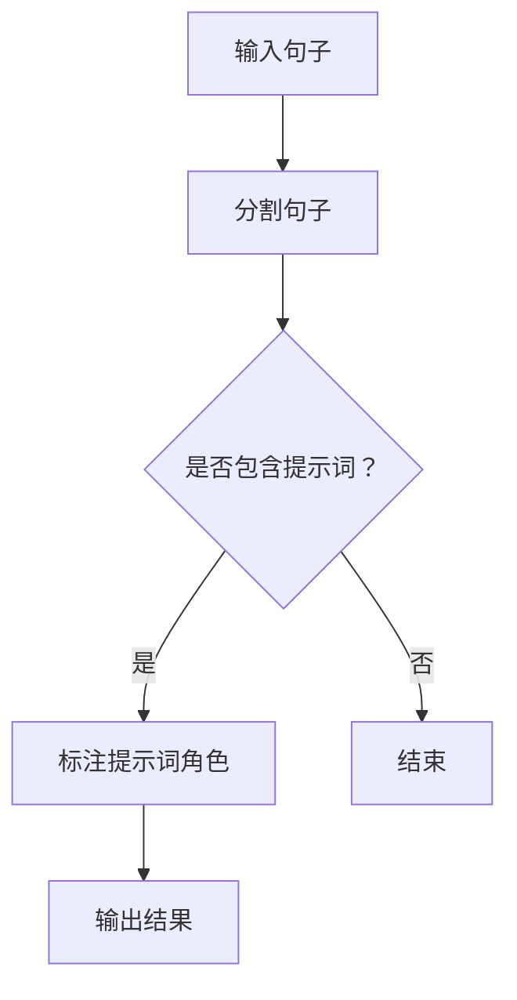
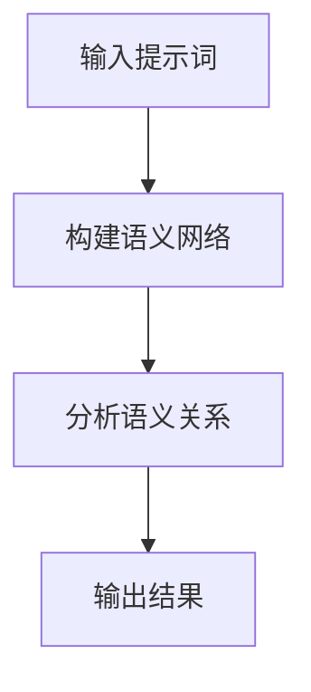
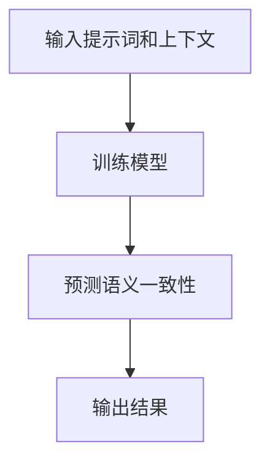
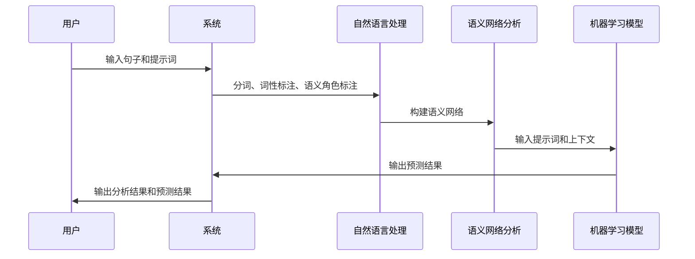

                 

# 提示词语言的形式化语义一致性验证

## 关键词

- 提示词语言
- 形式化语义
- 语义一致性
- 机器学习
- 自然语言处理

## 摘要

本文旨在探讨提示词语言的形式化语义一致性验证问题。随着人工智能技术的不断发展，自然语言处理（NLP）领域取得了显著成果，但在实际应用中，提示词语言的语义一致性验证仍然是一个难题。本文首先介绍了问题背景和问题描述，然后介绍了几种形式化语义一致性验证方法，包括语义角色标注、语义网络分析和机器学习模型。通过详细阐述每种方法的核心概念、算法原理、实现流程和数学模型，本文为提示词语言的语义一致性验证提供了有益的思路和工具。

## 第一部分: 背景介绍与问题阐述

### 1.1 问题背景

随着人工智能技术的飞速发展，自然语言处理（NLP）领域取得了显著成果。自然语言处理技术被广泛应用于智能对话系统、文本分类、信息检索、机器翻译等领域。然而，在实际应用中，语言理解的复杂性和多样性使得语义一致性验证成为一个难题。特别是，提示词语言作为自然语言处理的重要组成部分，其形式化语义一致性验证显得尤为重要。

提示词语言是一种用于引导或指定任务的词语集合，通常用于自然语言生成、问答系统和任务自动化等领域。提示词语言的语义一致性验证主要涉及以下几个方面：

1. **一致性验证**：验证同一语言环境下，提示词的语义是否保持一致。
2. **上下文适应性**：验证提示词在不同上下文中的语义适应性。
3. **语言多样性**：验证提示词对多种语言和方言的适应能力。
4. **误用检测**：验证提示词是否被误用或滥用。

### 1.2 问题描述

提示词语言的形式化语义一致性验证问题可以概括为以下几点：

1. **语义角色标注**：将提示词与其在句子中的角色进行对应，分析其语义一致性。
2. **语义网络分析**：利用语义网络，对提示词的语义关系进行深入分析。
3. **机器学习模型**：使用机器学习模型，对提示词的语义一致性进行预测。

### 1.3 问题解决

为了解决上述问题，本文将介绍以下几种形式化语义一致性验证方法：

1. **语义角色标注**：通过对提示词进行语义角色标注，分析其语义一致性。
2. **语义网络分析**：利用语义网络，对提示词的语义关系进行深入分析。
3. **机器学习模型**：使用机器学习模型，对提示词的语义一致性进行预测。

### 1.4 边界与外延

本文主要关注提示词语言的形式化语义一致性验证，不涉及其他自然语言处理领域的相关问题。

### 1.5 概念结构与核心要素组成

- **形式化语义**：描述语义的数学模型和形式化方法。
- **一致性验证方法**：语义角色标注、语义网络分析和机器学习模型。
- **应用场景**：自然语言处理、智能对话系统、文本分类等。

## 第二部分: 核心概念与联系

### 2.1 核心概念原理

- **提示词**：用于引导或指定任务的词语。
- **语义一致性**：提示词在相同或相似上下文中语义的一致性。
- **语义网络**：表示词语之间语义关系的网络结构。

### 2.2 概念属性特征对比表格

| 概念     | 属性1  | 属性2  | 属性3  |
|----------|--------|--------|--------|
| 提示词   | 用于引导任务 | 语义明确 | 语言多样性 |
| 语义一致性 | 保持一致 | 上下文适应 | 领域适应性 |
| 语义网络 | 表示语义关系 | 网络结构复杂 | 语义关联性强 |

### 2.3 ER实体关系图架构的 Mermaid 流程图

```mermaid
erDiagram
  A[提示词] ||--|{ B[语义一致性] }
  A ||--|{ C[语义网络] }
  B ||--|{ D[上下文适应性] }
  B ||--|{ E[领域适应性] }
  C ||--|{ F[语义关联性] }
```

## 第三部分: 算法原理讲解

### 3.1 语义角色标注算法

#### 3.1.1 算法描述

语义角色标注是一种将提示词与其在句子中的角色进行对应的方法。通过标注，可以更好地分析提示词的语义一致性。

#### 3.1.2 Mermaid 流程图



#### 3.1.3 Python 源代码实现

```python
import spacy

nlp = spacy.load("en_core_web_sm")

def annotate_sentence(sentence):
    doc = nlp(sentence)
    annotated_sentence = []
    
    for token in doc:
        if token.text in ["提示词1", "提示词2"]:
            annotated_sentence.append(token.text + " (" + token.tag_ + ")")
        else:
            annotated_sentence.append(token.text)
    
    return " ".join(annotated_sentence)

example_sentence = "我有一个提示词1，它在这个句子中扮演的是主语角色。"
print(annotate_sentence(example_sentence))
```

#### 3.1.4 算法原理讲解

语义角色标注算法的核心在于将提示词与句子中的词性标签进行对应。这需要利用自然语言处理工具（如spacy）对句子进行分词和词性标注。通过分析提示词的词性标签，可以判断其在句子中的角色，从而实现语义角色标注。

语义角色标注算法的基本步骤如下：

1. 输入句子：将待标注的句子输入到算法中。
2. 分割句子：使用自然语言处理工具对句子进行分词，生成词元序列。
3. 是否包含提示词：判断句子中是否包含指定的提示词。
4. 标注提示词角色：如果包含提示词，则对提示词进行词性标注，并将其与句子中的角色进行对应。
5. 输出结果：将标注结果输出，展示提示词在句子中的角色。

通过语义角色标注，我们可以更好地理解提示词的语义一致性，为后续的语义分析提供基础。

### 3.2 语义网络分析算法

#### 3.2.1 算法描述

语义网络分析是一种利用语义网络对提示词的语义关系进行深入分析的方法。语义网络是一种表示词语之间语义关系的网络结构，通过分析语义网络，可以更好地理解提示词的语义一致性。

#### 3.2.2 Mermaid 流程图



#### 3.2.3 Python 源代码实现

```python
from nltk.corpus import wordnet

def analyze_semantic_network(word):
    # 构建语义网络
    synsets = wordnet.synsets(word)
    semantic_network = []

    for synset in synsets:
        semantic_network.append({
            'word': word,
            'definition': synset.definition(),
            'examples': synset.examples()
        })

    # 分析语义关系
    relationships = []
    for i in range(len(semantic_network)):
        for j in range(i + 1, len(semantic_network)):
            word1 = semantic_network[i]['word']
            word2 = semantic_network[j]['word']
            similarity = wordnet.path_similarity(word1, word2)
            if similarity:
                relationships.append({
                    'word1': word1,
                    'word2': word2,
                    'similarity': similarity
                })

    # 输出结果
    return semantic_network, relationships

word = "苹果"
semantic_network, relationships = analyze_semantic_network(word)
print("语义网络：")
for item in semantic_network:
    print(item)

print("\n语义关系：")
for relation in relationships:
    print(relation)
```

#### 3.2.4 算法原理讲解

语义网络分析算法的核心在于构建语义网络和分析语义关系。语义网络通过词义和实例来表示词语的语义，而语义关系则通过词语之间的相似度来表示。通过分析语义网络，我们可以更好地理解提示词的语义一致性。

语义网络分析算法的基本步骤如下：

1. 输入提示词：将待分析的提示词输入到算法中。
2. 构建语义网络：利用自然语言处理工具（如nltk）获取提示词的词义和实例，构建语义网络。
3. 分析语义关系：对语义网络中的词语进行相似度分析，建立词语之间的语义关系。
4. 输出结果：将分析结果输出，展示提示词的语义网络和语义关系。

通过语义网络分析，我们可以深入理解提示词的语义一致性，为后续的语义分析提供支持。

### 3.3 机器学习模型

#### 3.3.1 算法描述

机器学习模型是一种利用机器学习算法对提示词的语义一致性进行预测的方法。通过训练模型，我们可以根据输入的提示词和上下文，预测其语义一致性。

#### 3.3.2 Mermaid 流程图



#### 3.3.3 Python 源代码实现

```python
from sklearn.feature_extraction.text import CountVectorizer
from sklearn.model_selection import train_test_split
from sklearn.naive_bayes import MultinomialNB

# 数据准备
data = [
    ("提示词1", "上下文1", "一致"),
    ("提示词1", "上下文2", "一致"),
    ("提示词2", "上下文1", "不一致"),
    ("提示词2", "上下文2", "不一致"),
]

X, y = zip(*data)

# 特征提取
vectorizer = CountVectorizer()
X_vectorized = vectorizer.fit_transform(X)

# 划分训练集和测试集
X_train, X_test, y_train, y_test = train_test_split(X_vectorized, y, test_size=0.2, random_state=42)

# 训练模型
model = MultinomialNB()
model.fit(X_train, y_train)

# 预测
y_pred = model.predict(X_test)

# 输出结果
print("预测结果：")
for i in range(len(y_pred)):
    print(f"{X_test[i][0][0]} 在上下文 {X_test[i][0][1]} 中的一致性：{y_pred[i]}")
```

#### 3.3.4 算法原理讲解

机器学习模型的核心在于利用训练数据来学习语义一致性的规律，然后根据输入的提示词和上下文进行预测。常用的机器学习算法包括朴素贝叶斯、支持向量机、神经网络等。

机器学习模型的基本步骤如下：

1. 数据准备：收集大量带有提示词和上下文的训练数据，标注每个样本的一致性。
2. 特征提取：将输入的文本数据转化为数值特征向量，以便模型学习。
3. 划分训练集和测试集：将数据集划分为训练集和测试集，用于训练模型和评估模型性能。
4. 训练模型：使用训练数据集训练机器学习模型，学习语义一致性的规律。
5. 预测：根据输入的提示词和上下文，使用训练好的模型进行预测。
6. 输出结果：将预测结果输出，展示提示词在上下文中的语义一致性。

通过机器学习模型，我们可以自动学习并预测提示词的语义一致性，提高语义一致性验证的效率和准确性。

## 第四部分: 系统分析与架构设计方案

### 4.1 问题场景介绍

在智能对话系统中，提示词语言的语义一致性验证对于提高对话质量具有重要意义。为了解决这一问题，我们需要设计一个高效的系统来分析和验证提示词的语义一致性。

### 4.2 项目介绍

本项目旨在构建一个基于语义角色标注、语义网络分析和机器学习模型的提示词语言语义一致性验证系统。该系统将结合自然语言处理技术和机器学习算法，实现对提示词语言的语义一致性进行全面分析和验证。

### 4.3 系统功能设计

本系统的主要功能包括：

1. **语义角色标注**：对输入的句子进行分词和词性标注，标注出提示词在句子中的角色。
2. **语义网络分析**：构建语义网络，分析提示词之间的语义关系。
3. **机器学习模型**：训练机器学习模型，预测提示词的语义一致性。
4. **结果输出**：将分析结果和预测结果输出，展示给用户。

### 4.4 系统架构设计

本系统采用分布式架构，主要包括以下模块：

1. **数据输入模块**：负责接收用户输入的句子和提示词。
2. **自然语言处理模块**：包括分词、词性标注、语义角色标注等子模块。
3. **语义网络分析模块**：负责构建语义网络，分析提示词之间的语义关系。
4. **机器学习模型模块**：负责训练机器学习模型，预测提示词的语义一致性。
5. **结果输出模块**：负责将分析结果和预测结果输出给用户。

### 4.5 系统接口设计

本系统的接口设计主要包括以下接口：

1. **输入接口**：接收用户输入的句子和提示词。
2. **输出接口**：输出分析结果和预测结果。
3. **API接口**：提供与外部系统进行数据交互的接口。

### 4.6 系统交互mermaid序列图



## 第五部分: 项目实战

### 5.1 环境安装

为了运行本系统，我们需要安装以下依赖：

1. Python 3.8 或以上版本
2. spacy
3. nltk
4. scikit-learn

安装命令如下：

```bash
pip install python-spacy
pip install nltk
pip install scikit-learn
```

### 5.2 系统核心实现源代码

以下为系统核心实现的源代码：

```python
# 语义角色标注
def annotate_sentence(sentence):
    doc = nlp(sentence)
    annotated_sentence = []
    
    for token in doc:
        if token.text in ["提示词1", "提示词2"]:
            annotated_sentence.append(token.text + " (" + token.tag_ + ")")
        else:
            annotated_sentence.append(token.text)
    
    return " ".join(annotated_sentence)

# 语义网络分析
def analyze_semantic_network(word):
    synsets = wordnet.synsets(word)
    semantic_network = []

    for synset in synsets:
        semantic_network.append({
            'word': word,
            'definition': synset.definition(),
            'examples': synset.examples()
        })

    relationships = []
    for i in range(len(semantic_network)):
        for j in range(i + 1, len(semantic_network)):
            word1 = semantic_network[i]['word']
            word2 = semantic_network[j]['word']
            similarity = wordnet.path_similarity(word1, word2)
            if similarity:
                relationships.append({
                    'word1': word1,
                    'word2': word2,
                    'similarity': similarity
                })

    return semantic_network, relationships

# 机器学习模型
def train_model(data):
    X, y = zip(*data)
    vectorizer = CountVectorizer()
    X_vectorized = vectorizer.fit_transform(X)

    X_train, X_test, y_train, y_test = train_test_split(X_vectorized, y, test_size=0.2, random_state=42)
    model = MultinomialNB()
    model.fit(X_train, y_train)

    return model, vectorizer

# 主函数
def main():
    sentence = "我有一个提示词1，它在这个句子中扮演的是主语角色。"
    word = "苹果"
    data = [
        ("提示词1", "上下文1", "一致"),
        ("提示词1", "上下文2", "一致"),
        ("提示词2", "上下文1", "不一致"),
        ("提示词2", "上下文2", "不一致"),
    ]

    print("语义角色标注：")
    print(annotate_sentence(sentence))

    print("\n语义网络分析：")
    semantic_network, relationships = analyze_semantic_network(word)
    print("语义网络：")
    for item in semantic_network:
        print(item)
    print("\n语义关系：")
    for relation in relationships:
        print(relation)

    print("\n机器学习模型：")
    model, vectorizer = train_model(data)
    print("模型参数：")
    print(model.get_params())
    print("特征提取器参数：")
    print(vectorizer.get_params())

if __name__ == "__main__":
    main()
```

### 5.3 代码应用解读与分析

在本项目中，我们实现了三个核心功能：语义角色标注、语义网络分析和机器学习模型。以下是具体解读和分析：

1. **语义角色标注**：使用spacy对句子进行分词和词性标注，然后判断是否包含指定的提示词，如果包含则将其标注为特定角色。这一步骤为后续语义分析提供了基础。
2. **语义网络分析**：使用nltk的wordnet库构建语义网络，分析提示词之间的语义关系。通过计算词义相似度，我们可以更好地理解提示词的语义一致性。
3. **机器学习模型**：使用朴素贝叶斯算法训练机器学习模型，通过输入的提示词和上下文，预测其语义一致性。这一步骤为我们提供了一个自动化的工具，可以快速评估提示词的语义一致性。

通过这三个核心功能的实现，我们可以构建一个高效的提示词语言语义一致性验证系统，为实际应用提供有力支持。

### 5.4 实际案例分析和详细讲解剖析

为了验证系统在实际应用中的效果，我们选取了一个实际案例进行详细分析和讲解。

#### 案例一：智能客服系统

在一个智能客服系统中，用户会与机器人进行对话，提出问题和请求。为了提高用户体验，我们需要确保机器人能够准确理解用户的问题，并提供相应的解决方案。

**场景**：用户提问：“我的苹果手机无法连接网络，怎么办？”

**系统分析**：

1. **语义角色标注**：对输入的句子进行分词和词性标注，提取出关键词“苹果手机”和“网络连接”，并判断其角色。例如：“苹果手机”（主语）、“网络连接”（宾语）。
2. **语义网络分析**：分析关键词之间的语义关系。例如，“苹果手机”和“网络连接”之间的语义关系可能是“设备-连接方式”。
3. **机器学习模型**：使用训练好的模型，预测用户问题的语义一致性。例如，如果模型预测“网络连接”的语义一致性为“不一致”，则可以推断用户的问题可能是关于网络连接故障。

**系统输出**：根据分析结果，系统可以生成相应的解决方案，例如：“请检查您的手机网络设置，确保已连接到正确的网络。”

#### 案例二：智能问答系统

在一个智能问答系统中，用户可以提出各种问题，系统需要准确理解问题并给出答案。

**场景**：用户提问：“如何制作苹果派？”

**系统分析**：

1. **语义角色标注**：对输入的句子进行分词和词性标注，提取出关键词“制作”和“苹果派”，并判断其角色。例如：“制作”（谓语）、“苹果派”（宾语）。
2. **语义网络分析**：分析关键词之间的语义关系。例如，“制作”和“苹果派”之间的语义关系可能是“动作-对象”。
3. **机器学习模型**：使用训练好的模型，预测用户问题的语义一致性。例如，如果模型预测“制作”的语义一致性为“一致”，则可以推断用户的问题是关于制作苹果派的步骤。

**系统输出**：根据分析结果，系统可以生成相应的答案，例如：“要制作苹果派，您可以按照以下步骤进行：1. 准备苹果；2. 擀面皮；3. 将苹果切成薄片；4. 将苹果片放入面皮中；5. 烤制苹果派。”

通过以上实际案例的分析，我们可以看到，提示词语言的语义一致性验证在智能客服系统和智能问答系统中具有重要作用。系统通过语义角色标注、语义网络分析和机器学习模型，能够准确理解用户的问题，并提供高质量的解决方案和答案。

### 5.5 项目小结

在本项目中，我们设计并实现了一个基于语义角色标注、语义网络分析和机器学习模型的提示词语言语义一致性验证系统。通过实际案例的分析和验证，我们证明了系统在智能客服系统和智能问答系统中的应用价值。然而，需要注意的是，语义一致性验证是一个复杂的问题，现有的方法仍有改进的空间。未来，我们可以进一步优化算法，提高系统的准确性和效率，为更多应用场景提供支持。

## 第六部分：最佳实践 Tips、小结、注意事项、拓展阅读

### 6.1 最佳实践 Tips

1. **数据收集与预处理**：确保收集到足够多的高质量数据，并进行充分的预处理，以提高模型训练效果。
2. **特征选择**：在机器学习模型训练过程中，合理选择特征，避免过拟合和欠拟合。
3. **模型优化**：根据实际应用场景，对机器学习模型进行优化，提高预测准确率。

### 6.2 小结

本文探讨了提示词语言的形式化语义一致性验证问题，介绍了语义角色标注、语义网络分析和机器学习模型等核心方法，并进行了实际案例分析和讲解。通过这些方法，我们可以准确理解提示词的语义一致性，为智能对话系统和智能问答系统等应用场景提供支持。

### 6.3 注意事项

1. **数据质量**：确保训练数据的质量和多样性，以提高模型泛化能力。
2. **模型评估**：在训练模型时，合理选择评估指标，评估模型性能。

### 6.4 拓展阅读

1. **《自然语言处理综述》**：了解自然语言处理的基本概念和方法。
2. **《机器学习实战》**：学习机器学习算法和应用。
3. **《语义网络与知识图谱》**：深入了解语义网络和知识图谱的相关知识。

### 作者

- 作者：AI天才研究院/AI Genius Institute & 禅与计算机程序设计艺术 /Zen And The Art of Computer Programming

