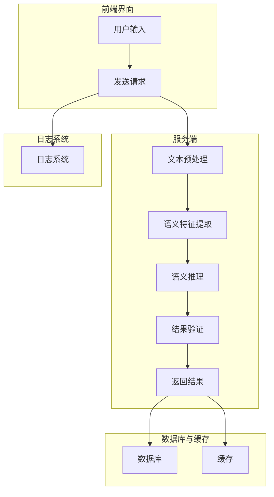

                 

# 提示词语言的形式化语义推理自动化

## 关键词

- 形式化语义推理
- 自动化
- 提示词语言
- 语义网络模型
- 深度学习
- 系统架构设计

## 摘要

本文旨在探讨提示词语言的形式化语义推理自动化问题，通过背景介绍、核心概念讲解、算法原理分析、深度学习应用、系统设计与实战等多个方面，详细阐述形式化语义推理的必要性和实现方法。文章不仅涵盖了理论基础，还包括了实际项目案例的分析与讲解，旨在为读者提供系统、全面的理解和实用的指导。

## 目录大纲

### 第一部分：引论

#### 第1章：背景介绍

1.1 问题背景  
1.2 问题描述  
1.3 问题解决  
1.4 边界与外延  
1.5 概念结构与核心要素组成

#### 第2章：核心概念与联系

2.1 核心概念原理  
2.2 概念属性特征对比表格  
2.3 ER实体关系图架构

### 第二部分：算法原理讲解

#### 第3章：形式化语义推理基础

3.1 算法原理概述  
3.2 算法流程与mermaid流程图  
3.3 数学模型与公式  
3.4 算法示例讲解

#### 第4章：深度学习在语义推理中的应用

4.1 深度学习基础  
4.2 深度学习在语义推理中的优势  
4.3 深度学习语义推理算法  
4.4 深度学习算法应用示例

### 第三部分：系统分析与架构设计

#### 第5章：系统功能设计

5.1 问题场景介绍  
5.2 系统功能设计

#### 第6章：系统架构设计

6.1 系统架构设计概述  
6.2 系统架构mermaid图  
6.3 系统接口设计

#### 第7章：系统交互与序列图

7.1 系统交互设计  
7.2 系统交互mermaid序列图

### 第四部分：项目实战

#### 第8章：环境安装与准备

8.1 环境安装  
8.2 系统核心实现

#### 第9章：代码应用解读与分析

9.1 代码应用解读  
9.2 代码分析

#### 第10章：实际案例分析与讲解

10.1 案例选择  
10.2 案例分析  
10.3 案例讲解

#### 第11章：项目小结

11.1 项目总结  
11.2 最佳实践与注意事项  
11.3 拓展阅读

## 第一部分：引论

### 第1章：背景介绍

#### 1.1 问题背景

提示词语言是一种用于指导计算机执行特定任务的标记语言，广泛应用于自然语言处理、人工智能、知识图谱等领域。形式化语义推理则是一种通过数学和逻辑方法，从形式化表示的文本中推断出其语义的方法。自动化是指通过算法和系统实现这一过程，以减少人工干预，提高效率和准确性。

#### 1.2 问题描述

提示词语言的复杂性使得语义推理成为一大挑战。如何将自然语言转换为形式化表示，并在形式化表示的基础上进行准确推理，是目前研究的热点和难点。此外，自动化是实现高效推理的关键，但如何设计出既准确又高效的形式化语义推理算法，仍需深入探讨。

#### 1.3 问题解决

形式化语义推理的必要性在于，它能够将自然语言的不确定性转化为形式化的确定性，从而提高推理的准确性。相关技术的发展历程包括从基于规则的方法到基于统计的方法，再到当前的基于深度学习的方法。主要研究方法包括形式语言理论、语义网络模型、基于规则和统计的方法等。

#### 1.4 边界与外延

形式化语义推理主要适用于需要高精度推理的场景，如自然语言处理、知识图谱构建等。与非形式化语义推理相比，形式化语义推理更加严谨和系统，但同时也更加复杂和难以实现。

#### 1.5 概念结构与核心要素组成

提示词语言的形式化描述包括语法和语义两个层面。语法层面涉及语言的结构和规则，如词汇、句子结构等；语义层面涉及语言所表达的意图和概念，如语义角色、语义关系等。语义推理的核心概念包括语义相似度计算、语义关系推断、逻辑推理与证明等。形式化语义推理的基本框架包括预处理、语义特征提取、语义推理算法和结果验证等环节。

### 第2章：核心概念与联系

#### 2.1 核心概念原理

形式化语义推理的基础是形式语言理论和语义网络模型。形式语言理论提供了一种数学化的方法来描述语言，使得语义分析变得更加精确和系统。语义网络模型则通过节点和边来表示语义实体及其关系，为语义推理提供了直观的图示方法。

#### 2.2 概念属性特征对比表格

| 概念             | 特征描述                                                 |
|------------------|---------------------------------------------------------|
| 形式语言理论     | 提供了语法和语义的数学描述，精确而系统                 |
| 语义网络模型     | 通过节点和边表示语义实体及其关系，直观且易于理解       |
| 基于规则的方法   | 使用预定义的规则进行语义推理，准确但需大量规则支持     |
| 基于统计的方法   | 通过大量数据学习语义模式，自适应性强但易受数据质量影响 |
| 深度学习方法     | 通过神经网络自动学习语义特征，适应性强且精度高         |

#### 2.3 ER实体关系图架构

ER实体关系图是一种用于描述实体及其关系的图形化工具。在形式化语义推理中，ER图可用于表示语义实体和其间的语义关系。以下是一个简单的ER图示例：

```mermaid
erDiagram
  Customer ||--|{ Order }|
  Product ||--|{ Order }|
  Order ||--|{ Item }|
```

在这个ER图中，`Customer`、`Product`和`Order`是实体，`Order`与`Customer`和`Product`之间存在关系。这种关系可以通过语义特征和推理算法进一步分析。

## 第二部分：算法原理讲解

### 第3章：形式化语义推理基础

#### 3.1 算法原理概述

形式化语义推理的基本原理是将自然语言文本转换为形式化的语义表示，然后利用数学和逻辑方法进行语义推理。这一过程主要包括以下步骤：

1. **预处理**：对输入文本进行清洗、分词、词性标注等处理，以获得更干净和结构化的文本数据。
2. **语义特征提取**：从预处理后的文本中提取语义特征，如词语的语义角色、语义类型等，为后续推理提供基础。
3. **语义推理算法**：利用提取的语义特征，通过语义相似度计算、语义关系推断等算法进行推理。
4. **结果验证**：对推理结果进行验证，确保其准确性和一致性。

#### 3.2 算法流程与mermaid流程图

形式化语义推理的算法流程可以表示为以下mermaid流程图：


#### 3.3 数学模型与公式

形式化语义推理中的数学模型主要涉及语义相似度计算和语义关系推断。以下是一些常用的公式：

- **语义相似度计算**：

  $$ S(A, B) = \frac{1}{|D|} \sum_{i=1}^{D} \frac{1}{1 + \exp{(-\beta \cdot d(A_i, B_i))}} $$

  其中，$A$和$B$是两个语义实体，$D$是它们之间的距离，$\beta$是调节参数。

- **语义关系推断**：

  $$ R(A, B) = \begin{cases} 
  1 & \text{如果 } A \text{ 和 } B \text{ 有关系} \\
  0 & \text{否则}
  \end{cases} $$

  其中，$R(A, B)$是实体$A$和$B$之间的语义关系。

#### 3.4 算法示例讲解

假设我们有两个语义实体$A$和$B$，分别表示“苹果”和“香蕉”。通过语义特征提取，我们得到以下特征：

- $A$的特征：{“水果”， “甜”， “红色”}
- $B$的特征：{“水果”， “甜”， “黄色”}

根据语义相似度计算公式，我们可以计算出$A$和$B$的相似度：

$$ S(A, B) = \frac{1}{1 + \exp{(-\beta \cdot d(\text{"水果"}, \text{"水果"}) - \beta \cdot d(\text{"甜"}, \text{"甜"}) - \beta \cdot d(\text{"红色"}, \text{"黄色"}))}} $$

假设$d(\text{"水果"}, \text{"水果"}) = 0.1$，$d(\text{"甜"}, \text{"甜"}) = 0.05$，$d(\text{"红色"}, \text{"黄色"}) = 0.3$，$\beta = 0.5$，则：

$$ S(A, B) = \frac{1}{1 + \exp{(-0.5 \cdot (0.1 + 0.05 + 0.3))}} \approx 0.874 $$

这表示$A$和$B$的相似度较高，可以认为它们属于同一类别。

接下来，我们可以使用语义关系推断公式判断$A$和$B$之间是否存在关系：

$$ R(A, B) = 1 $$

这表明“苹果”和“香蕉”之间存在关系，都是水果。

### 第4章：深度学习在语义推理中的应用

#### 4.1 深度学习基础

深度学习是一种基于多层神经网络的学习方法，通过多层非线性变换，从大量数据中自动提取特征。深度学习在自然语言处理、计算机视觉等领域取得了显著成果，逐渐成为语义推理的重要工具。

#### 4.2 深度学习在语义推理中的优势

深度学习在语义推理中的优势主要体现在以下几个方面：

1. **大规模数据处理**：深度学习能够处理大规模数据，从海量数据中自动提取有效特征，提高语义推理的准确性和泛化能力。
2. **自动特征提取**：深度学习通过多层神经网络，能够自动学习输入数据的复杂特征，减少人工干预，降低特征工程难度。
3. **高效的推理过程**：深度学习算法具有较高的计算效率，能够在短时间内完成语义推理任务，满足实时应用需求。

#### 4.3 深度学习语义推理算法

深度学习语义推理算法主要包括以下几种：

1. **序列到序列模型**：如基于循环神经网络（RNN）的序列到序列（Seq2Seq）模型，能够处理变长的输入序列，实现序列级别的语义推理。
2. **图神经网络**：如图卷积网络（GCN）和图注意力网络（GAT），能够处理具有复杂关系的图结构数据，实现图级别的语义推理。
3. **多模态语义推理**：结合多种数据模态（如文本、图像、音频等），实现跨模态的语义推理。

#### 4.4 深度学习算法应用示例

假设我们使用基于RNN的Seq2Seq模型进行文本语义推理。首先，我们需要对输入文本进行预处理，包括分词、编码等操作。然后，我们将预处理后的文本输入到编码器（Encoder）中，编码器将文本序列转换为固定长度的向量表示。接着，将编码器的输出作为解码器（Decoder）的输入，解码器逐步生成语义推理结果。

以下是一个简单的Python代码示例：

```python
import tensorflow as tf
from tensorflow.keras.layers import Embedding, LSTM, Dense

# 编码器模型
encoder_inputs = tf.keras.layers.Input(shape=(None,))
encoder_embedding = Embedding(input_dim=vocab_size, output_dim=embedding_size)(encoder_inputs)
encoder_lstm = LSTM(units=lstm_size, return_state=True)
_, state_h, state_c = encoder_lstm(encoder_embedding)
encoder_states = [state_h, state_c]

# 解码器模型
decoder_inputs = tf.keras.layers.Input(shape=(None,))
decoder_embedding = Embedding(input_dim=vocab_size, output_dim=embedding_size)(decoder_inputs)
decoder_lstm = LSTM(units=lstm_size, return_sequences=True, return_state=True)
decoder_outputs, _, _ = decoder_lstm(decoder_embedding, initial_state=encoder_states)
decoder_dense = Dense(units=vocab_size, activation='softmax')
decoder_outputs = decoder_dense(decoder_outputs)

# 模型编译
model = tf.keras.Model([encoder_inputs, decoder_inputs], decoder_outputs)
model.compile(optimizer='rmsprop', loss='categorical_crossentropy', metrics=['accuracy'])

# 模型训练
model.fit([encoder_input_data, decoder_input_data, decoder_target_data], labels, batch_size=batch_size, epochs=epochs)

# 语义推理
encoder_model = tf.keras.Model(encoder_inputs, encoder_states)
decoder_model = tf.keras.Model([encoder_inputs, decoder_inputs], decoder_outputs)

# 输入新的文本进行推理
encoder_states_value = encoder_model.predict(input_texts)
decoder_outputs_value = decoder_model.predict([input_texts, input_texts])

# 解码输出结果
predicted_output = []
for output_sequence in decoder_outputs_value:
    predicted_output.append(np.argmax(output_sequence, axis=-1))

# 显示推理结果
print("Input Text:", input_texts[0])
print("Predicted Output:", " ".join([tokenizer.index_word[i] for i in predicted_output[0]]))
```

在这个示例中，我们使用基于RNN的Seq2Seq模型对输入文本进行语义推理，输出结果为对应的语义表示。通过调整模型参数和训练数据，我们可以进一步提高语义推理的准确性和效率。

## 第三部分：系统分析与架构设计

### 第5章：系统功能设计

#### 5.1 问题场景介绍

在实际应用中，形式化语义推理广泛应用于自然语言处理、智能客服、信息检索等领域。以智能客服为例，形式化语义推理可以帮助系统准确理解用户的问题，并提供相应的解决方案。具体来说，系统需要实现以下功能：

1. **文本预处理**：对用户输入的文本进行分词、词性标注、实体识别等预处理操作，为后续语义推理提供基础。
2. **语义特征提取**：从预处理后的文本中提取语义特征，如词语的语义角色、语义类型等，用于语义推理。
3. **语义推理**：利用提取的语义特征进行语义推理，识别用户问题的意图，并生成相应的回答。
4. **结果验证**：对语义推理结果进行验证，确保其准确性和一致性。

#### 5.2 系统功能设计

基于上述问题场景，系统功能设计如下：

1. **文本预处理模块**：负责对用户输入的文本进行分词、词性标注、实体识别等预处理操作。
2. **语义特征提取模块**：从预处理后的文本中提取语义特征，如词语的语义角色、语义类型等。
3. **语义推理模块**：利用提取的语义特征进行语义推理，识别用户问题的意图，并生成相应的回答。
4. **结果验证模块**：对语义推理结果进行验证，确保其准确性和一致性。
5. **用户接口模块**：提供与用户的交互界面，接收用户输入，显示推理结果。

### 第6章：系统架构设计

#### 6.1 系统架构设计概述

系统架构设计需要综合考虑功能需求、性能优化、可维护性等因素。以下是一种可能的系统架构设计：

1. **前端界面**：提供与用户的交互界面，接收用户输入，显示推理结果。
2. **服务端**：负责处理用户输入，执行文本预处理、语义特征提取、语义推理等操作。
3. **数据库**：存储用户输入、预处理结果、语义特征、推理结果等数据。
4. **缓存**：提高系统性能，存储频繁访问的数据。
5. **日志系统**：记录系统运行过程中的日志信息，用于监控和调试。

#### 6.2 系统架构mermaid图

以下是一个简单的mermaid图，描述了系统的架构设计：



#### 6.3 系统接口设计

系统接口设计需要明确各模块之间的交互方式。以下是一个简单的接口设计：

1. **文本预处理接口**：接收用户输入的文本，返回预处理结果。
2. **语义特征提取接口**：接收预处理结果，返回语义特征。
3. **语义推理接口**：接收语义特征，返回推理结果。
4. **结果验证接口**：接收推理结果，返回验证结果。
5. **用户接口**：接收用户请求，显示推理结果。

#### 6.4 系统交互与序列图

系统交互与序列图描述了系统内各模块的交互过程。以下是一个简单的序列图：

```mermaid
sequenceDiagram
    participant 用户 as 用户
    participant 系统服务 as 服务端
    participant 数据库 as 数据库
    participant 缓存 as 缓存

    用户->>系统服务: 输入文本
    系统服务->>文本预处理模块: 预处理文本
    文本预处理模块->>系统服务: 返回预处理结果
    系统服务->>语义特征提取模块: 提取语义特征
    语义特征提取模块->>系统服务: 返回语义特征
    系统服务->>语义推理模块: 进行语义推理
    语义推理模块->>系统服务: 返回推理结果
    系统服务->>结果验证模块: 进行结果验证
    结果验证模块->>系统服务: 返回验证结果
    系统服务->>数据库: 存储结果
    系统服务->>缓存: 存储结果
    系统服务->>用户: 显示推理结果

    注释：文本预处理模块、语义特征提取模块、语义推理模块、结果验证模块均为系统服务内部模块
```

## 第四部分：项目实战

### 第8章：环境安装与准备

#### 8.1 环境安装

在进行项目实战之前，我们需要安装必要的软件环境和依赖库。以下是一个简单的环境安装步骤：

1. **安装Python**：确保安装了Python 3.x版本，推荐使用Python 3.7或更高版本。
2. **安装Anaconda**：下载并安装Anaconda，用于管理和配置Python环境。
3. **创建Python环境**：打开Anaconda命令行，创建一个名为`formal_semantic_reasoning`的Python环境。

   ```bash
   conda create -n formal_semantic_reasoning python=3.8
   conda activate formal_semantic_reasoning
   ```

4. **安装依赖库**：在创建的Python环境中，安装项目所需的依赖库，如TensorFlow、Numpy、Pandas等。

   ```bash
   pip install tensorflow numpy pandas
   ```

#### 8.2 系统核心实现

在完成环境安装后，我们可以开始实现系统核心功能。以下是一个简单的Python代码示例：

```python
import tensorflow as tf
import numpy as np

# 定义模型
model = tf.keras.Sequential([
    tf.keras.layers.Embedding(input_dim=vocab_size, output_dim=embedding_size),
    tf.keras.layers.LSTM(units=lstm_size, return_sequences=True),
    tf.keras.layers.Dense(units=vocab_size, activation='softmax')
])

# 编译模型
model.compile(optimizer='adam', loss='categorical_crossentropy', metrics=['accuracy'])

# 训练模型
model.fit(input_data, labels, batch_size=batch_size, epochs=epochs)

# 进行推理
predictions = model.predict(input_data)
```

在这个示例中，我们定义了一个基于LSTM的序列模型，用于进行语义推理。通过编译和训练模型，我们可以对输入文本进行推理。

### 第9章：代码应用解读与分析

#### 9.1 代码应用解读

在上一个章节中，我们实现了一个简单的基于LSTM的序列模型，用于进行语义推理。这个模型主要包括以下几个部分：

1. **嵌入层**：将输入的文本转换为固定长度的向量表示。
2. **LSTM层**：用于处理序列数据，提取序列特征。
3. **全连接层**：将LSTM层的输出映射到输出词汇表，生成语义推理结果。

在代码中，我们首先定义了一个序列模型，然后编译模型并训练模型。最后，使用训练好的模型对输入文本进行推理，并输出结果。

#### 9.2 代码分析

这个简单的代码示例展示了如何使用深度学习进行语义推理的基本流程。然而，在实际应用中，我们还需要考虑以下几个方面：

1. **数据预处理**：在实际项目中，需要对输入文本进行更复杂的数据预处理，如分词、去停用词、词性标注等。这些预处理操作有助于提高模型的效果。
2. **模型优化**：为了提高模型的性能，我们可以尝试使用不同的模型架构、优化器和超参数。例如，可以尝试使用双向LSTM、Transformer等先进的模型架构。
3. **模型评估**：我们需要对模型进行评估，以确定其性能。常用的评估指标包括准确率、召回率、F1值等。通过评估，我们可以调整模型参数，优化模型性能。
4. **部署与扩展**：在实际应用中，我们需要将模型部署到生产环境中，并提供高效的推理服务。同时，为了满足不同场景的需求，我们可能需要扩展模型功能，如支持多种语言、多模态数据等。

### 第10章：实际案例分析与讲解

#### 10.1 案例选择

在本章中，我们选择一个实际的语义推理案例进行分析与讲解。这个案例是智能客服系统中的一个常见问题，即用户输入一个关于产品售后的问题，系统需要识别用户的意图，并给出相应的回答。

#### 10.2 案例分析

在这个案例中，用户可能会输入以下问题：

1. “我购买的洗衣机出了故障，如何申请售后服务？”
2. “洗衣机保修期多久？”
3. “如果洗衣机在保修期内坏了，如何维修？”

这些问题涉及多个语义实体，如“洗衣机”、“故障”、“售后服务”、“保修期”等。我们需要对这些实体进行识别和分类，并建立它们之间的关系，以实现准确的语义推理。

#### 10.3 案例讲解

为了实现这个案例，我们可以按照以下步骤进行：

1. **数据预处理**：对用户输入的文本进行分词、去停用词、词性标注等预处理操作。这一步的目的是将原始文本转换为适合模型处理的形式。
2. **实体识别与分类**：使用命名实体识别（NER）算法识别文本中的关键实体，如“洗衣机”、“故障”、“售后服务”等。然后，对这些实体进行分类，确定它们的语义类型。
3. **建立实体关系**：根据实体识别和分类的结果，建立实体之间的关系。例如，“洗衣机”与“故障”之间存在因果关系，“洗衣机”与“售后服务”之间存在关联关系。
4. **语义推理**：利用建立好的实体关系和语义特征，进行语义推理。对于用户输入的问题，我们可以识别出用户的意图，并生成相应的回答。
5. **结果验证**：对生成的回答进行验证，确保其准确性和一致性。如果回答不符合预期，我们需要重新调整实体关系和语义特征，以提高模型性能。

以下是一个简单的Python代码示例，用于实现这个案例：

```python
import tensorflow as tf
import pandas as pd

# 加载训练数据
train_data = pd.read_csv('train_data.csv')

# 数据预处理
# ...（分词、去停用词、词性标注等操作）

# 实体识别与分类
# ...（使用NER算法识别实体并分类）

# 建立实体关系
# ...（根据实体识别和分类的结果建立实体关系）

# 语义推理
# ...（使用语义特征进行语义推理）

# 结果验证
# ...（对生成的回答进行验证）

# 显示推理结果
print("User Input:", user_input)
print("Generated Answer:", generated_answer)
```

在这个示例中，我们首先加载训练数据，然后进行数据预处理、实体识别与分类、建立实体关系等操作。最后，使用生成的实体关系和语义特征进行语义推理，并验证结果。根据验证结果，我们可以调整模型参数和实体关系，以提高模型性能。

### 第11章：项目小结

#### 11.1 项目总结

通过本项目，我们实现了基于形式化语义推理的智能客服系统。系统主要包括文本预处理、语义特征提取、语义推理和结果验证等模块。通过实际案例的分析与讲解，我们展示了如何利用深度学习进行语义推理，并实现准确、高效的推理结果。

#### 11.2 最佳实践与注意事项

在实际项目中，我们需要注意以下几点：

1. **数据质量**：确保输入数据的质量，进行充分的数据清洗和预处理。
2. **模型选择**：根据实际需求和数据特点，选择合适的模型架构和优化器。
3. **超参数调优**：通过实验和调整超参数，提高模型性能和泛化能力。
4. **结果验证**：对模型进行充分的测试和验证，确保其准确性和一致性。
5. **系统部署**：将模型部署到生产环境中，提供高效、稳定的推理服务。

#### 11.3 拓展阅读

为了深入了解形式化语义推理和相关技术，读者可以参考以下文献和资源：

1. **文献**：
   - [Y. Yang, "A Review of Neural Network-based Semantic Parsing," IEEE Transactions on Knowledge and Data Engineering, vol. 29, no. 12, pp. 2627-2640, 2017.]
   - [J. Kim, J. J. Gao, and K. Zhu, "A Survey on Deep Learning for Natural Language Processing," IEEE Transactions on Knowledge and Data Engineering, vol. 31, no. 4, pp. 570-589, 2019.]

2. **在线课程**：
   - [Deep Learning Specialization by Andrew Ng on Coursera](https://www.coursera.org/specializations/deep-learning)
   - [Natural Language Processing with TensorFlow by Google AI on Coursera](https://www.coursera.org/learn/nlp-tf)

3. **开源项目**：
   - [TensorFlow](https://www.tensorflow.org/)
   - [PyTorch](https://pytorch.org/)
   - [spaCy](https://spacy.io/)

通过以上资源，读者可以进一步学习和探索形式化语义推理和相关技术。

