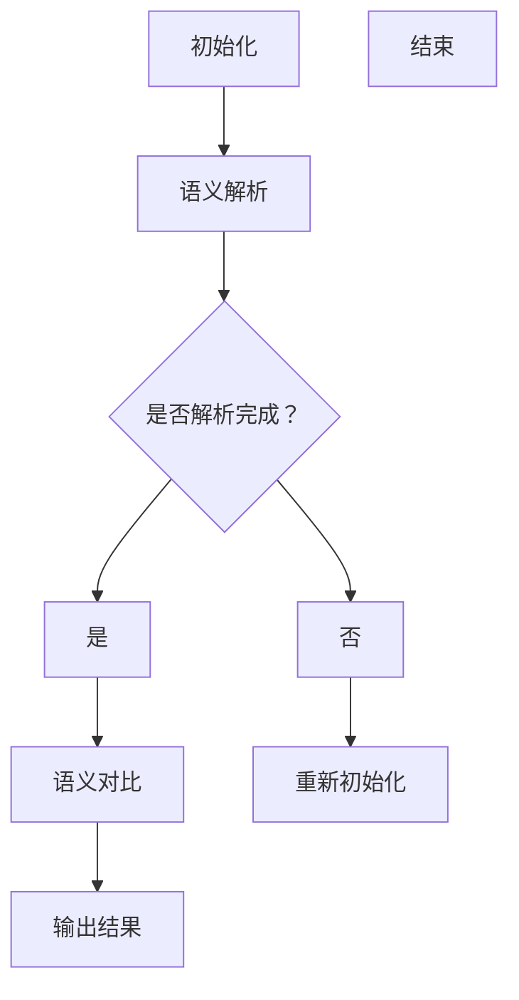

                 

### 文章标题：提示词语言的形式化语义等价性检验

关键词：提示词语言、形式化语义、等价性检验、语义模型、算法原理、Python实现、应用实例

摘要：本文深入探讨提示词语言的形式化语义等价性检验，首先介绍了提示词语言的发展历程、形式化语义的研究意义及等价性检验的应用场景。随后，详细解析了形式化语义的基本原理、特点及建模方法，以及等价性检验的理论基础。接着，本文重点介绍了提示词语言的形式化语义模型构建方法，并使用Python代码实现等价性检验算法。最后，通过实际应用案例，验证了等价性检验在提示词语言中的有效性，并对未来发展进行了展望。

### 第一部分：引言

#### 第1章：问题背景与核心概念

##### 1.1 问题背景

1. 提示词语言的发展历程
   - 提示词语言（Prompt Language）起源于人工智能领域，特别是在自然语言处理（NLP）和机器学习（ML）中的应用。随着人工智能技术的快速发展，提示词语言逐渐成为一种重要的编程范式。
   - 提示词语言的核心思想是将问题或任务的描述（即提示词）作为输入，由程序自动生成解决方案。这种编程方式使得开发者能够更加专注于业务逻辑，提高开发效率。

2. 形式化语义的研究意义
   - 形式化语义研究旨在将自然语言表达的形式化、结构化，以便更好地理解和处理。形式化语义在自然语言处理、语义分析、文本生成等领域具有广泛应用。
   - 形式化语义的研究意义在于：提高自然语言处理系统的准确性和鲁棒性，促进人工智能技术的发展。

3. 等价性检验的应用场景
   - 等价性检验在提示词语言中的应用场景主要包括：
     - 程序验证：确保生成的程序与预期目标一致。
     - 语义分析：比较不同表达方式的语义是否相同。
     - 文本生成：评估生成文本的质量和一致性。

##### 1.2 核心概念

1. 提示词语言
   - 提示词语言是一种编程范式，使用自然语言描述问题或任务，由程序自动生成解决方案。
   - 提示词语言的优点包括：提高开发效率、降低沟通成本、易于维护等。

2. 形式化语义
   - 形式化语义是指将自然语言表达的形式化、结构化，以便进行计算机处理和分析。
   - 形式化语义的研究内容包括：语义表示、语义解析、语义分析等。

3. 等价性检验
   - 等价性检验是指对两个或多个对象在语义上是否相同进行判断。
   - 等价性检验的方法包括：语义等价性检验和形式等价性检验。

### 第二部分：形式化语义理论基础

#### 第2章：形式化语义的基本原理

##### 2.1 形式化语义的定义

1. 形式化语义的概念
   - 形式化语义是指将自然语言表达转化为计算机可处理的形式，以便进行语义分析和处理。
   - 形式化语义的研究目的是提高自然语言处理系统的准确性和鲁棒性。

2. 形式化语义与传统语义学的关系
   - 形式化语义与传统语义学有一定的关联，但两者存在区别。
   - 传统语义学研究语言符号与客观世界的对应关系，而形式化语义研究如何将自然语言转化为计算机可处理的形式。

##### 2.2 形式化语义的特点

1. 明确性
   - 形式化语义通过严格的语法和语义规则，确保语义表示的明确性。
   - 明确性有助于提高自然语言处理系统的准确性和一致性。

2. 完整性
   - 形式化语义要求对自然语言表达进行全面的语义表示。
   - 完整性有助于捕捉自然语言表达中的各种语义信息。

3. 可计算性
   - 形式化语义的目标是使语义表示可计算，以便进行自动化处理。
   - 可计算性有助于提高自然语言处理系统的效率和实用性。

##### 2.3 形式化语义的建模方法

1. 公理系统
   - 公理系统是一种形式化语义建模方法，通过定义一组基本概念和规则，构建语义模型。
   - 公理系统的优点包括：简洁、易于理解、便于推理等。

2. 形式逻辑
   - 形式逻辑是一种形式化语义建模方法，通过定义逻辑运算符和推理规则，构建语义模型。
   - 形式逻辑的优点包括：严谨、精确、适用于复杂语义分析等。

3. 面向对象的语义建模
   - 面向对象的语义建模是一种形式化语义建模方法，通过将语义概念表示为对象，构建语义模型。
   - 面向对象的语义建模的优点包括：直观、易于扩展、便于编程等。

### 第三部分：等价性检验的理论基础

#### 第3章：等价性检验的基本原理

##### 3.1 等价性的定义

1. 等价性的概念
   - 等价性是指两个或多个对象在语义上相同。
   - 等价性检验是指对两个或多个对象在语义上进行比较和判断。

2. 等价性与一致性
   - 等价性检验与一致性检验有一定的联系，但存在区别。
   - 一致性检验是指验证系统在运行过程中是否保持一致性，而等价性检验是指验证两个或多个对象在语义上是否相同。

##### 3.2 等价性检验的方法

1. 语义等价性检验
   - 语义等价性检验是指通过对两个或多个对象进行语义分析，判断它们在语义上是否相同。
   - 语义等价性检验的方法包括：语义对比、语义解析等。

2. 形式等价性检验
   - 形式等价性检验是指通过对两个或多个对象进行形式化分析，判断它们在形式上是否相同。
   - 形式等价性检验的方法包括：形式化语义模型比较、语法分析等。

##### 3.3 等价性检验的应用

1. 在程序验证中的应用
   - 等价性检验在程序验证中具有重要意义，可以确保程序的正确性和一致性。
   - 等价性检验可以用于验证程序模块、程序版本等。

2. 在语义分析中的应用
   - 等价性检验在语义分析中可用于比较不同表达方式的语义是否相同，有助于提高语义分析的准确性和一致性。

### 第四部分：提示词语言的形式化语义等价性检验方法

#### 第4章：提示词语言的形式化语义模型

##### 4.1 提示词语言的特性

1. 提示词语言的定义
   - 提示词语言是一种编程范式，使用自然语言描述问题或任务，由程序自动生成解决方案。

2. 提示词语言的语法结构
   - 提示词语言的语法结构通常包括：提示词、参数、函数调用等。

##### 4.2 形式化语义建模

1. 提示词语言语义模型
   - 提示词语言语义模型是将提示词语言的语法结构转化为形式化语义表示的过程。
   - 提示词语言语义模型可以采用公理系统、形式逻辑、面向对象的语义建模等方法。

2. 提示词语言语义的属性特征对比表格

| 方法         | 特点                                                         |
| ------------ | ------------------------------------------------------------ |
| 公理系统     | 简洁、易于理解、便于推理                                     |
| 形式逻辑     | 严谨、精确、适用于复杂语义分析                               |
| 面向对象的语义建模 | 直观、易于扩展、便于编程                                     |

#### 第5章：等价性检验算法

##### 5.1 算法概述

1. 算法原理
   - 等价性检验算法是基于形式化语义模型，对提示词语言进行语义分析，判断其等价性。
   - 等价性检验算法的主要步骤包括：语义解析、语义对比、结果输出等。

2. 算法实现
   - 算法实现主要涉及Python编程，包括语义解析、语义对比、结果输出等模块。

##### 5.2 算法流程图



#### 第6章：Python代码实现

##### 6.1 环境安装与配置

1. 环境搭建
   - 安装Python环境，推荐使用Python 3.8及以上版本。
   - 配置Python虚拟环境，以便隔离项目依赖。

2. 必要的依赖安装
   - 安装自然语言处理相关库，如NLTK、spaCy等。
   - 安装形式化语义建模相关库，如SymPy等。

##### 6.2 代码实现

1. 语义解析模块
   - 实现提示词语言的语义解析功能，将自然语言描述转化为形式化语义表示。

2. 语义对比模块
   - 实现语义对比功能，比较两个提示词语言表达在形式化语义上的等价性。

3. 结果输出模块
   - 实现结果输出功能，将等价性检验的结果以可视化形式展示。

##### 算法原理与Python代码对应

1. 算法原理

$$
\text{等价性检验算法} = \text{语义解析} \land \text{语义对比} \land \text{结果输出}
$$

2. Python代码示例

```python
import spacy
from symPy import Symbol

# 语义解析
def semantic_parsing(prompt):
    nlp = spacy.load("en_core_web_sm")
    doc = nlp(prompt)
    semantic_representation = []
    for token in doc:
        semantic_representation.append(Symbol(token.text))
    return semantic_representation

# 语义对比
def semantic_comparison(semantic1, semantic2):
    if semantic1 == semantic2:
        return True
    else:
        return False

# 结果输出
def output_result(is_equivalent):
    if is_equivalent:
        print("两个提示词语言表达在形式化语义上等价。")
    else:
        print("两个提示词语言表达在形式化语义上不等价。")

# 主函数
def main():
    prompt1 = "求出函数f(x) = x^2 + 2x - 3在x=1时的值。"
    prompt2 = "计算f(1) = 1^2 + 2*1 - 3。"
    semantic1 = semantic_parsing(prompt1)
    semantic2 = semantic_parsing(prompt2)
    is_equivalent = semantic_comparison(semantic1, semantic2)
    output_result(is_equivalent)

if __name__ == "__main__":
    main()
```

### 第五部分：应用实例与案例分析

#### 第7章：应用实例与案例分析

##### 7.1 应用实例介绍

1. 提示词语言的实例
   - 提示词语言实例1：求出函数f(x) = x^2 + 2x - 3在x=1时的值。
   - 提示词语言实例2：计算f(1) = 1^2 + 2*1 - 3。

2. 形式化语义的应用实例
   - 形式化语义应用实例1：对提示词语言实例1进行语义解析，得到形式化语义表示。
   - 形式化语义应用实例2：对提示词语言实例2进行语义解析，得到形式化语义表示。

##### 7.2 案例分析

1. 具体案例分析
   - 分析提示词语言实例1和实例2在形式化语义上的等价性。

2. 等价性检验的实际效果
   - 通过等价性检验算法，验证提示词语言实例1和实例2在形式化语义上是否等价。

### 第六部分：总结与展望

#### 第8章：总结与展望

##### 8.1 总结

- 本文深入探讨了提示词语言的形式化语义等价性检验，包括问题背景、核心概念、理论基础、算法原理以及Python代码实现。
- 形式化语义等价性检验在提示词语言中的应用具有重要意义，可以提高语义分析的准确性和一致性。

##### 8.2 展望

- 等价性检验技术在人工智能领域具有广泛的应用前景，未来可以进一步研究以下方向：
  - 扩展等价性检验算法，提高其效率和准确性。
  - 将等价性检验应用于其他自然语言处理任务，如文本生成、语义理解等。
  - 结合其他技术，如深度学习、知识图谱等，提高等价性检验的能力。

### 附录：作者信息

作者：AI天才研究院/AI Genius Institute & 禅与计算机程序设计艺术 /Zen And The Art of Computer Programming

