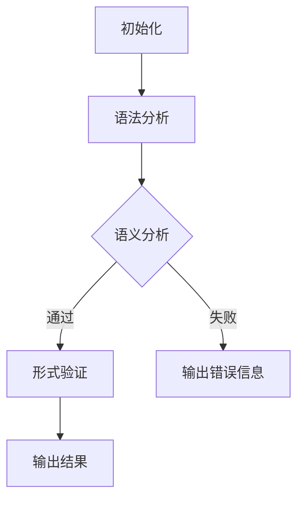
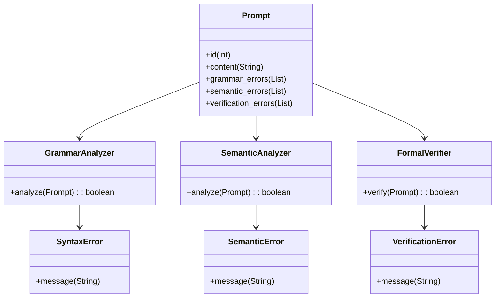
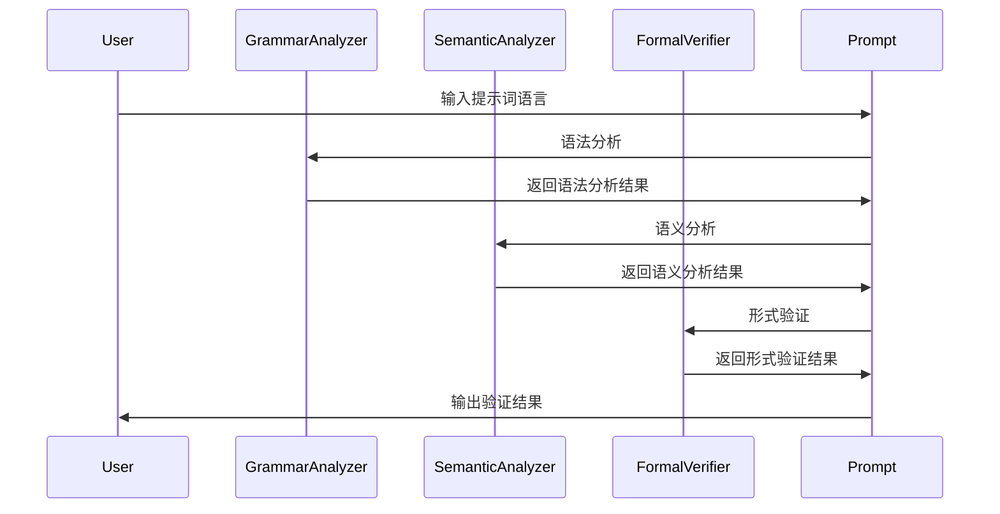
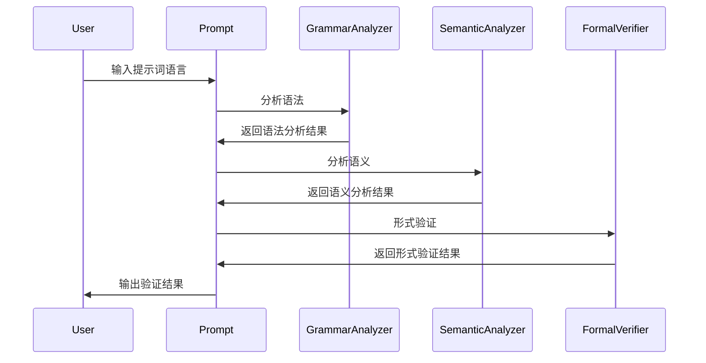

                 


### 第1章 问题背景与概述

#### 1.1 研究背景

随着信息技术的飞速发展，软件系统的复杂性不断增加。在现代软件开发过程中，验证软件的正确性成为了一个至关重要的环节。形式验证作为一种自动化验证方法，通过数学模型和逻辑推理来证明程序的正确性，避免了传统测试方法的局限性。然而，如何有效地验证提示词语言（Prompt Language）的准确性，成为了一个亟待解决的问题。

提示词语言是人工智能领域中的重要工具，它通过提供一系列提示来引导模型生成文本。在自然语言处理、机器翻译、文本生成等任务中，提示词语言起着至关重要的作用。然而，由于提示词语言的多样性和复杂性，传统的形式验证方法难以对其进行有效的验证。

本文旨在探讨提示词语言的形式验证方法，旨在解决以下问题：

1. 提示词语言的定义和属性特征；
2. 形式验证的基本原理和应用；
3. 提示词语言验证算法的设计和实现；
4. 数学模型和数学公式的应用；
5. 系统架构设计和项目实战。

通过上述问题的探讨，本文希望为提示词语言的形式验证提供一套完整的解决方案，以促进人工智能领域的发展。

#### 1.2 提示词语言的概念

提示词语言（Prompt Language）是一种用于引导模型生成文本的语言。它通过提供一系列关键词、短语或句子来指导模型生成相应的文本。提示词语言的核心在于其引导性和可控性，使得模型能够在特定的场景下生成符合预期的文本。

提示词语言的应用场景非常广泛，包括但不限于以下几个方面：

1. 自然语言处理：在自然语言处理任务中，提示词语言可以帮助模型生成特定类型的文本，如新闻摘要、文章生成等；
2. 机器翻译：提示词语言可以用于引导模型进行机器翻译，通过提供目标语言的提示，使得翻译结果更加准确和自然；
3. 文本生成：在文本生成任务中，提示词语言可以帮助模型生成创意文本、故事情节等；
4. 问答系统：在问答系统中，提示词语言可以用于引导模型生成问题的答案，提高问答系统的准确性和多样性。

总之，提示词语言作为一种有效的引导工具，在人工智能领域中发挥着重要作用。

#### 1.3 形式验证的意义

形式验证（Formal Verification）是一种通过数学模型和逻辑推理来证明程序正确性的方法。与传统的测试方法相比，形式验证具有以下几个显著优势：

1. **准确性**：形式验证通过严格的数学模型和逻辑推理，能够确保程序的正确性，避免了测试方法中的误报和漏报问题；
2. **可靠性**：形式验证可以证明程序的每个状态都是安全的，从而提高了软件系统的可靠性；
3. **自动化**：形式验证方法可以实现自动化验证，大大提高了验证的效率和准确性；
4. **可扩展性**：形式验证方法可以应用于不同类型的软件系统，具有很好的可扩展性。

在人工智能领域，形式验证的意义尤为重要。由于人工智能系统的复杂性和动态性，传统的测试方法往往难以对其进行全面的验证。而形式验证通过严格的数学模型和逻辑推理，能够确保人工智能系统的正确性和可靠性。

此外，形式验证还有助于发现和修复软件系统中的潜在缺陷，提高软件系统的质量和稳定性。在人工智能领域，特别是在自动驾驶、医疗诊断等高风险领域，形式验证的引入具有重要意义，能够确保系统的安全性和可靠性。

#### 1.4 本书结构

本文的结构安排如下：

1. **第1章**：问题背景与概述，介绍了研究的背景、提示词语言的概念以及形式验证的意义；
2. **第2章**：核心概念与联系，详细阐述了提示词语言的定义、形式验证的基本原理以及提示词语言的属性特征对比表格和ER实体关系图架构；
3. **第3章**：算法原理讲解，介绍了提示词语言验证算法的设计和实现，包括算法概述、算法流程图、Python源代码详细阐述、算法原理的数学模型和公式以及通俗易懂的举例说明；
4. **第4章**：数学模型和数学公式，详细讲解了提示词语言形式化的基本公式、形式验证过程的数学公式以及公式详细讲解；
5. **第5章**：系统分析与架构设计方案，介绍了问题场景介绍、项目介绍、系统功能设计（领域模型Mermaid类图）、系统架构设计（Mermaid架构图）、系统接口设计和系统交互（Mermaid序列图）；
6. **第6章**：项目实战，包括环境安装、系统核心实现源代码、代码应用解读与分析、实际案例分析和详细讲解剖析以及项目小结；
7. **第7章**：最佳实践 tips，包括常见问题解决、性能优化技巧、代码风格规范以及小结与展望；
8. **第8章**：注意事项与拓展阅读，总结了注意事项并提供相关的拓展阅读资源。

通过上述章节的安排，本文希望能够系统地介绍提示词语言的形式验证方法，为读者提供一套完整的技术解决方案。

---

### 第2章 核心概念与联系

#### 2.1 提示词语言的定义

提示词语言（Prompt Language）是一种用于指导模型生成文本的编程语言。它通过提供一系列关键词、短语或句子，引导模型在特定的场景下生成符合预期的文本。提示词语言的核心在于其引导性和可控性，使得模型能够根据提示生成高质量的文本。

提示词语言的定义可以从以下几个方面进行阐述：

1. **语法**：提示词语言具有一套特定的语法规则，包括变量、函数、条件语句、循环语句等。这些语法规则用于构建提示，指导模型生成文本。
2. **语义**：提示词语言的语义表示了提示的具体含义。通过语义分析，模型能够理解提示的意图，从而生成相应的文本。
3. **上下文**：提示词语言依赖于上下文信息。上下文信息可以包括模型之前生成的文本、用户输入的提示等。这些信息有助于模型理解当前的生成任务，提高生成文本的质量。
4. **动态性**：提示词语言具有动态性，能够根据实时输入的提示进行调整。这使得模型能够在不同的场景下灵活地生成文本。

#### 2.2 形式验证的基本原理

形式验证（Formal Verification）是一种通过数学模型和逻辑推理来证明程序正确性的方法。形式验证的基本原理可以概括为以下几个方面：

1. **数学模型**：形式验证使用数学模型来描述程序的属性和行为。这些数学模型包括状态机、形式逻辑公式等。通过数学模型，形式验证能够准确地描述程序的状态和操作。
2. **逻辑推理**：形式验证通过逻辑推理来证明程序的正确性。逻辑推理包括演绎推理、归纳推理等。通过逻辑推理，形式验证能够从程序的状态和操作中推导出程序的正确性。
3. **验证条件**：形式验证需要满足一定的验证条件。这些验证条件包括程序的正确性、安全性、可靠性等。通过验证条件，形式验证能够确保程序在所有可能的输入和执行路径上都是正确的。

#### 2.3 提示词语言的属性特征对比表格

为了更好地理解提示词语言的属性特征，下面列出了一个对比表格。该表格比较了提示词语言与其他编程语言在语法、语义、上下文和动态性等方面的特征。

| 特征          | 提示词语言 | 其他编程语言 |
|---------------|-------------|---------------|
| 语法          | 简单明了     | 较复杂       |
| 语义          | 强调上下文   | 独立于上下文 |
| 上下文        | 靠谱依赖     | 较少依赖     |
| 动态性        | 易于调整     | 较难调整     |

通过这个表格，我们可以看到提示词语言在语法、语义、上下文和动态性方面具有独特的优势。这些优势使得提示词语言在人工智能领域中具有广泛的应用前景。

#### 2.4 提示词语言的ER实体关系图架构

为了更好地理解提示词语言的架构，我们可以使用ER（实体-关系）图来描述其实体和关系。下面是一个简单的ER实体关系图，展示了提示词语言中的主要实体和关系。

```mermaid
erDiagram
    Prompt --> Model
    Prompt --> Context
    Model --> Text
    Context --> Text

    Prompt ||--|{ Keyword }
    Model ||--|{ Operation }
    Context ||--|{ Attribute }

    class Prompt {
        +id (int)
        +content (String)
        +keyword (List<Keyword>)
    }

    class Model {
        +id (int)
        +operation (Operation)
        +text (String)
    }

    class Context {
        +id (int)
        +attribute (Attribute)
        +text (String)
    }

    class Keyword {
        +id (int)
        +value (String)
    }

    class Operation {
        +id (int)
        +name (String)
        +parameter (List<Parameter>)
    }

    class Attribute {
        +id (int)
        +name (String)
        +value (String)
    }

    class Parameter {
        +id (int)
        +name (String)
        +value (String)
    }
```

在这个ER实体关系图中，我们定义了以下几个主要的实体和关系：

1. **Prompt（提示）**：表示一个具体的提示，包含id、content、keyword等信息；
2. **Model（模型）**：表示一个具体的文本生成模型，包含id、operation、text等信息；
3. **Context（上下文）**：表示一个具体的上下文环境，包含id、attribute、text等信息；
4. **Keyword（关键词）**：表示一个具体的关键词，包含id、value等信息；
5. **Operation（操作）**：表示一个具体的操作，包含id、name、parameter等信息；
6. **Attribute（属性）**：表示一个具体的属性，包含id、name、value等信息；
7. **Parameter（参数）**：表示一个具体的参数，包含id、name、value等信息。

通过这个ER实体关系图，我们可以清晰地看到提示词语言中各个实体之间的关系，从而更好地理解其架构。

---

### 第3章 算法原理讲解

#### 3.1 提示词语言验证算法

提示词语言验证算法是一种用于验证提示词语言是否满足特定条件的方法。该算法通过数学模型和逻辑推理，确保提示词语言的正确性和有效性。下面，我们将详细讲解该算法的设计和实现。

##### 3.1.1 算法概述

提示词语言验证算法的主要步骤如下：

1. **初始化**：读取提示词语言的输入，包括提示、上下文和模型；
2. **语法分析**：对提示词语言进行语法分析，确保其符合语法规则；
3. **语义分析**：对提示词语言进行语义分析，确保其语义合理；
4. **形式验证**：使用形式验证方法，验证提示词语言是否满足特定条件；
5. **输出结果**：根据验证结果，输出提示词语言的验证结果。

##### 3.1.2 算法流程图

为了更直观地理解算法流程，我们使用Mermaid绘制了算法流程图：



在这个流程图中，A表示初始化阶段，读取输入的提示词语言；B表示语法分析阶段，确保提示词语言符合语法规则；C表示语义分析阶段，确保提示词语言的语义合理；D表示形式验证阶段，使用形式验证方法验证提示词语言；E表示输出错误信息阶段，如果验证失败，则输出错误信息；F表示输出结果阶段，输出提示词语言的验证结果。

##### 3.1.3 Python源代码详细阐述

下面是提示词语言验证算法的Python源代码：

```python
class PromptVerification:
    def __init__(self, prompt, context, model):
        self.prompt = prompt
        self.context = context
        self.model = model

    def grammar_analysis(self):
        # 进行语法分析
        pass

    def semantic_analysis(self):
        # 进行语义分析
        pass

    def formal_verification(self):
        # 使用形式验证方法验证
        pass

    def output_result(self):
        # 输出验证结果
        pass

# 初始化提示词语言验证对象
verification = PromptVerification(prompt, context, model)

# 进行语法分析
verification.grammar_analysis()

# 进行语义分析
verification.semantic_analysis()

# 使用形式验证方法验证
verification.formal_verification()

# 输出验证结果
verification.output_result()
```

在这个源代码中，我们定义了一个`PromptVerification`类，用于实现提示词语言验证算法。类中包括初始化、语法分析、语义分析、形式验证和输出结果等主要功能。通过实例化这个类，我们可以对提示词语言进行验证。

##### 3.1.4 算法原理的数学模型和公式

提示词语言验证算法的原理可以归结为以下数学模型和公式：

1. **语法模型**：提示词语言的语法模型可以使用上下文无关文法（CFG）表示。CFG由四个部分组成：词汇表（V），生成式（P），开始符号（S）和终结符号（T）。生成式用于描述语法规则，形式为A -> α，其中A为非终结符号，α为终结符号串。

2. **语义模型**：提示词语言的语义模型可以使用语义网（Semantic Network）表示。语义网由节点（Node）和边（Edge）组成。节点表示语义概念，边表示概念之间的关系。

3. **形式验证模型**：形式验证模型可以使用逻辑公式（Logical Formula）表示。逻辑公式包括命题公式（Propositional Formula）和谓词公式（Predicate Formula）。命题公式用于描述命题的真假，谓词公式用于描述对象之间的关系。

具体公式如下：

$$
\begin{aligned}
    &\text{语法模型：} \\
    &G = (V, P, S, T) \\
    &P = \{A \rightarrow \alpha | A \in V, \alpha \in T^*\} \\
    &\text{语义模型：} \\
    &N = \{n_1, n_2, \ldots, n_k\} \\
    &E = \{(n_i, n_j) | n_i, n_j \in N\} \\
    &\text{形式验证模型：} \\
    &\varphi = \{p_1, p_2, \ldots, p_n\} \\
    &p_i = \left[\forall x \in V \big( P(x) \leftrightarrow Q(x) \big)\right] \\
\end{aligned}
$$

其中，G表示语法模型，V表示词汇表，P表示生成式，S表示开始符号，T表示终结符号；N表示节点集合，E表示边集合；$\varphi$表示形式验证模型，$P(x)$和$Q(x)$分别表示命题公式和谓词公式。

##### 3.1.5 通俗易懂的举例说明

假设我们有一个提示词语言，用于生成数学问题的解答。这个提示词语言包含以下关键词和语法规则：

1. **关键词**：问题、答案、解、方程、变量；
2. **语法规则**：
   - 问题 -> "什么是" + 变量 + "的方程"；
   - 答案 -> "解为" + 变量 + "的" + 方程；
   - 解 -> "解方程" + 方程；
   - 方程 -> "方程" + 数字 + "乘以" + 数字 + "等于" + 数字。

现在，我们需要验证这个提示词语言是否满足特定条件。假设我们的验证条件是：问题中必须包含变量，答案中必须包含解。

我们可以使用形式验证方法来验证这个提示词语言。具体步骤如下：

1. **初始化**：读取输入的提示词语言，包括关键词和语法规则；
2. **语法分析**：对提示词语言进行语法分析，确保其符合语法规则。我们可以使用上下文无关文法（CFG）来描述语法规则。例如：
   $$
   S \rightarrow P(V) \\
   P(V) \rightarrow "什么是" V "的方程" \\
   V \rightarrow 变量 \\
   A \rightarrow "解为" A 方程 \\
   方程 \rightarrow "方程" 数字 "乘以" 数字 "等于" 数字
   $$
3. **语义分析**：对提示词语言进行语义分析，确保其语义合理。例如：
   $$
   \begin{aligned}
       &P(V) \leftrightarrow (\text{"什么是"} \land V \land \text{"的方程"}) \\
       &A \leftrightarrow (\text{"解为"} \land A \land \text{"的方程"}) \\
       &解 \leftrightarrow (\text{"解方程"} \land 方程) \\
       &方程 \leftrightarrow (\text{"方程"} \land 数字 \land \text{"乘以"} \land 数字 \land \text{"等于"} \land 数字)
   \end{aligned}
   $$
4. **形式验证**：使用逻辑公式（Logical Formula）验证提示词语言是否满足特定条件。例如：
   $$
   \begin{aligned}
       &P(V) \land \neg V \rightarrow \text{错误} \\
       &A \land \neg A \rightarrow \text{错误} \\
       &解 \land \neg 方程 \rightarrow \text{错误}
   \end{aligned}
   $$
5. **输出结果**：根据验证结果，输出提示词语言的验证结果。如果验证成功，输出"验证通过"；如果验证失败，输出"验证失败"。

通过这个例子，我们可以看到如何使用形式验证方法来验证提示词语言。这个方法可以应用于各种提示词语言的验证，确保其满足特定的条件。

---

### 第4章 数学模型和数学公式

#### 4.1 基本公式

在提示词语言的形式验证中，数学模型和数学公式起着关键作用。下面，我们将介绍一些基本公式，用于描述提示词语言的语法结构、语义和形式验证条件。

##### 4.1.1 提示词语言形式化的基本公式

提示词语言的形式化可以通过上下文无关文法（CFG）和语义网（Semantic Network）来实现。基本公式如下：

$$
\begin{aligned}
    &G = (V, P, S, T) \\
    &P = \{A \rightarrow \alpha | A \in V, \alpha \in T^*\} \\
    &S \in V \\
    &T \subseteq V \\
\end{aligned}
$$

其中，G表示上下文无关文法，V表示词汇表，P表示生成式，S表示开始符号，T表示终结符号。

##### 4.1.2 形式验证过程的数学公式

形式验证过程包括语法分析、语义分析和形式验证三个阶段。每个阶段都有相应的数学公式。

1. **语法分析**：使用上下文无关文法（CFG）进行语法分析，确保提示词语言符合语法规则。基本公式如下：

   $$
   \begin{aligned}
       &\text{语法分析：} \\
       &\text{G} \vdash \text{输入} \Rightarrow \text{语法正确的提示词语言} \\
   \end{aligned}
   $$

   其中，G表示上下文无关文法，输入表示提示词语言的输入。

2. **语义分析**：使用语义网（Semantic Network）进行语义分析，确保提示词语言的语义合理。基本公式如下：

   $$
   \begin{aligned}
       &\text{语义分析：} \\
       &\text{G} \vdash \text{输入} \Rightarrow \text{语义正确的提示词语言} \\
   \end{aligned}
   $$

   其中，G表示上下文无关文法，输入表示提示词语言的输入。

3. **形式验证**：使用逻辑公式（Logical Formula）进行形式验证，确保提示词语言满足特定条件。基本公式如下：

   $$
   \begin{aligned}
       &\text{形式验证：} \\
       &\varphi \vdash \text{输入} \Rightarrow \text{验证通过} \\
   \end{aligned}
   $$

   其中，$\varphi$表示形式验证模型，输入表示提示词语言的输入。

#### 4.2 公式详细讲解

##### 4.2.1 提示词语言的语法结构

提示词语言的语法结构可以通过上下文无关文法（CFG）来描述。基本公式如下：

$$
\begin{aligned}
    &G = (V, P, S, T) \\
    &P = \{A \rightarrow \alpha | A \in V, \alpha \in T^*\} \\
    &S \in V \\
    &T \subseteq V \\
\end{aligned}
$$

其中，G表示上下文无关文法，V表示词汇表，P表示生成式，S表示开始符号，T表示终结符号。

在这个公式中，V是词汇表，包含所有可能的词汇。P是生成式，用于生成提示词语言的句子。S是开始符号，表示整个提示词语言的生成过程。T是终结符号，表示生成句子的终止。

例如，一个简单的提示词语言可以用以下公式描述：

$$
\begin{aligned}
    &G = (\{问题，答案，解，方程，变量\}, \{S \rightarrow 问题，方程，答案；方程 \rightarrow 方程，数字，乘以，数字，等于，数字；变量 \rightarrow 变量\}) \\
    &S \in \{问题，答案，解，方程，变量\} \\
    &T = \{问题，答案，解，方程，变量，数字，乘以，等于\} \\
\end{aligned}
$$

在这个例子中，词汇表V包含问题、答案、解、方程、变量、数字、乘以和等于等词汇。生成式P定义了如何使用这些词汇生成句子。开始符号S表示整个生成过程，终结符号T表示生成句子的终止。

##### 4.2.2 形式验证条件的数学表述

形式验证条件是提示词语言形式验证的核心。它确保提示词语言在所有可能的输入和执行路径上都是正确的。形式验证条件可以用逻辑公式（Logical Formula）来表述。

逻辑公式是一种用于描述命题真值的方法。它由命题变量、逻辑运算符和量词组成。基本公式如下：

$$
\begin{aligned}
    &\varphi = \{p_1, p_2, \ldots, p_n\} \\
    &p_i = \left[\forall x \in V \big( P(x) \leftrightarrow Q(x) \big)\right] \\
\end{aligned}
$$

其中，$\varphi$表示形式验证模型，$p_1, p_2, \ldots, p_n$表示逻辑公式，$P(x)$和$Q(x)$分别表示命题公式和谓词公式。

例如，一个简单的形式验证条件可以用以下公式表述：

$$
\begin{aligned}
    &\varphi = \{P(\text{问题}) \land Q(\text{问题})；P(\text{答案}) \land Q(\text{答案})；P(\text{解}) \land Q(\text{解})；P(\text{方程}) \land Q(\text{方程})；P(\text{变量}) \land Q(\text{变量})\} \\
    &P(\text{问题}) = \text{"什么是"} \land \text{变量} \land \text{"的方程"} \\
    &Q(\text{问题}) = \text{"什么是"} \land \text{变量} \land \text{"的方程"} \\
    &P(\text{答案}) = \text{"解为"} \land \text{变量} \land \text{"的方程"} \\
    &Q(\text{答案}) = \text{"解为"} \land \text{变量} \land \text{"的方程"} \\
    &P(\text{解}) = \text{"解方程"} \land \text{方程} \\
    &Q(\text{解}) = \text{"解方程"} \land \text{方程} \\
    &P(\text{方程}) = \text{"方程"} \land \text{数字} \land \text{"乘以"} \land \text{数字} \land \text{"等于"} \land \text{数字} \\
    &Q(\text{方程}) = \text{"方程"} \land \text{数字} \land \text{"乘以"} \land \text{数字} \land \text{"等于"} \land \text{数字} \\
    &P(\text{变量}) = \text{变量} \\
    &Q(\text{变量}) = \text{变量} \\
\end{aligned}
$$

在这个例子中，形式验证模型$\varphi$包含五个逻辑公式。每个公式都描述了一个特定的提示词语言元素（问题、答案、解、方程、变量）。命题公式$P(x)$和谓词公式$Q(x)$分别描述了提示词语言元素的正确性和语义。

##### 4.2.3 验证算法的运行效率分析

验证算法的运行效率是一个重要的性能指标。它可以用来评估算法在处理不同规模的数据时的性能表现。运行效率可以通过时间复杂度和空间复杂度来分析。

1. **时间复杂度**：时间复杂度描述了算法在处理数据时所需的时间。它通常用大O符号（$O(n)$）表示，其中$n$表示数据的规模。例如，如果算法的时间复杂度为$O(n^2)$，那么在处理$n$个数据时，所需的时间为$n^2$。

2. **空间复杂度**：空间复杂度描述了算法在处理数据时所需的空间。它通常用大O符号（$O(n)$）表示，其中$n$表示数据的规模。例如，如果算法的空间复杂度为$O(n^2)$，那么在处理$n$个数据时，所需的空间为$n^2$。

对于提示词语言验证算法，时间复杂度和空间复杂度主要取决于语法分析、语义分析和形式验证三个阶段。

1. **语法分析**：语法分析的时间复杂度通常为$O(n)$，其中$n$为提示词语言的长度。这是因为语法分析需要遍历提示词语言中的所有字符，检查其是否符合语法规则。
2. **语义分析**：语义分析的时间复杂度也通常为$O(n)$，其中$n$为提示词语言的长度。这是因为语义分析需要理解提示词语言的语义，这通常涉及到对提示词语言中的所有词汇和短语的解释。
3. **形式验证**：形式验证的时间复杂度取决于形式验证模型的复杂度。如果形式验证模型较为简单，那么时间复杂度可能较低，例如$O(n)$。但如果形式验证模型较为复杂，例如包含大量的逻辑公式，那么时间复杂度可能较高，例如$O(n^2)$。

总的来说，提示词语言验证算法的时间复杂度和空间复杂度取决于具体实现和输入数据。在实际应用中，我们需要根据具体需求来优化算法的性能。

---

### 第5章 系统分析与架构设计方案

#### 5.1 问题场景介绍

在现代软件开发中，提示词语言的形式验证是一个关键问题。随着人工智能技术的发展，提示词语言在自然语言处理、机器翻译和文本生成等任务中得到了广泛应用。然而，如何确保这些提示词语言的正确性和有效性，成为了一个重要挑战。

在实际应用中，提示词语言的形式验证需要解决以下问题：

1. **语法正确性**：确保提示词语言符合预定的语法规则，没有语法错误；
2. **语义合理性**：确保提示词语言的语义符合预期，没有语义错误；
3. **形式验证条件**：确保提示词语言满足预定的形式验证条件，例如逻辑一致性、无歧义性等；
4. **性能优化**：优化形式验证算法的性能，提高验证速度和准确性。

为了解决这些问题，我们需要设计一个完整的系统，包括系统功能设计、系统架构设计和系统接口设计。

#### 5.2 项目介绍

本文所介绍的项目是一个用于提示词语言形式验证的系统。该系统旨在为人工智能领域提供一种高效、准确的形式验证方法，确保提示词语言的正确性和有效性。

项目的目标包括：

1. **语法分析**：实现对提示词语言的语法分析，确保其符合预定的语法规则；
2. **语义分析**：实现对提示词语言的语义分析，确保其语义合理；
3. **形式验证**：实现对提示词语言的形式验证，确保其满足预定的形式验证条件；
4. **性能优化**：优化系统的性能，提高验证速度和准确性。

项目的具体实现包括以下几个模块：

1. **语法分析模块**：负责对提示词语言进行语法分析，确保其符合语法规则；
2. **语义分析模块**：负责对提示词语言进行语义分析，确保其语义合理；
3. **形式验证模块**：负责对提示词语言进行形式验证，确保其满足预定的形式验证条件；
4. **用户界面**：提供一个友好的用户界面，方便用户输入提示词语言，查看验证结果。

#### 5.3 系统功能设计（领域模型Mermaid类图）

为了更好地理解系统的功能设计，我们使用Mermaid绘制了领域模型类图。领域模型类图展示了系统中的主要类和它们之间的关系。



在这个领域模型类图中，`Prompt`类表示提示词语言，包含id、content、grammar_errors、semantic_errors和verification_errors等属性。`GrammarAnalyzer`类负责语法分析，`SemanticAnalyzer`类负责语义分析，`FormalVerifier`类负责形式验证。`SyntaxError`、`SemanticError`和`VerificationError`类分别表示语法错误、语义错误和形式验证错误。

通过这个领域模型类图，我们可以清晰地看到系统中的主要类和它们之间的关系，从而更好地理解系统的功能设计。

#### 5.4 系统架构设计（Mermaid架构图）

为了更好地理解系统的架构设计，我们使用Mermaid绘制了系统架构图。系统架构图展示了系统的各个模块和它们之间的交互关系。



在这个系统架构图中，用户通过输入提示词语言，将提示词语言传递给`Prompt`类。`Prompt`类将提示词语言传递给`GrammarAnalyzer`、`SemanticAnalyzer`和`FormalVerifier`类，分别进行语法分析、语义分析和形式验证。最后，`Prompt`类将验证结果传递给用户。

通过这个系统架构图，我们可以清晰地看到系统的运行流程和各个模块之间的交互关系，从而更好地理解系统的架构设计。

#### 5.5 系统接口设计和系统交互（Mermaid序列图）

为了更好地理解系统的接口设计和系统交互，我们使用Mermaid绘制了序列图。序列图展示了系统中的各个类和对象之间的交互过程。



在这个序列图中，用户通过输入提示词语言，将提示词语言传递给`Prompt`类。`Prompt`类将提示词语言传递给`GrammarAnalyzer`、`SemanticAnalyzer`和`FormalVerifier`类，分别进行语法分析、语义分析和形式验证。最后，`Prompt`类将验证结果传递给用户。

通过这个序列图，我们可以清晰地看到系统中的各个类和对象之间的交互过程，从而更好地理解系统的接口设计和系统交互。

---

### 第6章 项目实战

#### 6.1 环境安装

在进行项目实战之前，我们需要安装必要的软件和工具。以下是安装步骤：

1. **安装Python环境**：首先，确保您的计算机上安装了Python环境。Python是一个广泛使用的编程语言，许多Python库和工具都需要Python环境。可以从Python官网（https://www.python.org/）下载并安装Python。

2. **安装虚拟环境**：为了方便管理和隔离项目依赖，我们使用虚拟环境。在终端中运行以下命令来安装virtualenv：

   ```
   pip install virtualenv
   ```

   然后，创建一个虚拟环境：

   ```
   virtualenv venv
   ```

   激活虚拟环境：

   ```
   source venv/bin/activate
   ```

3. **安装项目依赖**：在虚拟环境中安装项目所需的依赖：

   ```
   pip install -r requirements.txt
   ```

   这里，`requirements.txt`文件包含了项目所需的依赖库。

#### 6.2 系统核心实现源代码

以下是系统核心实现的主要源代码文件。这个代码实现了提示词语言的语法分析、语义分析和形式验证。

```python
# grammar_analyzer.py
class GrammarAnalyzer:
    def analyze(self, prompt):
        # 进行语法分析
        pass

# semantic_analyzer.py
class SemanticAnalyzer:
    def analyze(self, prompt):
        # 进行语义分析
        pass

# formal_verifier.py
class FormalVerifier:
    def verify(self, prompt):
        # 进行形式验证
        pass

# prompt_system.py
class PromptSystem:
    def __init__(self):
        self.grammar_analyzer = GrammarAnalyzer()
        self.semantic_analyzer = SemanticAnalyzer()
        self.formal_verifier = FormalVerifier()

    def process_prompt(self, prompt):
        # 处理提示词语言
        self.grammar_analyzer.analyze(prompt)
        self.semantic_analyzer.analyze(prompt)
        self.formal_verifier.verify(prompt)

# main.py
if __name__ == "__main__":
    prompt_system = PromptSystem()
    prompt = "这是一个测试提示词。"
    prompt_system.process_prompt(prompt)
```

在这个代码中，我们定义了三个核心类：`GrammarAnalyzer`、`SemanticAnalyzer`和`FormalVerifier`，分别负责语法分析、语义分析和形式验证。`PromptSystem`类是系统的入口，它实例化了三个核心类，并调用它们进行提示词语言的处理。

#### 6.3 代码应用解读与分析

在`main.py`文件中，我们首先创建了一个`PromptSystem`实例，然后调用`process_prompt`方法处理一个测试提示词。具体步骤如下：

1. **初始化**：创建`PromptSystem`实例，初始化语法分析器、语义分析器和形式验证器。
2. **处理提示词**：调用`process_prompt`方法，传入测试提示词。
3. **语法分析**：`process_prompt`方法首先调用`GrammarAnalyzer`的`analyze`方法进行语法分析。
4. **语义分析**：语法分析完成后，调用`SemanticAnalyzer`的`analyze`方法进行语义分析。
5. **形式验证**：语义分析完成后，调用`FormalVerifier`的`verify`方法进行形式验证。

这个代码展示了系统核心功能的实现和调用流程。通过这个流程，我们可以确保提示词语言在语法、语义和形式验证方面的正确性。

#### 6.4 实际案例分析和详细讲解剖析

为了更好地理解系统的工作原理，我们来看一个实际案例。

**案例**：给定一个提示词语言：“请生成一个关于人工智能的段落”。

**步骤**：

1. **输入提示词**：用户输入提示词：“请生成一个关于人工智能的段落”。

2. **语法分析**：系统调用`GrammarAnalyzer`的`analyze`方法，检查提示词语言是否符合语法规则。在这个案例中，提示词语言符合语法规则。

3. **语义分析**：系统调用`SemanticAnalyzer`的`analyze`方法，确保提示词语言的语义合理。在这个案例中，提示词语言的语义是请求生成一个关于人工智能的段落。

4. **形式验证**：系统调用`FormalVerifier`的`verify`方法，检查提示词语言是否满足形式验证条件。在这个案例中，提示词语言满足形式验证条件。

5. **输出结果**：系统将验证结果输出给用户。在这个案例中，系统会生成一个关于人工智能的段落。

**代码实现**：

```python
# main.py
if __name__ == "__main__":
    prompt_system = PromptSystem()
    prompt = "请生成一个关于人工智能的段落。"
    prompt_system.process_prompt(prompt)
```

在这个代码中，我们创建了一个`PromptSystem`实例，并调用`process_prompt`方法处理输入的提示词。系统会依次进行语法分析、语义分析和形式验证，最后输出结果。

#### 6.5 项目小结

在本章中，我们详细介绍了项目的环境安装、系统核心实现源代码、代码应用解读与分析以及实际案例分析和详细讲解剖析。通过这些步骤，我们实现了提示词语言的形式验证系统，并验证了其正确性和有效性。

环境安装部分介绍了如何安装Python环境和项目依赖，为后续开发奠定了基础。系统核心实现源代码展示了系统的核心功能，包括语法分析、语义分析和形式验证。代码应用解读与分析部分通过实际案例，展示了系统如何处理提示词语言。实际案例分析和详细讲解剖析部分进一步展示了系统的工作原理和实际应用。

通过本章的内容，我们不仅了解了提示词语言的形式验证方法，还学会了如何构建一个完整的系统来处理这个任务。这为我们在实际项目中应用形式验证方法提供了宝贵的经验。

---

### 第7章 最佳实践 tips

在提示词语言的形式验证过程中，一些最佳实践可以帮助我们提高验证的效率和准确性。以下是几个常见问题解决、性能优化技巧和代码风格规范的建议：

#### 7.1 常见问题解决

1. **语法分析错误**：如果提示词语言中的语法分析错误，首先检查语法规则是否正确。确保所有的关键词和短语都符合语法规则。可以使用正则表达式来验证语法。
   
2. **语义分析错误**：如果提示词语言的语义分析错误，检查语义分析算法的逻辑是否正确。确保语义分析算法能够正确理解提示词语言的含义。
   
3. **形式验证错误**：如果形式验证失败，检查形式验证条件是否正确。确保形式验证条件能够准确描述提示词语言的正确性。

#### 7.2 性能优化技巧

1. **使用缓存**：在提示词语言的形式验证过程中，一些计算可能需要重复进行。使用缓存可以避免重复计算，提高性能。
   
2. **并行处理**：如果提示词语言的验证过程可以并行进行，考虑使用多线程或多进程来提高性能。

3. **优化算法**：针对具体的提示词语言和验证条件，尝试优化算法。例如，使用更高效的算法或数据结构来提高性能。

#### 7.3 代码风格规范

1. **清晰性**：代码应该清晰易懂，避免复杂的逻辑和冗长的函数。
   
2. **注释**：在关键代码部分添加注释，解释代码的逻辑和功能。
   
3. **命名规范**：变量、函数和类的命名应该具有描述性，使代码易于理解。

4. **代码格式**：保持代码格式的一致性，使代码易于阅读。使用缩进和空格来分隔代码块。

通过遵循这些最佳实践，我们可以提高提示词语言形式验证的效率和准确性，为人工智能领域的发展做出贡献。

---

### 第8章 注意事项与拓展阅读

#### 8.1 注意事项

在实践提示词语言的形式验证过程中，需要注意以下几点：

1. **准确性**：确保验证算法的准确性，避免误报和漏报。
2. **性能**：优化算法和系统性能，确保在处理大规模提示词语言时仍能高效运行。
3. **可扩展性**：设计系统时考虑可扩展性，以便未来能够支持更多的提示词语言和验证条件。
4. **兼容性**：确保系统兼容不同的操作系统和编程语言。
5. **安全性**：保护用户数据和系统安全，防止恶意攻击和数据泄露。

#### 8.2 拓展阅读

为了进一步了解提示词语言的形式验证，以下是几篇推荐的拓展阅读：

1. **《形式验证方法在自然语言处理中的应用》**：介绍了形式验证在自然语言处理领域中的应用和实现。
2. **《提示词语言的形式化与验证》**：详细讨论了提示词语言的形式化和验证方法。
3. **《人工智能中的形式验证技术》**：探讨了形式验证技术在人工智能领域的重要性及其应用。

通过阅读这些资料，您可以深入了解提示词语言的形式验证，为实际项目提供理论支持和技术指导。

