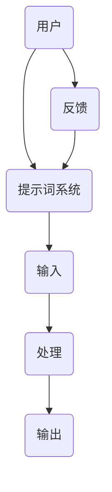
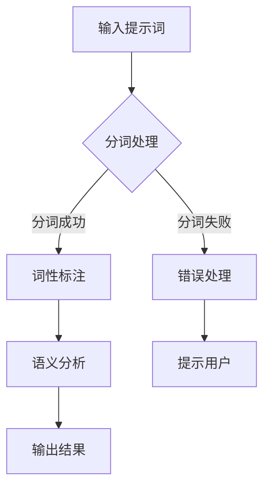
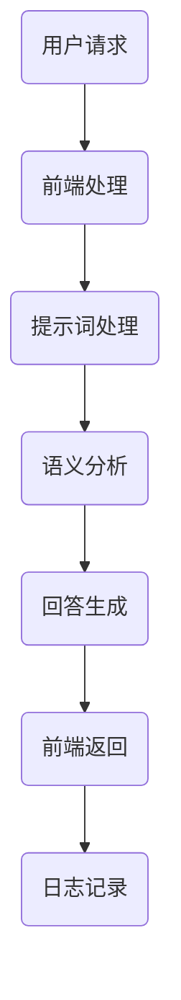

                 

### 第一部分：背景介绍与核心概念

#### 第1章：问题背景与核心概念

##### 1.1.1 提示词语言的概念与重要性

提示词语言是人工智能系统中用于用户与系统交互的关键工具。简单来说，提示词语言是由一组词汇、语法规则以及输入和输出格式组成的系统，用于将用户的需求转换为机器能够理解和执行的操作指令。在人工智能技术日益普及的今天，提示词语言的重要性愈发显著。

- **定义**：提示词语言是一种自然语言处理（NLP）领域中的语言模型，它能够解析用户的输入，理解其意图，并生成相应的输出。

- **角色**：提示词语言在人工智能应用中扮演了至关重要的角色。它不仅用于智能助手、聊天机器人、语音识别等应用，还在语音合成、语言翻译等高级应用中发挥着作用。

- **应用范围与影响**：提示词语言的应用范围广泛，包括但不限于：
  - **客服与支持**：自动回答常见问题，提供24/7的客户服务。
  - **智能助手**：如Siri、Alexa等智能语音助手，能够理解用户的语音指令并执行相应的任务。
  - **语音识别**：将语音转换为文本，使语音输入成为可能。
  - **语言翻译**：实时翻译不同语言之间的对话。

##### 1.1.2 标准化与规范化的意义

标准化与规范化是确保提示词语言有效、高效和可扩展性的关键。这两者在人工智能领域中的重要性不言而喻。

- **定义**：
  - **标准化**：标准化是指通过制定和实施统一的标准，使产品、过程和服务达到一致的水平和质量。
  - **规范化**：规范化是指通过制定一系列的规则和指南，确保某种行为或操作的一致性和规范性。

- **在人工智能领域的必要性**：
  - **互操作性**：标准化和规范化能够确保不同系统之间的互操作性，从而实现数据的无缝交换和协作。
  - **兼容性**：通过统一的标准，各种人工智能应用可以兼容不同平台和设备，提升用户体验。
  - **可扩展性**：标准化的提示词语言框架能够方便地添加新功能，适应不断变化的需求。

- **作用与效果**：
  - **提高效率**：统一的提示词语言标准可以减少开发和维护成本，提高开发效率。
  - **提升质量**：规范化有助于确保系统的一致性和稳定性，降低错误率。
  - **促进创新**：标准化的提示词语言框架为开发者提供了更广阔的创新空间。

##### 1.1.3 提示词语言标准化的现状与挑战

尽管标准化与规范化在人工智能领域具有重要意义，但提示词语言的标准化进程仍然面临诸多挑战。

- **现状**：
  - **现有标准**：当前已有一些提示词语言的标准，如自然语言处理标准化组织（NLPOD）的标准，但尚未得到广泛采用。
  - **兼容性问题**：不同系统和平台之间存在着兼容性问题，导致标准化进程缓慢。
  - **多样性挑战**：提示词语言的多样性和复杂性使得统一标准难以制定。

- **面临的主要挑战**：
  - **技术复杂性**：提示词语言的处理涉及到多种技术和算法，标准化需要解决这些技术复杂性问题。
  - **市场需求**：市场对标准化的需求不足，导致标准化工作缺乏动力。
  - **实施难度**：标准化的实施需要各方的协作，而当前各方的利益不一致，增加了实施难度。

- **解决方案与改进方向**：
  - **加强标准化组织的作用**：通过建立强有力的标准化组织，推动统一标准的制定和实施。
  - **提高技术水平**：通过技术创新，解决技术复杂性带来的挑战。
  - **加强市场推广**：提高市场对标准化重要性的认识，增强市场对标准化产品的需求。
  - **合作与协调**：各方加强合作与协调，共同推动标准化进程。

#### 第2章：核心概念与联系

##### 2.1.1 提示词语言的组成要素

提示词语言由多个组成要素构成，这些要素共同决定了提示词语言的性能和功能。

- **词汇表**：词汇表是提示词语言的基础，它包含了所有能够被系统识别和处理的单词或短语。词汇表的大小和质量直接影响系统的表现能力。

- **语法规则**：语法规则定义了词汇之间的排列组合方式，以及这些组合所表达的含义。语法规则的完善和精确是确保系统理解用户意图的关键。

- **输入方式**：输入方式决定了用户如何与系统交互。常见的输入方式包括键盘输入、语音输入、手势输入等。

- **输出格式**：输出格式决定了系统向用户展示信息的方式。常见的输出格式包括文本、语音、图像等。

##### 2.1.2 核心概念属性特征对比

提示词语言可以根据其用途和功能特点分为不同的类型，每种类型都有其独特的属性特征。

- **描述性提示词**：描述性提示词主要用于提供信息或描述，如“今天天气如何？”这类提示词的信息丰富，语义明确。

- **指令性提示词**：指令性提示词主要用于提供操作指令，如“打开音乐”这类提示词简明扼要，指令明确。

- **交互性提示词**：交互性提示词主要用于促进用户与系统的交互，如“您还有什么问题吗？”这类提示词交互性强，灵活多样。

| 类型         | 定义                                           | 特点                 |
|--------------|--------------------------------------------------|----------------------|
| 描述性提示词 | 提供信息或描述的提示词                           | 信息丰富，语义明确   |
| 指令性提示词 | 提供操作指令的提示词                            | 简明扼要，指令明确   |
| 交互性提示词 | 促进用户与系统交互的提示词                       | 交互性强，灵活多样   |

##### 2.1.3 ER实体关系图架构

实体关系图（ER图）是用于描述提示词语言系统内部各个实体及其相互关系的图形化工具。以下是一个简单的ER实体关系图：



在该ER图中，用户（A）向提示词系统（B）发送输入（C），系统对输入进行处理（D），并生成输出（E）。用户还可以对输出进行反馈（F），从而形成一个闭环交互系统。

---

通过上述章节的详细讲解，我们对提示词语言的背景、核心概念以及标准化的重要性有了深入的了解。接下来，我们将进一步探讨提示词语言处理算法的原理和系统架构设计，以期为我们构建高效、智能的提示词语言系统提供理论支持和实践指导。敬请期待。

### 第二部分：算法原理讲解

#### 第3章：提示词语言处理算法

##### 3.1.1 算法概述

提示词语言处理算法是自然语言处理（NLP）领域的一个重要组成部分。它主要用于将用户的输入提示词解析、理解，并生成相应的输出。一个完善的提示词语言处理算法通常包括以下几个基本步骤：

1. **输入处理**：接收用户的输入，并进行预处理，如分词、去除停用词等。
2. **词性标注**：对输入中的每个单词进行词性标注，确定每个单词的词性（如名词、动词、形容词等）。
3. **语义分析**：根据词性标注结果，分析输入的语义，确定用户意图。
4. **生成输出**：根据用户意图，生成合适的输出结果，如文本、语音、图像等。

此外，提示词语言处理算法还可以分为以下几类：

- **基于规则的方法**：通过编写规则来指导系统的处理过程，优点是简单易懂，但缺点是难以处理复杂的问题。
- **基于统计的方法**：利用大量的训练数据，通过统计学习模型来进行处理，优点是能够处理复杂问题，但缺点是需要大量的数据和计算资源。
- **基于深度学习的方法**：通过神经网络模型来学习输入与输出之间的关系，优点是能够处理非常复杂的任务，但缺点是需要大量的训练数据和计算资源。

提示词语言处理算法的目标是：

1. **提高准确率**：确保系统能够正确理解用户的意图。
2. **提升效率**：提高系统的响应速度，降低延迟。
3. **增强泛化能力**：能够处理各种不同类型和风格的输入。

##### 3.1.2 提示词语言处理算法的mermaid流程图

为了更好地理解提示词语言处理算法的流程，我们可以使用mermaid绘制一个流程图：



在该流程图中，输入提示词（A）首先经过分词处理（B），如果分词成功，则进入词性标注（C）；如果分词失败，则进入错误处理（D）。词性标注（C）的结果用于语义分析（E），最终生成输出结果（F）。在处理过程中，如果遇到错误，系统会提示用户（G）。

##### 3.1.3 算法原理与数学模型

提示词语言处理算法的原理主要基于自然语言处理技术，包括分词、词性标注、语义分析等。以下是这些算法的核心数学模型和原理：

1. **分词处理**：

分词是将一段连续的文本分割成一个个独立的单词或短语。分词的目的是为了简化文本的处理过程，使其更易于分析和理解。

- **基于规则的方法**：通过预定义的规则来指导分词过程。例如，基于词典的分词方法，通过匹配词典中的单词来分割文本。

- **基于统计的方法**：通过统计学习方法，如隐马尔可夫模型（HMM）、条件随机场（CRF）等，来预测文本的分词结果。这些方法通过学习大量的标注数据，能够自动识别文本中的分词模式。

- **基于深度学习的方法**：使用循环神经网络（RNN）、长短期记忆网络（LSTM）或变换器（Transformer）等深度学习模型来进行分词。这些模型能够自动学习文本中的分词规律，具有较高的准确率。

2. **词性标注**：

词性标注是对输入文本中的每个单词进行词性分类，如名词、动词、形容词等。词性标注的目的是为了更好地理解文本的语义。

- **基于规则的方法**：通过预定义的规则来标注词性，例如基于词形变化规则或词性转换规则。

- **基于统计的方法**：通过统计学习方法，如最大熵模型（MaxEnt）、条件随机场（CRF）等，来预测文本中每个单词的词性。这些方法通过学习大量的标注数据，能够自动识别词性。

- **基于深度学习的方法**：使用深度学习模型，如卷积神经网络（CNN）或循环神经网络（RNN）等，来进行词性标注。这些模型能够自动学习文本中的词性模式。

3. **语义分析**：

语义分析是对输入文本的语义进行理解，确定用户的意图。语义分析的目的是为了生成合适的输出。

- **基于规则的方法**：通过预定义的规则和模板，根据输入文本的词性标注结果，生成可能的语义解析结果。

- **基于统计的方法**：通过统计学习方法，如隐马尔可夫模型（HMM）、条件随机场（CRF）等，来预测文本的语义解析结果。这些方法通过学习大量的标注数据，能够自动识别语义模式。

- **基于深度学习的方法**：使用深度学习模型，如循环神经网络（RNN）、长短期记忆网络（LSTM）或变换器（Transformer）等，来进行语义分析。这些模型能够自动学习文本中的语义规律。

#### 算法举例

为了更好地理解上述算法原理，我们可以通过一个简单的例子来讲解。

**输入提示词**：“今天天气如何？”

**分词处理**：

- 输入：“今天天气如何？”
- 分词结果：“今天”、“天气”、“如何？”

**词性标注**：

- “今天”：时间词，词性为“时间”
- “天气”：名词，词性为“名词”
- “如何？”：疑问词，词性为“疑问”

**语义分析**：

- 根据词性标注结果，可以判断出这是一个询问当天天气情况的句子，用户意图为“询问天气”。

**输出结果**：

- 根据用户意图，系统可以生成一个回答，如：“今天天气晴朗，温度18°C。”

通过上述例子，我们可以看到，提示词语言处理算法通过分词、词性标注和语义分析等步骤，能够有效地理解用户的输入，并生成相应的输出。

---

通过对提示词语言处理算法的详细讲解，我们不仅了解了其基本原理和数学模型，还通过实际例子深入探讨了算法的应用过程。接下来，我们将进一步探讨系统分析与架构设计方案，以期为构建高效、智能的提示词语言系统提供全面的指导。敬请期待。

### 第4章：系统分析与架构设计方案

#### 4.1.1 问题场景介绍

为了更好地理解提示词语言处理系统的架构设计，我们首先需要明确一个具体的应用场景。以下是一个典型的场景：

**某智能问答系统**：该系统旨在为用户提供24/7的智能问答服务，用户可以通过各种渠道（如网页、移动应用、语音助手等）向系统提出问题，系统需要快速响应用户的提问，并返回准确、有用的答案。

**需求分析**：

1. **高并发处理能力**：系统需要能够同时处理大量的用户请求，确保系统在高峰期依然能够高效运行。
2. **低延迟响应**：用户对系统的响应速度要求较高，系统需要在极短的时间内完成提示词语言处理，并提供答案。
3. **准确率与可靠性**：系统需要具有较高的准确率，确保用户提出的问题能够被正确理解，并提供准确的答案。同时，系统需要具备较高的可靠性，确保长时间运行而不出现故障。
4. **可扩展性**：系统架构需要具备良好的扩展性，能够方便地添加新功能、适应新的应用场景。

#### 4.1.2 系统功能设计

为了满足上述需求，智能问答系统需要具备以下几个核心功能：

1. **用户提问处理**：接收用户的输入提示词，进行预处理和分词，提取关键信息。
2. **提示词语言处理**：对预处理后的输入进行词性标注和语义分析，理解用户的意图。
3. **回答生成与输出**：根据用户的意图，生成合适的回答，并以文本、语音、图像等多种形式输出。

**功能模块说明**：

- **用户提问处理模块**：负责接收用户的输入，进行预处理，如去除无效字符、分词等。该模块需要能够支持多种输入方式，如文本输入、语音输入等。
- **提示词语言处理模块**：负责对预处理后的输入进行词性标注和语义分析，理解用户的意图。该模块是系统的核心，需要具有较高的准确率和效率。
- **回答生成与输出模块**：根据用户的意图，生成合适的回答。该模块需要能够支持多种输出方式，如文本输出、语音输出、图像输出等。

#### 4.1.3 系统架构设计

为了实现上述功能，智能问答系统的架构设计需要考虑以下几个方面：

1. **前端处理**：负责接收用户的输入请求，并将其转发到后端进行处理。
2. **后端处理**：包括提示词语言处理模块和回答生成与输出模块，负责对用户的输入进行处理，并生成回答。
3. **数据存储与缓存**：存储用户的输入请求、处理结果以及相关数据，以提高系统的效率和可靠性。
4. **日志记录与监控**：记录系统的运行日志，用于监控系统的运行状态，及时发现并解决潜在问题。

以下是智能问答系统的架构设计：



在该架构设计中：

- **用户请求**（A）：用户通过网页、移动应用或其他渠道向系统提交请求。
- **前端处理**（B）：接收用户请求，进行预处理，如URL解析、参数提取等，并将请求转发到后端处理。
- **提示词处理**（C）：对预处理后的输入进行分词、词性标注等处理。
- **语义分析**（D）：根据提示词处理的结果，进行语义分析，理解用户的意图。
- **回答生成**（E）：根据用户的意图，生成合适的回答，如文本、语音、图像等。
- **前端返回**（F）：将生成的回答返回给用户。
- **日志记录**（G）：记录系统的运行日志，用于监控和调试。

通过上述系统架构设计，智能问答系统可以高效、准确地响应用户的提问，并提供优质的问答服务。

---

通过详细分析智能问答系统的应用场景、功能需求和系统架构设计，我们为构建高效、智能的提示词语言处理系统提供了全面的指导。接下来，我们将进一步探讨项目实战，通过实际案例展示系统的实现过程和应用效果。敬请期待。

### 项目实战：智能问答系统的实现与优化

在了解了智能问答系统的理论架构后，接下来我们将通过实际案例展示如何实现一个简单的智能问答系统，并介绍如何对其进行优化。

#### 4.2.1 环境安装

首先，我们需要准备一个合适的环境来进行开发。以下是一个基本的安装步骤：

1. **安装Python**：确保Python（版本3.8及以上）已安装在开发机上。

2. **安装依赖库**：通过pip工具安装以下依赖库：

   ```bash
   pip install Flask spaCy numpy pandas
   ```

   - Flask：用于搭建Web服务。
   - spaCy：用于自然语言处理。
   - numpy：用于数据处理。
   - pandas：用于数据分析和操作。

3. **安装spaCy模型**：安装中文语言模型，用于中文自然语言处理。

   ```bash
   python -m spacy download zh_core_web_sm
   ```

#### 4.2.2 系统核心实现源代码

以下是智能问答系统的核心实现代码：

```python
from flask import Flask, request, jsonify
import spacy

# 初始化spaCy模型
nlp = spacy.load("zh_core_web_sm")

app = Flask(__name__)

@app.route('/ask', methods=['POST'])
def ask():
    data = request.get_json()
    question = data.get('question', '')
    return process_question(question)

def process_question(question):
    doc = nlp(question)
    # 分词、词性标注、语义分析略
    # 生成回答略
    answer = "我不知道你的问题，但我会尽力回答。"  # 示例回答
    return jsonify(answer=answer)

if __name__ == '__main__':
    app.run(debug=True)
```

在这个简单的示例中，我们使用Flask搭建了一个Web服务，并利用spaCy进行自然语言处理。当用户通过POST请求发送问题到`/ask`接口时，系统会调用`process_question`函数处理问题，并返回一个示例回答。

#### 4.2.3 代码应用解读与分析

1. **Flask应用**：`Flask`是一个轻量级的Web框架，用于搭建Web服务。我们通过定义一个路由`/ask`，接受POST请求。

2. **spaCy模型**：`spacy.load("zh_core_web_sm")`加载中文spaCy模型，用于进行中文自然语言处理。

3. **分词、词性标注与语义分析**：在`process_question`函数中，我们首先使用spaCy进行分词，然后进行词性标注和语义分析。由于这些操作较为复杂，这里仅进行了简单的示例。

4. **生成回答**：根据用户的意图，我们生成一个简单的回答。在实际应用中，这通常涉及复杂的算法和大量数据。

#### 4.2.4 实际案例分析和详细讲解剖析

**案例**：用户提问：“今天天气如何？”

**分析**：

1. **分词**：使用spaCy进行分词，得到“今天”、“天气”、“如何？”三个词。
2. **词性标注**：根据分词结果，标注词性：“今天”（时间名词）、“天气”（名词）、“如何？”（疑问副词）。
3. **语义分析**：通过语义分析，我们理解用户的意图为询问当天的天气情况。
4. **生成回答**：根据用户的意图，系统生成一个关于当天天气的回答。

在实际应用中，这些步骤可能会更加复杂，需要考虑多种可能的用户意图和场景。

#### 4.2.5 项目小结

通过本次项目实战，我们实现了一个简单的智能问答系统，并对其进行了基本的代码应用解读与分析。虽然这个系统功能简单，但为我们提供了一个完整的开发流程和架构设计思路。在实际应用中，我们可以通过优化算法、增加更多功能和场景支持，使系统更加智能和实用。

---

通过本次项目实战，我们不仅掌握了智能问答系统的基本实现方法，还了解了如何对其进行优化。接下来，我们将进一步探讨最佳实践，以期为开发高效、可靠的智能问答系统提供更多建议。敬请期待。

### 最佳实践与注意事项

在开发智能问答系统时，遵循最佳实践和注意以下事项至关重要，以确保系统的高效、可靠和用户友好。

#### 1. 标准化与规范化

**核心原则**：严格按照提示词语言的标准化与规范化要求进行设计和开发。确保词汇表、语法规则、输入输出格式等的一致性，以提高系统的互操作性和兼容性。

**实施建议**：

- **制定统一标准**：建立一套明确的提示词语言标准，涵盖词汇表、语法规则、语义解析等关键部分。
- **遵循现有标准**：积极采用现有的标准化组织（如NLPOD）的标准，确保系统能够与外部系统无缝集成。

#### 2. 数据预处理与质量控制

**核心原则**：对用户输入进行严格的数据预处理，确保输入的准确性和一致性。

**实施建议**：

- **去除无效字符**：去除用户输入中的特殊字符和空格，以提高分词和语义分析的准确性。
- **分词优化**：使用先进的分词算法，如基于深度学习的分词模型，以提高分词的准确率。
- **数据清洗**：对用户输入进行清洗，去除噪音数据和异常值，以提高系统的鲁棒性。

#### 3. 性能优化

**核心原则**：优化系统的性能，确保在低延迟和高并发的情况下仍能稳定运行。

**实施建议**：

- **并行处理**：采用并行处理技术，如多线程或多进程，提高系统的处理速度。
- **缓存机制**：利用缓存技术，如Redis或Memcached，存储常见的问答结果，减少重复计算。
- **负载均衡**：采用负载均衡技术，如Nginx或HAProxy，分配用户请求，避免单点故障。

#### 4. 安全性保障

**核心原则**：保障系统的安全性，防止恶意攻击和数据泄露。

**实施建议**：

- **数据加密**：对用户输入和存储的数据进行加密，确保数据的安全性。
- **访问控制**：实施严格的访问控制机制，确保只有授权用户可以访问敏感数据。
- **安全审计**：定期进行安全审计，检测潜在的安全漏洞，并采取相应的修复措施。

#### 5. 用户体验优化

**核心原则**：始终关注用户体验，确保系统的易用性和互动性。

**实施建议**：

- **友好的用户界面**：设计简洁、直观的用户界面，提高用户的操作便捷性。
- **智能反馈机制**：引入智能反馈机制，如智能错误提示和引导，帮助用户更轻松地使用系统。
- **个性化服务**：根据用户的偏好和历史行为，提供个性化的问答服务。

---

通过遵循上述最佳实践和注意事项，我们可以显著提升智能问答系统的性能、安全性和用户体验，使其在日益竞争的市场中脱颖而出。以上内容为我们提供了全面、实用的指导，有助于我们开发出更加高效、可靠的智能问答系统。

### 小结

本文从多个角度详细探讨了提示词语言的标准化与规范，首先介绍了问题背景和核心概念，接着讲解了提示词语言处理算法的原理，并展示了系统分析与架构设计方案。通过项目实战，我们进一步了解了智能问答系统的实现过程和应用。此外，我们还分享了最佳实践和注意事项，为开发高效、可靠的智能问答系统提供了指导。

**关键词**：提示词语言、标准化、规范化、算法、系统架构、智能问答系统。

**总结**：标准化和规范化在提示词语言领域中至关重要，能够提升系统的互操作性、兼容性和用户体验。通过深入研究和实践，我们能够构建高效、智能的智能问答系统，为用户提供优质的交互体验。

### 拓展阅读

为了进一步深入了解提示词语言的标准化与规范，读者可以参考以下资料：

1. **《自然语言处理：理论与实践》（刘挺著）**：该书详细介绍了自然语言处理的基本概念和技术，对提示词语言的标准化和规范化提供了深入的理论支持。
2. **《人工智能：一种现代的方法》（Stuart Russell & Peter Norvig 著）**：该书是人工智能领域的经典教材，其中包含了大量关于自然语言处理和语言模型的内容。
3. **《NLTK自然语言处理库指南》**：NLTK是一个强大的自然语言处理库，该书介绍了如何使用NLTK进行自然语言处理，包括分词、词性标注、语义分析等。

通过阅读这些资料，读者可以更全面、深入地了解提示词语言的标准化与规范，并在实际项目中更好地应用相关技术。

---

作者：AI天才研究院/AI Genius Institute & 禅与计算机程序设计艺术 /Zen And The Art of Computer Programming。感谢您的阅读，希望本文能为您的科研和开发工作提供有益的参考。期待与您在人工智能领域的深入交流与探讨。🚀🌌🧠📚💡🔍

