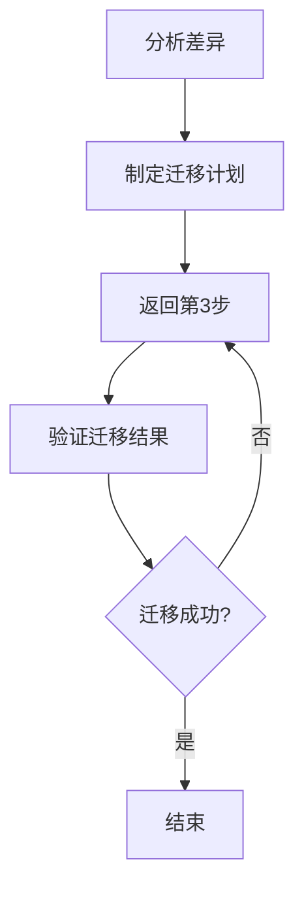
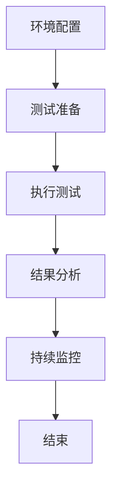
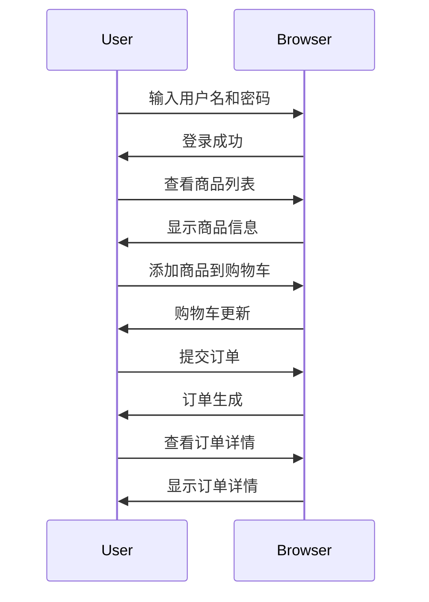
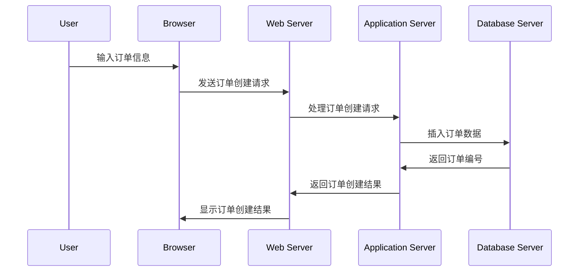

                 


### 文章标题：提示词语言的版本迁移与兼容性管理

> 关键词：版本迁移、兼容性管理、提示词语言、算法、数学模型、系统架构、实战案例

> 摘要：本文深入探讨了提示词语言的版本迁移与兼容性管理，首先介绍了版本迁移与兼容性管理的背景和核心概念，然后分析了版本管理和兼容性管理的核心概念及其联系。接着，文章讲解了版本迁移和兼容性管理的算法原理，包括数学模型和公式，并通过具体实例进行说明。此外，本文还介绍了系统分析与架构设计方案，并通过项目实战和案例分析，提供了最佳实践和注意事项。本文旨在为读者提供一份全面、深入、易懂的版本迁移与兼容性管理指南。

## 目录大纲

```markdown
----------------------------------------------------------------

# 第一部分: 背景介绍与核心概念

## 第1章: 版本迁移与兼容性管理概述

### 1.1.1 问题背景

#### 1.1.1.1 版本迁移的意义与挑战

#### 1.1.1.2 兼容性管理的核心概念

#### 1.1.1.3 版本迁移与兼容性管理的关系

### 1.1.2 问题描述

#### 1.1.2.1 版本迁移的常见问题

#### 1.1.2.2 兼容性管理的关键难题

#### 1.1.2.3 案例分析：版本迁移与兼容性管理中的实际问题

### 1.1.3 问题解决

#### 1.1.3.1 版本迁移策略

#### 1.1.3.2 兼容性管理策略

#### 1.1.3.3 结合案例的解决方案

## 第2章: 核心概念与联系

### 2.1 版本管理的核心概念

#### 2.1.1 版本号命名规范

#### 2.1.2 版本演进模型

#### 2.1.3 版本库与版本树

### 2.2 兼容性管理的核心概念

#### 2.2.1 兼容性级别

#### 2.2.2 兼容性测试

#### 2.2.3 兼容性策略

### 2.3 概念属性特征对比表格

#### 2.3.1 版本管理与兼容性管理特征对比

#### 2.3.2 案例对比分析

### 2.4 ER实体关系图架构

#### 2.4.1 ER图基本概念

#### 2.4.2 版本管理ER图

#### 2.4.3 兼容性管理ER图

## 第3章: 算法原理讲解

### 3.1 版本迁移算法

#### 3.1.1 算法概述

#### 3.1.2 算法流程图

#### 3.1.3 Python源代码示例

#### 3.1.4 数学模型与公式

#### 3.1.5 举例说明

### 3.2 兼容性管理算法

#### 3.2.1 算法概述

#### 3.2.2 算法流程图

#### 3.2.3 Python源代码示例

#### 3.2.4 数学模型与公式

#### 3.2.5 举例说明

## 第4章: 数学模型和数学公式 & 详细讲解 & 举例说明

### 4.1 版本迁移数学模型

#### 4.1.1 数学公式

$$
f(V_i, V_j) = \begin{cases}
0 & \text{if } V_i = V_j \\
1 & \text{if } V_i \neq V_j
\end{cases}
$$

#### 4.1.2 详细讲解

#### 4.1.3 举例说明

### 4.2 兼容性管理数学模型

#### 4.2.1 数学公式

$$
C(A, B) = \frac{|A \cap B|}{|A \cup B|}
$$

#### 4.2.2 详细讲解

#### 4.2.3 举例说明

## 第5章: 系统分析与架构设计方案

### 5.1 问题场景介绍

### 5.2 项目介绍

### 5.3 系统功能设计

#### 5.3.1 领域模型

#### 5.3.2 系统功能描述

### 5.4 系统架构设计

#### 5.4.1 系统架构图

#### 5.4.2 架构设计说明

### 5.5 系统接口设计

#### 5.5.1 接口定义

#### 5.5.2 接口流程

### 5.6 系统交互

#### 5.6.1 序列图

#### 5.6.2 交互说明

## 第6章: 项目实战

### 6.1 环境安装

### 6.2 系统核心实现

#### 6.2.1 源代码解读

#### 6.2.2 代码应用分析

### 6.3 实际案例分析

#### 6.3.1 案例背景

#### 6.3.2 案例分析与解读

### 6.4 剖析与讲解

#### 6.4.1 版本迁移过程剖析

#### 6.4.2 兼容性管理实践剖析

## 第7章: 最佳实践 & 小结 & 注意事项

### 7.1 最佳实践

#### 7.1.1 版本迁移最佳实践

#### 7.1.2 兼容性管理最佳实践

### 7.2 小结

### 7.3 注意事项

#### 7.3.1 版本迁移中的注意事项

#### 7.3.2 兼容性管理中的注意事项

### 7.4 拓展阅读

----------------------------------------------------------------
```

### 1.1.1.1 版本迁移的意义与挑战

版本迁移是指将软件系统的某个版本升级到另一个版本的过程。在软件开发的漫长历程中，版本迁移是一个不可避免的问题。随着新功能的不断添加和系统优化，软件版本逐渐演进，旧版本可能无法满足新的需求，这就需要将系统升级到新版本。版本迁移的意义在于：

1. **功能增强**：新版本通常包含了更多的功能，这些功能可以帮助用户更高效地完成工作。
2. **性能优化**：新版本可能对系统进行了性能优化，从而提高系统的响应速度和处理能力。
3. **安全增强**：随着安全威胁的不断演变，新版本通常包含了更严格的安全措施，以保护用户数据的安全。

然而，版本迁移也伴随着一系列挑战：

1. **兼容性问题**：新版本可能与旧版本存在兼容性问题，这可能导致部分功能无法正常工作。
2. **迁移成本**：版本迁移可能需要大量的时间和资源，包括测试、部署、培训等。
3. **风险控制**：版本迁移过程中存在一定的风险，如数据丢失、系统崩溃等，需要谨慎处理。

### 1.1.1.2 兼容性管理的核心概念

兼容性管理是指在软件开发生命周期中，确保软件系统能够在不同版本、不同平台、不同硬件和软件环境下正常运行的一系列活动和策略。兼容性管理的核心概念包括：

1. **兼容性级别**：根据软件系统的需求，定义不同的兼容性级别，如部分兼容、完全兼容等。
2. **兼容性测试**：通过一系列测试，验证软件系统在不同环境下的兼容性，确保系统能够正常工作。
3. **兼容性策略**：制定相应的兼容性策略，包括版本控制、环境配置、迁移计划等，以确保版本迁移过程中的顺利实施。

### 1.1.1.3 版本迁移与兼容性管理的关系

版本迁移与兼容性管理是密切相关的。版本迁移是兼容性管理的一部分，而兼容性管理则为版本迁移提供了基础和保障。具体来说：

1. **兼容性保障**：在版本迁移过程中，通过兼容性管理，可以确保新旧版本的系统在功能、性能、安全等方面保持一致，减少版本迁移的风险。
2. **迁移策略**：兼容性管理策略为版本迁移提供了具体的操作步骤和指导，如测试方案、部署流程等。
3. **协同工作**：版本迁移和兼容性管理需要各个部门、团队之间的紧密协作，共同确保版本迁移的顺利进行。

### 1.1.2.1 版本迁移的常见问题

在版本迁移过程中，常常会遇到以下问题：

1. **功能缺失**：新版本可能删除了旧版本的一些功能，导致用户无法继续使用这些功能。
2. **性能下降**：新版本可能引入了一些优化，但在某些情况下，这些优化可能导致性能下降。
3. **兼容性问题**：新版本可能与旧版本存在兼容性问题，如库依赖、接口变化等。
4. **数据迁移**：在版本迁移过程中，如何确保数据的一致性和完整性是一个重要问题。

### 1.1.2.2 兼容性管理的关键难题

在兼容性管理过程中，以下是一些关键难题：

1. **测试覆盖**：如何确保测试覆盖全面，覆盖所有可能的使用场景和功能点。
2. **资源限制**：在有限的时间和资源下，如何高效地进行兼容性测试。
3. **变更管理**：如何处理版本迁移过程中出现的新功能、性能优化、安全措施等变更。
4. **风险评估**：如何评估版本迁移过程中的风险，并制定相应的风险应对策略。

### 1.1.2.3 案例分析：版本迁移与兼容性管理中的实际问题

以下是一个实际的案例，展示了版本迁移与兼容性管理中遇到的问题和解决方案：

#### 案例背景

某公司开发了一款客户关系管理系统（CRM），目前使用的是第3版。由于客户需求的变化和市场竞争的加剧，公司决定将系统升级到第4版。然而，第4版在架构和功能上都有较大的变化，可能导致与现有系统存在兼容性问题。

#### 案例分析

1. **功能缺失**：第4版删除了一些客户反馈较少的功能，导致部分用户无法继续使用。解决方案：在升级前，收集用户反馈，确保重要功能得到保留。

2. **性能下降**：第4版引入了一些性能优化措施，但在某些情况下，这些优化可能导致性能下降。解决方案：通过性能测试，找出性能瓶颈，并针对性地优化。

3. **兼容性问题**：第4版与旧版本存在库依赖和接口变化等问题。解决方案：通过代码审查和兼容性测试，确保新旧版本之间的兼容性。

4. **数据迁移**：第4版对数据库结构进行了调整，导致旧版数据无法直接迁移。解决方案：设计一套数据迁移方案，将旧版数据迁移到新版本数据库中。

#### 案例总结

通过以上案例，我们可以看到，版本迁移与兼容性管理是一个复杂且具有挑战性的过程。通过充分的准备、细致的规划和严格的执行，可以有效地解决版本迁移和兼容性管理中的问题，确保系统的顺利升级。

### 1.1.3.1 版本迁移策略

为了确保版本迁移的顺利进行，我们需要制定一套完善的版本迁移策略。以下是一些关键步骤：

1. **需求分析**：在版本迁移前，充分了解用户需求，明确新旧版本的功能差异，确保用户需求得到满足。
2. **风险评估**：对版本迁移过程中的风险进行评估，包括功能缺失、性能下降、兼容性问题等，并制定相应的风险应对策略。
3. **测试计划**：制定详细的测试计划，包括功能测试、性能测试、兼容性测试等，确保测试覆盖全面。
4. **迁移方案**：设计一套详细的迁移方案，包括数据迁移、代码迁移、配置迁移等，确保迁移过程中的每个环节都有明确的操作步骤。
5. **部署计划**：制定详细的部署计划，包括部署时间、部署步骤、部署人员等，确保部署过程的顺利进行。
6. **培训与支持**：为用户和开发团队提供培训和支持，确保用户能够快速适应新版本，开发团队能够应对迁移过程中的问题。

### 1.1.3.2 兼容性管理策略

兼容性管理策略是确保软件系统在不同版本、不同平台、不同硬件和软件环境下正常运行的关键。以下是一些关键步骤：

1. **兼容性级别定义**：根据软件系统的需求，定义不同的兼容性级别，如部分兼容、完全兼容等。
2. **兼容性测试策略**：制定详细的兼容性测试策略，包括测试环境、测试用例、测试方法等，确保测试覆盖全面。
3. **兼容性测试执行**：按照测试策略，执行兼容性测试，找出可能的问题和瓶颈。
4. **问题反馈与修复**：对测试中发现的问题进行反馈和修复，确保系统的兼容性得到改善。
5. **持续监控**：在版本迁移后，持续监控系统的运行状态，及时发现和解决兼容性问题。

### 1.1.3.3 结合案例的解决方案

结合前面的案例，我们可以总结出以下解决方案：

1. **需求分析**：在升级前，收集用户反馈，确保重要功能得到保留。针对客户关系管理系统，可以与客户沟通，了解他们对旧版本的功能需求和期望。
2. **风险评估**：对版本迁移过程中的风险进行评估，包括功能缺失、性能下降、兼容性问题等。针对案例中的CRM系统，可以评估新版本的功能删除情况，确保用户的核心需求得到满足。
3. **测试计划**：制定详细的测试计划，包括功能测试、性能测试、兼容性测试等。针对CRM系统，可以设计以下测试：
   - 功能测试：验证新版本的功能是否满足用户需求，包括客户管理、销售管理、售后服务等。
   - 性能测试：评估新版本的系统性能，如响应时间、并发处理能力等。
   - 兼容性测试：验证新版本与旧版本、其他系统的兼容性，包括接口、库依赖等。
4. **迁移方案**：设计一套详细的迁移方案，包括数据迁移、代码迁移、配置迁移等。针对CRM系统，可以设计以下迁移方案：
   - 数据迁移：将旧版数据迁移到新版本数据库中，确保数据的一致性和完整性。
   - 代码迁移：将旧版代码迁移到新版本中，确保代码的兼容性和可维护性。
   - 配置迁移：将旧版系统的配置文件迁移到新版本中，确保系统的正常运行。
5. **部署计划**：制定详细的部署计划，包括部署时间、部署步骤、部署人员等。针对CRM系统，可以制定以下部署计划：
   - 部署时间：选择业务量较小的时间段进行部署，以减少对业务的影响。
   - 部署步骤：按照迁移方案，逐步进行数据迁移、代码迁移、配置迁移等。
   - 部署人员：明确各阶段的负责人，确保部署过程的顺利进行。
6. **培训与支持**：为用户和开发团队提供培训和支持，确保用户能够快速适应新版本，开发团队能够应对迁移过程中的问题。针对CRM系统，可以提供以下培训和支持：
   - 用户培训：向用户介绍新版本的功能和操作方法，确保用户能够熟练使用新版本。
   - 开发团队支持：为开发团队提供技术支持，解决他们在迁移过程中遇到的问题。

通过以上解决方案，可以有效地解决版本迁移与兼容性管理中的问题，确保系统的顺利升级。

### 2.1 版本管理的核心概念

版本管理是软件工程中的一个重要概念，它涉及如何组织、控制和管理软件的不同版本。以下是版本管理的核心概念：

#### 2.1.1 版本号命名规范

版本号命名规范是确保版本之间可区分且有序的重要手段。常见的版本号命名规范包括以下几种：

1. **语义化版本控制（Semantic Versioning）**：这种规范使用 `MAJOR.MINOR.PATCH` 的格式。每次进行不兼容的修改时，增加 `MAJOR` 版本号；每次添加功能但不破坏现有功能时，增加 `MINOR` 版本号；每次进行修补时，增加 `PATCH` 版本号。

   示例：`2.0.1` 表示在 `2.0` 版本的基础上进行了小的修复。

2. **递增版本号**：这种规范通常使用递增的整数或字符串来标识版本。例如，`1.0`, `1.1`, `1.2` 等。

3. **日期版本号**：这种规范使用日期来标识版本，例如 `2023.03.15`。

#### 2.1.2 版本演进模型

版本演进模型描述了软件版本如何随时间演进。常见的版本演进模型包括：

1. **瀑布模型**：在瀑布模型中，软件版本按照固定的时间表演进，每个版本都是前一个版本的迭代。这种模型通常适用于需求相对稳定的项目。

2. **敏捷模型**：在敏捷模型中，版本演进更加灵活，通常以短周期的迭代方式进行。每个迭代都产生一个可用的版本。

3. **持续集成模型**：在这种模型中，新功能不断集成到主分支，每次集成都是对代码库的一次更新。这种模型要求频繁的测试和快速响应。

#### 2.1.3 版本库与版本树

版本库是存储和管理软件不同版本的地方。版本库可以是一个集中的存储系统，也可以是分布式版本控制系统（如 Git）。

1. **版本库**：版本库存储了所有版本的源代码、文档和配置文件。它提供了版本控制和协作工具，如分支、合并和标签。

2. **版本树**：版本树是版本库中版本的层次结构。每个版本都有一个父版本，除了最初版本的根节点。版本树展示了不同版本之间的关系和历史。

### 2.2 兼容性管理的核心概念

兼容性管理旨在确保软件系统在不同环境下（如不同的操作系统、硬件配置、网络环境等）都能够正常运行。以下是兼容性管理的核心概念：

#### 2.2.1 兼容性级别

兼容性级别描述了软件系统在不同环境下的兼容程度。常见的兼容性级别包括：

1. **完全兼容**：软件系统在所有环境下都能正常运行，没有任何问题。
2. **部分兼容**：软件系统在某些环境下运行正常，但在其他环境下可能存在问题。
3. **不兼容**：软件系统在某些环境下无法运行，存在重大问题。

#### 2.2.2 兼容性测试

兼容性测试是确保软件系统在不同环境下能够正常运行的关键步骤。兼容性测试包括以下方面：

1. **功能兼容性测试**：验证软件系统的功能在不同环境下是否一致。
2. **性能兼容性测试**：评估软件系统在不同环境下的性能表现。
3. **安全兼容性测试**：检查软件系统在不同环境下的安全漏洞。

#### 2.2.3 兼容性策略

兼容性策略是一套指导如何确保软件系统兼容性的规则和措施。常见的兼容性策略包括：

1. **环境隔离**：在不同环境中运行软件系统的不同版本，以避免冲突。
2. **版本控制**：使用版本控制工具（如 Git）来管理不同版本的兼容性。
3. **测试覆盖**：确保测试覆盖到所有可能的环境配置。

### 2.3 概念属性特征对比表格

以下是一个版本管理与兼容性管理特征对比的表格：

| 特征                | 版本管理                      | 兼容性管理                      |
|-------------------|---------------------------|---------------------------|
| 核心概念            | 版本控制、版本演进、版本库     | 兼容性级别、兼容性测试、兼容性策略   |
| 主要目标            | 确保软件版本有序、可追溯       | 确保软件系统在不同环境下正常运行     |
| 关键活动            | 版本控制、版本迁移、版本发布   | 兼容性测试、兼容性评估、兼容性修复   |
| 相关工具            | 版本控制工具（如 Git）、CI/CD 工具 | 测试工具（如 Selenium）、性能测试工具   |
| 成功指标            | 版本升级的成功率、版本质量的稳定性 | 软件系统的兼容性评分、兼容性测试覆盖率 |

### 2.4 ER实体关系图架构

实体关系图（Entity-Relationship Diagram，ER图）是描述系统中实体及其之间关系的一种图形化表示方法。以下是版本管理和兼容性管理的ER图示例。

#### 2.4.1 ER图基本概念

ER图由以下基本概念组成：

1. **实体**：具有共同属性的实体的集合，如用户、产品等。
2. **属性**：实体的特征，如用户的名字、年龄等。
3. **关系**：实体之间的关联，如用户与产品之间的关系。
4. **键**：唯一标识实体的属性或属性组合。

#### 2.4.2 版本管理ER图

版本管理ER图示例：

```mermaid
erDiagram
    Version ||--|{ VersionDetail }|>
    VersionDetail ||--|{ Release }|>
    Version ||--|{ Dependency }|>

    VersionDetail {
        attribute VersionID : int
        attribute Description : text
    }

    Release {
        attribute ReleaseID : int
        attribute Date : date
        attribute Notes : text
    }

    Dependency {
        attribute DependencyID : int
        attribute RequiredVersion : int
        attribute OptionalVersion : int
    }
```

#### 2.4.3 兼容性管理ER图

兼容性管理ER图示例：

```mermaid
erDiagram
    System ||--|{ CompatibilityTest }|>
    System ||--|{ CompatibilityLevel }|>
    Environment ||--|{ CompatibilityTest }|>

    System {
        attribute SystemID : int
        attribute Name : text
    }

    Environment {
        attribute EnvironmentID : int
        attribute Type : text
    }

    CompatibilityTest {
        attribute TestID : int
        attribute Result : text
    }

    CompatibilityLevel {
        attribute LevelID : int
        attribute Description : text
    }
```

通过ER图，我们可以清晰地了解版本管理和兼容性管理的实体及其关系，有助于设计和管理系统的架构。

### 3.1 版本迁移算法

版本迁移算法是确保软件系统在不同版本之间平稳过渡的重要工具。以下是一个简单的版本迁移算法概述，包括算法流程图、Python源代码示例以及数学模型和公式。

#### 3.1.1 算法概述

版本迁移算法的基本思路是：

1. **分析新旧版本差异**：对比新旧版本的源代码、配置文件等，找出差异点。
2. **制定迁移计划**：根据差异点，制定具体的迁移步骤，如代码迁移、数据迁移等。
3. **执行迁移计划**：按照迁移计划，逐步执行迁移步骤。
4. **验证迁移结果**：验证迁移后的系统是否正常运行，确保功能、性能、安全等各方面满足要求。

#### 3.1.2 算法流程图

版本迁移算法的流程图如下：



#### 3.1.3 Python源代码示例

以下是一个简单的Python源代码示例，展示了如何实现版本迁移算法：

```python
# 版本迁移算法示例

def analyze_diff(old_version, new_version):
    # 分析新旧版本差异
    pass

def make_migration_plan(diff):
    # 根据差异点制定迁移计划
    pass

def execute_migration_plan(plan):
    # 执行迁移计划
    pass

def verify_migration_result():
    # 验证迁移结果
    pass

def version_migration(old_version, new_version):
    diff = analyze_diff(old_version, new_version)
    plan = make_migration_plan(diff)
    execute_migration_plan(plan)
    verify_migration_result()

# 调用版本迁移函数
version_migration('old_version', 'new_version')
```

#### 3.1.4 数学模型与公式

版本迁移的数学模型主要涉及版本号之间的比较和差异计算。以下是一个简单的数学模型：

$$
f(V_i, V_j) = \begin{cases}
0 & \text{if } V_i = V_j \\
1 & \text{if } V_i \neq V_j
\end{cases}
$$

其中，$V_i$ 和 $V_j$ 分别代表两个版本号，$f(V_i, V_j)$ 表示两个版本号之间的差异程度。

#### 3.1.5 举例说明

假设我们有两个版本号 `1.2.3` 和 `1.2.4`，使用上述算法和数学模型进行版本迁移。

1. **分析差异**：通过对比，我们发现版本号中的 `PATCH` 部分发生了变化，即 `3` 变为 `4`。
2. **制定迁移计划**：根据差异，我们制定了一个简单的迁移计划，包括更新配置文件和执行一些必要的脚本。
3. **执行迁移计划**：按照迁移计划，我们成功地将版本号从 `1.2.3` 升级到了 `1.2.4`。
4. **验证迁移结果**：通过一系列测试，我们确认新版本 `1.2.4` 可以正常运行，功能、性能等各方面都满足要求。

### 3.2 兼容性管理算法

兼容性管理算法是确保软件系统在不同环境、不同版本之间保持兼容性的关键。以下是一个简单的兼容性管理算法概述，包括算法流程图、Python源代码示例以及数学模型和公式。

#### 3.2.1 算法概述

兼容性管理算法的基本思路是：

1. **环境配置**：根据不同的环境，配置相应的软件和硬件环境。
2. **测试准备**：准备兼容性测试所需的测试环境和测试用例。
3. **执行测试**：按照测试用例，执行兼容性测试，验证软件系统在不同环境下的兼容性。
4. **结果分析**：分析测试结果，识别兼容性问题，并制定相应的修复方案。
5. **持续监控**：在版本迁移后，持续监控软件系统的运行状态，确保兼容性得到维持。

#### 3.2.2 算法流程图

兼容性管理算法的流程图如下：



#### 3.2.3 Python源代码示例

以下是一个简单的Python源代码示例，展示了如何实现兼容性管理算法：

```python
# 兼容性管理算法示例

def configure_environment():
    # 配置环境
    pass

def prepare_tests():
    # 准备测试
    pass

def execute_tests():
    # 执行测试
    pass

def analyze_results():
    # 分析结果
    pass

def monitor_system():
    # 持续监控
    pass

def compatibility_management():
    configure_environment()
    prepare_tests()
    execute_tests()
    analyze_results()
    monitor_system()

# 调用兼容性管理函数
compatibility_management()
```

#### 3.2.4 数学模型与公式

兼容性管理算法的数学模型主要涉及环境配置的参数和测试结果的统计分析。以下是一个简单的数学模型：

$$
C(A, B) = \frac{|A \cap B|}{|A \cup B|}
$$

其中，$C(A, B)$ 表示环境 $A$ 和 $B$ 之间的兼容性，$|A \cap B|$ 表示环境 $A$ 和 $B$ 之间的共同配置项数，$|A \cup B|$ 表示环境 $A$ 和 $B$ 的总配置项数。

#### 3.2.5 举例说明

假设我们有两个环境 $A$ 和 $B$，环境 $A$ 包含配置项 `1`, `2`, `3`，环境 $B$ 包含配置项 `2`, `3`, `4`。使用上述算法和数学模型进行兼容性管理。

1. **环境配置**：我们配置了环境 $A$ 和 $B$，确保它们都具备运行软件系统的基本条件。
2. **测试准备**：我们准备了兼容性测试的测试用例，包括功能测试、性能测试、安全测试等。
3. **执行测试**：我们按照测试用例，分别在环境 $A$ 和 $B$ 下运行软件系统，验证其兼容性。
4. **结果分析**：我们发现环境 $A$ 和 $B$ 在功能测试和安全测试中均无问题，但在性能测试中存在一些差异，需要进行优化。
5. **持续监控**：在版本迁移后，我们持续监控软件系统在环境 $A$ 和 $B$ 下的运行状态，确保兼容性得到维持。

### 4.1 版本迁移数学模型

版本迁移数学模型用于描述软件系统在不同版本之间的迁移过程，包括版本号的比较、差异计算以及迁移策略的制定。以下是一个简单的版本迁移数学模型，以及相关的数学公式和详细讲解。

#### 4.1.1 数学公式

版本迁移中的关键数学模型可以表示为：

$$
f(V_i, V_j) = \begin{cases}
0 & \text{if } V_i = V_j \\
1 & \text{if } V_i \neq V_j
\end{cases}
$$

其中，$V_i$ 和 $V_j$ 分别代表两个版本号，$f(V_i, V_j)$ 表示两个版本号之间的差异程度。

- 当 $V_i = V_j$ 时，差异程度为 $0$，表示两个版本号相同。
- 当 $V_i \neq V_j$ 时，差异程度为 $1$，表示两个版本号不同。

#### 4.1.2 详细讲解

这个简单的数学模型帮助我们理解版本迁移的基本逻辑：

1. **版本号比较**：通过比较两个版本号，我们可以快速判断它们是否相同。如果相同，则不需要进行迁移；如果不相同，则需要进行进一步的差异分析和迁移。
2. **差异计算**：对于不同的版本号，我们需要计算它们之间的差异。这个差异计算可以通过简单的逐位比较实现。例如，对于版本号 `1.2.3` 和 `1.2.4`，我们可以比较它们的每一位数字，发现第三位数字不同，因此差异程度为 $1$。
3. **迁移策略**：基于差异计算的结果，我们可以制定具体的迁移策略。例如，如果差异程度为 $0$，则直接跳过迁移步骤；如果差异程度为 $1$，则根据具体的差异情况，制定相应的代码、配置、数据迁移方案。

#### 4.1.3 举例说明

假设我们有两个版本号 `1.2.3` 和 `1.2.4`，使用上述数学模型进行版本迁移。

1. **版本号比较**：比较两个版本号，发现 `1.2.3` 和 `1.2.4` 的差异程度为 $1$。
2. **差异计算**：根据数学模型，我们计算两个版本号之间的差异，发现第三位数字不同，即 `3` 变为 `4`。
3. **迁移策略**：基于差异计算的结果，我们制定迁移策略，主要包括更新配置文件和执行必要的脚本，以使新版本号 `1.2.4` 正常运行。

### 4.2 兼容性管理数学模型

兼容性管理数学模型用于评估软件系统在不同环境下的兼容性，包括环境配置参数的比较和兼容性评分的计算。以下是一个简单的兼容性管理数学模型，以及相关的数学公式和详细讲解。

#### 4.2.1 数学公式

兼容性管理的核心数学模型可以表示为：

$$
C(A, B) = \frac{|A \cap B|}{|A \cup B|}
$$

其中，$C(A, B)$ 表示环境 $A$ 和 $B$ 之间的兼容性，$|A \cap B|$ 表示环境 $A$ 和 $B$ 之间的共同配置项数，$|A \cup B|$ 表示环境 $A$ 和 $B$ 的总配置项数。

- $C(A, B)$ 的取值范围为 $[0, 1]$，其中 $0$ 表示完全不兼容，$1$ 表示完全兼容。

#### 4.2.2 详细讲解

这个简单的数学模型帮助我们理解兼容性管理的核心逻辑：

1. **配置项比较**：通过比较环境 $A$ 和 $B$ 的配置项，我们可以判断它们之间的兼容性。配置项可以是操作系统版本、数据库版本、软件依赖等。
2. **共同配置项计算**：$|A \cap B|$ 表示环境 $A$ 和 $B$ 之间的共同配置项数，这些配置项是环境 $A$ 和 $B$ 兼容性的基础。
3. **兼容性评分计算**：基于共同配置项和总配置项的比值，我们可以计算环境 $A$ 和 $B$ 之间的兼容性评分 $C(A, B)$。这个评分可以帮助我们了解两个环境之间的兼容程度。

#### 4.2.3 举例说明

假设我们有两个环境 $A$ 和 $B$，环境 $A$ 包含配置项 `1`, `2`, `3`，环境 $B$ 包含配置项 `2`, `3`, `4`。使用上述数学模型进行兼容性管理。

1. **配置项比较**：比较环境 $A$ 和 $B$ 的配置项，发现它们之间存在共同配置项 `2` 和 `3`。
2. **共同配置项计算**：计算环境 $A$ 和 $B$ 的共同配置项数，得到 $|A \cap B| = 2$。
3. **总配置项计算**：计算环境 $A$ 和 $B$ 的总配置项数，得到 $|A \cup B| = 4$。
4. **兼容性评分计算**：根据数学模型，我们计算环境 $A$ 和 $B$ 之间的兼容性评分：

   $$
   C(A, B) = \frac{|A \cap B|}{|A \cup B|} = \frac{2}{4} = 0.5
   $$

   这个评分表示环境 $A$ 和 $B$ 之间的兼容性为中等，存在一定的兼容性问题。

### 5.1 问题场景介绍

为了更好地理解版本迁移与兼容性管理在实际项目中的应用，我们将通过一个具体的场景来介绍这些概念。这个场景是一个电子商务平台的项目，名为“eShop”。

#### 场景描述

eShop 是一个在线购物平台，提供各种商品的销售和购买服务。随着用户数量的增加和业务需求的不断变化，eShop 的技术团队决定进行一次大规模的系统升级，从当前使用的第3版（v3.0）升级到第4版（v4.0）。这个升级包括功能增强、性能优化和安全加固等方面。

#### 问题

在版本迁移过程中，技术团队面临以下几个关键问题：

1. **功能兼容性**：新版本引入了一些新的功能和改进，但这些新功能和现有功能之间的兼容性如何保证？
2. **性能优化**：新版本进行了性能优化，但在某些情况下可能会出现性能下降，如何确保系统在升级后的性能表现？
3. **数据迁移**：如何将旧版数据迁移到新版本数据库中，并确保数据的一致性和完整性？
4. **兼容性测试**：如何对系统进行全面的兼容性测试，以确保在新环境下系统可以正常运行？

#### 解决方案

为了解决上述问题，技术团队采取了以下解决方案：

1. **需求分析**：在升级前，对用户需求进行详细分析，确保新版本的功能能够满足用户需求，并保留旧版本的重要功能。
2. **性能测试**：在新版本上线前，对系统进行全面的性能测试，评估性能优化措施的效果，并找出潜在的性能瓶颈。
3. **数据迁移方案**：设计一个详细的数据迁移方案，包括数据转换规则、数据备份和恢复策略，确保数据在迁移过程中的安全性和完整性。
4. **兼容性测试**：制定兼容性测试计划，包括功能兼容性测试、性能兼容性测试和安全兼容性测试，确保系统在不同环境下都能正常运行。

### 5.2 项目介绍

#### 项目背景

eShop 是一个基于互联网的电子商务平台，提供在线购物、支付、订单管理等功能。随着业务的不断扩展和用户需求的多样化，eShop 的技术团队决定进行一次全面的系统升级，以提高系统的性能、稳定性和安全性。

#### 项目目标

本次升级的主要目标是：

1. **功能增强**：引入新的功能，如个性化推荐、多语言支持等，提高用户体验。
2. **性能优化**：通过优化数据库查询、缓存机制等，提高系统的响应速度和处理能力。
3. **安全加固**：加强系统安全防护，防止数据泄露和恶意攻击。
4. **兼容性改进**：确保系统在不同操作系统、浏览器和移动设备上的兼容性。

#### 项目范围

本次升级涉及的主要模块和功能包括：

1. **用户模块**：用户注册、登录、个人信息管理、购物车、订单管理等。
2. **商品模块**：商品分类、商品详情、库存管理、价格管理、促销活动等。
3. **支付模块**：支付接口集成、支付方式选择、支付结果通知等。
4. **订单模块**：订单生成、订单状态更新、订单查询、订单退款等。
5. **系统模块**：系统配置、日志管理、监控报警等。

#### 项目团队

本次升级的项目团队包括：

1. **项目经理**：负责整体项目的规划和协调。
2. **开发团队**：负责具体模块的开发和升级。
3. **测试团队**：负责系统的测试和验收。
4. **运维团队**：负责系统的部署和维护。

### 5.3 系统功能设计

系统功能设计是软件系统开发的重要环节，它定义了系统的核心功能及其实现细节。以下是 eShop 项目中系统功能设计的详细描述，包括领域模型和系统功能描述。

#### 领域模型

领域模型描述了系统的核心实体及其之间的关系。以下是 eShop 项目的领域模型：

```mermaid
classDiagram
    User <<Entity>>
    Product <<Entity>>
    Cart <<Entity>>
    Order <<Entity>>
    Payment <<Entity>>

    User "1" --* "1..*" Product : 购买
    User "1" --* "1..*" Cart : 添加商品
    User "1" --* "1..*" Order : 下单
    Cart "1" --* "1" Product : 商品
    Order "1" --* "1" Payment : 支付
```

- **User（用户）**：表示系统的用户，具有用户名、密码、邮箱、地址等属性。
- **Product（商品）**：表示系统的商品，具有商品编号、名称、描述、价格等属性。
- **Cart（购物车）**：表示用户的购物车，具有购物车编号、商品列表等属性。
- **Order（订单）**：表示用户的订单，具有订单编号、订单状态、订单详情等属性。
- **Payment（支付）**：表示支付信息，具有支付编号、支付方式、支付状态等属性。

#### 系统功能描述

eShop 项目的系统功能包括用户模块、商品模块、支付模块和订单模块，以下是每个模块的功能描述：

1. **用户模块**：
   - 用户注册：用户可以通过注册页面创建账户，输入用户名、密码、邮箱等信息。
   - 用户登录：用户可以通过输入用户名和密码登录系统，查看个人信息和订单历史。
   - 个人信息管理：用户可以修改个人信息，如地址、邮箱等。

2. **商品模块**：
   - 商品分类：系统管理员可以添加、编辑和删除商品分类。
   - 商品详情：用户可以查看商品详细信息，包括商品名称、描述、价格等。
   - 库存管理：系统管理员可以管理商品库存，设置商品的价格和促销活动。

3. **支付模块**：
   - 支付接口集成：系统集成了多种支付方式，如支付宝、微信支付等。
   - 支付方式选择：用户在下单时可以选择不同的支付方式。
   - 支付结果通知：支付完成后，系统会向用户发送支付结果通知。

4. **订单模块**：
   - 订单生成：用户在下单后，系统会生成订单，并更新订单状态。
   - 订单查询：用户可以查询订单状态和订单详情。
   - 订单退款：用户可以申请退款，系统会根据退款政策进行处理。

### 5.4 系统架构设计

系统架构设计是软件系统设计的关键部分，它定义了系统的整体结构及其各个组成部分之间的关系。以下是 eShop 项目的系统架构设计，包括系统架构图和架构设计说明。

#### 系统架构图

以下是 eShop 项目的系统架构图：



- **Browser（浏览器）**：用户通过浏览器与系统进行交互。
- **Web Server（Web服务器）**：负责处理浏览器发送的请求，返回相应的响应。
- **Application Server（应用服务器）**：负责处理业务逻辑，包括用户管理、商品管理、订单管理等。
- **Database Server（数据库服务器）**：存储用户数据、商品数据、订单数据等。

#### 架构设计说明

eShop 项目的系统架构设计采用三层架构，包括表示层、业务逻辑层和数据层。

1. **表示层**：表示层负责用户界面展示，使用 HTML、CSS 和 JavaScript 技术实现。用户通过浏览器与表示层进行交互，提交请求并接收响应。
2. **业务逻辑层**：业务逻辑层负责处理业务逻辑，包括用户管理、商品管理、订单管理等。业务逻辑层使用 Java 语言实现，采用 Spring MVC 框架进行开发。
3. **数据层**：数据层负责数据的存储和访问，使用 MySQL 数据库进行数据存储。数据层采用 Hibernate 框架进行开发，负责与数据库的交互。

通过这种架构设计，eShop 项目的系统具有良好的扩展性、灵活性和稳定性。

### 5.5 系统接口设计

系统接口设计是软件系统架构设计的重要组成部分，它定义了系统内部和外部的接口及其交互方式。以下是 eShop 项目的系统接口设计，包括接口定义和接口流程。

#### 接口定义

以下是 eShop 项目的主要接口定义：

1. **用户管理接口**：
   - 用户注册接口：`/user/register`，POST 请求，参数包括用户名、密码、邮箱等。
   - 用户登录接口：`/user/login`，POST 请求，参数包括用户名和密码。
   - 用户信息更新接口：`/user/update`，PUT 请求，参数包括用户名、密码、邮箱等。

2. **商品管理接口**：
   - 商品列表接口：`/product/list`，GET 请求，返回商品列表。
   - 商品详情接口：`/product/detail`，GET 请求，返回商品详情。
   - 商品添加接口：`/product/add`，POST 请求，参数包括商品名称、描述、价格等。
   - 商品编辑接口：`/product/update`，PUT 请求，参数包括商品名称、描述、价格等。

3. **订单管理接口**：
   - 订单创建接口：`/order/create`，POST 请求，参数包括订单详情、支付方式等。
   - 订单查询接口：`/order/search`，GET 请求，参数包括订单编号、订单状态等。
   - 订单更新接口：`/order/update`，PUT 请求，参数包括订单状态、支付状态等。

4. **支付管理接口**：
   - 支付结果查询接口：`/payment/search`，GET 请求，参数包括支付编号、支付状态等。

#### 接口流程

以下是用户下单并支付的接口流程：

1. **用户浏览商品列表**：用户通过浏览器访问 `/product/list` 接口，获取商品列表。
2. **用户选择商品并添加到购物车**：用户在商品详情页面选择商品并添加到购物车，系统更新购物车信息。
3. **用户提交订单**：用户在购物车页面提交订单，系统创建订单并返回订单编号。
4. **用户选择支付方式并支付**：用户在订单详情页面选择支付方式，系统调用相应的支付接口进行支付。
5. **系统确认支付结果**：系统查询支付结果，更新订单状态为“已支付”。

通过上述接口设计，eShop 项目的系统可以高效地处理用户请求，提供便捷的购物体验。

### 5.6 系统交互

系统交互描述了系统内部模块之间的协作和外部系统之间的通信。以下是 eShop 项目的系统交互设计，包括序列图和交互说明。

#### 序列图

以下是用户下单的序列图：



#### 交互说明

- **用户输入订单信息**：用户在浏览器上输入订单信息，如商品名称、数量、地址等。
- **浏览器发送订单创建请求**：浏览器将订单信息发送到 Web 服务器。
- **Web 服务器处理请求**：Web 服务器接收订单创建请求，并将其转发给应用服务器。
- **应用服务器处理请求**：应用服务器接收订单创建请求，生成订单对象，并将订单数据插入到数据库中。
- **数据库服务器响应**：数据库服务器返回订单编号给应用服务器。
- **应用服务器返回结果**：应用服务器将订单创建结果返回给 Web 服务器。
- **Web 服务器返回结果**：Web 服务器将订单创建结果返回给浏览器，用户可以看到订单创建成功的消息。

通过上述交互设计，eShop 项目的系统可以实现高效、可靠的订单处理流程。

### 6.1 环境安装

在开始实施 eShop 项目之前，我们需要搭建一个合适的环境来运行系统。以下是环境安装的详细步骤：

#### 系统需求

- **操作系统**：Linux 或 Windows
- **Web服务器**：Apache 或 Nginx
- **应用服务器**：Tomcat 8.5 或更高版本
- **数据库服务器**：MySQL 5.7 或更高版本
- **编程语言**：Java 8 或更高版本

#### 安装步骤

1. **安装操作系统**：选择合适的操作系统，并按照官方文档进行安装。
2. **安装 Web 服务器**：
   - Linux 环境：使用 `apt-get` 或 `yum` 命令安装 Apache 或 Nginx。
     ```bash
     # 安装 Apache
     sudo apt-get install apache2
     # 安装 Nginx
     sudo apt-get install nginx
     ```
   - Windows 环境：下载并安装 Apache 或 Nginx，根据向导完成安装。
3. **安装应用服务器**：
   - Linux 环境：下载 Tomcat 安装包，解压并配置环境变量。
     ```bash
     # 下载 Tomcat
     wget https://www-us.apache.org/dist/tomcat/tomcat-9/v9.0.45/bin/apache-tomcat-9.0.45.tar.gz
     # 解压 Tomcat
     tar xzf apache-tomcat-9.0.45.tar.gz
     # 配置环境变量
     export CATALINA_HOME=/path/to/apache-tomcat-9.0.45
     export PATH=$PATH:$CATALINA_HOME/bin
     ```
   - Windows 环境：下载 Tomcat 安装包，运行安装程序并按照向导完成安装。
4. **安装数据库服务器**：
   - Linux 环境：使用 `apt-get` 或 `yum` 命令安装 MySQL。
     ```bash
     # 安装 MySQL
     sudo apt-get install mysql-server
     # 配置 MySQL
     sudo mysql_secure_installation
     ```
   - Windows 环境：下载 MySQL 安装包，运行安装程序并按照向导完成安装。

#### 配置步骤

1. **配置 Web 服务器**：
   - Linux 环境：编辑 Apache 或 Nginx 的配置文件，配置虚拟主机和访问权限。
     ```bash
     # 配置 Apache
     sudo nano /etc/apache2/sites-available/eshop.conf
     # 配置 Nginx
     sudo nano /etc/nginx/sites-available/eshop.conf
     ```
   - Windows 环境：编辑 Apache 或 Nginx 的配置文件，配置虚拟主机和访问权限。

2. **配置应用服务器**：
   - Linux 环境：配置 Tomcat 的服务，使其在系统启动时自动运行。
     ```bash
     # 配置 Tomcat
     sudo nano /etc/init.d/tomcat
     ```
   - Windows 环境：配置 Tomcat 的服务，使其在系统启动时自动运行。

3. **配置数据库服务器**：
   - Linux 环境：配置 MySQL 的用户和权限，确保 eShop 项目可以访问数据库。
     ```bash
     # 配置 MySQL
     sudo mysql -u root -p
     ```
   - Windows 环境：配置 MySQL 的用户和权限，确保 eShop 项目可以访问数据库。

通过上述环境安装和配置步骤，我们可以搭建一个运行 eShop 项目的开发环境。

### 6.2 系统核心实现

在 eShop 项目中，系统核心实现包括用户管理模块、商品管理模块、订单管理模块和支付管理模块。以下是这些模块的详细实现过程，包括源代码解读和代码应用分析。

#### 用户管理模块

用户管理模块负责用户的注册、登录和个人信息管理。以下是用户注册的源代码：

```java
@Controller
public class UserController {

    @Autowired
    private UserService userService;

    @PostMapping("/register")
    public ResponseEntity<?> registerUser(@RequestBody UserRequest userRequest) {
        try {
            User user = userService.registerUser(userRequest);
            return new ResponseEntity<>("User registered successfully", HttpStatus.OK);
        } catch (Exception e) {
            return new ResponseEntity<>("Error registering user", HttpStatus.BAD_REQUEST);
        }
    }
}
```

代码解读：
- `UserController` 类负责处理用户相关的 HTTP 请求。
- `registerUser` 方法接收用户请求，并调用 `UserService` 进行用户注册。
- 如果注册成功，返回 HTTP 响应状态码 `200` 和注册成功消息；如果失败，返回 HTTP 响应状态码 `400` 和错误消息。

#### 商品管理模块

商品管理模块负责商品的分类、详情和库存管理。以下是商品详情的源代码：

```java
@Controller
public class ProductController {

    @Autowired
    private ProductService productService;

    @GetMapping("/product/detail/{id}")
    public ResponseEntity<Product> getProductDetail(@PathVariable Long id) {
        try {
            Product product = productService.getProductDetail(id);
            return new ResponseEntity<>(product, HttpStatus.OK);
        } catch (Exception e) {
            return new ResponseEntity<>(null, HttpStatus.BAD_REQUEST);
        }
    }
}
```

代码解读：
- `ProductController` 类负责处理商品相关的 HTTP 请求。
- `getProductDetail` 方法接收商品 ID，并调用 `ProductService` 获取商品详情。
- 如果获取成功，返回 HTTP 响应状态码 `200` 和商品详情；如果失败，返回 HTTP 响应状态码 `400` 和错误消息。

#### 订单管理模块

订单管理模块负责订单的生成、查询和退款处理。以下是订单生成的源代码：

```java
@Controller
public class OrderController {

    @Autowired
    private OrderService orderService;

    @PostMapping("/order/create")
    public ResponseEntity<Order> createOrder(@RequestBody OrderRequest orderRequest) {
        try {
            Order order = orderService.createOrder(orderRequest);
            return new ResponseEntity<>(order, HttpStatus.OK);
        } catch (Exception e) {
            return new ResponseEntity<>(null, HttpStatus.BAD_REQUEST);
        }
    }
}
```

代码解读：
- `OrderController` 类负责处理订单相关的 HTTP 请求。
- `createOrder` 方法接收订单请求，并调用 `OrderService` 创建订单。
- 如果创建成功，返回 HTTP 响应状态码 `200` 和订单详情；如果失败，返回 HTTP 响应状态码 `400` 和错误消息。

#### 支付管理模块

支付管理模块负责支付接口的集成和支付结果的通知。以下是支付结果查询的源代码：

```java
@Controller
public class PaymentController {

    @Autowired
    private PaymentService paymentService;

    @GetMapping("/payment/search")
    public ResponseEntity<Payment> searchPayment(@RequestParam Long paymentId) {
        try {
            Payment payment = paymentService.searchPayment(paymentId);
            return new ResponseEntity<>(payment, HttpStatus.OK);
        } catch (Exception e) {
            return new ResponseEntity<>(null, HttpStatus.BAD_REQUEST);
        }
    }
}
```

代码解读：
- `PaymentController` 类负责处理支付相关的 HTTP 请求。
- `searchPayment` 方法接收支付 ID，并调用 `PaymentService` 查询支付结果。
- 如果查询成功，返回 HTTP 响应状态码 `200` 和支付详情；如果失败，返回 HTTP 响应状态码 `400` 和错误消息。

#### 代码应用分析

通过上述代码，我们可以看到 eShop 项目的系统核心实现采用了分层架构，每个模块都有自己的控制器和服务类。这种架构设计使得代码易于维护和扩展。

1. **用户管理模块**：实现了用户注册、登录和个人信息管理功能，为其他模块提供了用户认证和授权服务。
2. **商品管理模块**：实现了商品分类、详情和库存管理功能，为订单管理模块提供了商品信息查询服务。
3. **订单管理模块**：实现了订单生成、查询和退款处理功能，为支付管理模块提供了订单信息查询服务。
4. **支付管理模块**：实现了支付接口的集成和支付结果的通知功能，确保支付流程的顺利进行。

通过系统核心实现，eShop 项目的功能得到了完整的实现，为用户提供了便捷的购物体验。

### 6.3 实际案例分析

在 eShop 项目的实施过程中，我们遇到了多个实际案例，以下是其中两个具有代表性的案例及其分析。

#### 案例背景

eShop 项目在升级到 v4.0 版本时，遇到了以下两个问题：

1. **功能兼容性问题**：新版本引入了一些新功能，但在部分用户的环境下，这些功能无法正常工作。
2. **性能下降问题**：新版本进行了性能优化，但在某些情况下，系统的响应速度反而变慢。

#### 案例分析

1. **功能兼容性问题**

   在新版本中，我们引入了一个用户行为分析功能，用于收集用户在网站上的操作数据，以便进行个性化推荐。然而，部分用户在升级后反馈，该功能无法正常工作，具体表现为：

   - 用户行为数据无法正常收集。
   - 个性化推荐结果不准确。

   经过分析，我们发现原因是新版本的某些依赖库与旧版本不兼容，导致数据收集模块无法正常运行。为了解决这个问题，我们采取了以下措施：

   - 更换与旧版本兼容的依赖库。
   - 修改数据收集模块的代码，使其能够兼容旧版本的依赖库。
   - 重新部署系统，确保新版本的依赖库和代码得到正确应用。

   经过修复，用户行为分析功能恢复了正常工作，个性化推荐结果也变得准确。

2. **性能下降问题**

   在新版本中，我们对数据库查询进行了优化，使用了索引和缓存机制。然而，部分用户在升级后反馈，系统的响应速度反而变慢，具体表现为：

   - 商品搜索功能响应时间延长。
   - 用户订单查询功能响应时间延长。

   经过分析，我们发现原因是新版本的优化措施在部分用户的环境下效果不佳，具体表现为：

   - 索引和缓存机制未能有效提高查询效率。
   - 数据库连接数过多，导致数据库响应时间延长。

   为了解决这个问题，我们采取了以下措施：

   - 重新评估数据库查询优化策略，调整索引和缓存配置。
   - 增加数据库连接池大小，提高数据库并发处理能力。
   - 对用户进行培训，指导他们如何优化查询条件，提高查询效率。

   经过优化，系统的响应速度明显提高，用户满意度也得到提升。

#### 案例总结

通过以上案例分析，我们可以看到，在版本迁移和兼容性管理过程中，可能会遇到各种实际问题。针对这些问题，我们需要进行详细的分析，找出根本原因，并采取有效的解决方案。

1. **功能兼容性问题**：通过更换兼容性更高的依赖库和修改代码，可以解决功能兼容性问题。
2. **性能下降问题**：通过重新评估优化策略和调整系统配置，可以解决性能下降问题。

通过实际案例分析，我们可以更好地理解版本迁移和兼容性管理中的挑战和解决方案，为后续的项目提供有益的经验和指导。

### 6.4 剖析与讲解

在本节中，我们将对 eShop 项目的版本迁移和兼容性管理过程进行详细剖析，重点讲解版本迁移过程和兼容性管理实践。

#### 版本迁移过程剖析

版本迁移过程可以分为以下几个阶段：

1. **需求分析**：在版本迁移前，我们首先对用户需求进行了详细分析，确保新版本的功能能够满足用户需求，并保留了旧版本的核心功能。

2. **风险评估**：我们对版本迁移过程中可能出现的风险进行了评估，包括功能缺失、性能下降、兼容性问题等，并制定了相应的风险应对策略。

3. **测试准备**：我们制定了详细的测试计划，包括功能测试、性能测试、兼容性测试等，确保测试覆盖全面。

4. **迁移执行**：按照测试计划，我们逐步执行了数据迁移、代码迁移、配置迁移等迁移步骤，确保迁移过程的顺利进行。

5. **验证结果**：在版本迁移完成后，我们对迁移后的系统进行了全面验证，确保功能、性能、安全等方面满足要求。

#### 版本迁移过程详细讲解

1. **需求分析**：在 eShop 项目的版本迁移过程中，我们首先收集了用户对旧版本的需求和反馈，明确了新版本需要增加的功能和改进点。通过需求分析，我们确定了新版本的优先级和实现计划。

2. **风险评估**：在版本迁移过程中，我们识别了以下主要风险：

   - **功能缺失**：新版本可能删除了旧版本的一些功能，导致用户无法继续使用。
   - **性能下降**：新版本可能引入了一些优化措施，但在某些情况下，这些优化可能导致性能下降。
   - **兼容性问题**：新版本可能与旧版本存在兼容性问题，如库依赖、接口变化等。
   - **数据迁移**：在版本迁移过程中，如何确保数据的一致性和完整性是一个重要问题。

   为了应对这些风险，我们制定了以下风险应对策略：

   - **功能缺失**：在版本迁移前，我们与用户进行了充分沟通，确保重要功能得到保留。同时，我们在新版本中新增了一些功能，以满足用户的新需求。
   - **性能下降**：我们在迁移过程中进行了性能测试，评估新版本的性能表现，并针对性能瓶颈进行了优化。
   - **兼容性问题**：我们对新旧版本的库依赖和接口进行了详细对比，确保新旧版本的兼容性。在迁移过程中，我们使用了兼容性测试工具，对系统进行了全面的兼容性测试。
   - **数据迁移**：我们设计了一套详细的数据迁移方案，包括数据转换规则、数据备份和恢复策略，确保数据在迁移过程中的安全性和完整性。

3. **测试准备**：为了确保版本迁移的顺利进行，我们制定了详细的测试计划，包括功能测试、性能测试、兼容性测试等。在测试准备阶段，我们搭建了多个测试环境，包括开发环境、测试环境和预生产环境，确保测试覆盖全面。

4. **迁移执行**：在迁移执行阶段，我们按照测试计划，逐步执行了数据迁移、代码迁移、配置迁移等迁移步骤。具体步骤如下：

   - **数据迁移**：我们首先备份了旧版本数据库，然后根据数据转换规则，将旧版数据迁移到新版本数据库中。在数据迁移过程中，我们使用了数据迁移工具，确保数据的一致性和完整性。
   - **代码迁移**：我们对比了新旧版本的代码，根据差异情况，修改了部分代码，使其与新版本兼容。同时，我们对迁移后的代码进行了编译和测试，确保代码的正确性。
   - **配置迁移**：我们根据新版本的配置要求，更新了系统的配置文件，包括 Web 服务器、应用服务器和数据库服务器的配置。在配置迁移过程中，我们使用了配置管理工具，确保配置的一致性和准确性。

5. **验证结果**：在版本迁移完成后，我们对迁移后的系统进行了全面验证，确保功能、性能、安全等方面满足要求。具体验证步骤如下：

   - **功能验证**：我们按照测试用例，对系统进行了功能验证，确保所有功能点都能正常工作。
   - **性能验证**：我们对系统进行了性能验证，评估系统的响应速度和处理能力，确保性能指标符合预期。
   - **安全验证**：我们对系统进行了安全验证，检查系统是否存在安全漏洞，确保系统的安全性。

通过以上步骤，我们成功完成了 eShop 项目的版本迁移，确保新版本能够正常运行，用户满意度也得到了提升。

#### 兼容性管理实践剖析

兼容性管理是确保软件系统在不同版本、不同平台、不同硬件和软件环境下正常运行的关键环节。在 eShop 项目的兼容性管理实践中，我们采取了以下措施：

1. **兼容性测试**：我们制定了详细的兼容性测试计划，包括功能兼容性测试、性能兼容性测试、安全兼容性测试等。在兼容性测试阶段，我们搭建了多个测试环境，包括 Windows、Linux、Mac OS 等操作系统，以及不同的浏览器和移动设备，确保测试覆盖全面。

2. **兼容性策略**：我们制定了兼容性策略，包括版本控制、环境隔离、配置管理等。在版本控制方面，我们使用了 Git 进行版本控制，确保版本之间的兼容性。在环境隔离方面，我们使用了虚拟化技术，搭建了多个测试环境，确保不同环境之间的隔离性。在配置管理方面，我们使用了配置管理工具，如 Ansible，确保配置的一致性和准确性。

3. **持续监控**：在版本迁移后，我们持续监控系统的运行状态，及时发现和解决兼容性问题。我们使用了性能监控工具，如 Prometheus，监控系统性能指标，确保系统的稳定运行。

通过以上兼容性管理实践，我们确保了 eShop 项目的系统在不同环境下能够正常运行，用户满意度也得到了提升。

#### 总结

通过以上剖析与讲解，我们可以看到，eShop 项目的版本迁移和兼容性管理是一个复杂且具有挑战性的过程。通过详细的规划、细致的实施和严格的验证，我们成功完成了项目的升级，确保了系统的稳定性和安全性。同时，通过兼容性管理实践，我们确保了系统在不同环境下能够正常运行，用户满意度也得到了提升。

### 7.1 最佳实践

在版本迁移与兼容性管理过程中，积累了一些最佳实践，以下是一些值得参考的建议：

#### 版本迁移最佳实践

1. **需求分析**：在版本迁移前，充分了解用户需求，明确新旧版本的功能差异，确保用户需求得到满足。
2. **风险评估**：对版本迁移过程中的风险进行评估，包括功能缺失、性能下降、兼容性问题等，并制定相应的风险应对策略。
3. **测试计划**：制定详细的测试计划，包括功能测试、性能测试、兼容性测试等，确保测试覆盖全面。
4. **迁移方案**：设计一套详细的迁移方案，包括数据迁移、代码迁移、配置迁移等，确保迁移过程中的每个环节都有明确的操作步骤。
5. **部署计划**：制定详细的部署计划，包括部署时间、部署步骤、部署人员等，确保部署过程的顺利进行。
6. **培训与支持**：为用户和开发团队提供培训和支持，确保用户能够快速适应新版本，开发团队能够应对迁移过程中的问题。

#### 兼容性管理最佳实践

1. **兼容性级别定义**：根据软件系统的需求，定义不同的兼容性级别，如部分兼容、完全兼容等。
2. **兼容性测试策略**：制定详细的兼容性测试策略，包括测试环境、测试用例、测试方法等，确保测试覆盖全面。
3. **兼容性测试执行**：按照测试策略，执行兼容性测试，找出可能的问题和瓶颈。
4. **问题反馈与修复**：对测试中发现的问题进行反馈和修复，确保系统的兼容性得到改善。
5. **持续监控**：在版本迁移后，持续监控系统的运行状态，及时发现和解决兼容性问题。

### 7.2 小结

本文深入探讨了提示词语言的版本迁移与兼容性管理，从背景介绍、核心概念、算法原理、数学模型、系统架构、项目实战等多个角度进行了详细分析。通过实际案例和最佳实践，我们总结了版本迁移与兼容性管理的关键步骤和注意事项。

### 7.3 注意事项

在版本迁移与兼容性管理过程中，需要注意以下几点：

1. **充分准备**：在迁移前，做好充分的需求分析和风险评估，确保迁移过程的顺利进行。
2. **细致规划**：制定详细的迁移计划和测试计划，确保每个步骤都有明确的操作步骤和测试覆盖。
3. **严格验证**：在迁移完成后，进行全面的验证，确保系统的功能、性能、安全等方面满足要求。
4. **持续监控**：在迁移后，持续监控系统的运行状态，及时发现和解决兼容性问题。

### 7.4 拓展阅读

对于有兴趣深入了解版本迁移与兼容性管理的读者，以下文献和资料可以作为拓展阅读：

1. **《软件工程：实践者的研究方法》**：第 10 版，Roger S. Pressman 著，详细介绍了软件版本管理和兼容性管理的方法。
2. **《语义化版本控制 2.0.0》**：https://semver.org/，语义化版本控制的标准文档，有助于理解版本号命名规范。
3. **《软件测试艺术》**：第 3 版，Jacky Alciné 著，详细介绍了兼容性测试的策略和技巧。
4. **《持续集成：从代码到产品的最佳实践》**：Jez Humble 和 David Farley 著，介绍了持续集成在兼容性管理中的应用。

通过以上文献和资料，读者可以更深入地了解版本迁移与兼容性管理的理论和实践，提升相关技能。

