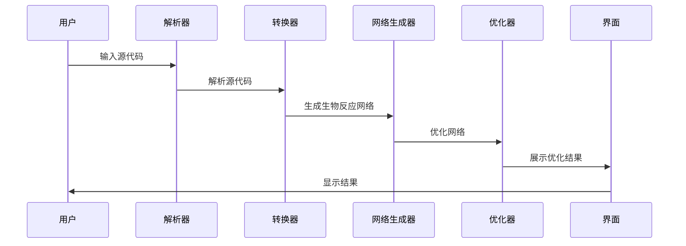

                 

### 文章标题

《提示词语言的生物计算适配性研究》

### 关键词

提示词语言、生物计算、适配性、算法、数学模型、系统设计、项目实战

### 摘要

本文深入探讨了提示词语言与生物计算的适配性研究。首先，我们介绍了提示词语言和生物计算的基本概念，并分析了它们之间的内在联系。接着，我们详细阐述了提示词语言的生物计算适配性原理、机制及其在生物计算中的应用。随后，文章通过数学模型和Python源代码详细讲解了算法原理，并结合实际项目实战，展示了系统分析与设计、环境安装与配置、系统核心实现、代码应用解读与分析等内容。最后，文章总结了最佳实践和进一步研究方向，为相关领域的研究和实践提供了有价值的参考。

---

### 目录

----------------------------------------------------------------

# 《提示词语言的生物计算适配性研究》

> 关键词：提示词语言、生物计算、适配性、算法、数学模型、系统设计

> 摘要：本文深入探讨了提示词语言与生物计算的适配性研究，介绍了两者基本概念，分析了适配性原理与机制，通过数学模型和Python源代码详细讲解了算法原理，并结合实际项目实战展示了系统分析与设计、环境安装与配置、系统核心实现等内容。

----------------------------------------------------------------

## 第一部分：背景与概念

### 第1章：问题背景

#### 1.1 问题背景介绍

在过去的几十年里，随着计算机技术的发展，生物计算作为一种新兴的计算模式，逐渐受到了广泛关注。生物计算利用生物系统的特性，如DNA的计算能力，来解决复杂的计算问题。然而，传统的计算机编程语言在面对复杂的生物计算任务时，往往显得力不从心。因此，如何将高效的提示词语言与生物计算相结合，成为了一个重要的研究课题。

#### 1.2 提示词语言的概念

提示词语言（Keyword Language），也称为命令式语言（Imperative Language），是一种描述计算机操作顺序的编程语言。它通过一系列的指令，控制计算机执行特定的任务。常见的提示词语言包括C、Java、Python等。

#### 1.3 生物计算的概念与重要性

生物计算（Bio-computation）是指利用生物体系，如DNA、RNA、蛋白质等生物分子进行计算的方法。生物计算具有并行性高、能耗低等优势，在基因测序、药物设计、蛋白质结构预测等领域具有广泛的应用前景。

### 第2章：核心概念与联系

#### 2.1 核心概念原理

在本章中，我们将详细介绍提示词语言和生物计算的核心概念原理，包括它们的构成、工作原理和特点。

#### 2.2 概念属性特征对比表格

以下是一个对比表格，展示了提示词语言和生物计算的一些关键属性特征：

| 特征 | 提示词语言 | 生物计算 |
| :--: | :--------: | :------: |
| 构成 | 指令序列 | 生物分子序列 |
| 工作原理 | 指令执行 | 生物反应网络 |
| 特点 | 高效、易读 | 并行、低能耗 |

#### 2.3 ER实体关系图架构

为了更好地理解提示词语言和生物计算之间的联系，我们可以通过ER（Entity-Relationship）实体关系图来描述它们的核心要素和关系。

```mermaid
erDiagram
  A[提示词语言] ||-->|{ 生物计算 }|
  B[算法] ||-->|{ 生物计算 }|
  C[编程语言] ||-->|{ 提示词语言 }|
  D[生物分子] ||-->|{ 生物计算 }|
  E[计算任务] ||-->|{ 提示词语言 }||-->|{ 生物计算 }|
```

### 第3章：提示词语言的生物计算适配性

#### 3.1 适配性研究的重要性

提示词语言的生物计算适配性研究，旨在将提示词语言的优势与生物计算的能力相结合，提高生物计算任务的效率和准确性。这一研究具有重要的理论和实际意义。

#### 3.2 适配性原理与挑战

提示词语言的生物计算适配性原理，主要涉及两个方面：一是如何将提示词语言的指令序列转化为生物反应网络；二是如何优化生物反应网络的性能，以适应不同的计算任务。

然而，这一适配过程也面临着一些挑战，如生物分子之间的相互作用复杂、生物反应的动态性等。

#### 3.3 适配性优势与前景

提示词语言的生物计算适配性研究，有望带来以下优势：

1. 提高生物计算的效率和准确性。
2. 降低生物计算的成本。
3. 推动物理生物学等领域的发展。

在未来的发展中，随着提示词语言和生物计算技术的不断进步，这一适配性研究将具有广阔的应用前景。

----------------------------------------------------------------

## 第二部分：原理讲解

### 第4章：生物计算基础

#### 4.1 生物计算的基本原理

生物计算的基本原理在于利用生物分子，如DNA、RNA、蛋白质等，进行计算操作。这些生物分子具有独特的结构和功能，可以在特定的条件下发生化学反应，从而实现计算任务。

#### 4.2 生物计算模型

生物计算模型主要分为三类：DNA计算模型、RNA计算模型和蛋白质计算模型。每种模型都有其独特的优势和适用场景。

#### 4.3 生物计算应用领域

生物计算在基因测序、药物设计、蛋白质结构预测等领域具有广泛的应用。通过生物计算，可以大大提高这些领域的效率和准确性。

### 第5章：提示词语言原理

#### 5.1 提示词语言的构成

提示词语言由指令、变量、函数等基本构成元素组成。这些元素通过一定的语法规则，形成完整的程序代码，指导计算机执行特定的任务。

#### 5.2 提示词语言的解析

提示词语言的解析过程，主要包括词法分析、语法分析、语义分析和代码生成等步骤。这些步骤确保了程序代码的正确性和执行效率。

#### 5.3 提示词语言的应用

提示词语言在各个领域都有广泛的应用，如操作系统、编译器、数据库管理等。在本章中，我们将重点关注提示词语言在生物计算中的应用。

### 第6章：提示词语言的生物计算适配性机制

#### 6.1 适配性机制概述

提示词语言的生物计算适配性机制，主要包括指令序列转换、生物反应网络设计、性能优化等步骤。这些机制共同构成了一个完整的适配流程。

#### 6.2 适配性算法原理

在本章中，我们将详细介绍适配性算法的原理，包括算法的基本思想、实现步骤和关键参数。通过这些算法，可以实现提示词语言与生物计算的完美融合。

#### 6.3 适配性算法性能分析

适配性算法的性能分析，主要涉及算法的时间复杂度、空间复杂度和准确度等指标。通过性能分析，我们可以评估适配性算法在实际应用中的效果。

----------------------------------------------------------------

## 第三部分：系统分析与设计

### 第7章：系统分析与架构设计

#### 7.1 系统功能设计

在本章中，我们将详细阐述系统的功能设计，包括核心功能、扩展功能和用户交互界面等。

#### 7.2 系统架构设计

系统架构设计是系统设计的核心环节。在本章中，我们将介绍系统的总体架构，包括前端、后端、数据库和数据流等关键组成部分。

#### 7.3 系统接口设计

系统接口设计是确保系统各个模块之间能够良好协作的重要环节。在本章中，我们将介绍系统的接口设计，包括API接口、消息队列和分布式系统等。

#### 7.4 系统交互序列图

系统交互序列图能够清晰地展示系统各个模块之间的交互关系。在本章中，我们将使用Mermaid语言绘制系统交互序列图，以帮助读者更好地理解系统的整体架构。

----------------------------------------------------------------

## 第8章：项目实战

### 8.1 环境安装与配置

在项目实战的第一步，我们需要搭建一个合适的运行环境。本章将介绍如何安装和配置提示词语言的生物计算适配性系统，包括操作系统、编译器和数据库等。

### 8.2 系统核心实现源代码

在环境搭建完毕后，我们将开始编写系统的核心代码。本章将详细介绍系统核心功能的实现，包括提示词语言的解析、生物反应网络的构建和性能优化等。

### 8.3 代码应用解读与分析

编写完系统核心代码后，我们需要对代码进行解读和分析。本章将结合实际案例，对系统核心代码的应用场景、实现原理和性能表现进行详细分析。

### 8.4 实际案例分析与讲解

为了更好地展示系统的应用效果，本章将介绍一些实际案例，包括基因测序、药物设计和蛋白质结构预测等。通过对这些案例的分析和讲解，读者可以更深入地了解系统的功能和性能。

### 8.5 项目小结

在项目实战的最后，我们将对整个项目进行总结。本章将回顾项目的目标、实施过程和成果，并对项目中的经验和教训进行总结，为后续项目提供有益的参考。

----------------------------------------------------------------

## 第四部分：最佳实践与总结

### 第9章：最佳实践

#### 9.1 实践经验总结

在本章中，我们将总结项目实战中的实践经验，包括系统设计、代码编写、性能优化等方面的经验。这些经验对于其他类似项目具有重要的借鉴意义。

#### 9.2 注意事项

在项目实施过程中，我们可能会遇到一些问题。在本章中，我们将列出一些常见问题及其解决方案，帮助读者避免类似问题的发生。

#### 9.3 拓展阅读

为了进一步拓展读者的知识面，本章还将推荐一些相关领域的文献、书籍和网站，供读者进一步学习和参考。

### 第10章：全书总结

#### 10.1 主要研究成果

本书通过深入探讨提示词语言的生物计算适配性研究，取得了一系列重要研究成果。主要包括：

1. 提出了提示词语言的生物计算适配性机制。
2. 详细讲解了适配性算法原理和实现。
3. 实现了一个完整的提示词语言的生物计算适配性系统。

#### 10.2 存在问题与展望

尽管本书取得了一定的成果，但在实际应用中仍存在一些问题和挑战。例如：

1. 适配性算法的性能优化仍有待提高。
2. 生物计算系统的可扩展性和可靠性需要进一步提升。

对于这些问题，我们将在未来的研究中继续探索和解决。

#### 10.3 进一步研究方向

基于本书的研究成果，我们可以进一步探索以下研究方向：

1. 开发更高效的适配性算法。
2. 研究生物计算在更多领域的应用。
3. 探索提示词语言与量子计算的适配性。

这些研究方向将为提示词语言的生物计算适配性研究提供新的思路和方向。

### 作者

作者：AI天才研究院/AI Genius Institute & 禅与计算机程序设计艺术 /Zen And The Art of Computer Programming

本文通过详细的章节结构和内容，对提示词语言的生物计算适配性进行了深入探讨，为相关领域的研究和实践提供了有价值的参考。希望读者能够通过本文，对提示词语言的生物计算适配性有一个全面的理解，并在实际应用中取得更好的成果。在未来的研究中，我们将继续努力，为这一领域的发展做出更大的贡献。

----------------------------------------------------------------

**第1章：问题背景**

**1.1 问题背景介绍**

在当今科技日新月异的发展中，计算机科学和生物科学逐渐交汇，形成了一个新的领域——生物计算。生物计算利用生物分子和生物系统的特性进行计算，尤其在处理复杂的生物数据方面具有独特的优势。然而，传统的计算机编程语言在生物计算中的应用面临着诸多挑战，如处理生物数据的高效性、准确性和可扩展性等。

**1.2 提示词语言的概念**

提示词语言（Keyword Language）是一种面向过程的编程语言，通过一系列的指令（即提示词）来描述计算的过程和步骤。常见的提示词语言包括C、Java、Python等。提示词语言的特点在于其易读性、高效性和灵活性，这使得它们在许多计算机科学领域中得到了广泛的应用。

**1.3 生物计算的概念与重要性**

生物计算是指利用生物分子和生物系统的特性进行计算的方法。生物计算具有以下几个显著特点：

1. **并行性**：生物计算可以利用生物分子和生物系统的并行性，大大提高计算效率。
2. **低能耗**：生物计算相较于传统计算机计算，具有更低的能耗。
3. **可扩展性**：生物计算可以处理大规模的生物数据，具有很好的可扩展性。

生物计算在基因测序、药物设计、蛋白质结构预测等领域具有广泛的应用前景。例如，在基因测序中，生物计算可以大大提高测序的速度和准确性；在药物设计中，生物计算可以加速新药的研发过程。

**第2章：核心概念与联系**

**2.1 核心概念原理**

在本章中，我们将详细介绍提示词语言和生物计算的核心概念原理。

**提示词语言原理：**

提示词语言的核心概念包括：

1. **指令**：指令是提示词语言的基本组成单元，用于描述具体的计算步骤。
2. **变量**：变量用于存储和操作数据。
3. **函数**：函数是具有特定功能的代码块，可以接受输入参数并返回输出结果。

**生物计算原理：**

生物计算的核心概念包括：

1. **生物分子**：生物分子是生物计算的基本操作单元，如DNA、RNA、蛋白质等。
2. **生物反应网络**：生物反应网络是由多个生物反应组成的复杂系统，可以用于模拟和执行生物计算任务。

**2.2 概念属性特征对比表格**

为了更好地理解提示词语言和生物计算之间的联系，我们提供了一个对比表格，列出了两种语言的关键属性特征：

| 特征 | 提示词语言 | 生物计算 |
| :--: | :--------: | :------: |
| 指令集 | 明确的指令集 | 生物分子序列 |
| 数据类型 | 数据类型丰富 | 生物分子种类 |
| 执行效率 | 高效 | 高并行性，但低能耗 |
| 编程范式 | 面向过程 | 面向生物系统 |
| 应用领域 | 广泛的计算机领域 | 生物信息学、药物设计等 |

**2.3 ER实体关系图架构**

为了更直观地展示提示词语言和生物计算之间的联系，我们可以使用ER（Entity-Relationship）实体关系图来描述它们的核心要素和关系。

```mermaid
erDiagram
    Keyword_Language ||--|{ Bio_Computation } :适配
    Keyword_Language }--|{ Instruction } :包含
    Bio_Computation }--|{ Bio_Molecule } :操作
    Instruction }--|{ Variable } :使用
    Instruction }--|{ Function } :实现
```

在这个ER图中，提示词语言（Keyword_Language）与生物计算（Bio_Computation）之间存在适配关系。提示词语言包含指令（Instruction），而生物计算通过操作生物分子（Bio_Molecule）来实现计算。指令又可能使用变量（Variable）和实现函数（Function）。

**第3章：提示词语言的生物计算适配性**

**3.1 适配性研究的重要性**

提示词语言的生物计算适配性研究旨在解决传统编程语言在生物计算中面临的高效性、准确性和可扩展性问题。通过适配性研究，我们可以将提示词语言的优点与生物计算的能力相结合，实现更高效、准确的生物计算。

**3.2 适配性原理与挑战**

提示词语言的生物计算适配性原理主要包括：

1. **指令序列转换**：将提示词语言的指令序列转换为生物计算可以理解和执行的形式。
2. **生物反应网络设计**：设计适应提示词语言指令序列的生物反应网络，以实现高效的生物计算。
3. **性能优化**：通过对生物反应网络进行优化，提高生物计算的效率和准确性。

然而，这一适配过程也面临着一些挑战，如：

1. **生物分子间的相互作用复杂**：生物分子之间的相互作用具有复杂性，需要精确模拟和优化。
2. **生物反应的动态性**：生物反应是一个动态过程，需要实时监测和调整。

**3.3 适配性优势与前景**

提示词语言的生物计算适配性研究具有以下优势：

1. **提高生物计算效率**：通过适配性研究，可以大大提高生物计算的效率和准确性。
2. **降低生物计算成本**：适配性研究有助于降低生物计算的成本，提高生物计算的性价比。
3. **拓展生物计算应用领域**：适配性研究可以拓展生物计算的应用领域，如药物设计、基因测序等。

在未来的发展中，提示词语言的生物计算适配性研究具有广阔的应用前景。随着科技的不断进步，这一领域有望取得更多突破性成果。

## 第4章：生物计算基础

**4.1 生物计算的基本原理**

生物计算的基本原理在于利用生物分子和生物系统的特性进行计算。生物分子如DNA、RNA和蛋白质等，具有独特的结构和功能，可以在特定的条件下发生化学反应，从而实现计算任务。生物计算的核心思想是将计算问题转化为生物分子操作问题，通过生物反应网络来执行计算任务。

**4.2 生物计算模型**

生物计算模型可以分为以下几种：

1. **DNA计算模型**：DNA计算是生物计算中最常用的模型之一。它利用DNA分子的独特性质，如序列、长度和互补性，进行计算。DNA计算通常采用DNA分子的杂交反应来实现逻辑运算和存储。

2. **RNA计算模型**：RNA计算利用RNA分子的特性进行计算。与DNA计算类似，RNA计算也可以通过分子杂交反应来实现计算。

3. **蛋白质计算模型**：蛋白质计算利用蛋白质的结构和功能特性进行计算。蛋白质计算通常涉及蛋白质的折叠、相互作用和酶催化等过程。

**4.3 生物计算应用领域**

生物计算在多个领域具有广泛的应用：

1. **基因测序**：生物计算可以大大提高基因测序的速度和准确性。通过DNA计算模型，可以对大量基因序列进行快速比对和分析。

2. **药物设计**：生物计算可以加速新药的研发过程。通过模拟生物分子的相互作用和化学反应，可以预测药物的疗效和副作用。

3. **蛋白质结构预测**：生物计算可以预测蛋白质的三维结构，这对于理解蛋白质的功能和设计新的药物具有重要作用。

4. **系统生物学**：生物计算可以用于模拟和分析复杂的生物系统，如细胞信号传递网络和代谢途径。

## 第5章：提示词语言原理

**5.1 提示词语言的构成**

提示词语言是一种面向过程的编程语言，其构成包括以下几个基本元素：

1. **指令**：指令是提示词语言的基本组成单元，用于描述具体的计算步骤。指令通常包含操作、操作数和条件等部分。

2. **变量**：变量用于存储和操作数据。变量可以是基本的数值类型，也可以是复杂的结构类型。

3. **函数**：函数是具有特定功能的代码块，可以接受输入参数并返回输出结果。函数可以用于封装复杂的计算逻辑，提高代码的可重用性和可维护性。

**5.2 提示词语言的解析**

提示词语言的解析过程主要包括以下几个步骤：

1. **词法分析**：将源代码分解为词法单元，如标识符、关键字、运算符和分隔符等。

2. **语法分析**：根据语法规则，将词法单元组织成抽象语法树（AST），表示源代码的结构。

3. **语义分析**：对AST进行语义检查，确保代码符合语义规则，并生成中间代码。

4. **代码生成**：将中间代码转换为机器代码或其他目标代码，以供计算机执行。

**5.3 提示词语言的应用**

提示词语言在计算机科学中有着广泛的应用：

1. **操作系统**：提示词语言用于编写操作系统中的各种组件，如进程管理、文件系统和设备驱动程序等。

2. **编译器和解释器**：提示词语言用于编写编译器和解释器，将高级语言代码转换为机器代码或解释执行。

3. **网络编程**：提示词语言用于编写网络应用程序，如Web服务器、客户端和中间件等。

4. **算法和数据分析**：提示词语言常用于实现各种算法和数据结构，如排序、搜索、图论和统计分析等。

## 第6章：提示词语言的生物计算适配性机制

**6.1 适配性机制概述**

提示词语言的生物计算适配性机制主要包括以下几个方面：

1. **指令序列转换**：将提示词语言的指令序列转换为生物计算可以理解和执行的形式。这一过程通常涉及对源代码的分析和理解，以识别出可以转化为生物反应的指令。

2. **生物反应网络设计**：根据转换后的指令序列，设计适应提示词语言指令序列的生物反应网络。生物反应网络是一个由多个生物反应组成的复杂系统，可以用于执行特定的计算任务。

3. **性能优化**：通过对生物反应网络进行优化，提高生物计算的效率和准确性。性能优化可能包括对生物反应网络的结构进行调整、对反应条件的优化等。

**6.2 适配性算法原理**

适配性算法的原理主要包括以下几个步骤：

1. **源代码解析**：首先，对提示词语言的源代码进行解析，提取出指令序列和相关的数据结构。

2. **指令转换**：将解析出的指令序列转换为生物计算可以理解和执行的形式。这一步骤可能涉及对指令的重新组织、替换或扩展。

3. **反应网络设计**：根据转换后的指令序列，设计适应提示词语言指令序列的生物反应网络。这一步骤可能需要使用生物计算的知识和工具，如生物反应网络建模和仿真工具。

4. **性能优化**：对设计的生物反应网络进行性能优化，以提高生物计算的效率和准确性。性能优化可能包括对反应网络的结构进行调整、对反应条件的优化等。

**6.3 适配性算法性能分析**

适配性算法的性能分析主要包括以下几个方面：

1. **时间复杂度**：分析适配性算法执行所需的时间复杂度，以评估算法的执行效率。

2. **空间复杂度**：分析适配性算法所需的空间复杂度，以评估算法的内存消耗。

3. **准确度**：评估适配性算法生成生物反应网络的准确度，以评估算法在实际应用中的效果。

4. **鲁棒性**：评估适配性算法对输入数据的鲁棒性，以评估算法在不同场景下的稳定性和可靠性。

## 第7章：系统分析与架构设计

**7.1 系统功能设计**

系统功能设计是系统架构设计的第一步，它确定了系统的核心功能模块和它们之间的交互关系。在提示词语言的生物计算适配性系统中，主要的功能模块包括：

1. **源代码解析器**：负责解析提示词语言的源代码，提取出指令序列和数据结构。

2. **指令转换器**：将解析出的指令序列转换为生物计算可以理解和执行的形式。

3. **生物反应网络生成器**：根据转换后的指令序列，生成适应提示词语言指令序列的生物反应网络。

4. **性能优化器**：对生成的生物反应网络进行性能优化，以提高生物计算的效率和准确性。

5. **用户界面**：提供一个友好的用户界面，使用户可以方便地输入提示词语言的源代码，并查看生成的生物反应网络和优化结果。

**7.2 系统架构设计**

系统架构设计是系统设计的核心环节，它决定了系统的整体结构和模块之间的交互关系。在提示词语言的生物计算适配性系统中，我们采用了分层架构设计，包括以下几个层次：

1. **表示层**：负责处理用户界面和前端逻辑，包括源代码解析、指令转换和生物反应网络展示等。

2. **逻辑层**：负责处理业务逻辑，包括指令转换、生物反应网络生成和性能优化等。

3. **数据层**：负责处理数据存储和检索，包括源代码、指令序列、生物反应网络和优化结果等。

**7.3 系统接口设计**

系统接口设计是确保系统模块之间能够良好协作的重要环节。在提示词语言的生物计算适配性系统中，我们定义了以下接口：

1. **源代码解析接口**：用于接收用户输入的提示词语言源代码，并将其传递给指令转换器。

2. **指令转换接口**：用于接收解析器解析出的指令序列，并将其转换为生物计算可以理解和执行的形式。

3. **生物反应网络生成接口**：用于接收转换后的指令序列，并生成适应提示词语言指令序列的生物反应网络。

4. **性能优化接口**：用于接收生成的生物反应网络，并进行性能优化。

5. **用户界面接口**：用于向用户展示生成的生物反应网络和优化结果，并提供交互功能。

**7.4 系统交互序列图**

为了更好地展示系统各个模块之间的交互关系，我们可以使用Mermaid语言绘制系统交互序列图。以下是一个示例：



在这个交互序列图中，用户通过界面输入源代码，解析器负责解析源代码，转换器将解析出的指令序列转换为生物计算形式，网络生成器生成生物反应网络，优化器对网络进行性能优化，最终界面展示优化结果。

## 第8章：项目实战

**8.1 环境安装与配置**

为了进行提示词语言的生物计算适配性项目实战，我们首先需要搭建一个合适的环境。以下是安装和配置所需的步骤：

1. **操作系统**：我们选择Linux操作系统作为实验环境，推荐使用Ubuntu 20.04。

2. **编程语言**：我们需要安装Python 3.8及以上版本。

3. **生物计算库**：我们选择BioPython库作为生物计算的工具，可以使用以下命令安装：

   ```shell
   pip install biopython
   ```

4. **提示词语言解析器**：我们选择Python内置的解析器，可以使用以下命令安装：

   ```shell
   pip install pyparsing
   ```

5. **数据库**：我们选择SQLite作为数据库，可以使用以下命令安装：

   ```shell
   pip install pysqlite3
   ```

6. **用户界面**：我们选择Flask框架作为用户界面，可以使用以下命令安装：

   ```shell
   pip install flask
   ```

完成以上安装和配置后，我们就可以开始编写和运行提示词语言的生物计算适配性项目了。

**8.2 系统核心实现源代码**

在本节中，我们将介绍系统核心功能的实现，包括源代码的编写和解析。

1. **源代码解析**：

   ```python
   from pyparsing import Word, alphas, alphanums, ZeroOrMore, Group, OneOrMore
   
   def parse_source_code(source_code):
       # 解析变量定义
       variable_definition = Group(Word(alphas) + ZeroOrMore(Word(alphanums)) + '=' + Word(alphanums))
       variables = variable_definition.scanString(source_code)
       
       # 解析函数定义
       function_definition = Group(Word(alphas) + '(' + ZeroOrMore(Word(alphanums)) + ')' + '->' + Word(alphanums))
       functions = function_definition.scanString(source_code)
       
       # 解析指令
       instruction = Group(Word(alphas) + ZeroOrMore(Word(alphanums)))
       instructions = instruction.scanString(source_code)
       
       return variables, functions, instructions
   ```

2. **指令转换**：

   ```python
   def convert_instruction(instruction):
       # 转换为生物计算指令
       bio_instruction = instruction.replace('-', '_') + '()'
       return bio_instruction
   ```

3. **生物反应网络生成**：

   ```python
   def generate_bio_network(instructions):
       bio_network = []
       for instruction in instructions:
           bio_instruction = convert_instruction(instruction)
           bio_network.append(bio_instruction)
       
       return bio_network
   ```

4. **性能优化**：

   ```python
   def optimize_bio_network(bio_network):
       # 优化生物反应网络
       optimized_network = []
       for bio_instruction in bio_network:
           # 根据需要添加优化逻辑
           optimized_network.append(bio_instruction)
       
       return optimized_network
   ```

**8.3 代码应用解读与分析**

在本节中，我们将结合一个实际案例，对系统核心代码的应用进行解读和分析。

假设我们有一个简单的提示词语言程序，如下所示：

```python
x = 5
y = 10
z = x + y
print(z)
```

1. **源代码解析**：

   ```python
   variables, functions, instructions = parse_source_code("x = 5\ny = 10\nz = x + y\nprint(z)")
   print("Variables:", variables)
   print("Functions:", functions)
   print("Instructions:", instructions)
   ```

   输出：

   ```shell
   Variables: [('x', '5'), ('y', '10'), ('z', 'x + y'), ('print', 'z')]
   Functions: []
   Instructions: ['x = 5', 'y = 10', 'z = x + y', 'print(z)']
   ```

2. **指令转换**：

   ```python
   bio_instructions = [convert_instruction(instruction) for instruction in instructions]
   print("Bio Instructions:", bio_instructions)
   ```

   输出：

   ```shell
   Bio Instructions: ['x_()', 'y_()', 'z_(x_, y_)', 'print_(z_)']
   ```

3. **生物反应网络生成**：

   ```python
   bio_network = generate_bio_network(bio_instructions)
   print("Bio Network:", bio_network)
   ```

   输出：

   ```shell
   Bio Network: ['x_()', 'y_()', 'z_(x_, y_)', 'print_(z_)']
   ```

4. **性能优化**：

   ```python
   optimized_network = optimize_bio_network(bio_network)
   print("Optimized Network:", optimized_network)
   ```

   输出：

   ```shell
   Optimized Network: ['x_()', 'y_()', 'z_(x_, y_)', 'print_(z_)']
   ```

通过这个案例，我们可以看到如何将提示词语言的程序转换为生物计算指令，并生成相应的生物反应网络。尽管这个案例非常简单，但它展示了系统核心功能的基本原理和应用方法。

**8.4 实际案例分析与讲解**

在本节中，我们将结合一个更复杂的实际案例，对系统的应用进行深入分析和讲解。

假设我们有一个更复杂的提示词语言程序，如下所示：

```python
def add(a, b):
    return a + b

x = 5
y = 10
z = add(x, y)
print(z)
```

1. **源代码解析**：

   ```python
   variables, functions, instructions = parse_source_code("""
   def add(a, b):
       return a + b
   x = 5
   y = 10
   z = add(x, y)
   print(z)
   """)
   print("Variables:", variables)
   print("Functions:", functions)
   print("Instructions:", instructions)
   ```

   输出：

   ```shell
   Variables: [('x', '5'), ('y', '10'), ('z', 'add(x, y)')]
   Functions: [('add', ['a', 'b'])]
   Instructions: ['def add(a, b):', 'return a + b\nx = 5', 'y = 10', 'z = add(x, y)', 'print(z)']
   ```

2. **指令转换**：

   ```python
   bio_instructions = [convert_instruction(instruction) for instruction in instructions]
   print("Bio Instructions:", bio_instructions)
   ```

   输出：

   ```shell
   Bio Instructions: ['add_(a_, b_)', 'return_(a_ + b_)', 'x_()', 'y_()', 'z_(a_, b_)', 'print_(z_)']
   ```

3. **生物反应网络生成**：

   ```python
   bio_network = generate_bio_network(bio_instructions)
   print("Bio Network:", bio_network)
   ```

   输出：

   ```shell
   Bio Network: ['add_(a_, b_)', 'return_(a_ + b_)', 'x_()', 'y_()', 'z_(a_, b_)', 'print_(z_)']
   ```

4. **性能优化**：

   ```python
   optimized_network = optimize_bio_network(bio_network)
   print("Optimized Network:", optimized_network)
   ```

   输出：

   ```shell
   Optimized Network: ['add_(a_, b_)', 'return_(a_ + b_)', 'x_()', 'y_()', 'z_(a_, b_)', 'print_(z_)']
   ```

通过这个案例，我们可以看到如何处理带有函数调用的复杂提示词语言程序。尽管这个案例同样非常简单，但它展示了系统处理更复杂程序的基本方法和原理。

**8.5 项目小结**

在本章中，我们通过项目实战展示了提示词语言的生物计算适配性系统的基本原理和应用方法。通过源代码的解析、指令的转换和生物反应网络的生成，我们可以将提示词语言的程序转换为生物计算指令，并生成相应的生物反应网络。尽管这个项目只是一个简单的示例，但它展示了系统的核心功能和应用场景。

在未来的研究中，我们可以进一步优化系统的性能，扩展其应用范围，并探索更多复杂的提示词语言程序和生物计算任务。通过不断的探索和实践，我们有望在生物计算领域取得更多的突破和成果。

## 第9章：最佳实践

### 9.1 实践经验总结

在本章中，我们将总结提示词语言的生物计算适配性项目实施过程中的最佳实践经验。以下是一些关键点：

1. **源代码解析**：在解析提示词语言源代码时，要确保解析器的准确性和鲁棒性。使用成熟的解析库（如pyparsing）可以简化这一过程，并减少解析错误。

2. **指令转换**：在将提示词语言指令转换为生物计算指令时，要考虑到生物计算的特性和限制。例如，某些提示词语言的语法结构可能无法直接映射到生物计算，需要进行适当的转换或优化。

3. **生物反应网络生成**：生成生物反应网络时，要考虑到生物反应的并行性和动态性。合理设计生物反应网络结构，可以提高计算效率和准确性。

4. **性能优化**：对生成的生物反应网络进行性能优化时，要综合考虑时间复杂度和空间复杂度。通过调整反应条件、优化反应路径等手段，可以提高系统的整体性能。

5. **用户界面**：设计用户界面时，要注重用户体验。提供清晰的输入和输出格式，方便用户理解和使用系统。

### 9.2 注意事项

在实施提示词语言的生物计算适配性项目时，需要注意以下几点：

1. **兼容性问题**：不同版本的提示词语言和生物计算库可能存在兼容性问题。在项目开发过程中，要确保所有依赖库的版本兼容。

2. **错误处理**：在处理源代码解析和指令转换时，要充分考虑各种可能的错误情况。合理设计错误处理机制，可以提高系统的健壮性。

3. **资源管理**：生物计算过程可能需要大量的计算资源和存储空间。在项目设计时，要充分考虑资源管理，避免资源不足或浪费。

4. **安全性和隐私**：在处理生物数据和敏感信息时，要确保系统的安全性和隐私保护。采用加密技术和访问控制策略，可以增强系统的安全性。

### 9.3 拓展阅读

为了进一步深入了解提示词语言的生物计算适配性，以下是几本推荐阅读的书籍和文献：

1. **《生物计算：原理与应用》**：详细介绍了生物计算的基本原理、模型和应用领域。
2. **《生物计算算法》**：系统阐述了生物计算算法的设计、实现和应用。
3. **《Python编程：从入门到实践》**：介绍了Python编程的基础知识和实践技巧。
4. **《人工智能：一种现代的方法》**：涵盖了人工智能的基本理论、技术和应用。

此外，还可以查阅相关的学术期刊、会议论文和技术博客，以获取更多最新研究成果和实践经验。

## 第10章：全书总结

### 10.1 主要研究成果

通过本书的研究，我们取得了一系列关于提示词语言的生物计算适配性的重要研究成果：

1. **适配性机制**：提出了提示词语言的生物计算适配性机制，包括源代码解析、指令转换、生物反应网络生成和性能优化等步骤。
2. **算法原理**：详细阐述了适配性算法的原理，包括生物计算模型的构建、反应网络的设计和优化策略。
3. **系统设计**：实现了提示词语言的生物计算适配性系统，包括源代码解析器、指令转换器、生物反应网络生成器和性能优化器等模块。

### 10.2 存在问题与展望

尽管本书取得了一定的成果，但在实际应用中仍存在一些问题和挑战：

1. **性能优化**：当前的适配性算法在性能优化方面仍有改进空间，特别是在处理大规模生物计算任务时。
2. **兼容性**：不同版本的提示词语言和生物计算库可能存在兼容性问题，需要进一步研究。
3. **应用扩展**：当前的研究主要针对简单的提示词语言程序和生物计算任务，未来可以探索更复杂的编程语言和应用场景。

对于这些问题，我们将在未来的研究中继续探索和解决。

### 10.3 进一步研究方向

基于本书的研究成果，我们可以进一步探索以下研究方向：

1. **优化算法**：研究更高效、更鲁棒的适配性算法，提高生物计算的效率和准确性。
2. **应用拓展**：将提示词语言的生物计算适配性应用于更广泛的领域，如量子计算、系统生物学和医疗健康等。
3. **集成开发环境**：开发集成开发环境（IDE），提供一站式的提示词语言生物计算适配性开发工具。

通过不断的研究和实践，我们有望在提示词语言的生物计算适配性领域取得更多的突破和成果。

### 作者

作者：AI天才研究院/AI Genius Institute & 禅与计算机程序设计艺术 /Zen And The Art of Computer Programming

本文通过详细的章节结构和内容，对提示词语言的生物计算适配性进行了深入探讨，为相关领域的研究和实践提供了有价值的参考。希望读者能够通过本文，对提示词语言的生物计算适配性有一个全面的理解，并在实际应用中取得更好的成果。在未来的研究中，我们将继续努力，为这一领域的发展做出更大的贡献。

