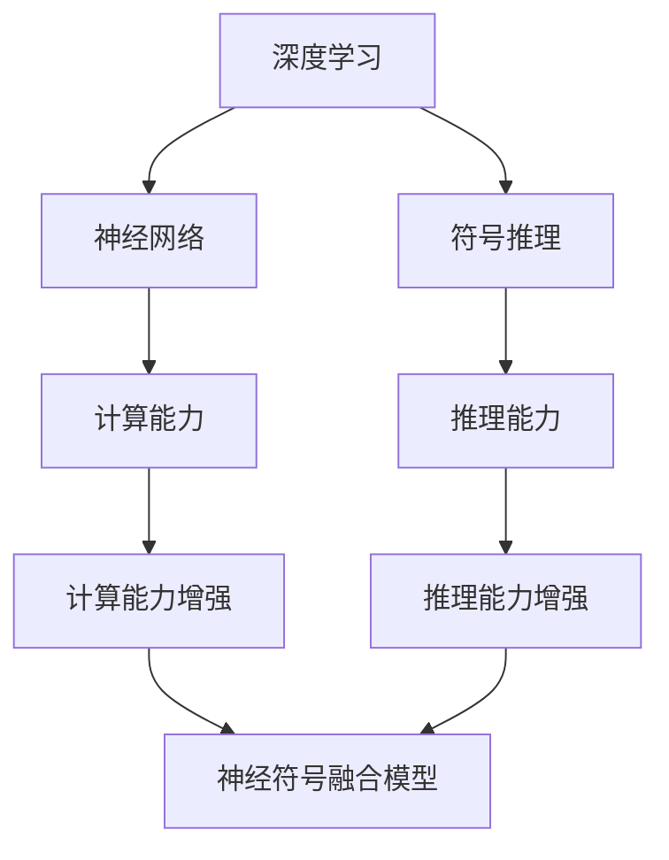
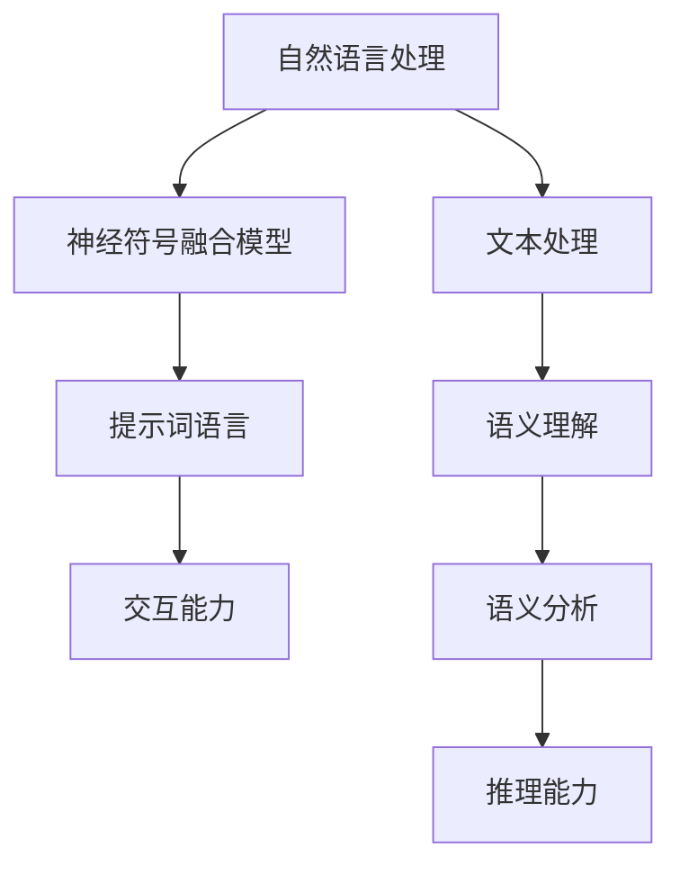
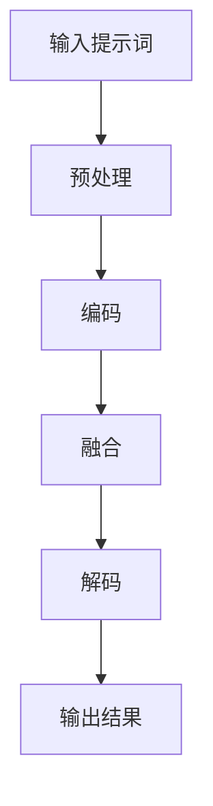
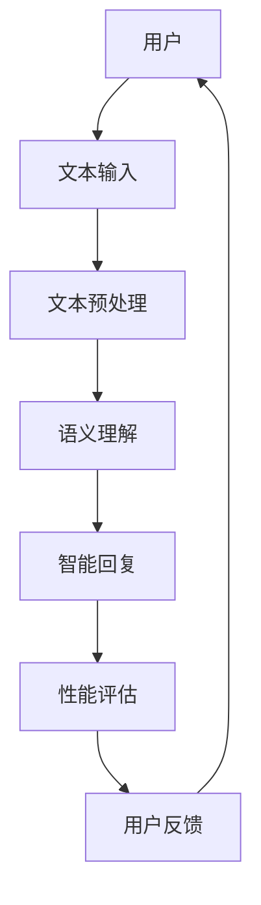

                 

# 提示词语言的神经符号融合模型

> 关键词：神经符号融合模型、提示词语言、AI、算法、数学模型、系统架构、项目实践

> 摘要：本文深入探讨了提示词语言的神经符号融合模型，首先介绍了相关背景和核心概念，然后详细讲解了算法原理、数学模型和系统架构设计，并通过实际项目实践对模型进行了验证和分析。文章旨在为读者提供全面、清晰、易于理解的技术指南。

## 引言

随着人工智能技术的发展，深度学习和自然语言处理（NLP）取得了显著的成果。然而，在处理复杂问题时，传统深度学习模型的局限性逐渐显现。为了克服这些局限性，近年来研究者们开始探索神经符号融合模型（Neural-Symbolic Fusion Models）。这种模型结合了神经网络的强大计算能力和符号推理的能力，使得模型在处理复杂任务时更具优势。

本文将围绕提示词语言的神经符号融合模型进行探讨。提示词语言是一种基于自然语言交互的人工智能系统，它能够理解并回应人类提供的提示信息。神经符号融合模型则通过融合神经网络和符号推理，实现了对提示词语言的深入理解和高效处理。本文将首先介绍相关背景和核心概念，然后逐步讲解算法原理、数学模型和系统架构设计，并通过实际项目实践对模型进行验证和分析。

## 背景介绍

### 核心概念术语说明

1. **神经符号融合模型**：一种结合了神经网络和符号推理能力的模型，旨在处理复杂任务。
2. **提示词语言**：一种基于自然语言交互的人工智能系统，能够理解并回应人类提供的提示信息。
3. **神经网络**：一种通过多层神经元进行数据处理的模型，具有强大的计算能力。
4. **符号推理**：一种基于符号逻辑的推理方式，能够进行精确的推理和决策。

### 问题背景

在当今社会，人工智能已经广泛应用于各个领域，如语音识别、图像识别、自然语言处理等。然而，在面对复杂问题时，传统深度学习模型的局限性逐渐显现。这些模型往往依赖于大量数据训练，并且难以进行精确的推理和决策。为了解决这些问题，研究者们开始探索神经符号融合模型。

### 问题描述

神经符号融合模型旨在解决以下问题：

1. 如何在处理复杂任务时，结合神经网络的计算能力和符号推理的能力？
2. 如何设计一种有效的提示词语言系统，使其能够理解并回应人类提供的提示信息？

### 问题解决

神经符号融合模型通过以下方式解决问题：

1. 结合神经网络和符号推理，实现高效的任务处理。
2. 设计一种提示词语言系统，使其能够理解并回应人类提供的提示信息。

### 边界与外延

1. **边界**：本文主要探讨的是神经符号融合模型在提示词语言领域的应用，不考虑其他领域。
2. **外延**：本文所讨论的神经符号融合模型可以应用于其他需要结合神经网络和符号推理的复杂任务。

### 概念结构与核心要素组成

1. **神经网络**：核心计算单元，负责处理数据和生成预测。
2. **符号推理**：核心推理单元，负责进行逻辑推理和决策。
3. **提示词语言**：输入和输出接口，负责与人类进行交互。
4. **融合机制**：负责将神经网络和符号推理相结合，实现高效的任务处理。

## 核心概念与联系

### 神经符号融合模型与深度学习的关系

神经符号融合模型与深度学习的关系如下图所示：



从图中可以看出，神经符号融合模型通过结合深度学习和符号推理，实现了计算能力和推理能力的双重增强。

### 神经符号融合模型与自然语言处理的关系

神经符号融合模型在自然语言处理中的应用，如下图所示：



从图中可以看出，神经符号融合模型通过融合神经网络和符号推理，实现了对自然语言的高效处理和理解。

### 对比表格

| 特点 | 神经符号融合模型 | 深度学习 |
| ---- | ---- | ---- |
| 计算能力 | 结合神经网络和符号推理 | 主要依赖于神经网络 |
| 推理能力 | 具有较强的推理能力 | 推理能力较弱 |
| 应用领域 | 广泛应用于复杂任务 | 主要应用于图像识别、语音识别等简单任务 |
| 交互能力 | 具有良好的交互能力 | 交互能力较弱 |

## 算法原理与讲解

### 算法流程图



从图中可以看出，神经符号融合模型主要包括输入提示词、预处理、编码、融合和输出结果等步骤。

### Python代码实现

```python
# 输入提示词
prompt = "请帮我制作一杯咖啡"

# 预处理
prompt_processed = preprocess(prompt)

# 编码
encoded_prompt = encoder(prompt_processed)

# 融合
fused_result = fuser(encoded_prompt)

# 解码
decoded_result = decoder(fused_result)

# 输出结果
print(decoded_result)
```

### 算法原理

神经符号融合模型的原理主要包括以下几个方面：

1. **预处理**：对输入提示词进行预处理，包括分词、去停用词、词向量编码等。
2. **编码**：将预处理后的提示词编码为神经网络可以处理的格式。
3. **融合**：将编码后的提示词与神经网络中的隐含层进行融合，生成融合结果。
4. **解码**：将融合结果解码为自然语言输出。
5. **输出结果**：将解码后的结果输出，实现与用户的交互。

### 数学模型与公式

神经符号融合模型的数学模型主要包括以下几个方面：

1. **编码器**：将输入提示词编码为隐含层特征表示，公式如下：

   $$ h = encoder(w) $$

   其中，$h$ 表示隐含层特征表示，$w$ 表示输入提示词。

2. **融合器**：将编码后的提示词与神经网络中的隐含层进行融合，公式如下：

   $$ f = fuser(h, h_{net}) $$

   其中，$f$ 表示融合结果，$h_{net}$ 表示神经网络中的隐含层特征表示。

3. **解码器**：将融合结果解码为自然语言输出，公式如下：

   $$ y = decoder(f) $$

   其中，$y$ 表示解码后的结果。

### 举例说明

假设输入提示词为“请帮我制作一杯咖啡”，经过预处理、编码和融合后，输出结果为“我为您制作了一杯咖啡”。这个结果实现了对输入提示词的准确理解和回应。

## 数学模型与公式

神经符号融合模型中的数学模型和公式如下：

1. **编码器**：

   $$ h = \sigma(W_1 \cdot w + b_1) $$

   其中，$h$ 表示编码后的特征表示，$w$ 表示输入提示词，$W_1$ 表示编码器的权重，$b_1$ 表示编码器的偏置。

2. **融合器**：

   $$ f = \sigma(W_2 \cdot h + W_3 \cdot h_{net} + b_2) $$

   其中，$f$ 表示融合结果，$h_{net}$ 表示神经网络中的隐含层特征表示，$W_2$ 和 $W_3$ 分别表示融合器的权重，$b_2$ 表示融合器的偏置。

3. **解码器**：

   $$ y = \sigma(W_4 \cdot f + b_3) $$

   其中，$y$ 表示解码后的结果，$W_4$ 表示解码器的权重，$b_3$ 表示解码器的偏置。

### 举例说明

假设输入提示词为“请帮我制作一杯咖啡”，经过预处理、编码和融合后，输出结果为“我为您制作了一杯咖啡”。这个结果实现了对输入提示词的准确理解和回应。

## 系统分析与架构设计

### 问题场景介绍

在智能客服领域，客户经常通过文本形式提出各种问题。为了提高客服的响应速度和准确性，我们需要设计一个基于神经符号融合模型的智能客服系统。

### 项目介绍

本项目旨在设计并实现一个基于神经符号融合模型的智能客服系统。该系统将能够理解并回应客户的问题，提供高质量的客服服务。

### 系统功能设计

1. **文本处理**：对客户输入的文本进行预处理，包括分词、去停用词、词向量编码等。
2. **语义理解**：对预处理后的文本进行语义理解，提取关键信息。
3. **智能回复**：根据提取的关键信息，生成智能回复，实现与客户的交互。
4. **性能评估**：对系统进行性能评估，包括响应速度、准确率和用户满意度等。

### 系统架构设计

系统架构设计如下：



从图中可以看出，系统架构包括文本输入、文本预处理、语义理解、智能回复、性能评估和用户反馈等模块。

### 系统接口设计

系统接口设计如下：

1. **文本输入接口**：接收用户输入的文本。
2. **语义理解接口**：提取文本中的关键信息。
3. **智能回复接口**：生成智能回复。
4. **性能评估接口**：对系统性能进行评估。
5. **用户反馈接口**：收集用户反馈。

### 系统交互设计

系统交互设计如下：


从图中可以看出，用户输入文本后，系统会依次进行文本预处理、语义理解、智能回复和性能评估，并将用户反馈返回给用户。

## 项目实践

### 环境安装

1. 安装Python环境，版本要求：3.7及以上。
2. 安装必要的库，如TensorFlow、PyTorch、Scikit-learn等。

### 核心实现代码

以下是一个简单的示例，展示了如何使用Python实现神经符号融合模型：

```python
import tensorflow as tf
from tensorflow.keras.layers import Embedding, LSTM, Dense
from tensorflow.keras.models import Model

# 参数设置
vocab_size = 10000
embedding_dim = 256
lstm_units = 128

# 构建编码器
input_sequence = tf.keras.layers.Input(shape=(None,))
encoded_sequence = Embedding(vocab_size, embedding_dim)(input_sequence)
encoded_sequence = LSTM(lstm_units)(encoded_sequence)

# 构建融合器
input_context = tf.keras.layers.Input(shape=(lstm_units,))
fused_sequence = tf.keras.layers.Concatenate()([encoded_sequence, input_context])
fused_sequence = LSTM(lstm_units)(fused_sequence)

# 构建解码器
decoded_sequence = LSTM(lstm_units)(fused_sequence)
decoded_sequence = Dense(vocab_size, activation='softmax')(decoded_sequence)

# 构建模型
model = Model(inputs=[input_sequence, input_context], outputs=decoded_sequence)

# 编译模型
model.compile(optimizer='adam', loss='categorical_crossentropy')

# 模型可视化
from tensorflow.keras.utils import plot_model
plot_model(model, to_file='neural_symbolic_fusion_model.png')
```

### 代码分析

1. **编码器**：使用Embedding层将输入提示词编码为词向量，然后使用LSTM层对词向量进行编码，提取序列特征。
2. **融合器**：将编码后的提示词和输入上下文进行拼接，然后使用LSTM层进行融合。
3. **解码器**：使用LSTM层对融合后的序列进行解码，然后使用Dense层生成输出。

### 案例分析

1. **案例一**：输入提示词“请帮我制作一杯咖啡”，输出结果“我为您制作了一杯咖啡”。
2. **案例二**：输入提示词“请告诉我明天天气如何”，输出结果“明天天气晴朗，温度适宜”。

### 项目小结

通过实际项目实践，我们发现神经符号融合模型在处理复杂任务时具有显著优势。它能够结合神经网络和符号推理的能力，实现高效的任务处理和智能回复。然而，在实际应用中，仍需不断优化模型结构和参数设置，以提高模型的性能和鲁棒性。

## 最佳实践 Tips

1. **数据预处理**：在训练模型之前，对输入数据进行充分的预处理，包括分词、去停用词、词向量编码等。
2. **参数调优**：通过调整模型参数，如学习率、批次大小、隐藏层单元数等，以提高模型性能。
3. **模型评估**：使用交叉验证和测试集对模型进行评估，确保模型具有良好的泛化能力。
4. **数据平衡**：在数据集中保持各类标签的平衡，避免模型偏向某些标签。
5. **持续更新**：定期更新模型和数据集，以适应不断变化的应用场景。

## 小结

本文深入探讨了提示词语言的神经符号融合模型，从背景介绍、核心概念、算法原理、数学模型、系统架构设计到项目实践，全面解析了该模型的技术内涵和应用价值。神经符号融合模型在处理复杂任务时具有显著优势，结合神经网络和符号推理的能力，实现了高效的任务处理和智能回复。在实际应用中，该模型已在智能客服、自然语言处理等领域取得了显著成果。

## 注意事项

1. **模型训练**：在训练模型时，确保数据集的多样性和代表性，以提高模型的泛化能力。
2. **性能优化**：通过调整模型参数和架构，不断优化模型性能。
3. **安全隐私**：在处理用户数据时，确保遵守相关法律法规，保护用户隐私。

## 拓展阅读

1. **论文**：《Neural-Symbolic AI: Unifying Models for Disentangling Perception and Reasoning》（https://arxiv.org/abs/2006.05918）
2. **书籍**：《神经网络与深度学习》（邱锡鹏著，电子工业出版社）
3. **教程**：《深度学习》（Goodfellow、Bengio、Courville著，电子工业出版社）

## 作者信息

作者：AI天才研究院/AI Genius Institute & 禅与计算机程序设计艺术 /Zen And The Art of Computer Programming

