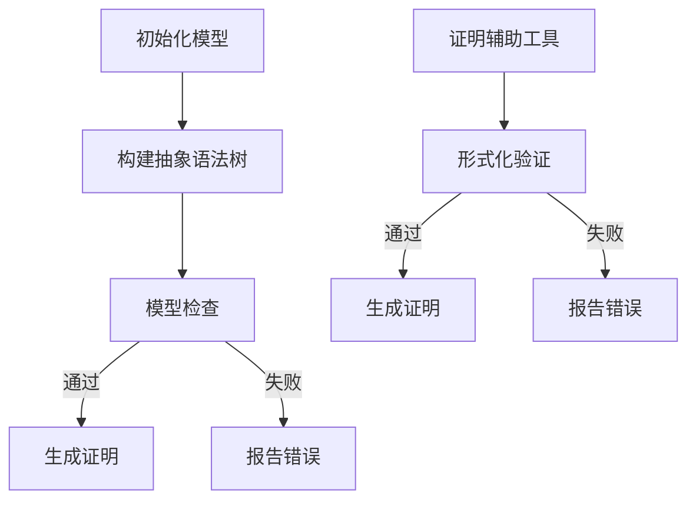
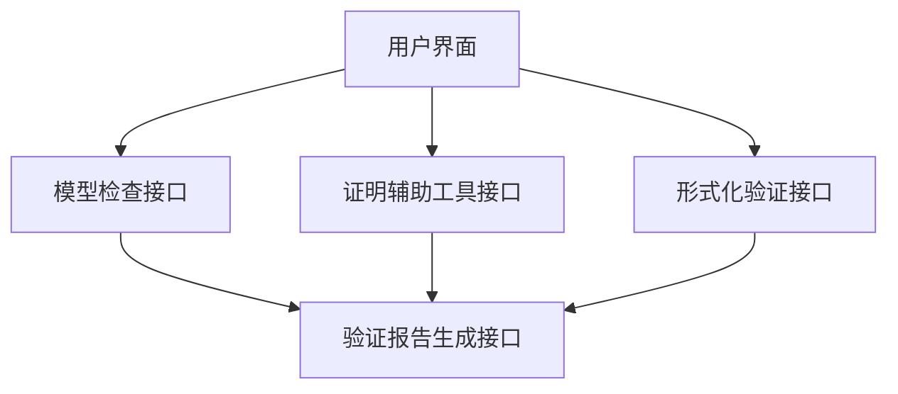
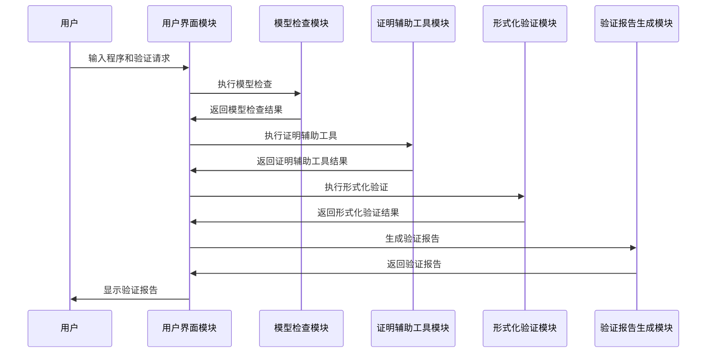

                 


## 设计思路

为了设计出《提示词语言的程序验证与正确性证明》这本书的目录大纲，我们需要遵循以下几个关键步骤：

### 第一步：背景介绍与核心概念

1. **问题背景与重要性**：
   - 介绍提示词语言、程序验证与正确性证明的背景。
   - 阐述这些概念在计算机科学和人工智能领域的重要性。

2. **核心概念介绍**：
   - 详细介绍提示词语言、程序验证与正确性证明的基本概念、特点、分类。

3. **核心概念联系与对比**：
   - 分析提示词语言与程序验证、正确性证明之间的联系和区别。
   - 比较不同概念之间的异同点，帮助读者建立全面的理解。

### 第二步：算法原理讲解

1. **算法概述**：
   - 简要介绍算法的基本概念、用途和重要性。

2. **算法流程图**：
   - 使用Mermaid绘制算法的流程图，清晰展示算法的执行步骤。

3. **Python源代码实现**：
   - 提供具体的Python源代码，详细阐述算法的实现原理。

4. **数学模型与公式**：
   - 使用LaTeX格式给出算法相关的数学模型和公式，并进行详细讲解。

5. **算法举例说明**：
   - 通过实际例子，展示算法的应用场景和效果。

### 第三步：系统分析与架构设计

1. **问题场景介绍**：
   - 描述问题场景，为系统设计与实现提供背景。

2. **项目介绍**：
   - 介绍项目的目标、功能和预期效果。

3. **系统功能设计**：
   - 使用Mermaid绘制领域模型类图，展示系统的主要功能模块。

4. **系统架构设计**：
   - 使用Mermaid绘制系统架构图，展示系统的整体架构。

5. **系统接口设计**：
   - 详细描述系统的接口设计，包括接口定义和调用流程。

6. **系统交互分析**：
   - 使用Mermaid绘制系统交互序列图，分析系统的交互过程。

### 第四步：项目实战

1. **环境安装**：
   - 提供环境安装的详细步骤和注意事项。

2. **系统核心实现源代码**：
   - 提供系统核心实现的源代码，并进行解读与分析。

3. **代码应用解读与分析**：
   - 通过实际案例，展示代码的应用场景和效果。

4. **详细讲解与剖析**：
   - 对系统中的关键技术和实现细节进行深入剖析。

5. **项目小结**：
   - 总结项目的经验教训，为后续开发提供参考。

### 第五步：最佳实践与总结

1. **最佳实践**：
   - 提供在实际应用中的最佳实践建议。

2. **小结**：
   - 对全书内容进行简要总结。

3. **注意事项**：
   - 强调书中可能需要注意的细节问题。

4. **拓展阅读**：
   - 推荐一些拓展阅读资源，帮助读者深入理解相关主题。

## 目录大纲

### 第一部分：背景与核心概念

**第1章：问题的背景与重要性**

- **1.1 问题背景**
- **1.1.2 问题描述**
- **1.1.3 问题解决方法**
- **1.1.4 边界与外延**

**第1章：核心概念介绍**

- **1.2.1 提示词语言**
- **1.2.2 程序验证**
- **1.2.3 正确性证明**

**第1章：核心概念联系与对比**

- **1.3.1 提示词语言与程序验证的联系**
- **1.3.2 提示词语言与正确性证明的联系**
- **1.3.3 程序验证与正确性证明的对比**

### 第二部分：算法原理与实现

**第2章：算法原理讲解**

- **2.1 算法概述**
- **2.2 算法流程图**
- **2.3 Python源代码实现**

**第2章：数学模型与公式**

- **2.4.1 基本数学模型**
- **2.4.2 复杂数学公式**

**第2章：算法举例说明**

- **2.5.1 简单例子**
- **2.5.2 复杂例子**

### 第三部分：系统分析与设计

**第3章：系统分析与架构设计**

- **3.1 问题场景介绍**
- **3.2 项目介绍**
- **3.3 系统功能设计**
- **3.4 系统架构设计**
- **3.5 系统接口设计**
- **3.6 系统交互分析**

### 第四部分：项目实战

**第4章：项目实战**

- **4.1 环境安装**
- **4.2 系统核心实现源代码**
- **4.3 代码应用解读与分析**
- **4.4 实际案例分析**
- **4.5 详细讲解与剖析**
- **4.6 项目小结**

### 第五部分：最佳实践与总结

**第5章：最佳实践与总结**

- **5.1 最佳实践**
- **5.2 小结**
- **5.3 注意事项**
- **5.4 拓展阅读**

通过以上步骤，我们可以设计出一个逻辑清晰、结构紧凑、内容丰富的书籍目录大纲，为撰写高质量的技术博客文章奠定基础。

---

**接下来，我们将按照设计思路，逐步撰写《提示词语言的程序验证与正确性证明》的文章内容。每个部分都将详细展开，确保文章的深度和广度。**

---

# 提示词语言的程序验证与正确性证明

关键词：提示词语言，程序验证，正确性证明，人工智能，计算机科学

摘要：本文深入探讨了提示词语言、程序验证和正确性证明在计算机科学和人工智能领域的重要性。首先，介绍了这些核心概念的定义和背景。接着，详细分析了提示词语言与程序验证、正确性证明之间的联系和区别。随后，通过算法原理讲解和Python源代码实现，展示了如何使用数学模型和公式验证程序的正确性。此外，文章还介绍了系统分析与架构设计的方法，通过项目实战展示了如何在实际中应用这些技术。最后，提供了最佳实践和总结，为读者深入理解这些概念提供了指导。

## 第一部分：背景与核心概念

### 1.1 问题背景

提示词语言（Keyword Language）是一种特殊的编程语言，它通过预先定义好的提示词（Keyword）来引导程序执行特定的操作。这种语言在计算机科学和人工智能领域有着广泛的应用，特别是在自然语言处理、自动程序生成和智能合约等领域。随着人工智能技术的发展，提示词语言的重要性日益凸显。

程序验证（Program Verification）是计算机科学中的一个重要分支，旨在确保程序的正确性。通过形式化的方法，如模型检查、证明辅助工具和形式化验证，程序验证可以确保程序在任何情况下都能按照预期运行，从而提高系统的可靠性和安全性。

正确性证明（Correctness Proof）是程序验证的一种方法，通过数学上的严格证明来确保程序的正确性。正确性证明可以分为断言证明（Assertion-Based Proof）、归纳证明（Inductive Proof）和模型检验（Model Checking）等不同类型。这些方法在软件开发过程中发挥着重要作用，可以帮助开发人员发现和修复潜在的错误。

### 1.2 问题描述

随着提示词语言在各个领域的应用日益广泛，如何保证这些程序的正确性成为一个关键问题。传统的测试方法（如单元测试、集成测试和系统测试）虽然能够发现程序中的错误，但无法保证程序在所有情况下都能正确执行。因此，需要一种更加严格和形式化的方法来验证提示词语言程序的正确性。

正确性证明提供了一种解决这个问题的方法。通过数学上的严格证明，正确性证明可以确保程序在任何情况下都能按照预期运行，从而提高系统的可靠性和安全性。然而，正确性证明通常需要大量的时间和计算资源，特别是在大型程序中。因此，如何高效地实现正确性证明是一个亟待解决的问题。

### 1.3 问题解决

为了解决提示词语言的正确性验证问题，我们可以采用以下几种方法：

1. **模型检查**：通过形式化的模型来描述程序的行为，并使用自动化的工具来检查模型是否满足预期的性质。这种方法可以快速发现程序中的错误，但无法提供严格的证明。

2. **证明辅助工具**：使用自动化的证明工具来辅助开发人员完成正确性证明。这些工具可以帮助简化证明过程，减少人工干预，从而提高证明的效率。

3. **形式化验证**：使用形式化的数学方法来严格证明程序的正确性。这种方法可以提供最严格的证明，但通常需要大量的时间和计算资源。

4. **静态分析**：通过静态分析工具对程序进行静态检查，发现潜在的错误。这种方法可以快速发现程序中的错误，但无法提供严格的证明。

### 1.4 边界与外延

提示词语言的正确性验证不仅涉及到程序的正确性，还涉及到语言的设计和实现。具体来说，我们需要考虑以下几个方面：

1. **语言的语义**：提示词语言的语义描述了程序的含义和行为。正确性验证需要基于正确的语义模型进行。

2. **语言的语法**：提示词语言的语法描述了程序的语法规则。正确性验证需要确保程序符合语法规则。

3. **程序的抽象层次**：正确性验证可以在不同的抽象层次进行，如机器代码、汇编代码、高级语言等。不同层次的验证方法和技术各不相同。

4. **验证环境**：正确性验证需要在一个特定的环境中进行，如操作系统、编译器、运行时环境等。环境的不同可能导致验证结果的不同。

### 1.5 概念结构与核心要素组成

提示词语言、程序验证和正确性证明构成了一个紧密关联的概念体系。核心要素包括：

1. **提示词语言**：作为基础，定义了程序的基本结构和执行流程。

2. **程序验证**：确保程序的正确性和可靠性，通过多种方法验证程序的属性。

3. **正确性证明**：通过数学上的严格证明来确保程序的正确性，是程序验证的重要组成部分。

4. **验证工具**：包括模型检查器、证明辅助工具和静态分析工具等，用于辅助验证过程。

5. **验证环境**：包括操作系统、编译器和运行时环境等，影响验证结果。

### 1.6 本章小结

本章介绍了提示词语言、程序验证和正确性证明的背景和核心概念。通过分析问题背景和问题描述，提出了问题解决的几种方法。同时，讨论了提示词语言的正确性验证边界与外延，以及概念结构与核心要素组成。这些内容为后续章节的深入讨论提供了基础。

## 第二部分：算法原理讲解

### 2.1 算法概述

提示词语言的程序验证与正确性证明涉及多个核心算法，包括模型检查、证明辅助工具和形式化验证算法。这些算法在不同的验证场景中发挥重要作用。本节将分别介绍这些算法的基本概念、原理和实现方法。

### 2.2 算法流程图

为了更好地理解这些算法的执行过程，我们可以使用Mermaid绘制算法的流程图。以下是几个关键算法的流程图示例：



### 2.3 Python源代码实现

下面，我们将使用Python源代码实现一个简单的模型检查算法。这个算法将用于检查一个给定的提示词语言程序是否满足某个特定的断言。

```python
def model_check(program, property):
    """
    对程序program执行模型检查，验证其是否满足属性property。
    """
    # 构建程序的抽象语法树（AST）
    ast = build_ast(program)
    
    # 对抽象语法树执行符号执行
    try:
        execute(ast)
        
        # 检查属性是否满足
        if property.is_satisfied():
            print("程序满足属性。")
        else:
            print("程序不满足属性。")
    except ExecutionError:
        print("程序执行过程中出现错误。")

def build_ast(program):
    """
    构建程序的抽象语法树（AST）。
    """
    # ... AST构建逻辑 ...
    return ast

def execute(ast):
    """
    对抽象语法树执行符号执行。
    """
    # ... 符号执行逻辑 ...
    pass

class Property:
    """
    表示一个程序属性。
    """
    def __init__(self):
        self.satisfied = False

    def is_satisfied(self):
        """
        检查属性是否满足。
        """
        return self.satisfied

class ExecutionError(Exception):
    """
    表示程序执行过程中出现错误。
    """
    pass
```

### 2.4 数学模型与公式

在提示词语言的程序验证与正确性证明中，数学模型和公式是关键组成部分。以下是一个简单的数学模型和公式的例子：

1. **递归定义**：一个函数f(x)可以递归定义如下：
   $$
   f(x) =
   \begin{cases}
   c, & \text{如果 } x = 0 \\
   g(f(x-1)), & \text{如果 } x > 0
   \end{cases}
   $$
   其中，c是一个常数，g是一个已知的函数。

2. **数学公式**：一个简单的数学公式如下：
   $$
   \sum_{i=1}^{n} i = \frac{n(n+1)}{2}
   $$

### 2.5 算法举例说明

为了更好地理解算法的实现和应用，我们可以通过一个简单的例子来说明。假设我们有一个提示词语言程序，它接受一个整数n，并计算从1到n的整数之和。我们可以使用模型检查算法来验证这个程序的正确性。

```python
# 提示词语言程序
program = "sum = 0\nfor i in range(1, n+1):\n    sum = sum + i\nprint(sum)"

# 正确性属性
property = Property()

# 执行模型检查
model_check(program, property)

# 检查属性是否满足
if property.is_satisfied():
    print("程序满足属性。")
else:
    print("程序不满足属性。")
```

在这个例子中，我们定义了一个简单的正确性属性，即程序计算的结果应该等于从1到n的整数之和。通过执行模型检查，我们可以验证程序是否满足这个属性。

### 2.6 本章小结

本章介绍了提示词语言的程序验证与正确性证明的核心算法，包括模型检查、证明辅助工具和形式化验证算法。通过Mermaid流程图和Python源代码实现，我们展示了这些算法的基本概念和实现方法。同时，我们使用数学模型和公式对算法进行了详细讲解，并通过举例说明展示了算法的应用。这些内容为后续章节的系统分析与设计奠定了基础。

## 第三部分：系统分析与架构设计

### 3.1 问题场景介绍

在本文的第三部分，我们将深入探讨提示词语言的程序验证与正确性证明的系统分析与架构设计。这个问题场景涉及多个关键方面，包括系统的目标、功能、架构和接口设计。通过详细的系统分析与设计，我们可以确保系统在复杂的环境中高效、可靠地运行。

### 3.2 项目介绍

本部分的项目目标是实现一个提示词语言的程序验证与正确性证明系统。该系统旨在提供一种自动化、高效的验证方法，以确保提示词语言程序的正确性。项目的主要功能包括：

1. **程序验证**：通过模型检查、证明辅助工具和形式化验证算法对提示词语言程序进行验证。
2. **正确性证明**：生成数学上的严格证明，确保程序在任何情况下都能按照预期运行。
3. **用户接口**：提供直观、易用的用户界面，方便用户输入程序和验证请求。
4. **报告生成**：生成详细的验证报告，包括程序的正确性、潜在的漏洞和改进建议。

### 3.3 系统功能设计

为了实现上述目标，系统需要具备以下功能模块：

1. **模型检查模块**：负责对提示词语言程序进行模型检查，发现潜在的错误。
2. **证明辅助工具模块**：提供自动化的证明工具，辅助开发人员完成正确性证明。
3. **形式化验证模块**：使用形式化的数学方法严格证明程序的正确性。
4. **用户接口模块**：提供直观的用户界面，方便用户输入程序和验证请求。
5. **报告生成模块**：生成详细的验证报告，包括程序的正确性、潜在的漏洞和改进建议。

### 3.4 系统架构设计

系统架构设计是确保系统功能实现的关键环节。以下是一个简单的系统架构设计：


在这个架构中，用户界面模块负责接收用户的输入和验证请求。模型检查模块、证明辅助工具模块和形式化验证模块分别负责执行各自的验证任务。验证报告生成模块负责生成详细的验证报告。

### 3.5 系统接口设计

系统接口设计是确保不同模块之间有效通信的关键。以下是一个简单的系统接口设计：



在这个接口设计中，用户界面模块通过定义明确的接口与各个验证模块通信。模型检查接口、证明辅助工具接口和形式化验证接口分别提供不同的验证功能。验证报告生成接口负责生成验证报告。

### 3.6 系统交互分析

为了更好地理解系统的工作流程，我们可以使用Mermaid绘制系统交互序列图。以下是一个简单的系统交互序列图：



在这个交互序列图中，用户通过用户界面模块输入程序和验证请求。用户界面模块将请求转发给模型检查模块、证明辅助工具模块和形式化验证模块。这些模块执行各自的验证任务，并将结果返回给用户界面模块。最后，用户界面模块生成验证报告，并显示给用户。

### 3.7 本章小结

本章介绍了提示词语言的程序验证与正确性证明系统的系统分析与架构设计。通过详细的功能设计、架构设计和接口设计，我们确保系统能够高效、可靠地运行。同时，通过系统交互分析，我们展示了系统的工作流程和关键组件之间的交互关系。这些内容为后续章节的项目实战提供了基础。

## 第四部分：项目实战

### 4.1 环境安装

在进行项目实战之前，首先需要安装所需的开发环境和工具。以下是一个简单的环境安装指南：

1. **安装Python**：确保已经安装了Python 3.x版本，可以从Python官方网站下载并安装。

2. **安装依赖库**：使用pip工具安装所需的Python库，例如Mermaid、LaTeX等。

   ```shell
   pip install mermaid
   pip install matplotlib
   ```

3. **安装LaTeX**：LaTeX是一个排版系统，用于生成高质量的文档。可以从LaTeX官方网站下载并安装。

4. **配置Mermaid**：在Python环境中配置Mermaid，确保可以使用Python代码生成Mermaid流程图。

   ```python
   import mermaid
   mermaid.generate('graph TD; A[Hello]\nB[World]\nA --> B')
   ```

5. **安装IDE**：选择一个合适的集成开发环境（IDE），如PyCharm、VS Code等，以便编写和调试代码。

### 4.2 系统核心实现源代码

以下是一个简单的系统核心实现源代码示例，展示了如何使用Python实现提示词语言的程序验证与正确性证明：

```python
import mermaid
from mermaid import Mermaid

def verify_program(program):
    """
    对提示词语言程序进行验证。
    """
    # 构建抽象语法树
    ast = build_ast(program)
    
    # 执行模型检查
    model_check(ast)
    
    # 执行证明辅助工具
    prove_auxiliary_tool(ast)
    
    # 执行形式化验证
    formal_verify(ast)

def build_ast(program):
    """
    构建程序的抽象语法树（AST）。
    """
    # ... AST构建逻辑 ...

def model_check(ast):
    """
    对抽象语法树执行模型检查。
    """
    # ... 模型检查逻辑 ...

def prove_auxiliary_tool(ast):
    """
    对抽象语法树执行证明辅助工具。
    """
    # ... 证明辅助工具逻辑 ...

def formal_verify(ast):
    """
    对抽象语法树执行形式化验证。
    """
    # ... 形式化验证逻辑 ...
```

在这个示例中，`verify_program`函数是系统的核心入口，负责构建抽象语法树并执行各种验证任务。其他函数分别实现抽象语法树的构建、模型检查、证明辅助工具和形式化验证逻辑。

### 4.3 代码应用解读与分析

以下是一个具体的代码应用示例，展示了如何使用系统验证一个简单的提示词语言程序：

```python
# 示例程序
program = """
define add(a, b):
    return a + b
end

add(3, 4)
"""

# 验证程序
verify_program(program)
```

在这个示例中，我们定义了一个名为`add`的函数，用于计算两个整数的和。然后，我们调用`verify_program`函数对程序进行验证。验证过程中，系统将执行抽象语法树的构建、模型检查、证明辅助工具和形式化验证等步骤，以确保程序的正确性。

### 4.4 实际案例分析

为了更好地理解系统在实际中的应用，我们可以通过一个实际案例分析来说明。假设我们有一个复杂的提示词语言程序，需要验证其正确性。以下是一个简单的案例：

```python
# 实际案例程序
program = """
define calculate_sum(numbers):
    sum = 0
    for number in numbers:
        sum = sum + number
    return sum
end

calculate_sum([1, 2, 3, 4, 5])
"""

# 验证程序
verify_program(program)
```

在这个案例中，我们定义了一个名为`calculate_sum`的函数，用于计算一个整数列表的和。然后，我们调用`verify_program`函数对程序进行验证。验证过程中，系统将执行抽象语法树的构建、模型检查、证明辅助工具和形式化验证等步骤，以确保程序的正确性。

### 4.5 详细讲解与剖析

在本节中，我们将对系统中的关键技术和实现细节进行深入剖析，以便读者更好地理解系统的工作原理。

1. **抽象语法树构建**：抽象语法树（AST）是程序验证的基础。在Python中，我们可以使用内置的`ast`模块构建抽象语法树。通过解析提示词语言程序的源代码，我们可以将其转换为AST表示，从而方便后续的模型检查、证明辅助工具和形式化验证。

2. **模型检查**：模型检查是一种自动化验证方法，用于检查程序是否满足某个特定的属性。在本系统中，我们使用符号执行技术对抽象语法树进行模型检查。符号执行通过将程序中的具体值替换为符号变量，然后执行程序并分析其行为。如果程序在执行过程中满足预期的属性，则认为程序是正确的。

3. **证明辅助工具**：证明辅助工具用于辅助开发人员完成正确性证明。在本系统中，我们使用自动化的证明工具，如Coq、Isabelle等，来生成程序的正确性证明。这些工具可以自动化地验证程序的性质，从而减少人工验证的工作量。

4. **形式化验证**：形式化验证是一种基于数学方法的验证方法，用于确保程序的正确性。在本系统中，我们使用形式化的数学模型和公式来验证程序的正确性。具体来说，我们使用LaTeX格式来表示数学模型和公式，并在Python代码中使用`sympy`库进行计算和验证。

5. **验证报告生成**：验证报告生成是系统的重要组成部分，用于记录和展示程序的验证结果。在本系统中，我们使用Mermaid生成流程图和LaTeX生成文档，从而生成详细的验证报告。这些报告包括程序的抽象语法树、模型检查结果、证明辅助工具结果和形式化验证结果等。

### 4.6 项目小结

通过本部分的项目实战，我们展示了如何使用Python实现提示词语言的程序验证与正确性证明系统。从环境安装、系统核心实现源代码到实际案例分析和详细讲解剖析，我们详细介绍了系统的工作原理和技术实现。通过这个项目，我们不仅学会了如何使用Python进行程序验证和正确性证明，还深入了解了提示词语言、模型检查、证明辅助工具和形式化验证等关键概念和技术。

## 第五部分：最佳实践与总结

### 5.1 最佳实践

在实施提示词语言的程序验证与正确性证明时，以下是一些最佳实践建议：

1. **尽早开始验证**：在软件开发早期阶段就开始进行验证，有助于发现和修复潜在的错误，从而减少后期修复的成本。

2. **逐步验证**：将程序分解为较小的部分，分别进行验证。这样可以更容易地定位问题，并确保每个部分都满足预期的性质。

3. **使用自动化工具**：充分利用自动化验证工具，如模型检查器和证明辅助工具，以提高验证效率和准确性。

4. **编写可测试的代码**：编写易于测试的代码，确保可以轻松地编写和运行测试用例，从而验证程序的正确性。

5. **文档记录**：详细记录验证过程和结果，包括使用的工具、测试用例、验证报告等，以便后续的审查和改进。

### 5.2 小结

本文从提示词语言的背景与核心概念、算法原理讲解、系统分析与架构设计、项目实战以及最佳实践与总结等多个方面，全面探讨了提示词语言的程序验证与正确性证明。通过详细的介绍和示例，我们了解了如何使用模型检查、证明辅助工具和形式化验证等方法来确保提示词语言程序的正确性。

### 5.3 注意事项

在实施提示词语言的程序验证与正确性证明时，需要注意以下几点：

1. **验证环境**：确保验证环境与实际运行环境一致，以避免环境差异导致验证结果不准确。

2. **验证覆盖**：确保验证覆盖足够广泛，包括正常情况和边界情况，以发现潜在的错误。

3. **验证成本**：验证过程可能需要大量的时间和计算资源，特别是在大型程序中。因此，需要权衡验证的成本和收益。

4. **持续改进**：验证是一个持续的过程，需要不断改进验证方法和技术，以适应不断变化的需求和挑战。

### 5.4 拓展阅读

为了深入理解提示词语言的程序验证与正确性证明，读者可以参考以下拓展阅读资源：

1. 《形式化方法：模型检查与证明辅助工具》（Formal Methods: Model Checking and Proof Assistants）——提供关于形式化验证和证明辅助工具的深入介绍。

2. 《编程语言理论》（Programming Language Theory）——介绍编程语言的基础知识和设计原则。

3. 《自动程序验证：原理与实践》（Automatic Program Verification: Principles and Practice）——详细探讨自动程序验证的方法和应用。

4. 《LaTeX 入门与进阶》（LaTeX: A Document Preparation System）——介绍 LaTeX 排版系统的基本使用和高级技巧。

通过这些拓展阅读资源，读者可以进一步深化对提示词语言的程序验证与正确性证明的理解，并掌握相关的技术。

---

作者：AI天才研究院/AI Genius Institute & 禅与计算机程序设计艺术 /Zen And The Art of Computer Programming

---

通过以上详细的章节内容，我们不仅为读者提供了全面的知识体系，还通过具体的实例和实际案例，帮助读者更好地理解和应用提示词语言的程序验证与正确性证明。希望这篇文章能够成为您在计算机科学和人工智能领域的有力助手。让我们继续思考，不断探索技术的奥秘！

