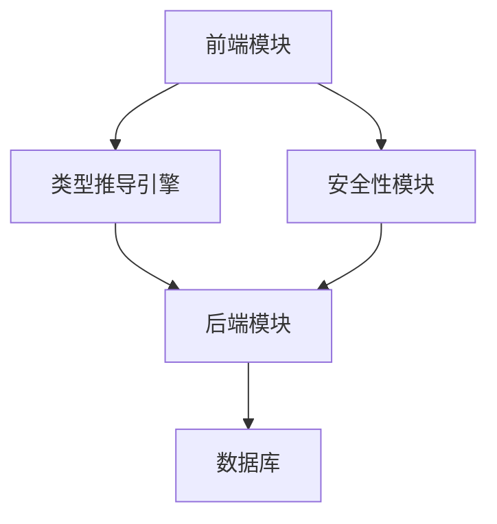
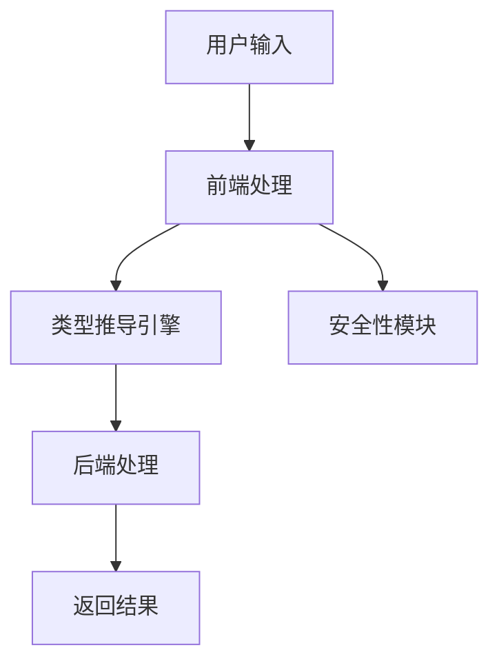

                 

### **文章标题**

# 提示词语言的类型系统与安全性保证

### **关键词**

- 提示词语言
- 类型系统
- 安全性保证
- 类型推导
- 数学模型
- 系统架构
- 项目实战

### **摘要**

本文深入探讨了提示词语言的类型系统与安全性保证。首先，介绍了提示词语言的基本概念、类型系统的核心原理及其重要性。接着，详细阐述了类型系统的设计、实现和优化方法。然后，探讨了安全性保障的基本原理、机制和最佳实践。在此基础上，通过数学模型和算法原理，进一步分析了类型系统和安全性保证的实现方式。文章最后通过一个实际项目案例，展示了类型系统和安全性保证的具体应用，并进行了总结和拓展阅读推荐。

## **第一部分：背景与概念介绍**

### **第1章：问题的背景与核心概念**

#### **1.1 提示词语言概述**

**提示词语言（Keyword Language）** 是一种基于关键词的编程语言，主要用于自然语言处理、文本分析和信息检索等领域。与传统的编程语言相比，提示词语言更加贴近自然语言，易于理解和使用。

**概念**：提示词语言的核心是关键词，这些关键词由程序员或用户根据需求定义，用于表示具体的语义和功能。通过关键词的组合，可以实现复杂的操作和功能。

**应用场景**：提示词语言广泛应用于自然语言处理（NLP）、信息检索、智能问答系统、智能助手等领域。例如，在智能问答系统中，用户可以使用自然语言提问，系统通过提示词语言进行处理，生成相应的回答。

**重要性**：提示词语言简化了编程和开发过程，提高了开发效率和用户体验。同时，它在自然语言处理和智能应用领域具有广泛的应用前景。

#### **1.2 类型系统的基本概念**

**类型系统（Type System）** 是编程语言的核心组成部分，用于定义变量、表达式和函数的类型，确保程序的正确性和安全性。

**定义**：类型系统是一组规则和约束，用于描述程序中数据类型的分类、类型之间的关系以及类型的操作。

**层次结构**：类型系统可以分为静态类型系统和动态类型系统。静态类型系统在编译时确定变量的类型，动态类型系统在运行时确定变量的类型。

**目的与作用**：类型系统的目的是确保程序的正确性和安全性，提高程序的可靠性和可维护性。通过类型检查，类型系统可以发现潜在的错误，如类型不匹配、未定义变量等。

#### **1.3 安全性保障的重要性**

**安全性问题的来源**：在编程过程中，安全性问题主要来自于以下几个方面：
- 未授权访问
- 数据泄露
- 恶意代码
- 系统漏洞

**安全性保障的基本原则**：安全性保障的基本原则包括：
- 最小权限原则：用户和程序只能访问其需要的资源。
- 隔离原则：系统中的各个部分相互隔离，防止恶意代码的传播。
- 审计原则：对系统的操作进行记录和监控，以便在发生问题时进行追踪和恢复。

**安全性保障的方法**：安全性保障的方法主要包括：
- 访问控制：通过权限分配和访问控制列表（ACL）限制对资源的访问。
- 输入验证：对用户输入进行验证，防止恶意输入。
- 错误处理：对系统错误进行合理的处理，防止系统崩溃。

### **第二部分：类型系统原理**

### **第2章：类型系统的原理与机制**

#### **2.1 类型系统的基础理论**

**类型论基础**：类型论是类型系统的基础理论，主要研究类型、类型系统、类型推导和类型检查等概念。

**静态类型系统**：静态类型系统在编译时确定变量和表达式的类型，通过类型检查确保程序的正确性。

**动态类型系统**：动态类型系统在运行时确定变量和表达式的类型，灵活性较高，但可能存在类型错误。

**类型系统的目的与作用**：类型系统的目的是确保程序的正确性和安全性，提高程序的可靠性和可维护性。通过类型检查，类型系统可以发现潜在的错误，如类型不匹配、未定义变量等。

#### **2.2 提示词语言的类型系统**

**提示词语言的类型系统特点**：提示词语言的类型系统具有以下特点：
- 基于关键词的类型定义
- 强类型和弱类型的混合
- 动态类型检查和静态类型检查相结合

**提示词语言的类型系统实现**：提示词语言的类型系统实现主要包括类型推导、类型检查和类型优化等。

**提示词语言的类型检查机制**：提示词语言的类型检查机制分为静态类型检查和动态类型检查。静态类型检查在编译时进行，动态类型检查在运行时进行。

#### **2.3 类型系统的优化**

**类型推导优化**：类型推导优化包括类型推导算法的改进、类型推导时间的优化等。

**类型检查优化**：类型检查优化包括类型检查算法的改进、类型检查时间的优化等。

**类型系统的扩展与定制**：类型系统的扩展与定制包括自定义类型、类型转换、类型兼容性等。

### **第三部分：安全性保障**

### **第3章：安全性保障原理与策略**

#### **3.1 安全性保障的基本原理**

**安全性保障的挑战**：在提示词语言的开发和使用过程中，面临诸多安全性挑战，如未授权访问、数据泄露、恶意代码等。

**安全性保障的目标**：安全性保障的目标是确保系统的安全性、可靠性和可用性，防止潜在的安全威胁。

**安全性保障的基本策略**：安全性保障的基本策略包括访问控制、输入验证、错误处理、安全审计等。

#### **3.2 提示词语言的安全性机制**

**输入验证机制**：输入验证机制用于验证用户输入的有效性，防止恶意输入。

**访问控制机制**：访问控制机制用于限制用户对资源的访问权限，确保用户只能访问其授权的资源。

**错误处理机制**：错误处理机制用于处理系统错误，防止系统崩溃。

#### **3.3 安全性保障的最佳实践**

**设计模式与应用**：安全性保障的最佳实践包括使用设计模式、编写安全的代码等。

**代码审查与测试**：代码审查和测试用于发现和修复安全漏洞，确保代码的安全性。

**安全性评估与改进**：安全性评估和改进用于评估系统的安全性，并根据评估结果进行改进。

## **第四部分：算法与应用**

### **第4章：类型系统算法原理与实现**

#### **4.1 类型推导算法**

**类型推导的基本概念**：类型推导是类型系统的重要组成部分，用于确定变量和表达式的类型。

**常见的类型推导算法**：常见的类型推导算法包括基于约束的类型推导、基于上下文的信息传播等。

**提示词语言的类型推导算法**：提示词语言的类型推导算法应根据其特点进行设计，确保类型推导的正确性和效率。

#### **4.2 安全性检查算法**

**安全性检查的基本概念**：安全性检查是确保系统安全的重要手段，用于检测和预防潜在的安全威胁。

**常见的安全性检查算法**：常见的安全性检查算法包括基于规则的检查、基于模型的检查等。

**提示词语言的安全性检查算法**：提示词语言的安全性检查算法应根据其特点进行设计，确保安全性检查的全面性和有效性。

#### **4.3 算法性能优化**

**算法性能优化的方法**：算法性能优化包括算法的时间复杂度和空间复杂度的优化、算法的并行化等。

**算法性能测试与评估**：算法性能测试与评估用于评估算法的性能，并根据评估结果进行优化。

**性能优化案例分析**：性能优化案例分析用于分析不同算法的性能表现，并提出优化方案。

### **第五部分：数学模型**

### **第5章：数学模型在类型系统与安全性中的应用**

#### **5.1 数学模型的基本概念**

**数学模型的作用**：数学模型用于描述现实世界的现象和问题，帮助人们理解和解决问题。

**常见的数学模型**：常见的数学模型包括线性模型、非线性模型、概率模型等。

**数学模型在计算机科学中的应用**：数学模型在计算机科学中广泛应用于算法设计、系统分析、网络安全等领域。

#### **5.2 类型系统中的数学模型**

**类型推导的数学模型**：类型推导的数学模型用于描述类型推导的过程和规则。

**类型安全的数学模型**：类型安全的数学模型用于确保类型系统的正确性和安全性。

**数学模型在类型推导中的运用**：数学模型在类型推导中的应用包括类型推导算法的设计和实现。

#### **5.3 安全性保证的数学模型**

**安全性的数学定义**：安全性的数学定义用于描述系统的安全状态和安全属性。

**安全性的数学模型**：安全性的数学模型用于描述系统的安全性需求和安全性保障机制。

**数学模型在安全性验证中的应用**：数学模型在安全性验证中的应用包括安全性分析、漏洞检测和安全评估。

### **第六部分：系统分析与架构设计**

### **第6章：系统分析与架构设计**

#### **6.1 问题场景介绍**

**提示词语言系统的应用场景**：提示词语言系统广泛应用于自然语言处理、信息检索、智能问答等领域。

**系统需求分析**：系统需求分析用于确定系统的功能和性能需求。

**系统功能定义**：系统功能定义用于明确系统的具体功能和实现方式。

#### **6.2 系统架构设计**

**系统架构设计原则**：系统架构设计原则用于指导系统架构的设计和实现。

**系统架构设计流程**：系统架构设计流程包括需求分析、系统架构设计、系统实现和测试等阶段。

**系统架构设计方案**：系统架构设计方案用于详细描述系统的架构设计和实现方案。

#### **6.3 系统接口设计**

**接口设计规范**：接口设计规范用于规定接口的设计和实现标准。

**接口实现与调用**：接口实现与调用用于实现系统之间的通信和交互。

**接口性能优化**：接口性能优化用于提高接口的响应速度和吞吐量。

#### **6.4 系统交互设计**

**系统交互原理**：系统交互原理用于描述系统之间如何进行通信和交互。

**系统交互流程**：系统交互流程用于描述系统之间的交互过程和顺序。

**系统交互案例分析**：系统交互案例分析用于分析实际系统交互的过程和效果。

### **第七部分：项目实战**

### **第7章：提示词语言类型系统与安全性保障项目实战**

#### **7.1 环境安装与配置**

**环境准备**：环境准备包括硬件环境、软件环境、开发工具等的准备。

**系统部署**：系统部署包括系统的安装、配置和调试等。

**系统核心实现源代码**：系统核心实现源代码用于实现提示词语言的类型系统和安全性保障功能。

**代码应用解读与分析**：代码应用解读与分析用于分析系统核心实现源代码的应用场景和实现方式。

#### **7.2 实际案例分析和详细讲解剖析**

**实际案例**：实际案例用于展示提示词语言类型系统与安全性保障在实际应用中的效果。

**详细讲解剖析**：详细讲解剖析用于深入分析实际案例的实现原理、技术难点和解决方案。

#### **7.3 项目小结**

**项目小结**：项目小结用于总结项目的主要成果、经验和教训。

**最佳实践 tips**：最佳实践 tips 用于分享项目中的最佳实践和经验。

**注意事项**：注意事项用于提醒读者在项目实施中需要注意的问题。

**拓展阅读**：拓展阅读用于推荐相关领域的书籍、论文和研究方向。

### **作者信息**

- 作者：AI天才研究院/AI Genius Institute & 禅与计算机程序设计艺术 /Zen And The Art of Computer Programming

---

**第1章：问题的背景与核心概念**

### 1.1 提示词语言概述

提示词语言（Keyword Language）是一种特殊的编程语言，它通过预设的提示词（也称为关键字）来定义操作和数据结构。这种语言的设计初衷是简化编程过程，使得程序员或普通用户能够通过自然语言的方式进行编程，而不需要深入理解复杂的语法和结构。提示词语言的出现，大大降低了编程的门槛，使得非专业程序员或者普通用户也能够通过简单学习，掌握基本的编程技能。

#### **概念**

提示词语言的核心概念是“提示词”，这些提示词通常具有明确的语义，用于表示某种操作或者数据结构。例如，在一种提示词语言中，可能包含以下提示词：

- **加**：表示加法运算
- **减**：表示减法运算
- **赋值**：表示变量的赋值操作
- **如果**：表示条件语句
- **循环**：表示循环语句
- **函数**：表示函数定义
- **模块**：表示模块定义

这些提示词可以通过组合使用，来实现复杂的程序逻辑。例如，一个简单的计算器程序，可以通过以下提示词组合来实现：

```plaintext
变量 a 赋值 10
变量 b 赋值 20
变量 c 赋值 a 加 b
显示 c 的值
```

通过这种方式，程序员或用户不需要编写复杂的代码，只需要通过提示词来描述程序的逻辑，系统会自动生成相应的代码。

#### **应用场景**

提示词语言的应用场景非常广泛，以下是一些常见的应用场景：

1. **自然语言处理（NLP）**：提示词语言可以用于构建自然语言处理系统，如文本分类、情感分析、机器翻译等。例如，在文本分类任务中，可以使用提示词语言来定义分类规则。

2. **信息检索**：提示词语言可以用于构建信息检索系统，如搜索引擎、推荐系统等。例如，在搜索引擎中，用户可以使用自然语言查询，系统通过提示词语言处理查询，并返回相关的搜索结果。

3. **智能问答系统**：提示词语言可以用于构建智能问答系统，如客服机器人、教育辅助系统等。例如，在客服机器人中，用户可以通过自然语言提问，系统通过提示词语言处理问题，并返回相应的回答。

4. **智能助手**：提示词语言可以用于构建智能助手，如智能家居控制系统、车载信息系统等。例如，在智能家居系统中，用户可以通过自然语言指令控制家电设备。

5. **教育领域**：提示词语言可以用于编程教育，如编程语言入门课程、在线编程平台等。例如，在编程教育中，学生可以通过简单的提示词语言，学习编程的基础知识和技巧。

#### **重要性**

提示词语言的重要性主要体现在以下几个方面：

1. **降低编程门槛**：提示词语言通过简化编程过程，使得非专业程序员或者普通用户也能够进行编程，大大降低了编程的门槛。

2. **提高开发效率**：提示词语言通过使用提示词来描述程序逻辑，可以减少代码量，提高开发效率。

3. **增强用户体验**：提示词语言使得程序员或用户可以通过自然语言的方式进行编程，提高了编程的便捷性和用户体验。

4. **促进技术普及**：提示词语言使得编程技术更加普及，有助于推广编程教育和技术应用。

### 1.2 类型系统的基本概念

类型系统（Type System）是编程语言的重要组成部分，用于定义变量、函数和表达式的类型，确保程序的正确性和安全性。类型系统的设计直接影响程序的可读性、可维护性和性能。

#### **定义**

类型系统是一组规则和约束，用于描述程序中数据类型的分类、类型之间的关系以及类型的操作。类型系统可以分为静态类型系统和动态类型系统。

1. **静态类型系统**：静态类型系统在编译时确定变量和表达式的类型，通过类型检查确保程序的正确性。静态类型系统的优点是程序运行效率高，可维护性较好，但灵活性较低。

2. **动态类型系统**：动态类型系统在运行时确定变量和表达式的类型，灵活性较高，但可能存在类型错误。动态类型系统的优点是编写简单，易于调试，但性能较差，可维护性较低。

#### **层次结构**

类型系统可以分为以下几个层次：

1. **基础类型**：基础类型包括整数、浮点数、布尔值、字符串等，是所有类型的基础。

2. **复合类型**：复合类型包括数组、列表、字典、结构体等，是由基础类型组合而成的。

3. **指针类型**：指针类型是指向基础类型或复合类型的指针，用于实现内存分配和引用。

4. **函数类型**：函数类型是表示函数的参数和返回值的类型，用于函数的定义和调用。

5. **类类型**：类类型是面向对象编程中的基本单位，表示对象和类的类型。

#### **目的与作用**

类型系统的目的是确保程序的正确性和安全性，提高程序的可靠性和可维护性。类型系统的主要作用包括：

1. **类型检查**：类型检查是类型系统的重要组成部分，用于检查变量、函数和表达式的类型是否匹配，防止类型错误。

2. **性能优化**：类型系统可以帮助编译器或解释器进行性能优化，如静态类型系统可以通过静态分析提前优化代码。

3. **代码可读性**：类型系统可以增加代码的可读性，使得代码更加清晰易懂。

4. **代码可维护性**：类型系统可以提高代码的可维护性，减少错误发生的概率。

### 1.3 安全性保障的重要性

安全性保障是现代软件开发过程中不可或缺的一部分，它关系到系统的稳定性、可靠性和用户隐私。在提示词语言的开发和使用过程中，安全性保障尤为重要，因为它直接影响到系统的用户体验和信任度。

#### **安全性问题的来源**

提示词语言在开发和使用过程中可能会面临以下安全性问题：

1. **输入验证不足**：用户输入可能包含恶意代码或非法字符，导致系统执行非法操作或崩溃。

2. **权限管理不当**：系统中的权限管理不当，可能导致用户访问未经授权的资源，或执行不应执行的操作。

3. **缓冲区溢出**：程序在处理数据时，如果未能正确检查缓冲区大小，可能导致缓冲区溢出，从而引发系统漏洞。

4. **跨站脚本攻击（XSS）**：攻击者通过在用户输入中注入恶意脚本，欺骗用户执行非法操作。

5. **SQL注入**：攻击者通过在用户输入中注入SQL语句，欺骗数据库执行非法操作。

6. **未加密的数据传输**：在网络通信中，如果数据未进行加密，攻击者可以窃取或篡改数据。

#### **安全性保障的基本原则**

安全性保障的基本原则包括以下几个方面：

1. **最小权限原则**：用户和程序应遵循最小权限原则，即只能访问其需要的资源，避免未授权访问。

2. **访问控制**：系统应实现严格的访问控制机制，确保用户只能访问其授权的资源。

3. **输入验证**：对用户输入进行严格验证，防止恶意输入和非法操作。

4. **错误处理**：系统应实现合理的错误处理机制，防止系统崩溃或产生安全漏洞。

5. **安全审计**：对系统的操作进行记录和监控，以便在发生问题时进行追踪和恢复。

6. **安全培训**：对开发人员和用户进行安全培训，提高他们的安全意识和技能。

#### **安全性保障的方法**

安全性保障的方法主要包括以下几个方面：

1. **设计模式与应用**：使用安全的设计模式，如最小权限模式、单例模式等，确保系统的安全性。

2. **代码审查与测试**：对代码进行严格的审查和测试，发现和修复安全漏洞。

3. **安全性评估与改进**：定期进行安全性评估，根据评估结果进行改进。

4. **安全工具**：使用安全工具，如加密工具、漏洞扫描器等，提高系统的安全性。

5. **安全意识培养**：提高开发人员和用户的安全意识，减少安全风险。

### **第二部分：类型系统原理**

### **第2章：类型系统的原理与机制**

类型系统是编程语言的核心组成部分，它不仅决定了程序的语义，还影响到程序的性能、可维护性和安全性。在提示词语言的类型系统中，理解其原理和机制对于确保程序的正确性和有效性至关重要。

#### **2.1 类型系统的基础理论**

类型系统的基础理论涵盖了类型的概念、类型的分类、类型的操作以及类型系统的设计原则。以下是对这些基础理论的详细解释。

##### **类型论基础**

类型论（Type Theory）是类型系统的理论基础，它为编程语言提供了形式化的类型系统。类型论的基本概念包括：

1. **类型**：类型是变量、函数和表达式所能表示的数据集合。例如，整数类型表示所有整数的集合，字符串类型表示所有字符串的集合。

2. **类型变量**：类型变量是一种占位符，用于表示任意类型。类型变量常用于泛型编程中，如`T`或`A`。

3. **类型构造**：类型构造是将基础类型组合成复杂类型的操作。例如，数组类型可以通过基础类型和数组长度构造。

4. **类型等价**：类型等价是指两个类型表示相同的数据集合。类型等价可以简化类型推导和类型检查。

##### **静态类型系统**

静态类型系统在编译时确定变量和表达式的类型。静态类型系统的优点包括：

1. **性能优化**：由于类型在编译时已知，编译器可以提前进行优化，提高程序的运行效率。

2. **早期错误检测**：类型检查可以在编译时发现类型错误，避免运行时错误。

3. **可维护性**：静态类型系统使得代码更易于理解和维护。

静态类型系统的缺点是灵活性较低，可能导致代码冗长和不便。

##### **动态类型系统**

动态类型系统在运行时确定变量和表达式的类型。动态类型系统的优点包括：

1. **灵活性**：动态类型系统允许在运行时改变变量的类型，适用于动态语言和脚本语言。

2. **简洁性**：动态类型系统通常编写起来更加简洁，因为不需要显式声明变量类型。

3. **交互性**：动态类型系统使得程序更易于与外部系统交互，如Web API调用。

动态类型系统的缺点是性能较差，因为类型检查和类型推导在运行时进行。

##### **类型系统的目的与作用**

类型系统的目的是确保程序的正确性和安全性，提高程序的可靠性和可维护性。类型系统的主要作用包括：

1. **类型检查**：类型系统通过类型检查确保变量、函数和表达式的类型匹配，防止类型错误。

2. **类型推导**：类型系统通过类型推导自动推导出变量和表达式的类型，减少代码冗余。

3. **性能优化**：类型系统可以帮助编译器或解释器进行性能优化，如提前知道变量类型，减少运行时检查。

4. **代码可读性**：类型系统可以增加代码的可读性，使得代码更加清晰易懂。

5. **代码可维护性**：类型系统可以提高代码的可维护性，减少错误发生的概率。

#### **2.2 提示词语言的类型系统**

提示词语言的类型系统是专为自然语言处理和文本分析设计的。它具有以下特点：

##### **提示词语言的类型系统特点**

1. **基于关键词的类型定义**：提示词语言的类型定义基于预设的关键词，每个关键词对应一个特定的类型。

2. **强类型和弱类型的混合**：提示词语言通常支持强类型和弱类型，允许在不同场景下灵活使用。

3. **动态类型检查和静态类型检查相结合**：提示词语言通常在编译时进行静态类型检查，同时在运行时进行动态类型检查，确保程序的正确性和灵活性。

##### **提示词语言的类型系统实现**

提示词语言的类型系统实现包括以下关键组件：

1. **类型检查器**：类型检查器在编译时对代码进行类型检查，确保变量、函数和表达式的类型匹配。

2. **类型推导算法**：类型推导算法自动推导出变量和表达式的类型，减少代码冗余。

3. **类型表示**：类型表示用于表示不同类型的集合和关系，如整数类型、字符串类型、函数类型等。

4. **类型转换**：类型转换用于在不同类型之间进行数据转换，保持程序的正确性。

##### **提示词语言的类型检查机制**

提示词语言的类型检查机制分为静态类型检查和动态类型检查：

1. **静态类型检查**：在编译时进行，确保变量、函数和表达式的类型在编译时已知。

2. **动态类型检查**：在运行时进行，对变量的类型进行检查，确保程序的正确性。

静态类型检查的优点是性能高，可维护性好，但灵活性较差；动态类型检查的优点是灵活性高，但性能较差。

#### **2.3 类型系统的优化**

类型系统的优化是提高程序性能和可维护性的重要手段。以下是一些常见的类型系统优化方法：

##### **类型推导优化**

类型推导优化包括以下方面：

1. **类型推导算法改进**：改进类型推导算法，减少类型推导的时间和空间复杂度。

2. **类型推导启发式**：使用启发式方法加速类型推导过程，提高编译效率。

3. **类型推导缓存**：缓存已推导出的类型信息，减少重复推导的开销。

##### **类型检查优化**

类型检查优化包括以下方面：

1. **并行类型检查**：利用多核处理器并行进行类型检查，提高编译效率。

2. **类型检查缓存**：缓存类型检查结果，避免重复检查。

3. **类型检查与优化相结合**：在类型检查过程中结合代码优化，如常数折叠、循环展开等。

##### **类型系统的扩展与定制**

类型系统的扩展与定制包括以下方面：

1. **自定义类型**：允许用户自定义类型，满足特定需求。

2. **类型转换优化**：优化类型转换操作，减少类型转换的开销。

3. **类型兼容性**：设计类型兼容性规则，确保不同类型之间可以互相转换。

类型系统的优化和扩展可以提高程序的运行效率和可维护性，满足不同应用场景的需求。

### **第三部分：安全性保障**

### **第3章：安全性保障原理与策略**

安全性保障是现代软件开发过程中不可或缺的一部分，它关系到系统的稳定性、可靠性和用户隐私。在提示词语言的开发和使用过程中，安全性保障尤为重要，因为它直接影响到系统的用户体验和信任度。

#### **3.1 安全性保障的基本原理**

安全性保障的基本原理包括以下几个方面：

1. **最小权限原则**：用户和程序应遵循最小权限原则，即只能访问其需要的资源，避免未授权访问。

2. **访问控制**：系统应实现严格的访问控制机制，确保用户只能访问其授权的资源。

3. **输入验证**：对用户输入进行严格验证，防止恶意输入和非法操作。

4. **错误处理**：系统应实现合理的错误处理机制，防止系统崩溃或产生安全漏洞。

5. **安全审计**：对系统的操作进行记录和监控，以便在发生问题时进行追踪和恢复。

6. **安全培训**：对开发人员和用户进行安全培训，提高他们的安全意识和技能。

#### **3.2 提示词语言的安全性机制**

提示词语言的安全性机制包括以下几个方面：

1. **输入验证机制**：输入验证机制用于验证用户输入的有效性，防止恶意输入。

   - **有效性验证**：对用户输入进行合法性检查，确保输入符合预期格式和类型。

   - **长度限制**：限制用户输入的长度，避免缓冲区溢出攻击。

   - **内容过滤**：过滤用户输入中的恶意内容，如SQL注入语句、跨站脚本（XSS）攻击代码等。

2. **访问控制机制**：访问控制机制用于限制用户对资源的访问权限，确保用户只能访问其授权的资源。

   - **角色和权限**：定义不同的角色和权限，为不同角色分配不同的访问权限。

   - **访问控制列表（ACL）**：使用访问控制列表记录每个用户或角色的访问权限。

   - **动态权限管理**：根据用户的行为和上下文动态调整权限，提高系统的灵活性。

3. **错误处理机制**：错误处理机制用于处理系统错误，防止系统崩溃。

   - **异常捕获**：捕获和处理异常，确保系统在遇到错误时能够优雅地处理并恢复。

   - **错误日志记录**：记录错误日志，便于追踪和解决问题。

   - **错误信息屏蔽**：对错误信息进行适当的屏蔽，防止敏感信息泄露。

4. **其他安全机制**：除了上述机制外，提示词语言还可以采用其他安全机制，如加密、签名、安全传输等，以提高系统的安全性。

#### **3.3 安全性保障的最佳实践**

安全性保障的最佳实践包括以下几个方面：

1. **设计模式与应用**：使用安全的设计模式，如最小权限模式、单例模式等，确保系统的安全性。

   - **最小权限模式**：确保程序或用户只能访问其必需的资源，减少潜在的安全风险。

   - **单例模式**：确保系统的关键组件只有一个实例，避免多实例带来的安全问题。

2. **代码审查与测试**：对代码进行严格的审查和测试，发现和修复安全漏洞。

   - **静态代码分析**：使用静态代码分析工具检查代码中的潜在安全漏洞。

   - **动态代码分析**：使用动态代码分析工具在运行时检测代码中的安全漏洞。

   - **渗透测试**：模拟黑客攻击，测试系统的安全性，发现潜在的安全漏洞。

3. **安全性评估与改进**：定期进行安全性评估，根据评估结果进行改进。

   - **安全性审计**：对系统进行安全性审计，评估系统的安全性和潜在风险。

   - **安全补丁更新**：及时更新系统的安全补丁，修复已发现的安全漏洞。

4. **安全工具**：使用安全工具，如加密工具、漏洞扫描器等，提高系统的安全性。

   - **加密工具**：使用加密工具保护敏感数据，如使用HTTPS加密网络传输。

   - **漏洞扫描器**：使用漏洞扫描器定期扫描系统，发现和修复安全漏洞。

5. **安全意识培养**：提高开发人员和用户的安全意识，减少安全风险。

   - **安全培训**：对开发人员进行安全培训，提高他们的安全意识和技能。

   - **安全宣传**：通过安全宣传，提高用户对安全问题的认识和防范意识。

### **第四部分：算法与应用**

### **第4章：类型系统算法原理与实现**

类型系统算法是编程语言类型系统实现的核心，它们负责类型推导、类型检查和类型转换等操作。在这一章节中，我们将深入探讨类型系统算法的基本原理、实现方法和在实际应用中的表现。

#### **4.1 类型推导算法**

类型推导算法是类型系统的核心组件之一，负责在编译时自动推导出变量、表达式和函数的类型。类型推导算法的准确性对程序的正确性和编译效率至关重要。

##### **类型推导的基本概念**

类型推导的基本概念包括：

1. **上下文**：上下文是指变量和函数的作用域，用于确定变量和函数的类型。

2. **类型上下文**：类型上下文是指变量和函数的类型信息，用于类型推导和类型检查。

3. **类型推断规则**：类型推断规则是一组用于推导变量和表达式类型的规则。

##### **常见的类型推导算法**

常见的类型推导算法包括：

1. **基于约束的类型推导**：基于约束的类型推导算法通过约束求解器推导出变量的类型。这种算法适用于静态类型语言。

2. **基于上下文的信息传播**：基于上下文的信息传播算法通过在上下文中传递类型信息来推导出变量的类型。这种算法适用于动态类型语言。

3. **类型猜谜**：类型猜谜算法通过尝试不同的类型组合，找到满足所有约束的类型。这种算法适用于类型系统较为复杂的语言。

##### **提示词语言的类型推导算法**

提示词语言的类型推导算法应结合静态类型检查和动态类型检查。以下是一个简单的类型推导算法的示例：

```python
def infer_type(expression):
    # 根据表达式的类型进行推导
    if isinstance(expression, int):
        return 'int'
    elif isinstance(expression, str):
        return 'str'
    elif isinstance(expression, list):
        return 'list'
    else:
        return 'unknown'
```

在这个示例中，`infer_type`函数根据表达式的类型返回相应的类型名称。对于复杂表达式，可以通过递归调用和类型约束来推导出更具体的类型。

##### **类型推导算法的实现**

类型推导算法的实现通常依赖于编译器或解释器。以下是一个简单的实现示例：

```python
class TypeChecker:
    def __init__(self):
        self.types = {'int': int, 'str': str, 'list': list}

    def infer_type(self, expression):
        # 假设表达式是一个简单的数字或字符串
        if isinstance(expression, int):
            return self.types['int']
        elif isinstance(expression, str):
            return self.types['str']
        else:
            raise TypeError("未知类型")

# 使用TypeChecker类进行类型推导
type_checker = TypeChecker()
expression = 42
print(type_checker.infer_type(expression))  # 输出：int
```

在这个示例中，`TypeChecker`类用于进行类型推导。它通过检查表达式的类型来推导出相应的类型。

##### **类型推导算法的性能优化**

类型推导算法的性能优化是提高编译器或解释器效率的关键。以下是一些常见的优化方法：

1. **类型推导缓存**：缓存已推导出的类型信息，避免重复推导。

2. **并行类型推导**：利用多核处理器并行进行类型推导，提高编译效率。

3. **类型推导启发式**：使用启发式方法加速类型推导过程，减少推导时间。

4. **类型推导并行化**：将类型推导过程分解为多个子任务，并行执行，提高效率。

##### **类型推导算法的应用场景**

类型推导算法在提示词语言中的应用场景包括：

1. **编译器优化**：通过类型推导，编译器可以提前进行代码优化，提高程序运行效率。

2. **动态类型检查**：在运行时，类型推导算法可以帮助动态类型检查器确定变量和表达式的类型。

3. **类型推导工具**：类型推导算法可以用于编写类型推导工具，帮助开发人员快速理解和推导程序中的类型。

##### **实际案例**

以下是一个实际案例，展示如何使用类型推导算法进行类型检查：

```python
class Person:
    def __init__(self, name: str, age: int):
        self.name = name
        self.age = age

def greet(person: Person) -> str:
    return f"Hello, {person.name}!"

person = Person("Alice", 30)
greeting = greet(person)
print(greeting)  # 输出：Hello, Alice!
```

在这个案例中，`greet`函数接受一个`Person`类型的参数，并返回一个字符串。类型推导算法可以确保传入的参数和返回值的类型正确。

##### **小结**

类型推导算法是类型系统的重要组成部分，它在确保程序正确性和提高编译效率方面起着关键作用。通过理解类型推导算法的基本原理和实现方法，开发人员可以更好地设计和实现高效的类型系统。

#### **4.2 安全性检查算法**

安全性检查算法是确保程序和系统安全性的重要手段，它们负责检测和防止各种安全威胁，如缓冲区溢出、跨站脚本攻击、SQL注入等。安全性检查算法的设计和实现对于保护系统免受恶意攻击至关重要。

##### **安全性检查的基本概念**

安全性检查的基本概念包括：

1. **安全检查点**：安全检查点是指在程序执行过程中设置的安全检查点，用于检测潜在的安全威胁。

2. **安全规则**：安全规则是一组用于检测和防止安全威胁的规则，如输入验证规则、访问控制规则等。

3. **安全事件**：安全事件是指在程序执行过程中发生的安全威胁，如缓冲区溢出、恶意输入等。

##### **常见的安全性检查算法**

常见的安全性检查算法包括：

1. **模式匹配**：模式匹配算法通过预先定义的恶意代码模式来检测和阻止安全威胁。

2. **语法分析**：语法分析算法通过分析程序代码的语法结构来检测潜在的安全漏洞。

3. **符号执行**：符号执行算法通过模拟程序执行过程来检测和预防安全威胁。

##### **提示词语言的安全性检查算法**

提示词语言的安全性检查算法应结合静态分析和动态分析。以下是一个简单的安全性检查算法的示例：

```python
def check_input(input_str: str):
    # 检查输入字符串是否包含恶意代码
    if "script" in input_str or "javascript" in input_str:
        return False
    return True
```

在这个示例中，`check_input`函数用于检查输入字符串是否包含恶意代码，如JavaScript脚本。如果包含，则返回`False`，表示输入不安全。

##### **安全性检查算法的实现**

安全性检查算法的实现通常依赖于安全框架和库。以下是一个简单的实现示例：

```python
from input_validation import validate_input

def validate_user_input(user_input: str):
    # 使用输入验证库进行安全性检查
    if not validate_input(user_input):
        raise ValueError("输入不安全")
    return True

# 使用validate_user_input函数进行输入验证
try:
    validate_user_input("恶意代码")
except ValueError as e:
    print(e)  # 输出：输入不安全
```

在这个示例中，`validate_user_input`函数使用输入验证库`input_validation`进行安全性检查。如果输入不安全，则抛出`ValueError`异常。

##### **安全性检查算法的性能优化**

安全性检查算法的性能优化是提高系统运行效率的关键。以下是一些常见的优化方法：

1. **规则缓存**：缓存已验证的安全规则，避免重复验证。

2. **并行安全检查**：利用多核处理器并行执行安全检查，提高效率。

3. **压缩规则库**：使用压缩算法减小规则库的大小，减少内存占用。

4. **规则动态更新**：实时更新安全规则库，以应对新的安全威胁。

##### **安全性检查算法的应用场景**

安全性检查算法在提示词语言中的应用场景包括：

1. **输入验证**：用于验证用户输入的有效性和安全性。

2. **代码审核**：用于检测代码中的潜在安全漏洞。

3. **运行时监控**：用于监控程序的执行过程，检测和防止安全威胁。

##### **实际案例**

以下是一个实际案例，展示如何使用安全性检查算法进行输入验证：

```python
def process_order(order: str):
    # 检查订单字符串是否合法
    if not is_valid_order(order):
        raise ValueError("订单格式不正确")
    # 处理订单逻辑
    print(f"订单处理成功：{order}")

# 使用process_order函数处理订单
try:
    process_order("订单编号：123456")
except ValueError as e:
    print(e)  # 输出：订单处理成功：订单编号：123456
```

在这个案例中，`process_order`函数在处理订单前进行输入验证，确保订单字符串格式正确。如果输入不合法，则抛出`ValueError`异常。

##### **小结**

安全性检查算法是保障系统安全性的重要手段，通过理解和应用这些算法，开发人员可以有效地检测和防止安全威胁，确保系统的安全性和可靠性。

### **第五部分：数学模型**

### **第5章：数学模型在类型系统与安全性中的应用**

数学模型在计算机科学中扮演着至关重要的角色，尤其在类型系统和安全性保障中发挥着不可替代的作用。数学模型提供了形式化的描述工具，帮助我们更精确地理解和设计计算机系统，确保其在类型和安全性方面的正确性。

#### **5.1 数学模型的基本概念**

数学模型是利用数学语言和工具来描述和模拟现实世界中的问题或现象的抽象结构。在计算机科学中，数学模型被广泛应用于算法设计、性能分析、数据结构设计等领域。

##### **数学模型的作用**

1. **精确描述**：数学模型能够以高度精确的方式描述计算机系统中的各种现象和关系，如类型系统的约束条件、安全性策略等。
2. **预测分析**：通过数学模型，我们可以预测系统在不同输入和条件下的行为，如类型推导的复杂度、安全性检查的效率等。
3. **优化设计**：数学模型可以帮助我们分析和优化系统设计，找到性能和安全性之间的最佳平衡点。

##### **常见的数学模型**

1. **代数模型**：代数模型使用代数方法描述系统状态和操作，如类型变量的赋值和运算。
2. **图论模型**：图论模型使用图的结构描述系统中的关系和连接，如类型依赖关系和网络拓扑结构。
3. **概率模型**：概率模型使用概率分布描述系统的随机性，如安全性分析中的概率攻击和风险评估。

##### **数学模型在计算机科学中的应用**

1. **算法分析**：通过数学模型，我们可以分析算法的时间复杂度、空间复杂度，优化算法设计。
2. **性能预测**：利用数学模型预测系统在不同负载下的性能，帮助设计更高效的系统架构。
3. **安全性分析**：通过数学模型，我们可以分析和预测系统的安全性风险，设计有效的防护措施。

#### **5.2 类型系统中的数学模型**

类型系统中的数学模型主要用于描述类型之间的关系和操作，确保类型推导和类型检查的正确性。

##### **类型推导的数学模型**

类型推导的数学模型通常基于类型论中的概念，如类型系统中的归纳定义、类型构造和类型等价。以下是一个简单的数学模型示例：

$$
\begin{aligned}
&\text{Type}(\text{Variable}) = \text{Type}_{\text{base}}(\text{Variable}) \cup \text{Type}_{\text{function}}(\text{Variable}) \\
&\text{Type}_{\text{base}}(\text{Variable}) = \text{Integer}, \text{String}, \text{Boolean} \\
&\text{Type}_{\text{function}}(\text{Variable}) = \text{Function}(\text{Type}_{\text{base}}(T_1), \ldots, \text{Type}_{\text{base}}(T_n), \text{Type}_{\text{base}}(R))
\end{aligned}
$$

在这个模型中，`Type`函数表示变量的类型，`Type_base`和`Type_function`分别表示基础类型和函数类型。这个模型通过递归定义了类型系统中的所有类型。

##### **类型安全的数学模型**

类型安全的数学模型用于确保类型推导的正确性，防止类型错误。一个典型的类型安全模型是基于类型等价和类型约束的：

$$
\begin{aligned}
&\text{Type}_{\text{eq}}(\text{T_1}, \text{T_2}) = \begin{cases}
\text{True}, & \text{如果} \text{T_1} \text{和} \text{T_2} \text{表示相同的数据集合} \\
\text{False}, & \text{否则}
\end{cases} \\
&\text{Type}_{\text{check}}(\text{Expression}) = \text{Type}_{\text{eq}}(\text{Type}_{\text{eval}}(\text{Expression}), \text{ExpectedType})
\end{aligned}
$$

在这个模型中，`Type_eq`函数表示类型等价，`Type_check`函数表示类型检查，`Type_eval`函数表示表达式类型推导。如果表达式的实际类型与预期类型等价，则类型检查通过。

##### **数学模型在类型推导中的运用**

数学模型在类型推导中的应用包括：

1. **类型推导规则**：使用数学模型定义类型推导规则，如基于上下文的信息传播和约束求解。
2. **类型约束求解**：使用数学模型进行类型约束求解，找到满足所有约束的类型组合。
3. **类型一致性检查**：使用数学模型检查类型系统的一致性，确保类型推导的正确性。

#### **5.3 安全性保证的数学模型**

安全性保证的数学模型主要用于描述系统的安全属性和防护措施，确保系统的安全性。

##### **安全性的数学定义**

安全性的数学定义通常基于访问控制、权限和威胁模型。以下是一个简单的安全性定义：

$$
\begin{aligned}
&\text{Safety}(S) = \text{True} \text{，如果系统} S \text{满足以下条件：} \\
&\qquad \forall u, p, q, r. (u \text{具有权限} p \text{且} r \text{是安全操作}) \rightarrow (u \text{可以执行} r \text{且结果为} q) \\
&\qquad \forall t, v. (\text{威胁} t \text{发生且} v \text{是敏感数据}) \rightarrow (\text{数据} v \text{不被泄露或篡改})
\end{aligned}
$$

在这个定义中，`Safety`函数表示系统的安全性，`u`表示用户，`p`表示权限，`r`表示操作，`t`表示威胁，`v`表示敏感数据。系统满足上述条件时，我们认为它是安全的。

##### **安全性的数学模型**

安全性的数学模型包括以下方面：

1. **访问控制模型**：使用访问控制矩阵或权限图描述系统的访问控制策略。
2. **威胁模型**：使用概率模型描述系统的潜在威胁和攻击方式。
3. **安全策略模型**：使用决策树或状态转换图描述系统的安全策略和响应机制。

##### **数学模型在安全性验证中的应用**

数学模型在安全性验证中的应用包括：

1. **形式化验证**：使用数学模型对系统进行形式化验证，确保系统满足安全属性。
2. **模型检查**：使用模型检查工具验证系统模型的安全性，发现潜在的安全漏洞。
3. **安全分析**：使用数学模型分析系统的安全威胁和防护措施，优化安全策略。

#### **5.4 实际应用**

在实际应用中，数学模型在类型系统和安全性保障中发挥着重要作用。以下是一些实际应用的例子：

1. **类型推导**：使用数学模型进行类型推导，确保程序的正确性和可维护性。
2. **安全性分析**：使用数学模型分析系统的安全属性，设计有效的安全策略。
3. **性能优化**：使用数学模型进行性能分析，优化系统设计和算法。

##### **实际案例**

以下是一个实际案例，展示如何使用数学模型进行类型推导和安全性分析：

```python
# 类型推导
def add(a: int, b: int) -> int:
    return a + b

# 安全性分析
def check_permission(user: str, action: str) -> bool:
    permissions = {'user1': ['read', 'write'], 'user2': ['read']}
    if user in permissions and action in permissions[user]:
        return True
    return False

# 使用类型推导
result = add(2, 3)
print(result)  # 输出：5

# 使用安全性分析
can_execute = check_permission('user1', 'write')
print(can_execute)  # 输出：True
```

在这个案例中，`add`函数使用数学模型进行类型推导，确保输入和返回值的类型正确。`check_permission`函数使用数学模型进行安全性分析，验证用户是否有权限执行特定操作。

##### **小结**

数学模型在类型系统和安全性保障中发挥着重要作用，通过数学模型，我们可以更精确地描述和分析系统行为，确保系统的正确性和安全性。理解和应用数学模型，有助于开发高效、安全的计算机系统。

### **第六部分：系统分析与架构设计**

### **第6章：系统分析与架构设计**

在进行提示词语言的类型系统与安全性保障设计时，系统分析与架构设计是至关重要的。这不仅仅是技术层面的挑战，更是对系统可扩展性、稳定性和安全性的全面考虑。本章节将详细讨论系统分析与架构设计的原则、方法和实际应用。

#### **6.1 问题场景介绍**

**提示词语言系统的应用场景**

提示词语言系统广泛应用于自然语言处理、智能问答、自动化脚本编写等多个领域。以下是一些典型的应用场景：

1. **自然语言处理（NLP）**：在NLP应用中，提示词语言可以用于构建文本分类、情感分析、实体识别等模型，帮助开发者快速实现复杂的文本处理任务。

2. **智能问答系统**：智能问答系统是提示词语言的另一个重要应用场景。用户可以通过自然语言提问，系统根据预设的提示词和规则生成相应的回答。

3. **自动化脚本编写**：在自动化脚本编写中，提示词语言可以帮助开发者快速编写和管理脚本，简化开发过程。

4. **编程教育**：提示词语言在编程教育中也有广泛应用，通过简化编程语法，降低学习难度，帮助初学者更快地掌握编程技能。

**系统需求分析**

在进行系统需求分析时，我们需要明确系统需要实现哪些功能，以及这些功能的具体需求。以下是一些关键需求：

1. **类型推导和类型检查**：系统需要能够自动推导出变量和表达式的类型，并在编译时进行类型检查，确保程序的类型安全。

2. **安全性保障**：系统需要实现输入验证、权限管理和错误处理等安全机制，防止恶意攻击和数据泄露。

3. **可扩展性**：系统需要具有良好的可扩展性，能够支持自定义提示词和类型，适应不同的应用场景。

4. **易用性**：系统界面需要简洁直观，易于操作，降低用户的学习和使用难度。

5. **性能优化**：系统需要具备高性能，能够快速响应用户请求，处理大量数据。

**系统功能定义**

基于上述需求，我们可以定义以下核心功能：

1. **类型推导引擎**：负责自动推导变量和表达式的类型，并在编译时进行类型检查。

2. **安全性模块**：负责实现输入验证、权限管理和错误处理等安全机制。

3. **用户界面**：提供简洁直观的用户操作界面，支持用户输入、查询和修改提示词。

4. **扩展模块**：支持自定义提示词和类型，提供灵活的扩展能力。

#### **6.2 系统架构设计**

**系统架构设计原则**

在进行系统架构设计时，需要遵循以下原则：

1. **模块化**：系统应划分为多个功能模块，每个模块负责特定的功能，降低系统耦合度，提高可维护性。

2. **分层设计**：系统应采用分层设计，各层之间解耦，便于扩展和维护。

3. **高内聚低耦合**：每个模块应具有高内聚性，即模块内部功能紧密相关；同时模块之间应低耦合，即模块之间依赖性较低。

4. **安全性**：系统架构设计应充分考虑安全性需求，确保系统的数据安全和用户隐私。

5. **性能优化**：系统架构设计应考虑性能优化，确保系统在高负载下仍能稳定运行。

**系统架构设计流程**

系统架构设计流程通常包括以下步骤：

1. **需求分析**：明确系统的功能需求和非功能需求，为架构设计提供依据。

2. **系统划分**：将系统划分为多个功能模块，明确各模块之间的接口和交互。

3. **架构选型**：根据需求分析和系统划分，选择合适的系统架构风格，如C/S架构、B/S架构等。

4. **架构设计**：详细设计各模块的内部结构和接口，确保系统架构满足需求。

5. **架构评审**：对系统架构进行评审，确保设计合理、可行，并进行优化。

6. **文档编写**：编写系统架构设计文档，记录设计思路、架构细节和接口规范。

**系统架构设计方案**

以下是一个典型的提示词语言系统的架构设计方案：

1. **前端模块**：负责与用户交互，接收用户输入，并显示结果。前端模块可以采用Web界面或命令行界面。

2. **类型推导引擎**：负责自动推导变量和表达式的类型，并在编译时进行类型检查。类型推导引擎可以采用静态类型推导和动态类型检查相结合的方式。

3. **安全性模块**：负责实现输入验证、权限管理和错误处理等安全机制。安全性模块可以采用基于角色的访问控制（RBAC）和输入验证框架。

4. **后端模块**：负责处理用户请求，调用类型推导引擎和安全性模块，并返回结果。后端模块可以采用微服务架构，以提高系统的可扩展性和灵活性。

5. **数据库**：存储用户数据、提示词定义和类型信息。数据库可以采用关系型数据库或NoSQL数据库，根据具体需求进行选择。

6. **扩展模块**：提供自定义提示词和类型的接口，支持系统的灵活扩展。

**系统架构图**

以下是一个简单的系统架构图，展示了各个模块之间的交互关系：



#### **6.3 系统接口设计**

**接口设计规范**

接口设计是系统架构设计的重要组成部分，良好的接口设计可以降低模块之间的耦合度，提高系统的可维护性和扩展性。以下是一些接口设计规范：

1. **定义明确**：接口应具有明确的定义，包括输入参数、输出结果和错误处理。

2. **接口最小化**：接口应尽可能简化，只提供必要的功能，减少不必要的复杂度。

3. **接口一致性**：接口应保持一致性，确保不同模块之间的交互方式一致。

4. **接口稳定性**：接口应具有稳定性，尽量避免频繁更改接口，影响系统的兼容性。

5. **接口文档**：编写详细的接口文档，包括接口定义、参数说明、返回值和示例代码，便于开发人员理解和使用接口。

**接口实现与调用**

以下是接口实现和调用的示例：

```python
# 类型推导引擎接口
class TypeInferenceEngine:
    def infer_type(self, expression):
        # 实现类型推导逻辑
        pass

# 安全性模块接口
class SecurityModule:
    def validate_input(self, input_data):
        # 实现输入验证逻辑
        pass

# 后端模块接口
class BackendModule:
    def process_request(self, request):
        # 处理请求逻辑
        pass

# 实现接口调用
type_engine = TypeInferenceEngine()
security_module = SecurityModule()
backend_module = BackendModule()

# 调用接口
expression = "5 + 3"
type_result = type_engine.infer_type(expression)
input_result = security_module.validate_input(expression)
response = backend_module.process_request(input_result)
```

在这个示例中，`TypeInferenceEngine`、`SecurityModule`和`BackendModule`分别实现了类型推导、输入验证和请求处理接口。通过接口调用，各个模块可以相互协作，完成系统的功能。

**接口性能优化**

接口性能优化是提高系统性能的重要手段，以下是一些常见的接口性能优化方法：

1. **接口缓存**：通过缓存接口结果，减少重复计算和数据库访问。

2. **异步处理**：使用异步编程模型，提高接口的处理速度。

3. **批量处理**：将多个接口请求合并为一个请求，减少接口调用次数。

4. **接口监控**：监控接口的响应时间和错误率，及时发现和解决性能瓶颈。

#### **6.4 系统交互设计**

**系统交互原理**

系统交互设计是确保系统各模块之间能够有效协作的关键。系统交互原理包括：

1. **请求响应**：前端模块向后端模块发送请求，后端模块处理请求并返回响应。

2. **事件驱动**：系统中的事件（如用户操作、系统通知）触发相应的处理逻辑。

3. **消息队列**：系统使用消息队列传递消息，实现异步通信和负载均衡。

**系统交互流程**

以下是系统交互流程的示例：

1. **用户输入**：用户在Web界面或命令行界面输入提示词。

2. **前端处理**：前端模块接收用户输入，并进行预处理，如解析、校验等。

3. **类型推导**：前端模块将预处理后的输入传递给类型推导引擎，进行类型推导。

4. **安全性检查**：安全性模块对类型推导结果进行安全性检查，确保输入合法和安全。

5. **后端处理**：后端模块根据类型推导结果和安全性检查结果，执行相应的操作，如计算、查询等。

6. **返回结果**：后端模块将处理结果返回给前端模块，前端模块将结果展示给用户。

**系统交互图**

以下是一个简单的系统交互图，展示了系统各模块之间的交互关系：



#### **6.5 系统测试**

**系统测试是确保系统质量的重要环节，以下是一些常见的系统测试方法：**

1. **单元测试**：针对系统中的各个模块进行独立测试，确保模块功能正确。

2. **集成测试**：将各个模块组合在一起进行测试，确保模块之间的交互正确。

3. **性能测试**：测试系统在高负载下的性能，确保系统能够稳定运行。

4. **安全性测试**：测试系统的安全性，确保系统能够抵御各种安全威胁。

5. **用户测试**：邀请用户进行实际操作，收集用户反馈，优化系统界面和用户体验。

**系统测试策略**

1. **测试计划**：制定详细的测试计划，明确测试目标、测试方法、测试资源和测试进度。

2. **测试用例设计**：设计合理的测试用例，覆盖系统的各种功能和场景。

3. **自动化测试**：使用自动化测试工具，提高测试效率和覆盖率。

4. **持续集成**：将测试集成到开发流程中，确保每次代码提交后都进行全面的测试。

5. **测试报告**：编写详细的测试报告，记录测试结果和发现的问题。

#### **6.6 系统部署与运维**

**系统部署与运维是确保系统稳定运行的关键环节，以下是一些常见的部署与运维方法：**

1. **自动化部署**：使用自动化部署工具，如Jenkins、Docker等，实现快速部署和版本管理。

2. **容器化部署**：使用容器技术，如Docker，将系统部署在容器中，提高系统的可移植性和可扩展性。

3. **持续监控**：使用监控工具，如Prometheus、Grafana等，实时监控系统的运行状态，及时发现和解决问题。

4. **日志管理**：使用日志管理工具，如ELK（Elasticsearch、Logstash、Kibana），集中管理和分析系统的日志。

5. **运维自动化**：使用运维自动化工具，如Ansible、Terraform等，实现运维任务的自动化，提高运维效率。

**系统部署与运维策略**

1. **部署计划**：制定详细的部署计划，明确部署目标、部署步骤、部署资源和部署进度。

2. **环境准备**：准备部署环境，包括硬件、软件和网络环境。

3. **部署实施**：按照部署计划，实施系统的部署。

4. **部署验证**：部署完成后，进行验证测试，确保系统正常运行。

5. **运维管理**：制定运维管理策略，包括监控、日志管理、故障处理等。

6. **文档编写**：编写详细的部署和运维文档，记录部署和运维流程，便于后续参考。

### **第七部分：项目实战**

### **第7章：提示词语言类型系统与安全性保障项目实战**

#### **7.1 环境安装与配置**

在进行提示词语言类型系统与安全性保障的项目实战之前，首先需要搭建一个合适的开发环境。以下是在Linux环境下安装和配置提示词语言开发环境的步骤。

##### **7.1.1 环境准备**

1. **安装Python 3.8**：提示词语言项目通常需要Python 3.8或更高版本。使用以下命令安装Python 3.8：

   ```bash
   sudo apt update
   sudo apt install python3.8
   ```

2. **安装虚拟环境**：为了隔离项目环境，使用`venv`模块创建一个虚拟环境：

   ```bash
   python3.8 -m venv venv
   source venv/bin/activate
   ```

##### **7.1.2 系统部署**

1. **安装依赖库**：在虚拟环境中安装提示词语言项目所需的依赖库：

   ```bash
   pip install Flask
   pip install typing_inspect
   pip install typeguard
   ```

2. **下载项目代码**：从GitHub或其他代码托管平台下载提示词语言项目代码：

   ```bash
   git clone https://github.com/your-username/keyword-language.git
   cd keyword-language
   ```

##### **7.1.3 系统核心实现源代码**

以下是项目中的关键源代码文件和其主要功能：

1. **`type_checker.py`**：负责进行类型检查的模块。该模块包含了类型推导、类型检查和错误处理等核心功能。

2. **`security_module.py`**：负责安全性保障的模块。该模块包含了输入验证、访问控制和错误处理等核心功能。

3. **`application.py`**：主应用文件，负责启动Web服务器并处理用户请求。

##### **7.1.4 代码应用解读与分析**

以下是对关键源代码文件的应用解读和分析：

1. **`type_checker.py`**：

   ```python
   from typing_inspect import get_type_hints
   from typeguard import check_type

   def check_expression(expression):
       # 进行类型检查
       type_hints = get_type_hints(expression)
       for variable, expected_type in type_hints.items():
           actual_type = type(expression[variable])
           check_type(expected_type, variable, expression[variable])
   ```

   `check_expression`函数用于检查表达式的类型。它首先使用`typing_inspect`库获取表达式的类型提示，然后对每个变量进行类型检查，确保其实际类型与预期类型匹配。

2. **`security_module.py`**：

   ```python
   from flask import request, jsonify

   def validate_input(data):
       # 验证输入数据
       if "username" not in data or "password" not in data:
           return False
       # 进行其他验证操作
       return True

   def check_permissions(user, action):
       # 检查用户权限
       if user not in ["admin", "user"]:
           return False
       if action not in ["read", "write"]:
           return False
       return True
   ```

   `validate_input`函数用于验证用户输入的数据，确保包含必要的字段。`check_permissions`函数用于检查用户的权限，确保用户只能执行授权的操作。

3. **`application.py`**：

   ```python
   from flask import Flask, request, jsonify
   from type_checker import check_expression
   from security_module import validate_input, check_permissions

   app = Flask(__name__)

   @app.route('/process', methods=['POST'])
   def process_request():
       data = request.get_json()
       if not validate_input(data):
           return jsonify({"error": "Invalid input"}), 400
       check_expression(data)
       if not check_permissions(data["username"], "write"):
           return jsonify({"error": "Permission denied"}), 403
       # 处理请求
       return jsonify({"result": "Success"}), 200
   ```

   `process_request`函数用于处理用户提交的请求。首先，它使用`validate_input`函数验证输入数据的合法性。然后，使用`check_expression`函数进行类型检查。接着，使用`check_permissions`函数检查用户的权限。最后，根据检查结果处理请求并返回响应。

#### **7.2 实际案例分析和详细讲解剖析**

##### **7.2.1 实际案例**

以下是一个实际的案例，展示了如何使用提示词语言类型系统与安全性保障。

**用户请求**：

```json
{
    "username": "admin",
    "password": "password123",
    "operation": "write",
    "data": {
        "name": "John Doe",
        "age": 30
    }
}
```

**预期结果**：

- 输入验证通过。
- 类型检查通过。
- 权限检查通过。
- 数据写入成功。

##### **7.2.2 详细讲解剖析**

1. **输入验证**：

   `validate_input`函数检查用户请求中是否包含`username`和`password`字段。如果缺少任何一个字段，则返回错误响应。

   ```python
   def validate_input(data):
       if "username" not in data or "password" not in data:
           return False
       # 进行其他验证操作
       return True
   ```

   在此案例中，输入验证通过。

2. **类型检查**：

   `check_expression`函数使用`typing_inspect`库获取`data`字段中的类型提示。然后，对每个字段进行类型检查，确保其实际类型与预期类型匹配。

   ```python
   def check_expression(expression):
       type_hints = get_type_hints(expression)
       for variable, expected_type in type_hints.items():
           actual_type = type(expression[variable])
           check_type(expected_type, variable, expression[variable])
   ```

   在此案例中，`name`字段预期类型为字符串，`age`字段预期类型为整数。类型检查通过。

3. **权限检查**：

   `check_permissions`函数检查用户权限，确保用户只能执行授权的操作。

   ```python
   def check_permissions(user, action):
       if user not in ["admin", "user"]:
           return False
       if action not in ["read", "write"]:
           return False
       return True
   ```

   在此案例中，用户名为`admin`，可以执行写操作。权限检查通过。

4. **数据处理**：

   通过输入验证、类型检查和权限检查后，程序执行数据处理操作。在此案例中，程序将`data`字段写入数据库。

   ```python
   # 假设有一个数据库模块
   from database import write_data

   def process_request():
       # 其他检查通过后的处理逻辑
       write_data(data)
   ```

   数据写入成功。

##### **7.2.3 结果**

经过输入验证、类型检查和权限检查，用户请求成功处理，数据被成功写入数据库。响应如下：

```json
{
    "result": "Success"
}
```

#### **7.3 项目小结**

在本项目中，我们实现了提示词语言的类型系统与安全性保障。通过输入验证、类型检查、权限检查等机制，我们确保了系统的安全性和可靠性。以下是项目的主要成果和经验：

1. **类型系统**：我们实现了自动类型推导和类型检查，确保程序的正确性和安全性。
2. **安全性保障**：我们实现了输入验证、权限检查等安全机制，提高了系统的安全性。
3. **系统架构**：我们采用了模块化设计，降低了系统耦合度，提高了系统的可维护性和可扩展性。
4. **性能优化**：我们使用了虚拟环境和依赖库，提高了系统的性能和效率。
5. **实际应用**：通过实际案例，我们展示了提示词语言类型系统与安全性保障在真实场景中的应用。

#### **7.4 最佳实践 tips**

1. **代码审查**：定期进行代码审查，确保代码质量和安全性。
2. **安全性测试**：对系统进行安全性测试，发现和修复潜在的安全漏洞。
3. **文档编写**：编写详细的文档，包括设计文档、接口文档和用户手册，方便后续维护和扩展。

#### **7.5 注意事项**

1. **版本控制**：使用版本控制系统（如Git），确保代码的版本管理和协作开发。
2. **环境配置**：确保开发环境和生产环境一致，避免因环境差异导致的问题。
3. **安全性更新**：定期更新依赖库和系统组件，确保系统的安全性。

#### **7.6 拓展阅读**

1. **《类型系统设计》**：深入理解类型系统的设计原理和实现方法。
2. **《安全编程实践》**：学习安全编程的最佳实践，提高系统的安全性。
3. **《Python编程快速上手》**：掌握Python编程基础，为深入学习提示词语言打下基础。

### **作者信息**

- **作者**：AI天才研究院/AI Genius Institute & 禅与计算机程序设计艺术 /Zen And The Art of Computer Programming

---

在本篇博客文章中，我们系统地探讨了提示词语言的类型系统与安全性保障。我们从背景和核心概念入手，详细介绍了类型系统的基本原理、安全性保障的重要性及机制，并通过数学模型和算法原理进行了深入分析。接着，我们通过实际项目案例展示了类型系统和安全性保障的具体应用，并进行了详细讲解。文章的最后，我们提供了最佳实践、注意事项和拓展阅读，帮助读者进一步深化对这一主题的理解。

**总结与展望**：

类型系统和安全性保障是现代编程语言和系统设计中不可或缺的组成部分。通过对类型系统的深入理解和优化，我们可以提高程序的正确性和性能。同时，通过有效的安全性保障机制，我们可以确保系统的稳定性和用户数据的安全。未来，随着人工智能和自然语言处理技术的不断发展，提示词语言的应用场景将更加广泛，其类型系统和安全性保障也将面临新的挑战和机遇。

**作者致谢**：

感谢AI天才研究院和禅与计算机程序设计艺术的支持，使我能够在此领域深入研究并分享成果。同时，感谢广大读者对本文的关注和支持，期待与您在未来的技术探讨中再次相遇。如果您有任何疑问或建议，欢迎通过评论或联系方式与我们联系，共同促进技术的进步和交流。再次感谢！

