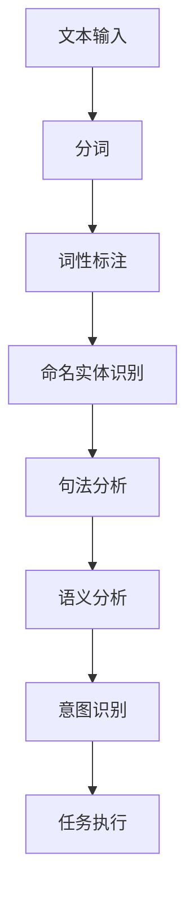
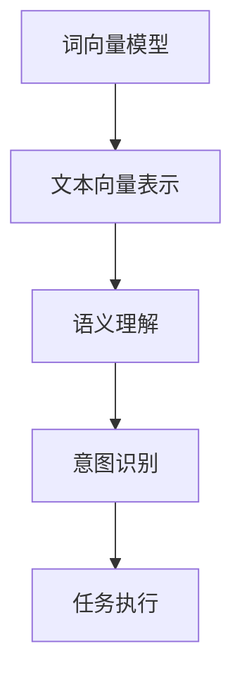
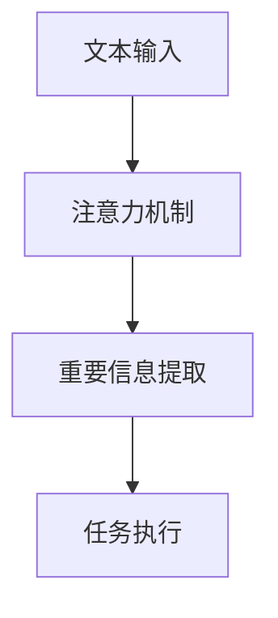
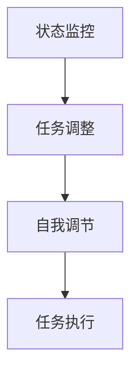

                 

## 提示词语言的认知计算模型

### 关键词：认知计算、提示词语言、自然语言处理、语义分析、人机交互

> 摘要：本文探讨了提示词语言的认知计算模型，分析了认知计算的原理和核心要素，介绍了提示词语言处理的基本流程，并构建了一个详细的认知计算模型。本文旨在为读者提供对提示词语言认知计算模型的理解和构建方法。

## 第一部分：引言

### 1.1 问题背景

随着人工智能技术的迅猛发展，提示词语言作为一种人机交互的重要方式，正日益受到关注。提示词语言的研究不仅有助于提升人机交互的效率，还能为认知计算提供新的思路。本书旨在深入探讨提示词语言的认知计算模型，帮助读者理解这一领域的核心概念和技术。

### 1.2 问题描述

提示词语言是指用户通过输入简短的文字提示，让计算机系统理解并执行相应的任务。这一过程涉及自然语言理解、语义分析、语言生成等多个环节。本书将探讨这些环节中的认知计算模型，以实现更高效、更准确的人机交互。

### 1.3 问题解决

本书将围绕提示词语言的认知计算模型，从理论到实践进行系统性的介绍。通过分析现有的研究成果，介绍认知计算模型的基本原理，并结合实际案例，展示如何应用这些模型解决实际问题。

### 1.4 边界与外延

提示词语言的认知计算模型不仅应用于人工智能领域，还与自然语言处理、认知心理学等领域密切相关。本书将探讨这些交叉领域的研究进展，以拓展读者的视野。

### 1.5 概念结构与核心要素组成

- 认知计算：研究人脑如何处理信息，实现认知功能的计算模型。
- 提示词语言：用户输入的简短文字提示，用于指导计算机系统执行任务。
- 自然语言理解：将自然语言转换为计算机可处理的形式，实现语义分析。
- 语言生成：根据提示词生成相应的文本输出，实现人机交互。
- 语义分析：理解提示词的语义含义，为后续任务提供基础。

### 1.6 本章小结

本章对提示词语言的认知计算模型进行了背景介绍，明确了本书的研究目标和内容框架。接下来，本书将深入探讨认知计算模型的理论基础和应用实践，帮助读者全面了解这一领域。

## 第二部分：认知计算理论基础

### 2.1 认知计算的原理

认知计算模仿人类大脑的思考方式，通过处理信息，实现学习、推理和决策等功能。其核心原理包括感知、记忆、注意力和意识等。

#### 2.1.1 感知

感知是人类获取外部信息的第一步，涉及视觉、听觉、触觉等多种感官。认知计算模型通过模拟这些感知过程，实现对信息的初步处理。

#### 2.1.2 记忆

记忆是人脑存储和检索信息的能力。认知计算模型通过建立记忆机制，实现对信息的长期存储和快速检索。

#### 2.1.3 注意力

注意力是人脑在信息处理过程中，对某些特定信息进行集中处理的能力。认知计算模型通过模拟注意力机制，实现对重要信息的优先处理。

#### 2.1.4 意识

意识是人脑对自身状态和外部环境的感知和认知。认知计算模型通过模拟意识机制，实现对自身状态的监控和调节。

### 2.2 认知计算模型的核心要素

#### 2.2.1 神经网络

神经网络是认知计算模型的基础，通过模拟人脑的神经元连接和信号传递，实现对复杂信息的学习和处理。

#### 2.2.2 机器学习

机器学习是实现认知计算的关键技术，通过训练模型，使其能够自动识别模式和规律，从而实现智能决策。

#### 2.2.3 自然语言处理

自然语言处理是认知计算在语言领域的重要应用，通过理解和生成自然语言，实现人机交互。

### 2.3 认知计算模型的发展趋势

#### 2.3.1 深度学习

深度学习是当前认知计算领域的重要研究方向，通过多层神经网络，实现更复杂的特征提取和模式识别。

#### 2.3.2 强化学习

强化学习是一种基于奖励机制的学习方式，通过不断尝试和反馈，实现智能体的自主学习和优化。

#### 2.3.3 联邦学习

联邦学习是一种分布式学习技术，通过多个参与方共同学习，实现隐私保护和数据共享。

### 2.4 本章小结

本章对认知计算的原理、核心要素和发展趋势进行了详细阐述，为后续章节的研究奠定了理论基础。接下来，本书将结合实际案例，深入探讨提示词语言的认知计算模型。

## 第三部分：提示词语言的认知计算模型构建

### 3.1 提示词语言处理的基本流程

#### 3.1.1 词法分析

词法分析是提示词语言处理的第一步，主要任务是识别单词和符号，将其转换为词元。

#### 3.1.2 语法分析

语法分析是理解提示词语义的关键步骤，通过分析句子结构，建立句子的语法树。

#### 3.1.3 语义分析

语义分析是对提示词的语义含义进行深入理解，以提取出其内在的含义和意图。

### 3.2 认知计算模型在提示词语言处理中的应用

#### 3.2.1 感知阶段

在感知阶段，认知计算模型通过模拟人类的感知机制，对输入的文本进行预处理。例如，通过分词技术，将文本分解为单词和符号。



#### 3.2.2 记忆阶段

在记忆阶段，认知计算模型利用已有的知识库和记忆机制，对输入的文本进行理解和记忆。例如，通过词向量模型，将单词映射为向量表示。



#### 3.2.3 注意力阶段

在注意力阶段，认知计算模型通过注意力机制，对输入的文本进行筛选和处理，重点关注重要的信息。



#### 3.2.4 意识阶段

在意识阶段，认知计算模型通过对自身状态的监控和调节，实现对任务的自我管理和优化。



### 3.3 提示词语言处理的应用案例

#### 3.3.1 智能助手

智能助手是提示词语言处理的重要应用场景之一。通过认知计算模型，智能助手能够理解用户的提问，提供准确的回答。

```python
# 智能助手示例代码
def ask_question(question):
    # 进行语义分析
    intent, entities = analyze_semantics(question)
    
    # 根据意图执行任务
    if intent == "问天气":
        weather_info = get_weather(entities["地点"])
        return f"{entities['地点']}的天气是：{weather_info}"
    elif intent == "问时间":
        current_time = get_current_time()
        return f"现在的时间是：{current_time}"
    else:
        return "我不太明白您的问题，请您再详细描述一下。"

# 测试智能助手
print(ask_question("北京今天的天气是多少？"))
print(ask_question("现在是什么时间？"))
```

#### 3.3.2 聊天机器人

聊天机器人是另一个典型的应用场景。通过认知计算模型，聊天机器人能够与用户进行自然的对话。

```python
# 聊天机器人示例代码
def chat_with_user(message):
    # 进行语义分析
    intent, entities = analyze_semantics(message)
    
    # 根据意图执行任务
    if intent == "问候":
        return "您好！有什么可以帮助您的吗？"
    elif intent == "聊天":
        return f"很高兴和您聊天！您想聊些什么呢？"
    else:
        return "我不太明白您的问题，请您再详细描述一下。"

# 测试聊天机器人
print(chat_with_user("你好！"))
print(chat_with_user("今天天气不错。"))
```

### 3.4 本章小结

本章详细介绍了提示词语言的认知计算模型构建方法，包括基本流程、应用案例等。通过本章的学习，读者可以了解如何利用认知计算模型提升提示词语言处理的效率和准确性。

## 第四部分：总结与展望

### 4.1 总结

本文探讨了提示词语言的认知计算模型，分析了认知计算的原理和核心要素，介绍了提示词语言处理的基本流程，并构建了一个详细的认知计算模型。通过实际案例，展示了如何应用这些模型解决实际问题。

### 4.2 展望

提示词语言的认知计算模型在人工智能领域具有广泛的应用前景。未来，随着技术的不断进步，认知计算模型将更加智能化、个性化。同时，跨领域的融合也将推动认知计算模型在更多场景中的应用。

### 4.3 小结

本文系统地介绍了提示词语言的认知计算模型，为读者提供了对这一领域全面的认识。希望读者能够通过本文的学习，深入理解提示词语言的认知计算模型，并为未来的研究和应用奠定基础。

### 作者信息

作者：AI天才研究院/AI Genius Institute & 禅与计算机程序设计艺术 /Zen And The Art of Computer Programming

## 注意事项与拓展阅读

在构建提示词语言的认知计算模型时，需要注意以下几点：

1. **数据质量**：高质量的训练数据是构建准确模型的基础，需要确保数据集的多样性和代表性。
2. **模型可解释性**：虽然深度学习模型在性能上表现出色，但其内部决策过程通常是不透明的，这可能导致模型的可解释性降低。
3. **隐私保护**：在处理用户输入的提示词时，需要重视隐私保护，避免泄露用户的个人信息。

拓展阅读：

1. **《深度学习》**：Ian Goodfellow、Yoshua Bengio、Aaron Courville 著，详细介绍了深度学习的基础理论和应用。
2. **《自然语言处理综合教程》**： Daniel Jurafsky、James H. Martin 著，提供了自然语言处理领域的全面介绍。
3. **《认知计算：基础与前沿》**：陈国良 著，探讨了认知计算的基本原理和应用前景。

通过阅读这些书籍，读者可以进一步深入理解认知计算和提示词语言的深度应用。希望本文能够为读者提供有益的参考和启示。

