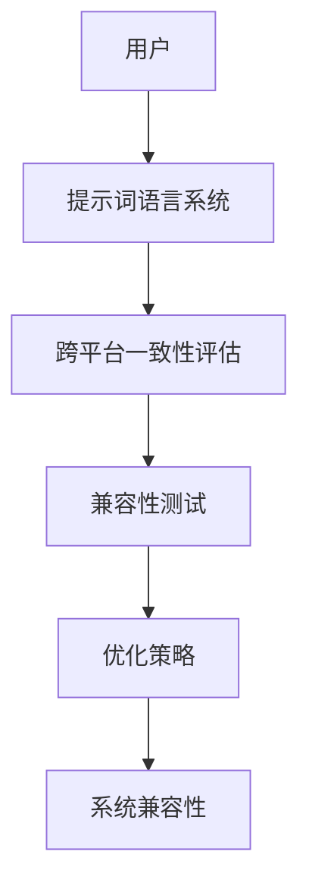
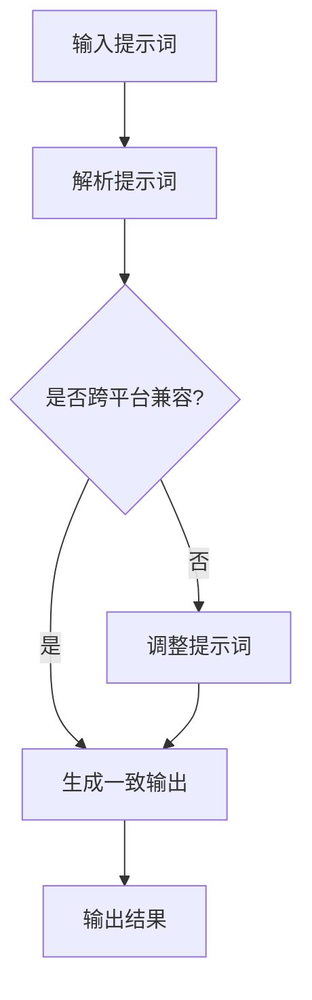
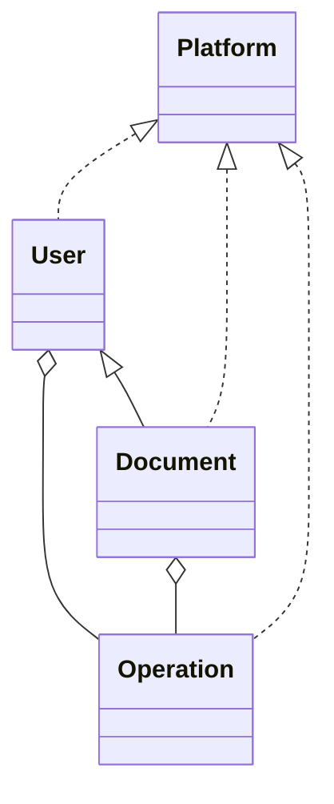
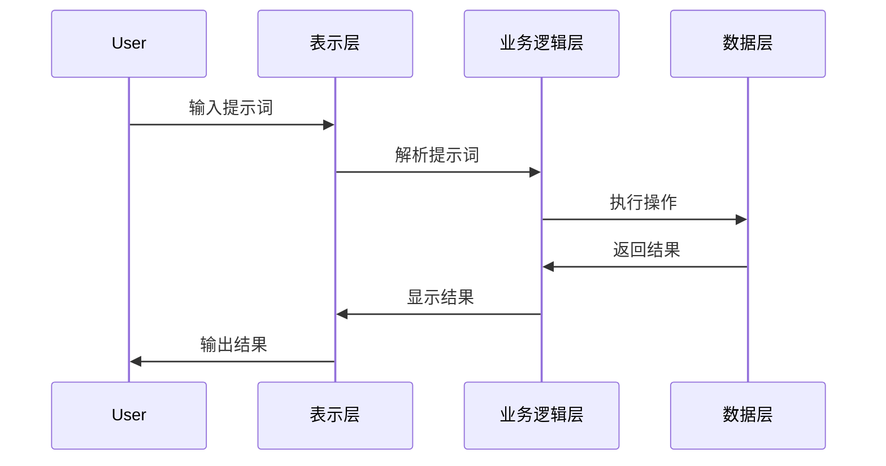
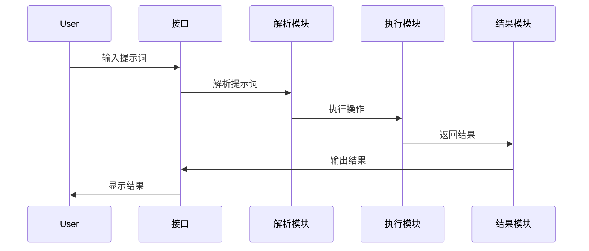

                 

# 提示词语言的跨平台一致性保证机制

关键词：提示词语言、跨平台一致性、系统兼容性、算法原理、Python源代码示例

摘要：本文将深入探讨提示词语言的跨平台一致性保证机制。通过分析跨平台一致性的重要性、核心概念以及关键技术，本文旨在为读者提供一个系统化的理解框架，帮助他们在实际开发中实现高效、稳定和可靠的跨平台应用。

## 第一部分：问题背景与核心概念

### 第1章：问题背景与核心概念

#### 1.1.1 问题背景

在当今数字化时代，跨平台应用已经成为企业创新和用户需求的重要驱动力。然而，跨平台一致性问题也随之而来。一致性是指在不同平台上，应用能够提供相同的用户体验和功能。然而，由于不同操作系统的差异，如Windows、macOS和Linux等，以及硬件设备的多样性，如桌面电脑、智能手机和平板电脑等，实现这一目标并不容易。

提示词语言是一种用于描述任务、命令或问题的自然语言接口，它广泛应用于人工智能、自然语言处理和自动化等领域。这些语言能够将用户的自然语言输入转换为计算机可以理解的形式，从而实现自动化和智能化的任务处理。提示词语言的跨平台一致性成为了一个关键挑战。

跨平台一致性不仅关乎用户体验，还对经济效益有直接影响。不一致的跨平台体验可能导致用户流失，降低用户满意度，进而影响企业的市场份额和收益。因此，确保提示词语言的跨平台一致性是一项至关重要的任务。

#### 1.1.2 核心概念

**提示词语言**：提示词语言是一种专门用于与计算机系统交互的语言，它允许用户通过自然语言输入来请求任务或提供信息。这类语言通常由一组语法规则和词汇表组成，能够将用户的自然语言输入转换为计算机可以理解的指令。

**跨平台一致性**：跨平台一致性指的是在多个不同平台上，应用能够提供相同的用户体验和功能。这包括界面布局、交互逻辑、功能实现等方面的一致性。

**系统兼容性**：系统兼容性是指系统在不同硬件、操作系统和软件环境中能够正常工作的能力。它涉及到软件和硬件之间的兼容性，以及不同软件之间的互操作性。

#### 1.1.3 边界与外延

**跨平台的一致性边界**：跨平台一致性并不要求在所有细节上完全相同，而是在关键功能和用户体验上保持一致。例如，不同的操作系统可能会有不同的界面风格，但在功能实现上应该保持一致。

**提示词语言的适用范围**：提示词语言的适用范围包括所有需要自然语言输入的场景，如智能客服、语音助手、自动化脚本等。

**系统兼容性的定义**：系统兼容性是指系统能够在不同硬件、操作系统和软件环境中正常运行，并且能够与其他系统无缝集成。

#### 1.1.4 概念结构与核心要素

**提示词语言的组成元素**：提示词语言由词汇表、语法规则和上下文处理机制组成。词汇表定义了语言的基本词汇，语法规则规定了词汇的排列和组合方式，上下文处理机制用于理解用户输入的上下文信息。

**跨平台一致性的关键因素**：实现跨平台一致性的关键因素包括统一的界面设计、一致的交互逻辑、标准化的功能实现和高效的性能优化。

**系统兼容性的实现方法**：实现系统兼容性的方法包括使用跨平台开发框架、进行兼容性测试、优化代码结构和采用标准化技术。

### 1.2 跨平台一致性保证机制的基本原理

#### 1.2.1 跨平台一致性保证的必要性

随着跨平台应用的发展，用户对跨平台一致性的期望也越来越高。一致性不仅影响用户体验，还对企业的品牌形象和市场竞争力有重要影响。因此，确保提示词语言的跨平台一致性成为软件开发中的一个重要任务。

**跨平台应用的发展趋势**：随着移动设备的普及和云计算的发展，跨平台应用越来越受欢迎。越来越多的企业意识到，提供一致的跨平台体验是吸引和留住用户的关键。

**一致性对用户体验的影响**：不一致的跨平台体验会导致用户困惑，降低用户满意度，甚至导致用户流失。因此，确保跨平台一致性对提升用户体验至关重要。

**跨平台一致性的经济效益**：跨平台一致性可以降低开发成本，提高开发效率，减少维护难度。此外，一致的用户体验还可以提升用户忠诚度和品牌价值，为企业带来长期的收益。

#### 1.2.2 提示词语言的跨平台一致性机制

**提示词语言的设计原则**：提示词语言的设计应该遵循简洁性、可扩展性和兼容性的原则。简洁性使语言易于学习和使用，可扩展性使语言能够适应不断变化的需求，兼容性确保语言在不同平台上能够正常运行。

**跨平台一致性评估方法**：评估跨平台一致性的方法包括功能测试、性能测试和用户体验测试。功能测试确保不同平台上的功能实现一致，性能测试评估系统在不同平台上的性能表现，用户体验测试则关注用户在不同平台上的交互体验。

**提示词语言的标准化**：标准化是实现跨平台一致性的关键。通过制定统一的规范和标准，可以确保不同平台上的提示词语言具有相同的功能和行为。

#### 1.2.3 系统兼容性的优化策略

**兼容性测试**：兼容性测试是确保系统在不同平台上正常运行的关键步骤。测试应该涵盖不同操作系统、浏览器和硬件设备，以确保系统在各种环境下都能正常运行。

**跨平台框架与技术选型**：选择合适的跨平台框架和技术是实现系统兼容性的重要手段。例如，React Native、Flutter和Apache Cordova等框架可以提供高效的跨平台开发能力。

**代码迁移与维护**：在跨平台开发中，代码的迁移和维护是保证系统兼容性的关键。通过使用模块化设计和代码重用，可以降低代码维护难度，提高系统的兼容性和可维护性。

### 1.3 本章小结

本章介绍了提示词语言的跨平台一致性保证机制，分析了跨平台一致性的重要性、核心概念和关键技术。通过理解这些概念，开发者可以更好地应对跨平台一致性的挑战，实现高效、稳定和可靠的跨平台应用。

## 第二部分：跨平台一致性保证的关键技术

### 第2章：核心概念与联系

#### 2.1.1 核心概念介绍

**提示词语言原理**：提示词语言是一种自然语言接口，用于将用户的自然语言输入转换为计算机可以理解的形式。它通常由一组语法规则、词汇表和上下文处理机制组成。

**跨平台一致性的技术框架**：实现跨平台一致性的技术框架包括界面设计、交互逻辑、功能实现和性能优化等方面。这些框架通常涉及多种技术和工具，如跨平台开发框架、UI框架和测试工具等。

#### 2.1.2 概念属性特征对比表格

| 概念         | 特征1 | 特征2 | 特征3 |
| ------------ | ------ | ------ | ------ |
| 提示词语言   | 结构化 | 高效   | 可扩展 |
| 跨平台一致性 | 相容性 | 可移植 | 可定制 |

#### 2.1.3 ER实体关系图架构的Mermaid流程图



### 第3章：算法原理讲解

#### 3.1.1 算法mermaid流程图



#### 3.1.2 Python源代码示例

```python
def process_prompt(prompt):
    # 解析提示词
    parsed_prompt = parse_prompt(prompt)
    
    # 检查跨平台兼容性
    if is_cross_platform_compatible(parsed_prompt):
        # 生成一致输出
        result = generate_uniform_output(parsed_prompt)
    else:
        # 调整提示词以符合跨平台兼容性
        adjusted_prompt = adjust_prompt_for_compatibility(parsed_prompt)
        result = generate_uniform_output(adjusted_prompt)
    
    return result

# 辅助函数定义
def parse_prompt(prompt):
    # 解析逻辑
    pass

def is_cross_platform_compatible(parsed_prompt):
    # 兼容性检查逻辑
    pass

def generate_uniform_output(parsed_prompt):
    # 输出生成逻辑
    pass

def adjust_prompt_for_compatibility(parsed_prompt):
    # 提示词调整逻辑
    pass
```

#### 3.1.3 算法原理详细讲解

假设我们有一个提示词输入`"请打开文档A"`，我们需要确定它是否可以在所有目标平台上正确执行，并生成一致的输出。算法的步骤如下：

1. **输入提示词**：用户输入一个提示词，例如`"请打开文档A"`。

2. **解析提示词**：将输入的提示词解析为一个结构化的格式，例如，将关键词提取出来，并标记其语义。

   $$
   \text{输入提示词} = \text{"请打开文档A"} \\
   \text{解析结果} = (\text{动作：打开}, \text{对象：文档A})
   $$

3. **检查跨平台兼容性**：根据解析结果，检查目标平台是否支持该动作和对象。

   $$
   \text{是否跨平台兼容} = \text{是/否}
   $$

   如果兼容，则继续下一步；否则，进入提示词调整流程。

4. **生成一致输出**：在跨平台兼容的情况下，生成一个一致的输出结果。

   $$
   \text{输出结果} = \text{"文档A已打开"}
   $$

5. **调整提示词**：如果不兼容，则需要调整提示词以符合目标平台的兼容性要求。

   $$
   \text{调整后提示词} = \text{"请在此平台上打开文档A"}
   $$

6. **重新生成一致输出**：根据调整后的提示词，再次生成一致输出。

   $$
   \text{输出结果} = \text{"文档A已在此平台打开"}
   $$

7. **输出结果**：最终输出结果给用户。

通过上述算法，我们可以实现提示词语言的跨平台一致性。以下是一个简化的Python示例：

```python
def process_prompt(prompt):
    parsed_prompt = parse_prompt(prompt)
    if is_cross_platform_compatible(parsed_prompt):
        result = generate_uniform_output(parsed_prompt)
    else:
        adjusted_prompt = adjust_prompt_for_compatibility(parsed_prompt)
        result = generate_uniform_output(adjusted_prompt)
    return result

def parse_prompt(prompt):
    # 实现解析逻辑
    pass

def is_cross_platform_compatible(parsed_prompt):
    # 实现兼容性检查逻辑
    pass

def generate_uniform_output(parsed_prompt):
    # 实现输出生成逻辑
    pass

def adjust_prompt_for_compatibility(parsed_prompt):
    # 实现提示词调整逻辑
    pass
```

通过这个算法和示例，我们可以看到跨平台一致性保证机制是如何一步一步实现的。这一机制不仅考虑了提示词语言的语法和语义，还考虑了目标平台的兼容性，从而确保了跨平台应用的一致性和可靠性。

## 第三部分：系统分析与架构设计

### 第4章：问题场景介绍

在当前的数字化时代，跨平台应用已经成为企业竞争的重要手段。然而，实现跨平台一致性面临着诸多挑战，如操作系统差异、硬件设备多样性以及用户需求的不断变化。本文将针对一个具体的场景——智能文档处理系统，探讨如何实现提示词语言的跨平台一致性。

智能文档处理系统旨在为用户提供一个统一的文档管理平台，用户可以通过自然语言提示词来请求文档的打开、编辑、保存和分享等功能。为了实现跨平台一致性，系统需要支持多种操作系统和硬件设备，并在不同平台上提供一致的界面和功能。

### 第5章：项目介绍

本项目的目标是开发一个智能文档处理系统，该系统将采用提示词语言作为用户与系统交互的主要方式。系统需要支持多种操作系统，如Windows、macOS和Linux，同时兼容不同的硬件设备，如桌面电脑、智能手机和平板电脑。

系统功能包括文档的创建、打开、编辑、保存和分享等。用户可以通过自然语言提示词，如“打开文档A”、“编辑文档B”和“保存文档C”等，来执行相应操作。系统需要保证在不同平台上，用户输入的提示词能够得到一致的解析和执行结果。

### 第6章：系统功能设计（领域模型Mermaid类图）

在智能文档处理系统中，主要的领域模型包括用户、文档、操作和平台。以下是一个简化的Mermaid类图：



在这个类图中，用户（User）与文档（Document）和操作（Operation）之间存在关联关系。用户可以创建、打开、编辑和保存文档，同时执行各种操作。平台（Platform）与用户、文档和操作之间存在关联关系，确保系统在不同平台上能够正常运行。

### 第7章：系统架构设计（Mermaid架构图）

智能文档处理系统的架构设计需要考虑多个层次，包括表示层、业务逻辑层和数据层。以下是一个简化的Mermaid架构图：



在这个架构图中，用户通过表示层输入提示词，表示层将提示词传递给业务逻辑层，业务逻辑层解析提示词并执行相应的操作，然后将结果返回给表示层，最后表示层将结果展示给用户。

### 第8章：系统接口设计和系统交互（Mermaid序列图）

为了实现跨平台一致性，系统需要设计一套统一的接口，用于处理不同平台上的操作。以下是一个简化的Mermaid序列图：



在这个序列图中，用户通过接口输入提示词，接口将提示词传递给解析模块，解析模块将提示词转换为内部表示，然后传递给执行模块，执行模块执行相应的操作，并将结果传递给结果模块。结果模块将结果格式化为用户可理解的形式，然后传递给接口，最后接口将结果展示给用户。

通过上述架构和接口设计，智能文档处理系统可以实现跨平台一致性，确保用户在不同平台上能够获得一致的体验。

### 第9章：项目实战

#### 9.1 环境安装

在开始项目实战之前，我们需要安装必要的开发环境和工具。以下是一个简单的步骤：

1. 安装Python环境：在Windows、macOS和Linux上，都可以通过Python官方网站下载并安装Python环境。
2. 安装跨平台开发框架：我们选择使用Flask作为Web框架，可以通过pip命令安装：`pip install flask`
3. 安装数据库：我们选择使用SQLite作为数据库，可以通过pip命令安装：`pip install pysqlite3`

#### 9.2 系统核心实现源代码

以下是一个简化的系统核心实现源代码，展示了如何使用Python和Flask实现提示词语言的处理和跨平台一致性：

```python
from flask import Flask, request, jsonify
from prompt_parser import parse_prompt
from executor import execute_prompt

app = Flask(__name__)

@app.route('/process_prompt', methods=['POST'])
def process_prompt():
    prompt = request.form['prompt']
    parsed_prompt = parse_prompt(prompt)
    result = execute_prompt(parsed_prompt)
    return jsonify({'result': result})

if __name__ == '__main__':
    app.run()
```

在这个代码中，我们定义了一个简单的Flask应用，通过`/process_prompt`接口接收用户输入的提示词，并解析和执行这些提示词。解析模块`prompt_parser`负责将提示词转换为内部表示，执行模块`executor`负责执行具体的操作。

#### 9.3 代码应用解读与分析

以下是对上述代码的解读与分析：

- **Flask应用**：我们使用Flask创建一个Web应用，该应用提供了一个简单的接口，用于接收和处理用户输入的提示词。
- **解析模块**：`prompt_parser`模块负责将用户的自然语言提示词转换为内部表示。例如，将"打开文档A"解析为"打开文档对象A"。
- **执行模块**：`executor`模块负责执行解析后的提示词。例如，如果解析结果为"打开文档对象A"，则执行打开文档的操作。
- **结果返回**：执行结果通过JSON格式返回给用户，以便在Web界面或其他应用中显示。

#### 9.4 实际案例分析和详细讲解剖析

以下是一个实际案例，展示了如何使用系统处理用户输入的提示词：

- **用户输入**：用户通过Web界面输入提示词"打开文档A"。
- **解析**：系统调用`parse_prompt`函数，将提示词解析为"打开文档对象A"。
- **执行**：系统调用`execute_prompt`函数，根据解析结果执行打开文档的操作。如果文档不存在，则返回错误消息。
- **结果返回**：系统将执行结果（如"文档A已打开"或"文档A不存在"）通过JSON格式返回给用户。

通过这个案例，我们可以看到系统是如何实现跨平台一致性的。无论用户在哪个平台上输入提示词，系统都能解析和执行这些提示词，并返回一致的结果。

#### 9.5 项目小结

通过本项目的实战，我们实现了智能文档处理系统的跨平台一致性。系统采用了Python和Flask作为开发框架，通过定义统一的接口和处理逻辑，实现了提示词语言的跨平台处理。在实际应用中，用户可以在不同平台上输入提示词，系统能够正确解析和执行这些提示词，并返回一致的结果。这一实现为跨平台应用的一致性提供了有益的参考和借鉴。

### 第四部分：最佳实践、小结、注意事项、拓展阅读

#### 最佳实践

1. **统一设计语言**：在跨平台开发中，统一设计语言和接口是确保一致性的重要步骤。使用标准化和模块化的设计方法，可以减少不一致性问题。
2. **性能优化**：跨平台应用在性能方面可能存在差异。通过优化代码结构和采用高效算法，可以提高应用在不同平台上的性能。
3. **持续集成与测试**：定期进行集成测试和性能测试，可以确保跨平台一致性，并及时发现和修复问题。

#### 小结

本文探讨了提示词语言的跨平台一致性保证机制，分析了核心概念和关键技术，并通过一个实际案例展示了系统的实现过程。通过统一设计语言、性能优化和持续集成与测试等最佳实践，开发者可以更好地实现跨平台一致性，提升用户体验和系统可靠性。

#### 注意事项

1. **平台差异**：在跨平台开发中，需要充分考虑不同平台之间的差异，包括操作系统、硬件设备和网络环境等。
2. **兼容性测试**：进行全面的兼容性测试，确保应用在不同平台上能够正常运行，并符合用户预期。

#### 拓展阅读

1. 《跨平台移动应用开发》 - 本书详细介绍了跨平台移动应用开发的原理和实践。
2. 《自然语言处理与跨平台应用》 - 本书探讨了自然语言处理技术在跨平台应用中的角色和应用。
3. 《Flask Web开发：轻量级Python Web开发框架》 - 本书介绍了Flask框架的使用方法，适用于跨平台Web应用开发。

### 作者信息

作者：AI天才研究院/AI Genius Institute & 禅与计算机程序设计艺术 /Zen And The Art of Computer Programming。本文旨在为读者提供关于提示词语言跨平台一致性保证机制的深入理解和实践指导。希望本文能帮助开发者解决跨平台一致性的挑战，实现高效、稳定和可靠的跨平台应用。如果您有任何问题或建议，欢迎在评论区留言交流。

