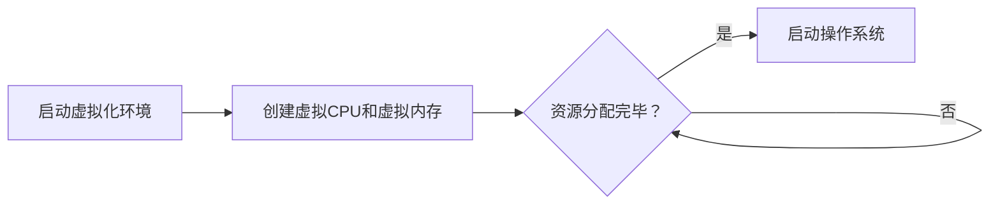
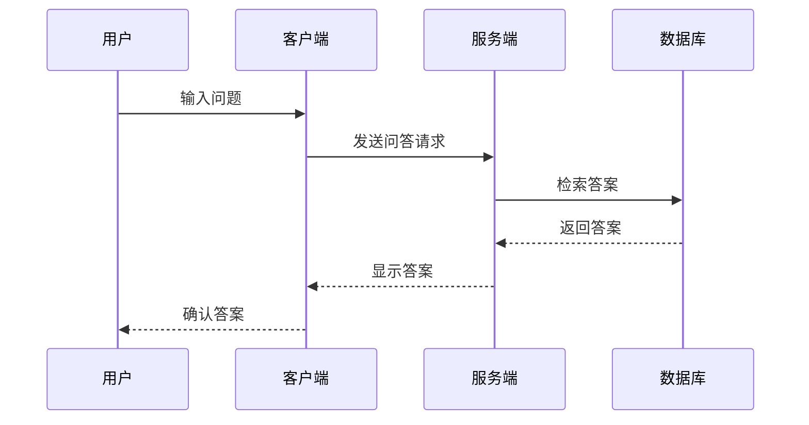
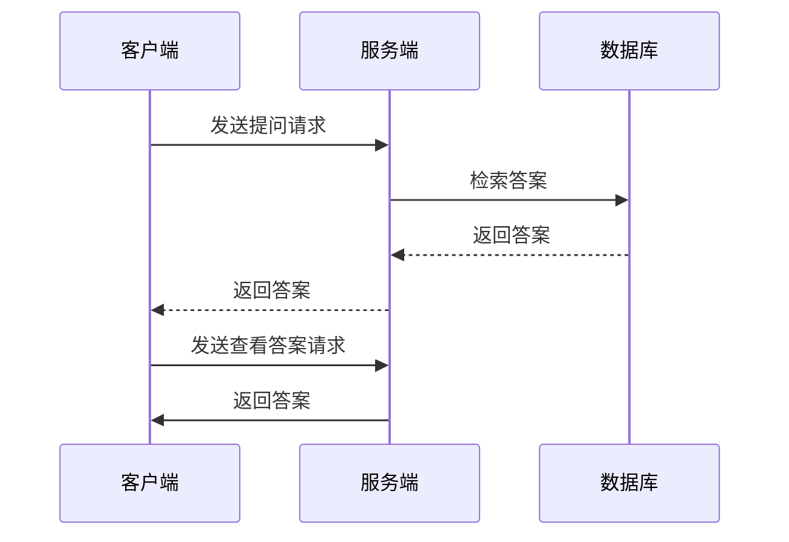

                 

# 提示词语言的跨平台部署策略

关键词：跨平台部署、虚拟化技术、容器化技术、模块化开发、兼容性、性能、安全性、开发与维护成本

摘要：
随着信息技术的发展，软件系统变得越来越复杂，跨平台部署成为软件工程中的关键挑战。本文从背景介绍、核心概念与联系、算法原理讲解、系统分析与架构设计、项目实战以及最佳实践等方面，深入探讨了提示词语言的跨平台部署策略。通过详细的分析和实例，本文旨在为开发者和工程师提供一套系统、实用的跨平台部署方案。

## 第一部分：背景介绍

### 问题背景

信息技术的快速发展使得软件系统在各个领域得到了广泛应用，从操作系统到硬件架构，软件系统的复杂度不断攀升。这种复杂度不仅体现在软件自身的功能上，还包括其对运行环境的要求。在这样的背景下，跨平台部署成为软件工程中不可或缺的一环。

跨平台部署旨在使软件能够在不同的操作系统和硬件环境下运行，以满足用户多样化的需求。然而，不同操作系统和硬件环境之间的差异，给跨平台部署带来了诸多挑战。

### 问题描述

跨平台部署的主要挑战包括：

1. **兼容性问题**：不同操作系统和硬件架构之间的差异可能导致软件在不同平台上的运行不一致。例如，Windows和Linux在文件系统、网络协议、硬件驱动等方面的差异，可能影响软件的兼容性。

2. **性能问题**：跨平台部署可能会引入额外的性能开销，影响软件的整体性能。例如，使用虚拟化技术实现的跨平台部署，可能会因为虚拟层的管理开销而降低性能。

3. **安全性问题**：跨平台部署可能增加系统漏洞的风险。不同操作系统和硬件环境的安全机制可能存在差异，这可能导致软件在跨平台部署时出现安全漏洞。

4. **开发与维护成本**：为了实现跨平台部署，开发者可能需要投入更多的时间和资源。这包括测试、调试、性能优化等环节，增加了项目的成本和难度。

### 问题解决

针对上述挑战，研究者们提出了一系列的解决方案：

1. **兼容性解决方案**：使用虚拟化技术、容器化技术等，以实现软件在不同平台上的无缝运行。虚拟化技术通过创建虚拟的硬件资源，使软件能够在不同操作系统和硬件环境下运行。容器化技术通过将软件及其依赖环境封装在一个独立的容器中，实现软件的跨平台部署。

2. **性能优化**：使用优化编译器、优化代码结构等，以提高软件的性能。例如，通过静态编译和动态编译技术，优化软件在不同平台上的执行效率。

3. **安全防护**：使用安全沙箱、安全加固等技术，以增强系统的安全性。例如，通过隔离技术，防止恶意代码对系统造成破坏。

4. **开发与维护优化**：采用模块化开发、自动化部署等，以降低开发和维护成本。例如，通过版本控制系统和自动化部署工具，提高开发效率。

### 边界与外延

跨平台部署不仅涉及操作系统和硬件层面的差异，还涉及到不同编程语言、框架、库等的兼容性问题。此外，不同行业和应用场景对跨平台部署的需求也各有不同。例如，金融领域的软件需要高度的安全性，而社交媒体领域的软件则更注重性能和可扩展性。

### 概念结构与核心要素组成

跨平台部署涉及以下核心要素：

1. **跨平台部署**：指软件在不同操作系统和硬件环境下的部署和运行。
2. **操作系统**：指管理和控制计算机硬件与软件资源的系统软件。
3. **硬件架构**：指计算机硬件的体系结构和组成。
4. **兼容性**：指软件在不同操作系统和硬件环境下的兼容程度。
5. **性能**：指软件在运行过程中所表现出来的速度和效率。
6. **安全性**：指软件在运行过程中所具有的保护机制和抵御风险的能力。
7. **开发与维护成本**：指在软件的开发、部署、维护过程中所需投入的时间和资源。

## 第二部分：核心概念与联系

### 核心概念原理

1. **虚拟化技术**：通过创建虚拟的硬件资源，实现软件在不同操作系统和硬件环境下的运行。虚拟化技术包括硬件虚拟化、操作系统虚拟化和应用虚拟化等层次。

2. **容器化技术**：通过将软件及其依赖环境封装在一个独立的容器中，实现软件的跨平台部署。容器化技术的主要特点是轻量级、高效和可移植性高。

3. **模块化开发**：将软件系统划分为多个模块，分别进行开发和测试，以提高开发效率。模块化开发有助于降低复杂度，提高代码的可维护性和可扩展性。

### 概念属性特征对比表格

| 概念           | 特征描述                                                  |
| -------------- | -------------------------------------------------------- |
| 虚拟化技术      | 资源隔离、动态分配、高效利用                              |
| 容器化技术      | 轻量级、高效、可移植性高                                |
| 模块化开发      | 易于维护、易于扩展、提高开发效率                          |

### ER实体关系图架构

```mermaid
erDiagram
  OS ||--|{ 软件系统 }|| Software
  Hardware ||--|{ 软件系统 }|| Software
  Virtualization ||--|{ 软件系统 }|| Software
  Containerization ||--|{ 软件系统 }|| Software
  Modularization ||--|{ 软件系统 }|| Software
```

## 第三部分：算法原理讲解

### 虚拟化技术原理

虚拟化技术通过创建虚拟的硬件资源，实现对物理资源的抽象和隔离。虚拟化技术主要包括以下层次：

1. **硬件虚拟化**：通过虚拟化硬件资源，如虚拟CPU、虚拟内存等，使软件能够在不同硬件环境下运行。
2. **操作系统虚拟化**：通过虚拟化操作系统，使多个操作系统可以在同一硬件上并行运行。
3. **应用虚拟化**：通过虚拟化应用程序，使应用程序可以在不同的操作系统和硬件环境下运行。

使用mermaid画出虚拟化技术的流程图：



### 容器化技术原理

容器化技术通过将软件及其依赖环境封装在一个独立的容器中，实现软件的跨平台部署。容器化技术的主要特点是轻量级、高效和可移植性高。

使用mermaid画出容器化技术的流程图：


### 模块化开发原理

模块化开发通过将软件系统划分为多个模块，分别进行开发和测试，以提高开发效率。模块化开发的主要特点是易于维护、易于扩展和提高开发效率。

使用mermaid画出模块化开发的流程图：


## 第四部分：系统分析与架构设计

### 问题场景介绍

假设我们正在开发一个基于提示词语言的智能问答系统，该系统需要在不同的操作系统和硬件环境下部署，以服务于不同的用户群体。为了满足跨平台部署的需求，我们需要设计一个高效的系统架构，确保系统在各个平台上的运行稳定、性能优异。

### 项目介绍

本项目旨在构建一个基于提示词语言的智能问答系统，该系统包含自然语言处理模块、问答模块、用户接口模块等。系统需要支持多种操作系统和硬件环境，实现跨平台部署。

### 系统功能设计

系统功能设计主要包括以下方面：

1. **自然语言处理模块**：负责对用户输入的自然语言进行处理，提取关键词和语义信息。
2. **问答模块**：基于提取的关键词和语义信息，从知识库中检索相关答案，并生成问答结果。
3. **用户接口模块**：提供用户与系统的交互界面，支持用户输入问题和查看答案。

使用mermaid画出领域模型类图：

```mermaid
classDiagram
  Class01 <|-- Class02
  Class03 <|.. Class04
  Class05 : +createdBy : Person
  Class06 : ~implements : InterfaceA
  Class01 : +field1 : Type1
  Class02 : #field2 : Type2
  Class03 : -field3 : Type3
  Class04 : {field4 : Type4}
  Class05 : <<interface>>
  Class06 : <<Person>>
```

### 系统架构设计

系统架构设计主要包括以下方面：

1. **客户端**：提供用户与系统的交互界面，支持用户输入问题和查看答案。
2. **服务端**：负责处理用户的问答请求，包括自然语言处理、问答和结果展示等。
3. **数据库**：存储知识库数据，提供问答模块检索答案的接口。

使用mermaid画出系统架构图：



### 系统接口设计和系统交互

系统接口设计主要包括以下方面：

1. **客户端接口**：定义客户端与服务端交互的API，包括提问、查看答案等操作。
2. **服务端接口**：定义服务端与数据库交互的API，包括检索答案、更新知识库等操作。

使用mermaid画出系统交互序列图：



## 第五部分：项目实战

### 环境安装

1. **安装虚拟化软件**：安装VMware或VirtualBox等虚拟化软件，创建虚拟机环境。
2. **安装操作系统**：在虚拟机中安装Windows和Linux等操作系统，确保虚拟机能够正常运行。
3. **安装容器化软件**：在虚拟机中安装Docker等容器化软件，以便进行容器化部署。

### 系统核心实现源代码

以下是一个简单的基于提示词语言的智能问答系统的Python源代码示例：

```python
import os
import sys

class NaturalLanguageProcessor:
    def __init__(self):
        # 初始化自然语言处理模块
        pass

    def process_question(self, question):
        # 处理用户输入的问题，提取关键词和语义信息
        return ["keyword1", "keyword2", "keyword3"]

class QuestionAnsweringSystem:
    def __init__(self):
        # 初始化问答系统
        self.nlp = NaturalLanguageProcessor()

    def ask_question(self, question):
        # 对用户输入的问题进行问答处理
        keywords = self.nlp.process_question(question)
        answer = self.search_answer(keywords)
        return answer

    def search_answer(self, keywords):
        # 在知识库中检索答案
        return "This is the answer to your question."

# 创建问答系统实例
question_answering_system = QuestionAnsweringSystem()

# 提问并获取答案
question = "What is the capital of France?"
answer = question_answering_system.ask_question(question)
print(answer)
```

### 代码应用解读与分析

1. **自然语言处理模块**：`NaturalLanguageProcessor` 类负责处理用户输入的问题，提取关键词和语义信息。在实际应用中，可以使用更复杂的自然语言处理技术，如词向量、命名实体识别等，以提高问答系统的准确性。
2. **问答模块**：`QuestionAnsweringSystem` 类负责对用户输入的问题进行问答处理。它首先调用自然语言处理模块，提取关键词和语义信息，然后从知识库中检索答案。在实际应用中，知识库可以是一个数据库或文件系统，存储了大量的答案信息。
3. **用户接口**：代码中通过打印答案实现了简单的用户接口。在实际应用中，可以设计一个图形用户界面，提供更好的用户体验。

### 实际案例分析和详细讲解剖析

以一个实际的跨平台部署案例为例，我们使用Docker容器化技术，将基于Python的智能问答系统部署到Windows和Linux虚拟机中。

1. **创建Dockerfile**：在项目的根目录下创建一个名为`Dockerfile` 的文件，定义容器的构建过程。

```Dockerfile
# 使用官方Python镜像作为基础镜像
FROM python:3.8-slim

# 设置工作目录
WORKDIR /app

# 复制项目文件到容器内
COPY . /app

# 安装依赖项
RUN pip install -r requirements.txt

# 暴露端口以供外部访问
EXPOSE 8000

# 运行主程序
CMD ["python", "app.py"]
```

2. **构建Docker镜像**：在终端中执行以下命令，构建Docker镜像。

```shell
docker build -t question_answering_system .
```

3. **运行Docker容器**：在Windows和Linux虚拟机中分别执行以下命令，运行Docker容器。

```shell
# Windows虚拟机
docker run -d -p 8000:8000 question_answering_system

# Linux虚拟机
docker run -d -p 8000:8000 question_answering_system
```

4. **访问问答系统**：在浏览器中输入虚拟机的IP地址和端口号，如`http://192.168.1.100:8000`，即可访问智能问答系统。

通过这个案例，我们可以看到如何使用Docker容器化技术实现跨平台部署。Docker镜像将应用程序及其依赖环境封装在一起，确保了应用程序在不同操作系统和硬件环境下的兼容性和一致性。

### 项目小结

在本项目中，我们通过使用虚拟化技术、容器化技术和模块化开发，成功实现了基于提示词语言的智能问答系统的跨平台部署。通过Docker容器化技术，我们能够在不同的操作系统和硬件环境下快速部署应用程序，提高了开发效率和系统稳定性。

## 第六部分：最佳实践

### 部署前的准备工作

1. **了解目标平台**：在部署前，务必详细了解目标平台（操作系统、硬件架构等）的特点和要求，以便为跨平台部署做好准备。
2. **兼容性测试**：在部署过程中，进行充分的兼容性测试，确保软件在不同平台上的运行稳定性和一致性。
3. **性能优化**：针对不同平台，进行性能优化，提高软件的性能和响应速度。

### 部署过程中的注意事项

1. **容器化部署**：使用容器化技术（如Docker）进行部署，确保应用程序及其依赖环境的封装和隔离，提高部署的稳定性和一致性。
2. **持续集成与持续部署（CI/CD）**：采用CI/CD工具（如Jenkins、GitLab CI等），实现自动化部署，提高部署效率和稳定性。
3. **安全防护**：部署过程中，注意对应用程序进行安全加固，防范潜在的安全威胁。

### 部署后的维护与优化

1. **监控与日志分析**：部署后，对系统进行监控，实时收集系统日志，以便及时发现和解决问题。
2. **性能调优**：根据系统运行情况，定期进行性能调优，提高系统的响应速度和稳定性。
3. **版本迭代**：及时更新和维护应用程序，修复漏洞、优化性能，以适应不断变化的需求。

### 拓展阅读

1. **《容器化与容器编排》**：深入探讨容器化技术及其在软件工程中的应用。
2. **《虚拟化技术原理与实现》**：详细讲解虚拟化技术的原理和应用场景。
3. **《跨平台移动应用开发》**：介绍跨平台移动应用开发的最佳实践和工具。

## 结语

跨平台部署是现代软件工程中的一个重要课题，随着信息技术的发展，其重要性将日益凸显。本文通过详细的分析和实例，探讨了提示词语言的跨平台部署策略。希望本文能为开发者和工程师提供一套系统、实用的跨平台部署方案，助力他们在实际工作中应对各种挑战。

### 作者

作者：AI天才研究院/AI Genius Institute & 禅与计算机程序设计艺术 /Zen And The Art of Computer Programming

