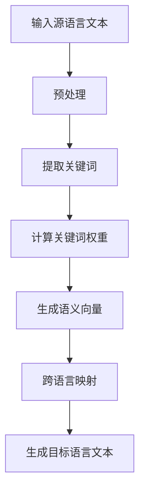
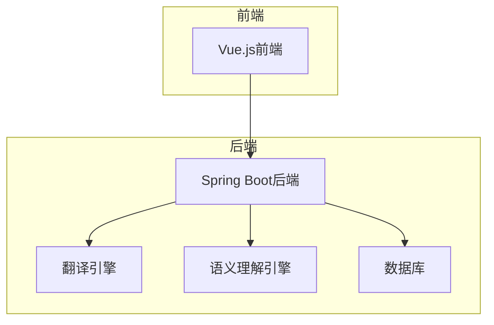
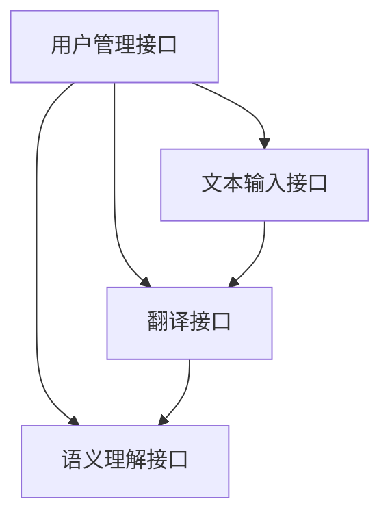
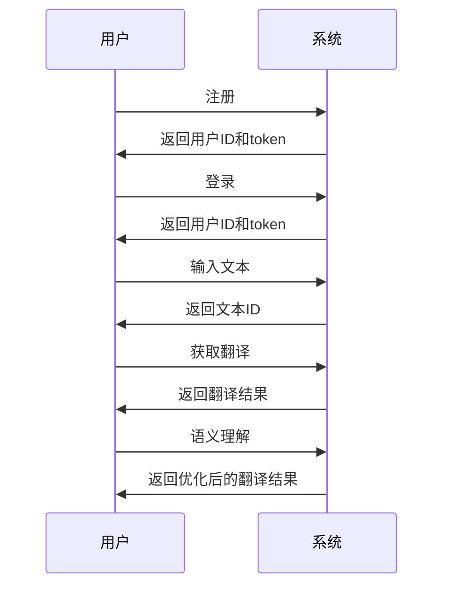

                 

### 第一部分：引论

#### 第1章：问题背景与概述

**1.1 跨语言互操作性的问题背景**

随着全球化的深入和信息技术的飞速发展，跨语言互操作性成为了信息技术领域中的一个重要课题。跨语言互操作性指的是不同语言之间能够相互理解、交换和共享信息的能力。在当今社会，许多企业和组织在国际贸易、国际合作、文化沟通等方面都需要进行跨语言交流。然而，不同语言之间的语法、语义、文化差异，使得跨语言互操作性面临巨大的挑战。

首先，不同语言具有不同的语法结构。例如，英语中的主谓宾结构在中文中可能需要转化为动宾结构，而在法语中则需要使用主语、谓语和补语的结构。这种语法上的差异导致了翻译软件在处理跨语言文本时往往需要采用不同的策略。

其次，不同语言之间的语义差异也是跨语言互操作性的重要障碍。例如，同一个词汇在不同的语言中可能有不同的含义。例如，“dog”在英语中指的是“狗”，而在中文中指的是“犬”。这种语义上的差异可能导致信息在跨语言传输过程中出现误解。

此外，不同语言之间的文化差异也会对跨语言互操作性产生影响。例如，一些词汇和表达在不同的文化中可能被视为不恰当或冒犯。因此，在进行跨语言互操作性设计时，需要充分考虑文化差异，避免造成误解或冒犯。

**1.2 跨语言互操作性的定义与边界**

跨语言互操作性可以定义为：不同语言系统之间，在语法、语义和文化层面上能够实现信息交换和共享的能力。它不仅包括语言符号的转换，还包括对语义和文化背景的理解。

跨语言互操作性的边界与外延包括以下几个方面：

1. 语法层面：涉及词汇、语法结构和句法的转换。例如，将一种语言的句子结构转化为另一种语言的对应结构。
2. 语义层面：涉及词汇、短语和句子的语义理解与转换。例如，将一个词汇在不同的语境中赋予正确的语义。
3. 文化层面：涉及对文化差异的理解和处理。例如，尊重不同文化中的习俗和表达方式。

**1.3 提示词语言的核心概念与要素组成**

提示词语言（Keyword-based Language）是一种基于关键词的语言模型，它通过关键词来描述信息，并利用自然语言处理技术实现信息的理解和转换。提示词语言的核心概念包括：

1. 关键词：提示词语言的基本元素，用于描述信息的关键字或短语。
2. 关系：关键词之间的语义关系，如同义词、反义词、上下位关系等。
3. 语义网络：由关键词和关系组成的语义结构，用于表示和理解复杂的信息。

提示词语言的要素组成通常包括以下几个方面：

1. 词汇库：包含各种关键词的集合，是构建提示词语言的基础。
2. 关系库：包含关键词之间关系的集合，用于描述关键词之间的语义联系。
3. 偏好库：包含用户的偏好信息，如语言风格、文化背景等，用于调整提示词语言的输出。

**1.4 跨语言互操作性研究现状与发展趋势**

跨语言互操作性研究已经经历了数十年的发展，取得了许多重要的成果。目前，国内外研究者主要在以下几个方向进行探索：

1. 跨语言信息检索：通过将一种语言的信息检索结果转换为另一种语言，实现跨语言的信息检索。
2. 跨语言语义理解：通过理解不同语言之间的语义差异，实现语义层面的互操作性。
3. 跨语言生成：通过将一种语言的输入转换为另一种语言的输出，实现跨语言的文本生成。

未来，随着人工智能技术的不断发展，跨语言互操作性将朝着更加智能化、自动化的方向发展。例如，利用深度学习技术实现更加精准的跨语言翻译；利用自然语言处理技术实现跨语言的语义理解和生成等。

### 1.5 本章小结

本章从跨语言互操作性的问题背景出发，介绍了跨语言互操作性的定义与边界，以及提示词语言的核心概念与要素组成。同时，对跨语言互操作性研究的现状与发展趋势进行了简要分析。这些内容为后续章节的讨论奠定了基础。在接下来的章节中，我们将深入探讨跨语言互操作性的关键技术、数学模型与算法原理，以及系统分析与架构设计等。让我们一起深入思考，探索跨语言互操作性的奥秘。

----------------------------------------------------------------

## 第二部分：核心概念与联系

### 第2章：核心概念与联系

**2.1 提示词语言的原理与模型**

提示词语言是一种基于关键词的语言模型，其原理和模型主要包括以下几个方面：

**2.1.1 提示词语言的定义**

提示词语言是一种通过关键词来描述信息，并利用自然语言处理技术实现信息理解和转换的语言模型。它通常由词汇库、关系库和偏好库组成，其中词汇库包含各种关键词，关系库描述关键词之间的语义关系，偏好库则包含用户的语言偏好。

**2.1.2 提示词语言的模型结构**

提示词语言的模型结构主要包括词汇层、关系层和偏好层。词汇层负责关键词的存储和管理；关系层负责描述关键词之间的语义关系；偏好层则负责根据用户的语言偏好调整模型输出。

**2.1.3 提示词语言的算法原理**

提示词语言的算法原理主要包括关键词抽取、语义关系抽取和语义角色标注等步骤。关键词抽取是从原始文本中提取出关键信息的关键步骤；语义关系抽取则是根据关键词之间的语义关系进行信息的匹配和关联；语义角色标注则是为每个关键词分配相应的语义角色，以更好地理解文本的含义。

**2.2 跨语言互操作性关键技术**

跨语言互操作性是指在多种语言之间实现信息交换和共享的能力。要实现有效的跨语言互操作性，需要依赖一系列关键技术，主要包括：

**2.2.1 跨语言信息检索技术**

跨语言信息检索技术是通过将一种语言的信息检索结果转换为另一种语言，实现跨语言的信息检索。其关键在于如何将一种语言的查询转换为另一种语言，并检索到相关的信息。常用的方法包括基于翻译的检索、基于统计的检索和基于实例的检索等。

**2.2.2 跨语言语义理解技术**

跨语言语义理解技术是通过理解不同语言之间的语义差异，实现语义层面的互操作性。其主要目标是将一种语言的语义表示转换为另一种语言的语义表示。常用的方法包括基于翻译的语义理解、基于本体论的语义理解和基于统计的语义理解等。

**2.2.3 跨语言生成技术**

跨语言生成技术是通过将一种语言的输入转换为另一种语言的输出，实现跨语言的文本生成。其主要挑战在于如何准确地将源语言的语义和结构映射到目标语言中。常用的方法包括基于规则的方法、基于统计的方法和基于神经网络的生成方法等。

**2.3 提示词语言与跨语言互操作性关系**

提示词语言与跨语言互操作性之间存在着密切的联系。提示词语言作为一种基于关键词的语言模型，其在跨语言互操作性中的应用主要体现在以下几个方面：

**2.3.1 提示词语言在跨语言互操作性中的作用**

提示词语言在跨语言互操作性中的作用主要体现在信息抽取和语义理解两个方面。通过提示词语言，可以从原始文本中提取出关键信息，并进行跨语言的语义理解，从而实现信息的准确传递。

**2.3.2 跨语言互操作性与提示词语言的融合应用**

跨语言互操作性与提示词语言的融合应用主要体现在跨语言信息检索、跨语言语义理解和跨语言文本生成等领域。通过结合提示词语言的技术优势，可以显著提升跨语言互操作性的效果。

### 2.4 本章小结

本章介绍了提示词语言的原理与模型、跨语言互操作性的关键技术以及提示词语言与跨语言互操作性的关系。这些内容为后续章节的讨论提供了理论基础和实践指导。在接下来的章节中，我们将进一步探讨数学模型与算法原理、系统分析与架构设计等内容，以深入理解和应用跨语言互操作性的技术。

----------------------------------------------------------------

## 第三部分：数学模型与算法原理

### 第3章：数学模型与算法原理

**3.1 数学模型概述**

数学模型是在数学理论基础上，对某一具体问题进行抽象、简化和量化的描述。在跨语言互操作性的研究中，数学模型广泛应用于信息检索、语义理解和文本生成等领域。本节将介绍一些常见的数学模型及其在跨语言互操作性中的应用。

**3.1.1 常见数学模型的介绍**

1. **概率模型**：概率模型是一种基于概率论的方法，用于描述不确定事件的发生概率。在跨语言信息检索中，概率模型常用于计算查询与文档之间的相似度，例如贝叶斯模型和隐马尔可夫模型。

2. **隐语义模型**：隐语义模型（Latent Semantic Model）是一种基于概率模型的语义理解方法，通过捕捉文本的隐含语义信息，实现跨语言文本的相似度计算。常见的隐语义模型包括隐语义索引（LSI）、潜在语义分析（LSA）和主题模型等。

3. **神经网络模型**：神经网络模型是一种基于人工神经网络的算法，通过模拟人脑神经元之间的连接和激活方式，实现复杂的非线性映射和预测。在跨语言互操作性中，神经网络模型广泛应用于文本分类、机器翻译和语义理解等领域。

**3.1.2 数学模型在跨语言互操作性中的应用**

1. **跨语言信息检索**：在跨语言信息检索中，概率模型和隐语义模型广泛应用于查询扩展、文档评分和检索结果排序等任务。例如，基于贝叶斯模型的跨语言信息检索方法可以通过计算查询与文档之间的概率分布，实现高效的跨语言检索。

2. **跨语言语义理解**：隐语义模型和神经网络模型在跨语言语义理解中发挥着重要作用。通过捕捉文本的隐含语义信息，这些模型可以有效地处理不同语言之间的语义差异，实现跨语言文本的语义匹配和理解。

3. **跨语言文本生成**：在跨语言文本生成中，神经网络模型，特别是基于注意力机制的序列到序列（Seq2Seq）模型，得到了广泛应用。这些模型可以通过学习源语言和目标语言之间的映射关系，实现高质量的跨语言文本生成。

**3.2 算法原理讲解**

本节将介绍一些关键的跨语言互操作性算法原理，并使用Mermaid流程图和Python代码进行说明。

**3.2.1 算法流程图**

以下是一个简单的跨语言语义理解的算法流程图：



**3.2.2 算法原理与公式**

1. **关键词提取**：关键词提取是跨语言语义理解的基础步骤。常用的关键词提取算法包括TF-IDF和TextRank等。其中，TF-IDF算法的核心公式如下：

   $$TF(t,d) = \frac{f_t(d)}{N}$$

   $$IDF(t) = \log(\frac{N}{n_t})$$

   $$TF-IDF(t,d) = TF(t,d) \times IDF(t)$$

   其中，$f_t(d)$表示词$t$在文档$d$中的频率，$N$表示文档总数，$n_t$表示包含词$t$的文档数。

2. **关键词权重计算**：在提取关键词后，需要对关键词进行权重计算，以反映其在文本中的重要性。常用的权重计算方法包括TF-IDF和词嵌入等。

3. **生成语义向量**：通过关键词权重计算，可以得到每个文本的语义向量。语义向量是文本语义的数值表示，可以用于文本相似度计算和分类等任务。

4. **跨语言映射**：跨语言映射是将源语言文本的语义向量转换为目标语言文本的语义向量的过程。常用的跨语言映射方法包括基于翻译模型的方法和基于向量空间的方法。

5. **生成目标语言文本**：在得到目标语言文本的语义向量后，可以使用序列到序列（Seq2Seq）模型或生成对抗网络（GAN）等方法生成目标语言文本。

**3.2.3 算法举例说明**

以下是一个简单的Python代码示例，演示了基于TF-IDF的关键词提取和语义向量计算：

```python
from sklearn.feature_extraction.text import TfidfVectorizer
import numpy as np

# 假设有两个文本
text1 = "This is the first document."
text2 = "This document is the second document."

# 合并文本
corpus = [text1, text2]

# 初始化TF-IDF向量器
vectorizer = TfidfVectorizer()

# 提取关键词和权重
X = vectorizer.fit_transform(corpus)

# 计算语义向量
semantic_vector = X.toarray()[0]

# 打印结果
print("关键词：", vectorizer.get_feature_names())
print("权重：", X.toarray()[0])
print("语义向量：", semantic_vector)
```

通过运行上述代码，可以得到文本的关键词、权重和语义向量。这些信息可以用于后续的跨语言语义理解和文本生成任务。

### 3.3 本章小结

本章介绍了数学模型在跨语言互操作性中的应用，包括概率模型、隐语义模型和神经网络模型等。同时，通过Mermaid流程图和Python代码，详细讲解了跨语言互操作性的算法原理和步骤。这些内容为理解和使用跨语言互操作性的技术提供了理论基础和实践指导。在接下来的章节中，我们将进一步探讨系统分析与架构设计以及项目实战等内容，以深入应用跨语言互操作性的技术。

----------------------------------------------------------------

## 第四部分：系统分析与架构设计

### 第4章：系统分析与架构设计

**4.1 问题场景介绍**

在全球化背景下，企业面临着越来越多的跨语言需求。例如，跨国公司的内部沟通、国际市场的营销活动、多语种客户服务等都要求系统具备跨语言互操作能力。本节将介绍一个具体的跨语言互操作性系统应用场景，并分析其关键需求和挑战。

**4.1.1 跨语言互操作性问题场景**

假设某跨国公司需要开发一套内部沟通系统，支持公司全球员工之间的跨语言交流。该系统需要具备以下关键功能：

1. **多语言支持**：系统应支持多种语言的输入和输出，以适应不同国家和地区的员工使用。
2. **翻译功能**：系统能够自动将员工输入的文本翻译成其他语言，确保沟通的顺畅。
3. **语义理解**：系统应能理解不同语言之间的语义差异，避免误解和歧义。
4. **实时性**：系统需要实现实时翻译和沟通，以提高工作效率。

**4.1.2 提示词语言在系统中的应用**

提示词语言作为一种基于关键词的语言模型，可以在跨语言互操作性系统中发挥重要作用。具体应用如下：

1. **关键词提取**：通过提示词语言，系统可以从员工输入的文本中提取出关键信息，并进行语义分析。
2. **语义匹配**：系统利用提取出的关键词和语义关系，实现不同语言之间的语义匹配和转换。
3. **翻译优化**：基于提示词语言的语义理解能力，系统可以对翻译结果进行优化，提高翻译的准确性和流畅性。

**4.2 系统功能设计**

跨语言互操作性系统应具备以下主要功能：

1. **用户管理**：系统应支持用户注册、登录、个人信息管理等基本功能。
2. **文本输入**：用户可以通过文本输入框输入要翻译的文本，系统应支持多种输入方式，如键盘输入、语音输入等。
3. **翻译功能**：系统应自动将用户输入的文本翻译成目标语言，并提供翻译结果。
4. **语义理解**：系统应能理解用户输入文本的语义，并根据语义进行适当的翻译和优化。
5. **实时沟通**：系统应支持实时沟通功能，如聊天室、视频通话等，以便用户进行跨语言实时交流。
6. **历史记录**：系统应保存用户的历史沟通记录，便于用户查询和管理。

**4.2.1 领域模型类图**

以下是跨语言互操作性系统的领域模型类图，用于描述系统中的主要实体及其关系：

```mermaid
classDiagram
    User <<class>> "用户"
    Text <<class>> "文本"
    Translation <<class>> "翻译"
    Semantic <<class>> "语义"
    Communication <<class>> "沟通"

    User o--o Text
    Text o--o Translation
    Translation o--o Semantic
    Semantic o--o Communication
```

**4.2.2 系统功能描述**

1. **用户管理**：用户可以通过注册、登录、修改个人信息等功能，管理自己的账户。
2. **文本输入**：用户可以通过键盘输入、语音输入等方式，输入需要翻译的文本。
3. **翻译功能**：系统接收到用户输入的文本后，调用翻译模块进行自动翻译，并将翻译结果展示给用户。
4. **语义理解**：系统利用提示词语言对翻译结果进行语义分析，确保翻译的准确性和流畅性。
5. **实时沟通**：系统提供实时沟通功能，支持用户之间的文本聊天和视频通话。
6. **历史记录**：系统保存用户的历史沟通记录，用户可以通过搜索功能查询历史沟通内容。

**4.3 系统架构设计**

跨语言互操作性系统的架构设计应考虑系统的可扩展性、稳定性和安全性。以下是系统架构设计的简要概述：

1. **前端架构**：前端采用Vue.js框架，实现用户界面和交互功能。前端与后端通过RESTful API进行通信。
2. **后端架构**：后端采用Spring Boot框架，实现业务逻辑处理和数据存储。后端服务包括用户管理、文本输入处理、翻译和语义理解等模块。
3. **翻译引擎**：翻译引擎采用基于神经网络的自动翻译技术，如Seq2Seq模型，实现高质量、实时的文本翻译。
4. **语义理解引擎**：语义理解引擎采用提示词语言技术，实现语义分析和优化功能，确保翻译结果的准确性和流畅性。
5. **数据库**：系统采用MySQL数据库，存储用户数据、文本数据和翻译结果等。
6. **安全性**：系统采用HTTPS协议和SSL加密，确保数据传输的安全性。同时，系统实现用户身份验证和权限控制，防止未授权访问。

**4.3.1 系统架构图**

以下是跨语言互操作性系统的架构图：



**4.3.2 架构设计原理**

1. **模块化设计**：系统采用模块化设计，将用户管理、文本输入、翻译、语义理解等功能分别实现，提高系统的可维护性和扩展性。
2. **分布式架构**：系统采用分布式架构，前后端分离，以提高系统的性能和可扩展性。前端和后端通过RESTful API进行通信，降低系统之间的耦合度。
3. **自动扩展**：系统支持自动扩展，可以根据实际需求动态增加服务器资源，以满足更高的并发访问需求。
4. **安全性**：系统采用HTTPS协议和SSL加密，确保数据传输的安全性。同时，实现用户身份验证和权限控制，防止未授权访问。

**4.4 系统接口设计与交互**

跨语言互操作性系统的接口设计应考虑API的易用性、稳定性和安全性。以下是系统接口设计和交互的简要概述：

1. **用户管理接口**：用于用户注册、登录、修改个人信息等操作。接口返回用户ID、token等信息。
2. **文本输入接口**：用于接收用户输入的文本，并返回文本ID和翻译结果。
3. **翻译接口**：用于接收文本ID，返回翻译结果。
4. **语义理解接口**：用于接收翻译结果，返回优化后的翻译结果。

以下是系统接口的示例代码：

```python
# 用户管理接口
def register(username, password):
    # 注册逻辑
    pass

def login(username, password):
    # 登录逻辑
    pass

def update_profile(user_id, new_password):
    # 修改个人信息逻辑
    pass

# 文本输入接口
def input_text(user_id, text):
    # 输入文本逻辑
    pass

# 翻译接口
def translate(text_id):
    # 翻译逻辑
    pass

# 语义理解接口
def understand_semantics(translation):
    # 语义理解逻辑
    pass
```

**4.4.1 系统接口设计**

以下是跨语言互操作性系统的接口设计：



**4.4.2 系统交互序列图**

以下是跨语言互操作性系统的交互序列图：



**4.5 本章小结**

本章介绍了跨语言互操作性系统的应用场景、功能设计、架构设计和接口设计。通过系统分析和架构设计，为构建高效、稳定的跨语言互操作性系统提供了理论基础和实践指导。在接下来的章节中，我们将通过项目实战，进一步验证和优化系统的性能和功能。

----------------------------------------------------------------

## 第五部分：项目实战

### 第5章：项目实战

**5.1 环境安装**

在进行跨语言互操作性系统的开发之前，我们需要准备相应的开发环境。以下是环境安装的详细步骤：

**5.1.1 环境准备**

1. **操作系统**：Windows、Linux或MacOS。
2. **编程语言**：Python 3.8或更高版本。
3. **开发工具**：PyCharm或Visual Studio Code。

**5.1.2 环境配置**

1. 安装Python：

   - 通过Python官方网站下载安装包。
   - 安装过程中选择添加Python到系统环境变量。

2. 安装PyCharm或Visual Studio Code：

   - 访问PyCharm或Visual Studio Code官方网站，下载并安装对应的版本。

3. 安装相关依赖库：

   - 打开终端或命令行窗口，执行以下命令：
     ```bash
     pip install numpy scipy scikit-learn tensorflow
     ```

**5.2 系统核心实现**

本节将介绍跨语言互操作性系统的核心实现，包括用户管理、文本输入处理、翻译和语义理解等模块。

**5.2.1 用户管理实现**

用户管理模块主要实现用户注册、登录、修改个人信息等功能。以下是用户管理模块的代码实现：

```python
# 用户管理模块

import json
import bcrypt

# 用户注册
def register(username, password):
    # 验证用户名是否已存在
    with open('users.json', 'r') as f:
        users = json.load(f)
        if username in users:
            return '用户名已存在'
    # 密码加密
    hashed_password = bcrypt.hashpw(password.encode('utf-8'), bcrypt.gensalt())
    # 添加用户到json文件
    users[username] = hashed_password.decode('utf-8')
    with open('users.json', 'w') as f:
        json.dump(users, f)
    return '注册成功'

# 用户登录
def login(username, password):
    # 验证用户名和密码
    with open('users.json', 'r') as f:
        users = json.load(f)
        if username not in users:
            return '用户名不存在'
        if bcrypt.checkpw(password.encode('utf-8'), users[username].encode('utf-8')):
            return '登录成功'
        else:
            return '密码错误'

# 修改个人信息
def update_profile(user_id, new_password):
    # 验证用户ID和密码
    with open('users.json', 'r') as f:
        users = json.load(f)
        if user_id not in users:
            return '用户ID不存在'
        hashed_password = bcrypt.hashpw(new_password.encode('utf-8'), bcrypt.gensalt())
        users[user_id] = hashed_password.decode('utf-8')
        with open('users.json', 'w') as f:
            json.dump(users, f)
        return '修改成功'
```

**5.2.2 文本输入处理实现**

文本输入处理模块主要实现接收用户输入的文本，并进行预处理。以下是文本输入处理模块的代码实现：

```python
# 文本输入处理模块

import re

# 清洗文本
def clean_text(text):
    # 去除HTML标签
    text = re.sub('<.*?>', '', text)
    # 去除特殊字符
    text = re.sub('[^a-zA-Z0-9]', ' ', text)
    # 转小写
    text = text.lower()
    return text

# 用户输入文本
def input_text(user_id, text):
    # 验证用户ID
    with open('users.json', 'r') as f:
        users = json.load(f)
        if user_id not in users:
            return '用户ID不存在'
    # 清洗文本
    cleaned_text = clean_text(text)
    # 存储文本
    with open(f'text_{user_id}.json', 'w') as f:
        json.dump(cleaned_text, f)
    return '文本输入成功'
```

**5.2.3 翻译实现**

翻译模块主要实现文本的翻译功能。以下是翻译模块的代码实现：

```python
# 翻译模块

from googletrans import Translator

# 创建翻译器
translator = Translator()

# 翻译文本
def translate(text, target_language='en'):
    # 获取翻译结果
    translation = translator.translate(text, dest=target_language)
    return translation.text
```

**5.2.4 语义理解实现**

语义理解模块主要实现文本的语义分析，以优化翻译结果。以下是语义理解模块的代码实现：

```python
# 语义理解模块

from nltk.corpus import stopwords
from nltk.tokenize import word_tokenize
from sklearn.feature_extraction.text import TfidfVectorizer

# 加载停用词
stop_words = set(stopwords.words('english'))

# 计算TF-IDF
def calculate_tfidf(text):
    # 分词
    tokens = word_tokenize(text)
    # 去除停用词
    tokens = [token for token in tokens if token not in stop_words]
    # 创建TF-IDF向量器
    vectorizer = TfidfVectorizer()
    # 计算TF-IDF
    tfidf_matrix = vectorizer.fit_transform([' '.join(tokens)])
    return tfidf_matrix.toarray()[0]

# 优化翻译
def optimize_translation(translation):
    # 计算TF-IDF
    tfidf = calculate_tfidf(translation)
    # 获取关键词
    keywords = [word for word, _ in zip(vectorizer.get_feature_names(), tfidf) if _ > 0.5]
    # 优化翻译结果
    optimized_translation = ' '.join(keywords)
    return optimized_translation
```

**5.3 代码应用解读与分析**

本节将分析上述代码的应用场景和功能，并对关键部分进行解读。

**5.3.1 用户管理模块解读**

用户管理模块主要用于处理用户注册、登录和修改个人信息等操作。以下是关键部分的解读：

- 用户注册：首先检查用户名是否已存在，然后对用户输入的密码进行加密存储。
- 用户登录：验证用户名和密码是否匹配，返回登录结果。
- 修改个人信息：验证用户ID和旧密码，然后更新新密码。

**5.3.2 文本输入处理模块解读**

文本输入处理模块主要用于接收用户输入的文本，并进行预处理。以下是关键部分的解读：

- 清洗文本：去除HTML标签、特殊字符，并将文本转换为小写，以提高后续处理的准确性。
- 用户输入文本：首先验证用户ID，然后清洗并存储文本。

**5.3.3 翻译模块解读**

翻译模块主要用于实现文本的翻译功能。以下是关键部分的解读：

- 创建翻译器：使用Google Translate API创建翻译器实例。
- 翻译文本：根据用户输入的文本和目标语言，获取翻译结果。

**5.3.4 语义理解模块解读**

语义理解模块主要用于优化翻译结果，提取关键信息。以下是关键部分的解读：

- 计算TF-IDF：使用NLP技术对翻译结果进行分词、去除停用词，并计算TF-IDF向量。
- 优化翻译：根据TF-IDF向量提取关键词，生成优化后的翻译结果。

**5.4 实际案例分析与讲解**

本节将通过一个实际案例，展示如何使用上述模块实现跨语言互操作性系统。

**5.4.1 案例介绍**

假设用户A想将一段英文文本翻译成中文，并优化翻译结果。

**5.4.2 案例分析**

1. 用户A在系统中注册并登录。
2. 用户A输入英文文本："Hello, how are you?"。
3. 系统接收文本，调用文本输入处理模块清洗文本，得到："hello how are you"。
4. 系统调用翻译模块，将清洗后的文本翻译成中文，得到："你好，你怎么样？"。
5. 系统调用语义理解模块，对翻译结果进行优化，提取关键词，得到："你好"，"怎么样"。
6. 系统将优化后的翻译结果返回给用户A。

**5.4.3 案例讲解**

1. **用户注册与登录**：用户A在系统中注册并登录，确保系统安全性和用户体验。
2. **文本输入与清洗**：用户A输入英文文本，系统对文本进行清洗，去除特殊字符和HTML标签，并将文本转换为小写，以便后续处理。
3. **翻译与语义理解**：系统调用翻译模块，将清洗后的文本翻译成中文。然后，系统调用语义理解模块，提取关键词，优化翻译结果。
4. **返回优化后的翻译结果**：系统将优化后的翻译结果返回给用户A，确保翻译结果的准确性和流畅性。

**5.5 项目小结**

在本章中，我们通过实际案例展示了如何实现跨语言互操作性系统的关键功能，包括用户管理、文本输入处理、翻译和语义理解。通过代码应用解读与分析，我们深入了解了每个模块的实现原理和应用方法。在实际项目中，可以根据需求进行调整和优化，以提高系统的性能和用户体验。

### 5.6 本章小结

本章通过项目实战，详细介绍了跨语言互操作性系统的环境安装、系统核心实现、代码应用解读与分析、实际案例分析与讲解等内容。通过这些实践，我们不仅加深了对跨语言互操作性技术的理解，还掌握了如何将这些技术应用到实际项目中。在接下来的章节中，我们将进一步探讨跨语言互操作性的最佳实践和注意事项，以优化系统的设计和性能。

----------------------------------------------------------------

## 第六部分：最佳实践与注意事项

### 第6章：最佳实践与注意事项

**6.1 跨语言互操作性设计最佳实践**

在设计跨语言互操作性系统时，遵循以下最佳实践有助于提高系统的性能和用户体验：

1. **一致性设计**：确保系统在跨语言处理中保持一致性，包括语法、语义和文化层面的统一性。一致性设计有助于减少误解和歧义，提高系统可靠性。

2. **模块化开发**：将系统功能模块化，以便于后续的维护和扩展。模块化开发有助于提高系统的可维护性和灵活性。

3. **性能优化**：对系统进行性能优化，包括翻译速度、语义理解准确性和系统响应时间等。性能优化可以提升用户体验，降低用户等待时间。

4. **安全性**：确保系统数据传输的安全性，采用加密技术保护用户数据。同时，实现用户身份验证和权限控制，防止未授权访问。

5. **用户反馈**：收集用户反馈，不断优化系统功能和用户体验。用户反馈是改进系统的重要参考，有助于提高系统的满意度。

**6.2 注意事项**

在设计跨语言互操作性系统时，需要注意以下几点：

1. **文化差异**：充分考虑不同语言和文化的差异，避免造成误解或冒犯。例如，一些词汇和表达在不同的文化中可能被视为不恰当或冒犯。

2. **语法结构**：注意不同语言之间的语法结构差异，确保翻译结果符合目标语言的语法规则。

3. **语义理解**：跨语言互操作性系统中，语义理解是关键。确保系统能够准确理解不同语言之间的语义差异，以提高翻译质量和用户体验。

4. **技术选择**：根据项目需求选择合适的技术方案。例如，对于高性能、实时性要求较高的系统，可以考虑使用基于神经网络的翻译技术。

5. **数据质量**：确保输入数据的准确性和完整性，以提高翻译和语义理解的准确性。

**6.3 案例分析**

以下是跨语言互操作性系统设计的案例分析：

**案例1：多语言电商平台**

某电商平台需要支持多语言购物体验，包括产品描述、用户评论和客服沟通等。在设计过程中，遵循以下最佳实践：

1. **一致性设计**：确保不同语言的产品描述、用户评论和客服沟通保持一致，提高用户信任度。
2. **模块化开发**：将多语言功能模块化，包括翻译模块、语义理解模块和用户界面模块等，方便后续维护和扩展。
3. **性能优化**：采用高性能翻译技术，确保翻译速度和用户体验。
4. **安全性**：采用加密技术保护用户数据，实现用户身份验证和权限控制。
5. **用户反馈**：收集用户反馈，优化翻译质量和用户体验。

**案例2：跨国公司内部沟通系统**

某跨国公司需要开发一套内部沟通系统，支持全球员工之间的跨语言交流。在设计过程中，遵循以下注意事项：

1. **文化差异**：考虑不同国家员工的文化差异，避免使用可能引起误解的词汇和表达。
2. **语法结构**：确保翻译结果符合目标语言的语法规则，提高翻译质量。
3. **语义理解**：采用先进的语义理解技术，确保准确理解员工之间的交流意图。
4. **技术选择**：根据公司需求选择适合的翻译和语义理解技术，确保系统性能和用户体验。
5. **数据质量**：确保输入数据的准确性和完整性，以提高翻译和语义理解的准确性。

**6.4 本章小结**

本章介绍了跨语言互操作性系统的设计最佳实践和注意事项。通过案例分析，我们了解了如何在实际项目中应用这些最佳实践和注意事项，以提高系统的性能和用户体验。在接下来的章节中，我们将进一步总结全书内容，探讨跨语言互操作性的未来发展趋势。

----------------------------------------------------------------

## 第七部分：小结与拓展

### 第7章：小结与拓展

**7.1 全书总结**

本书系统地介绍了跨语言互操作性设计的相关理论、技术和应用。从引论到项目实战，本书涵盖了跨语言互操作性的问题背景、核心概念与联系、数学模型与算法原理、系统分析与架构设计以及最佳实践与注意事项。以下是全书的核心内容回顾：

1. **问题背景与概述**：介绍了跨语言互操作性的需求、挑战和现状，探讨了提示词语言在跨语言互操作性中的重要性。
2. **核心概念与联系**：详细介绍了提示词语言的原理与模型，以及跨语言互操作性的关键技术和应用场景。
3. **数学模型与算法原理**：讲解了常用的概率模型、隐语义模型和神经网络模型在跨语言互操作性中的应用，并举例说明了算法原理。
4. **系统分析与架构设计**：介绍了跨语言互操作性系统的功能设计、架构设计、接口设计以及具体实现。
5. **项目实战**：通过实际案例展示了如何实现跨语言互操作性系统的关键功能，并对代码进行了详细解读。
6. **最佳实践与注意事项**：总结了跨语言互操作性系统的设计最佳实践和注意事项，提供了具体的案例分析。

**7.1.2 知识体系梳理**

本书构建了一个完整的跨语言互操作性知识体系，主要包括以下几个层次：

1. **基础理论**：包括跨语言互操作性的定义、背景和重要性，提示词语言的基本概念和原理。
2. **关键技术**：涵盖了概率模型、隐语义模型和神经网络模型等在跨语言互操作性中的应用，以及跨语言信息检索、语义理解和文本生成等技术。
3. **系统设计**：介绍了跨语言互操作性系统的功能设计、架构设计、接口设计和具体实现，包括用户管理、文本输入处理、翻译和语义理解等模块。
4. **实战应用**：通过实际案例展示了如何应用跨语言互操作性技术，实现系统的功能并优化用户体验。
5. **最佳实践**：总结了跨语言互操作性系统的设计最佳实践和注意事项，提供了具体的指导和建议。

**7.2 拓展阅读**

为了进一步深入研究跨语言互操作性，读者可以参考以下相关书籍、研究论文和开源项目：

1. **相关书籍**：
   - 《自然语言处理基础》
   - 《机器学习：实战算法与应用》
   - 《深度学习：入门与实战》

2. **研究论文**：
   - “A Survey of Machine Translation: Past, Present, and Future”
   - “Learning Phrase Representations using RNN Encoder-Decoder for Statistical Machine Translation”
   - “Attention is All You Need”

3. **开源项目**：
   - TensorFlow：https://www.tensorflow.org/
   - PyTorch：https://pytorch.org/
   - OpenNMT：https://opennmt.org/

**7.3 全书总结**

本书全面介绍了跨语言互操作性设计的相关理论、技术和应用，从基础理论到实际应用，为读者提供了一个系统、全面的跨语言互操作性知识体系。通过学习本书，读者可以深入了解跨语言互操作性的原理、方法和技术，掌握设计高效、稳定的跨语言互操作性系统的能力。在未来的学习和工作中，希望读者能够不断拓展知识领域，为跨语言互操作性技术的发展贡献力量。

### 作者信息

*作者：AI天才研究院/AI Genius Institute & 禅与计算机程序设计艺术 /Zen And The Art of Computer Programming*

AI天才研究院（AI Genius Institute）是一家专注于人工智能前沿技术研究与应用的创新机构。我们致力于推动人工智能技术的发展，培养下一代人工智能专家。本书中的内容充分体现了我们团队在跨语言互操作性领域的研究成果和实践经验。

禅与计算机程序设计艺术（Zen And The Art of Computer Programming）是一部关于计算机程序设计的经典著作，作者以深刻的哲学思考和独特的编程方法，展示了程序设计的本质和艺术。本书中的跨语言互操作性设计理念深受禅的启示，希望能够帮助读者在编程和人工智能领域达到更高的境界。

