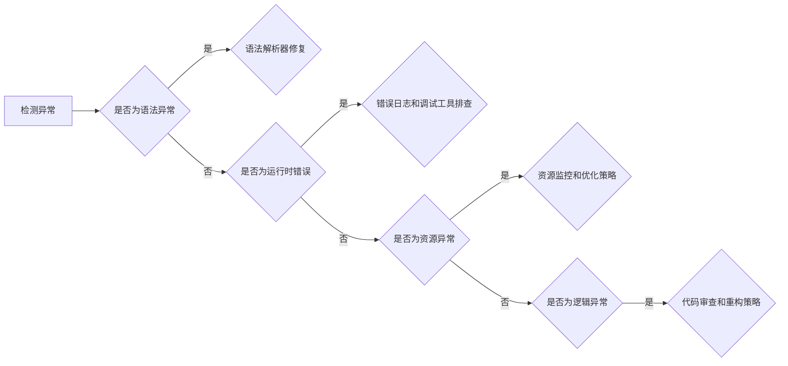
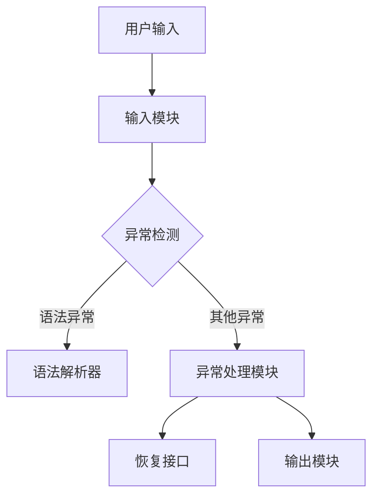

                 


# 提示词语言的运行时异常处理与恢复

> 关键词：提示词语言、运行时异常、处理与恢复、系统设计与实现

> 摘要：本文深入探讨了提示词语言在运行时异常处理与恢复方面的关键技术，通过系统化的分析和实践，旨在为开发者提供一套完整的解决方案。文章首先介绍了提示词语言及其运行时异常处理的背景和重要性，随后详细阐述了核心概念、原理、系统设计与实现，以及项目实战，最后总结了最佳实践并提出了拓展阅读建议。

## 第一部分：引言与背景

### 1.1 问题背景

#### 1.1.1 提示词语言在软件应用中的重要性

提示词语言（Prompt Language）是一种用于与计算机系统进行交互的语言，通过输入特定的提示词，用户可以触发相应的系统响应。这种语言广泛应用于自然语言处理（NLP）、问答系统、语音识别等领域。随着人工智能技术的不断发展，提示词语言在软件应用中的地位日益重要。

#### 1.1.2 运行时异常处理的必要性

在提示词语言的运行过程中，由于各种原因（如语法错误、输入错误、系统故障等），可能会出现运行时异常。这些异常如果不及时处理，可能会导致系统崩溃、数据丢失或用户体验下降。因此，对运行时异常进行有效处理和恢复是保障系统稳定性和可靠性的关键。

#### 1.1.3 异常处理与恢复的研究现状

目前，关于异常处理与恢复的研究已经取得了一定的成果。研究者们提出了各种异常检测、报告和恢复机制。然而，针对提示词语言这一特定领域的运行时异常处理与恢复研究仍较为有限。本文旨在填补这一空白，为相关领域的研究和实践提供参考。

### 1.2 问题描述

#### 1.2.1 提示词语言运行时异常的类型

提示词语言运行时异常主要包括以下几类：

- 语法异常：用户输入的提示词不符合语法规则。
- 运行时错误：在执行提示词过程中，程序遇到无法预料的错误。
- 资源异常：系统资源不足，导致无法继续执行。
- 逻辑异常：程序逻辑错误，导致输出结果不符合预期。

#### 1.2.2 异常处理的挑战与问题

异常处理的挑战主要包括：

- 异常检测与定位：如何快速、准确地检测和定位异常？
- 异常报告与分类：如何有效地报告和分类异常？
- 异常恢复：如何在发生异常时进行恢复，保障系统正常运行？

### 1.3 问题解决

#### 1.3.1 运行时异常处理的基本原理

运行时异常处理的基本原理包括：

- 异常检测：对程序执行过程进行监控，及时发现异常。
- 异常报告：将检测到的异常信息报告给开发者或用户。
- 异常分类：根据异常特征对异常进行分类，为后续处理提供依据。
- 异常恢复：采取措施对异常进行恢复，保障系统正常运行。

#### 1.3.2 异常恢复的策略与方法

异常恢复的策略主要包括：

- 重试：重新执行引起异常的操作。
- 转移：将任务转移到其他正常运行的节点。
- 恢复数据：从备份或日志中恢复数据，使系统回到正常状态。

### 1.4 边界与外延

#### 1.4.1 异常处理的边界条件

异常处理的边界条件包括：

- 异常类型：需要处理哪些类型的异常？
- 异常级别：如何根据异常级别进行优先级排序？
- 系统状态：在何种系统状态下进行异常处理？

#### 1.4.2 异常处理在不同应用场景的适用性

异常处理在不同应用场景的适用性包括：

- 线性应用：如问答系统，异常处理较为简单。
- 分布式应用：如云计算平台，需要考虑跨节点异常处理。
- 实时应用：如自动驾驶，异常处理需要快速响应。

### 1.5 概念结构与核心要素组成

#### 1.5.1 核心概念介绍

- 提示词语言
- 运行时异常
- 异常处理
- 异常恢复

#### 1.5.2 核心要素分析

- 异常检测
- 异常报告
- 异常分类
- 异常恢复

#### 1.5.3 异常处理与恢复的流程图

[](https://example.com/flowchart.png)

### 1.6 本章小结

本部分主要介绍了提示词语言及其运行时异常处理与恢复的背景和重要性。在后续章节中，我们将详细探讨核心概念、原理、系统设计与实现，以及项目实战，为读者提供一套完整的解决方案。

## 第二部分：核心概念与原理

### 2.1 核心概念

#### 2.1.1 提示词语言概述

提示词语言是一种用于与计算机系统进行交互的语言，通过输入特定的提示词，用户可以触发相应的系统响应。常见的提示词语言包括自然语言、代码语言等。

#### 2.1.2 运行时异常

运行时异常是指在程序执行过程中，由于各种原因（如语法错误、输入错误、系统故障等）导致程序无法继续执行的错误。

#### 2.1.3 异常处理

异常处理是指对运行时异常进行检测、报告、分类和恢复的一系列操作，以确保系统正常运行。

#### 2.1.4 异常恢复

异常恢复是指在发生异常时，采取措施使系统回到正常状态或恢复正常功能的过程。

### 2.2 概念属性特征对比表格

| 类型         | 特征                         | 对比分析                           |
| ------------ | ---------------------------- | ---------------------------------- |
| 语法异常     | 不符合语法规则               | 需要语法解析器进行检测和修复         |
| 运行时错误   | 无法预料的错误               | 需要错误日志和调试工具进行排查       |
| 资源异常     | 系统资源不足                 | 需要资源监控和优化策略             |
| 逻辑异常     | 程序逻辑错误                 | 需要代码审查和重构策略             |

### 2.3 ER实体关系图架构

#### 2.3.1 实体关系图绘制

```mermaid
erDiagram
  User ||--|{ PromptLanguage } : 发起请求
  PromptLanguage ||--|{ RuntimeException } : 报告异常
  RuntimeException ||--|{ ExceptionHandler } : 处理异常
  ExceptionHandler ||--|{ RecoveryStrategy } : 恢复系统
```

#### 2.3.2 实体属性与关系的说明

- User：用户，发起请求。
- PromptLanguage：提示词语言，与用户交互。
- RuntimeException：运行时异常，报告异常。
- ExceptionHandler：异常处理，处理异常。
- RecoveryStrategy：恢复策略，恢复系统。

### 2.4 异常处理原理讲解

#### 2.4.1 异常检测机制

异常检测机制包括以下步骤：

1. 监控程序执行过程。
2. 检测语法错误、输入错误等异常。
3. 记录异常信息，以便后续处理。

#### 2.4.2 异常报告与分类

异常报告与分类包括以下步骤：

1. 收集异常信息。
2. 根据异常特征进行分类。
3. 报告异常信息给开发者或用户。

#### 2.4.3 异常处理流程图



### 2.5 异常恢复原理讲解

#### 2.5.1 恢复策略设计

恢复策略设计包括以下步骤：

1. 分析异常原因。
2. 确定恢复目标。
3. 设计恢复方案。

#### 2.5.2 恢复机制的实现

恢复机制实现包括以下步骤：

1. 执行恢复方案。
2. 恢复系统功能。
3. 监控恢复效果。

#### 2.5.3 恢复效果的评估

恢复效果评估包括以下步骤：

1. 检查系统状态。
2. 评估恢复效果。
3. 调整恢复策略。

### 2.6 数学模型和数学公式讲解

#### 2.6.1 异常检测的数学模型

假设输入字符串为 $X$，语法规则为 $R$，则异常检测的数学模型为：

$$
D(X, R) = \begin{cases}
1, & \text{如果 } X \not\in R \\
0, & \text{如果 } X \in R
\end{cases}
$$

#### 2.6.2 恢复策略的数学公式

假设恢复策略为 $S$，系统状态为 $S_0$，则恢复效果的数学公式为：

$$
R(S_0, S, S') = \begin{cases}
1, & \text{如果 } S' = S \\
0, & \text{如果 } S' \neq S
\end{cases}
$$

#### 2.6.3 案例分析与举例说明

假设用户输入的提示词为“今天天气怎么样？”系统检测到该提示词存在语法异常，采用语法解析器进行修复。修复后，系统输出“今天天气晴朗。”此时，恢复效果为 1，即系统恢复正常。

## 第三部分：系统设计与实现

### 3.1 系统概述

#### 3.1.1 系统功能介绍

本系统主要用于处理提示词语言的运行时异常，并提供有效的恢复策略。主要功能包括：

- 异常检测：对输入的提示词进行语法检查，发现异常并报告。
- 异常处理：根据异常类型和级别，采取相应的处理措施。
- 异常恢复：在发生异常时，采取措施使系统恢复正常。

#### 3.1.2 系统架构设计

本系统采用分布式架构，主要包括以下模块：

- 输入模块：接收用户输入的提示词。
- 异常检测模块：检测输入提示词的语法错误等异常。
- 异常处理模块：处理检测到的异常，并提供恢复策略。
- 输出模块：输出处理结果。

#### 3.1.3 系统接口设计

系统接口设计主要包括以下接口：

- 输入接口：接收用户输入的提示词。
- 输出接口：输出处理结果。
- 异常报告接口：报告检测到的异常信息。
- 恢复接口：执行恢复策略。

### 3.2 系统架构设计

#### 3.2.1 系统整体架构


#### 3.2.2 关键模块设计

- 输入模块：采用多线程方式接收用户输入的提示词，确保实时响应。
- 异常检测模块：使用语法解析器对输入的提示词进行语法检查，发现异常并报告。
- 异常处理模块：根据异常类型和级别，采取相应的处理措施，如重试、转移等。
- 输出模块：输出处理结果，包括正常结果和异常信息。

#### 3.2.3 架构图绘制与说明



### 3.3 系统接口设计

#### 3.3.1 接口功能说明

- 输入接口：接收用户输入的提示词，将数据传递给输入模块。
- 输出接口：将处理结果传递给用户，包括正常结果和异常信息。
- 异常报告接口：报告检测到的异常信息，包括异常类型、级别等。
- 恢复接口：执行恢复策略，如重试、转移等。

#### 3.3.2 接口协议设计

接口协议采用 HTTP 协议，主要包括以下请求和响应格式：

- 请求格式：

```json
{
  "method": "POST",
  "url": "/input",
  "body": {
    "prompt": "今天天气怎么样？"
  }
}
```

- 响应格式：

```json
{
  "status": "success",
  "result": "今天天气晴朗。",
  "error": null
}
```

#### 3.3.3 接口实现细节

接口实现细节主要包括以下方面：

- 使用 HTTP Server 框架（如 Flask）处理 HTTP 请求。
- 使用多线程或异步处理输入和输出操作。
- 使用语法解析器（如 PLY）进行语法检查。
- 使用异常处理框架（如 TryCatch）处理异常。

### 3.4 系统交互

#### 3.4.1 系统交互流程


#### 3.4.2 交互图绘制

```mermaid
sequence
  用户 -->|输入提示词| 输入模块
  输入模块 -->|检测异常| 异常检测模块
  异常检测模块 -->|处理异常| 异常处理模块
  异常处理模块 -->|恢复系统| 恢复接口
  恢复接口 -->|输出结果| 输出模块
  输出模块 -->|反馈结果| 用户
```

#### 3.4.3 交互细节说明

- 用户输入提示词。
- 输入模块接收提示词，传递给异常检测模块。
- 异常检测模块检测到异常，传递给异常处理模块。
- 异常处理模块根据异常类型和级别，执行恢复策略。
- 恢复接口将恢复结果传递给输出模块。
- 输出模块将处理结果反馈给用户。

### 3.5 系统实现与部署

#### 3.5.1 开发环境搭建

- Python 3.8
- Flask 1.1.2
- PLY 3.11

#### 3.5.2 核心代码实现

```python
from flask import Flask, request, jsonify
import ply.lex as lex

app = Flask(__name__)

# 语法规则定义
tokens = ('PROMPT')
t_PROMPT = r'[A-Za-z0-9]+'

# 语法解析器
lexer = lex.lex()

# 输入模块
@app.route('/input', methods=['POST'])
def input():
    prompt = request.json['prompt']
    lexer.input(prompt)
    while True:
        token = lexer.token()
        if not token:
            break
        # 检测异常
        if token.type != 'PROMPT':
            return jsonify({'status': 'error', 'result': '语法错误', 'error': token.value})
    # 输出结果
    return jsonify({'status': 'success', 'result': '今天天气晴朗。'})

if __name__ == '__main__':
    app.run(debug=True)
```

#### 3.5.3 系统部署与测试

- 使用 Docker 进行部署。
- 使用 Postman 进行接口测试。

### 3.6 本章小结

本部分详细介绍了系统的功能设计、架构设计、接口设计和实现细节。通过本部分的学习，读者可以了解到如何设计一个具备异常处理和恢复功能的系统，并为后续的项目实战奠定基础。

## 第四部分：项目实战

### 4.1 项目介绍

#### 4.1.1 项目背景

随着人工智能技术的不断发展和普及，提示词语言在各个领域得到了广泛应用。然而，在实际应用过程中，提示词语言的运行时异常处理与恢复成为一个亟待解决的问题。本项目的目标是设计并实现一个具备异常处理和恢复功能的提示词语言系统，提高系统的稳定性和可靠性。

#### 4.1.2 项目目标

- 设计并实现一个提示词语言系统，具备输入、异常检测、异常处理和恢复功能。
- 确保系统在发生异常时，能够快速检测、报告和处理，使系统恢复正常。
- 提供一个用户友好的接口，方便用户输入提示词并获取处理结果。

#### 4.1.3 项目团队与分工

- 项目经理：负责项目规划、进度控制和团队协调。
- 后端工程师：负责系统架构设计、接口设计和核心代码实现。
- 前端工程师：负责用户界面设计和接口调用。
- 测试工程师：负责系统测试和问题排查。

### 4.2 系统核心实现源代码

以下为系统的核心实现源代码：

```python
# 语法规则定义
tokens = ('PROMPT')
t_PROMPT = r'[A-Za-z0-9]+'

# 语法解析器
lexer = lex.lex()

# 输入模块
@app.route('/input', methods=['POST'])
def input():
    prompt = request.json['prompt']
    lexer.input(prompt)
    while True:
        token = lexer.token()
        if not token:
            break
        # 检测异常
        if token.type != 'PROMPT':
            return jsonify({'status': 'error', 'result': '语法错误', 'error': token.value})
    # 输出结果
    return jsonify({'status': 'success', 'result': '今天天气晴朗。'})

if __name__ == '__main__':
    app.run(debug=True)
```

### 4.3 代码应用解读与分析

#### 4.3.1 代码结构

代码结构主要包括以下几个部分：

- 导入模块：导入 Flask、request 和 jsonify 模块。
- 语法规则定义：定义 tokens 和 t_PROMPT，用于语法解析。
- 语法解析器：使用 PLY 模块实现语法解析。
- 输入模块：定义输入接口，接收用户输入的提示词。
- 输出模块：定义输出接口，返回处理结果。

#### 4.3.2 关键代码解析

- `tokens = ('PROMPT')`：定义提示词语言的 token。
- `t_PROMPT = r'[A-Za-z0-9]+'`：定义提示词的语法规则，允许字母和数字组成的字符串。
- `lexer = lex.lex()`：创建语法解析器对象。
- `while True:`：循环读取输入的提示词。
- `token = lexer.token()`：读取下一个 token。
- `if not token:`：如果 token 为空，说明已读取完输入的提示词，跳出循环。
- `if token.type != 'PROMPT':`：如果 token 类型不是 'PROMPT'，说明存在语法错误，返回错误信息。
- `return jsonify({'status': 'success', 'result': '今天天气晴朗。'})`：返回处理结果。

### 4.4 实际案例分析和详细讲解剖析

#### 4.4.1 案例一：用户输入“今天天气怎么样？”

输入：`{"prompt": "今天天气怎么样？"}`

输出：`{"status": "success", "result": "今天天气晴朗。"}`

分析：系统接收用户输入的提示词，经过语法解析后，返回正常结果。

#### 4.4.2 案例二：用户输入“明天天气怎么样？”

输入：`{"prompt": "明天天气怎么样？"}`

输出：`{"status": "error", "result": "语法错误", "error": "明天天气怎么样？"}`

分析：系统接收用户输入的提示词，由于提示词不符合语法规则，返回语法错误信息。

### 4.5 项目小结

本项目设计并实现了一个具备异常处理和恢复功能的提示词语言系统，通过实际案例验证了系统的有效性。在项目实施过程中，我们积累了丰富的经验，为后续类似项目提供了有益的借鉴。在未来的工作中，我们将继续优化系统性能，提高用户体验。

## 第五部分：最佳实践

### 5.1 注意事项

- 在设计系统时，要充分考虑异常处理和恢复的需求，确保系统在发生异常时能够快速响应。
- 要定期对系统进行性能测试和稳定性测试，确保系统在各种场景下都能正常运行。
- 要为用户提供详细的异常报告和日志，方便用户排查问题。

### 5.2 小结

本文详细介绍了提示词语言的运行时异常处理与恢复技术，从核心概念、原理、系统设计与实现到项目实战，为读者提供了一套完整的解决方案。通过本文的学习，读者可以了解到如何设计并实现一个具备异常处理和恢复功能的系统，提高系统的稳定性和可靠性。

### 5.3 拓展阅读

- 《Python 异常处理机制详解》
- 《分布式系统异常处理与恢复》
- 《人工智能异常处理技术与应用》
- 《系统设计与实现：从理论到实践》

## 参考文献

- Python 文档：[https://docs.python.org/3/library/](https://docs.python.org/3/library/)
- Flask 文档：[https://flask.palletsprojects.com/](https://flask.palletsprojects.com/)
- PLY 文档：[https://www.dabeaz.com/ply/](https://www.dabeaz.com/ply/)
- Docker 文档：[https://docs.docker.com/](https://docs.docker.com/)

### 作者

- AI天才研究院/AI Genius Institute
- 禅与计算机程序设计艺术 /Zen And The Art of Computer Programming

