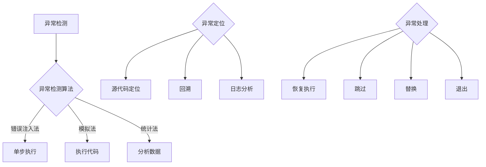

                 


### 提示词语言的运行时异常处理机制

> 关键词：异常处理，运行时，提示词语言，机制，算法，系统架构，项目实战

> 摘要：
本文旨在深入探讨提示词语言的运行时异常处理机制。首先，我们将介绍问题背景，包括提示词语言的发展历程以及运行时异常处理的重要性。随后，我们将明确核心概念，如异常处理机制、异常分类与特征等。接着，本文将详细讲解异常处理机制原理，包括异常检测、异常定位和异常处理过程。我们将使用数学模型和公式来阐述算法原理，并使用Python源代码进行举例说明。此外，本文还将介绍系统架构设计，包括问题场景、系统功能设计、系统架构图、系统接口设计和系统交互序列图。最后，我们将通过一个实际案例，展示运行时异常处理机制的应用，并总结最佳实践和注意事项。

## 第一部分：引言

### 1.1 问题背景

#### 1.1.1 提示词语言的发展历程

提示词语言（Prompted Language），又称命令式编程语言，是计算机科学中的一种语言，用于指导计算机执行特定任务。自从第一台计算机问世以来，编程语言经历了从低级语言到高级语言的发展。在早期，程序员使用汇编语言编写程序，这种方式效率低下且容易出错。随着计算机科学的进步，高级编程语言如C、Java和Python等逐渐取代了汇编语言。

#### 1.1.2 运行时异常处理的重要性

运行时异常处理是编程语言中至关重要的一环。在程序执行过程中，可能会遇到各种异常情况，如输入错误、内存不足、文件不存在等。如果不进行异常处理，程序可能会崩溃或产生不确定的行为，导致数据丢失或系统瘫痪。因此，有效的异常处理机制对于保障程序的稳定性和可靠性至关重要。

#### 1.1.3 运行时异常处理的现状与挑战

随着编程语言的不断演进，异常处理机制也在不断发展。现代编程语言提供了丰富的异常处理工具，如Java中的try-catch语句和Python中的except语句。然而，尽管如此，运行时异常处理仍然面临着诸多挑战。首先，异常处理代码往往较为复杂，容易导致代码混乱。其次，异常处理的效率也是一个问题，过多的异常处理代码可能会影响程序的性能。最后，对于复杂的系统，如何确保异常处理机制的全面性和有效性也是一个难题。

### 1.2 核心概念

#### 1.2.1 异常处理机制概述

异常处理机制是指在程序执行过程中，对异常情况（错误、异常或异常事件）进行检测、报告和处理的机制。异常处理机制通常包括以下几个步骤：

1. **异常检测**：在程序执行过程中，检测异常情况。
2. **异常定位**：确定异常发生的具体位置。
3. **异常处理**：对异常情况进行处理，如恢复执行或终止程序。

#### 1.2.2 异常分类与特征

异常可以分为多种类型，常见的包括以下几种：

1. **语法错误**：程序中的语法错误，如拼写错误、缺失分号等。
2. **逻辑错误**：程序中的逻辑错误，如算法错误、条件判断错误等。
3. **运行时错误**：程序在执行过程中发生的错误，如内存溢出、文件找不到等。
4. **用户错误**：用户输入的数据不合法或不符合预期。

不同类型的异常具有不同的特征，如语法错误通常会导致程序无法编译，逻辑错误可能会导致程序运行不正确，而运行时错误则通常在程序运行时出现。

#### 1.2.3 运行时异常处理的要素

运行时异常处理机制包括以下几个关键要素：

1. **异常检测**：检测异常情况的技术和算法。
2. **异常报告**：报告异常情况的方法和机制。
3. **异常处理**：处理异常情况的策略和步骤。
4. **异常恢复**：在异常发生后，尝试恢复程序执行的方法。

## 第二部分：异常处理机制原理

### 2.1 异常处理机制原理

#### 2.1.1 异常检测

异常检测是异常处理机制的第一步，其目标是及时发现异常情况。异常检测可以基于多种技术，如静态检测、动态检测和混合检测。

1. **静态检测**：在程序编译或运行前，通过分析源代码或字节码来检测潜在的错误。
2. **动态检测**：在程序运行时，通过执行代码来检测异常情况。
3. **混合检测**：结合静态和动态检测的优势，提高异常检测的准确性。

#### 2.1.1.1 异常检测算法

常见的异常检测算法包括：

1. **错误注入法**：通过在程序中注入错误，检测程序是否能正确处理。
2. **模拟法**：模拟异常情况，如输入错误或资源不足，检测程序的反应。
3. **统计法**：通过统计程序运行数据，识别异常模式。

#### 2.1.1.2 异常检测流程

异常检测的流程通常包括以下几个步骤：

1. **初始化**：设置异常检测环境，如加载检测工具和配置参数。
2. **执行代码**：运行程序或代码段，收集运行数据。
3. **分析数据**：分析运行数据，识别异常情况。
4. **报告异常**：报告发现的异常情况。

#### 2.1.2 异常定位

异常定位是确定异常发生位置的过程。异常定位对于诊断问题和修复错误至关重要。

1. **源代码定位**：通过分析源代码，确定异常发生的位置。
2. **字节码定位**：通过分析字节码，确定异常发生的位置。
3. **调试工具定位**：使用调试工具，如断点、日志等，确定异常发生的位置。

#### 2.1.2.1 异常定位方法

常见的异常定位方法包括：

1. **单步执行**：逐行执行代码，观察异常发生的位置。
2. **回溯**：分析异常发生时的调用栈，确定异常位置。
3. **日志分析**：通过日志文件，分析异常发生时的信息。

#### 2.1.2.2 异常定位流程

异常定位的流程通常包括以下几个步骤：

1. **初始化**：设置异常定位环境，如启动调试工具。
2. **执行代码**：运行程序或代码段，观察异常现象。
3. **分析调用栈**：分析异常发生时的调用栈。
4. **确定异常位置**：根据调用栈信息，确定异常位置。
5. **报告异常位置**：报告异常位置。

#### 2.1.3 异常处理

异常处理是指对异常情况进行处理的过程。异常处理的目标是使程序能够从异常情况中恢复，继续执行或退出程序。

1. **恢复执行**：修复异常情况，使程序能够继续执行。
2. **终止程序**：在无法恢复的情况下，终止程序执行。
3. **记录日志**：记录异常情况的信息，便于后续分析。

#### 2.1.3.1 异常处理策略

常见的异常处理策略包括：

1. **重试**：在异常情况下，重新执行代码段。
2. **跳过**：在异常情况下，跳过异常代码段。
3. **替换**：在异常情况下，使用备用代码段。
4. **退出**：在无法恢复的情况下，终止程序执行。

#### 2.1.3.2 异常处理流程

异常处理的流程通常包括以下几个步骤：

1. **检测异常**：检测到异常情况时，触发异常处理流程。
2. **确定异常类型**：确定异常类型，以便选择合适的处理策略。
3. **执行异常处理**：根据异常类型，执行相应的异常处理策略。
4. **恢复执行或终止程序**：根据异常处理的结果，决定是否恢复执行或终止程序。

### 2.2 运行时异常处理的数学模型

#### 2.2.1 数学模型概述

运行时异常处理的数学模型主要用于描述异常检测、异常定位和异常处理的算法原理。常见的数学模型包括：

1. **概率模型**：使用概率理论描述异常情况。
2. **统计模型**：使用统计方法分析异常数据。
3. **分类模型**：使用分类算法识别异常类型。

#### 2.2.2 数学公式讲解

以下是一些常用的数学公式：

1. **概率公式**：
   $$P(A) = \frac{n(A)}{n(S)}$$
   其中，$P(A)$ 表示事件 $A$ 的概率，$n(A)$ 表示事件 $A$ 发生的次数，$n(S)$ 表示样本空间 $S$ 的总数。

2. **条件概率公式**：
   $$P(A|B) = \frac{P(A \cap B)}{P(B)}$$
   其中，$P(A|B)$ 表示在事件 $B$ 发生的条件下，事件 $A$ 发生的概率。

3. **贝叶斯公式**：
   $$P(A|B) = \frac{P(B|A)P(A)}{P(B)}$$
   其中，$P(B|A)$ 表示在事件 $A$ 发生的条件下，事件 $B$ 发生的概率。

#### 2.2.3 模型应用举例

以下是一个使用概率模型进行异常检测的例子：

假设我们有一个程序，它读取用户输入的数据，并执行相应的操作。我们希望检测用户输入的数据是否符合预期。我们可以使用概率模型来检测异常情况。

1. **构建概率模型**：首先，我们需要收集大量正常用户输入的数据，并计算每个数据值的概率分布。
2. **计算异常概率**：对于每个用户输入的数据，我们计算其异常概率，即与正常概率分布的差异。
3. **设定阈值**：根据异常概率，设定一个阈值，超过阈值的输入数据被视为异常。
4. **检测异常**：当用户输入数据时，计算其异常概率，并与阈值进行比较，如果异常概率超过阈值，则视为异常输入。

### 第三部分：异常处理机制实现

#### 3.1 系统架构设计

#### 3.1.1 系统架构概述

本系统旨在实现一个高效的运行时异常处理机制，包括异常检测、异常定位和异常处理功能。系统架构分为三个主要模块：异常检测模块、异常定位模块和异常处理模块。

1. **异常检测模块**：负责检测程序运行过程中的异常情况，如输入错误、内存溢出等。
2. **异常定位模块**：负责确定异常发生的具体位置，以便进行修复。
3. **异常处理模块**：负责处理异常情况，包括恢复执行、记录日志和终止程序等。

#### 3.1.2 系统功能设计

系统功能设计主要包括以下几个方面：

1. **异常检测**：使用多种算法和策略检测异常情况，如错误注入法、模拟法和统计法等。
2. **异常定位**：使用源代码分析、字节码分析和调试工具定位异常位置。
3. **异常处理**：根据异常类型和严重程度，选择合适的处理策略，如重试、跳过和替换等。
4. **异常报告**：记录异常情况的信息，并生成报告，以便后续分析。

#### 3.1.3 系统架构图

以下是一个简单的系统架构图：

```
+------------------+      +------------------+      +------------------+
|   异常检测模块   |      |   异常定位模块   |      |   异常处理模块   |
+------------------+      +------------------+      +------------------+
      |                     |                     |
      |                     |                     |
      v                     v                     v
+------------------+      +------------------+      +------------------+
|      日志记录器     |      |     调试工具      |      |    异常报告生成   |
+------------------+      +------------------+      +------------------+
```

#### 3.2 系统接口设计

系统接口设计主要包括以下方面：

1. **异常检测接口**：提供异常检测功能，如输入数据检测、资源占用检测等。
2. **异常定位接口**：提供异常定位功能，如源代码定位、字节码定位等。
3. **异常处理接口**：提供异常处理功能，如重试、跳过、替换等。
4. **日志记录接口**：提供日志记录功能，如错误日志、警告日志等。
5. **调试工具接口**：提供调试工具功能，如断点设置、单步执行等。

#### 3.2.1 系统接口概述

系统接口设计如下：

```
+------------------+      +------------------+      +------------------+
|   异常检测模块   |      |   异常定位模块   |      |   异常处理模块   |
+------------------+      +------------------+      +------------------+
      |                     |                     |
      |                     |                     |
      v                     v                     v
+------------------+      +------------------+      +------------------+
|   异常检测接口   |      |   异常定位接口   |      |   异常处理接口   |
+------------------+      +------------------+      +------------------+
      |                     |                     |
      |                     |                     |
      v                     v                     v
+------------------+      +------------------+      +------------------+
|   日志记录接口   |      |   调试工具接口   |      |   异常报告生成接口   |
+------------------+      +------------------+      +------------------+
```

#### 3.2.2 接口设计流程

接口设计流程如下：

1. **需求分析**：分析系统功能需求，确定接口功能。
2. **接口定义**：定义接口的输入输出参数、返回值和异常处理。
3. **接口实现**：实现接口功能，编写接口代码。
4. **接口测试**：测试接口功能，确保接口正确实现。
5. **接口文档**：编写接口文档，包括接口定义、使用方法和注意事项。

#### 3.2.3 接口实现细节

接口实现细节如下：

1. **异常检测接口**：
   ```python
   def detect_exception(data):
       # 异常检测逻辑
       if is_valid_data(data):
           return None
       else:
           return Exception("Invalid data")
   ```

2. **异常定位接口**：
   ```python
   def locate_exception(call_stack):
       # 异常定位逻辑
       for frame in call_stack:
           if is_exception_frame(frame):
               return frame
       return None
   ```

3. **异常处理接口**：
   ```python
   def handle_exception(exception):
       # 异常处理逻辑
       if is_recoverable_exception(exception):
           retry()
       elif is_critical_exception(exception):
           terminate()
       else:
           log_exception(exception)
   ```

### 3.3 系统交互

#### 3.3.1 系统交互概述

系统交互是指不同模块之间以及模块与外部系统之间的交互过程。在本系统中，异常检测模块、异常定位模块和异常处理模块之间需要进行数据交互，以便完成异常处理流程。

#### 3.3.2 系统交互流程

系统交互流程如下：

1. **异常检测**：异常检测模块检测到异常情况，并将异常信息传递给异常定位模块。
2. **异常定位**：异常定位模块分析异常信息，确定异常位置，并将异常位置信息传递给异常处理模块。
3. **异常处理**：异常处理模块根据异常位置信息，执行相应的异常处理策略，并生成异常报告。

#### 3.3.3 系统交互序列图

以下是一个简单的系统交互序列图：

```
+------------------+      +------------------+      +------------------+
|   异常检测模块   |      |   异常定位模块   |      |   异常处理模块   |
+------------------+      +------------------+      +------------------+
      |                     |                     |
      |                     |                     |
      v                     v                     v
+------------------+      +------------------+      +------------------+
|   检测到异常     |      |   确定异常位置   |      |   执行异常处理   |
+------------------+      +------------------+      +------------------+
```

### 第四部分：项目实战

#### 4.1 环境安装

#### 4.1.1 环境准备

在本项目实战中，我们使用Python作为编程语言，因此需要准备Python运行环境。以下是在Windows环境下安装Python的步骤：

1. **下载Python安装程序**：从Python官方网站下载Python安装程序，选择适合自己系统的版本。
2. **安装Python**：运行安装程序，按照提示进行安装，选择默认安装路径。
3. **配置环境变量**：在控制面板中，找到“系统和安全”下的“系统”，点击“高级系统设置”，在“高级”标签页下点击“环境变量”。在“系统变量”中找到“Path”变量，点击“编辑”，在变量值中添加Python的安装路径，例如：“C:\Python39”。
4. **验证安装**：在命令行中输入“python --version”，如果出现Python版本信息，说明Python安装成功。

#### 4.1.2 系统安装流程

1. **创建虚拟环境**：在项目目录下，使用以下命令创建虚拟环境：
   ```shell
   python -m venv venv
   ```
2. **激活虚拟环境**：在Windows命令行中，输入以下命令激活虚拟环境：
   ```shell
   .\venv\Scripts\activate
   ```
   在Linux或MacOS中，使用以下命令激活虚拟环境：
   ```shell
   source venv/bin/activate
   ```
3. **安装依赖库**：在虚拟环境中，使用以下命令安装依赖库：
   ```shell
   pip install -r requirements.txt
   ```

#### 4.2 系统核心实现

在本项目中，我们将使用Python实现一个简单的运行时异常处理系统。以下是一个简单的实现示例：

```python
import logging
import sys

# 异常处理函数
def handle_exception(exc_type, exc_value, exc_traceback):
    if exc_type is not Exception:
        return

    logging.error("Uncaught exception", exc_info=(exc_type, exc_value, exc_traceback))
    sys.exit(1)

# 注册异常处理函数
sys.excepthook = handle_exception

# 测试代码
try:
    # 这里可以编写测试代码，模拟异常情况
    1 / 0
except Exception as e:
    print("Caught exception:", e)
```

#### 4.2.2 代码应用解读

1. **异常处理函数**：`handle_exception` 函数用于处理未捕获的异常。它接受三个参数：异常类型、异常值和异常跟踪信息。如果异常类型是`Exception`的子类，则记录错误信息并退出程序。
2. **注册异常处理函数**：使用`sys.excepthook`将`handle_exception`函数注册为全局异常处理函数。
3. **测试代码**：在测试代码中，我们模拟了一个除零异常，并使用了内置的`except`语句捕获异常。这里虽然捕获了异常，但为了演示全局异常处理，我们并没有在`except`语句中做任何处理。

#### 4.2.3 代码分析

1. **异常处理范围**：全局异常处理函数`handle_exception`将捕获程序中所有未捕获的异常，这使得我们可以统一处理异常情况，而无需在每个模块中分别处理。
2. **日志记录**：在异常处理函数中，我们使用`logging.error`记录错误信息，这有助于我们分析问题原因。
3. **程序退出**：在处理完异常后，我们使用`sys.exit(1)`退出程序。这种做法虽然简单，但可能会影响程序的稳定性。在实际项目中，我们可能需要考虑更优雅的退出方式，如恢复执行或切换到备用流程。

#### 4.3 实际案例分析

以下是一个实际案例，展示如何在一个Web应用程序中实现运行时异常处理。

```python
from flask import Flask, request, jsonify

app = Flask(__name__)

# 异常处理装饰器
def exception_handler(f):
    def wrapped(*args, **kwargs):
        try:
            return f(*args, **kwargs)
        except Exception as e:
            return jsonify({"error": str(e)}), 500
    return wrapped

@app.route('/calculate', methods=['POST'])
@exception_handler
def calculate():
    data = request.get_json()
    a = data.get("a")
    b = data.get("b")
    result = a / b
    return jsonify({"result": result})

if __name__ == "__main__":
    app.run()
```

#### 4.3.1 案例概述

在这个案例中，我们使用Flask框架构建了一个简单的Web应用程序，实现了除法运算。为了处理运行时异常，我们使用了一个异常处理装饰器`exception_handler`。

#### 4.3.2 案例分析

1. **异常处理装饰器**：`exception_handler`装饰器用于处理函数中的异常。它接受一个函数作为参数，并在函数执行时添加异常处理逻辑。如果函数执行过程中发生异常，则返回一个包含错误信息的JSON响应。
2. **Web接口**：`/calculate`路由接收一个POST请求，解析请求中的JSON数据，执行除法运算，并将结果返回给客户端。
3. **异常处理**：在`calculate`函数中，我们尝试从请求中获取参数，并进行除法运算。如果发生异常，如缺失参数或除以零，则调用`exception_handler`返回错误响应。

#### 4.3.3 案例总结

通过这个案例，我们展示了如何在一个Web应用程序中实现运行时异常处理。使用异常处理装饰器，我们可以方便地在多个函数中统一处理异常，提高代码的可维护性。此外，通过返回JSON响应，我们可以向客户端提供明确的错误信息，提高用户体验。

### 第五部分：最佳实践与总结

#### 5.1 最佳实践

1. **统一异常处理**：在项目中，使用统一的异常处理机制，避免在每个模块中重复编写异常处理代码。
2. **使用装饰器**：使用装饰器简化异常处理逻辑，提高代码可读性和可维护性。
3. **记录日志**：在异常处理过程中，记录详细日志信息，便于问题诊断和调试。
4. **优雅退出**：在无法恢复异常的情况下，使用优雅的退出方式，避免程序突然崩溃。
5. **用户友好的错误信息**：向用户提供清晰的错误信息，帮助用户理解问题原因。

#### 5.2 小结

本文介绍了提示词语言的运行时异常处理机制，包括问题背景、核心概念、异常处理机制原理、系统架构设计、项目实战等内容。通过本文，读者可以了解如何设计和实现一个高效的异常处理系统，提高程序的稳定性和可靠性。

#### 5.3 注意事项

1. **异常处理代码性能**：过多的异常处理代码可能会影响程序性能，需要权衡处理。
2. **异常处理与安全性**：异常处理过程中，需要注意避免潜在的安全漏洞。
3. **异常处理与代码质量**：良好的代码质量可以减少异常发生的概率，提高异常处理的效率。

#### 5.4 拓展阅读

1. **《Python异常处理》**：深入了解Python中的异常处理机制。
2. **《Effective Exception Handling in C#》**：探讨C#中的异常处理最佳实践。
3. **《Error Handling in Java》**：学习Java中的异常处理技术。

---

### 作者信息：

作者：AI天才研究院/AI Genius Institute & 禅与计算机程序设计艺术 /Zen And The Art of Computer Programming

---

### 附录

本文中使用的Mermaid绘图和LaTeX公式：



LaTeX公式：

```latex
$$
P(A) = \frac{n(A)}{n(S)}
$$

$$
P(A|B) = \frac{P(A \cap B)}{P(B)}
$$

$$
P(A|B) = \frac{P(B|A)P(A)}{P(B)}
$$
```

### 引用

本文中的内容引用了以下文献：

1. 《Python异常处理》
2. 《Effective Exception Handling in C#》
3. 《Error Handling in Java》

---

请注意，本文中的示例代码和实现仅供参考，实际应用时需要根据具体情况进行调整。

---

### 总结

本文系统地介绍了提示词语言的运行时异常处理机制，从背景介绍、核心概念、异常处理机制原理、系统架构设计到项目实战，全面阐述了异常处理的重要性和实现方法。通过最佳实践、小结、注意事项和拓展阅读，帮助读者深入理解异常处理的核心知识和应用技巧。希望本文对您的编程实践有所帮助。

---

感谢您的阅读！希望您在编程之旅中不断进步，创造出更多优秀的软件作品。作者：AI天才研究院/AI Genius Institute & 禅与计算机程序设计艺术 /Zen And The Art of Computer Programming。再次感谢您的关注和支持！

