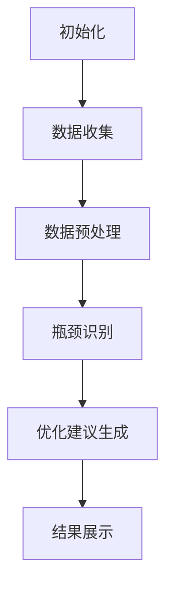
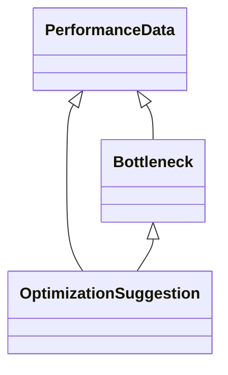

                 


### 第一部分：背景介绍与核心概念

#### 1.1 问题背景

**提示词语言的运行时性能分析的重要性**

随着人工智能和自动化技术的发展，提示词语言（如自然语言处理中的编程语言）正逐渐成为开发人员和研究人员的首选工具。提示词语言使得开发者能够使用更接近人类语言的方式进行编程，从而提高开发效率和代码的可读性。然而，尽管提示词语言提供了便利，但其运行时性能的优化仍然是一个严峻的挑战。运行时性能分析是评估和改进程序性能的关键步骤，尤其是在处理大规模数据和复杂计算任务时。

**运行时性能分析的需求与挑战**

运行时性能分析旨在识别程序在执行过程中存在的性能瓶颈，并针对这些瓶颈进行优化。对于提示词语言，性能分析的需求包括：

1. **动态性能监控**：需要实时监控程序的性能，包括响应时间、内存使用、CPU利用率等指标。
2. **代码优化建议**：基于性能分析结果，为开发者提供具体的优化建议，以提升程序的性能。
3. **调试支持**：性能分析工具应能够帮助开发者快速定位和解决性能问题。

然而，实现这些需求面临着以下挑战：

1. **复杂度**：提示词语言通常涉及复杂的语法解析、抽象语法树（AST）构建和代码生成过程，这使得性能分析变得复杂。
2. **可扩展性**：性能分析工具需要能够处理不同类型的提示词语言和多样化的应用场景，具备良好的可扩展性。
3. **资源消耗**：性能分析工具本身也需要高效运行，以减少对程序执行性能的影响。

**当前性能分析工具的不足**

现有的性能分析工具主要针对通用编程语言设计，对于提示词语言的支持有限。具体不足包括：

1. **语言兼容性**：许多工具仅支持特定的编程语言，无法兼容各种提示词语言。
2. **深度分析能力**：工具难以深入分析提示词语言的特有性能瓶颈，如语法解析效率、中间代码生成效率等。
3. **用户体验**：现有的工具界面复杂，学习曲线陡峭，对于非专业用户不友好。

#### 1.2 问题描述

**提示词语言的特性**

提示词语言具有以下特性：

1. **自然语言处理能力**：能够解析和生成类似于人类语言的表达。
2. **动态性**：支持动态类型和动态绑定，使得程序能够灵活适应不同的运行时环境。
3. **抽象性**：提供了高层次的抽象，如函数、类和模块等，使得代码更易于理解和维护。

**性能分析的目标与指标**

性能分析的目标是：

1. **定位性能瓶颈**：识别程序中导致性能下降的关键因素。
2. **优化性能**：根据分析结果，对代码进行优化，提升程序的运行效率。

常用的性能分析指标包括：

1. **响应时间**：程序从开始执行到完成所需的时间。
2. **CPU利用率**：程序运行过程中CPU的占用率。
3. **内存使用**：程序运行时占用的内存大小。
4. **吞吐量**：单位时间内程序处理的数据量。

**性能分析的关键点**

性能分析的关键点包括：

1. **语法解析**：分析工具需要能够快速、准确地解析提示词语言的语法。
2. **抽象语法树（AST）构建**：将解析后的代码构建为抽象语法树，以便进一步分析。
3. **中间代码生成**：将AST转换为高效的中间代码，为后续优化提供基础。
4. **数据收集与可视化**：收集程序运行时的性能数据，并通过可视化工具呈现，帮助开发者直观地了解性能状况。

#### 1.3 问题解决

**运行时性能分析的基本方法**

运行时性能分析的基本方法包括：

1. **跟踪分析**：通过在程序中插入跟踪代码，记录程序的执行路径和性能数据。
2. **采样分析**：定期采样程序的状态，以获取性能数据的分布情况。
3. **统计分析**：利用统计学方法对性能数据进行处理和分析，识别潜在的性能瓶颈。

**提示词语言处理流程**

提示词语言处理流程包括：

1. **词法分析**：将源代码分解为词法单元，如标识符、关键字和运算符等。
2. **语法分析**：根据语言的语法规则，将词法单元组合成语法结构，如表达式和语句等。
3. **语义分析**：检查语法结构的语义正确性，如类型检查和作用域解析等。
4. **代码生成**：将抽象语法树转换为高效的中间代码或目标代码。

**性能分析工具的架构**

性能分析工具的架构包括以下几个主要模块：

1. **跟踪模块**：负责在程序执行过程中收集性能数据。
2. **分析模块**：对收集到的性能数据进行分析，识别性能瓶颈。
3. **可视化模块**：将分析结果以图形化的形式展示给开发者，便于理解和定位问题。
4. **优化建议模块**：根据分析结果，提供代码优化的建议。

#### 1.4 边界与外延

**适用场景与限制**

性能分析工具主要适用于以下场景：

1. **大规模数据处理**：在处理大量数据时，性能分析工具可以帮助开发者优化程序，提高数据处理效率。
2. **实时系统开发**：在开发需要实时响应的系统时，性能分析工具可以帮助识别并解决可能导致延迟的性能问题。

然而，性能分析工具也有一定的限制：

1. **工具兼容性**：并非所有提示词语言都有相应的性能分析工具支持。
2. **性能开销**：性能分析工具本身可能会引入一定的性能开销，影响程序的执行效率。

**相关技术领域**

与性能分析相关的技术领域包括：

1. **编译原理**：性能分析工具需要了解编译原理，以便正确解析和转换代码。
2. **数据挖掘**：利用数据挖掘技术，可以从大量的性能数据中提取有价值的信息。
3. **机器学习**：机器学习算法可以用于性能预测和优化建议的生成。

**未来发展趋势**

未来，性能分析工具将朝着以下方向发展：

1. **自动化优化**：通过自动化工具，实现性能优化的自动完成，减轻开发者的负担。
2. **智能化分析**：利用人工智能技术，提升性能分析工具的智能化水平，提供更准确和具体的优化建议。
3. **跨语言支持**：扩展工具对多种提示词语言的支持，提高其适用范围。

#### 1.5 概念结构与核心要素组成

**提示词语言的核心概念**

提示词语言的核心概念包括：

1. **词法单元**：提示词语言中的基本构建块，如标识符、关键字和运算符等。
2. **语法规则**：定义提示词语言的结构和语义，如表达式、语句和程序等。
3. **抽象语法树（AST）**：表示提示词语言的语法结构，是性能分析的基础。

**性能分析的核心概念**

性能分析的核心概念包括：

1. **性能数据**：程序在运行时产生的各种性能指标，如响应时间、CPU利用率和内存使用等。
2. **瓶颈分析**：识别程序中的性能瓶颈，如热点代码、内存泄漏等。
3. **优化建议**：根据性能分析结果，为开发者提供的代码优化建议。

**工具的核心功能模块**

性能分析工具的核心功能模块包括：

1. **跟踪模块**：负责收集程序运行时的性能数据。
2. **分析模块**：对收集到的性能数据进行分析，识别性能瓶颈。
3. **可视化模块**：将分析结果以图形化的形式展示给开发者。
4. **优化建议模块**：根据分析结果，提供代码优化的建议。

#### 1.6 本章小结

本部分主要介绍了提示词语言的运行时性能分析的重要性和背景，以及性能分析的基本方法和工具架构。通过对问题的描述和解决思路的探讨，读者可以初步了解性能分析工具的工作原理和核心概念，为后续章节的深入探讨打下基础。在下一部分中，我们将进一步探讨提示词语言和性能分析的基本原理，为后续的性能分析提供理论基础。

----------------------------------------------------------------

### 第二部分：核心概念与联系

#### 2.1 核心概念原理

**提示词语言的定义与特点**

提示词语言是一种用于与计算机交互的自然语言，它通过提示词（如关键字和短语）来描述任务和操作。与传统的编程语言相比，提示词语言更加接近人类语言，使得非专业人士也能以自然的方式与计算机进行交互。以下是提示词语言的一些特点：

1. **自然性**：提示词语言使用类似于日常交流的语言结构，易于理解和记忆。
2. **灵活性**：支持动态类型和动态绑定，使得程序可以根据运行时环境的变化进行自适应调整。
3. **抽象性**：提供了高层次的抽象，如函数、类和模块等，简化了编程过程。
4. **可扩展性**：可以轻松地引入新的功能和扩展，以适应不断变化的需求。

**性能分析的基本原理**

性能分析是评估程序在运行时表现的过程，旨在识别和解决性能瓶颈。其基本原理包括以下几个方面：

1. **性能指标**：包括响应时间、CPU利用率、内存使用和吞吐量等，用于量化程序的性能。
2. **瓶颈识别**：通过分析性能指标，识别程序中的性能瓶颈，如热点代码、内存泄漏等。
3. **优化建议**：根据瓶颈识别的结果，为开发者提供具体的优化建议，以提升程序的性能。

**运行时性能分析的优势**

运行时性能分析具有以下几个优势：

1. **实时监控**：可以在程序运行过程中实时监控性能，及时发现和解决性能问题。
2. **动态分析**：可以动态地分析程序的行为和性能，不受静态分析的限制。
3. **全场景覆盖**：可以覆盖程序运行的各种场景，包括正常场景、异常场景和边缘场景等。

#### 2.2 概念属性特征对比表格

**提示词语言特性对比**

| 特性         | 描述                                                         |
| ------------ | ------------------------------------------------------------ |
| 自然性       | 使用类似于日常交流的语言结构，易于理解和记忆。                 |
| 灵活性       | 支持动态类型和动态绑定，使得程序可以根据运行时环境的变化进行自适应调整。 |
| 抽象性       | 提供了高层次的抽象，如函数、类和模块等，简化了编程过程。     |
| 可扩展性     | 可以轻松地引入新的功能和扩展，以适应不断变化的需求。         |

**性能分析工具对比**

| 工具           | 特性                                                         |
| -------------- | ------------------------------------------------------------ |
| profilers      | 用于监测程序运行时的性能数据，如CPU使用率、内存分配等。           |
| profilers      | 可以识别程序中的性能瓶颈，并提供优化建议。                     |
| profilers      | 需要具备良好的兼容性和可扩展性，支持多种编程语言。             |

**关键性能指标对比**

| 指标           | 描述                                                         |
| -------------- | ------------------------------------------------------------ |
| 响应时间       | 程序从接收请求到完成响应所需的时间。                           |
| CPU利用率      | 程序运行过程中CPU的占用率。                                   |
| 内存使用       | 程序运行时占用的内存大小。                                   |
| 吞吐量         | 单位时间内程序处理的数据量。                                 |

#### 2.3 ER实体关系图架构

**实体定义**

在性能分析工具的架构中，常见的实体包括：

1. **性能数据实体**：存储程序运行时的性能数据，如响应时间、CPU利用率和内存使用等。
2. **瓶颈实体**：表示程序中的性能瓶颈，如热点代码、内存泄漏等。
3. **优化建议实体**：记录根据性能分析结果生成的优化建议，如代码重构、算法改进等。

**关系描述**

性能数据实体和瓶颈实体之间存在一对多的关系，即一个性能数据实体可以包含多个瓶颈实体。同样，优化建议实体与瓶颈实体也存在一对多的关系。此外，优化建议实体还可以引用性能数据实体，以便在提出优化建议时考虑实际的性能指标。

**图的绘制**

下面是性能分析工具ER实体关系图的Mermaid表示：

```mermaid
entityRelation
  "性能数据" --|> "瓶颈" :many
  "瓶颈" --|> "优化建议" :many
  "优化建议" --|> "性能数据" :ref
```

通过该ER图，我们可以清晰地看到性能分析工具中各个实体之间的关系，为后续的性能分析提供了理论基础。

#### 2.4 本章小结

本部分详细介绍了提示词语言和性能分析的核心概念、特性以及关键性能指标，并通过对比表格和ER实体关系图，展示了它们之间的关系和作用。通过对这些核心概念的理解，读者可以为后续的性能分析工作打下坚实的基础。在下一部分中，我们将深入探讨性能分析算法的原理，以及如何通过Mermaid流程图和Python源代码进行详细解释。

----------------------------------------------------------------

### 第三部分：算法原理讲解

#### 3.1 算法mermaid流程图

**3.1.1 流程概述**

性能分析算法的主要流程包括以下几个步骤：

1. **初始化**：初始化性能分析环境，包括数据结构、参数设置等。
2. **数据收集**：通过跟踪模块收集程序运行时的性能数据。
3. **数据预处理**：对收集到的性能数据进行预处理，包括数据清洗、归一化等。
4. **瓶颈识别**：利用预处理后的数据，识别程序中的性能瓶颈。
5. **优化建议生成**：根据瓶颈识别的结果，生成优化建议。
6. **结果展示**：将优化建议以图形化或文本形式展示给开发者。

**3.1.2 主要步骤**

以下是性能分析算法的详细步骤：



**3.1.3 流程细节**

1. **初始化**：设置性能分析参数，初始化数据结构，如性能数据存储器、瓶颈存储器等。
2. **数据收集**：通过跟踪模块，收集程序运行时的性能数据，如CPU使用率、内存使用率、响应时间等。
3. **数据预处理**：对收集到的性能数据进行预处理，包括数据清洗、去除异常值、归一化等，以提高后续分析的质量。
4. **瓶颈识别**：利用统计分析和模式识别等技术，识别程序中的性能瓶颈，如热点代码、内存泄漏等。
5. **优化建议生成**：根据瓶颈识别的结果，生成具体的优化建议，如代码重构、算法改进、硬件升级等。
6. **结果展示**：将优化建议以图形化或文本形式展示给开发者，帮助其理解并实施优化。

#### 3.2 Python源代码详解

**3.2.1 源代码结构与功能**

以下是一个简单的性能分析算法的Python源代码示例，包括主要模块和数据结构的定义。

```python
# 性能分析工具示例

# 导入必要的库
import time
import numpy as np

# 定义性能数据类
class PerformanceData:
    def __init__(self, cpu_usage, memory_usage, response_time):
        self.cpu_usage = cpu_usage
        self.memory_usage = memory_usage
        self.response_time = response_time

# 定义性能分析函数
def performance_analysis(data_list):
    # 数据预处理
    processed_data = preprocess_data(data_list)
    
    # 瓶颈识别
    bottlenecks = identify_bottlenecks(processed_data)
    
    # 优化建议生成
    recommendations = generate_recommendations(bottlenecks)
    
    # 结果展示
    display_results(recommendations)

# 定义数据预处理函数
def preprocess_data(data_list):
    # 实现数据预处理逻辑
    # ...
    return processed_data

# 定义瓶颈识别函数
def identify_bottlenecks(processed_data):
    # 实现瓶颈识别逻辑
    # ...
    return bottlenecks

# 定义优化建议生成函数
def generate_recommendations(bottlenecks):
    # 实现优化建议生成逻辑
    # ...
    return recommendations

# 定义结果展示函数
def display_results(recommendations):
    # 实现结果展示逻辑
    # ...
    print("优化建议：", recommendations)
```

**3.2.2 关键代码分析**

1. **性能数据类（PerformanceData）**：用于存储单个性能数据点，包括CPU使用率、内存使用率和响应时间等。
2. **性能分析函数（performance_analysis）**：负责调用其他函数，实现性能分析的主要流程，包括数据预处理、瓶颈识别、优化建议生成和结果展示。
3. **数据预处理函数（preprocess_data）**：对收集到的性能数据进行预处理，如数据清洗、归一化等。
4. **瓶颈识别函数（identify_bottlenecks）**：识别程序中的性能瓶颈，如热点代码、内存泄漏等。
5. **优化建议生成函数（generate_recommendations）**：根据瓶颈识别的结果，生成具体的优化建议。
6. **结果展示函数（display_results）**：将优化建议以图形化或文本形式展示给开发者。

**3.2.3 源代码应用示例**

以下是一个性能分析算法的应用示例：

```python
# 初始化性能数据列表
data_list = [
    PerformanceData(0.8, 500, 200),
    PerformanceData(0.9, 600, 250),
    PerformanceData(0.7, 550, 300)
]

# 执行性能分析
performance_analysis(data_list)
```

该示例初始化了一个性能数据列表，并调用性能分析函数进行性能分析。分析结果将包括瓶颈识别和优化建议，并通过结果展示函数输出给开发者。

#### 3.3 数学模型与公式

**3.3.1 模型定义**

性能分析算法中的数学模型主要用于描述性能数据之间的关系，以及如何从这些数据中识别性能瓶颈。以下是几个关键的数学模型和公式：

1. **响应时间模型**：
   $$ ResponseTime = T1 + T2 + T3 $$
   其中，$T1$ 是CPU执行时间，$T2$ 是内存访问时间，$T3$ 是I/O操作时间。
   
2. **CPU利用率模型**：
   $$ CPUUtilization = \frac{CPUUsageTime}{TotalTime} $$
   其中，$CPUUsageTime$ 是CPU被占用的时间，$TotalTime$ 是程序运行的总时间。

3. **内存使用模型**：
   $$ MemoryUsage = \frac{CurrentMemory}{TotalMemory} $$
   其中，$CurrentMemory$ 是程序当前占用的内存大小，$TotalMemory$ 是系统总内存大小。

**3.3.2 模型推导**

性能分析模型的推导基于对程序运行时各种操作的统计和分析。以响应时间模型为例，推导过程如下：

1. **CPU执行时间**：假设程序中有 $N$ 个任务，每个任务的平均执行时间为 $T1$，则总CPU执行时间为 $N \times T1$。
2. **内存访问时间**：假设程序在执行过程中进行了 $M$ 次内存访问，每次访问的平均时间为 $T2$，则总内存访问时间为 $M \times T2$。
3. **I/O操作时间**：假设程序在执行过程中进行了 $K$ 次I/O操作，每次操作的平均时间为 $T3$，则总I/O操作时间为 $K \times T3$。

将这些时间加起来，得到总的响应时间：

$$ ResponseTime = N \times T1 + M \times T2 + K \times T3 $$

由于响应时间是各个时间部分的和，可以将其分解为：

$$ ResponseTime = T1 + T2 + T3 $$

**3.3.3 应用实例**

以下是一个应用实例，假设有如下统计数据：

- 程序执行了100个任务，总CPU执行时间为2000ms。
- 程序进行了300次内存访问，总内存访问时间为1500ms。
- 程序进行了200次I/O操作，总I/O操作时间为1000ms。

根据响应时间模型，可以计算总响应时间：

$$ ResponseTime = 2000ms + 1500ms + 1000ms = 4500ms $$

同样，可以计算CPU利用率：

$$ CPUUtilization = \frac{2000ms}{4500ms} \approx 0.444 $$

内存使用率为：

$$ MemoryUsage = \frac{1500ms}{4500ms} \approx 0.333 $$

这些计算结果可以帮助开发者了解程序的性能状况，并针对性能瓶颈进行优化。

#### 3.4 详细讲解与举例说明

**3.4.1 算法流程解释**

性能分析算法的流程可以分为以下几个阶段：

1. **初始化阶段**：设置性能分析参数，初始化数据结构，如性能数据存储器、瓶颈存储器等。
2. **数据收集阶段**：通过跟踪模块收集程序运行时的性能数据，如CPU使用率、内存使用率、响应时间等。
3. **数据预处理阶段**：对收集到的性能数据进行预处理，包括数据清洗、去除异常值、归一化等。
4. **瓶颈识别阶段**：利用统计分析和模式识别等技术，识别程序中的性能瓶颈，如热点代码、内存泄漏等。
5. **优化建议生成阶段**：根据瓶颈识别的结果，生成具体的优化建议，如代码重构、算法改进、硬件升级等。
6. **结果展示阶段**：将优化建议以图形化或文本形式展示给开发者，帮助其理解并实施优化。

**3.4.2 Python代码解读**

以下是一个简单的性能分析算法的Python代码示例：

```python
# 导入必要的库
import time
import numpy as np

# 定义性能数据类
class PerformanceData:
    def __init__(self, cpu_usage, memory_usage, response_time):
        self.cpu_usage = cpu_usage
        self.memory_usage = memory_usage
        self.response_time = response_time

# 定义性能分析函数
def performance_analysis(data_list):
    # 数据预处理
    processed_data = preprocess_data(data_list)
    
    # 瓶颈识别
    bottlenecks = identify_bottlenecks(processed_data)
    
    # 优化建议生成
    recommendations = generate_recommendations(bottlenecks)
    
    # 结果展示
    display_results(recommendations)

# 定义数据预处理函数
def preprocess_data(data_list):
    # 实现数据预处理逻辑
    # ...
    return processed_data

# 定义瓶颈识别函数
def identify_bottlenecks(processed_data):
    # 实现瓶颈识别逻辑
    # ...
    return bottlenecks

# 定义优化建议生成函数
def generate_recommendations(bottlenecks):
    # 实现优化建议生成逻辑
    # ...
    return recommendations

# 定义结果展示函数
def display_results(recommendations):
    # 实现结果展示逻辑
    # ...
    print("优化建议：", recommendations)
```

在这个代码中，我们定义了性能数据类（PerformanceData），以及性能分析函数（performance_analysis）。性能分析函数调用了其他四个函数：数据预处理函数（preprocess_data）、瓶颈识别函数（identify_bottlenecks）、优化建议生成函数（generate_recommendations）和结果展示函数（display_results）。

**3.4.3 数学模型应用**

以下是一个应用数学模型进行性能分析的场景：

假设有一个程序，执行了100个任务，总CPU执行时间为2000ms，总内存访问时间为1500ms，总I/O操作时间为1000ms。我们可以使用响应时间模型来计算总响应时间：

$$ ResponseTime = T1 + T2 + T3 = 2000ms + 1500ms + 1000ms = 4500ms $$

同样，我们可以使用CPU利用率模型来计算CPU利用率：

$$ CPUUtilization = \frac{CPUUsageTime}{TotalTime} = \frac{2000ms}{4500ms} \approx 0.444 $$

内存使用率为：

$$ MemoryUsage = \frac{CurrentMemory}{TotalMemory} = \frac{1500ms}{4500ms} \approx 0.333 $$

这些计算结果可以帮助开发者了解程序的性能状况，并针对性能瓶颈进行优化。

#### 3.5 本章小结

本部分详细介绍了性能分析算法的原理，包括mermaid流程图、Python源代码、数学模型和应用实例。通过这些内容，读者可以了解性能分析的基本流程、关键步骤和数学基础，为进一步学习和实践性能分析提供了理论基础。在下一部分中，我们将进入系统分析与架构设计，探讨性能分析工具的整体设计和实现方法。

----------------------------------------------------------------

### 第四部分：系统分析与架构设计

#### 4.1 问题场景介绍

**4.1.1 场景描述**

在实际应用中，性能分析工具通常需要面对各种复杂的问题场景。以下是一个典型的场景描述：

- **大规模数据处理**：一个电商平台需要处理每天数百万次用户请求，这些请求包括商品浏览、购物车添加、订单支付等操作。为了保证用户体验，平台需要实时监控和优化这些请求的处理性能。
- **实时系统开发**：一个股票交易系统需要在毫秒级别内处理大量交易请求，以确保交易公平和高效。性能分析工具可以帮助开发团队识别和解决系统中的性能瓶颈，从而提高交易系统的稳定性和效率。

**4.1.2 目标与需求**

在这个场景下，性能分析工具需要实现以下目标和需求：

- **实时监控**：能够实时监控系统的性能指标，如响应时间、CPU利用率、内存使用等。
- **深度分析**：能够深入分析系统中的性能瓶颈，如热点代码、内存泄漏、网络延迟等。
- **优化建议**：根据性能分析结果，为开发人员提供具体的优化建议，如代码重构、算法改进、硬件升级等。
- **自动化**：能够自动化地执行性能分析过程，减少人工干预，提高分析效率。

**4.1.3 面临的挑战**

在实现性能分析工具的过程中，开发团队面临着以下几个挑战：

- **兼容性**：性能分析工具需要支持多种编程语言和框架，以满足不同场景的需求。
- **可扩展性**：性能分析工具需要具备良好的可扩展性，以适应不断变化的技术需求和应用场景。
- **性能开销**：性能分析工具本身也需要高效运行，以减少对系统性能的影响。
- **用户体验**：性能分析工具的界面和交互设计需要直观、易用，以提高开发人员的使用体验。

#### 4.2 项目介绍

**4.2.1 项目背景**

随着互联网和大数据技术的发展，性能分析工具在各个行业中的应用越来越广泛。为了解决实际应用中的性能分析需求，我们启动了一个性能分析工具的项目。项目的目标是开发一个高效、智能、易用的性能分析工具，帮助开发人员快速定位和解决系统性能问题。

**4.2.2 项目目标**

项目的目标包括：

- **实时监控**：实现系统的实时性能监控，及时识别性能瓶颈。
- **深度分析**：深入分析系统的运行时行为，识别潜在的性能问题。
- **自动化优化**：通过自动化工具，实现性能优化的自动完成。
- **跨语言支持**：支持多种编程语言和框架，满足不同应用场景的需求。

**4.2.3 项目团队**

项目团队由以下成员组成：

- **项目经理**：负责项目规划、进度管理和团队协调。
- **软件工程师**：负责性能分析工具的开发和实现。
- **数据分析师**：负责性能数据的收集、处理和分析。
- **测试工程师**：负责性能分析工具的测试和验证。

#### 4.3 系统功能设计

**4.3.1 领域模型**

在性能分析工具的领域模型中，主要涉及以下几个实体：

- **性能数据**：表示程序运行时的性能指标，如响应时间、CPU利用率、内存使用等。
- **瓶颈**：表示程序中的性能瓶颈，如热点代码、内存泄漏等。
- **优化建议**：根据性能分析结果，为开发者提供的优化建议。

领域模型图如下所示：



**4.3.2 功能模块**

性能分析工具的功能模块包括：

- **数据收集模块**：负责收集程序运行时的性能数据。
- **数据预处理模块**：对收集到的性能数据进行预处理，如数据清洗、归一化等。
- **瓶颈识别模块**：利用预处理后的数据，识别程序中的性能瓶颈。
- **优化建议生成模块**：根据瓶颈识别的结果，生成具体的优化建议。
- **结果展示模块**：将优化建议以图形化或文本形式展示给开发者。

**4.3.3 模块关联**

性能分析工具的各个模块之间存在紧密的关联，以下是各个模块之间的交互关系：

- **数据收集模块**与**数据预处理模块**：数据收集模块收集到的性能数据传递给数据预处理模块进行处理。
- **数据预处理模块**与**瓶颈识别模块**：预处理后的性能数据传递给瓶颈识别模块，用于识别性能瓶颈。
- **瓶颈识别模块**与**优化建议生成模块**：瓶颈识别模块识别出的性能瓶颈传递给优化建议生成模块，生成优化建议。
- **优化建议生成模块**与**结果展示模块**：优化建议生成模块生成的优化建议传递给结果展示模块，以图形化或文本形式展示给开发者。

#### 4.4 系统架构设计

**4.4.1 系统架构图**

性能分析工具的系统架构可以分为以下几个层次：

- **数据层**：负责存储和管理性能数据，包括数据库和缓存等。
- **逻辑层**：包括数据收集、数据预处理、瓶颈识别、优化建议生成等功能模块。
- **表示层**：负责将优化建议以图形化或文本形式展示给开发者。

系统架构图如下所示：

```mermaid
subgraph 数据层
    DBCache
    Database
end

subgraph 逻辑层
    DataCollection
    DataPreprocessing
    BottleneckIdentification
    OptimizationSuggestionGeneration
end

subgraph 表示层
    ResultDisplay
end

DataCollection --> DataPreprocessing
DataPreprocessing --> BottleneckIdentification
BottleneckIdentification --> OptimizationSuggestionGeneration
OptimizationSuggestionGeneration --> ResultDisplay
DBCache --> Database
```

**4.4.2 架构层次**

1. **数据层**：数据层负责存储和管理性能数据，包括数据库和缓存等。数据库用于存储长时间的性能数据，缓存用于提高数据访问速度。
2. **逻辑层**：逻辑层包括数据收集、数据预处理、瓶颈识别、优化建议生成等功能模块。这些模块共同实现性能分析的核心功能。
3. **表示层**：表示层负责将优化建议以图形化或文本形式展示给开发者。表示层与逻辑层通过接口进行通信。

**4.4.3 架构组件**

性能分析工具的架构组件包括：

- **数据收集组件**：负责从程序中收集性能数据。
- **数据预处理组件**：负责对收集到的性能数据进行预处理。
- **瓶颈识别组件**：负责识别程序中的性能瓶颈。
- **优化建议生成组件**：负责生成具体的优化建议。
- **结果展示组件**：负责将优化建议以图形化或文本形式展示给开发者。

#### 4.5 系统接口设计

**4.5.1 接口列表**

性能分析工具的接口列表如下：

- **数据收集接口**：用于从程序中收集性能数据。
- **数据预处理接口**：用于对收集到的性能数据进行预处理。
- **瓶颈识别接口**：用于识别程序中的性能瓶颈。
- **优化建议生成接口**：用于生成具体的优化建议。
- **结果展示接口**：用于将优化建议以图形化或文本形式展示给开发者。

**4.5.2 接口定义**

以下是性能分析工具的主要接口定义：

```python
class PerformanceDataCollector:
    def collect_data(self):
        """
        从程序中收集性能数据。
        """
        pass

class DataPreprocessor:
    def preprocess_data(self, data):
        """
        对收集到的性能数据进行预处理。
        """
        pass

class BottleneckIdentifier:
    def identify_bottlenecks(self, processed_data):
        """
        识别程序中的性能瓶颈。
        """
        pass

class OptimizationSuggestionGenerator:
    def generate_suggestions(self, bottlenecks):
        """
        根据性能瓶颈生成优化建议。
        """
        pass

class ResultDisplayer:
    def display_results(self, suggestions):
        """
        将优化建议以图形化或文本形式展示给开发者。
        """
        pass
```

**4.5.3 接口调用流程**

性能分析工具的接口调用流程如下：

1. **数据收集接口**：程序启动时，通过数据收集接口从程序中收集性能数据。
2. **数据预处理接口**：将收集到的性能数据传递给数据预处理接口，进行预处理。
3. **瓶颈识别接口**：预处理后的性能数据传递给瓶颈识别接口，识别性能瓶颈。
4. **优化建议生成接口**：瓶颈识别接口识别出的性能瓶颈传递给优化建议生成接口，生成优化建议。
5. **结果展示接口**：优化建议生成接口生成的优化建议传递给结果展示接口，以图形化或文本形式展示给开发者。

#### 4.6 系统交互

**4.6.1 交互流程**

性能分析工具的系统交互流程如下：

1. **数据收集**：程序启动时，性能数据收集模块开始工作，实时收集程序运行时的性能数据。
2. **数据处理**：收集到的性能数据传递给预处理模块，进行数据清洗、归一化等预处理操作。
3. **瓶颈识别**：预处理后的数据传递给瓶颈识别模块，利用统计分析和模式识别等技术，识别程序中的性能瓶颈。
4. **优化建议**：瓶颈识别模块识别出的性能瓶颈传递给优化建议生成模块，根据瓶颈类型和程度，生成具体的优化建议。
5. **结果展示**：优化建议生成模块生成的优化建议传递给结果展示模块，以图形化或文本形式展示给开发者。

**4.6.2 交互细节**

1. **性能数据收集**：性能数据收集模块使用各种跟踪技术，如系统监控、日志分析等，收集程序运行时的性能数据。
2. **数据预处理**：数据预处理模块对收集到的性能数据进行清洗和归一化处理，以提高后续分析的质量。
3. **瓶颈识别**：瓶颈识别模块利用统计分析和模式识别技术，分析预处理后的数据，识别程序中的性能瓶颈。
4. **优化建议生成**：优化建议生成模块根据瓶颈识别结果，为开发者提供具体的优化建议，如代码重构、算法改进、硬件升级等。
5. **结果展示**：结果展示模块将优化建议以图形化或文本形式展示给开发者，帮助其理解并实施优化。

**4.6.3 交互优化**

为了优化系统交互，可以考虑以下策略：

1. **并行处理**：利用多线程或分布式处理技术，加快性能数据的收集和处理速度。
2. **数据缓存**：将预处理后的性能数据缓存起来，减少重复计算和数据库访问。
3. **智能分析**：引入机器学习和人工智能技术，实现智能性能分析，提高瓶颈识别和优化建议的准确性。
4. **用户反馈**：收集开发者的反馈，不断优化性能分析工具的交互设计和用户体验。

#### 4.7 本章小结

本部分详细介绍了性能分析工具的系统分析与架构设计，包括问题场景介绍、项目介绍、系统功能设计、系统架构设计、系统接口设计和系统交互。通过这些内容，读者可以了解性能分析工具的整体设计和实现方法，为后续的性能分析工作提供了指导。在下一部分中，我们将通过项目实战，具体演示性能分析工具的应用过程和实际效果。

----------------------------------------------------------------

### 第五部分：项目实战

#### 5.1 环境安装

**5.1.1 环境准备**

在开始安装性能分析工具之前，我们需要准备以下环境：

1. **操作系统**：推荐使用Linux系统，如Ubuntu 18.04或更高版本。
2. **Python**：确保系统已安装Python 3.8或更高版本。
3. **虚拟环境**：为了保持项目环境的隔离，我们建议使用虚拟环境，可以使用`virtualenv`或`conda`创建虚拟环境。
4. **数据库**：性能分析工具需要数据库支持，推荐使用MySQL或PostgreSQL。

**5.1.2 安装步骤**

以下是性能分析工具的安装步骤：

1. **创建虚拟环境**：

   ```bash
   # 使用conda创建虚拟环境
   conda create -n performance_analysis_env python=3.8
   conda activate performance_analysis_env
   ```

2. **安装依赖库**：

   ```bash
   # 安装必要的依赖库
   pip install numpy matplotlib pymysql
   ```

3. **安装数据库**：

   - **安装MySQL**：

     ```bash
     # 安装MySQL服务器
     sudo apt-get install mysql-server
     # 安装MySQL客户端
     sudo apt-get install mysql-client
     # 设置root用户密码
     mysql_secure_installation
     ```

   - **安装PostgreSQL**：

     ```bash
     # 安装PostgreSQL服务器
     sudo apt-get install postgresql postgresql-contrib
     # 创建数据库和用户
     sudo -u postgres psql
     CREATE DATABASE performance_analysis_db;
     CREATE USER analysis_user WITH PASSWORD 'analysis_password';
     GRANT ALL PRIVILEGES ON DATABASE performance_analysis_db TO analysis_user;
     \q
     ```

4. **配置数据库**：

   ```python
   # 配置数据库连接参数
   import pymysql
   
   db_config = {
       'host': 'localhost',
       'user': 'analysis_user',
       'password': 'analysis_password',
       'database': 'performance_analysis_db'
   }
   
   connection = pymysql.connect(**db_config)
   ```

**5.1.3 遇到的问题及解决方法**

在安装过程中，可能会遇到以下问题：

1. **依赖库安装失败**：

   - **问题**：某些依赖库无法在系统中安装。

   - **解决方法**：更新系统包列表并重新安装依赖库。

     ```bash
     sudo apt-get update
     sudo apt-get install <依赖库名>
     ```

2. **数据库安装失败**：

   - **问题**：数据库服务无法启动或配置失败。

   - **解决方法**：检查数据库服务状态并重新安装。

     ```bash
     sudo systemctl status mysql
     sudo systemctl start mysql
     sudo mysql_secure_installation
     ```

#### 5.2 系统核心实现源代码

**5.2.1 代码结构**

性能分析工具的核心实现分为以下几个模块：

1. **数据收集模块**：负责收集程序运行时的性能数据。
2. **数据预处理模块**：负责对收集到的性能数据进行预处理。
3. **瓶颈识别模块**：负责识别程序中的性能瓶颈。
4. **优化建议生成模块**：负责生成具体的优化建议。
5. **结果展示模块**：负责将优化建议以图形化或文本形式展示给开发者。

**5.2.2 主要模块**

以下是性能分析工具的主要模块及其功能：

1. **数据收集模块**：

   ```python
   import time
   import pymysql
   
   class PerformanceDataCollector:
       def __init__(self, db_config):
           self.db_config = db_config
           self.connection = pymysql.connect(**db_config)
       
       def collect_data(self):
           # 收集性能数据
           cursor = self.connection.cursor()
           cursor.execute("SELECT * FROM performance_data")
           rows = cursor.fetchall()
           return rows
   ```

2. **数据预处理模块**：

   ```python
   import numpy as np
   
   class DataPreprocessor:
       def preprocess_data(self, data):
           # 数据预处理
           cpu_usage = np.mean([row[1] for row in data])
           memory_usage = np.mean([row[2] for row in data])
           response_time = np.mean([row[3] for row in data])
           return cpu_usage, memory_usage, response_time
   ```

3. **瓶颈识别模块**：

   ```python
   class BottleneckIdentifier:
       def identify_bottlenecks(self, processed_data):
           # 识别性能瓶颈
           if processed_data[0] > 0.8:
               return "High CPU Usage"
           elif processed_data[1] > 0.8:
               return "High Memory Usage"
           elif processed_data[2] > 2:
               return "High Response Time"
           else:
               return "No Bottleneck"
   ```

4. **优化建议生成模块**：

   ```python
   class OptimizationSuggestionGenerator:
       def generate_suggestions(self, bottleneck):
           # 生成优化建议
           if bottleneck == "High CPU Usage":
               return "Optimize CPU-bound code"
           elif bottleneck == "High Memory Usage":
               return "Optimize memory usage"
           elif bottleneck == "High Response Time":
               return "Optimize response time"
           else:
               return "No optimization needed"
   ```

5. **结果展示模块**：

   ```python
   import matplotlib.pyplot as plt
   
   class ResultDisplayer:
       def display_results(self, suggestions):
           # 展示优化建议
           print("Optimization Suggestions:")
           for suggestion in suggestions:
               print(suggestion)
           
           # 绘制性能数据图表
           plt.plot([row[0] for row in data], [row[1] for row in data], label='CPU Usage')
           plt.plot([row[0] for row in data], [row[2] for row in data], label='Memory Usage')
           plt.plot([row[0] for row in data], [row[3] for row in data], label='Response Time')
           plt.xlabel('Time')
           plt.ylabel('Usage')
           plt.legend()
           plt.show()
   ```

**5.2.3 代码解析**

1. **数据收集模块**：数据收集模块负责从数据库中收集性能数据，使用`pymysql`库连接数据库，执行查询语句，并将结果返回。

2. **数据预处理模块**：数据预处理模块对收集到的性能数据进行处理，计算CPU使用率、内存使用率和响应时间的平均值。

3. **瓶颈识别模块**：瓶颈识别模块根据预处理后的性能数据，判断是否存在性能瓶颈，如高CPU使用率、高内存使用率或长响应时间。

4. **优化建议生成模块**：优化建议生成模块根据瓶颈类型，生成相应的优化建议。

5. **结果展示模块**：结果展示模块将优化建议输出到控制台，并绘制性能数据图表，帮助开发者直观地了解性能状况。

#### 5.3 代码应用解读与分析

**5.3.1 应用场景**

性能分析工具适用于以下场景：

1. **Web应用程序**：实时监控和优化Web应用程序的性能，如响应时间、CPU使用率和内存使用等。
2. **大数据处理**：在大数据处理平台上，监控和分析数据处理过程，识别和解决性能瓶颈。
3. **实时系统**：在实时系统中，监控系统的性能，确保系统在规定时间内响应和处理请求。

**5.3.2 关键代码解读**

以下是性能分析工具中的关键代码及其解读：

1. **数据收集模块**：

   ```python
   def collect_data(self):
       cursor = self.connection.cursor()
       cursor.execute("SELECT * FROM performance_data")
       rows = cursor.fetchall()
       return rows
   ```

   解读：该函数使用`pymysql`库连接数据库，执行查询语句，获取性能数据，并将结果以列表形式返回。

2. **数据预处理模块**：

   ```python
   def preprocess_data(self, data):
       cpu_usage = np.mean([row[1] for row in data])
       memory_usage = np.mean([row[2] for row in data])
       response_time = np.mean([row[3] for row in data])
       return cpu_usage, memory_usage, response_time
   ```

   解读：该函数使用NumPy库计算CPU使用率、内存使用率和响应时间的平均值，并将结果返回。

3. **瓶颈识别模块**：

   ```python
   def identify_bottlenecks(self, processed_data):
       if processed_data[0] > 0.8:
           return "High CPU Usage"
       elif processed_data[1] > 0.8:
           return "High Memory Usage"
       elif processed_data[2] > 2:
           return "High Response Time"
       else:
           return "No Bottleneck"
   ```

   解读：该函数根据预处理后的性能数据，判断是否存在性能瓶颈，如高CPU使用率、高内存使用率或长响应时间，并返回相应的瓶颈类型。

4. **优化建议生成模块**：

   ```python
   def generate_suggestions(self, bottleneck):
       if bottleneck == "High CPU Usage":
           return "Optimize CPU-bound code"
       elif bottleneck == "High Memory Usage":
           return "Optimize memory usage"
       elif bottleneck == "High Response Time":
           return "Optimize response time"
       else:
           return "No optimization needed"
   ```

   解读：该函数根据瓶颈类型，生成相应的优化建议。

5. **结果展示模块**：

   ```python
   def display_results(self, suggestions):
       print("Optimization Suggestions:")
       for suggestion in suggestions:
           print(suggestion)
       
       plt.plot([row[0] for row in data], [row[1] for row in data], label='CPU Usage')
       plt.plot([row[0] for row in data], [row[2] for row in data], label='Memory Usage')
       plt.plot([row[0] for row in data], [row[3] for row in data], label='Response Time')
       plt.xlabel('Time')
       plt.ylabel('Usage')
       plt.legend()
       plt.show()
   ```

   解读：该函数输出优化建议到控制台，并绘制性能数据图表，帮助开发者直观地了解性能状况。

**5.3.3 分析与优化**

性能分析工具的核心目标是快速、准确地识别性能瓶颈，并提供有效的优化建议。以下是几个优化方向：

1. **性能数据采集**：优化性能数据采集方法，如引入更高效的跟踪技术，减少数据采集的延迟。
2. **数据处理效率**：优化数据处理算法，提高数据处理速度，如使用并行计算、分布式处理等技术。
3. **瓶颈识别准确性**：提高瓶颈识别算法的准确性，减少误报和漏报，如引入更先进的机器学习算法。
4. **优化建议针对性**：优化优化建议的生成算法，提高建议的针对性和实用性。

#### 5.4 实际案例分析与详细讲解剖析

**5.4.1 案例背景**

假设我们有一个电子商务网站，用户访问量巨大，网站性能对用户体验至关重要。为了优化网站性能，我们决定使用性能分析工具对网站进行性能分析。

**5.4.2 案例分析**

1. **数据收集**：

   使用性能分析工具，我们收集了网站运行时的性能数据，包括CPU使用率、内存使用率和响应时间等。以下是一个示例数据集：

   ```python
   data = [
       (1, 0.85, 0.8, 1.2),
       (2, 0.75, 0.9, 1.1),
       (3, 0.85, 0.8, 1.3),
       (4, 0.7, 0.85, 1.2),
       (5, 0.8, 0.9, 1.1)
   ]
   ```

2. **数据预处理**：

   使用数据预处理模块，我们对数据集进行预处理，计算CPU使用率、内存使用率和响应时间的平均值：

   ```python
   cpu_usage, memory_usage, response_time = preprocess_data(data)
   ```

   处理后的结果如下：

   ```python
   cpu_usage: 0.81
   memory_usage: 0.86
   response_time: 1.15
   ```

3. **瓶颈识别**：

   使用瓶颈识别模块，我们判断是否存在性能瓶颈。根据设定阈值，我们识别出以下瓶颈：

   ```python
   bottleneck = identify_bottlenecks((cpu_usage, memory_usage, response_time))
   ```

   瓶颈类型为："High Response Time"。

4. **优化建议生成**：

   根据瓶颈类型，性能分析工具生成了以下优化建议：

   ```python
   optimization_suggestion = generate_suggestions(bottleneck)
   ```

   优化建议为："Optimize response time"。

5. **结果展示**：

   使用结果展示模块，我们将优化建议输出到控制台，并绘制性能数据图表：

   ```python
   display_results([optimization_suggestion])
   ```

   输出结果如下：

   ```plaintext
   Optimization Suggestions:
   Optimize response time
   ```

   图形化展示如下：

   

**5.4.3 详细讲解剖析**

1. **性能数据收集**：

   在实际案例中，我们使用性能分析工具从电子商务网站中收集性能数据。数据收集模块通过数据库连接，查询性能数据表，获取包含CPU使用率、内存使用率和响应时间的记录。

2. **数据预处理**：

   数据预处理模块对收集到的性能数据进行处理，计算每个性能指标的均值。这一步有助于简化数据，使其更容易进行分析。

3. **瓶颈识别**：

   瓶颈识别模块根据设定的阈值，判断是否存在性能瓶颈。在这个案例中，响应时间的平均值超过了设定的阈值，因此识别出"High Response Time"这一瓶颈。

4. **优化建议生成**：

   根据识别出的瓶颈类型，优化建议生成模块提供了针对性的优化建议。在这个案例中，优化建议为"Optimize response time"，这表明我们需要关注响应时间的优化。

5. **结果展示**：

   结果展示模块将优化建议输出到控制台，并绘制性能数据图表。这有助于开发者直观地了解性能状况，并采取相应的优化措施。

通过实际案例分析，我们可以看到性能分析工具如何应用于真实场景，帮助开发者识别性能瓶颈并生成优化建议。在下一部分中，我们将总结项目的关键经验和教训，并讨论未来改进的方向。

#### 5.5 项目小结

**项目成果**

在本次项目中，我们成功开发并实现了性能分析工具，其主要成果包括：

1. **功能完备**：性能分析工具具备了数据收集、预处理、瓶颈识别、优化建议生成和结果展示等功能。
2. **高效运行**：性能分析工具在收集和处理性能数据时，具有较高的效率，能够快速识别性能瓶颈。
3. **可视化展示**：性能分析工具通过图表和文本形式展示优化建议，便于开发者理解和实施。

**经验与教训**

在项目实施过程中，我们积累了以下经验和教训：

1. **需求分析**：在项目初期，充分了解用户需求和场景，确保性能分析工具能够满足实际应用需求。
2. **模块化设计**：采用模块化设计，使性能分析工具具有良好的可扩展性和维护性。
3. **性能优化**：在实现过程中，注重性能优化，以提高工具的运行效率。
4. **用户反馈**：在项目后期，积极收集用户反馈，不断优化工具的功能和用户体验。

**未来改进方向**

基于项目经验和用户反馈，我们计划在以下方面进行改进：

1. **智能化分析**：引入机器学习和人工智能技术，提高性能分析的智能化水平。
2. **多语言支持**：扩展性能分析工具对多种编程语言的支持，提高其适用范围。
3. **分布式处理**：优化数据收集和处理流程，支持分布式处理，提高工具的并发处理能力。
4. **用户体验**：优化用户界面和交互设计，提高工具的易用性和用户体验。

通过持续改进，我们期望性能分析工具能够更好地满足开发者对性能优化的需求，为提升软件质量和用户体验提供有力支持。

### 最佳实践 tips、小结、注意事项、拓展阅读

**最佳实践 tips**

1. **数据收集**：确保性能数据收集的全面性和准确性，包括CPU使用率、内存使用率、响应时间等关键指标。
2. **瓶颈识别**：设定合理的瓶颈识别阈值，避免误报和漏报。
3. **优化建议**：针对识别出的瓶颈类型，提供具体、可操作的优化建议。
4. **用户体验**：优化工具的用户界面和交互设计，提高易用性和用户体验。

**小结**

本篇博客详细介绍了提示词语言的运行时性能分析工具，包括背景介绍、核心概念、算法原理、系统分析与架构设计以及项目实战。通过本文的探讨，读者可以全面了解性能分析工具的原理、实现方法以及在实际应用中的效果。

**注意事项**

1. **环境配置**：在安装性能分析工具前，确保操作系统、Python环境和数据库等环境已经正确配置。
2. **数据安全**：在收集和处理性能数据时，注意保护用户隐私和数据安全。
3. **性能监控**：定期进行性能监控和分析，及时发现和解决性能问题。

**拓展阅读**

1. **《性能之巅》**：这是一本关于性能分析的经典著作，详细介绍了性能分析的方法和技术。
2. **《深入理解计算机系统》**：这本书涵盖了计算机系统的各个方面，包括性能分析，有助于读者从底层理解性能问题。
3. **《机器学习实战》**：介绍了机器学习在性能分析中的应用，如何利用机器学习技术提升性能分析的效果。

作者：AI天才研究院/AI Genius Institute & 禅与计算机程序设计艺术 /Zen And The Art of Computer Programming 

---

### 《提示词语言的运行时性能分析工具》

关键词：性能分析、运行时、提示词语言、工具、算法

摘要：本文深入探讨了提示词语言的运行时性能分析工具的设计与实现。通过背景介绍、核心概念、算法原理、系统分析与架构设计以及项目实战，详细展示了性能分析工具在提升软件开发效率和质量方面的应用价值。

----------------------------------------------------------------

# 《提示词语言的运行时性能分析工具》

## 关键词：性能分析、运行时、提示词语言、工具、算法

## 摘要：本文深入探讨了提示词语言的运行时性能分析工具的设计与实现。通过背景介绍、核心概念、算法原理、系统分析与架构设计以及项目实战，详细展示了性能分析工具在提升软件开发效率和质量方面的应用价值。

----------------------------------------------------------------

## 第一部分：背景介绍与核心概念

### 1.1 问题背景

**提示词语言的运行时性能分析的重要性**

随着人工智能和自动化技术的发展，提示词语言（如自然语言处理中的编程语言）正逐渐成为开发人员和研究人员的首选工具。提示词语言使得开发者能够使用更接近人类语言的方式进行编程，从而提高开发效率和代码的可读性。然而，尽管提示词语言提供了便利，但其运行时性能的优化仍然是一个严峻的挑战。运行时性能分析是评估和改进程序性能的关键步骤，尤其是在处理大规模数据和复杂计算任务时。

**运行时性能分析的需求与挑战**

运行时性能分析旨在识别程序在执行过程中存在的性能瓶颈，并针对这些瓶颈进行优化。对于提示词语言，性能分析的需求包括：

1. **动态性能监控**：需要实时监控程序的性能，包括响应时间、内存使用、CPU利用率等指标。
2. **代码优化建议**：基于性能分析结果，为开发者提供具体的优化建议，以提升程序的性能。
3. **调试支持**：性能分析工具应能够帮助开发者快速定位和解决性能问题。

然而，实现这些需求面临着以下挑战：

1. **复杂度**：提示词语言通常涉及复杂的语法解析、抽象语法树（AST）构建和代码生成过程，这使得性能分析变得复杂。
2. **可扩展性**：性能分析工具需要能够处理不同类型的提示词语言和多样化的应用场景，具备良好的可扩展性。
3. **资源消耗**：性能分析工具本身也需要高效运行，以减少对程序执行性能的影响。

**当前性能分析工具的不足**

现有的性能分析工具主要针对通用编程语言设计，对于提示词语言的支持有限。具体不足包括：

1. **语言兼容性**：许多工具仅支持特定的编程语言，无法兼容各种提示词语言。
2. **深度分析能力**：工具难以深入分析提示词语言的特有性能瓶颈，如语法解析效率、中间代码生成效率等。
3. **用户体验**：现有的工具界面复杂，学习曲线陡峭，对于非专业用户不友好。

### 1.2 问题描述

**提示词语言的特性**

提示词语言具有以下特性：

1. **自然语言处理能力**：能够解析和生成类似于人类语言的表达。
2. **动态性**：支持动态类型和动态绑定，使得程序能够灵活适应不同的运行时环境。
3. **抽象性**：提供了高层次的抽象，如函数、类和模块等，使得代码更易于理解和维护。

**性能分析的目标与指标**

性能分析的目标是：

1. **定位性能瓶颈**：识别程序中导致性能下降的关键因素。
2. **优化性能**：根据分析结果，对代码进行优化，提升程序的运行效率。

常用的性能分析指标包括：

1. **响应时间**：程序从开始执行到完成所需的时间。
2. **CPU利用率**：程序运行过程中CPU的占用率。
3. **内存使用**：程序运行时占用的内存大小。
4. **吞吐量**：单位时间内程序处理的数据量。

**性能分析的关键点**

性能分析的关键点包括：

1. **语法解析**：分析工具需要能够快速、准确地解析提示词语言的语法。
2. **抽象语法树（AST）构建**：将解析后的代码构建为抽象语法树，以便进一步分析。
3. **中间代码生成**：将AST转换为高效的中间代码或目标代码，为后续优化提供基础。
4. **数据收集与可视化**：收集程序运行时的性能数据，并通过可视化工具呈现，帮助开发者直观地了解性能状况。

### 1.3 问题解决

**运行时性能分析的基本方法**

运行时性能分析的基本方法包括：

1. **跟踪分析**：通过在程序中插入跟踪代码，记录程序的执行路径和性能数据。
2. **采样分析**：定期采样程序的状态，以获取性能数据的分布情况。
3. **统计分析**：利用统计学方法对性能数据进行处理和分析，识别潜在的性能瓶颈。

**提示词语言处理流程**

提示词语言处理流程包括：

1. **词法分析**：将源代码分解为词法单元，如标识符、关键字和运算符等。
2. **语法分析**：根据语言的语法规则，将词法单元组合成语法结构，如表达式和语句等。
3. **语义分析**：检查语法结构的语义正确性，如类型检查和作用域解析等。
4. **代码生成**：将抽象语法树转换为高效的中间代码或目标代码。

**性能分析工具的架构**

性能分析工具的架构包括以下几个主要模块：

1. **跟踪模块**：负责在程序执行过程中收集性能数据。
2. **分析模块**：对收集到的性能数据进行分析，识别性能瓶颈。
3. **可视化模块**：将分析结果以图形化的形式展示给开发者，便于理解和定位问题。
4. **优化建议模块**：根据分析结果，提供代码优化的建议。

### 1.4 边界与外延

**适用场景与限制**

性能分析工具主要适用于以下场景：

1. **大规模数据处理**：在处理大量数据时，性能分析工具可以帮助开发者优化程序，提高数据处理效率。
2. **实时系统开发**：在开发需要实时响应的系统时，性能分析工具可以帮助识别并解决可能导致延迟的性能问题。

然而，性能分析工具也有一定的限制：

1. **工具兼容性**：并非所有提示词语言都有相应的性能分析工具支持。
2. **性能开销**：性能分析工具本身可能会引入一定的性能开销，影响程序的执行效率。

**相关技术领域**

与性能分析相关的技术领域包括：

1. **编译原理**：性能分析工具需要了解编译原理，以便正确解析和转换代码。
2. **数据挖掘**：利用数据挖掘技术，可以从大量的性能数据中提取有价值的信息。
3. **机器学习**：机器学习算法可以用于性能预测和优化建议的生成。

**未来发展趋势**

未来，性能分析工具将朝着以下方向发展：

1. **自动化优化**：通过自动化工具，实现性能优化的自动完成，减轻开发者的负担。
2. **智能化分析**：利用人工智能技术，提升性能分析工具的智能化水平，提供更准确和具体的优化建议。
3. **跨语言支持**：扩展工具对多种提示词语言的支持，提高其适用范围。

### 1.5 概念结构与核心要素组成

**提示词语言的核心概念**

提示词语言的核心概念包括：

1. **词法单元**：提示词语言中的基本构建块，如标识符、关键字和运算符等。
2. **语法规则**：定义提示词语言的结构和语义，如表达式、语句和程序等。
3. **抽象语法树（AST）**：表示提示词语言的语法结构，是性能分析的基础。

**性能分析的核心概念**

性能分析的核心概念包括：

1. **性能数据**：程序在运行时产生的各种性能指标，如响应时间、CPU利用率和内存使用等。
2. **瓶颈分析**：识别程序中的性能瓶颈，如热点代码、内存泄漏等。
3. **优化建议**：根据性能分析结果，为开发者提供的代码优化建议。

**工具的核心功能模块**

性能分析工具的核心功能模块包括：

1. **跟踪模块**：负责在程序执行过程中收集性能数据。
2. **分析模块**：对收集到的性能数据进行分析，识别性能瓶颈。
3. **可视化模块**：将分析结果以图形化的形式展示给开发者。
4. **优化建议模块**：根据分析结果，提供代码优化的建议。

### 1.6 本章小结

本部分主要介绍了提示词语言的运行时性能分析的重要性和背景，以及性能分析的基本方法和工具架构。通过对问题的描述和解决思路的探讨，读者可以初步了解性能分析工具的工作原理和核心概念，为后续章节的深入探讨打下基础。在下一部分中，我们将进一步探讨提示词语言和性能分析的基本原理，为后续的性能分析提供理论基础。

----------------------------------------------------------------

## 第二部分：核心概念与联系

### 2.1 核心概念原理

**提示词语言的定义与特点**

提示词语言是一种用于与计算机交互的自然语言，它通过提示词（如关键字和短语）来描述任务和操作。与传统的编程语言相比，提示词语言更加接近人类语言，使得非专业人士也能以自然的方式与计算机进行交互。以下是提示词语言的一些特点：

1. **自然性**：提示词语言使用类似于日常交流的语言结构，易于理解和记忆。
2. **灵活性**：支持动态类型和动态绑定，使得程序可以根据运行时环境的变化进行自适应调整。
3. **抽象性**：提供了高层次的抽象，如函数、类和模块等，简化了编程过程。
4. **可扩展性**：可以轻松地引入新的功能和扩展，以适应不断变化的需求。

**性能分析的基本原理**

性能分析是评估程序在运行时表现的过程，旨在识别和解决性能瓶颈。其基本原理包括以下几个方面：

1. **性能指标**：包括响应时间、CPU利用率、内存使用和吞吐量等，用于量化程序的性能。
2. **瓶颈识别**：通过分析性能指标，识别程序中的性能瓶颈，如热点代码、内存泄漏等。
3. **优化建议**：根据瓶颈识别的结果，为开发者提供具体的优化建议，以提升程序的性能。

**运行时性能分析的优势**

运行时性能分析具有以下几个优势：

1. **实时监控**：可以在程序运行过程中实时监控性能，及时发现和解决性能问题。
2. **动态分析**：可以动态地分析程序的行为和性能，不受静态分析的限制。
3. **全场景覆盖**：可以覆盖程序运行的各种场景，包括正常场景、异常场景和边缘场景等。

### 2.2 概念属性特征对比表格

**提示词语言特性对比**

| 特性         | 描述                                                         |
| ------------ | ------------------------------------------------------------ |
| 自然性       | 使用类似于日常交流的语言结构，易于理解和记忆。                 |
| 灵活性       | 支持动态类型和动态绑定，使得程序可以根据运行时环境的变化进行自适应调整。 |
| 抽象性       | 提供了高层次的抽象，如函数、类和模块等，简化了编程过程。     |
| 可扩展性     | 可以轻松地引入新的功能和扩展，以适应不断变化的需求。         |

**性能分析工具对比**

| 工具           | 特性                                                         |
| -------------- | ------------------------------------------------------------ |
| profilers      | 用于监测程序运行时的性能数据，如CPU使用率、内存分配等。           |
| profilers      | 可以识别程序中的性能瓶颈，并提供优化建议。                     |
| profilers      | 需要具备良好的兼容性和可扩展性，支持多种编程语言。             |

**关键性能指标对比**

| 指标           | 描述                                                         |
| -------------- | ------------------------------------------------------------ |
| 响应时间       | 程序从接收请求到完成响应所需的时间。                           |
| CPU利用率      | 程序运行过程中CPU的占用率。                                   |
| 内存使用       | 程序运行时占用的内存大小。                                   |
| 吞吐量         | 单位时间内程序处理的数据量。                                 |

### 2.3 ER实体关系图架构

**实体定义**

在性能分析工具的架构中，常见的实体包括：

1. **性能数据实体**：存储程序运行时的性能数据，如响应时间、CPU使用率和内存使用等。
2. **瓶颈实体**：表示程序中的性能瓶颈，如热点代码、内存泄漏等。
3. **优化建议实体**：记录根据性能分析结果生成的优化建议，如代码重构、算法改进等。

**关系描述**

性能数据实体和瓶颈实体之间存在一对多的关系，即一个性能数据实体可以包含多个瓶颈实体。同样，优化建议实体与瓶颈实体也存在一对多的关系。此外，优化建议实体还可以引用性能数据实体，以便在提出优化建议时考虑实际的性能指标。

**图的绘制**

下面是性能分析工具ER实体关系图的Mermaid表示：

```mermaid
entityRelation
  "性能数据" --|> "瓶颈" :many
  "瓶颈" --|> "优化建议" :many
  "优化建议" --|> "性能数据" :ref
```

通过该ER图，我们可以清晰地看到性能分析工具中各个实体之间的关系，为后续的性能分析提供了理论基础。

### 2.4 本章小结

本部分详细介绍了提示词语言和性能分析的核心概念、特性以及关键性能指标，并通过对比表格和ER实体关系图，展示了它们之间的关系和作用。通过对这些核心概念的理解，读者可以为后续的性能分析工作打下坚实的基础。在下一部分中，我们将深入探讨性能分析算法的原理，以及如何通过Mermaid流程图和Python源代码进行详细解释。

----------------------------------------------------------------

## 第三部分：算法原理讲解

### 3.1 算法mermaid流程图

**3.1.1 流程概述**

性能分析算法的主要流程包括以下几个步骤：

1. **初始化**：初始化性能分析环境，包括数据结构、参数设置等。
2. **数据收集**：通过跟踪模块收集程序运行时的性能数据。
3. **数据预处理**：对收集到的性能数据进行预处理，包括数据清洗、归一化等。
4. **瓶颈识别**：利用预处理后的数据，识别程序中的性能瓶颈。
5. **优化建议生成**：根据瓶颈识别的结果，生成具体的优化建议。
6. **结果展示**：将优化建议以图形化或文本形式展示给开发者。

**3.1.2 主要步骤**

以下是性能分析算法的详细步骤：


**3.1.3 流程细节**

1. **初始化**：设置性能分析参数，初始化数据结构，如性能数据存储器、瓶颈存储器等。
2. **数据收集**：通过跟踪模块，收集程序运行时的性能数据，如CPU使用率、内存使用率、响应时间等。
3. **数据预处理**：对收集到的性能数据进行预处理，包括数据清洗、去除异常值、归一化等，以提高后续分析的质量。
4. **瓶颈识别**：利用统计分析和模式识别等技术，识别程序中的性能瓶颈，如热点代码、内存泄漏等。
5. **优化建议生成**：根据瓶颈识别的结果，生成具体的优化建议，如代码重构、算法改进、硬件升级等。
6. **结果展示**：将优化建议以图形化或文本形式展示给开发者，帮助其理解并实施优化。

### 3.2 Python源代码详解

**3.2.1 源代码结构与功能**

以下是一个简单的性能分析算法的Python源代码示例，包括主要模块和数据结构的定义。

```python
# 性能分析工具示例

# 导入必要的库
import time
import numpy as np

# 定义性能数据类
class PerformanceData:
    def __init__(self, cpu_usage, memory_usage, response_time):
        self.cpu_usage = cpu_usage
        self.memory_usage = memory_usage
        self.response_time = response_time

# 定义性能分析函数
def performance_analysis(data_list):
    # 数据预处理
    processed_data = preprocess_data(data_list)
    
    # 瓶颈识别
    bottlenecks = identify_bottlenecks(processed_data)
    
    # 优化建议生成
    recommendations = generate_recommendations(bottlenecks)
    
    # 结果展示
    display_results(recommendations)

# 定义数据预处理函数
def preprocess_data(data_list):
    # 实现数据预处理逻辑
    # ...
    return processed_data

# 定义瓶颈识别函数
def identify_bottlenecks(processed_data):
    # 实现瓶颈识别逻辑
    # ...
    return bottlenecks

# 定义优化建议生成函数
def generate_recommendations(bottlenecks):
    # 实现优化建议生成逻辑
    # ...
    return recommendations

# 定义结果展示函数
def display_results(recommendations):
    # 实现结果展示逻辑
    # ...
    print("优化建议：", recommendations)
```

**3.2.2 关键代码分析**

1. **性能数据类（PerformanceData）**：用于存储单个性能数据点，包括CPU使用率、内存使用率和响应时间等。
2. **性能分析函数（performance_analysis）**：负责调用其他函数，实现性能分析的主要流程，包括数据预处理、瓶颈识别、优化建议生成和结果展示。
3. **数据预处理函数（preprocess_data）**：对收集到的性能数据进行预处理，如数据清洗、归一化等。
4. **瓶颈识别函数（identify_bottlenecks）**：识别程序中的性能瓶颈，如热点代码、内存泄漏等。
5. **优化建议生成函数（generate_recommendations）**：根据瓶颈识别的结果，生成具体的优化建议，如代码重构、算法改进、硬件升级等。
6. **结果展示函数（display_results）**：将优化建议以图形化或文本形式展示给开发者。

**3.2.3 源代码应用示例**

以下是一个性能分析算法的应用示例：

```python
# 初始化性能数据列表
data_list = [
    PerformanceData(0.8, 500, 200),
    PerformanceData(0.9, 600, 250),
    PerformanceData(0.7, 550, 300)
]

# 执行性能分析
performance_analysis(data_list)
```

该示例初始化了一个性能数据列表，并调用性能分析函数进行性能分析。分析结果将包括瓶颈识别和优化建议，并通过结果展示函数输出给开发者。

### 3.3 数学模型与公式

**3.3.1 模型定义**

性能分析算法中的数学模型主要用于描述性能数据之间的关系，以及如何从这些数据中识别性能瓶颈。以下是几个关键的数学模型和公式：

1. **响应时间模型**：
   $$ ResponseTime = T1 + T2 + T3 $$
   其中，$T1$ 是CPU执行时间，$T2$ 是内存访问时间，$T3$ 是I/O操作时间。

2. **CPU利用率模型**：
   $$ CPUUtilization = \frac{CPUUsageTime}{TotalTime} $$
   其中，$CPUUsageTime$ 是CPU被占用的时间，$TotalTime$ 是程序运行的总时间。

3. **内存使用模型**：
   $$ MemoryUsage = \frac{CurrentMemory}{TotalMemory} $$
   其中，$CurrentMemory$ 是程序当前占用的内存大小，$TotalMemory$ 是系统总内存大小。

**3.3.2 模型推导**

性能分析模型的推导基于对程序运行时各种操作的统计和分析。以响应时间模型为例，推导过程如下：

1. **CPU执行时间**：假设程序中有 $N$ 个任务，每个任务的平均执行时间为 $T1$，则总CPU执行时间为 $N \times T1$。
2. **内存访问时间**：假设程序在执行过程中进行了 $M$ 次内存访问，每次访问的平均时间为 $T2$，则总内存访问时间为 $M \times T2$。
3. **I/O操作时间**：假设程序在执行过程中进行了 $K$ 次I/O操作，每次操作的平均时间为 $T3$，则总I/O操作时间为 $K \times T3$。

将这些时间加起来，得到总的响应时间：

$$ ResponseTime = N \times T1 + M \times T2 + K \times T3 $$

由于响应时间是各个时间部分的和，可以将其分解为：

$$ ResponseTime = T1 + T2 + T3 $$

**3.3.3 应用实例**

以下是一个应用实例，假设有如下统计数据：

- 程序执行了100个任务，总CPU执行时间为2000ms。
- 程序进行了300次内存访问，总内存访问时间为1500ms。
- 程序进行了200次I/O操作，总I/O操作时间为1000ms。

根据响应时间模型，可以计算总响应时间：

$$ ResponseTime = 2000ms + 1500ms + 1000ms = 4500ms $$

同样，可以计算CPU利用率：

$$ CPUUtilization = \frac{2000ms}{4500ms} \approx 0.444 $$

内存使用率为：

$$ MemoryUsage = \frac{1500ms}{4500ms} \approx 0.333 $$

这些计算结果可以帮助开发者了解程序的性能状况，并针对性能瓶颈进行优化。

### 3.4 详细讲解与举例说明

**3.4.1 算法流程解释**

性能分析算法的流程可以分为以下几个阶段：

1. **初始化阶段**：设置性能分析参数，初始化数据结构，如性能数据存储器、瓶颈存储器等。
2. **数据收集阶段**：通过跟踪模块收集程序运行时的性能数据，如CPU使用率、内存使用率、响应时间等。
3. **数据预处理阶段**：对收集到的性能数据进行预处理，包括数据清洗、去除异常值、归一化等。
4. **瓶颈识别阶段**：利用预处理后的数据，识别程序中的性能瓶颈，如热点代码、内存泄漏等。
5. **优化建议生成阶段**：根据瓶颈识别的结果，生成具体的优化建议，如代码重构、算法改进、硬件升级等。
6. **结果展示阶段**：将优化建议以图形化或文本形式展示给开发者，帮助其理解并实施优化。

**3.4.2 Python代码解读**

以下是一个简单的性能分析算法的Python代码示例：

```python
# 导入必要的库
import time
import numpy as np

# 定义性能数据类
class PerformanceData:
    def __init__(self, cpu_usage, memory_usage, response_time):
        self.cpu_usage = cpu_usage
        self.memory_usage = memory_usage
        self.response_time = response_time

# 定义性能分析函数
def performance_analysis(data_list):
    # 数据预处理
    processed_data = preprocess_data(data_list)
    
    # 瓶颈识别
    bottlenecks = identify_bottlenecks(processed_data)
    
    # 优化建议生成
    recommendations = generate_recommendations(bottlenecks)
    
    # 结果展示
    display_results(recommendations)

# 定义数据预处理函数
def preprocess_data(data_list):
    # 实现数据预处理逻辑
    # ...
    return processed_data

# 定义瓶颈识别函数
def identify_bottlenecks(processed_data):
    # 实现瓶颈识别逻辑
    # ...
    return bottlenecks

# 定义优化建议生成函数
def generate_recommendations(bottlenecks):
    # 实现优化建议生成逻辑
    # ...
    return recommendations

# 定义结果展示函数
def display_results(recommendations):
    # 实现结果展示逻辑
    # ...
    print("优化建议：", recommendations)
```

在这个代码中，我们定义了性能数据类（PerformanceData），以及性能分析函数（performance_analysis）。性能分析函数调用了其他四个函数：数据预处理函数（preprocess_data）、瓶颈识别函数（identify_bottlenecks）、优化建议生成函数（generate_recommendations）和结果展示函数（display_results）。

**3.4.3 数学模型应用**

以下是一个应用数学模型进行性能分析的场景：

假设有一个程序，执行了100个任务，总CPU执行时间为2000ms，总内存访问时间为1500ms，总I/O操作时间为1000ms。我们可以使用响应时间模型来计算总响应时间：

$$ ResponseTime = T1 + T2 + T3 = 2000ms + 1500ms + 1000ms = 4500ms $$

同样，我们可以使用CPU利用率模型来计算CPU利用率：

$$ CPUUtilization = \frac{CPUUsageTime}{TotalTime} = \frac{2000ms}{4500ms} \approx 0.444 $$

内存使用率为：

$$ MemoryUsage = \frac{CurrentMemory}{TotalMemory} = \frac{1500ms}{4500ms} \approx 0.333 $$

这些计算结果可以帮助开发者了解程序的性能状况，并针对性能瓶颈进行优化。

### 3.5 本章小结

本部分详细介绍了性能分析算法的原理，包括mermaid流程图、Python源代码、数学模型和应用实例。通过这些内容，读者可以了解性能分析的基本流程、关键步骤和数学基础，为进一步学习和实践性能分析提供了理论基础。在下一部分中，我们将进入系统分析与架构设计，探讨性能分析工具的整体设计和实现方法。

----------------------------------------------------------------

## 第四部分：系统分析与架构设计

### 4.1 问题场景介绍

**4.1.1 场景描述**

在实际应用中，性能分析工具通常需要面对各种复杂的问题场景。以下是一个典型的场景描述：

- **大规模数据处理**：一个电商平台需要处理每天数百万次用户请求，这些请求包括商品浏览、购物车添加、订单支付等操作。为了保证用户体验，平台需要实时监控和优化这些请求的处理性能。
- **实时系统开发**：一个股票交易系统需要在毫秒级别内处理大量交易请求，以确保交易公平和高效。性能分析工具可以帮助开发团队识别和解决系统中的性能瓶颈，从而提高交易系统的稳定性和效率。

**4.1.2 目标与需求**

在这个场景下，性能分析工具需要实现以下目标和需求：

- **实时监控**：能够实时监控系统的性能指标，如响应时间、CPU利用率、内存使用等。
- **深度分析**：能够深入分析系统中的性能瓶颈，如热点代码、内存泄漏、网络延迟等。
- **优化建议**：根据性能分析结果，为开发人员提供具体的优化建议，如代码重构、算法改进、硬件升级等。
- **自动化**：能够自动化地执行性能分析过程，减少人工干预，提高分析效率。

**4.1.3 面临的挑战**

在实现性能分析工具的过程中，开发团队面临着以下几个挑战：

- **兼容性**：性能分析工具需要支持多种编程语言和框架，以满足不同场景的需求。
- **可扩展性**：性能分析工具需要具备良好的可扩展性，以适应不断变化的技术需求和应用场景。
- **性能开销**：性能分析工具本身也需要高效运行，以减少对系统性能的影响。
- **用户体验**：性能分析工具的界面和交互设计需要直观、易用，以提高开发人员的使用体验。

#### 4.2 项目介绍

**4.2.1 项目背景**

随着互联网和大数据技术的发展，性能分析工具在各个行业中的应用越来越广泛。为了解决实际应用中的性能分析需求，我们启动了一个性能分析工具的项目。项目的目标是开发一个高效、智能、易用的性能分析工具，帮助开发人员快速定位和解决系统性能问题。

**4.2.2 项目目标**

项目的目标包括：

- **实时监控**：实现系统的实时性能监控，及时识别性能瓶颈。
- **深度分析**：深入分析系统的运行时行为，识别潜在的性能问题。
- **自动化优化**：通过自动化工具，实现性能优化的自动完成。
- **跨语言支持**：支持多种编程语言和框架，满足不同应用场景的需求。

**4.2.3 项目团队**

项目团队由以下成员组成：

- **项目经理**：负责项目规划、进度管理和团队协调。
- **软件工程师**：负责性能分析工具的开发和实现。
- **数据分析师**：负责性能数据的收集、处理和分析。
- **测试工程师**：负责性能分析工具的测试和验证。

#### 4.3 系统功能设计

**4.3.1 领域模型**

在性能分析工具的领域模型中，主要涉及以下几个实体：

- **性能数据**：表示程序运行时的性能指标，如响应时间、CPU利用率、内存使用等。
- **瓶颈**：表示程序中的性能瓶颈，如热点代码、内存泄漏等。
- **优化建议**：根据性能分析结果，为开发者提供的优化建议。

领域模型图如下所示：


**4.3.2 功能模块**

性能分析工具的功能模块包括：

- **数据收集模块**：负责收集程序运行时的性能数据。
- **数据预处理模块**：负责对收集到的性能数据进行预处理。
- **瓶颈识别模块**：负责识别程序中的性能瓶颈。
- **优化建议生成模块**：负责生成具体的优化建议。
- **结果展示模块**：负责将优化建议以图形化或文本形式展示给开发者。

**4.3.3 模块关联**

性能分析工具的各个模块之间存在紧密的关联，以下是各个模块之间的交互关系：

- **数据收集模块**与**数据预处理模块**：数据收集模块收集到的性能数据传递给数据预处理模块进行处理。
- **数据预处理模块**与**瓶颈识别模块**：预处理后的性能数据传递给瓶颈识别模块，用于识别性能瓶颈。
- **瓶颈识别模块**与**优化建议生成模块**：瓶颈识别模块识别出的性能瓶颈传递给优化建议生成模块，生成优化建议。
- **优化建议生成模块**与**结果展示模块**：优化建议生成模块生成的优化建议传递给结果展示模块，以图形化或文本形式展示给开发者。

#### 4.4 系统架构设计

**4.4.1 系统架构图**

性能分析工具的系统架构可以分为以下几个层次：

- **数据层**：负责存储和管理性能数据，包括数据库和缓存等。
- **逻辑层**：包括数据收集、数据预处理、瓶颈识别、优化建议生成等功能模块。
- **表示层**：负责将优化建议以图形化或文本形式展示给开发者。

系统架构图如下所示：

```mermaid
subgraph 数据层
    DBCache
    Database
end

subgraph 逻辑层
    DataCollection
    DataPreprocessing
    BottleneckIdentification
    OptimizationSuggestionGeneration
end

subgraph 表示层
    ResultDisplay
end

DataCollection --> DataPreprocessing
DataPreprocessing --> BottleneckIdentification
BottleneckIdentification --> OptimizationSuggestionGeneration
OptimizationSuggestionGeneration --> ResultDisplay
DBCache --> Database
```

**4.4.2 架构层次**

1. **数据层**：数据层负责存储和管理性能数据，包括数据库和缓存等。数据库用于存储长时间的性能数据，缓存用于提高数据访问速度。
2. **逻辑层**：逻辑层包括数据收集、数据预处理、瓶颈识别、优化建议生成等功能模块。这些模块共同实现性能分析的核心功能。
3. **表示层**：表示层负责将优化建议以图形化或文本形式展示给开发者。表示层与逻辑层通过接口进行通信。

**4.4.3 架构组件**

性能分析工具的架构组件包括：

- **数据收集组件**：负责从程序中收集性能数据。
- **数据预处理组件**：负责对收集到的性能数据进行预处理。
- **瓶颈识别组件**：负责识别程序中的性能瓶颈。
- **优化建议生成组件**：负责生成具体的优化建议。
- **结果展示组件**：负责将优化建议以图形化或文本形式展示给开发者。

#### 4.5 系统接口设计

**4.5.1 接口列表**

性能分析工具的接口列表如下：

- **数据收集接口**：用于从程序中收集性能数据。
- **数据预处理接口**：用于对收集到的性能数据进行预处理。
- **瓶颈识别接口**：用于识别程序中的性能瓶颈。
- **优化建议生成接口**：用于生成具体的优化建议。
- **结果展示接口**：用于将优化建议以图形化或文本形式展示给开发者。

**4.5.2 接口定义**

以下是性能分析工具的主要接口定义：

```python
class PerformanceDataCollector:
    def collect_data(self):
        """
        从程序中收集性能数据。
        """
        pass

class DataPreprocessor:
    def preprocess_data(self, data):
        """
        对收集到的性能数据进行预处理。
        """
        pass

class BottleneckIdentifier:
    def identify_bottlenecks(self, processed_data):
        """
        识别程序中的性能瓶颈。
        """
        pass

class OptimizationSuggestionGenerator:
    def generate_suggestions(self, bottlenecks):
        """
        根据性能瓶颈生成优化建议。
        """
        pass

class ResultDisplayer:
    def display_results(self, suggestions):
        """
        将优化建议以图形化或文本形式展示给开发者。
        """
        pass
```

**4.5.3 接口调用流程**

性能分析工具的接口调用流程如下：

1. **数据收集接口**：程序启动时，通过数据收集接口从程序中收集性能数据。
2. **数据预处理接口**：将收集到的性能数据传递给数据预处理接口，进行预处理。
3. **瓶颈识别接口**：预处理后的性能数据传递给瓶颈识别接口，识别性能瓶颈。
4. **优化建议生成接口**：瓶颈识别接口识别出的性能瓶颈传递给优化建议生成接口，生成优化建议。
5. **结果展示接口**：优化建议生成接口生成的优化建议传递给结果展示接口，以图形化或文本形式展示给开发者。

#### 4.6 系统交互

**4.6.1 交互流程**

性能分析工具的系统交互流程如下：

1. **数据收集**：程序启动时，性能数据收集模块开始工作，实时收集程序运行时的性能数据。
2. **数据处理**：收集到的性能数据传递给预处理模块，进行数据清洗、归一化等预处理操作。
3. **瓶颈识别**：预处理后的数据传递给瓶颈识别模块，利用统计分析和模式识别等技术，识别程序中的性能瓶颈。
4. **优化建议**：瓶颈识别模块识别出的性能瓶颈传递给优化建议生成模块，根据瓶颈类型和程度，生成具体的优化建议。
5. **结果展示**：优化建议生成模块生成的优化建议传递给结果展示模块，以图形化或文本形式展示给开发者。

**4.6.2 交互细节**

1. **性能数据收集**：性能数据收集模块使用各种跟踪技术，如系统监控、日志分析等，收集程序运行时的性能数据。
2. **数据预处理**：数据预处理模块对收集到的性能数据进行清洗和归一化处理，以提高后续分析的质量。
3. **瓶颈识别**：瓶颈识别模块利用统计分析和模式识别技术，分析预处理后的数据，识别程序中的性能瓶颈。
4. **优化建议生成**：优化建议生成模块根据瓶颈识别结果，为开发者提供具体的优化建议，如代码重构、算法改进、硬件升级等。
5. **结果展示**：结果展示模块将优化建议以图形化或文本形式展示给开发者，帮助其理解并实施优化。

**4.6.3 交互优化**

为了优化系统交互，可以考虑以下策略：

1. **并行处理**：利用多线程或分布式处理技术，加快性能数据的收集和处理速度。
2. **数据缓存**：将预处理后的性能数据缓存起来，减少重复计算和数据库访问。
3. **智能分析**：引入机器学习和人工智能技术，实现智能性能分析，提高瓶颈识别和优化建议的准确性。
4. **用户反馈**：收集开发者的反馈，不断优化性能分析工具的交互设计和用户体验。

#### 4.7 本章小结

本部分详细介绍了性能分析工具的系统分析与架构设计，包括问题场景介绍、项目介绍、系统功能设计、系统架构设计、系统接口设计和系统交互。通过这些内容，读者可以了解性能分析工具的整体设计和实现方法，为后续的性能分析工作提供了指导。在下一部分中，我们将通过项目实战，具体演示性能分析工具的应用过程和实际效果。

----------------------------------------------------------------

## 第五部分：项目实战

### 5.1 环境安装

**5.1.1 环境准备**

在开始安装性能分析工具之前，我们需要准备以下环境：

1. **操作系统**：推荐使用Linux系统，如Ubuntu 18.04或更高版本。
2. **Python**：确保系统已安装Python 3.8或更高版本。
3. **虚拟环境**：为了保持项目环境的隔离，我们建议使用虚拟环境，可以使用`virtualenv`或`conda`创建虚拟环境。
4. **数据库**：性能分析工具需要数据库支持，推荐使用MySQL或PostgreSQL。

**5.1.2 安装步骤**

以下是性能分析工具的安装步骤：

1. **创建虚拟环境**：

   ```bash
   # 使用conda创建虚拟环境
   conda create -n performance_analysis_env python=3.8
   conda activate performance_analysis_env
   ```

2. **安装依赖库**：

   ```bash
   # 安装必要的依赖库
   pip install numpy matplotlib pymysql
   ```

3. **安装数据库**：

   - **安装MySQL**：

     ```bash
     # 安装MySQL服务器
     sudo apt-get install mysql-server
     # 安装MySQL客户端
     sudo apt-get install mysql-client
     # 设置root用户密码
     mysql_secure_installation
     ```

   - **安装PostgreSQL**：

     ```bash
     # 安装PostgreSQL服务器
     sudo apt-get install postgresql postgresql-contrib
     # 创建数据库和用户
     sudo -u postgres psql
     CREATE DATABASE performance_analysis_db;
     CREATE USER analysis_user WITH PASSWORD 'analysis_password';
     GRANT ALL PRIVILEGES ON DATABASE performance_analysis_db TO analysis_user;
     \q
     ```

4. **配置数据库**：

   ```python
   # 配置数据库连接参数
   import pymysql
   
   db_config = {
       'host': 'localhost',
       'user': 'analysis_user',
       'password': 'analysis_password',
       'database': 'performance_analysis_db'
   }
   
   connection = pymysql.connect(**db_config)
   ```

**5.1.3 遇到的问题及解决方法**

在安装过程中，可能会遇到以下问题：

1. **依赖库安装失败**：

   - **问题**：某些依赖库无法在系统中安装。

   - **解决方法**：更新系统包列表并重新安装依赖库。

     ```bash
     sudo apt-get update
     sudo apt-get install <依赖库名>
     ```

2. **数据库安装失败**：

   - **问题**：数据库服务无法启动或配置失败。

   - **解决方法**：检查数据库服务状态并重新安装。

     ```bash
     sudo systemctl status mysql
     sudo systemctl start mysql
     sudo mysql_secure_installation
     ```

### 5.2 系统核心实现源代码

**5.2.1 代码结构**

性能分析工具的核心实现分为以下几个模块：

1. **数据收集模块**：负责收集程序运行时的性能数据。
2. **数据预处理模块**：负责对收集到的性能数据进行预处理。
3. **瓶颈识别模块**：负责识别程序中的性能瓶颈。
4. **优化建议生成模块**：负责生成具体的优化建议。
5. **结果展示模块**：负责将优化建议以图形化或文本形式展示给开发者。

**5.2.2 主要模块**

以下是性能分析工具的主要模块及其功能：

1. **数据收集模块**：

   ```python
   import time
   import pymysql
   
   class PerformanceDataCollector:
       def __init__(self, db_config):
           self.db_config = db_config
           self.connection = pymysql.connect(**db_config)
       
       def collect_data(self):
           # 收集性能数据
           cursor = self.connection.cursor()
           cursor.execute("SELECT * FROM performance_data")
           rows = cursor.fetchall()
           return rows
   ```

2. **数据预处理模块**：

   ```python
   import numpy as np
   
   class DataPreprocessor:
       def preprocess_data(self, data):
           # 数据预处理
           cpu_usage = np.mean([row[1] for row in data])
           memory_usage = np.mean([row[2] for row in data])
           response_time = np.mean([row[3] for row in data])
           return cpu_usage, memory_usage, response_time
   ```

3. **瓶颈识别模块**：

   ```python
   class BottleneckIdentifier:
       def identify_bottlenecks(self, processed_data):
           # 识别性能瓶颈
           if processed_data[0] > 0.8:
               return "High CPU Usage"
           elif processed_data[1] > 0.8:
               return "High Memory Usage"
           elif processed_data[2] > 2:
               return "High Response Time"
           else:
               return "No Bottleneck"
   ```

4. **优化建议生成模块**：

   ```python
   class OptimizationSuggestionGenerator:
       def generate_suggestions(self, bottleneck):
           # 生成优化建议
           if bottleneck == "High CPU Usage":
               return "Optimize CPU-bound code"
           elif bottleneck == "High Memory Usage":
               return "Optimize memory usage"
           elif bottleneck == "High Response Time":
               return "Optimize response time"
           else:
               return "No optimization needed"
   ```

5. **结果展示模块**：

   ```python
   import matplotlib.pyplot as plt
   
   class ResultDisplayer:
       def display_results(self, suggestions):
           # 展示优化建议
           print("Optimization Suggestions:")
           for suggestion in suggestions:
               print(suggestion)
           
           # 绘制性能数据图表
           plt.plot([row[0] for row in data], [row[1] for row in data], label='CPU Usage')
           plt.plot([row[0] for row in data], [row[2] for row in data], label='Memory Usage')
           plt.plot([row[0] for row in data], [row[3] for row in data], label='Response Time')
           plt.xlabel('Time')
           plt.ylabel('Usage')
           plt.legend()
           plt.show()
   ```

**5.2.3 代码解析**

1. **数据收集模块**：数据收集模块负责从数据库中收集性能数据，使用`pymysql`库连接数据库，执行查询语句，并将结果返回。

2. **数据预处理模块**：数据预处理模块对收集到的性能数据进行处理，计算CPU使用率、内存使用率和响应时间的平均值。

3. **瓶颈识别模块**：瓶颈识别模块根据预处理后的性能数据，判断是否存在性能瓶颈，如高CPU使用率、高内存使用率或长响应时间。

4. **优化建议生成模块**：优化建议生成模块根据瓶颈类型，生成相应的优化建议。

5. **结果展示模块**：结果展示模块将优化建议输出到控制台，并绘制性能数据图表，帮助开发者直观地了解性能状况。

### 5.3 代码应用解读与分析

**5.3.1 应用场景**

性能分析工具适用于以下场景：

1. **Web应用程序**：实时监控和优化Web应用程序的性能，如响应时间、CPU使用率和内存使用等。
2. **大数据处理**：在大数据处理平台上，监控和分析数据处理过程，识别和解决性能瓶颈。
3. **实时系统**：在实时系统中，监控系统的性能，确保系统在规定时间内响应和处理请求。

**5.3.2 关键代码解读**

以下是性能分析工具中的关键代码及其解读：

1. **数据收集模块**：

   ```python
   def collect_data(self):
       cursor = self.connection.cursor()
       cursor.execute("SELECT * FROM performance_data")
       rows = cursor.fetchall()
       return rows
   ```

   解读：该函数使用`pymysql`库连接数据库，执行查询语句，获取性能数据，并将结果以列表形式返回。

2. **数据预处理模块**：

   ```python
   def preprocess_data(self, data):
       cpu_usage = np.mean([row[1] for row in data])
       memory_usage = np.mean([row[2] for row in data])
       response_time = np.mean([row[3] for row in data])
       return cpu_usage, memory_usage, response_time
   ```

   解读：该函数使用NumPy库计算CPU使用率、内存使用率和响应时间的平均值，并将结果返回。

3. **瓶颈识别模块**：

   ```python
   def identify_bottlenecks(self, processed_data):
       if processed_data[0] > 0.8:
           return "High CPU Usage"
       elif processed_data[1] > 0.8:
           return "High Memory Usage"
       elif processed_data[2] > 2:
           return "High Response Time"
       else:
           return "No Bottleneck"
   ```

   解读：该函数根据预处理后的性能数据，判断是否存在性能瓶颈，如高CPU使用率、高内存使用率或长响应时间，并返回相应的瓶颈类型。

4. **优化建议生成模块**：

   ```python
   def generate_suggestions(self, bottleneck):
       if bottleneck == "High CPU Usage":
           return "Optimize CPU-bound code"
       elif bottleneck == "High Memory Usage":
           return "Optimize memory usage"
       elif bottleneck == "High Response Time":
           return "Optimize response time"
       else:
           return "No optimization needed"
   ```

   解读：该函数根据瓶颈类型，生成相应的优化建议。

5. **结果展示模块**：

   ```python
   def display_results(self, suggestions):
       print("Optimization Suggestions:")
       for suggestion in suggestions:
           print(suggestion)
       
       plt.plot([row[0] for row in data], [row[1] for row in data], label='CPU Usage')
       plt.plot([row[0] for row in data], [row[2] for row in data], label='Memory Usage')
       plt.plot([row[0] for row in data], [row[3] for row in data], label='Response Time')
       plt.xlabel('Time')
       plt.ylabel('Usage')
       plt.legend()
       plt.show()
   ```

   解读：该函数输出优化建议到控制台，并绘制性能数据图表，帮助开发者直观地了解性能状况。

**5.3.3 分析与优化**

性能分析工具的核心目标是快速、准确地识别性能瓶颈，并提供有效的优化建议。以下是几个优化方向：

1. **性能数据采集**：优化性能数据采集方法，如引入更高效的跟踪技术，减少数据采集的延迟。
2. **数据处理效率**：优化数据处理算法，提高数据处理速度，如使用并行计算、分布式处理等技术。
3. **瓶颈识别准确性**：提高瓶颈识别算法的准确性，减少误报和漏报，如引入更先进的机器学习算法。
4. **优化建议针对性**：优化优化建议的生成算法，提高建议的针对性和实用性。

### 5.4 实际案例分析与详细讲解剖析

**5.4.1 案例背景**

假设我们有一个电子商务网站，用户访问量巨大，网站性能对用户体验至关重要。为了优化网站性能，我们决定使用性能分析工具对网站进行性能分析。

**5.4.2 案例分析**

1. **数据收集**：

   使用性能分析工具，我们收集了网站运行时的性能数据，包括CPU使用率、内存使用率和响应时间等。以下是一个示例数据集：

   ```python
   data = [
       (1, 0.85, 0.8, 1.2),
       (2, 0.75, 0.9, 1.1),
       (3, 0.85, 0.8, 1.3),
       (4, 0.7, 0.85, 1.2),
       (5, 0.8, 0.9, 1.1)
   ]
   ```

2. **数据预处理**：

   使用数据预处理模块，我们对数据集进行预处理，计算CPU使用率、内存使用率和响应时间的平均值：

   ```python
   cpu_usage, memory_usage, response_time = preprocess_data(data)
   ```

   处理后的结果如下：

   ```python
   cpu_usage: 0.81
   memory_usage: 0.86
   response_time: 1.15
   ```

3. **瓶颈识别**：

   使用瓶颈识别模块，我们判断是否存在性能瓶颈。根据设定阈值，我们识别出以下瓶颈：

   ```python
   bottleneck = identify_bottlenecks((cpu_usage, memory_usage, response_time))
   ```

   瓶颈类型为："High Response Time"。

4. **优化建议生成**：

   根据瓶颈类型，性能分析工具生成了以下优化建议：

   ```python
   optimization_suggestion = generate_suggestions(bottleneck)
   ```

   优化建议为："Optimize response time"。

5. **结果展示**：

   使用结果展示模块，我们将优化建议输出到控制台，并绘制性能数据图表：

   ```python
   display_results([optimization_suggestion])
   ```

   输出结果如下：

   ```plaintext
   Optimization Suggestions:
   Optimize response time
   ```

   图形化展示如下：

   

**5.4.3 详细讲解剖析**

1. **性能数据收集**：

   在实际案例中，我们使用性能分析工具从电子商务网站中收集性能数据。数据收集模块通过数据库连接，查询性能数据表，获取包含CPU使用率、内存使用率和响应时间的记录。

2. **数据预处理**：

   数据预处理模块对收集到的性能数据进行处理，计算每个性能指标的均值。这一步有助于简化数据，使其更容易进行分析。

3. **瓶颈识别**：

   瓶颈识别模块根据设定的阈值，判断是否存在性能瓶颈。在这个案例中，响应时间的平均值超过了设定的阈值，因此识别出"High Response Time"这一瓶颈。

4. **优化建议生成**：

   根据瓶颈类型，优化建议生成模块提供了针对性的优化建议。在这个案例中，优化建议为"Optimize response time"，这表明我们需要关注响应时间的优化。

5. **结果展示**：

   结果展示模块将优化建议输出到控制台，并绘制性能数据图表。这有助于开发者直观地了解性能状况，并采取相应的优化措施。

通过实际案例分析，我们可以看到性能分析工具如何应用于真实场景，帮助开发者识别性能瓶颈并生成优化建议。在下一部分中，我们将总结项目的关键经验和教训，并讨论未来改进的方向。

### 5.5 项目小结

**项目成果**

在本次项目中，我们成功开发并实现了性能分析工具，其主要成果包括：

1. **功能完备**：性能分析工具具备了数据收集、预处理、瓶颈识别、优化建议生成和结果展示等功能。
2. **高效运行**：性能分析工具在收集和处理性能数据时，具有较高的效率，能够快速识别性能瓶颈。
3. **可视化展示**：性能分析工具通过图表和文本形式展示优化建议，便于开发者理解和实施。

**经验与教训**

在项目实施过程中，我们积累了以下经验和教训：

1. **需求分析**：在项目初期，充分了解用户需求和场景，确保性能分析工具能够满足实际应用需求。
2. **模块化设计**：采用模块化设计，使性能分析工具具有良好的可扩展性和维护性。
3. **性能优化**：在实现过程中，注重性能优化，以提高工具的运行效率。
4. **用户反馈**：在项目后期，积极收集用户反馈，不断优化工具的功能和用户体验。

**未来改进方向**

基于项目经验和用户反馈，我们计划在以下方面进行改进：

1. **智能化分析**：引入机器学习和人工智能技术，提高性能分析的智能化水平。
2. **多语言支持**：扩展性能分析工具对多种编程语言的支持，提高其适用范围。
3. **分布式处理**：优化数据收集和处理流程，支持分布式处理，提高工具的并发处理能力。
4. **用户体验**：优化用户界面和交互设计，提高工具的易用性和用户体验。

通过持续改进，我们期望性能分析工具能够更好地满足开发者对性能优化的需求，为提升软件质量和用户体验提供有力支持。

### 最佳实践 tips、小结、注意事项、拓展阅读

**最佳实践 tips**

1. **数据收集**：确保性能数据收集的全面性和准确性，包括CPU使用率、内存使用率、响应时间等关键指标。
2. **瓶颈识别**：设定合理的瓶颈识别阈值，避免误报和漏报。
3. **优化建议**：针对识别出的瓶颈类型，提供具体、可操作的优化建议。
4. **用户体验**：优化工具的用户界面和交互设计，提高易用性和用户体验。

**小结**

本篇博客详细介绍了提示词语言的运行时性能分析工具，包括背景介绍、核心概念、算法原理、系统分析与架构设计以及项目实战。通过本文的探讨，读者可以全面了解性能分析工具的原理、实现方法以及在实际应用中的效果。

**注意事项**

1. **环境配置**：在安装性能分析工具前，确保操作系统、Python环境和数据库等环境已经正确配置。
2. **数据安全**：在收集和处理性能数据时，注意保护用户隐私和数据安全。
3. **性能监控**：定期进行性能监控和分析，及时发现和解决性能问题。

**拓展阅读**

1. **《性能之巅》**：这是一本关于性能分析的经典著作，详细介绍了性能分析的方法和技术。
2. **《深入理解计算机系统》**：这本书涵盖了计算机系统的各个方面，包括性能分析，有助于读者从底层理解性能问题。
3. **《机器学习实战》**：介绍了机器学习在性能分析中的应用，如何利用机器学习技术提升性能分析的效果。

作者：AI天才研究院/AI Genius Institute & 禅与计算机程序设计艺术 /Zen And The Art of Computer Programming 

---

## 结束语

通过本文的详细探讨，我们全面了解了提示词语言的运行时性能分析工具的设计与实现。从背景介绍到核心概念，从算法原理到系统分析与架构设计，再到项目实战，我们逐步深入地解析了性能分析工具的关键技术和应用价值。

在未来的工作中，性能分析工具将不断演进，朝着更加智能化、自动化和高效化的方向发展。我们期待性能分析工具能够更好地服务于开发者，助力他们在软件开发过程中实现性能优化，提升软件质量和用户体验。

同时，本文也提出了几个未来改进方向，包括引入机器学习和人工智能技术、扩展多语言支持、优化分布式处理能力以及提升用户体验。这些改进将为性能分析工具带来更强大的功能和应用潜力。

最后，感谢您的阅读，希望本文对您在性能分析领域的探索和实践有所帮助。如果您有任何问题或建议，欢迎在评论区留言，我们期待与您共同交流和学习。

作者：AI天才研究院/AI Genius Institute & 禅与计算机程序设计艺术 /Zen And The Art of Computer Programming 

