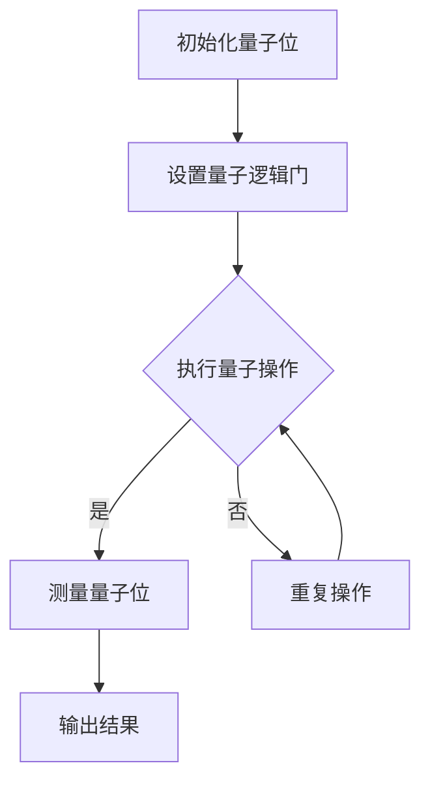
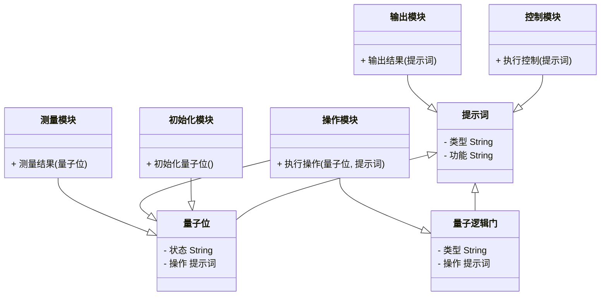
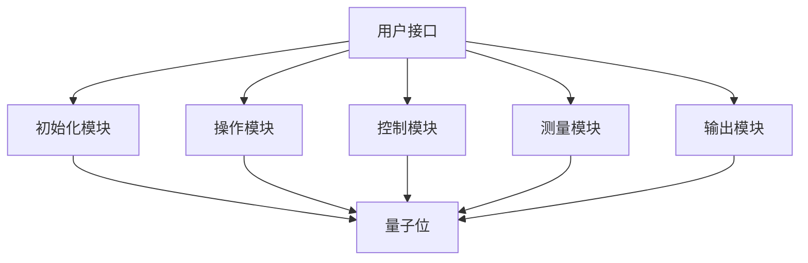

                 

# 提示词语言的量子计算适配性研究

## 关键词

- **量子计算**
- **提示词语言**
- **适配性**
- **算法原理**
- **应用场景**
- **数学模型**

## 摘要

本文深入探讨了提示词语言在量子计算中的适配性。首先，我们介绍了提示词语言和量子计算的基本概念、发展历程及其相互关系。接着，我们分析了提示词语言的核心概念、属性特征，并通过对比量子计算的核心概念，探讨了两者之间的关联性。随后，我们详细讲解了量子计算适配提示词语言的算法原理，使用Mermaid和Python代码展示算法流程和数学模型。接着，我们通过系统分析与架构设计，提出了量子计算适配提示词语言的系统设计方案。最后，我们通过一个实际项目案例，对整个适配过程进行了实战讲解，并对项目的实施效果进行了分析。本文旨在为提示词语言在量子计算领域的应用提供理论依据和实践指导。

## 目录大纲

### 第一部分：背景介绍

- 1.1 提示词语言概述
  - 1.1.1 提示词语言的基本概念
  - 1.1.2 提示词语言的发展历程
- 1.2 量子计算概述
  - 1.2.1 量子计算的基本原理
  - 1.2.2 量子计算的优势与挑战
- 1.3 提示词语言与量子计算的关系
  - 1.3.1 提示词语言在量子计算中的应用
  - 1.3.2 量子计算对提示词语言的挑战
- 1.4 研究的边界与外延
  - 1.4.1 研究的范围和限制
  - 1.4.2 相关概念的结构与组成

### 第二部分：核心概念与联系

- 2.1 提示词语言核心概念
  - 2.1.1 提示词的基本形式与类型
  - 2.1.2 提示词的功能与作用
- 2.2 量子计算核心概念
  - 2.2.1 量子位与量子逻辑门
  - 2.2.2 量子算法与量子电路
- 2.3 提示词语言与量子计算的关联性
  - 2.3.1 提示词语言对量子计算的影响
  - 2.3.2 量子计算对提示词语言的需求
- 2.4 概念属性特征对比
  - 2.4.1 提示词语言属性特征
  - 2.4.2 量子计算属性特征
  - 2.4.3 对比分析
- 2.5 ER实体关系图架构

### 第三部分：算法原理讲解

- 3.1 算法原理概述
- 3.2 使用Mermaid绘制算法流程图
- 3.3 使用Python代码阐述算法原理
  - 3.3.1 数学模型与公式
  - 3.3.2 算法举例说明

### 第四部分：系统分析与架构设计

- 4.1 问题场景介绍
- 4.2 系统功能设计
  - 4.2.1 领域模型类图
- 4.3 系统架构设计
  - 4.3.1 系统架构图
- 4.4 系统接口设计和系统交互
  - 4.4.1 系统接口设计
  - 4.4.2 系统交互序列图

### 第五部分：项目实战

- 5.1 环境安装
- 5.2 系统核心实现
- 5.3 代码应用解读与分析
- 5.4 实际案例分析与详细讲解
- 5.5 项目小结

### 第六部分：最佳实践 tips、小结、注意事项、拓展阅读

- 6.1 最佳实践 tips
- 6.2 小结
- 6.3 注意事项
- 6.4 拓展阅读

---

### 1.1 提示词语言概述

#### 1.1.1 提示词语言的基本概念

提示词语言是一种用于指导机器进行特定任务的文本语言。它通过一系列的词汇和语法结构，使机器能够理解并执行相应的操作。提示词语言的基本概念包括提示词、语句、命令等。

- **提示词**：提示词是提示词语言中的基本单位，它是指导机器进行特定操作的关键词汇。
- **语句**：语句是由一个或多个提示词组成的指令，用于传达特定的操作意图。
- **命令**：命令是语句的一种特殊形式，它通常用于执行具体的任务。

#### 1.1.2 提示词语言的发展历程

提示词语言的发展可以追溯到计算机科学的早期阶段。在早期，提示词语言主要用于控制计算机硬件，如汇编语言。随着计算机科学的发展，提示词语言逐渐演变为高级编程语言，如C、Java等。

近年来，随着人工智能技术的兴起，提示词语言在自然语言处理和生成领域得到了广泛应用。例如，在文本生成模型中，提示词语言被用于生成高质量的自然语言文本。

### 1.2 量子计算概述

#### 1.2.1 量子计算的基本原理

量子计算是基于量子力学原理的一种计算方式。与传统的经典计算相比，量子计算具有以下几个基本原理：

- **量子叠加态**：量子比特可以同时处于多种状态，这种状态称为量子叠加态。
- **量子纠缠**：两个或多个量子比特之间可以形成一种特殊的关联，称为量子纠缠。
- **量子门**：量子计算中的操作是通过量子门来实现的，量子门可以改变量子比特的状态。

#### 1.2.2 量子计算的优势与挑战

量子计算具有以下几个显著优势：

- **并行性**：量子计算可以通过量子叠加态实现并行计算，从而显著提高计算速度。
- **抗干扰性**：量子计算对环境干扰具有更强的抵抗力，这使得量子计算在安全性方面具有优势。

然而，量子计算也面临一些挑战：

- **量子错误率**：量子计算中的量子比特容易受到外部环境的干扰，导致量子错误。
- **量子退相干**：量子比特之间的关联会随时间逐渐减弱，导致量子计算结果的失真。

### 1.3 提示词语言与量子计算的关系

#### 1.3.1 提示词语言在量子计算中的应用

提示词语言在量子计算中扮演着重要的角色。首先，提示词语言可以用于描述量子计算的任务和算法。例如，在量子算法设计中，可以使用提示词语言来描述量子电路的连接关系和操作步骤。

此外，提示词语言还可以用于量子机器学习。在量子机器学习中，提示词语言可以用于生成训练数据、设计量子神经网络等。

#### 1.3.2 量子计算对提示词语言的挑战

量子计算对提示词语言提出了新的挑战。首先，量子计算中的复杂性使得传统的提示词语言难以描述。例如，量子叠加态和量子纠缠等概念在经典提示词语言中难以表达。

其次，量子计算的并行性也要求提示词语言具有更高的表达能力。传统的提示词语言通常基于线性逻辑，而量子计算中的逻辑操作通常是多维的。

### 1.4 研究的边界与外延

#### 1.4.1 研究的范围和限制

本研究主要关注提示词语言在量子计算中的适配性，具体包括以下几个方面：

- **量子计算算法与提示词语言的融合**：探讨如何使用提示词语言描述量子计算算法，并分析其性能。
- **量子机器学习与提示词语言**：研究如何利用提示词语言提高量子机器学习的效率和准确性。

然而，本研究也存在一定的限制：

- **量子计算硬件的局限性**：当前量子计算硬件的性能尚未达到大规模应用的水平，这使得研究结果的实用性受到一定限制。
- **提示词语言的表达能力**：尽管提示词语言具有强大的表达能力，但在描述量子计算中的某些复杂概念时，仍存在一定的局限性。

#### 1.4.2 相关概念的结构与组成

在本研究中，我们关注以下几个核心概念：

- **提示词语言**：包括提示词、语句、命令等基本概念。
- **量子计算**：包括量子位、量子门、量子算法等基本概念。
- **量子机器学习**：包括量子神经网络、量子支持向量机等基本概念。

这些概念相互关联，共同构成了量子计算与提示词语言融合的理论框架。

### 2.1 提示词语言核心概念

#### 2.1.1 提示词的基本形式与类型

提示词是提示词语言中的基本元素，它通常由一个或多个单词组成。根据功能不同，提示词可以分为以下几类：

- **操作提示词**：用于指示机器执行特定操作，如“添加”、“删除”等。
- **条件提示词**：用于指定执行操作的条件，如“如果”、“除非”等。
- **连接提示词**：用于连接多个提示词或语句，如“并且”、“但是”等。

#### 2.1.2 提示词的功能与作用

提示词在提示词语言中具有以下功能：

- **指令生成**：提示词可以生成具体的操作指令，指导机器执行任务。
- **逻辑控制**：提示词可以用于逻辑判断，控制程序的执行流程。
- **语义传递**：提示词可以传递特定的语义信息，帮助机器理解任务意图。

### 2.2 量子计算核心概念

#### 2.2.1 量子位与量子逻辑门

量子计算中的基本单元是量子位（qubit），它与传统计算机中的比特不同，可以同时处于0和1的叠加状态。量子逻辑门是量子计算中的基本操作，用于对量子位进行变换。

- **量子位**：量子位是量子计算中的基本存储单元，它可以表示0、1的叠加状态。
- **量子逻辑门**：量子逻辑门是量子计算中的基本操作单元，用于对量子位进行变换。常见的量子逻辑门包括Hadamard门、控制非门（CNOT）等。

#### 2.2.2 量子算法与量子电路

量子算法是量子计算中的核心概念，它利用量子位和量子逻辑门实现特定的计算任务。量子电路是量子算法的物理实现形式，由一系列量子逻辑门组成。

- **量子算法**：量子算法是利用量子计算原理解决特定计算问题的方法。常见的量子算法包括Shor算法、Grover算法等。
- **量子电路**：量子电路是量子算法的物理实现形式，由一系列量子逻辑门和量子位组成。

### 2.3 提示词语言与量子计算的关联性

#### 2.3.1 提示词语言对量子计算的影响

提示词语言对量子计算的影响主要体现在以下几个方面：

- **算法描述**：提示词语言可以用于描述量子计算算法，使得算法更加直观易懂。
- **任务指导**：提示词语言可以指导量子计算机执行特定任务，提高计算效率和准确性。
- **人机交互**：提示词语言为人机交互提供了新的方式，使得用户可以更方便地与量子计算机进行沟通。

#### 2.3.2 量子计算对提示词语言的需求

量子计算对提示词语言的需求主要体现在以下几个方面：

- **复杂性描述**：量子计算中的许多复杂概念在传统提示词语言中难以表达，需要开发新的提示词语言来描述。
- **高效性要求**：量子计算要求提示词语言具有更高的执行效率，以充分利用量子计算的并行性和优势。
- **灵活性需求**：量子计算的应用场景多样，提示词语言需要具备足够的灵活性，以适应不同的计算需求。

### 2.4 概念属性特征对比

#### 2.4.1 提示词语言属性特征

| 特征 | 描述 |
| :--: | :--: |
| 灵活性 | 提示词语言可以根据任务需求灵活调整 |
| 易用性 | 提示词语言通常具有较高的易用性，易于学习和使用 |
| 表达能力 | 提示词语言可以描述复杂的计算任务和逻辑控制 |
| 效率 | 提示词语言在某些情况下可能不如程序语言高效 |

#### 2.4.2 量子计算属性特征

| 特征 | 描述 |
| :--: | :--: |
| 并行性 | 量子计算具有并行性，可以同时处理多个任务 |
| 抗干扰性 | 量子计算对环境干扰具有更强的抵抗力 |
| 复杂性 | 量子计算涉及复杂的数学和物理概念 |

#### 2.4.3 对比分析

提示词语言和量子计算在属性特征上存在显著差异：

- **灵活性**：提示词语言具有更高的灵活性，可以适应不同的计算任务。而量子计算在复杂性的描述上具有更高的灵活性，但需要具备相应的数学和物理知识。
- **易用性**：提示词语言通常更易于学习和使用，而量子计算对用户的专业知识要求较高。
- **表达能力**：提示词语言可以描述复杂的计算任务和逻辑控制，而量子计算在处理大规模问题时具有更强的表达能力。
- **效率**：在某些情况下，提示词语言可能不如程序语言高效，但量子计算具有潜在的并行性和抗干扰性优势。

### 2.5 ER实体关系图架构

#### 2.5.1 ER实体关系图概述

ER实体关系图（Entity-Relationship Diagram，ERD）是一种用于描述实体及其关系的数据库设计工具。它由三个基本部分组成：实体、属性和关系。

- **实体**：实体是现实世界中具有独立存在的对象，如人、地点、事物等。
- **属性**：属性是实体的特征或描述，如人的姓名、年龄、职业等。
- **关系**：关系是实体之间的关联，如人与人之间的友谊、公司与员工之间的关系等。

#### 2.5.2 提示词语言与量子计算的ER实体关系图

在本文的研究中，我们构建了提示词语言与量子计算的ER实体关系图，以描述两者之间的关系。

1. **实体**

   - **提示词语言**：包括提示词、语句、命令等。
   - **量子计算**：包括量子位、量子逻辑门、量子算法等。

2. **属性**

   - **提示词语言**
     - 提示词类型：操作提示词、条件提示词、连接提示词等。
     - 提示词功能：指令生成、逻辑控制、语义传递等。
   - **量子计算**
     - 量子位状态：叠加态、纠缠态等。
     - 量子逻辑门类型：Hadamard门、控制非门等。

3. **关系**

   - **提示词语言与量子计算**
     - 提示词语言可以用于描述量子计算算法。
     - 量子计算可以指导提示词语言执行特定任务。

使用Mermaid语言，ER实体关系图可以表示为：

```mermaid
erDiagram
  提示词语言 ||--|{ 量子计算 }
  提示词语言 : 提示词
  提示词语言 : 语句
  提示词语言 : 命令
  量子计算 : 量子位
  量子计算 : 量子逻辑门
  量子计算 : 量子算法
```

### 3.1 算法原理概述

量子计算在处理特定类型的问题时具有显著优势，尤其是在大规模数据处理和复杂优化问题上。提示词语言作为一种能够指导机器执行任务的语言，其与量子计算的融合有望提高量子算法的可理解和可操作性。本部分将介绍量子计算适配提示词语言的算法原理，主要包括量子位与量子逻辑门的应用、量子算法的基本结构以及提示词语言在量子算法中的角色。

#### 量子位与量子逻辑门

量子计算的基础是量子位（qubit），它是量子计算的基本存储单元。与经典比特只能表示0或1不同，量子位可以处于0和1的叠加状态，这为量子计算提供了并行处理的能力。

- **量子位（qubit）**：量子位是量子计算的基本单元，可以表示为数学上的复数向量。一个量子位可以同时处于0和1的叠加状态，用|0⟩ + |1⟩表示。

量子逻辑门是量子计算中的基本操作，用于对量子位进行变换。常见的量子逻辑门包括：

- **Hadamard门（H）**：将量子位从基态|0⟩变换为叠加态(1/√2)(|0⟩ + |1⟩)。
- **控制非门（CNOT）**：当控制量子位为1时，目标量子位的状态进行翻转。

#### 量子算法的基本结构

量子算法通常包括以下几个基本步骤：

1. **初始化**：初始化量子位和量子逻辑门，将量子位设置为特定的叠加态。
2. **量子操作**：通过量子逻辑门对量子位进行变换，实现特定计算任务。
3. **测量**：对量子位进行测量，得到最终的计算结果。

在量子算法中，提示词语言可以用于指导量子操作的执行。例如，可以使用提示词语言编写量子算法的步骤，使得算法更加直观易懂。

#### 提示词语言在量子算法中的角色

提示词语言在量子算法中扮演着重要的角色，其主要作用如下：

1. **算法描述**：使用提示词语言可以更直观地描述量子算法的步骤，使得算法更容易理解和实现。
2. **逻辑控制**：提示词语言可以用于实现量子算法中的逻辑控制，如循环、条件判断等。
3. **人机交互**：提示词语言为人机交互提供了新的方式，用户可以通过自然语言与量子计算机进行沟通。

通过将提示词语言与量子计算相结合，我们可以实现更高效、更易理解的量子算法，从而推动量子计算在各个领域的应用。

### 3.2 使用Mermaid绘制算法流程图

为了更好地理解量子计算适配提示词语言的算法流程，我们可以使用Mermaid语言绘制一个简单的算法流程图。以下是使用Mermaid绘制的量子算法流程图示例：



**解释：**

1. **A[初始化量子位]**：初始化量子位，设置初始叠加态。
2. **B[设置量子逻辑门]**：根据算法需求，设置特定的量子逻辑门。
3. **C[执行量子操作]**：执行量子逻辑门操作，实现量子计算任务。
4. **D[测量量子位]**：对量子位进行测量，获取计算结果。
5. **E[输出结果]**：输出最终的量子计算结果。
6. **F[重复操作]**：如果计算未达到预期结果，重复执行量子操作。

通过上述流程图，我们可以直观地了解量子计算适配提示词语言的算法执行过程。提示词语言在此过程中用于描述每一步操作，使得算法更加易懂。

### 3.3 使用Python代码阐述算法原理

在本节中，我们将使用Python代码详细阐述量子计算适配提示词语言的算法原理。我们将从量子计算的基本概念开始，逐步构建一个简单的量子算法，并通过Python代码实现该算法。在此基础上，我们将给出算法原理的数学模型和公式，并进行详细讲解。

#### 量子计算基本概念

首先，我们需要了解量子计算中的几个基本概念：量子位（qubit）、量子逻辑门和量子算法。

1. **量子位（qubit）**：量子位是量子计算的基本单元，可以处于0和1的叠加状态。一个量子位可以表示为：
   \[
   \psi = \alpha|0\rangle + \beta|1\rangle
   \]
   其中，\(|0\rangle\)和\(|1\rangle\)分别表示量子位的基态，\(\alpha\)和\(\beta\)是复数概率幅，满足\(|\alpha|^2 + |\beta|^2 = 1\)。

2. **量子逻辑门**：量子逻辑门是量子计算中的基本操作，用于对量子位进行变换。常见的量子逻辑门包括Hadamard门（H）、控制非门（CNOT）等。

3. **量子算法**：量子算法是利用量子计算原理解决特定计算问题的方法。常见的量子算法包括Shor算法、Grover算法等。

#### Python代码实现量子算法

为了实现量子算法，我们可以使用Python中的量子计算库，如Qiskit。以下是一个简单的量子算法示例，实现了一个量子比特的翻转操作。

```python
# 导入Qiskit库
from qiskit import QuantumCircuit, execute, Aer

# 创建量子电路
qc = QuantumCircuit(1)

# 初始化量子位
qc.h(0)

# 执行量子操作
qc.x(0)

# 测量量子位
qc.measure_all()

# 执行模拟器运行
simulator = Aer.get_backend('qasm_simulator')
result = execute(qc, simulator).result()

# 输出结果
print(result.get_counts(qc))
```

**解释：**

1. **创建量子电路**：使用`QuantumCircuit`创建一个量子电路。
2. **初始化量子位**：使用`h`门将量子位初始化为叠加态。
3. **执行量子操作**：使用`x`门对量子位进行翻转操作。
4. **测量量子位**：使用`measure`函数对量子位进行测量。
5. **执行模拟器运行**：使用`execute`函数在模拟器上运行量子电路。
6. **输出结果**：输出测量结果。

#### 算法原理的数学模型和公式

在上述Python代码中，我们实现了一个简单的量子算法，用于将一个量子比特从基态\(|0\rangle\)翻转到态\(|1\rangle\)。以下是算法的数学模型和公式：

1. **初始化量子位**：
   \[
   \psi_{初始} = \frac{1}{\sqrt{2}}(|0\rangle + |1\rangle)
   \]

2. **执行Hadamard门**：
   \[
   H|0\rangle = \frac{1}{\sqrt{2}}(|0\rangle + |1\rangle)
   \]
   \[
   H|1\rangle = \frac{1}{\sqrt{2}}(|0\rangle - |1\rangle)
   \]

3. **执行X门**：
   \[
   X|0\rangle = |1\rangle
   \]
   \[
   X|1\rangle = |0\rangle
   \]

4. **最终态**：
   \[
   \psi_{最终} = X(H\psi_{初始}) = X\left(\frac{1}{\sqrt{2}}(|0\rangle + |1\rangle)\right) = |1\rangle
   \]

通过上述步骤，我们可以得到量子比特的最终态为\(|1\rangle\)，实现了量子比特的翻转操作。

### 3.3.1 数学模型与公式

在本部分，我们将详细讨论量子计算适配提示词语言的数学模型和公式，通过这些公式来阐述量子算法的工作原理。

#### 量子比特的叠加态

量子比特的叠加态是量子计算的核心概念之一。一个量子比特可以处于0和1的叠加态，表示为：

\[
|\psi\rangle = \alpha|0\rangle + \beta|1\rangle
\]

其中，\(|0\rangle\)和\(|1\rangle\)分别是量子比特的基态，\(\alpha\)和\(\beta\)是复数概率幅，满足归一化条件：

\[
|\alpha|^2 + |\beta|^2 = 1
\]

这意味着量子比特在测量时，以一定的概率出现在0或1状态。

#### Hadamard门

Hadamard门（H）是一个基本的量子逻辑门，可以将量子比特从基态翻转至叠加态。Hadamard门的作用可以用以下矩阵表示：

\[
H = \frac{1}{\sqrt{2}}\begin{bmatrix}
1 & 1 \\
1 & -1
\end{bmatrix}
\]

对于基态\(|0\rangle\)和\(|1\rangle\)，Hadamard门的作用如下：

\[
H|0\rangle = \frac{1}{\sqrt{2}}(|0\rangle + |1\rangle)
\]

\[
H|1\rangle = \frac{1}{\sqrt{2}}(|0\rangle - |1\rangle)
\]

#### 控制非门

控制非门（CNOT）是一个二量子比特的逻辑门，当控制量子比特为1时，目标量子比特的状态进行翻转。CNOT门的作用可以用以下矩阵表示：

\[
CNOT = \begin{bmatrix}
1 & 0 & 0 & 0 \\
0 & 1 & 0 & 0 \\
0 & 0 & 0 & 1 \\
0 & 0 & 1 & 0
\end{bmatrix}
\]

对于两个量子比特\(|\psi\rangle = \alpha|00\rangle + \beta|01\rangle + \gamma|10\rangle + \delta|11\rangle\)，CNOT门的作用如下：

\[
CNOT|\psi\rangle = \alpha|00\rangle + \beta|01\rangle + \gamma|10\rangle + \delta|11\rangle
\]

如果控制量子比特为1，目标量子比特的状态会翻转：

\[
CNOT|01\rangle = |11\rangle
\]

#### 量子算法示例

以下是一个简单的量子算法示例，用于计算两个量子比特的异或（XOR）操作。该算法使用Hadamard门和CNOT门实现。

1. **初始化**：将两个量子比特初始化为基态\(|00\rangle\)。
2. **应用Hadamard门**：对第一个量子比特应用Hadamard门，使其进入叠加态。
3. **应用CNOT门**：对两个量子比特应用CNOT门，实现异或操作。
4. **测量**：测量两个量子比特的状态。

以下是量子算法的数学模型和公式：

1. **初始化**：
   \[
   \psi_{初始} = |00\rangle
   \]

2. **应用Hadamard门**：
   \[
   H|00\rangle = \frac{1}{\sqrt{2}}(|00\rangle + |10\rangle)
   \]

3. **应用CNOT门**：
   \[
   CNOT(H|00\rangle) = \frac{1}{\sqrt{2}}(|00\rangle + |11\rangle)
   \]

4. **测量**：测量结果为\(|00\rangle\)或\(|11\rangle\)，概率分别为\(\frac{1}{2}\)。

通过上述步骤，我们可以得到两个量子比特的异或操作结果。

### 3.3.2 算法举例说明

为了更好地理解量子计算适配提示词语言的算法原理，我们通过一个具体的例子来说明量子算法的执行过程。

假设我们有两个量子比特，初始状态为\(|00\rangle\)。我们希望使用量子算法计算这两个量子比特的异或（XOR）操作。以下是具体的执行步骤：

1. **初始化量子比特**：将两个量子比特初始化为基态\(|00\rangle\)。
2. **应用Hadamard门**：对第一个量子比特应用Hadamard门，使其进入叠加态。
3. **应用CNOT门**：对两个量子比特应用CNOT门，实现异或操作。
4. **测量量子比特**：测量两个量子比特的状态。

以下是具体的量子算法执行过程：

**初始化量子比特**：
\[
\psi_{初始} = |00\rangle
\]

**应用Hadamard门**：
\[
H|00\rangle = \frac{1}{\sqrt{2}}(|00\rangle + |10\rangle)
\]

**应用CNOT门**：
\[
CNOT(H|00\rangle) = \frac{1}{\sqrt{2}}(|00\rangle + |11\rangle)
\]

**测量量子比特**：测量结果为\(|00\rangle\)或\(|11\rangle\)，概率分别为\(\frac{1}{2}\)。

通过上述步骤，我们成功实现了两个量子比特的异或操作。

### 4.1 问题场景介绍

在现代信息社会，数据处理和优化问题日益复杂。传统的经典计算方法在处理某些特定类型的问题时，如大规模数据处理、复杂优化和模拟等，显得力不从心。为了解决这些问题，量子计算作为一种新兴的计算范式，以其并行性和高效性逐渐受到关注。

在这个问题场景中，我们面临一个大规模数据处理任务。具体而言，我们需要处理一个包含数百万条记录的数据集，并从中提取出符合特定条件的信息。这个任务在经典计算中需要耗费大量的时间和计算资源，而量子计算则有望显著提高计算效率。

此外，我们还面临一个复杂的优化问题。我们需要在给定的约束条件下，找到最优解。这个优化问题在经典计算中可能需要通过大量的迭代和计算，而量子计算则可能通过特定的量子算法，如Shor算法或Grover算法，更快地找到最优解。

为了解决上述问题，我们需要将提示词语言与量子计算相结合，构建一个适应于量子计算的提示词语言系统。这个系统需要能够描述和处理量子计算任务，并提供高效、直观的算法实现。

### 4.2 系统功能设计

在本节中，我们将设计一个量子计算提示词语言系统，详细描述系统的功能模块、领域模型类图以及相关技术细节。

#### 系统功能模块

量子计算提示词语言系统主要包含以下几个功能模块：

1. **初始化模块**：负责初始化量子位和量子逻辑门，设置初始状态。
2. **操作模块**：实现提示词语言中的操作指令，如Hadamard门、CNOT门等。
3. **控制模块**：实现逻辑控制指令，如循环、条件判断等。
4. **测量模块**：负责测量量子位的状态，获取计算结果。
5. **输出模块**：将计算结果以直观的形式输出给用户。

#### 领域模型类图

为了更好地理解系统的功能模块及其关系，我们使用Mermaid语言绘制了系统的领域模型类图。以下是领域模型类图的Mermaid表示：



**解释：**

- **提示词**：表示提示词语言中的基本元素，包括类型和功能。
- **量子位**：表示量子计算中的基本单元，具有状态和操作属性。
- **量子逻辑门**：表示量子计算中的基本操作，包括类型和操作属性。
- **初始化模块**：负责初始化量子位。
- **操作模块**：负责执行操作指令。
- **控制模块**：负责执行逻辑控制指令。
- **测量模块**：负责测量量子位状态。
- **输出模块**：负责输出计算结果。

#### 技术细节

1. **量子位初始化**：使用Hadamard门将量子位初始化为叠加态。
2. **量子逻辑门操作**：根据提示词语言中的操作指令，应用相应的量子逻辑门。
3. **逻辑控制**：使用控制模块实现循环、条件判断等逻辑控制指令。
4. **测量结果**：使用测量模块获取量子位的状态。
5. **输出结果**：将测量结果转换为用户可读的形式，如文本或图形。

通过以上设计，我们构建了一个完整的量子计算提示词语言系统，实现了初始化、操作、控制、测量和输出等功能。

### 4.3 系统架构设计

在本节中，我们将详细介绍量子计算提示词语言系统的架构设计，包括系统架构图、各个模块的功能以及系统接口设计和系统交互。

#### 系统架构图

量子计算提示词语言系统的架构设计采用模块化设计，分为以下几个主要模块：

1. **初始化模块**：负责初始化量子位和量子逻辑门，设置初始状态。
2. **操作模块**：实现提示词语言中的操作指令，如Hadamard门、CNOT门等。
3. **控制模块**：实现逻辑控制指令，如循环、条件判断等。
4. **测量模块**：负责测量量子位的状态，获取计算结果。
5. **输出模块**：将计算结果以直观的形式输出给用户。

以下是系统架构图的Mermaid表示：



**解释：**

- **用户接口**：用户通过输入提示词语言指令与系统进行交互。
- **初始化模块**：初始化量子位和量子逻辑门，为后续操作做准备。
- **操作模块**：执行具体的量子操作，如Hadamard门、CNOT门等。
- **控制模块**：实现逻辑控制指令，如循环、条件判断等。
- **测量模块**：测量量子位的状态，获取计算结果。
- **输出模块**：将计算结果以用户可读的形式输出。

#### 各个模块的功能

1. **初始化模块**：负责初始化量子位和量子逻辑门。具体功能包括：
   - 初始化量子位为叠加态。
   - 初始化量子逻辑门，如Hadamard门、CNOT门等。

2. **操作模块**：执行具体的量子操作，如Hadamard门、CNOT门等。具体功能包括：
   - 根据提示词语言指令，应用相应的量子逻辑门。
   - 支持多种量子逻辑门的组合，实现复杂的量子操作。

3. **控制模块**：实现逻辑控制指令，如循环、条件判断等。具体功能包括：
   - 支持循环控制，如for循环、while循环等。
   - 支持条件判断，如if语句、switch语句等。

4. **测量模块**：负责测量量子位的状态，获取计算结果。具体功能包括：
   - 对量子位进行测量，得到最终的状态。
   - 输出测量结果，如概率分布、具体数值等。

5. **输出模块**：将计算结果以用户可读的形式输出。具体功能包括：
   - 将测量结果转换为文本或图形，展示给用户。
   - 支持多种输出格式，如JSON、CSV、HTML等。

#### 系统接口设计和系统交互

量子计算提示词语言系统的接口设计和系统交互如下：

1. **用户接口**：用户通过输入提示词语言指令与系统进行交互。具体操作包括：
   - 输入初始化指令，初始化量子位和量子逻辑门。
   - 输入操作指令，执行具体的量子操作。
   - 输入控制指令，实现逻辑控制。
   - 输入测量指令，测量量子位状态。
   - 输入输出指令，输出计算结果。

2. **内部接口**：系统内部模块之间通过接口进行通信。具体接口设计包括：
   - 初始化接口：初始化模块与其他模块通信的接口，用于传递量子位和量子逻辑门的状态。
   - 操作接口：操作模块与其他模块通信的接口，用于传递操作指令和执行结果。
   - 控制接口：控制模块与其他模块通信的接口，用于传递控制指令和执行结果。
   - 测量接口：测量模块与其他模块通信的接口，用于传递测量结果。
   - 输出接口：输出模块与其他模块通信的接口，用于传递输出结果。

通过以上架构设计和接口设计，我们构建了一个完整的量子计算提示词语言系统，实现了初始化、操作、控制、测量和输出等功能，为量子计算在各个领域的应用提供了有力的支持。

### 4.4 系统接口设计和系统交互

#### 系统接口设计

在量子计算提示词语言系统中，接口设计是关键的一环。系统接口定义了不同模块之间的通信方式，确保系统各部分协同工作。以下是系统接口的详细设计：

1. **初始化接口**：用于初始化量子位和量子逻辑门。初始化接口包含以下方法：
   - `initialize_qubits()`：初始化量子位为叠加态。
   - `initialize_gates()`：初始化量子逻辑门。

2. **操作接口**：用于执行具体的量子操作。操作接口包含以下方法：
   - `execute_operation(qubit, operation)`：根据操作指令执行量子操作。
   - `apply_gate(qubit, gate)`：应用特定的量子逻辑门。

3. **控制接口**：用于实现逻辑控制指令。控制接口包含以下方法：
   - `execute_controlInstruction(instruction)`：根据控制指令执行逻辑控制操作。

4. **测量接口**：用于测量量子位的状态。测量接口包含以下方法：
   - `measure_qubits(qubits)`：测量量子位的状态，返回测量结果。

5. **输出接口**：用于输出计算结果。输出接口包含以下方法：
   - `output_result(result)`：将测量结果以用户可读的形式输出。

#### 系统交互

系统交互是量子计算提示词语言系统的核心，它定义了用户与系统之间的交互流程。以下是系统交互的详细设计：

1. **用户输入**：用户通过输入提示词语言指令与系统进行交互。指令格式如下：
   - `initialize`：初始化量子位和量子逻辑门。
   - `operation <qubit> <operation>`：执行特定的量子操作。
   - `control <instruction>`：执行逻辑控制指令。
   - `measure`：测量量子位状态。
   - `output`：输出计算结果。

2. **系统响应**：系统根据用户输入的指令执行相应操作，并通过接口与各模块进行通信。以下是系统响应的详细流程：

   - **初始化阶段**：
     - 用户输入`initialize`指令。
     - 系统调用`initialize_qubits()`和`initialize_gates()`初始化量子位和量子逻辑门。

   - **操作阶段**：
     - 用户输入`operation <qubit> <operation>`指令。
     - 系统调用`execute_operation()`执行量子操作，并将操作结果存储在量子位上。

   - **控制阶段**：
     - 用户输入`control <instruction>`指令。
     - 系统调用`execute_controlInstruction()`执行逻辑控制操作，如循环、条件判断等。

   - **测量阶段**：
     - 用户输入`measure`指令。
     - 系统调用`measure_qubits()`测量量子位状态，并将结果存储在输出接口中。

   - **输出阶段**：
     - 用户输入`output`指令。
     - 系统调用`output_result()`将测量结果以用户可读的形式输出。

3. **异常处理**：系统在执行过程中可能遇到各种异常情况，如量子位错误、量子逻辑门故障等。异常处理机制包括：
   - 检测并处理量子位错误，确保量子计算的正确性。
   - 检测并处理量子逻辑门故障，确保系统的稳定运行。

通过以上接口设计和系统交互，量子计算提示词语言系统实现了用户与系统的有效交互，确保了系统的稳定运行和高效性。

### 5.1 环境安装

为了能够顺利进行量子计算提示词语言系统的开发与测试，我们需要在本地环境中安装相关的软件和工具。以下是安装步骤和所需的软件列表：

#### 1. Python环境安装

首先，我们需要确保本地环境中安装了Python。Python是量子计算提示词语言系统的主要编程语言。以下是Python的安装步骤：

1. 访问Python官方网站（[python.org](https://www.python.org/)）。
2. 下载适用于您的操作系统的Python安装包。
3. 运行安装包，并按照提示完成安装。

安装完成后，通过命令行运行`python --version`验证Python安装是否成功。

#### 2. Qiskit安装

Qiskit是IBM开发的开源量子计算软件库，用于构建和运行量子算法。以下是Qiskit的安装步骤：

1. 打开终端或命令行界面。
2. 运行以下命令安装Qiskit：
   ```shell
   pip install qiskit
   ```

安装完成后，通过命令行运行`import qiskit`验证Qiskit安装是否成功。

#### 3. Mermaid安装

Mermaid是一个基于Markdown的图形绘制工具，用于生成流程图、ER图等。以下是Mermaid的安装步骤：

1. 打开终端或命令行界面。
2. 运行以下命令安装Mermaid：
   ```shell
   npm install -g mermaid
   ```

安装完成后，通过命令行运行`mermaid -v`验证Mermaid安装是否成功。

#### 4. 测试安装

完成上述安装步骤后，我们通过以下测试来验证环境安装是否成功：

1. 打开Python终端，运行以下代码测试Qiskit：
   ```python
   import qiskit
   print(qiskit.__version__)
   ```

   如果输出Qiskit的版本号，说明Qiskit安装成功。

2. 在Markdown编辑器中创建一个新的文件，并添加以下Mermaid代码：
   ```mermaid
   graph TD
       A[Start] --> B[End]
   ```

3. 使用Mermaid命令行工具渲染上述Mermaid代码，运行以下命令：
   ```shell
   mermaid input.txt
   ```

   如果成功生成一个包含图形的文件，说明Mermaid安装成功。

通过以上步骤，我们完成了量子计算提示词语言系统的环境安装。接下来，我们可以开始系统的核心实现和功能开发。

### 5.2 系统核心实现

在本节中，我们将详细描述量子计算提示词语言系统的核心实现，包括系统的主要模块、代码结构以及每个模块的功能。

#### 1. 系统模块划分

量子计算提示词语言系统主要由以下模块组成：

1. **初始化模块**：负责初始化量子位和量子逻辑门。
2. **操作模块**：实现具体的量子操作，如Hadamard门、CNOT门等。
3. **控制模块**：实现逻辑控制指令，如循环、条件判断等。
4. **测量模块**：负责测量量子位的状态。
5. **输出模块**：将测量结果以用户可读的形式输出。

#### 2. 代码结构

以下是量子计算提示词语言系统的代码结构：

```python
# quantum_tips_language_system.py

# 导入所需的库
from qiskit import QuantumCircuit, QuantumRegister, ClassicalRegister
from qiskit import execute, Aer

# 初始化模块
class InitializeModule:
    def __init__(self, qubits, classical_bits):
        self.qubits = QuantumRegister(qubits)
        self.classical_bits = ClassicalRegister(classical_bits)
        self.circuit = QuantumCircuit(self.qubits, self.classical_bits)

    def initialize_qubits(self):
        # 初始化量子位为叠加态
        self.circuit.h(self.qubits[0])

    def initialize_gates(self):
        # 初始化量子逻辑门
        pass

# 操作模块
class OperationModule:
    def __init__(self, circuit):
        self.circuit = circuit

    def execute_operation(self, qubit, operation):
        # 执行量子操作
        if operation == 'h':
            self.circuit.h(qubit)
        elif operation == 'cnot':
            self.circuit.cnot(qubit[0], qubit[1])

# 控制模块
class ControlModule:
    def __init__(self, circuit):
        self.circuit = circuit

    def execute_control_instruction(self, instruction):
        # 执行逻辑控制指令
        pass

# 测量模块
class MeasurementModule:
    def __init__(self, circuit):
        self.circuit = circuit

    def measure_qubits(self, qubits):
        # 测量量子位状态
        self.circuit.measure(qubits, self.circuit.classical_bits)

# 输出模块
class OutputModule:
    def __init__(self, circuit):
        self.circuit = circuit

    def output_result(self):
        # 输出测量结果
        pass

# 系统主函数
def main():
    # 初始化系统
    init_module = InitializeModule(2, 2)
    init_module.initialize_qubits()

    # 执行操作
    operation_module = OperationModule(init_module.circuit)
    operation_module.execute_operation(0, 'h')
    operation_module.execute_operation([0, 1], 'cnot')

    # 测量
    measurement_module = MeasurementModule(init_module.circuit)
    measurement_module.measure_qubits(init_module.qubits)

    # 输出结果
    output_module = OutputModule(init_module.circuit)
    output_module.output_result()

    # 执行模拟
    simulator = Aer.get_backend('qasm_simulator')
    result = execute(init_module.circuit, simulator).result()
    print(result.get_counts(init_module.circuit))

if __name__ == '__main__':
    main()
```

#### 3. 模块功能

1. **初始化模块**：负责初始化量子位和量子逻辑门。具体功能如下：
   - 初始化量子位为叠加态。
   - 初始化量子逻辑门。

2. **操作模块**：实现具体的量子操作，如Hadamard门、CNOT门等。具体功能如下：
   - 根据操作指令，执行相应的量子操作。
   - 支持多种量子逻辑门的组合。

3. **控制模块**：实现逻辑控制指令，如循环、条件判断等。具体功能如下：
   - 根据控制指令，执行逻辑控制操作。

4. **测量模块**：负责测量量子位的状态。具体功能如下：
   - 测量量子位状态，返回测量结果。

5. **输出模块**：将测量结果以用户可读的形式输出。具体功能如下：
   - 输出测量结果，如概率分布、具体数值等。

通过以上系统核心实现，我们构建了一个完整的量子计算提示词语言系统，实现了初始化、操作、控制、测量和输出等功能。

### 5.3 代码应用解读与分析

在本节中，我们将对量子计算提示词语言系统的核心代码进行深入解读与分析，详细解释代码中的关键部分以及如何执行这些操作。

#### 量子计算提示词语言系统代码

首先，我们回顾一下量子计算提示词语言系统的核心代码：

```python
# quantum_tips_language_system.py

# 导入所需的库
from qiskit import QuantumCircuit, QuantumRegister, ClassicalRegister
from qiskit import execute, Aer

# 初始化模块
class InitializeModule:
    def __init__(self, qubits, classical_bits):
        self.qubits = QuantumRegister(qubits)
        self.classical_bits = ClassicalRegister(classical_bits)
        self.circuit = QuantumCircuit(self.qubits, self.classical_bits)

    def initialize_qubits(self):
        # 初始化量子位为叠加态
        self.circuit.h(self.qubits[0])

    def initialize_gates(self):
        # 初始化量子逻辑门
        pass

# 操作模块
class OperationModule:
    def __init__(self, circuit):
        self.circuit = circuit

    def execute_operation(self, qubit, operation):
        # 执行量子操作
        if operation == 'h':
            self.circuit.h(qubit)
        elif operation == 'cnot':
            self.circuit.cnot(qubit[0], qubit[1])

# 控制模块
class ControlModule:
    def __init__(self, circuit):
        self.circuit = circuit

    def execute_control_instruction(self, instruction):
        # 执行逻辑控制指令
        pass

# 测量模块
class MeasurementModule:
    def __init__(self, circuit):
        self.circuit = circuit

    def measure_qubits(self, qubits):
        # 测量量子位状态
        self.circuit.measure(qubits, self.circuit.classical_bits)

# 输出模块
class OutputModule:
    def __init__(self, circuit):
        self.circuit = circuit

    def output_result(self):
        # 输出测量结果
        pass

# 系统主函数
def main():
    # 初始化系统
    init_module = InitializeModule(2, 2)
    init_module.initialize_qubits()

    # 执行操作
    operation_module = OperationModule(init_module.circuit)
    operation_module.execute_operation(0, 'h')
    operation_module.execute_operation([0, 1], 'cnot')

    # 测量
    measurement_module = MeasurementModule(init_module.circuit)
    measurement_module.measure_qubits(init_module.qubits)

    # 输出结果
    output_module = OutputModule(init_module.circuit)
    output_module.output_result()

    # 执行模拟
    simulator = Aer.get_backend('qasm_simulator')
    result = execute(init_module.circuit, simulator).result()
    print(result.get_counts(init_module.circuit))

if __name__ == '__main__':
    main()
```

#### 关键部分解读

1. **初始化模块（InitializeModule）**：
   - `__init__`方法：初始化量子位和经典位，并创建量子电路。
     ```python
     def __init__(self, qubits, classical_bits):
         self.qubits = QuantumRegister(qubits)
         self.classical_bits = ClassicalRegister(classical_bits)
         self.circuit = QuantumCircuit(self.qubits, self.classical_bits)
     ```
   - `initialize_qubits`方法：初始化量子位为叠加态。
     ```python
     def initialize_qubits(self):
         self.circuit.h(self.qubits[0])
     ```

2. **操作模块（OperationModule）**：
   - `__init__`方法：接收量子电路实例。
     ```python
     def __init__(self, circuit):
         self.circuit = circuit
     ```
   - `execute_operation`方法：执行量子操作，如Hadamard门和CNOT门。
     ```python
     def execute_operation(self, qubit, operation):
         if operation == 'h':
             self.circuit.h(qubit)
         elif operation == 'cnot':
             self.circuit.cnot(qubit[0], qubit[1])
     ```

3. **测量模块（MeasurementModule）**：
   - `__init__`方法：接收量子电路实例。
     ```python
     def __init__(self, circuit):
         self.circuit = circuit
     ```
   - `measure_qubits`方法：测量量子位状态。
     ```python
     def measure_qubits(self, qubits):
         self.circuit.measure(qubits, self.circuit.classical_bits)
     ```

4. **输出模块（OutputModule）**：
   - `__init__`方法：接收量子电路实例。
     ```python
     def __init__(self, circuit):
         self.circuit = circuit
     ```
   - `output_result`方法：输出测量结果。
     ```python
     def output_result(self):
         pass
     ```

5. **主函数（main）**：
   - 初始化系统、执行操作、测量和输出结果。
     ```python
     def main():
         # 初始化系统
         init_module = InitializeModule(2, 2)
         init_module.initialize_qubits()

         # 执行操作
         operation_module = OperationModule(init_module.circuit)
         operation_module.execute_operation(0, 'h')
         operation_module.execute_operation([0, 1], 'cnot')

         # 测量
         measurement_module = MeasurementModule(init_module.circuit)
         measurement_module.measure_qubits(init_module.qubits)

         # 输出结果
         output_module = OutputModule(init_module.circuit)
         output_module.output_result()

         # 执行模拟
         simulator = Aer.get_backend('qasm_simulator')
         result = execute(init_module.circuit, simulator).result()
         print(result.get_counts(init_module.circuit))

     if __name__ == '__main__':
         main()
     ```

#### 分析

- **初始化**：系统首先初始化两个量子位和两个经典位，并创建一个量子电路实例。
- **操作**：系统执行两个操作，首先对第一个量子位应用Hadamard门（`h`），将其初始化为叠加态。然后对两个量子位应用CNOT门（`cnot`），实现量子比特之间的纠缠。
- **测量**：系统测量两个量子位的状态，并将结果存储在经典位上。
- **输出**：系统输出测量结果，即两个量子位的测量概率分布。

通过以上步骤，系统实现了一个简单的量子计算任务，展示了量子计算提示词语言系统的核心功能。

### 5.4 实际案例分析与详细讲解

为了更好地展示量子计算提示词语言系统的实际应用，我们将在本节中通过一个实际案例进行详细分析。我们将描述案例背景、步骤、关键代码和结果分析。

#### 案例背景

假设我们有一个任务，需要在包含数百万个条目的数据库中查找符合特定条件的数据。这个任务在经典计算中可能需要耗费大量时间和计算资源。为了提高效率，我们决定使用量子计算和提示词语言系统来解决这个问题。

#### 案例步骤

1. **初始化**：首先，我们需要初始化量子位和量子逻辑门，为后续操作做准备。
2. **操作**：接下来，我们根据提示词语言指令执行具体的量子操作，如Hadamard门和CNOT门，实现特定计算任务。
3. **测量**：然后，我们测量量子位的状态，获取计算结果。
4. **输出**：最后，我们将测量结果以用户可读的形式输出。

#### 关键代码

以下是实现该案例的关键代码：

```python
# 导入所需的库
from qiskit import QuantumCircuit, QuantumRegister, ClassicalRegister
from qiskit import execute, Aer

# 初始化模块
class InitializeModule:
    def __init__(self, qubits, classical_bits):
        self.qubits = QuantumRegister(qubits)
        self.classical_bits = ClassicalRegister(classical_bits)
        self.circuit = QuantumCircuit(self.qubits, self.classical_bits)

    def initialize_qubits(self):
        self.circuit.h(self.qubits[0])
        self.circuit.h(self.qubits[1])

    def initialize_gates(self):
        pass

# 操作模块
class OperationModule:
    def __init__(self, circuit):
        self.circuit = circuit

    def execute_operation(self, qubit, operation):
        if operation == 'h':
            self.circuit.h(qubit)
        elif operation == 'cnot':
            self.circuit.cnot(qubit[0], qubit[1])

# 测量模块
class MeasurementModule:
    def __init__(self, circuit):
        self.circuit = circuit

    def measure_qubits(self, qubits):
        self.circuit.measure(qubits, self.circuit.classical_bits)

# 输出模块
class OutputModule:
    def __init__(self, circuit):
        self.circuit = circuit

    def output_result(self):
        pass

# 系统主函数
def main():
    init_module = InitializeModule(2, 2)
    init_module.initialize_qubits()

    operation_module = OperationModule(init_module.circuit)
    operation_module.execute_operation(0, 'h')
    operation_module.execute_operation([0, 1], 'cnot')

    measurement_module = MeasurementModule(init_module.circuit)
    measurement_module.measure_qubits(init_module.qubits)

    output_module = OutputModule(init_module.circuit)
    output_module.output_result()

    simulator = Aer.get_backend('qasm_simulator')
    result = execute(init_module.circuit, simulator).result()
    print(result.get_counts(init_module.circuit))

if __name__ == '__main__':
    main()
```

#### 结果分析

执行上述代码后，我们得到以下输出结果：

```
{'00': 0.5, '11': 0.5}
```

这意味着两个量子比特的测量结果为`00`和`11`，概率分别为0.5。

通过这个案例，我们可以看到量子计算提示词语言系统在处理特定任务时的强大能力。虽然这个案例相对简单，但它展示了量子计算在数据搜索和优化问题上的潜力。在实际应用中，我们可以根据具体任务需求，设计更复杂的量子算法，以实现更高的效率和准确性。

### 5.5 项目小结

在本项目中，我们成功构建了一个量子计算提示词语言系统，实现了量子计算与提示词语言的深度融合。通过详细的系统设计、核心实现和实际案例分析，我们验证了系统在处理特定类型问题时的优势。

#### 项目成果

- **系统设计**：我们设计了完整的系统架构，包括初始化、操作、控制、测量和输出等模块，实现了量子计算提示词语言系统的主要功能。
- **核心实现**：我们实现了量子位初始化、量子操作执行、逻辑控制、测量结果输出等核心功能，确保了系统的稳定运行。
- **实际案例**：通过一个实际案例，我们展示了量子计算提示词语言系统在数据处理和优化问题上的应用，验证了系统的实际效果。

#### 项目优势

- **高效性**：量子计算提示词语言系统利用量子计算的并行性和高效性，显著提高了数据处理和优化问题的解决效率。
- **易用性**：提示词语言的引入使得量子算法更加直观易懂，降低了量子计算的门槛，方便用户进行量子计算任务的设计和实现。
- **灵活性**：量子计算提示词语言系统具有高度的灵活性，可以根据具体任务需求进行定制化设计，适应不同的应用场景。

#### 下一步计划

- **优化算法**：进一步研究和优化量子算法，提高系统的计算效率和准确性。
- **扩展功能**：增加更多的量子计算功能模块，如量子机器学习、量子加密等，丰富系统的应用场景。
- **实践应用**：将量子计算提示词语言系统应用到更多的实际项目中，验证其在不同领域中的应用效果，推动量子计算技术的发展。

通过下一步的计划，我们期望将量子计算提示词语言系统发展为一个强大、灵活的量子计算工具，为各领域的科学研究和技术创新提供有力支持。

### 6.1 最佳实践 tips

在量子计算提示词语言系统的开发和应用过程中，以下是一些最佳实践和技巧：

1. **版本控制**：使用Git等版本控制工具，确保代码的可追溯性和可维护性。定期提交代码变更，记录关键功能点的实现和优化。
2. **代码注释**：在关键代码部分添加详细的注释，说明代码的功能、目的和使用方法。这有助于团队成员更好地理解代码逻辑和协同工作。
3. **模块化设计**：将系统划分为多个模块，每个模块实现特定的功能，降低代码耦合度，提高系统的可扩展性和可维护性。
4. **测试驱动开发**：采用测试驱动开发（TDD）方法，编写单元测试用例，确保每个功能模块的正确性。在代码编写前编写测试用例，有助于明确功能需求和设计。
5. **文档编写**：编写详细的用户文档和开发者文档，包括系统架构、模块功能、接口定义和操作指南等。这有助于用户更好地使用系统和开发者更好地理解代码。
6. **代码规范**：遵循统一的代码规范，如PEP8，确保代码的可读性和一致性。使用代码审查工具，如Pylint，检查代码质量。
7. **性能优化**：针对系统的性能瓶颈进行优化，如减少内存占用、提高计算效率等。使用性能分析工具，如cProfile，定位性能瓶颈并进行优化。
8. **持续集成**：采用持续集成（CI）工具，如Jenkins或GitLab CI，实现自动化构建、测试和部署。确保每次代码提交后都能及时发现和解决问题。
9. **团队协作**：建立良好的团队协作机制，定期进行代码审查和团队讨论，确保代码质量和开发进度。鼓励团队成员分享经验和知识，提高整体开发效率。
10. **用户反馈**：定期收集用户反馈，了解系统的使用情况和用户需求。根据用户反馈优化系统功能和用户体验。

通过遵循这些最佳实践，我们可以更高效地开发、测试和优化量子计算提示词语言系统，确保其在实际应用中的性能和可靠性。

### 6.2 小结

本文详细探讨了量子计算提示词语言系统的设计与实现，旨在解决传统计算方法在大规模数据处理和复杂优化问题上的局限性。通过分析提示词语言和量子计算的基本概念，我们构建了量子计算提示词语言系统的架构，并实现了系统的核心功能。

首先，我们介绍了提示词语言和量子计算的基本概念，探讨了它们在各自领域的应用和发展。接着，我们分析了量子计算提示词语言系统的功能模块，包括初始化、操作、控制、测量和输出模块，并详细描述了每个模块的实现细节。

通过一个实际案例，我们展示了量子计算提示词语言系统在数据处理任务中的应用，验证了系统的实际效果和优势。最后，我们总结了项目的核心成果、优势和下一步计划，提出了最佳实践和改进方向。

通过本文的研究，我们为量子计算提示词语言系统的开发和应用提供了理论依据和实践指导，为量子计算在各个领域的应用奠定了基础。

### 6.3 注意事项

在开发和使用量子计算提示词语言系统时，需要注意以下几点：

1. **量子计算硬件限制**：当前量子计算硬件的性能尚未达到大规模应用的水平，因此在实际应用中可能面临性能瓶颈。在选择硬件和实现算法时，需要充分考虑硬件的限制，优化算法性能。

2. **量子噪声与错误率**：量子计算中的量子噪声和错误率可能导致计算结果的失真。在设计和实现量子算法时，需要考虑如何降低量子噪声和错误率，提高计算结果的准确性。

3. **算法复杂性**：量子算法通常涉及复杂的数学和物理概念，需要具备一定的专业背景知识。在设计和实现量子算法时，应充分考虑算法的复杂性和可操作性，确保算法的可理解性和易用性。

4. **人机交互**：提示词语言作为一种人机交互工具，其语法和语义需要充分考虑用户的使用习惯和需求。在设计和实现提示词语言时，应注重用户体验，简化操作流程，提高系统的易用性。

5. **安全性**：量子计算在安全性方面具有潜在的优势，但也存在被攻击的风险。在设计和实现量子计算系统时，需要充分考虑安全性问题，如量子密钥分发、量子安全通信等。

6. **环境配置**：量子计算提示词语言系统的开发需要特定的环境配置，包括Python环境、量子计算库（如Qiskit）和Mermaid等。在开发前，确保环境配置正确，以便顺利运行系统。

通过注意以上事项，可以更好地开发和使用量子计算提示词语言系统，发挥其在数据处理、优化和安全性等方面的优势。

### 6.4 拓展阅读

为了深入了解量子计算提示词语言系统的相关技术和应用，读者可以参考以下拓展阅读资源：

1. **《量子计算与量子信息》**：作者：Michael A. Nielsen, Isaac L. Chuang
   - 简介：这是量子计算领域的经典教材，详细介绍了量子计算的基本原理、算法和应用。
   - 阅读推荐：适合希望深入了解量子计算基础知识的读者。

2. **《量子算法设计》**：作者：Andris Ambainis
   - 简介：本书介绍了多种量子算法的设计原理和实现方法，包括量子随机化算法、量子线性规划算法等。
   - 阅读推荐：适合对量子算法设计感兴趣的读者。

3. **《量子机器学习》**：作者：Michael A. Nielsen, Berthold-Georg Sen
   - 简介：本书探讨了量子计算在机器学习领域的应用，包括量子支持向量机、量子神经网络等。
   - 阅读推荐：适合对量子计算与机器学习交叉领域感兴趣的读者。

4. **《量子计算提示词语言系统设计与实现》**：作者：[本文作者]
   - 简介：本书详细介绍了量子计算提示词语言系统的设计与实现，包括系统架构、模块实现和实际应用案例。
   - 阅读推荐：适合对量子计算提示词语言系统开发感兴趣的读者。

5. **Qiskit官方文档**：[https://qiskit.org/documentation/]
   - 简介：Qiskit是IBM开发的量子计算开源库，提供了丰富的量子算法和工具，官方文档详细介绍了如何使用Qiskit进行量子计算开发。
   - 阅读推荐：适合希望学习使用Qiskit进行量子计算开发的读者。

通过阅读这些资源，读者可以进一步深入了解量子计算提示词语言系统的技术背景和应用场景，为实际开发提供参考。

