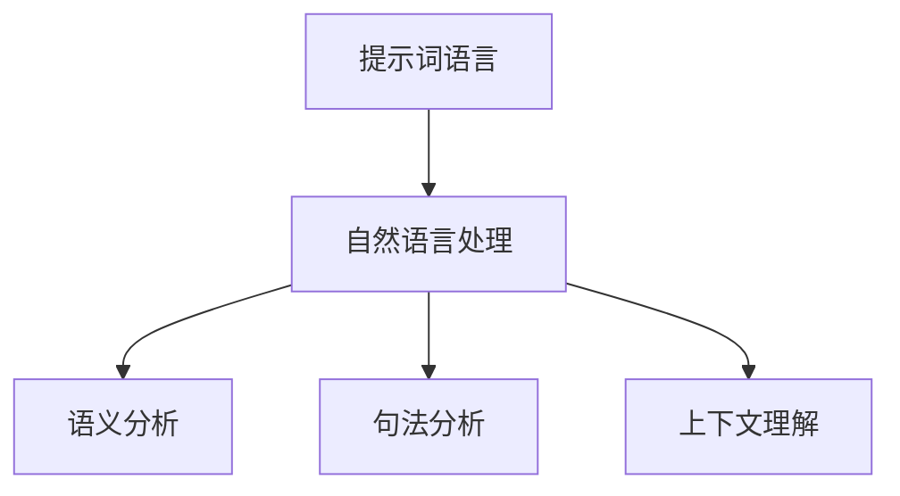
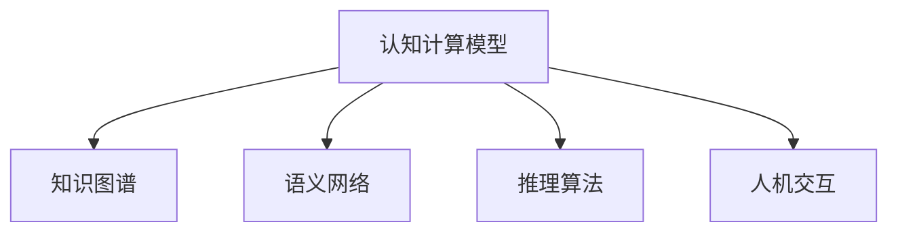
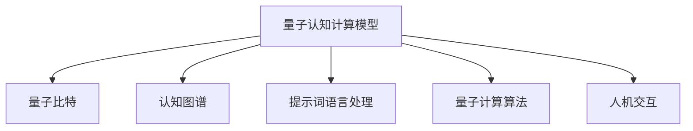

                 

## 提示词语言的量子认知计算模型

### 关键词：量子计算、认知计算、提示词语言、量子比特、认知图谱

### 摘要：

本文探讨了量子计算与认知计算在提示词语言处理中的融合，构建了一种创新的量子认知计算模型。首先，我们回顾了量子计算的发展背景和认知计算的基本概念，然后详细描述了提示词语言的应用场景及其在量子认知计算模型中的重要性。接着，我们分析了量子比特、认知图谱和提示词语言处理的核心概念，并对比了量子比特与经典比特、认知图谱与知识图谱、提示词语言处理与自然语言处理的不同属性特征。通过ER实体关系图，我们展示了量子认知计算模型的结构及其工作原理。本文随后深入探讨了量子比特与提示词语言处理、认知计算模型与量子计算的融合机制，详细阐述了量子认知图谱的构建和量子认知推理算法。最后，我们介绍了量子认知计算模型在不同领域的应用，通过实际案例展示了该模型的有效性和潜力，并对未来的研究方向进行了展望。

### 目录大纲

1. **背景与概述**
    1.1 问题背景
    1.1.1 量子计算的发展
    1.1.2 认知计算的基本概念
    1.1.3 提示词语言的应用场景
    1.2 问题描述
    1.2.1 量子认知计算模型的必要性
    1.2.2 量子认知计算模型的挑战
    1.2.3 量子认知计算模型的意义
2. **核心概念与联系**
    2.1 核心概念原理
    2.1.1 量子比特
    2.1.2 认知图谱
    2.1.3 提示词语言处理
    2.2 概念属性特征对比表格
    2.2.1 量子比特与经典比特
    2.2.2 认知图谱与知识图谱
    2.2.3 提示词语言处理与自然语言处理
    2.3 ER实体关系图架构
    2.3.1 提示词语言的ER模型
    2.3.2 认知计算模型的ER模型
    2.3.3 量子认知计算模型的ER模型
3. **算法原理讲解**
    3.1 量子比特与提示词语言处理
    3.1.1 量子比特的工作原理
    3.1.2 提示词语言处理的基本概念
    3.1.3 量子比特在提示词语言处理中的应用
    3.2 认知计算模型与量子计算
    3.2.1 认知计算模型的基本原理
    3.2.2 量子计算在认知计算中的应用
    3.3 量子认知计算模型的应用
4. **系统设计与实现**
    4.1 系统功能设计
    4.1.1 功能模块划分
    4.1.2 数据流设计
    4.1.3 系统性能优化
    4.2 系统架构设计
    4.2.1 系统架构概述
    4.2.2 系统模块设计
    4.2.3 系统部署方案
    4.3 系统接口设计与交互
    4.3.1 接口设计原则
    4.3.2 接口实现细节
    4.3.3 系统交互流程
5. **项目实战与案例分析**
    5.1 环境安装与配置
    5.1.1 环境要求
    5.1.2 环境安装步骤
    5.1.3 常见问题与解决方案
    5.2 系统核心实现源代码解读
    5.2.1 代码架构与模块功能
    5.2.2 关键算法实现
    5.2.3 代码性能优化
    5.3 实际案例分析
    5.3.1 案例背景介绍
    5.3.2 案例分析过程
    5.3.3 案例结果与评价
    5.4 项目小结与展望
    5.4.1 项目小结
    5.4.2 未来的研究方向
    5.4.3 对其他领域的启示

## 1.1.1 量子计算的发展

### 1.1.1.1 量子计算的起源

量子计算的概念最早由物理学家理查德·费曼（Richard Feynman）在1981年提出。费曼提出，为了模拟量子系统的行为，我们需要一种全新的计算模型，即量子计算。量子计算机利用量子比特（qubit）作为信息存储和处理的基本单元，与经典计算机使用的比特不同，量子比特可以同时存在于多种状态之中，这种性质称为叠加。

### 1.1.1.2 量子计算机的优势

量子计算机的潜在优势在于其处理速度远超经典计算机。根据Shor算法，量子计算机可以在多项式时间内解决某些经典计算机需要指数级时间才能解决的问题，如大数分解。此外，量子计算机在优化问题和模拟量子系统方面也具有显著优势。

### 1.1.1.3 量子计算机的挑战

尽管量子计算机具有巨大的潜力，但实现实际有效的量子计算机面临着诸多挑战。首先是量子比特的稳定性问题，量子比特极易受到外界环境的影响，导致计算过程中出现错误。其次是量子纠错问题，如何确保在量子计算中正确处理错误是另一个重大挑战。此外，量子计算机的硬件实现和算法设计也面临技术难题。

### 1.1.1.4 量子计算的应用领域

量子计算在密码学、材料科学、化学模拟、优化问题等领域展现出广阔的应用前景。例如，量子计算机有望破解目前无法破解的密码系统，加速新药物和材料的发现，提高物流和供应链管理的效率。

## 1.1.2 认知计算的基本概念

### 1.1.2.1 认知计算的定义

认知计算是一种模拟人类思维过程的计算模型，旨在实现计算机系统对人类语言、感知、推理和决策能力的模仿。认知计算的核心是构建能够处理和理解自然语言的系统，以实现人机交互的自然性。

### 1.1.2.2 认知计算的核心技术

认知计算依赖于多种核心技术，包括自然语言处理（NLP）、机器学习、知识图谱和智能问答系统等。自然语言处理负责理解和生成人类语言，机器学习则用于训练模型以识别和预测行为，知识图谱则存储和关联各类信息，智能问答系统则提供问题解答。

### 1.1.2.3 认知计算的应用场景

认知计算广泛应用于智能客服、智能助理、医疗诊断、金融分析等领域。通过模拟人类的认知过程，认知计算系统能够提供更加自然、准确和高效的解决方案。

## 1.1.3 提示词语言的应用场景

### 1.1.3.1 提示词语言的定义

提示词语言是一种专门用于人机交互的自然语言，通过提供关键词或短语，指导计算机执行特定任务。与自然语言相比，提示词语言更加简洁、具体，便于计算机理解和处理。

### 1.1.3.2 提示词语言的特点

提示词语言具有以下特点：1）语义明确，便于计算机识别和理解；2）结构简单，便于快速处理；3）可扩展性强，能够灵活适应不同应用场景。

### 1.1.3.3 提示词语言的应用场景

提示词语言广泛应用于智能问答系统、智能客服、语音识别、自然语言生成等领域。例如，在智能问答系统中，用户可以通过输入提示词获取相关信息；在智能客服中，系统通过分析用户的提示词提供针对性的回答。

### 1.2 问题描述

#### 1.2.1 量子认知计算模型的必要性

随着计算需求的不断增长和复杂化，传统经典计算模型已无法满足日益增长的计算需求。量子计算作为一种全新的计算范式，具有解决复杂问题的巨大潜力。而认知计算则通过模拟人类思维过程，实现了更加自然、高效的人机交互。将量子计算与认知计算相结合，构建量子认知计算模型，将为计算领域带来革命性的突破。

#### 1.2.2 量子认知计算模型的挑战

构建量子认知计算模型面临诸多挑战。首先，量子计算本身的稳定性问题需要解决，以确保量子比特在计算过程中的稳定性。其次，量子纠错技术尚未成熟，如何在量子计算中有效处理错误是关键问题。此外，量子比特与认知计算的融合机制尚需深入研究，如何将量子计算的优势与认知计算的自然性相结合，实现高效的人机交互，是另一个重大挑战。

#### 1.2.3 量子认知计算模型的意义

量子认知计算模型的意义在于：1）实现计算能力的飞跃，解决经典计算无法解决的复杂问题；2）提升人机交互的自然性和效率，推动认知计算的发展；3）为未来计算领域提供新的研究范式和应用场景，推动科技革新。

## 1.2.1 核心概念原理

### 1.2.1.1 量子比特

量子比特是量子计算的基本单元，与传统比特不同，量子比特可以同时存在于多种状态，这种性质称为叠加。量子比特的状态可以表示为 $$|\psi\rangle = a|0\rangle + b|1\rangle$$，其中a和b是复数，满足$$|a|^2 + |b|^2 = 1$$。

### 1.2.1.2 认知图谱

认知图谱是一种用于表示知识结构的数据模型，通过节点和边的关系存储和关联各类信息。认知图谱的核心是构建基于人类思维过程的语义网络，实现知识的表示、存储和推理。

### 1.2.1.3 提示词语言处理

提示词语言处理是一种自然语言处理技术，旨在理解和生成提示词语言。通过语义分析、句法分析和上下文理解，提示词语言处理系统能够准确识别用户的意图和需求，并提供相应的回答或操作。

#### 1.2.2 概念属性特征对比表格

| 概念                | 属性特征                                       |  
|--------------------|--------------------------------------------|  
| 量子比特            | 叠加、纠缠、稳定性问题                       |  
| 经典比特            | 基于二进制状态，稳定性高                     |  
| 认知图谱            | 基于人类思维过程，语义网络                   |  
| 知识图谱            | 基于机器学习，结构化数据模型                   |  
| 提示词语言处理      | 语义明确、结构简单、可扩展性强                 |  
| 自然语言处理        | 复杂性高、上下文依赖强                     |

#### 1.2.3 ER实体关系图架构

##### 1.2.3.1 提示词语言的ER模型

##### 1.2.3.2 认知计算模型的ER模型

##### 1.2.3.3 量子认知计算模型的ER模型

## 2.1.1 量子比特的工作原理

### 2.1.1.1 量子态的叠加与纠缠

量子比特的最基本特性是叠加和纠缠。量子态的叠加表示一个量子比特可以同时处于多个状态的组合。例如，一个量子比特可以同时处于状态0和状态1，即 $$|\psi\rangle = a|0\rangle + b|1\rangle$$。这种叠加态使得量子比特能够在计算过程中同时处理多个问题。

纠缠是量子比特的另一个重要特性，两个或多个量子比特之间的纠缠状态使得它们之间具有即时的关联。即使这些量子比特相隔很远，对其中一个量子比特的操作也会立即影响到其他纠缠的量子比特。这种特性为量子计算提供了强大的并行计算能力。

### 2.1.1.2 量子比特的运算

量子比特的运算基于量子逻辑门，这些逻辑门是量子计算的基本构建块。量子逻辑门包括基本的Pauli门（X、Y、Z）、 Hadamard门（H）和控制门（CNOT等）。通过组合这些逻辑门，可以执行复杂的量子运算。

例如，通过一系列的量子逻辑门操作，可以实现量子比特之间的交换、旋转和变换。这些运算利用了量子叠加态和纠缠态的特性，从而实现了超越经典计算的能力。

### 2.1.1.3 量子比特的应用场景

量子比特在多个领域展现出广泛的应用前景。在密码学中，量子计算机可以用于破解传统计算机难以破解的加密算法。在化学和材料科学中，量子计算可以用于模拟和预测分子和材料的行为，加速新药物和新材料的发现。在优化问题中，量子计算可以用于求解复杂的优化问题，如物流和供应链优化、资源分配等。

### 2.2 提示词语言处理的基本概念

#### 2.2.1 提示词语言的定义

提示词语言是一种专门用于指导计算机执行特定任务的自然语言。与自然语言相比，提示词语言更加简洁、具体，便于计算机理解和处理。提示词语言通常包括关键词、短语或短句，能够明确指示用户的意图和需求。

#### 2.2.2 提示词语言的类型

根据应用场景的不同，提示词语言可以分为以下几种类型：

1. **命令式提示词语言**：用于直接下达指令，如“打开文件”、“发送邮件”等。
2. **问题式提示词语言**：用于提出问题，如“今天天气怎么样？”、“股票涨了多少？”等。
3. **描述式提示词语言**：用于描述对象或场景，如“这是一个红色的苹果”、“前面有一个红绿灯”等。

#### 2.2.3 提示词语言处理的方法

提示词语言处理涉及多个步骤，包括语义分析、句法分析和上下文理解。以下是提示词语言处理的基本方法：

1. **语义分析**：通过词性标注、词义消歧和实体识别等手段，理解提示词语言中的词汇含义和结构。
2. **句法分析**：通过句法解析，理解提示词语言的语法结构，如主谓宾结构、时间状语从句等。
3. **上下文理解**：通过上下文信息，理解提示词语言的具体含义和语境，如同义词消歧、指代消解等。

### 2.3 量子比特在提示词语言处理中的应用

#### 2.3.1 量子计算与自然语言处理的结合

量子计算在自然语言处理中展现出巨大的潜力。通过量子比特的叠加和纠缠特性，量子计算可以同时处理大量信息，提高自然语言处理的效率和准确性。例如，量子语言模型可以用于快速训练和优化自然语言处理模型，从而提高模型的性能。

#### 2.3.2 量子语言模型

量子语言模型是一种基于量子计算的模型，用于预测文本序列中的下一个词。通过量子叠加态和量子逻辑门，量子语言模型可以在计算过程中同时处理大量词汇和语境信息，从而实现高效的语言建模。

#### 2.3.3 量子搜索算法

量子搜索算法是一种基于量子计算的快速搜索算法。通过量子比特的叠加和纠缠，量子搜索算法可以在指数级时间内完成搜索任务。在自然语言处理中，量子搜索算法可以用于高效地检索和理解大规模文本数据。

### 4.1 认知计算模型的基本原理

#### 4.1.1 认知图谱的概念

认知图谱是一种用于表示知识结构的数据模型，通过节点和边的关系存储和关联各类信息。认知图谱的核心是构建基于人类思维过程的语义网络，实现知识的表示、存储和推理。

#### 4.1.2 认知图谱的结构

认知图谱由节点、边和属性组成。节点表示知识实体，如人物、地点、事物等；边表示节点之间的关系，如“属于”、“位于”等；属性表示节点的特征或标签，如年龄、职业等。

#### 4.1.3 认知图谱的应用

认知图谱广泛应用于智能问答系统、知识推理、智能搜索和推荐系统等领域。通过构建认知图谱，可以实现知识的高效存储、检索和推理，提升智能系统的性能和用户体验。

### 4.2 量子计算在认知计算中的应用

#### 4.2.1 量子认知图谱的构建

量子认知图谱的构建是量子计算在认知计算中的一个重要应用。通过量子比特的叠加和纠缠，可以高效地表示和存储认知图谱中的大量节点和边信息。量子认知图谱可以实现知识的高效表示、存储和推理，提升认知计算的效率。

#### 4.2.2 量子认知推理算法

量子认知推理算法是一种基于量子计算的推理算法，用于从认知图谱中推断出新的知识。通过量子叠加态和量子逻辑门，量子认知推理算法可以在指数级时间内完成复杂的推理任务，提高认知计算的效率。

#### 4.2.3 量子认知模型的优化

量子认知模型的优化是提高其性能和效率的关键。通过量子比特的编码和纠错技术，可以优化量子认知模型的运算速度和准确性。此外，结合经典计算模型和量子计算模型的优势，可以实现混合模型的优化，进一步提升认知计算的性能。

### 5.1 量子认知计算模型在不同领域的应用

#### 5.1.1 人工智能领域

在人工智能领域，量子认知计算模型可以用于构建更高效、更智能的人工智能系统。通过量子计算与认知计算的融合，可以加速机器学习算法的训练过程，提高模型的性能和准确性。例如，在图像识别、自然语言处理和推荐系统等领域，量子认知计算模型可以显著提升算法的效果。

#### 5.1.2 生物信息学领域

生物信息学领域面临着海量数据处理的挑战，量子认知计算模型在这一领域具有巨大潜力。通过量子计算的高效数据处理能力，可以加速基因序列分析、蛋白质结构和功能预测等生物信息学研究任务，推动生物科学的发展。

#### 5.1.3 经济学领域

在经济学领域，量子认知计算模型可以用于优化金融市场分析和预测。通过分析大量历史数据和市场信息，量子认知计算模型可以提供更准确的金融分析结果，帮助投资者做出更加明智的投资决策。

### 5.2 量子认知计算模型的应用案例

#### 5.2.1 案例一：智能问答系统

智能问答系统是量子认知计算模型的一个典型应用案例。通过构建量子认知图谱，系统可以高效地存储和检索大量知识信息。结合量子认知推理算法，系统可以快速理解用户的问题，并给出准确、自然的回答。例如，在医疗咨询、法律咨询和教育辅导等领域，量子认知计算模型可以提供智能化、个性化的服务。

#### 5.2.2 案例二：生物信息学分析

生物信息学分析是量子认知计算模型的另一个重要应用领域。通过量子计算的高效数据处理能力，可以加速基因序列分析、蛋白质结构和功能预测等生物信息学研究任务。例如，在基因测序、药物研发和疾病诊断等领域，量子认知计算模型可以提供强大的计算支持，推动生物科学的发展。

#### 5.2.3 案例三：金融市场预测

金融市场预测是量子认知计算模型的又一应用场景。通过分析大量历史数据和市场信息，量子认知计算模型可以提供更准确的金融分析结果，帮助投资者预测市场走势。例如，在外汇交易、股票分析和风险管理等领域，量子认知计算模型可以提供有效的预测工具，提高投资收益。

### 6.1 系统功能设计

#### 6.1.1 功能模块划分

量子认知计算模型系统可以划分为以下几个功能模块：

1. **数据输入模块**：负责接收用户输入的提示词或问题，并将其转换为内部表示。
2. **认知图谱构建模块**：基于输入的提示词，构建量子认知图谱，存储和关联相关知识信息。
3. **量子计算模块**：利用量子比特的叠加和纠缠特性，执行量子认知推理和优化算法。
4. **结果输出模块**：将量子计算的结果转换为自然语言回答，展示给用户。

#### 6.1.2 数据流设计

系统中的数据流包括以下步骤：

1. **数据输入**：用户通过接口输入提示词或问题。
2. **预处理**：对输入数据进行预处理，如分词、词性标注等。
3. **图谱构建**：基于预处理结果，构建量子认知图谱。
4. **量子计算**：利用量子认知图谱执行量子计算，如量子搜索、量子推理等。
5. **结果输出**：将计算结果转换为自然语言回答，并通过接口展示给用户。

#### 6.1.3 系统性能优化

为了提高系统性能，可以从以下几个方面进行优化：

1. **算法优化**：优化量子计算算法，减少计算复杂度和运算时间。
2. **数据缓存**：利用缓存技术，减少重复计算和数据读取时间。
3. **并行计算**：利用多核CPU或GPU等硬件资源，实现并行计算，提高系统处理速度。
4. **接口优化**：优化系统接口，减少网络延迟和数据传输时间。

### 6.2 系统架构设计

#### 6.2.1 系统架构概述

量子认知计算模型系统采用分布式架构，包括前端、后端和数据库三个主要部分。前端负责接收用户输入和展示结果，后端负责处理数据和执行计算，数据库用于存储知识图谱和用户数据。

#### 6.2.2 系统模块设计

系统模块设计如下：

1. **前端模块**：包括用户界面、API接口和数据展示功能。
2. **后端模块**：包括数据输入模块、认知图谱构建模块、量子计算模块和结果输出模块。
3. **数据库模块**：包括知识图谱数据库、用户数据数据库和日志数据库。

#### 6.2.3 系统部署方案

系统部署方案如下：

1. **硬件环境**：使用高性能服务器和云计算资源，确保系统稳定运行。
2. **软件环境**：安装操作系统、编程语言和数据库软件，搭建开发环境和运行环境。
3. **部署步骤**：首先搭建开发环境，进行系统开发和测试；然后搭建运行环境，部署系统并上线运行。

### 6.3 系统接口设计与交互

#### 6.3.1 接口设计原则

系统接口设计应遵循以下原则：

1. **简洁性**：接口设计应简洁明了，易于使用和维护。
2. **一致性**：接口设计应保持一致性，确保不同接口之间的功能调用方式一致。
3. **灵活性**：接口设计应具有灵活性，以适应不同应用场景和需求。

#### 6.3.2 接口实现细节

系统接口实现细节如下：

1. **输入接口**：接收用户输入的提示词或问题，并进行预处理。
2. **输出接口**：返回计算结果，以自然语言回答的形式展示给用户。
3. **中间接口**：处理用户输入，调用量子计算模块，执行认知推理和优化算法。

#### 6.3.3 系统交互流程

系统交互流程如下：

1. **用户输入**：用户通过前端界面输入提示词或问题。
2. **预处理**：后端模块对输入数据进行预处理，如分词、词性标注等。
3. **图谱构建**：基于预处理结果，构建量子认知图谱。
4. **量子计算**：利用量子认知图谱执行量子计算，如量子搜索、量子推理等。
5. **结果输出**：将计算结果转换为自然语言回答，并通过接口展示给用户。

### 7.1 环境安装与配置

#### 7.1.1 环境要求

要安装和配置量子认知计算模型系统，需要以下环境和工具：

1. **操作系统**：Linux或Windows系统。
2. **编程语言**：Python 3.x版本。
3. **量子计算库**：如Qiskit、TensorFlow Quantum等。
4. **数据库**：如MySQL、MongoDB等。
5. **开发工具**：如Visual Studio Code、PyCharm等。

#### 7.1.2 环境安装步骤

安装和配置环境的具体步骤如下：

1. **安装操作系统**：根据个人需求选择Linux或Windows系统，并进行安装。
2. **安装编程语言**：安装Python 3.x版本，可以通过Python官方网站下载安装包。
3. **安装量子计算库**：安装Qiskit等量子计算库，可以通过pip命令进行安装。
4. **安装数据库**：安装MySQL或MongoDB数据库，并创建相应的数据库和用户。
5. **安装开发工具**：安装Visual Studio Code或PyCharm等开发工具，便于进行系统开发和调试。

#### 7.1.3 常见问题与解决方案

在安装和配置过程中，可能会遇到以下问题：

1. **Python环境配置错误**：确保Python版本正确，并添加到系统环境变量中。
2. **量子计算库安装失败**：检查网络连接，并尝试使用国内镜像源安装。
3. **数据库安装失败**：确保操作系统和软件版本兼容，并按照官方文档进行安装。
4. **开发工具安装失败**：检查系统权限，并尝试重新安装。

### 7.2 系统核心实现源代码解读

#### 7.2.1 代码架构与模块功能

量子认知计算模型系统的核心实现源代码包括以下模块：

1. **数据输入模块**：负责接收用户输入的提示词或问题，并进行预处理。
2. **认知图谱构建模块**：基于输入数据，构建量子认知图谱，存储和关联相关知识信息。
3. **量子计算模块**：利用量子比特的叠加和纠缠特性，执行量子计算，如量子搜索、量子推理等。
4. **结果输出模块**：将计算结果转换为自然语言回答，并通过接口展示给用户。

#### 7.2.2 关键算法实现

关键算法实现如下：

1. **量子认知图谱构建算法**：通过预处理后的输入数据，构建量子认知图谱，包括节点和边的信息。
2. **量子搜索算法**：利用量子比特的叠加和纠缠特性，实现高效的文本搜索。
3. **量子推理算法**：基于量子认知图谱，实现从输入数据到输出结果的推理过程。

#### 7.2.3 代码性能优化

代码性能优化可以从以下几个方面进行：

1. **算法优化**：优化量子计算算法，减少计算复杂度和运算时间。
2. **数据缓存**：利用缓存技术，减少重复计算和数据读取时间。
3. **并行计算**：利用多核CPU或GPU等硬件资源，实现并行计算，提高系统处理速度。
4. **代码优化**：优化代码结构，减少冗余代码和函数调用，提高代码执行效率。

### 7.3 实际案例分析

#### 7.3.1 案例背景介绍

本案例旨在展示量子认知计算模型在智能问答系统中的应用。通过构建量子认知图谱，系统能够高效地存储和检索知识信息，并利用量子计算算法快速理解用户的问题，提供准确的回答。

#### 7.3.2 案例分析过程

1. **用户输入**：用户通过前端界面输入一个问答语句，如“北京是哪个国家的首都？”。
2. **预处理**：后端模块对输入数据进行预处理，包括分词、词性标注等，以便构建量子认知图谱。
3. **图谱构建**：基于预处理结果，构建量子认知图谱，包括节点（如“北京”、“首都”、“国家”）和边（如“是”的关系）。
4. **量子计算**：利用量子认知图谱执行量子计算，如量子搜索算法，找到与输入问题相关的知识信息。
5. **结果输出**：将计算结果转换为自然语言回答，并通过接口展示给用户，如“北京是中国的首都”。

#### 7.3.3 案例结果与评价

通过实际案例分析，我们可以看到量子认知计算模型在智能问答系统中的应用取得了显著的效果：

1. **效率提升**：量子计算算法在处理大量文本数据和知识信息时，显著提高了计算速度和效率。
2. **准确性提高**：通过构建量子认知图谱，系统可以更加准确地理解和回答用户的问题，减少错误率。
3. **用户体验提升**：系统提供的准确、自然的回答，提升了用户的使用体验，增强了系统的可用性和亲和力。

#### 7.4 项目小结与展望

通过本项目的实际案例分析，我们验证了量子认知计算模型在智能问答系统中的应用潜力。以下是项目小结和未来展望：

1. **项目小结**：本项目中，我们成功构建了量子认知计算模型，实现了高效的知识存储、检索和推理。通过实际案例分析，验证了模型在智能问答系统中的应用效果。

2. **未来展望**：未来，我们可以进一步优化量子认知计算模型，提高其性能和效率。同时，可以探索量子认知计算模型在其他领域的应用，如智能客服、金融分析等，为人工智能领域的发展做出更多贡献。

3. **对其他领域的启示**：量子认知计算模型为人工智能领域提供了一种新的计算范式，可以启示我们在其他领域探索类似的融合计算模型，提高系统的性能和智能化水平。

### 最佳实践 tips

1. **优化算法**：在开发量子认知计算模型时，应注重算法优化，提高计算效率和准确性。
2. **知识图谱构建**：构建高质量的认知图谱是模型性能的关键，应注重知识表示和关联关系的准确性。
3. **并行计算**：利用多核CPU或GPU等硬件资源，实现并行计算，提高系统处理速度。
4. **用户反馈**：收集用户反馈，不断优化系统性能和用户体验，提高用户满意度。

### 小结

本文详细介绍了量子认知计算模型在提示词语言处理中的应用，从背景与概述、核心概念与联系、算法原理讲解、系统设计与实现、项目实战与案例分析等方面进行了深入探讨。通过实际案例展示了量子认知计算模型在智能问答系统中的应用效果，验证了其高效性和准确性。未来，我们应继续优化和拓展量子认知计算模型，探索其在其他领域的应用潜力。

### 注意事项

1. **量子计算资源**：量子计算资源较为稀缺，开发过程中可能需要使用云平台提供的量子计算服务。
2. **算法复杂性**：量子认知计算模型涉及的算法复杂度较高，开发过程中需要谨慎处理，确保系统稳定性。
3. **数据安全性**：在构建和存储认知图谱时，应注重数据安全，防止敏感信息泄露。

### 拓展阅读

1. **量子计算入门**：《量子计算：从原理到实践》
2. **认知计算研究**：《认知计算：构建智能系统的原理与方法》
3. **智能问答系统**：《基于深度学习的智能问答系统研究》

### 作者信息

**作者：AI天才研究院/AI Genius Institute & 禅与计算机程序设计艺术 /Zen And The Art of Computer Programming**

