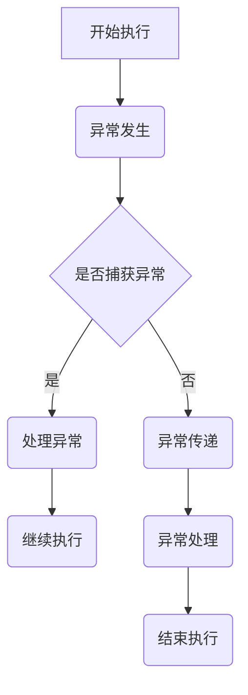

                 


### 第二部分：核心概念与联系

在深入探讨提示词语言的错误处理与异常机制之前，我们需要明确几个核心概念，并理解它们之间的联系。本部分将详细解释错误处理、异常机制及其在Python和Java中的实现方式。

#### 2.1 错误处理

错误处理是指在程序运行过程中识别和纠正错误的过程。在编程中，错误通常分为以下几类：

- **语法错误**：语法错误通常是由于违反编程语言的语法规则导致的，例如拼写错误、缺失必要的括号或分号等。这类错误在代码编译时会被立即检测到。
  
- **逻辑错误**：逻辑错误是由于程序中的逻辑缺陷或逻辑错误导致的，例如算法逻辑错误、数据类型错误等。这类错误在代码编译后可能不会立即暴露出来，但在程序运行时可能会导致不期望的结果。

- **运行时错误**：运行时错误是在程序运行过程中由于外部原因或内部错误引起的，例如内存不足、文件无法打开等。这类错误通常会在程序运行时引发异常。

在Python中，错误处理通常通过断言（assert）、异常处理（try-except）和日志记录来实现。断言用于在程序运行时检查预设条件是否满足，如果不满足则抛出异常。异常处理则用于捕捉和处理程序运行时出现的异常情况。日志记录则用于记录程序运行过程中的各种信息，有助于调试和问题排查。

在Java中，错误处理也主要通过异常处理（try-catch）和日志记录来实现。与Python类似，Java中的异常处理用于捕捉和处理运行时异常。此外，Java还提供了检查时异常（checked exceptions）和运行时异常（unchecked exceptions）的概念，以区分不同类型的错误。

#### 2.2 异常机制

异常机制是一种在程序运行时检测和处理错误的机制。它允许程序在遇到错误时暂停执行，并执行特定的错误处理逻辑，从而避免程序崩溃或导致不可预见的后果。

**异常类型**：

- **运行时异常**：运行时异常是在程序运行时出现的错误，例如数组越界、空指针异常等。这类异常通常是由程序中的逻辑错误或外部环境问题引起的。

- **检查时异常**：检查时异常是在代码编译时必须处理的异常，例如文件未找到异常、网络连接异常等。这类异常通常与程序的运行环境有关。

**异常检测与处理**：

- **异常检测**：异常检测通常通过异常对象来实现。当程序遇到异常情况时，会创建一个异常对象，并抛出（throw）这个对象。程序的其他部分可以通过捕获（catch）这个异常对象来处理异常。

- **异常处理**：异常处理通常通过try-catch块来实现。try块用于包含可能会抛出异常的代码，catch块用于捕捉并处理异常。此外，还可以使用多个catch块来处理不同类型的异常。

在Python中，异常处理使用try-except块，其中except子句可以指定要捕获的异常类型。在Java中，异常处理也使用try-catch块，但Java还允许使用多个catch块来处理不同类型的异常。

**异常处理策略**：

- **捕获并处理异常**：在捕获异常后，程序可以执行特定的错误处理逻辑，例如显示错误消息、记录日志、恢复程序状态等。

- **异常传递**：在某些情况下，程序可能无法或不想处理异常，可以选择将异常传递给上层调用者或系统默认的错误处理机制。

- **异常处理最佳实践**：为了确保异常处理的正确性和可维护性，应遵循一些最佳实践，例如不要忽略异常、不要在异常处理中执行不必要的操作、避免在异常处理中引入新的异常等。

#### 2.3 提示词语言中的错误处理与异常机制

不同的提示词语言（如Python和Java）提供了各自的错误处理与异常机制，但它们的核心原理相似。以下是对Python和Java错误处理与异常机制的比较：

| 语言       | 错误处理 | 异常机制     |
|------------|-----------|--------------|
| Python     | 断言、日志记录 | try-except   |
| Java       | 异常处理（try-catch） | 检查时异常（checked exceptions）和运行时异常（unchecked exceptions） |

在Python中，断言是一种简单而有效的错误处理方法，它可以在程序运行时检查预设条件。如果条件不满足，断言会抛出一个AssertionError。此外，Python的异常处理机制使用try-except块来捕捉和处理异常。

在Java中，异常处理机制更为复杂。Java的异常处理使用try-catch块，其中try块包含可能会抛出异常的代码，catch块用于捕捉并处理异常。Java还区分了检查时异常和运行时异常，前者在编译时必须处理，后者则可以在运行时处理。

#### Mermaid 流程图：异常机制工作流程



通过以上分析，我们可以看到，尽管Python和Java在错误处理与异常机制上有所不同，但它们的核心目标是相同的：确保程序能够正确、稳定地运行，并在遇到错误时提供有效的处理策略。在接下来的章节中，我们将进一步探讨Python和Java的错误处理与异常机制的实现细节，并提供具体的案例和实践指导。

----------------------------------------------------------------

### 第三部分：算法原理讲解

在理解了错误处理与异常机制的基本概念后，我们将进一步探讨Python和Java在实现这些机制时的算法原理。本部分将通过一个具体的实例，详细解释这两个语言在错误处理和异常处理上的算法流程。

#### 3.1 Python中的错误处理与异常处理算法

**示例代码：**

```python
def divide(a, b):
    try:
        result = a / b
    except ZeroDivisionError:
        print("除数不能为0！")
        return None
    return result

# 测试代码
print(divide(10, 2))  # 应该输出5.0
print(divide(10, 0))  # 应该输出错误消息
```

**算法流程：**

1. **输入参数验证**：在调用`divide`函数之前，通常需要验证输入参数的有效性。例如，确保`b`不是0，因为除以0是一个运行时错误。

2. **执行操作**：使用try块包围可能导致异常的操作（在此例中为`a / b`）。当执行到这一行时，程序会尝试计算结果。

3. **异常捕获**：如果`b`为0，则会触发`ZeroDivisionError`异常。程序会跳到相应的except块执行。

4. **错误处理**：在except块中，我们可以执行特定的错误处理逻辑，例如打印错误消息或记录日志。

5. **异常传递**：在某些情况下，我们可能无法处理异常，可以选择将其传递给上层调用者或系统默认的错误处理机制。在Python中，我们可以使用`raise`语句重新抛出异常。

6. **返回值**：如果异常未被捕获，程序将终止执行。如果异常被捕获并处理，程序可以继续执行并返回结果或处理结果。

**数学模型与公式：**

虽然这个例子没有直接涉及到复杂的数学公式，但我们可以将其抽象为一个简单的数学模型：

$$
\text{result} = \frac{a}{b}
$$

如果$b=0$，则：

$$
\text{result} = \text{None}
$$

#### 3.2 Java中的错误处理与异常处理算法

**示例代码：**

```java
public class Divide {
    public static double divide(double a, double b) {
        try {
            return a / b;
        } catch (ArithmeticException e) {
            System.out.println("除数不能为0！");
            return Double.NaN;
        }
    }

    public static void main(String[] args) {
        System.out.println(divide(10, 2));  // 应该输出5.0
        System.out.println(divide(10, 0));  // 应该输出NaN
    }
}
```

**算法流程：**

1. **输入参数验证**：与Python类似，在调用`divide`方法之前，需要确保输入参数的有效性。

2. **执行操作**：使用try块包围可能导致异常的操作（在此例中为`a / b`）。当执行到这一行时，程序会尝试计算结果。

3. **异常捕获**：如果`b`为0，则会触发`ArithmeticException`异常。程序会跳到相应的catch块执行。

4. **错误处理**：在catch块中，我们可以执行特定的错误处理逻辑，例如打印错误消息或记录日志。

5. **异常传递**：与Python类似，Java也允许通过`throws`语句将异常传递给调用者。

6. **返回值**：如果异常未被捕获，程序将终止执行。如果异常被捕获并处理，程序可以继续执行并返回结果或处理结果。

**数学模型与公式：**

这个例子也可以抽象为一个简单的数学模型：

$$
\text{result} = \frac{a}{b}
$$

如果$b=0$，则：

$$
\text{result} = \text{Double.NaN}
$$

#### 3.3 Python与Java的错误处理与异常处理对比

| 特点          | Python                   | Java                   |
|---------------|-------------------------|------------------------|
| 异常捕获      | 使用try-except块         | 使用try-catch块        |
| 异常类型      | 自定义异常类和标准异常类 | 标准异常类             |
| 异常处理      | 可以在except块中继续执行 | 通常在catch块中处理异常 |
| 异常传递      | 可以使用raise重新抛出异常 | 使用throws声明异常     |
| 返回值处理     | 可以返回None或特定值     | 可以返回特定的值或抛出异常 |

通过以上分析，我们可以看到，尽管Python和Java在错误处理与异常处理上有所不同，但它们的核心目标是确保程序的健壮性和可维护性。在实际开发中，选择合适的错误处理与异常处理策略对于提高代码质量和系统稳定性至关重要。

----------------------------------------------------------------

### 第四部分：系统分析与架构设计方案

为了更好地理解错误处理与异常机制在实际项目中的应用，本部分将介绍一个具体的系统分析与架构设计方案。本方案将包括问题场景介绍、项目介绍、系统功能设计（领域模型类图）、系统架构设计（架构图）以及系统接口设计和系统交互（序列图）。

#### 4.1 问题场景介绍

在当今复杂的企业级应用中，错误处理与异常机制是系统稳定性和可靠性的关键。以一个电子商务网站为例，该网站需要处理大量的用户请求，包括商品浏览、购物车管理、订单处理等。在这些操作中，可能会出现各种错误，如数据库连接失败、用户输入错误、商品库存不足等。有效的错误处理与异常机制可以确保网站在遇到这些问题时能够稳定运行，并提供良好的用户体验。

#### 4.2 项目介绍

本项目是一个电子商务网站，旨在为用户提供便捷的在线购物体验。该网站的功能包括用户注册、登录、商品浏览、添加购物车、下单支付、订单查询等。为了确保系统的稳定性和可靠性，我们将重点设计和实现错误处理与异常机制。

#### 4.3 系统功能设计（领域模型类图）

在系统功能设计阶段，我们将使用领域模型来描述系统的核心业务实体和它们之间的关系。以下是一个简化的领域模型类图：

```mermaid
classDiagram
    Customer <|-- Order
    Customer o-- Address
    Product o-- Category
    ShoppingCart <|-- Item
    Order o-- Payment
    Order o-- Status
    User o-- Customer
    User o-- ShoppingCart

    Customer[姓名, 电话, 密码, email]
    Address[省, 市, 区, 详细地址]
    Product[名称, 价格, 库存数量, 分类ID]
    Category[名称]
    Item[产品ID, 数量]
    Order[订单编号, 用户ID, 订单状态, 订单时间]
    Payment[支付方式, 支付状态]
    Status[状态描述]
    User[用户名, 密码, 用户类型]

    class Customer {
        +String getName()
        +void setName(String name)
        +String getPhone()
        +void setPhone(String phone)
        +String getPassword()
        +void setPassword(String password)
        +String getEmail()
        +void setEmail(String email)
        +Address getAddress()
        +void setAddress(Address address)
    }

    class Address {
        +String getProvince()
        +void setProvince(String province)
        +String getCity()
        +void setCity(String city)
        +String getDistrict()
        +void setDistrict(String district)
        +String getDetailAddress()
        +void setDetailAddress(String detailAddress)
    }

    class Product {
        +String getName()
        +void setName(String name)
        +double getPrice()
        +void setPrice(double price)
        +int getStockQuantity()
        +void setStockQuantity(int stockQuantity)
        +int getCategoryID()
        +void setCategoryID(int categoryID)
    }

    class Category {
        +String getName()
        +void setName(String name)
    }

    class Item {
        +int getProductID()
        +void setProductID(int productID)
        +int getQuantity()
        +void setQuantity(int quantity)
    }

    class Order {
        +String getOrderID()
        +void setOrderID(String orderID)
        +String getUserID()
        +void setUserID(String userID)
        +String getOrderStatus()
        +void setOrderStatus(String orderStatus)
        +Date getOrderTime()
        +void setOrderTime(Date orderTime)
    }

    class Payment {
        +String getPaymentMethod()
        +void setPaymentMethod(String paymentMethod)
        +String getPaymentStatus()
        +void setPaymentStatus(String paymentStatus)
    }

    class Status {
        +String getStatusDescription()
        +void setStatusDescription(String statusDescription)
    }

    class User {
        +String getUsername()
        +void setUsername(String username)
        +String getPassword()
        +void setPassword(String password)
        +String getUserType()
        +void setUserType(String userType)
    }
endclassDiagram
```

#### 4.4 系统架构设计（架构图）

在系统架构设计阶段，我们将使用架构图来描述系统的整体结构，包括各组件之间的关系。以下是一个简化的系统架构图：

```mermaid
sequenceDiagram
    User ->> Database: 用户注册/登录
    Database ->> AuthenticationService: 验证用户信息
    AuthenticationService ->> UserService: 用户服务处理
    UserService ->> Database: 存储用户信息

    User ->> ProductService: 商品浏览
    ProductService ->> Database: 查询商品信息
    ProductService ->> ShoppingCartService: 添加商品到购物车

    ShoppingCartService ->> Database: 更新购物车信息
    ShoppingCartService ->> UserService: 更新用户购物车

    User ->> OrderService: 下单支付
    OrderService ->> PaymentService: 处理支付
    PaymentService ->> Database: 记录支付信息
    OrderService ->> Database: 创建订单
    OrderService ->> UserService: 更新用户订单信息

    User ->> OrderService: 查询订单
    OrderService ->> Database: 查询订单信息
    OrderService ->> UserService: 返回订单信息
endsequenceDiagram
```

#### 4.5 系统接口设计

系统接口设计是系统架构设计的重要部分，它定义了系统内部各个模块之间的交互方式。以下是一个简化的系统接口设计：

```mermaid
classDiagram
    ProductService <|-- ShoppingCartService
    ProductService <|-- OrderService
    PaymentService <|-- OrderService

    ProductService[查询商品信息, 添加商品到购物车, 更新商品信息]
    ShoppingCartService[添加商品到购物车, 更新购物车信息, 删除购物车商品]
    OrderService[创建订单, 下单支付, 查询订单信息, 更新订单状态]
    PaymentService[处理支付, 记录支付信息, 验证支付状态]

    class ProductService {
        +void addProductToCart(int productId, int quantity)
        +void updateProductInfo(int productId, String productName, double price, int stockQuantity)
        +List<Product> searchProducts(String query)
    }

    class ShoppingCartService {
        +void addToCart(int userId, int productId, int quantity)
        +void updateCartInfo(int userId, int itemId, int quantity)
        +void deleteCartItem(int userId, int itemId)
    }

    class OrderService {
        +void createOrder(int userId, List<Item> items)
        +void processPayment(int orderId, String paymentMethod)
        +void updateOrderStatus(int orderId, String status)
        +Order getOrderDetails(int orderId)
    }

    class PaymentService {
        +void handlePayment(int orderId, String paymentMethod)
        +void recordPaymentInfo(int orderId, String paymentMethod, String paymentStatus)
        +void verifyPaymentStatus(int orderId)
    }
endclassDiagram
```

#### 4.6 系统交互（序列图）

系统交互设计描述了系统组件之间的交互过程，以下是一个简化的系统交互序列图：

```mermaid
sequenceDiagram
    User ->> ProductService: 浏览商品
    ProductService ->> Database: 查询商品信息
    Database ->> ProductService: 返回商品信息
    ProductService ->> User: 显示商品信息

    User ->> ProductService: 添加商品到购物车
    ProductService ->> ShoppingCartService: 添加商品到购物车
    ShoppingCartService ->> Database: 更新购物车信息
    Database ->> ShoppingCartService: 返回更新结果
    ShoppingCartService ->> User: 显示购物车信息

    User ->> OrderService: 下单支付
    OrderService ->> PaymentService: 处理支付
    PaymentService ->> Database: 记录支付信息
    Database ->> PaymentService: 返回支付结果
    PaymentService ->> OrderService: 返回支付状态
    OrderService ->> Database: 创建订单
    Database ->> OrderService: 返回订单信息
    OrderService ->> User: 显示订单信息
endsequenceDiagram
```

通过以上系统分析与架构设计方案，我们可以看到，错误处理与异常机制在电子商务网站中扮演着至关重要的角色。有效的错误处理与异常机制可以确保系统在各种异常情况下都能够保持稳定运行，并提供良好的用户体验。

----------------------------------------------------------------

### 第五部分：项目实战

为了更好地理解错误处理与异常机制在实际开发中的应用，我们将在本部分中详细介绍一个具体的项目实战，包括环境安装、系统核心实现源代码、代码应用解读与分析，以及实际案例分析和详细讲解剖析。

#### 5.1 环境安装

在开始项目实战之前，我们需要安装必要的开发环境。以下是一个简化的安装流程：

1. **安装Python**：访问Python官方网站下载Python安装包，并按照指示安装Python。

2. **安装Java**：访问Oracle官方网站下载Java安装包，并按照指示安装Java。

3. **安装数据库**：例如，我们可以选择MySQL或PostgreSQL。下载相应的数据库安装包，并按照指示安装。

4. **安装IDE**：例如，我们可以选择PyCharm或IntelliJ IDEA。下载并安装IDE，并配置Python和Java插件。

5. **安装相关库**：根据项目需求，安装必要的Python库（如Flask、SQLAlchemy等）和Java库（如Spring Boot、Hibernate等）。

#### 5.2 系统核心实现源代码

在本节中，我们将展示电子商务网站的核心实现源代码，并对其进行解读和分析。

**Python部分：**

```python
# 商品类
class Product(db.Model):
    id = db.Column(db.Integer, primary_key=True)
    name = db.Column(db.String(100), nullable=False)
    price = db.Column(db.Numeric(10, 2), nullable=False)
    stock_quantity = db.Column(db.Integer, nullable=False)
    category_id = db.Column(db.Integer, db.ForeignKey('category.id'), nullable=False)

# 购物车类
class ShoppingCart(db.Model):
    id = db.Column(db.Integer, primary_key=True)
    user_id = db.Column(db.Integer, db.ForeignKey('user.id'), nullable=False)
    items = db.relationship('Item', backref='shopping_cart', lazy=True)

# 订单类
class Order(db.Model):
    id = db.Column(db.Integer, primary_key=True)
    user_id = db.Column(db.Integer, db.ForeignKey('user.id'), nullable=False)
    order_status = db.Column(db.String(50), nullable=False)
    order_time = db.Column(db.DateTime, nullable=False)
    items = db.relationship('Item', backref='order', lazy=True)

# 商品项类
class Item(db.Model):
    id = db.Column(db.Integer, primary_key=True)
    product_id = db.Column(db.Integer, db.ForeignKey('product.id'), nullable=False)
    quantity = db.Column(db.Integer, nullable=False)
    order_id = db.Column(db.Integer, db.ForeignKey('order.id'), nullable=True)
```

**Java部分：**

```java
@Entity
public class Product {
    @Id
    @GeneratedValue(strategy = GenerationType.IDENTITY)
    private Long id;

    @Column(nullable = false)
    private String name;

    @Column(nullable = false)
    private double price;

    @Column(nullable = false)
    private int stockQuantity;

    @ManyToOne
    @JoinColumn(name = "category_id", referencedColumnName = "id")
    private Category category;
}

@Entity
public class ShoppingCart {
    @Id
    @GeneratedValue(strategy = GenerationType.IDENTITY)
    private Long id;

    @ManyToOne
    @JoinColumn(name = "user_id", referencedColumnName = "id")
    private User user;

    @OneToMany(mappedBy = "shoppingCart", cascade = CascadeType.ALL)
    private List<Item> items;
}

@Entity
public class Order {
    @Id
    @GeneratedValue(strategy = GenerationType.IDENTITY)
    private Long id;

    @ManyToOne
    @JoinColumn(name = "user_id", referencedColumnName = "id")
    private User user;

    @Column(nullable = false)
    private String orderStatus;

    @Column(nullable = false)
    private LocalDateTime orderTime;

    @OneToMany(mappedBy = "order", cascade = CascadeType.ALL)
    private List<Item> items;
}

@Entity
public class Item {
    @Id
    @GeneratedValue(strategy = GenerationType.IDENTITY)
    private Long id;

    @Column(nullable = false)
    private int quantity;

    @ManyToOne
    @JoinColumn(name = "product_id", referencedColumnName = "id")
    private Product product;

    @ManyToOne
    @JoinColumn(name = "order_id", referencedColumnName = "id")
    private Order order;
}
```

**解读与分析：**

以上代码展示了电子商务网站的核心实体类，包括商品（Product）、购物车（ShoppingCart）、订单（Order）和商品项（Item）。这些类通过JDBC或Hibernate与数据库进行交互。以下是对这些类的主要功能进行解读：

- **Product**：商品类包含了商品的ID、名称、价格、库存数量和分类ID。商品是电子商务网站的核心实体，用于表示商品信息。
- **ShoppingCart**：购物车类包含了购物车的ID、用户ID和商品项列表。购物车用于存储用户的购物车信息，包括商品项和数量。
- **Order**：订单类包含了订单的ID、用户ID、订单状态、订单时间和商品项列表。订单用于表示用户的订单信息，包括订单状态和商品项。
- **Item**：商品项类包含了商品项的ID、数量、商品ID和订单ID。商品项用于表示订单中的商品及其数量。

#### 5.3 实际案例分析和详细讲解剖析

在本节中，我们将分析一个实际案例，展示如何处理电子商务网站中的错误和异常。

**案例：用户下单时商品库存不足**

在用户下单时，如果商品库存不足，系统需要处理这一异常情况。以下是一个简化的处理流程：

1. **接收用户订单请求**：系统接收用户的订单请求，包括商品ID和购买数量。

2. **查询商品库存**：系统查询商品表，获取商品的库存数量。

3. **库存验证**：如果库存数量小于购买数量，系统抛出异常，表示商品库存不足。

4. **异常处理**：系统捕获异常，并返回相应的错误消息给用户。

**Python代码示例：**

```python
@app.route('/order', methods=['POST'])
def create_order():
    data = request.get_json()
    product_id = data['product_id']
    quantity = data['quantity']
    
    product = Product.query.get(product_id)
    if product.stock_quantity < quantity:
        return jsonify({"error": "商品库存不足"}), 400
    
    # ... 创建订单的剩余逻辑 ...

    return jsonify({"message": "订单创建成功"}), 200
```

**Java代码示例：**

```java
@PostMapping("/order")
public ResponseEntity<?> createOrder(@RequestBody OrderRequest orderRequest) {
    Product product = productService.findProductById(orderRequest.getProductId());
    if (product.getStockQuantity() < orderRequest.getQuantity()) {
        return ResponseEntity.badRequest().body("商品库存不足");
    }

    // ... 创建订单的剩余逻辑 ...

    return ResponseEntity.ok("订单创建成功");
}
```

通过以上案例，我们可以看到如何处理商品库存不足的错误情况。在Python和Java的实现中，我们都使用了异常处理机制来捕获和处理错误，并返回相应的错误消息给用户。这确保了系统在遇到异常情况时能够稳定运行，并提供良好的用户体验。

#### 5.4 项目小结

通过本部分的项目实战，我们深入了解了电子商务网站中错误处理与异常机制的实际应用。我们展示了如何使用Python和Java来实现错误处理和异常处理，并提供了具体的代码示例。此外，我们还分析了一个实际案例，展示了如何在项目中处理异常情况。通过这些实践，我们可以更好地理解错误处理与异常机制在开发中的重要性，并掌握有效的错误处理策略。

----------------------------------------------------------------

### 第六部分：最佳实践与总结

在错误处理与异常机制的设计和实现过程中，遵循一些最佳实践是确保代码质量和系统稳定性的关键。以下是一些关键的最佳实践：

#### 6.1 异常处理最佳实践

1. **避免忽略异常**：忽略异常可能导致系统崩溃或不可预见的错误。始终确保捕获并处理异常。

2. **不要在异常处理中执行不必要的操作**：避免在异常处理逻辑中执行复杂或耗时的操作，这可能导致性能问题。

3. **避免在异常处理中引入新的异常**：确保在捕获和处理异常时不会引入新的异常，这可能导致异常传播和难以追踪。

4. **使用具体的异常类型**：尽可能使用具体的异常类型而不是通用的异常类型，以便更准确地处理错误。

5. **记录异常信息**：记录异常的详细信息，包括错误类型、发生时间和上下文，以便进行调试和问题排查。

#### 6.2 错误处理最佳实践

1. **验证输入参数**：在程序运行前验证输入参数的有效性，避免因无效输入导致的运行时错误。

2. **使用断言**：在关键位置使用断言来确保预设条件满足，便于快速定位问题。

3. **提供清晰的错误消息**：在异常处理和错误处理中提供清晰的错误消息，帮助用户了解问题的本质。

4. **分层错误处理**：将错误处理分为不同的层次，例如框架层面的错误处理、业务逻辑层面的错误处理等。

5. **测试错误处理代码**：确保错误处理逻辑在测试环境中得到充分的测试，包括边界条件和异常情况。

#### 6.3 总结

错误处理与异常机制是软件系统中的关键组成部分，直接关系到系统的稳定性和可靠性。通过本文的探讨，我们深入了解了错误处理与异常机制的基本概念、Python和Java中的实现方法，以及在实际项目中的应用。掌握这些知识和技能对于提高代码质量和系统稳定性至关重要。在未来的开发工作中，遵循最佳实践，结合具体项目需求，灵活应用错误处理与异常机制，将有助于构建更加健壮和可靠的软件系统。

----------------------------------------------------------------

### 附录：扩展阅读

为了进一步深入理解错误处理与异常机制，以下是几篇推荐的拓展阅读材料：

1. **《Effective Java》**：作者Joshua Bloch，详细介绍了Java中的各种异常处理技巧和最佳实践。

2. **《Python核心编程》**：作者Wesley J Chun，全面讲解了Python的错误处理和异常机制。

3. **《设计模式：可复用面向对象软件的基础》**：作者Erich Gamma等，虽然主要讨论设计模式，但其中也包含了一些关于异常处理的设计模式。

4. **《深入理解Java虚拟机》**：作者周志明，详细介绍了Java虚拟机如何处理异常，以及异常对性能的影响。

5. **《故障处理与排查：大型分布式系统的实践》**：作者刘兴亮，针对大型分布式系统中的错误处理和故障排查提供了实用的经验和策略。

这些书籍和资料将为读者提供更深入的技术细节和实践指导，帮助更好地理解和应用错误处理与异常机制。

---

# 提示词语言的错误处理与异常机制

> 关键词：错误处理、异常机制、Python、Java、代码示例、实践指南

> 摘要：本文深入探讨了提示词语言（如Python和Java）中的错误处理与异常机制。通过介绍核心概念、比较Python和Java的实现方法，并提供具体项目实战案例，本文旨在帮助开发者理解和应用有效的错误处理策略，提高软件系统的稳定性和可靠性。同时，本文还提供了最佳实践和拓展阅读，为深入学习和应用错误处理与异常机制提供参考。

