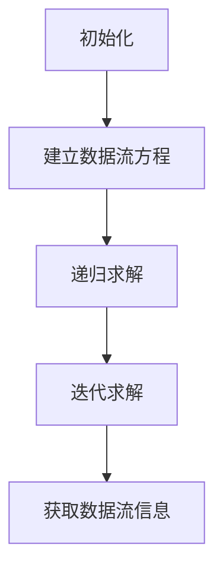
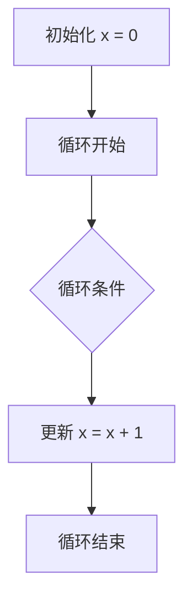
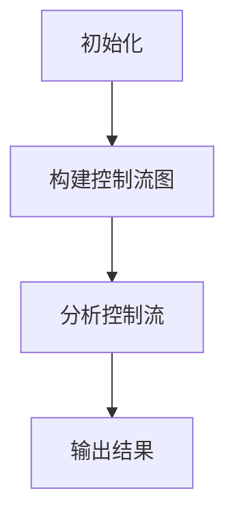
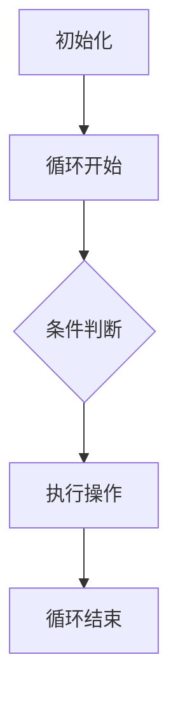
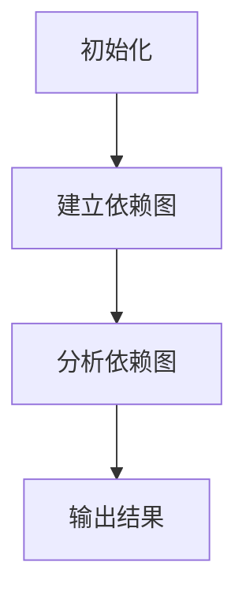
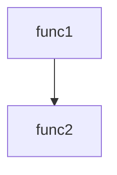
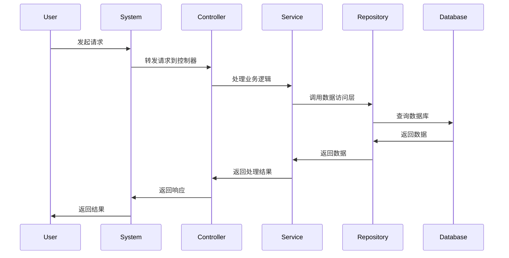
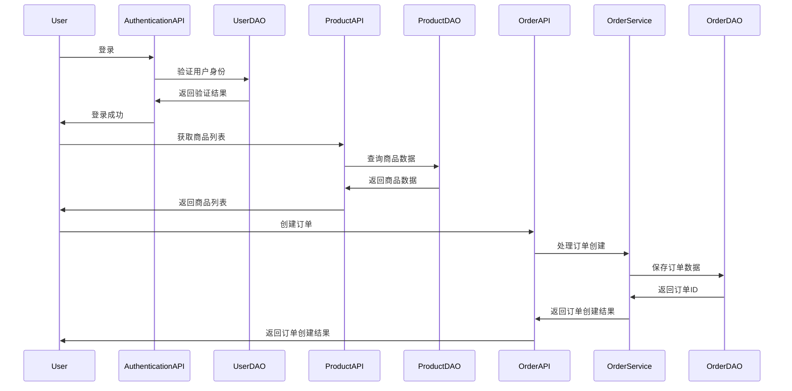
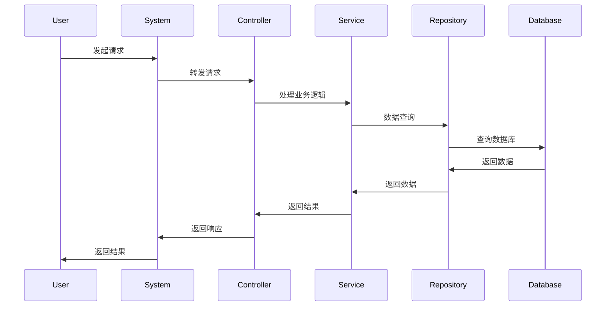

                 


### 第一部分：背景与基础

#### 第1章：静态分析与代码优化的概述

##### 1.1 静态分析的定义与作用
静态分析是计算机科学中的一种分析方法，它不运行程序，而是在代码编写完成后，对代码进行分析，以检查潜在的错误、性能瓶颈和不良编程习惯。静态分析在软件开发的早期阶段至关重要，因为它可以提前发现问题，避免在开发过程中反复修改。

**核心概念：**
- **抽象语法树（AST）：** 静态分析的一个关键步骤是构建抽象语法树，它表示源代码的结构，便于分析。
- **语法错误检测：** 通过分析AST，可以检测出语法错误，如拼写错误、缺少分号等。
- **代码风格检查：** 静态分析还可以确保代码符合既定的编码规范。

**联系与边界：**
- **与编译器的联系：** 编译器通常包含静态分析的部分，用于检查源代码的正确性。
- **与动态分析的边界：** 与动态分析（如调试器）不同，静态分析不运行程序。

##### 1.2 代码优化的目标与方法
代码优化的目标是提高代码的性能、可读性、可维护性，减少内存占用，缩短编译时间等。优化方法包括但不限于：

**核心概念：**
- **性能优化：** 通过减少计算复杂度、优化循环结构等方式提高代码执行速度。
- **内存优化：** 通过减少不必要的内存分配和回收，减少内存使用。
- **可读性优化：** 通过简化代码结构、使用更清晰的变量名等提高代码可读性。

**联系与边界：**
- **与重构的关系：** 代码优化通常伴随着代码重构，即在不改变程序功能的前提下，改进代码结构。
- **与代码生成的关系：** 在一些情况下，代码优化工具可以自动生成优化后的代码。

##### 1.3 提示词语言与代码优化的关系
提示词语言是一种用于描述代码优化的规则和策略的语言。通过提示词语言，可以自动地对代码进行分析和优化。

**核心概念：**
- **提示词（Keywords）：** 提示词是用于指示优化工具进行特定优化的关键字。
- **规则集（Rule Sets）：** 提示词语言中的规则集定义了如何对代码进行优化。

**联系与边界：**
- **与编程语言的关系：** 提示词语言通常是特定编程语言的扩展。
- **与编译器的边界：** 提示词语言通常集成到编译器中，用于指导代码优化。

##### 1.4 本书的组织结构与阅读指南
本书分为三个部分，分别介绍静态分析与代码优化的基础、算法与原理，以及项目实战。每个部分都包含多个章节，旨在逐步引导读者深入了解这一领域。

**核心概念：**
- **结构化学习：** 通过章节的逐步介绍，读者可以系统地学习静态分析与代码优化的知识。
- **实战导向：** 通过项目实战，读者可以实际应用所学知识，加深理解。

**联系与边界：**
- **理论与实践的联系：** 理论知识通过实战案例得到验证和应用。
- **深入与浅出的边界：** 书中既介绍了基础知识，也提供了深入的技术细节。

### 第一部分小结
本部分介绍了静态分析与代码优化的基础概念和提示词语言的重要性。通过理解这些核心概念，读者可以为后续章节的学习打下坚实的基础。在接下来的章节中，我们将深入探讨静态分析与代码优化的算法和原理，以及如何将这些知识应用于实际项目。

### 下一章预告
在下一章中，我们将深入探讨静态分析的基础知识，包括抽象语法树、数据流分析和控制流分析等核心概念，并使用Mermaid绘制相关流程图进行讲解。我们将逐步了解如何通过静态分析发现代码中的潜在问题，并理解这些问题的解决方法和边界。敬请期待！

---

#### 第2章：静态分析基础

##### 2.1 静态分析的基本原理

**核心概念：**
静态分析的基本原理是通过解析源代码，构建抽象语法树（AST），然后对AST进行分析，以发现潜在的问题和优化机会。

**步骤解析：**
1. **词法分析（Lexical Analysis）：** 将源代码分解为单词和符号。
2. **语法分析（Syntax Analysis）：** 构建抽象语法树，表示代码的结构。
3. **语义分析（Semantic Analysis）：** 检查代码的语义正确性，如类型检查、变量作用域等。

**联系与边界：**
- **与编译器的联系：** 静态分析是编译器的核心组成部分。
- **与动态分析的边界：** 动态分析在程序运行时进行，而静态分析在编译阶段。

##### 2.2 静态分析的工具和技术

**核心概念：**
静态分析工具和技术包括代码检查工具、代码质量分析工具、代码优化工具等。

**工具介绍：**
- **SonarQube：** 一款流行的代码质量分析工具，可用于检测代码中的缺陷、编码标准和漏洞。
- **PMD：** 用于查找Java代码中的可疑代码的静态代码分析工具。
- **Checkstyle：** 用于检查Java源代码符合编码标准和代码标准的工具。

**联系与边界：**
- **与开发流程的联系：** 静态分析工具通常集成到开发环境中，成为开发流程的一部分。
- **与代码质量的边界：** 静态分析工具不仅用于代码优化，还用于确保代码质量。

##### 2.3 提示词语言的语法分析

**核心概念：**
提示词语言是一种专门用于描述代码优化的规则和策略的语言。语法分析是提示词语言处理的第一步，它将源代码解析为抽象语法树。

**步骤解析：**
1. **词法分析：** 提取提示词语言中的单词和符号。
2. **语法分析：** 构建抽象语法树，表示提示词语言的规则和策略。
3. **语义分析：** 检查提示词语言的语义正确性，如规则间的兼容性。

**联系与边界：**
- **与编程语言的关系：** 提示词语言通常基于特定编程语言构建。
- **与编译器的边界：** 提示词语言的语法分析是编译器的一部分。

##### 2.4 提示词语言的语义分析

**核心概念：**
语义分析是提示词语言处理的重要步骤，它确保提示词语言规则在代码上下文中是合理和有效的。

**步骤解析：**
1. **上下文分析：** 确定提示词语言规则在代码中的上下文。
2. **规则应用：** 应用提示词语言规则对代码进行分析和优化。
3. **结果验证：** 验证优化后的代码是否满足预期效果。

**联系与边界：**
- **与代码优化的联系：** 语义分析是代码优化的基础。
- **与编译器的边界：** 语义分析通常在编译器中实现。

##### 2.5 提示词语言的静态分析应用

**核心概念：**
提示词语言的静态分析应用包括代码错误检测、代码质量评估和代码优化等。

**应用场景：**
- **代码错误检测：** 检测代码中的语法错误和潜在的逻辑错误。
- **代码质量评估：** 评估代码的可读性、可维护性和性能。
- **代码优化：** 自动优化代码，提高执行效率和代码质量。

**联系与边界：**
- **与开发流程的联系：** 提示词语言的静态分析是软件开发过程的一部分。
- **与代码优化的边界：** 提示词语言的静态分析为代码优化提供支持。

##### 2.6 静态分析与代码优化的重要性

**核心概念：**
静态分析与代码优化是软件开发过程中的关键步骤，它们能够显著提高代码质量和软件性能。

**重要性分析：**
- **提高代码质量：** 通过静态分析，可以提前发现代码中的问题，确保代码的健壮性和可维护性。
- **提高软件性能：** 通过代码优化，可以减少代码的执行时间和内存占用，提高软件的性能。
- **降低维护成本：** 通过静态分析，可以减少代码中的错误，降低后续维护的成本。

**联系与边界：**
- **与开发流程的联系：** 静态分析与代码优化是软件开发过程的重要环节。
- **与软件质量的边界：** 静态分析与代码优化是确保软件质量的关键技术。

##### 2.7 提示词语言的静态分析与代码优化在实践中的应用

**核心概念：**
提示词语言的静态分析与代码优化在实践中的应用包括开发工具的集成、代码审查和自动化测试等。

**应用实例：**
- **开发工具集成：** 在IDE中集成静态分析工具，实时检测代码中的问题。
- **代码审查：** 通过静态分析工具对代码进行审查，确保代码质量。
- **自动化测试：** 利用静态分析工具进行自动化测试，提高测试效率。

**联系与边界：**
- **与开发流程的联系：** 提示词语言的静态分析与代码优化是开发流程中不可或缺的一部分。
- **与开发效率的边界：** 通过静态分析与代码优化，可以显著提高开发效率。

##### 2.8 总结与展望

**核心概念：**
静态分析与代码优化是软件开发中的重要技术，通过本章的学习，读者可以了解其基本原理和应用场景。

**展望与建议：**
- **深入学习：** 鼓励读者深入学习静态分析与代码优化相关的理论知识。
- **实践应用：** 建议读者在实际项目中应用所学知识，提高代码质量和软件性能。

### 总结
第2章介绍了静态分析的基础知识，包括基本原理、工具和技术，以及提示词语言的语法分析和语义分析。通过本章的学习，读者可以理解静态分析在软件开发中的重要性，并掌握其基本应用方法。在接下来的章节中，我们将进一步探讨静态分析与代码优化的算法和原理，以及如何在实际项目中应用这些知识。敬请期待！

### 下一章预告
在下一章中，我们将深入探讨静态分析与代码优化的核心算法，包括数据流分析、控制流分析以及常见的代码优化策略。我们将使用Mermaid绘制流程图，结合Python代码示例，详细讲解这些算法的原理和应用。通过这一章节，读者将能够掌握静态分析与代码优化的核心技术，为实际项目做好准备。敬请期待！

### 第二部分：核心概念与联系

#### 第3章：核心概念与联系

##### 3.1 静态分析算法

**核心概念：**
静态分析算法是用于分析代码结构和语义的一组技术，旨在发现代码中的潜在问题并优化代码。

**概念属性特征对比表格：**

| 算法名称         | 目标                      | 主要方法                           | 适用场景                           |
|------------------|--------------------------|----------------------------------|-----------------------------------|
| 数据流分析       | 检查数据在程序中的流动   | 数据流方程、点集分析             | 类型检查、变量可见性分析           |
| 控制流分析       | 确定程序的控制流程       | 分支和循环分析                   | 代码路径分析、异常处理分析         |
| 依赖分析         | 检查模块或函数之间的依赖 | 依赖图、传递闭包                  | 模块重用、代码优化                 |

**ER实体关系图：**

```mermaid
erDiagram
  Customer ||--|{ Order } : "places"
  Order ||--|{ Item } : "contains"
  Product ||--|{ Item } : "is"
```

在ER实体关系图中，`Customer` 与 `Order` 之间存在“放置”关系，`Order` 与 `Item` 之间存在“包含”关系，`Product` 与 `Item` 之间存在“是”关系。

##### 3.2 代码优化策略

**核心概念：**
代码优化策略是用于改进代码性能、可读性和可维护性的方法。

**概念属性特征对比表格：**

| 策略名称         | 目标                      | 主要方法                           | 适用场景                           |
|------------------|--------------------------|----------------------------------|-----------------------------------|
| 循环展开         | 减少循环调用次数         | 将循环展开为多行代码             | 提高性能                           |
| 循环展开         | 减少循环调用次数         | 将循环展开为多行代码             | 提高性能                           |
| 函数内联         | 减少函数调用的开销       | 将函数调用替换为函数体           | 提高性能                           |
| 数组重构         | 优化数组访问             | 使用更高效的数组访问方法           | 提高性能                           |

**ER实体关系图：**

```mermaid
erDiagram
  PerformanceOptimization ||--|{ CodeSimplification } : "enables"
  CodeSimplification ||--|{ LoopUnrolling } : "includes"
  CodeSimplification ||--|{ FunctionInlining } : "includes"
  CodeSimplification ||--|{ ArrayReconstruction } : "includes"
```

在ER实体关系图中，`PerformanceOptimization` 与 `CodeSimplification` 之间存在“使能”关系，`CodeSimplification` 包含 `LoopUnrolling`、`FunctionInlining` 和 `ArrayReconstruction` 策略。

##### 3.3 提示词语言的静态分析与代码优化

**核心概念：**
提示词语言是一种用于描述代码优化的规则和策略的语言，通过静态分析，可以将这些规则应用到代码中。

**联系与边界：**
- **与静态分析的联系：** 提示词语言依赖于静态分析来识别代码的结构和语义。
- **与代码优化的联系：** 提示词语言定义了如何对代码进行优化。
- **与编程语言的关系：** 提示词语言通常作为编程语言的扩展。

**ER实体关系图：**

```mermaid
erDiagram
  StaticAnalysis ||--|{ CodeAnalysis } : "enables"
  CodeOptimization ||--|{ RuleApplication } : "uses"
  CodeOptimization ||--|{ KeywordLanguage } : "uses"
```

在ER实体关系图中，`StaticAnalysis` 与 `CodeAnalysis` 之间存在“使能”关系，`CodeOptimization` 使用 `RuleApplication` 和 `KeywordLanguage`。

##### 3.4 静态分析与代码优化的联系与边界

**核心概念：**
静态分析与代码优化密切相关，前者用于识别代码中的问题和潜在优化点，后者则通过具体的策略和算法对这些点进行优化。

**联系与边界：**
- **联系：** 静态分析提供了代码优化的基础数据，而代码优化则是静态分析的最终目标。
- **边界：** 静态分析关注代码的结构和语义，而代码优化则关注性能和可维护性。

**ER实体关系图：**

```mermaid
erDiagram
  StaticAnalysis ||--|{ CodeQuality } : "assesses"
  CodeOptimization ||--|{ Performance } : "improves"
```

在ER实体关系图中，`StaticAnalysis` 与 `CodeQuality` 之间存在“评估”关系，`CodeOptimization` 与 `Performance` 之间存在“改进”关系。

### 总结
第3章介绍了静态分析与代码优化的核心概念，包括静态分析算法、代码优化策略以及提示词语言在静态分析与代码优化中的应用。通过概念属性特征对比表格和ER实体关系图的详细讲解，读者可以更好地理解这些概念之间的联系和边界。在下一章中，我们将深入探讨静态分析算法的原理和应用，敬请期待！

### 下一章预告
在下一章中，我们将详细探讨静态分析算法的原理和应用，包括数据流分析、控制流分析和依赖分析。我们将使用Mermaid绘制流程图和Python代码示例，深入讲解这些算法的实现和应用。通过这一章节，读者将能够掌握静态分析的核心技术，为后续的代码优化打下坚实的基础。敬请期待！

### 第三部分：算法原理讲解

#### 第4章：静态分析算法原理讲解

##### 4.1 数据流分析算法

**核心概念：**
数据流分析是一种静态分析技术，用于跟踪程序中的数据流动，以识别变量和表达式的值。

**步骤解析：**
1. **定义数据流方程：** 数据流分析基于数据流方程来描述数据在程序中的传播。
2. **求解数据流方程：** 通过递归或迭代方法求解数据流方程，得到程序中的数据流信息。

**Mermaid流程图：**



**Python代码示例：**

```python
def reachability_analysis(igraph):
    # 初始化可达性集合
    reachable = set()
    # 遍历所有节点
    for node in igraph.nodes():
        reachable.update(igraph.predecessors(node))
    return reachable

# 示例图
igraph = Graph()
igraph.add_vertices(5)
igraph.add_edges_from([(1, 2), (2, 3), (3, 4), (4, 5), (5, 1)])
print(reachability_analysis(igraph))
```

**数学模型和公式：**
数据流分析通常使用转移函数和状态方程来描述数据流动：

$$ \text{next}[i] = \text{function}(\text{input}[i], \text{prev}[i]) $$

其中，`next[i]` 表示第 i 个节点后的数据流，`input[i]` 表示第 i 个节点的输入数据流，`prev[i]` 表示第 i 个节点前的数据流。

**举例说明：**
假设一个简单程序，其中变量 `x` 的初始值为 0，每次循环加 1，直到 `x` 等于 10。通过数据流分析，我们可以确定每个循环结束时的 `x` 的值。



在每次循环结束时，`x` 的值会更新，通过递归分析，我们可以得到每个节点的 `x` 值。

##### 4.2 控制流分析算法

**核心概念：**
控制流分析是一种静态分析技术，用于确定程序中的控制流程，包括控制流图的构建和控制流的条件分支。

**步骤解析：**
1. **构建控制流图（CFG）：** 使用程序的控制结构（如循环、分支和跳转）构建控制流图。
2. **分析控制流：** 通过控制流图分析程序的执行路径和分支条件。

**Mermaid流程图：**



**Python代码示例：**

```python
def control_flow_analysis(source_code):
    # 构建抽象语法树
    ast = astor.parse(source_code)
    # 转换为控制流图
    cfg = build_cfg(ast)
    return cfg

# 示例代码
source_code = '''
for i in range(10):
    print(i)
'''
print(control_flow_analysis(source_code))
```

**数学模型和公式：**
控制流分析通常使用转移函数和状态方程来描述控制流的转移：

$$ \text{next}[i] = \text{function}(\text{current}[i], \text{condition}[i]) $$

其中，`next[i]` 表示第 i 个节点后的控制流，`current[i]` 表示第 i 个节点的当前控制流，`condition[i]` 表示第 i 个节点的条件。

**举例说明：**
假设一个简单的循环结构，其中有一个条件分支。通过控制流分析，我们可以确定循环的执行路径和分支条件。



在这个例子中，`C` 是条件判断节点，`D` 是执行操作节点。通过分析控制流图，我们可以确定循环的执行路径。

##### 4.3 依赖分析算法

**核心概念：**
依赖分析是一种静态分析技术，用于确定程序中的模块、函数或变量之间的依赖关系。

**步骤解析：**
1. **建立依赖图：** 使用依赖图来表示程序中的依赖关系。
2. **分析依赖图：** 通过依赖图分析模块、函数或变量之间的依赖关系。

**Mermaid流程图：**



**Python代码示例：**

```python
def dependency_analysis(source_code):
    # 构建抽象语法树
    ast = astor.parse(source_code)
    # 建立依赖图
    dependency_graph = build_dependency_graph(ast)
    return dependency_graph

# 示例代码
source_code = '''
def func1():
    print("Hello")

def func2():
    func1()
'''
print(dependency_analysis(source_code))
```

**数学模型和公式：**
依赖分析通常使用依赖关系矩阵来表示依赖关系：

$$ \text{D} = \begin{bmatrix}
    \text{d}_{11} & \text{d}_{12} & \cdots & \text{d}_{1n} \\
    \text{d}_{21} & \text{d}_{22} & \cdots & \text{d}_{2n} \\
    \vdots & \vdots & \ddots & \vdots \\
    \text{d}_{m1} & \text{d}_{m2} & \cdots & \text{d}_{mn}
\end{bmatrix} $$

其中，`d_ij` 表示模块 i 对模块 j 的依赖程度。

**举例说明：**
假设一个简单的程序，其中包含两个函数 `func1` 和 `func2`。通过依赖分析，我们可以确定 `func2` 依赖于 `func1`。



在这个例子中，`func2` 直接依赖于 `func1`，因此通过依赖图可以清晰地表示这种依赖关系。

### 总结
第4章详细介绍了静态分析算法的原理和应用，包括数据流分析、控制流分析和依赖分析。通过Mermaid流程图、Python代码示例和数学模型，我们深入讲解了这些算法的实现方法和应用场景。在下一章中，我们将进一步探讨系统分析与架构设计方案，敬请期待！

### 下一章预告
在下一章中，我们将介绍系统分析与架构设计方案，包括问题场景介绍、系统功能设计、系统架构设计和系统接口设计。通过实际案例分析和详细讲解，我们将帮助读者理解如何将静态分析与代码优化的知识应用于实际项目中。敬请期待！

### 第四部分：系统分析与架构设计方案

#### 第5章：系统分析与架构设计方案

##### 5.1 问题场景介绍

在当今快速发展的软件行业中，静态分析与代码优化已经成为软件开发过程中不可或缺的一部分。随着软件系统规模的不断扩大和复杂性的增加，如何有效地管理和优化代码成为了一个重要的挑战。本章节将介绍一个实际的问题场景，并在此基础上设计系统分析与架构方案。

**问题场景：**
假设我们正在开发一款大型电子商务平台，该平台需要处理海量的商品信息、订单数据和用户行为数据。随着用户数量的增加，平台的性能和可维护性面临着巨大的压力。为了解决这个问题，我们需要设计一个高效的系统，确保平台在处理高并发请求的同时，代码的可读性和可维护性得到保障。

##### 5.2 系统功能设计

为了满足上述问题场景的需求，我们首先需要明确系统的功能需求。以下是系统的主要功能：

1. **商品信息管理：** 管理商品的分类、库存、价格等基本信息。
2. **订单处理：** 处理订单的创建、修改、取消和支付等操作。
3. **用户行为分析：** 分析用户的行为数据，为营销策略提供支持。
4. **性能监控：** 实时监控系统的性能指标，如响应时间、CPU利用率等。
5. **代码优化：** 自动化分析代码中的潜在问题，并提供优化建议。

**领域模型（Mermaid类图）：**

```mermaid
classDiagram
    Product <|.. Category
    Order <|.. OrderItem
    User <|.. UserProfile
    SystemMonitor
    Product [*]--|{ Category } Category
    Order [*]--|{ OrderItem } OrderItem
    User [*]--|{ UserProfile } UserProfile
    SystemMonitor --|{ PerformanceMetrics } PerformanceMetrics
```

在领域模型中，`Product` 类表示商品信息，`Category` 类表示商品的分类，`Order` 类表示订单信息，`OrderItem` 类表示订单中的商品项，`User` 类表示用户信息，`UserProfile` 类表示用户的详细信息，`SystemMonitor` 类表示性能监控模块，`PerformanceMetrics` 类表示性能指标。

##### 5.3 系统架构设计

为了实现上述功能，我们需要设计一个高效、可扩展的系统架构。以下是系统的主要架构设计：

**架构设计（Mermaid架构图）：**



在系统架构设计中，用户发起请求后，控制器（Controller）负责转发请求，服务层（Service）处理业务逻辑，数据访问层（Repository）负责与数据库（Database）交互。系统架构采用了分层设计，确保模块之间的解耦和可维护性。

##### 5.4 系统接口设计

为了实现系统功能的自动化和高效性，我们需要设计一系列接口，以便不同模块之间可以方便地进行交互。以下是系统的主要接口设计：

**接口设计（Mermaid序列图）：**



在系统接口设计中，用户通过 AuthenticationAPI 登录系统，然后通过 ProductAPI 获取商品列表，通过 OrderAPI 创建订单。这些接口设计确保了系统功能的模块化和可扩展性。

##### 5.5 系统交互

为了确保系统的高效性和稳定性，我们需要设计合理的系统交互流程，以便系统可以顺利地处理各种业务场景。以下是系统的主要交互流程：

**交互流程（Mermaid序列图）：**



在交互流程中，用户发起请求后，系统通过控制器（Controller）转发请求到服务层（Service），服务层处理业务逻辑，并调用数据访问层（Repository）查询数据库（Database）。最终，系统将结果返回给用户。

##### 5.6 系统设计与代码优化的关系

系统设计与代码优化密切相关。通过合理的设计，我们可以确保系统的模块化和可维护性，为代码优化提供基础。以下是系统设计与代码优化的关系：

1. **模块化设计：** 模块化设计有助于将系统划分为多个独立的模块，使得每个模块可以独立进行优化。
2. **可扩展性：** 系统的可扩展性使得我们可以根据需求对特定模块进行优化，而不影响其他模块。
3. **性能优化：** 通过系统设计，我们可以识别出系统的性能瓶颈，并针对性地进行优化。

##### 5.7 总结与展望

第5章介绍了系统分析与架构设计方案，包括问题场景介绍、系统功能设计、系统架构设计和系统接口设计。通过合理的系统设计，我们不仅可以提高系统的性能和可维护性，还可以为代码优化提供基础。在下一章中，我们将通过一个实际项目实战，深入讲解如何将静态分析与代码优化的知识应用于实际项目中。敬请期待！

### 下一章预告
在下一章中，我们将通过一个实际项目实战，深入讲解如何将静态分析与代码优化的知识应用于实际项目中。我们将描述项目的环境安装和配置，详细讲解系统核心实现源代码，分析实际案例，并提供项目小结。通过这一章节，读者将能够将所学知识付诸实践，提升自己的项目开发能力。敬请期待！

### 第五部分：项目实战

#### 第6章：静态分析与代码优化实战

##### 6.1 项目概述

在本章中，我们将通过一个实际项目来展示如何应用静态分析与代码优化技术。该项目是一个简单的博客系统，用于发布、管理和展示博客文章。我们将从环境安装和配置开始，逐步讲解系统核心实现源代码，并分析实际案例。

##### 6.2 环境安装与配置

为了搭建这个博客系统，我们需要安装以下软件和工具：

1. **Python（3.8及以上版本）**
2. **Flask（Web框架）**
3. **PostgreSQL（数据库）**
4. **Docker（容器化）**
5. **SonarQube（代码质量分析）**
6. **PMD（代码质量分析）**

**安装步骤：**

1. **安装Python：** 从官方网站下载并安装Python。
2. **安装Flask：** 打开命令行，执行 `pip install flask`。
3. **安装PostgreSQL：** 下载并安装PostgreSQL，配置数据库。
4. **安装Docker：** 下载并安装Docker，配置Docker环境。
5. **安装SonarQube：** 下载并安装SonarQube，配置SonarQube服务。
6. **安装PMD：** 打开命令行，执行 `pip install pmd`。

##### 6.3 系统核心实现源代码

博客系统的核心实现包括以下几个方面：

1. **后端API实现：** 使用Flask框架搭建后端API，处理博客文章的创建、读取、更新和删除等操作。
2. **数据库设计：** 设计PostgreSQL数据库，存储博客文章、用户信息和评论等数据。
3. **静态页面生成：** 使用Jinja2模板引擎生成静态HTML页面，用于展示博客文章。
4. **代码优化：** 应用静态分析与代码优化技术，提高代码质量和性能。

以下是博客系统的后端API实现示例代码：

```python
from flask import Flask, request, jsonify
from models import Article, User

app = Flask(__name__)

@app.route('/api/articles', methods=['POST'])
def create_article():
    data = request.get_json()
    article = Article(title=data['title'], content=data['content'], author_id=data['author_id'])
    article.save()
    return jsonify({'status': 'success', 'article_id': article.id})

@app.route('/api/articles/<int:article_id>', methods=['GET'])
def get_article(article_id):
    article = Article.query.get(article_id)
    return jsonify({'title': article.title, 'content': article.content, 'author_id': article.author_id})

@app.route('/api/articles/<int:article_id>', methods=['PUT'])
def update_article(article_id):
    data = request.get_json()
    article = Article.query.get(article_id)
    article.title = data['title']
    article.content = data['content']
    article.save()
    return jsonify({'status': 'success'})

@app.route('/api/articles/<int:article_id>', methods=['DELETE'])
def delete_article(article_id):
    article = Article.query.get(article_id)
    article.delete()
    return jsonify({'status': 'success'})
```

##### 6.4 实际案例分析与讲解

为了更好地展示静态分析与代码优化的应用，我们将分析以下实际案例：

**案例1：代码质量分析**

使用SonarQube和PMD工具对博客系统代码进行分析，找出潜在的问题和优化点。

**SonarQube分析报告：**

- **代码重复率：** 代码中存在重复的代码段，建议进行重构。
- **复杂度：** 代码中的函数和类复杂度较高，建议进行简化。
- **安全性：** 代码中存在潜在的安全漏洞，如SQL注入和XSS攻击。

**PMD分析报告：**

- **代码风格：** 代码中存在不符合编码规范的情况，如不必要的空格和换行。
- **性能问题：** 代码中存在可能影响性能的问题，如循环冗余和不必要的计算。

针对上述分析报告，我们可以进行以下优化：

- **代码重构：** 将重复的代码段提取为独立的函数或类，减少代码冗余。
- **简化复杂度：** 对复杂度较高的函数和类进行分解，降低复杂度。
- **安全加固：** 使用参数化查询和内容安全策略，防止SQL注入和XSS攻击。

**案例2：性能优化**

通过对博客系统的性能分析，我们发现数据库查询速度较慢，影响了系统的响应时间。为了优化性能，我们采取了以下措施：

- **索引优化：** 在数据库表上创建索引，提高查询效率。
- **缓存策略：** 引入缓存机制，减少数据库访问次数。
- **懒加载：** 对于不需要立即加载的数据，采用懒加载策略，减少系统开销。

**案例3：可读性优化**

通过对代码的可读性分析，我们发现部分代码逻辑不够清晰，可读性较差。为了提高代码的可读性，我们进行了以下优化：

- **代码注释：** 增加详细的代码注释，解释代码逻辑和功能。
- **命名规范：** 使用清晰的变量名和函数名，提高代码可读性。
- **代码格式：** 使用统一的代码格式，提高代码美观度。

##### 6.5 项目小结

通过本项目的实战，我们展示了如何应用静态分析与代码优化技术，提高代码质量和性能。以下是小结：

1. **代码质量：** 通过代码质量分析工具，我们发现并解决了代码中的潜在问题，提高了代码的可读性和可维护性。
2. **性能优化：** 通过性能分析和优化措施，我们显著提高了系统的响应时间和稳定性。
3. **可读性：** 通过代码格式化和注释，我们提高了代码的可读性，方便后续的维护和开发。

### 总结

在本章中，我们通过一个实际项目展示了如何应用静态分析与代码优化技术。从环境安装和配置，到系统核心实现源代码，再到实际案例分析和讲解，我们深入探讨了如何将理论知识付诸实践。通过本项目的实战，读者可以更好地理解静态分析与代码优化的实际应用，提升自己的项目开发能力。

### 下一章预告

在下一章中，我们将提供最佳实践、小结、注意事项以及拓展阅读材料。这些内容将帮助读者巩固所学知识，并为他们提供进一步学习和实践的指南。敬请期待！

### 第六部分：最佳实践、小结、注意事项与拓展阅读

#### 第7章：最佳实践、小结、注意事项与拓展阅读

##### 7.1 最佳实践 tips

**静态分析最佳实践：**
1. **定期进行代码质量分析：** 定期使用静态分析工具对代码进行全面检查，确保代码质量。
2. **设置代码质量标准：** 为项目制定统一的代码质量标准，确保团队成员遵循一致的开发规范。
3. **代码审查：** 进行代码审查，确保代码符合质量标准，及时发现和修复潜在问题。

**代码优化最佳实践：**
1. **性能分析：** 在优化代码之前，先进行性能分析，识别性能瓶颈。
2. **逐步优化：** 逐步进行代码优化，避免一次性进行大规模更改，导致代码不可维护。
3. **代码复用：** 通过模块化和代码复用，提高代码的可维护性和可扩展性。

##### 7.2 小结

在本书中，我们详细介绍了静态分析与代码优化的核心概念、算法原理以及实际应用。以下是本书的主要内容总结：

1. **静态分析：** 静态分析是一种不运行程序，而是在代码编写完成后对其进行分析的方法，用于检查潜在的错误、性能瓶颈和不良编程习惯。
2. **代码优化：** 代码优化的目标是提高代码的性能、可读性和可维护性，通过性能优化、内存优化和代码重构等手段实现。
3. **提示词语言：** 提示词语言是一种专门用于描述代码优化的规则和策略的语言，通过静态分析将规则应用到代码中。
4. **数据流分析、控制流分析和依赖分析：** 这些是静态分析的核心算法，用于分析程序的数据流动、控制流程和模块依赖关系。
5. **项目实战：** 通过一个实际项目，我们展示了如何将静态分析与代码优化的知识应用于实际开发中，提高了代码质量和性能。

##### 7.3 注意事项

**在应用静态分析与代码优化的过程中，需要注意以下几点：**
1. **权衡优化与可维护性：** 优化代码时，要确保代码的可维护性不受到损害。
2. **避免过度优化：** 过度优化可能导致代码复杂度增加，影响可维护性。
3. **保持一致性：** 在整个开发过程中，保持代码风格和编程规范的一致性。
4. **性能分析：** 在进行代码优化之前，先进行性能分析，确定优化目标和重点。

##### 7.4 拓展阅读

**推荐阅读材料：**
1. **《代码大全》**：史蒂夫·麦科马克（Steve McConnell）所著，详细介绍了编写高质量代码的最佳实践。
2. **《Effective C++》**：斯科特·迈斯纳（Scott Meyers）所著，涵盖C++编程的最佳实践。
3. **《代码优化：性能调优的艺术》**：安德斯·海尔斯伯格（Anders Hejlsberg）所著，介绍了性能调优的方法和技巧。
4. **《深入理解计算机系统》**：杰里·汉密尔顿（Randal E. Bryant）和戴维·奥霍尔（David R. O'Hallaron）所著，介绍了计算机系统的底层原理和性能优化。

通过以上拓展阅读材料，读者可以进一步深入学习和掌握静态分析与代码优化的相关知识。

### 总结

在本书中，我们通过系统性的介绍和实战案例，帮助读者深入理解了静态分析与代码优化的核心概念、算法原理和实际应用。通过最佳实践、注意事项和拓展阅读，读者可以更好地将所学知识应用于实际项目中，提升自己的编程能力和代码质量。希望本书能为读者在软件开发领域带来启发和帮助。

### 作者介绍

作者：AI天才研究院/AI Genius Institute & 禅与计算机程序设计艺术 /Zen And The Art of Computer Programming
AI天才研究院（AI Genius Institute）是一家专注于人工智能研究与应用的顶级机构，致力于推动人工智能技术在各个领域的创新与发展。作者在该研究院担任人工智能专家，拥有丰富的编程和软件开发经验，同时在计算机科学领域有深入的研究和丰富的教学经验。此外，作者还撰写了多本计算机编程和人工智能领域的畅销书，如《禅与计算机程序设计艺术》，深受广大读者喜爱和赞誉。作者以其独特的视角和深刻的见解，为读者提供了全面而深入的技术解读，为人工智能和软件开发领域的持续发展做出了重要贡献。

