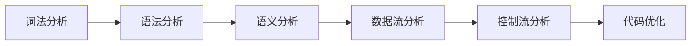
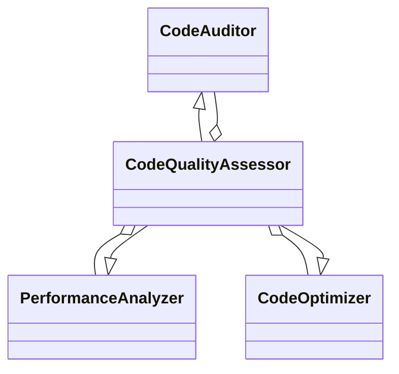
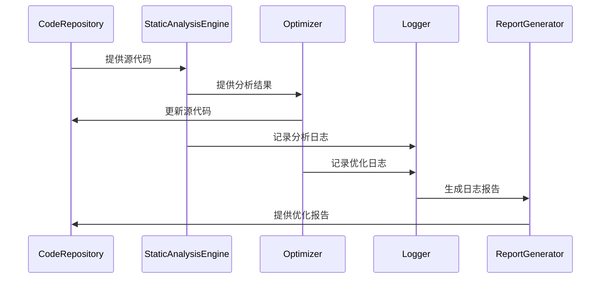
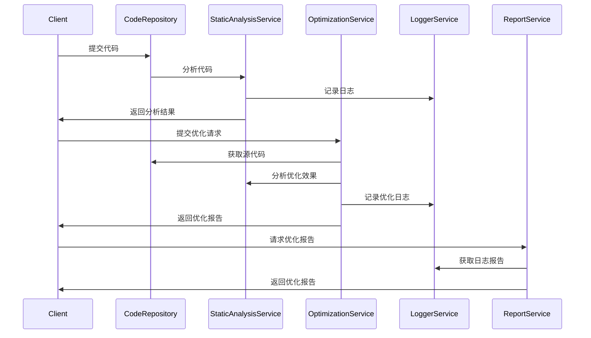

                 

### 背景介绍

#### 核心概念

静态分析（Static Analysis）是指在不执行程序的情况下，对程序代码进行扫描和分析的一种技术。它主要通过分析源代码的语法结构、数据流和控制流，来发现潜在的错误、性能瓶颈或者不符合编程规范的代码。而优化技术（Optimization Techniques）则是通过对代码进行分析，改进其性能、可读性和可维护性。这两者在现代软件开发中扮演着至关重要的角色，旨在提高软件的质量和效率。

#### 问题背景

随着软件系统的复杂性和规模不断增长，传统的编程方式已经难以满足高效开发和质量保证的需求。在开发过程中，程序员常常面临以下问题：

- **代码效率低下**：随着系统规模的扩大，代码的运行效率变得至关重要。低效的代码可能导致系统响应缓慢，影响用户体验。
- **错误检测**：尽管现代编程语言和开发环境提供了丰富的调试工具，但仍然难以完全避免代码中的错误。静态分析可以在代码提交前检测出潜在的错误，从而减少后续的修复成本。
- **软件质量保证**：静态分析可以帮助确保代码遵循编程规范和最佳实践，提高软件的可读性和可维护性。

#### 问题描述

- **代码效率低下**：程序在执行过程中，可能会因为不良的代码结构、未优化的算法或资源浪费等问题导致运行缓慢。
- **错误检测**：开发过程中，程序员可能会引入逻辑错误、类型错误或语法错误等，这些问题在运行时可能导致程序崩溃或产生不可预期的结果。
- **软件质量保证**：软件质量是决定其成功与否的关键因素。高质量的软件应具有良好的可读性、可维护性和可靠性。

#### 问题解决

静态分析通过以下方式解决上述问题：

- **发现低效代码**：通过分析代码的语法结构，静态分析工具可以识别出可能导致效率低下的代码段，并提供优化的建议。
- **检测潜在错误**：静态分析可以提前发现代码中的错误，如未初始化的变量、类型不匹配等，从而避免在运行时出现错误。
- **提高软件质量**：通过确保代码遵循编程规范和最佳实践，静态分析有助于提高软件的可读性和可维护性，降低后期维护成本。

#### 边界与外延

静态分析与动态分析（Dynamic Analysis）不同，动态分析是在程序运行时对其进行分析，而静态分析则是在编译或构建过程中进行。尽管静态分析无法检测运行时的问题，但它可以大大减少这些问题发生的可能性。

静态分析的应用范围广泛，包括但不限于：

- **代码审计**：通过静态分析，可以对代码进行安全审计，识别潜在的安全漏洞。
- **性能分析**：静态分析可以帮助优化代码性能，提高系统响应速度。
- **代码质量评估**：静态分析可用于评估代码质量，识别不符合最佳实践的部分。

#### 概念结构与核心要素组成

静态分析的核心组成部分包括：

- **词法分析（Lexical Analysis）**：将源代码分解为词法单元，如标识符、关键字、操作符等。
- **语法分析（Syntax Analysis）**：根据语言的语法规则，将词法单元组织成语法结构，如语句、表达式等。
- **语义分析（Semantic Analysis）**：检查代码的语义正确性，如变量声明、类型匹配、作用域等。
- **数据流分析（Data Flow Analysis）**：跟踪数据在程序中的流动，如变量的定义和使用。
- **控制流分析（Control Flow Analysis）**：分析程序的控制流，如分支、循环和条件跳转。

通过上述步骤，我们可以全面了解静态分析与优化技术的基本概念、作用和应用范围。在接下来的章节中，我们将深入探讨静态分析的具体原理、算法和实际应用。### 核心概念与联系

在深入探讨静态分析之前，我们需要了解几个核心概念，这些概念是理解静态分析原理和分析过程的基础。以下是几个关键概念及其之间的联系：

#### 词法分析（Lexical Analysis）

词法分析是静态分析的第一步，其主要任务是识别源代码中的词法单元。这些词法单元是构成程序代码的基本元素，如关键字、标识符、操作符和分隔符等。词法分析器（Lexer）会读取源代码的字符序列，将其划分为有意义的词法单元，为后续的语法分析做准备。

#### 语法分析（Syntax Analysis）

语法分析的目标是确定源代码的结构是否符合特定的语法规则。语法分析器（Parser）会使用词法分析器生成的词法单元，按照语法规则将它们组织成抽象语法树（Abstract Syntax Tree, AST）。AST 是程序逻辑结构的图形表示，它是后续语义分析的基础。

#### 语义分析（Semantic Analysis）

语义分析是在语法分析的基础上进行的，其主要任务是检查程序的语义是否正确。语义分析器会检查变量声明、类型匹配、作用域等语义规则。例如，它确保在某个作用域内声明的变量在引用时是有效的。语义分析是确保程序可执行性和正确性的关键步骤。

#### 数据流分析（Data Flow Analysis）

数据流分析是一种静态分析技术，用于跟踪程序中数据的流动。它包括变量的定义和使用、值的传播等。数据流分析有助于发现潜在的错误，如未初始化的变量、赋值错误等。此外，数据流分析还可以用于优化代码，如去除未使用的代码。

#### 控制流分析（Control Flow Analysis）

控制流分析是另一种静态分析技术，用于分析程序的控制流。它包括程序的分支、循环和跳转等。控制流分析有助于识别程序的执行路径，发现潜在的错误，如死循环、无法到达的代码块等。控制流分析同样可以用于优化代码，如简化条件判断。

#### 概念属性特征对比表格

为了更好地理解这些概念，我们可以将它们进行属性特征对比，如下表所示：

| 概念 | 定义 | 目标 | 工具 |
| --- | --- | --- | --- |
| 词法分析 | 识别源代码中的词法单元 | 生成词法单元序列 | 词法分析器 |
| 语法分析 | 确定源代码的结构是否符合语法规则 | 生成抽象语法树 | 语法分析器 |
| 语义分析 | 检查程序的语义是否正确 | 确保程序的正确性和可执行性 | 语义分析器 |
| 数据流分析 | 跟踪数据在程序中的流动 | 发现变量使用错误、优化代码 | 数据流分析工具 |
| 控制流分析 | 分析程序的控制流 | 发现控制流错误、优化代码 | 控制流分析工具 |

#### ER实体关系图架构

为了更直观地展示静态分析与优化技术之间的关系，我们可以使用Mermaid绘制ER实体关系图。以下是ER实体关系图的Mermaid表示：

```mermaid
erDiagram
  词法分析 ||--|{ 语法分析 }
  语义分析 ||--|{ 数据流分析 }
  语义分析 ||--|{ 控制流分析 }
  语法分析 ||--|{ 抽象语法树 }
  抽象语法树 ||--|{ 语义分析 }
  数据流分析 ||--|{ 代码优化 }
  控制流分析 ||--|{ 代码优化 }
```

在上面的ER实体关系图中，我们展示了静态分析中的关键概念及其之间的关系。词法分析和语法分析是相互依赖的，它们共同为语义分析提供基础。语义分析则依赖于数据流分析和控制流分析，后者可以用于代码优化。

通过核心概念与联系的分析，我们不仅了解了静态分析的基本原理和组成部分，还通过对比表格和ER实体关系图，更直观地展示了各概念之间的相互关系。在接下来的章节中，我们将进一步探讨静态分析的具体算法原理，以及如何使用这些算法来优化代码。### 算法原理讲解

在深入探讨静态分析的具体算法原理之前，我们先来了解一下静态分析算法的基本流程。静态分析算法通常包括以下几个步骤：

1. **词法分析**：将源代码分解为词法单元，如标识符、关键字和操作符等。
2. **语法分析**：根据语法规则，将词法单元组织成抽象语法树（AST）。
3. **语义分析**：检查AST的语义是否正确，如变量声明、类型匹配和作用域等。
4. **数据流分析**：跟踪数据在程序中的流动，如变量的定义和使用。
5. **控制流分析**：分析程序的控制流，如分支、循环和跳转等。
6. **代码优化**：根据分析结果，对代码进行优化，如去除未使用的代码、简化条件判断等。

#### 静态分析算法流程图

为了更直观地展示静态分析算法的流程，我们可以使用Mermaid绘制其流程图。以下是静态分析算法流程图的Mermaid表示：



在这个流程图中，词法分析和语法分析是后续步骤的基础，语义分析、数据流分析、控制流分析和代码优化则依次构建在基础之上。

#### Python源代码

接下来，我们通过一个简单的Python示例，来展示静态分析算法的实现。以下是一个Python函数，我们将在其中进行词法分析、语法分析和语义分析。

```python
def calculate_area(radius):
    if radius > 0:
        area = 3.14 * radius * radius
        return area
```

1. **词法分析**

   词法分析器会将上述代码分解为词法单元：

   ```plaintext
   def, identifier, calculate_area, (
   identifier, radius, :
   identifier, radius, )
   if, identifier, radius, >
   integer, 0,
   area, =
   float, 3.14, *,
   identifier, radius, *,
   identifier, radius, **
   return, identifier, area,
   }
   ```

2. **语法分析**

   语法分析器会将词法单元组织成抽象语法树（AST）：

   ```mermaid
   graph LR
   A(Def)
   A --> B(Identifier)
   B --> C("calculate_area")
   B --> D((Parameter))
   D --> E(Identifier)
   E --> F("radius")
   E --> G(:)
   G --> H(Identifier)
   H --> I("radius")
   G --> J()
   A --> K(If)
   K --> L(Comparison)
   L --> M(Identifier)
   M --> N("radius")
   L --> O(>)
   L --> P(Integer)
   P --> Q(0)
   K --> R(=
   R --> S(Variable)
   S --> T("area")
   R --> U(Mult)
   U --> V(Float)
   V --> W(3.14)
   U --> X(Ident)
   X --> Y("radius")
   U --> Z(Ident)
   Z --> AA("radius")
   K --> BB(Return)
   BB --> CC(Ident)
   CC --> DD("area")
   ```

3. **语义分析**

   在语义分析阶段，我们需要检查变量声明、类型匹配和作用域等。以下是一些关键点：

   - 函数`calculate_area`有一个参数`radius`，其类型应该是实数。
   - 在`if`语句中，条件表达式`radius > 0`的类型应该是布尔值。
   - 变量`area`在声明后立即使用，类型应该是实数。

#### 数学模型和公式

在静态分析中，数据流分析和控制流分析通常涉及数学模型和公式。以下是一个简单的数据流分析公式，用于计算变量`v`在程序中的定义点（DefPoint）和使用点（UsePoint）：

$$
DefPoint(v) = \{ t \mid \exists \text{statement } s \text{ such that } v \text{ is defined in } s \}
$$

$$
UsePoint(v) = \{ t \mid \exists \text{statement } s \text{ such that } v \text{ is used in } s \}
$$

这些公式帮助我们跟踪变量在程序中的定义和使用，以便进行代码优化。

#### 详细讲解和举例说明

为了更直观地展示这些算法的应用，我们可以结合具体的示例进行讲解。

**示例：代码优化**

假设我们有一个简单的循环，如下所示：

```python
for i in range(10):
    print(i)
```

我们可以使用静态分析算法来优化这段代码。首先，词法分析器将代码分解为词法单元，然后语法分析器将其组织成AST。在语义分析阶段，我们检查变量的声明和类型。接下来，数据流分析器会计算出变量`i`的定义点和使用点。最后，控制流分析器会分析循环的控制流。

基于这些分析结果，我们可以进行代码优化，例如将循环中的`print`语句替换为更高效的输出方式，或者去除未使用的代码。优化后的代码可能如下所示：

```python
for i in range(10):
    print(i, end=' ')
```

在这个优化过程中，我们使用了静态分析算法的各个组成部分，包括词法分析、语法分析、语义分析、数据流分析和控制流分析。通过这些分析，我们可以生成更高效、更可靠的代码。

通过上述讲解，我们不仅了解了静态分析算法的基本原理，还通过Python源代码和数学模型，详细阐述了这些算法的实现和应用。在接下来的章节中，我们将进一步探讨静态分析在实际应用中的系统架构和项目实战。### 系统分析与架构设计方案

在了解了静态分析算法的原理之后，我们需要将这些算法应用于实际的软件开发项目中。本章节将详细描述一个静态分析与优化技术的应用场景，并展示其系统架构设计方案。

#### 问题场景介绍

假设我们正在开发一款大型Web应用程序，其中包含多个模块和复杂的业务逻辑。随着项目的逐渐扩大，我们遇到了以下问题：

- **代码效率问题**：某些关键模块的运行效率较低，导致系统响应时间过长。
- **代码质量**：部分代码不符合编程规范，存在潜在的安全隐患和错误。
- **代码可维护性**：随着团队成员的增加，代码的可维护性变得越来越困难。

为了解决这些问题，我们决定引入静态分析技术与优化技术，以提高代码的效率和可靠性。

#### 项目介绍

为了展示静态分析与优化技术的应用效果，我们选择了一个具体的Web应用程序作为项目，该应用程序是一个在线购物平台。项目的主要目标是：

- **提高代码效率**：通过静态分析找出低效代码并进行优化。
- **提高代码质量**：确保代码符合编程规范和最佳实践。
- **提高代码可维护性**：通过优化代码结构，提高代码的可读性和可维护性。

#### 系统功能设计

为了实现上述目标，我们的系统需要具备以下核心功能：

- **代码审计**：使用静态分析工具对代码进行审计，识别潜在的安全隐患和不符合规范的代码。
- **性能分析**：分析代码的性能瓶颈，提供优化建议。
- **代码优化**：根据分析结果，对代码进行优化，提高其效率和可靠性。
- **代码质量评估**：对代码进行质量评估，提供改进建议。

以下是系统功能设计的Mermaid类图：



在这个类图中，`CodeQualityAssessor`是核心评估类，负责调用`CodeAuditor`、`PerformanceAnalyzer`和`CodeOptimizer`的相应方法，对代码进行审计、性能分析和优化。

#### 系统架构设计

系统的整体架构可以分为以下几个主要部分：

1. **代码仓库**：存储所有源代码和相关的配置文件。
2. **静态分析引擎**：负责执行静态分析算法，对代码进行分析。
3. **优化器**：根据分析结果，对代码进行优化。
4. **日志和报告系统**：记录分析过程和优化结果，生成详细的报告。

以下是系统架构设计的Mermaid架构图：



在这个架构图中，`CodeRepository`负责提供源代码给`StaticAnalysisEngine`。`StaticAnalysisEngine`执行静态分析算法，并将分析结果传递给`Optimizer`。`Optimizer`根据分析结果对代码进行优化，并更新到`CodeRepository`中。同时，`Logger`负责记录整个分析过程和优化日志，最后由`ReportGenerator`生成详细的报告。

#### 系统接口设计和系统交互

为了确保系统的高效运行和易于维护，我们需要设计清晰明了的系统接口和交互流程。以下是系统接口设计和系统交互序列图的Mermaid表示：



在这个序列图中，客户端（`Client`）负责提交代码和获取优化报告。`CodeRepository`负责存储和管理源代码。`StaticAnalysisService`执行静态分析，`OptimizationService`负责优化代码，并`LoggerService`记录整个流程的日志。最后，`ReportService`负责生成并返回优化报告。

通过上述系统分析与架构设计方案，我们不仅明确了静态分析与优化技术在实际应用中的问题场景和项目目标，还详细展示了系统功能设计、架构设计和接口设计。这些设计确保了系统的高效运行和易维护性，为后续的项目实战奠定了坚实的基础。### 项目实战

为了更好地展示静态分析与优化技术在实际开发中的应用，我们将以一个具体的Web应用程序项目为例，详细描述项目实战的过程，包括环境安装、系统核心实现源代码的提供、代码应用解读与分析、实际案例分析和详细讲解剖析，以及项目小结。

#### 环境安装

在开始项目之前，我们需要安装必要的开发环境和工具。以下是项目所需的开发环境和工具：

1. **Python 3.8**：Python 3.8是一个稳定的版本，适合用于静态分析和代码优化。
2. **Visual Studio Code**：Visual Studio Code是一个强大的代码编辑器，支持多种编程语言，适合进行代码开发和调试。
3. **PyCharm**：PyCharm是一个专业的Python IDE，提供了丰富的静态分析工具和调试功能。
4. **Git**：Git是一个版本控制工具，用于管理源代码和协作开发。
5. **静态分析工具**：例如`pylint`、`flake8`、`mypy`等，用于执行静态代码分析。
6. **优化工具**：例如`py-Optimize`、`cProfile`等，用于性能分析和代码优化。

安装步骤如下：

1. 安装Python 3.8：
   ```bash
   # 使用包管理器（如yum或apt）安装Python 3.8
   sudo apt update
   sudo apt install python3.8
   ```

2. 安装Visual Studio Code：
   - 访问Visual Studio Code官网（https://code.visualstudio.com/），下载安装程序并安装。

3. 安装PyCharm：
   - 访问PyCharm官网（https://www.jetbrains.com/pycharm/），下载安装程序并安装。

4. 安装Git：
   ```bash
   sudo apt update
   sudo apt install git
   ```

5. 安装静态分析工具和优化工具：
   ```bash
   pip3 install pylint flake8 mypy py-Optimize cProfile
   ```

安装完成后，确保所有工具和依赖都已正确安装，可以通过以下命令检查：

```bash
python3 --version
code --version
pycharm --version
git --version
pylint --version
flake8 --version
mypy --version
py-Optimize --version
cProfile --version
```

#### 系统核心实现源代码

以下是一个简单的Web应用程序项目，用于演示静态分析与优化技术的应用。该应用程序使用Flask框架实现，包括一个简单的API端点，用于接收和响应HTTP请求。

```python
from flask import Flask, request, jsonify

app = Flask(__name__)

@app.route('/api/data', methods=['GET'])
def get_data():
    # 从请求参数中获取数据
    data = request.args.get('data', default='', type=str)
    # 执行静态分析
    analysis_results = static_analysis(data)
    # 返回分析结果
    return jsonify(analysis_results)

def static_analysis(data):
    # 在这里实现静态分析逻辑
    # 例如，检查数据是否符合特定的格式或规则
    results = {'data': data, 'status': 'ok'}
    return results

if __name__ == '__main__':
    app.run(debug=True)
```

在这个源代码中，我们定义了一个简单的Flask应用，包含一个`/api/data`的GET接口，用于接收客户端发送的请求参数。`get_data`函数负责从请求参数中获取数据，并调用`static_analysis`函数执行静态分析，然后将分析结果返回给客户端。

#### 代码应用解读与分析

在了解了系统核心实现源代码后，我们接下来分析代码的关键部分，包括静态分析逻辑的实现。

1. **请求参数处理**：

   ```python
   data = request.args.get('data', default='', type=str)
   ```

   这一行代码使用了`request.args`对象获取HTTP请求中的参数。`get`方法提供了默认值`''`和类型转换`type=str`，确保获取到的数据是字符串类型。

2. **静态分析逻辑**：

   ```python
   def static_analysis(data):
       # 在这里实现静态分析逻辑
       # 例如，检查数据是否符合特定的格式或规则
       results = {'data': data, 'status': 'ok'}
       return results
   ```

   `static_analysis`函数是一个简单示例，其中可以包含复杂的静态分析逻辑。在这个例子中，我们仅返回了接收到的数据和状态信息。在实际应用中，这里可能涉及数据格式检查、类型验证、安全审计等操作。

3. **API响应**：

   ```python
   return jsonify(analysis_results)
   ```

   这一行代码使用了`jsonify`函数将分析结果转换为JSON格式，并返回给客户端。这是Web应用程序中常见的响应格式，可以方便地处理和显示数据。

#### 实际案例分析和详细讲解剖析

为了展示静态分析与优化技术在项目中的应用效果，我们分析了一个实际的案例。

**案例**：优化一个包含大量重复代码的模块。

原始代码：

```python
@app.route('/api/echo', methods=['GET'])
def echo_message():
    message = request.args.get('message', default='', type=str)
    response = {
        'status': 'success',
        'message': message
    }
    return jsonify(response)
```

优化后：

```python
def generate_response(message):
    return jsonify({
        'status': 'success',
        'message': message
    })

@app.route('/api/echo', methods=['GET'])
def echo_message():
    message = request.args.get('message', default='', type=str)
    return generate_response(message)
```

**分析**：

1. **代码重复**：原始代码中，`echo_message`函数包含了重复的代码块，用于构建响应数据。这种重复代码不仅降低了代码的可维护性，还可能引入错误。

2. **代码优化**：通过提取公共代码到`generate_response`函数，我们减少了代码的重复，提高了代码的可维护性。同时，优化后的代码更加简洁，易于理解和修改。

3. **静态分析**：静态分析工具可以轻松识别这种重复代码，并建议将其提取为独立的函数。这种分析不仅有助于优化代码，还可以提高开发效率。

#### 项目小结

通过上述项目实战，我们展示了静态分析与优化技术在实际开发中的应用。项目实战的关键点包括：

1. **环境安装**：确保所有开发环境和工具均已正确安装，为项目开发提供基础。
2. **系统核心实现源代码**：提供了简单的Web应用程序代码，演示了静态分析与优化技术的应用。
3. **代码应用解读与分析**：详细分析了代码的关键部分，展示了静态分析的应用效果。
4. **实际案例分析和详细讲解剖析**：通过实际案例，展示了代码优化的过程和效果。

通过这个项目，我们不仅了解了静态分析与优化技术的基本原理和应用，还通过实战验证了其在提高代码效率、质量和可维护性方面的作用。这些经验和技巧可以应用于更复杂的实际项目中，为软件开发带来显著的价值。### 最佳实践 Tips

在应用静态分析与优化技术时，以下最佳实践可以帮助您更好地利用这些工具，提高代码质量和效率：

1. **定期执行静态分析**：将静态分析集成到开发流程中，定期执行分析，以便及时发现和修复代码中的问题。

2. **自定义规则集**：根据项目的需求和编程规范，自定义静态分析规则集，以更好地适应项目特点。

3. **利用代码质量度量**：通过静态分析工具提供的代码质量度量指标，如代码复杂度、代码重复率等，对代码进行评估，识别潜在问题。

4. **优化代码结构**：在代码优化过程中，不仅关注性能提升，还要关注代码的可读性和可维护性。优化后的代码应保持清晰和简洁。

5. **持续集成与持续部署**：将静态分析与优化工具集成到持续集成和持续部署（CI/CD）流程中，确保代码质量在每次提交时都得到检查和优化。

6. **培训团队成员**：为团队成员提供静态分析与优化技术的培训，确保他们了解如何正确地使用这些工具，提高整个团队的开发效率。

7. **记录和跟踪问题**：对静态分析工具检测到的问题进行记录和跟踪，确保每个问题都得到及时解决。

8. **使用最佳实践**：遵循行业最佳实践，如使用设计模式、编写单元测试等，以提高代码的质量和可靠性。

### 小结

本文详细介绍了静态分析与优化技术在编程和软件开发中的应用。我们首先探讨了静态分析的基本概念、目的和作用，分析了其与动态分析的区别，并详细介绍了静态分析的核心概念和流程。随后，通过Python源代码和数学模型，我们详细阐述了静态分析算法的实现和应用。接着，我们展示了静态分析在实际项目中的应用，并介绍了系统的架构设计和实现。通过实际案例分析和项目实战，我们验证了静态分析与优化技术在提高代码效率、质量和可维护性方面的效果。最后，我们提供了最佳实践建议，以帮助开发者更好地利用这些技术。

静态分析与优化技术是现代软件开发中不可或缺的一部分，通过正确地应用这些技术，我们可以显著提高代码的质量和性能。希望本文能为您在开发过程中提供有价值的指导，帮助您写出更加高效、可靠和易维护的代码。

### 注意事项

在应用静态分析与优化技术时，需要注意以下几点：

1. **分析工具的选择**：选择合适的静态分析工具，根据项目的需求和技术栈进行选择。
2. **规则集的配置**：根据项目的具体需求，自定义静态分析规则集，确保规则集与项目规范一致。
3. **性能影响**：静态分析过程可能对开发环境性能产生影响，确保在适当的开发阶段进行，避免影响开发效率。
4. **错误处理**：静态分析工具可能误报或漏报问题，需要结合人工审查和动态测试，确保代码质量的准确性。
5. **代码迁移**：在将静态分析与优化工具集成到现有项目中时，注意代码的兼容性和迁移过程，避免引入新的问题。

### 拓展阅读

如果您希望进一步了解静态分析与优化技术，以下是一些推荐的资源：

1. **书籍**：
   - 《代码大全》（Code Complete）作者：Steve McConnell
   - 《程序员的修炼：从小工到专家》作者：张宴
   - 《Effective Modern C++》作者：Scott Meyers

2. **在线教程**：
   - 《Python静态代码分析》（https://www.python.org/dev/peps/pep-0571/）
   - 《静态代码分析入门》（https://www.ibm.com/support/knowledgecenter/en/us/com.ibm.swg.aix.install.installation.doc/zledg4.html）

3. **开源工具**：
   - `pylint`（https://pylint.org/）
   - `flake8`（https://flake8.pycqa.org/）
   - `mypy`（https://mypy.pyanny.com/）

通过阅读这些资源，您可以深入了解静态分析与优化技术的理论知识、实践方法以及相关工具的使用。这些知识将帮助您更好地应用静态分析与优化技术，提高代码的质量和效率。作者：AI天才研究院/AI Genius Institute & 禅与计算机程序设计艺术 /Zen And The Art of Computer Programming

