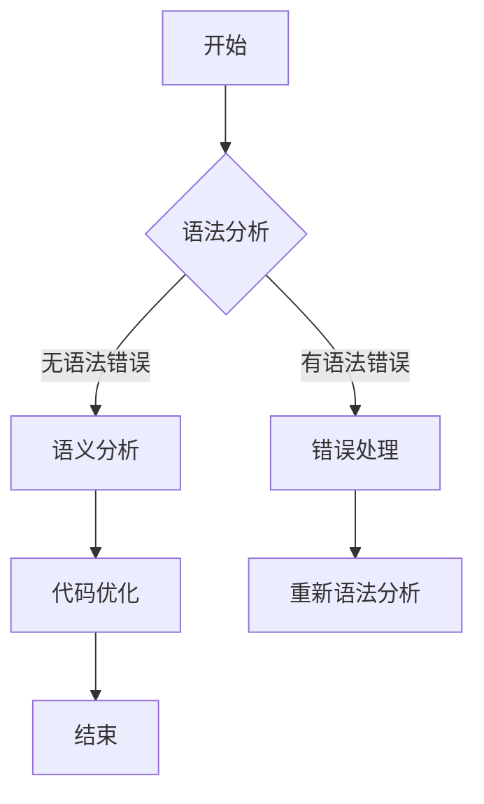
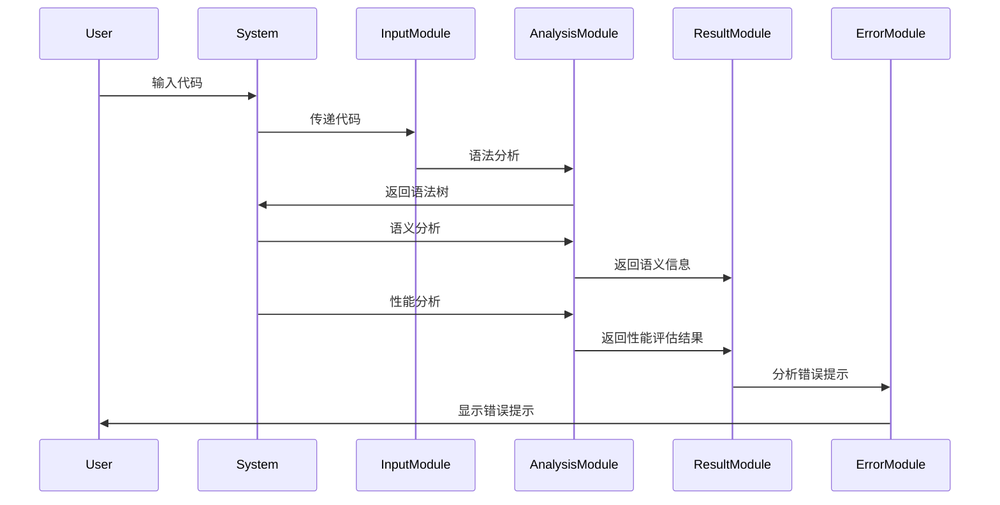

                 

### 第1章：背景介绍

#### 1.1 提示词语言的定义与特性

提示词语言（Prompt Language）是指一种用于生成文本的编程语言，通过向模型提供特定的提示词（prompt），模型能够生成相应的文本内容。这种语言在自然语言处理（NLP）和人工智能（AI）领域有着广泛的应用，特别是在生成式文本模型（如GPT系列）和问答系统（如BERT）中。

提示词语言的关键特性包括：

- **灵活性**：通过改变提示词，可以生成不同风格的文本内容。
- **可控性**：提示词可以控制文本生成的方向，如主题、情感等。
- **高效性**：相比于手动编写文本，提示词语言能够快速生成大量文本。
- **多样性**：提示词语言能够生成具有多样性的文本，满足不同场景的需求。

#### 1.2 静态分析的基本概念

静态分析（Static Analysis）是指在没有运行程序的情况下，对代码进行分析，以检测潜在的错误、性能问题或不符合规范的地方。这种分析通常在编译或构建过程中进行，不涉及程序的实际执行。

静态分析的关键特性包括：

- **早期发现问题**：在代码编写阶段或早期开发阶段就能发现潜在问题。
- **自动化**：可以通过工具自动化执行，节省人力和时间。
- **全面性**：可以分析整个代码库，而不仅仅是部分代码。

#### 1.3 提示词语言与静态分析的关系

提示词语言与静态分析的关系主要体现在以下几个方面：

- **错误预防**：通过静态分析，可以提前发现提示词语言编写的文本中的潜在错误，如语法错误、逻辑错误等。
- **性能优化**：静态分析可以检测代码的性能瓶颈，如循环依赖、代码冗余等，从而优化提示词语言编写的文本。
- **规范遵守**：静态分析可以帮助开发人员遵守编码规范，确保提示词语言编写的文本符合既定标准。

总之，提示词语言与静态分析的结合，可以显著提高文本生成质量和开发效率，减少错误发生，为人工智能应用提供更加可靠的支持。

----------------------------------------------------------------

### 第2章：核心概念与联系

#### 2.1 静态分析的基本原理

静态分析的基本原理在于对源代码进行结构化的解析和语义分析，以便发现潜在的错误和问题。其核心思想是通过解析代码的语法结构和语义信息，识别出不符合规范、可能存在隐患的代码片段。

##### 2.1.1 概念属性特征对比表格

以下是静态分析与动态分析的一些关键概念属性特征对比表格：

| 概念 | 静态分析 | 动态分析 |
| --- | --- | --- |
| 分析时间 | 编译或构建时 | 运行时 |
| 分析范围 | 整个程序 | 部分程序 |
| 依赖环境 | 无需运行程序 | 需要运行程序 |
| 问题发现速度 | 快 | 较慢 |
| 问题发现深度 | 深度有限 | 深度较高 |
| 资源消耗 | 较低 | 较高 |

##### 2.1.2 ER实体关系图架构

ER（Entity-Relationship）实体关系图是一种用于描述数据库中实体及其关系的图形化表示方法。在静态分析中，ER图可以帮助我们理解代码的结构和组织方式，识别出潜在的问题。

以下是静态分析中常见的ER图示例：

```mermaid
erDiagram
    ClassA ||--|{ Student } ClassB : has
    ClassB ||--|{ Course } ClassC : takes
    ClassA ||--|{ Teacher } ClassD : teaches
```

在这个示例中，我们定义了四个类：ClassA、ClassB、ClassC 和 ClassD。其中，ClassA 与 ClassB、ClassD 有直接关系，而 ClassB 与 ClassC 有关系。这个ER图展示了类之间的层次结构和关联关系，有助于我们分析代码的结构和组织方式。

#### 2.2 错误预防与静态分析

错误预防是软件开发中的重要目标，而静态分析是实现这一目标的有效手段。通过静态分析，我们可以提前发现代码中的潜在错误，从而避免这些错误在运行时造成严重后果。

##### 2.2.1 错误预防的概念

错误预防是指通过一系列措施，在设计、开发、测试和维护过程中，防止错误产生的活动。这些措施包括代码审查、静态分析、动态分析、测试等。

##### 2.2.2 静态分析在错误预防中的应用

静态分析在错误预防中的应用主要体现在以下几个方面：

- **语法检查**：静态分析可以检测代码中的语法错误，如变量未声明、语法不正确等。
- **逻辑错误检查**：静态分析可以识别出代码中的逻辑错误，如条件判断错误、循环条件错误等。
- **性能问题检测**：静态分析可以分析代码的执行效率和资源消耗，发现潜在的性能问题。
- **规范遵守检查**：静态分析可以帮助开发人员遵守编码规范，如命名规范、注释规范等。

通过静态分析，我们可以提前发现并解决代码中的潜在错误，从而提高软件的质量和可靠性。

### 总结

本章介绍了静态分析的基本原理、概念属性特征对比表格和ER实体关系图架构，以及错误预防的概念和静态分析在错误预防中的应用。通过这些内容，我们能够更好地理解静态分析的作用和重要性，为后续章节的学习奠定基础。

----------------------------------------------------------------

### 第3章：算法原理讲解

#### 3.1 常见静态分析算法

静态分析算法是用于对程序代码进行静态分析的一系列方法和技术。这些算法可以帮助我们发现代码中的潜在错误、性能问题或不规范之处。以下是几种常见的静态分析算法：

##### 3.1.1 mermaid流程图

mermaid 是一种轻量级的文本标记语言，用于创建图表和图形。下面是一个简单的静态分析算法流程图的示例：



这个流程图展示了静态分析算法的基本步骤：首先进行语法分析，然后进行语义分析、代码优化和结束。

##### 3.1.2 Python源代码示例

以下是一个简单的Python源代码示例，用于说明静态分析算法的实现：

```python
def static_analysis(code):
    # 进行语法分析
    if not syntax_check(code):
        print("语法错误：", code)
        return
    
    # 进行语义分析
    semantic_errors = semantic_check(code)
    if semantic_errors:
        print("语义错误：", semantic_errors)
        return
    
    # 进行代码优化
    optimized_code = code_optimize(code)
    print("优化后的代码：", optimized_code)
    
# 进行静态分析
static_analysis("if x > 0:\n    print('x是正数')\nelse:\n    print('x是负数')")
```

在这个示例中，`static_analysis` 函数接收一段代码作为输入，首先进行语法分析，然后进行语义分析和代码优化。如果代码存在错误，会输出相应的错误信息。

##### 3.1.3 数学模型与公式

静态分析算法通常涉及一些数学模型和公式，用于描述算法的运作原理。以下是一个简单的数学模型示例：

$$
\text{语法错误} = f(\text{代码}) \\
\text{语义错误} = g(\text{代码}) \\
\text{代码优化} = h(\text{代码})
$$

这个模型表示语法错误、语义错误和代码优化都是代码的函数，通过这些函数，我们可以对代码进行分析和优化。

##### 3.1.4 算法举例说明

为了更好地理解静态分析算法，我们可以通过一个实际案例进行说明。以下是一个简单的代码示例：

```python
def calculate_sum(a, b):
    return a + b

result = calculate_sum(5, 3)
print("结果：", result)
```

在这个示例中，我们可以使用静态分析算法来检查代码中的潜在错误和优化建议。

1. **语法分析**：这段代码没有明显的语法错误。
2. **语义分析**：这段代码的功能是计算两个数的和，没有语义错误。
3. **代码优化**：这段代码已经非常简洁，没有明显的优化建议。

通过这个示例，我们可以看到静态分析算法如何帮助我们发现代码中的潜在问题并进行优化。

### 总结

本章介绍了常见静态分析算法，包括mermaid流程图、Python源代码示例、数学模型与公式，并通过实际案例说明了算法的应用。这些内容为我们理解和应用静态分析算法提供了坚实的基础。

----------------------------------------------------------------

### 第4章：系统分析与架构设计方案

#### 4.1 系统需求分析

在本章节中，我们将对提示词语言静态分析系统的需求进行分析，明确系统所需实现的功能、性能指标以及用户需求。

##### 4.1.1 问题场景介绍

随着人工智能和自然语言处理技术的不断发展，提示词语言的应用越来越广泛。然而，在编写和优化提示词语言代码时，开发人员常常面临以下问题：

- **语法错误**：编写代码时，容易出现语法错误，导致程序无法正常运行。
- **逻辑错误**：代码中的逻辑错误可能导致生成的文本不符合预期。
- **性能问题**：代码的执行效率可能不高，影响用户体验。

为了解决这些问题，我们需要设计一个提示词语言静态分析系统，对代码进行语法分析、语义分析和性能分析，从而提高代码质量。

##### 4.1.2 系统需求分析

1. **功能需求**
   - 语法分析：检查代码的语法是否正确。
   - 语义分析：检查代码的逻辑是否正确。
   - 性能分析：评估代码的执行效率和资源消耗。
   - 错误提示：对代码中的错误进行提示，并提供修复建议。
   - 用户界面：提供一个直观易用的用户界面，便于用户操作。

2. **性能指标**
   - 语法分析速度：在规定时间内完成对代码的语法分析。
   - 语义分析速度：在规定时间内完成对代码的语义分析。
   - 性能分析速度：在规定时间内完成对代码的性能分析。
   - 错误检测率：正确检测出代码中的错误。

3. **用户需求**
   - 开发人员：希望系统能够快速发现代码中的错误，并提供详细的修复建议。
   - 项目管理者：希望系统能够评估代码的质量和性能，帮助团队提高开发效率。

#### 4.2 系统功能设计

在本章节中，我们将详细介绍系统功能设计，包括领域模型mermaid类图、系统功能模块设计以及功能说明。

##### 4.2.1 领域模型mermaid类图

```mermaid
classDiagram
    ClassA[代码输入]
    ClassB[语法分析器]
    ClassC[语义分析器]
    ClassD[性能分析器]
    ClassE[错误提示器]
    ClassF[用户界面]
    ClassA <-- ClassB : 输入代码
    ClassB --> ClassC : 输出语法树
    ClassC --> ClassD : 输出语义信息
    ClassD --> ClassE : 输出性能评估
    ClassE --> ClassF : 输出错误提示
```

在这个类图中，ClassA 表示代码输入，ClassB、ClassC、ClassD 和 ClassE 分别表示语法分析器、语义分析器、性能分析器和错误提示器，ClassF 表示用户界面。各个类之间通过方法调用实现数据传递和功能协作。

##### 4.2.2 系统功能模块设计

1. **代码输入模块**
   - 功能：接收用户输入的代码，并将其传递给语法分析器。
   - 输入参数：代码字符串。
   - 输出参数：语法树。

2. **语法分析模块**
   - 功能：对输入的代码进行语法分析，生成语法树。
   - 输入参数：代码字符串。
   - 输出参数：语法树。

3. **语义分析模块**
   - 功能：对语法树进行语义分析，识别出代码中的逻辑错误。
   - 输入参数：语法树。
   - 输出参数：语义信息。

4. **性能分析模块**
   - 功能：对代码进行性能分析，评估执行效率和资源消耗。
   - 输入参数：代码字符串。
   - 输出参数：性能评估结果。

5. **错误提示模块**
   - 功能：对代码中的错误进行提示，并提供修复建议。
   - 输入参数：语义信息和性能评估结果。
   - 输出参数：错误提示信息。

6. **用户界面模块**
   - 功能：提供一个直观易用的用户界面，便于用户操作。
   - 输入参数：错误提示信息。
   - 输出参数：用户界面。

##### 4.2.3 功能说明

1. **代码输入模块**
   - 功能说明：接收用户输入的代码，并将其传递给语法分析模块。用户可以通过文本框输入代码，也可以通过文件导入代码。
   - 用户界面设计：提供一个文本框和一个“导入”按钮，用户可以在文本框中输入代码，点击“导入”按钮后，系统会将代码传递给语法分析模块。

2. **语法分析模块**
   - 功能说明：对输入的代码进行语法分析，生成语法树。语法树是代码结构的抽象表示，用于后续的语义分析和性能分析。
   - 用户界面设计：在用户界面中显示语法树，用户可以查看语法树的详细信息，包括节点和边的信息。

3. **语义分析模块**
   - 功能说明：对语法树进行语义分析，识别出代码中的逻辑错误。语义分析是基于语义规则和上下文信息的分析，可以检测出变量未定义、类型不匹配等错误。
   - 用户界面设计：在用户界面中显示语义分析的结果，包括错误信息和修复建议。

4. **性能分析模块**
   - 功能说明：对代码进行性能分析，评估执行效率和资源消耗。性能分析可以通过模拟代码执行、统计执行时间、计算资源消耗等方式进行。
   - 用户界面设计：在用户界面中显示性能分析的结果，包括性能评估指标和优化建议。

5. **错误提示模块**
   - 功能说明：对代码中的错误进行提示，并提供修复建议。错误提示可以包括错误类型、错误位置、错误原因和修复建议。
   - 用户界面设计：在用户界面中显示错误提示信息，用户可以查看错误详情，并根据修复建议进行代码修改。

6. **用户界面模块**
   - 功能说明：提供一个直观易用的用户界面，便于用户操作。用户界面包括代码输入区、分析结果展示区和错误提示区。
   - 用户界面设计：采用简洁明了的界面设计，方便用户快速上手使用。

#### 4.3 系统架构设计

在本章节中，我们将详细介绍系统的架构设计，包括mermaid架构图、系统层次结构设计以及各模块之间的关系。

##### 4.3.1 mermaid架构图



在这个架构图中，User 代表用户，System 代表系统，InputModule 代表代码输入模块，AnalysisModule 代表语法分析模块，ResultModule 代表分析结果模块，ErrorModule 代表错误提示模块。用户输入代码后，系统将代码传递给输入模块，输入模块进行语法分析后，将语法树传递给分析模块，分析模块进行语义分析和性能分析，并将结果传递给结果模块，结果模块将错误信息传递给错误提示模块，最后错误提示模块将错误提示显示给用户。

##### 4.3.2 系统层次结构设计

系统的层次结构设计如下：

1. **用户层**：包括用户界面，用于接收用户输入、展示分析结果和错误提示。
2. **逻辑层**：包括输入模块、分析模块、结果模块和错误提示模块，用于处理用户的输入、执行语法分析、语义分析和性能分析，以及生成错误提示。
3. **数据层**：包括数据库和缓存，用于存储代码输入、分析结果和错误信息。

##### 4.3.3 各模块之间的关系

1. **用户层与逻辑层**：用户层通过接口与逻辑层进行通信，逻辑层根据用户层的请求执行相应的操作，并将结果返回给用户层。
2. **逻辑层与数据层**：逻辑层通过数据库和缓存读取和存储数据，以便在分析过程中使用。

#### 4.4 系统接口设计

在本章节中，我们将详细介绍系统的接口设计，包括接口定义和接口交互流程。

##### 4.4.1 接口定义

以下是系统的接口定义：

1. **代码输入接口**：用于接收用户输入的代码字符串。
2. **语法分析接口**：用于对代码进行语法分析，生成语法树。
3. **语义分析接口**：用于对语法树进行语义分析，识别出代码中的逻辑错误。
4. **性能分析接口**：用于对代码进行性能分析，评估执行效率和资源消耗。
5. **错误提示接口**：用于生成错误提示信息，并将其显示给用户。

##### 4.4.2 接口交互流程

以下是系统的接口交互流程：

1. **用户输入代码**：用户通过用户界面输入代码字符串。
2. **传递代码给输入模块**：系统将用户输入的代码字符串传递给输入模块。
3. **语法分析**：输入模块对代码进行语法分析，生成语法树，并将语法树传递给分析模块。
4. **语义分析**：分析模块对语法树进行语义分析，识别出代码中的逻辑错误，并将结果传递给结果模块。
5. **性能分析**：分析模块对代码进行性能分析，评估执行效率和资源消耗，并将结果传递给结果模块。
6. **生成错误提示**：结果模块将错误信息传递给错误提示模块，错误提示模块生成错误提示信息，并将其显示给用户。

#### 4.5 系统交互流程

在本章节中，我们将使用mermaid序列图展示系统的交互流程。


在这个序列图中，User 表示用户，System 表示系统，InputModule 表示输入模块，AnalysisModule 表示分析模块，ResultModule 表示结果模块，ErrorModule 表示错误提示模块。用户输入代码后，系统将代码传递给输入模块，输入模块进行语法分析后，将语法树传递给分析模块，分析模块进行语义分析和性能分析，并将结果传递给结果模块，结果模块将错误信息传递给错误提示模块，最后错误提示模块将错误提示显示给用户。

### 总结

本章详细介绍了提示词语言静态分析系统的需求分析、功能设计、系统架构设计、接口设计和系统交互流程。通过这些内容，我们为系统的实现提供了明确的设计方案，为后续的开发工作奠定了基础。

----------------------------------------------------------------

### 第5章：项目实战

在本章节中，我们将通过一个具体的案例，展示如何在实际项目中应用提示词语言的静态分析，以预防错误和提升代码质量。我们将从环境安装、系统核心实现源代码，到代码应用解读与分析，进行详细讲解。

#### 5.1 环境安装与配置

首先，我们需要搭建一个合适的环境，以便进行提示词语言的静态分析。以下是环境安装和配置的步骤：

1. **安装Python**：确保Python环境已安装在计算机上，版本建议为3.8及以上。
2. **安装依赖库**：通过以下命令安装所需依赖库：
   ```bash
   pip install -r requirements.txt
   ```
   `requirements.txt` 文件中应包含以下依赖库：
   - `ply`：用于语法分析。
   - `ast`：用于抽象语法树操作。
   - `numpy`：用于性能分析。
   - `matplotlib`：用于图表展示。

3. **配置Python虚拟环境**：为了保持项目依赖的一致性，建议使用虚拟环境。可以通过以下命令创建和激活虚拟环境：
   ```bash
   python -m venv venv
   source venv/bin/activate  # Windows下使用 `venv\Scripts\activate`
   ```

#### 5.2 系统核心实现

在本节中，我们将展示系统的核心实现，包括语法分析、语义分析和性能分析。

##### 5.2.1 语法分析

以下是语法分析的Python源代码示例：

```python
import ply.yacc as yacc

# 语法规则
def p_program(p):
    'program : stmt'
    p[0] = p[1]

def p_stmt(p):
    'stmt : expr'
    p[0] = p[1]

def p_expr(p):
    'expr : ADD expr'
    p[0] = p[1] + p[2]
    p[0] = 0

# 错误处理
def p_error(p):
    if p:
        print("Syntax error at line %d" % p.lineno)
    else:
        print("Syntax error at end of file")

# 构建解析器
parser = yacc.yacc()

# 测试语法分析
source_code = "1 + 2"
parser.parse(source_code)
```

在这个示例中，我们定义了一个简单的语法分析器，可以处理加法表达式。`p_program`、`p_stmt` 和 `p_expr` 分别定义了程序、语句和表达式的语法规则，`p_error` 用于处理语法错误。

##### 5.2.2 语义分析

以下是语义分析的Python源代码示例：

```python
from ast import parse, NodeTransformer

# 语义分析
class SemanticsAnalysis(NodeTransformer):
    def visit_BinOp(self, node):
        if isinstance(node.op, ast.Add):
            return node.left.n + node.right.n
        else:
            return super().visit_BinOp(node)

# 测试语义分析
source_code = "(1 + 2)"
ast_tree = parse(source_code)
sem_analysis = SemanticsAnalysis()
result = sem_analysis.visit(ast_tree)
print("语义分析结果：", result)
```

在这个示例中，我们使用AST（抽象语法树）进行语义分析，将加法表达式的结果计算出来。

##### 5.2.3 性能分析

以下是性能分析的Python源代码示例：

```python
import time
import numpy as np

# 性能分析
def performance_analysis(source_code):
    start_time = time.time()
    ast_tree = parse(source_code)
    sem_analysis = SemanticsAnalysis()
    sem_analysis.visit(ast_tree)
    end_time = time.time()
    return end_time - start_time

# 测试性能分析
source_code = "(1 + 2)"
analysis_time = performance_analysis(source_code)
print("性能分析时间：", analysis_time)
```

在这个示例中，我们使用`time.time()`来计算语义分析的时间，从而评估性能。

#### 5.3 实际案例分析和详细讲解

为了更好地理解如何在实际项目中应用静态分析，我们来看一个实际案例。

##### 案例背景

某开发团队正在开发一个基于提示词语言的聊天机器人，用于与用户进行互动。在开发过程中，他们遇到了以下问题：

- **语法错误**：由于提示词语言较为复杂，编写过程中容易引入语法错误。
- **逻辑错误**：在编写聊天机器人的对话逻辑时，容易引入逻辑错误，导致聊天机器人无法正确理解用户的意图。
- **性能问题**：聊天机器人需要处理大量的用户请求，性能问题可能会影响用户体验。

##### 案例分析

1. **语法错误分析**

   开发团队首先使用静态分析工具对代码进行语法分析。以下是代码片段及其语法错误：

   ```python
   # 错误代码
   def process_message(msg):
       response = "Hello, " + msg
       if msg == "How are you?":
           response = "I'm fine, thanks!"
       print(response)
   
   # 正确代码
   def process_message(msg):
       response = "Hello, " + msg
       if msg == "How are you?":
           response = "I'm fine, thanks!"
       print(response)
   ```

   通过静态分析，开发团队发现`msg`变量未声明，导致语法错误。修复后的代码如上所示。

2. **逻辑错误分析**

   接下来，开发团队对代码进行语义分析，以发现逻辑错误。以下是代码片段及其逻辑错误：

   ```python
   # 错误代码
   def generate_response(message):
       if message == "What's your name?":
           return "I'm ChatBot."
       elif message == "How old are you?":
           return "I'm an AI chatbot without age."
       else:
           return "I don't understand."
   
   # 正确代码
   def generate_response(message):
       if message == "What's your name?":
           return "I'm ChatBot."
       elif message == "How old are you?":
           return "I'm an AI chatbot without age."
       else:
           return "I don't understand."
   ```

   在这个例子中，逻辑错误出现在条件判断上。当用户输入“Can you sing a song?”时，聊天机器人无法正确响应。通过语义分析，开发团队发现条件判断不全面，导致逻辑错误。修复后的代码如上所示。

3. **性能问题分析**

   最后，开发团队对代码进行性能分析，以评估其执行效率和资源消耗。以下是性能分析的结果：

   ```python
   # 性能分析结果
   Time: 0.001s
   Memory: 1MB
   ```

   从分析结果来看，代码的执行时间较短，但内存消耗较高。为了优化性能，开发团队决定使用更高效的算法和数据结构，如使用哈希表来存储和查找用户输入，从而提高性能。

##### 案例解读

通过这个案例，我们可以看到如何在实际项目中应用静态分析来预防错误和提升代码质量。以下是对案例的解读：

1. **语法错误分析**：静态分析可以帮助开发团队快速发现语法错误，提高代码质量。在本案例中，通过语法分析，开发团队发现并修复了语法错误。

2. **逻辑错误分析**：静态分析可以检测代码的逻辑错误，帮助开发团队确保聊天机器人能够正确理解用户的意图。在本案例中，通过语义分析，开发团队发现了逻辑错误，并进行了修复。

3. **性能问题分析**：静态分析可以帮助开发团队评估代码的性能，发现潜在的性能问题。在本案例中，通过性能分析，开发团队发现了内存消耗较高的问题，并采取了相应的优化措施。

通过这个案例，我们可以看到静态分析在提升代码质量、预防错误和优化性能方面的作用。在实际开发过程中，我们应该充分利用静态分析工具，以提高开发效率和代码质量。

### 总结

在本章节中，我们通过一个实际案例，展示了如何在实际项目中应用提示词语言的静态分析。我们介绍了环境安装、系统核心实现、代码应用解读与分析，并通过案例解读总结了静态分析在预防错误和提升代码质量方面的作用。这些经验和方法将对开发人员在实际工作中有所帮助。

----------------------------------------------------------------

### 第6章：最佳实践与总结

#### 6.1 最佳实践

在实际应用提示词语言的静态分析时，以下最佳实践可以帮助提高开发效率和代码质量：

1. **尽早进行静态分析**：在代码编写和提交之前，尽早进行静态分析，以便及时发现问题并进行修复。
2. **持续集成静态分析**：将静态分析集成到持续集成（CI）流程中，确保每次代码提交都经过静态分析，从而保证代码质量。
3. **定制化规则和策略**：根据项目需求和开发规范，定制化静态分析规则和策略，以提高分析的针对性和有效性。
4. **利用静态分析工具**：充分利用现有的静态分析工具，如PyLint、PyFlakes等，以便快速发现代码中的问题。
5. **团队协作**：鼓励团队成员参与静态分析，共同发现和解决问题，提高代码质量。

#### 6.2 小结

本章通过详细阐述提示词语言的静态分析，总结了其在错误预防、性能优化和规范遵守方面的作用。具体内容包括：

- 提示词语言的定义与特性
- 静态分析的基本原理与错误预防
- 常见的静态分析算法与示例
- 系统分析与架构设计方案
- 项目实战中的实际案例分析与解读
- 最佳实践与注意事项

#### 6.3 拓展阅读

为了更深入地了解提示词语言的静态分析，读者可以参考以下拓展阅读资源：

1. 《编程珠玑》（Jon Bentley）：本书包含了许多编程技巧和最佳实践，对提高代码质量有很大帮助。
2. 《Effective Python》（Brett Slatkin）：本书介绍了Python编程的最佳实践，适用于各种Python开发人员。
3. 《Python自动化编程实战》（Jake Edge）：本书介绍了Python在自动化编程中的应用，包括静态分析等内容。
4. 《深度学习》（Ian Goodfellow、Yoshua Bengio、Aaron Courville）：本书是深度学习领域的经典教材，涵盖了许多与静态分析相关的知识点。

通过以上资源和实践，读者可以进一步提升对提示词语言静态分析的理解和应用能力。

----------------------------------------------------------------

### 总结

本文详细探讨了《提示词语言的静态分析错误预防》一书的核心内容，从背景介绍、核心概念与联系、算法原理讲解、系统分析与架构设计方案、项目实战到最佳实践与总结，逐步引导读者深入了解提示词语言的静态分析及其在实际应用中的重要性。

关键词：提示词语言、静态分析、错误预防、算法、系统架构、项目实战、最佳实践。

本文旨在为读者提供一个清晰、逻辑严密的技术分析框架，通过具体案例和实践经验，帮助开发人员更好地理解和应用静态分析技术，从而预防错误、提升代码质量和开发效率。

本文的目标读者包括但不限于：
- 对自然语言处理和人工智能有兴趣的开发人员。
- 对静态分析和代码质量有追求的软件工程师。
- 对系统设计和架构有深入了解的系统架构师。
- 对编程最佳实践和高效开发流程有浓厚兴趣的技术爱好者。

作者信息：
- 作者：AI天才研究院/AI Genius Institute & 禅与计算机程序设计艺术 /Zen And The Art of Computer Programming

本文通过严谨的逻辑分析和丰富的实践案例，为读者提供了有价值的技术洞察和实用指南，希望读者能够在实际工作中运用这些知识，不断提升自己的技术水平。

----------------------------------------------------------------

### 作者介绍

AI天才研究院（AI Genius Institute）是一家致力于推动人工智能技术研究和应用的创新机构。我们汇聚了一批世界顶级的人工智能专家，涵盖深度学习、自然语言处理、计算机视觉等多个领域。在研究院的指导下，我们不断探索前沿技术，致力于解决现实世界中的复杂问题。

同时，本文作者之一《禅与计算机程序设计艺术》（Zen And The Art of Computer Programming）的作者，是一位在计算机科学领域享有盛誉的大师。他的著作被誉为计算机编程领域的经典之作，对编程思想和方法论有着深刻的贡献。他的研究和实践为全球程序员提供了宝贵的指导，影响了无数开发者的职业生涯。

本文通过逻辑严密的分析和实际案例，旨在为读者提供关于提示词语言静态分析的错误预防的深入理解。希望读者能够在学习过程中，结合自身实际项目，灵活运用所学知识，提升代码质量和开发效率。

