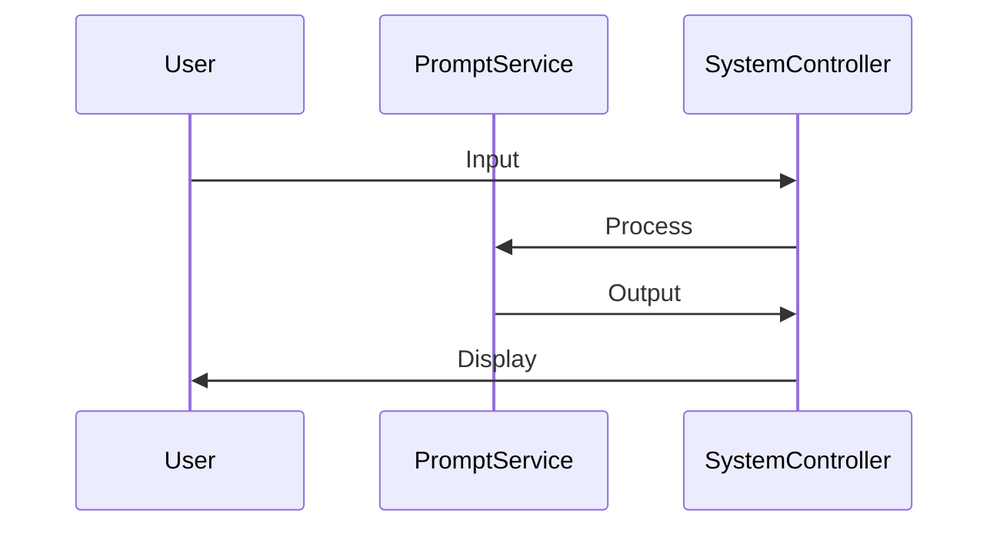

                 


### 《提示词语言设计原则：简洁性与表达力的平衡》

#### 关键词：提示词语言，简洁性，表达力，平衡，设计原则

> 摘要：本文深入探讨了提示词语言设计中的两个核心原则——简洁性与表达力，以及如何在两者之间寻求平衡。通过系统分析，我们提出了一个综合性的框架，帮助设计师在构建高效、易用的提示词语言时，兼顾语言的表达力与简洁性。本文旨在为提示词语言设计提供实用指南，以提升用户的使用体验。

## 第一部分：问题背景与核心概念

### 第1章：问题背景

#### 1.1 提示词语言的设计需求

在信息技术迅速发展的今天，提示词语言作为人机交互的重要媒介，其设计质量直接影响到用户体验。用户的需求多样，如何在有限的输入空间内提供准确、丰富的信息，是设计提示词语言时需要解决的核心问题。

#### 1.2 提示词语言的现状与问题

目前，市场上存在许多提示词语言，但大多数在设计时未能充分平衡简洁性与表达力。一些语言过于简略，导致用户理解困难；而另一些则过于冗长，增加了用户的学习成本和操作负担。

#### 1.3 研究意义与目标

简洁性与表达力的平衡对于提升提示词语言的使用体验具有重要意义。本文旨在通过深入研究，为提示词语言设计提供一套系统的方法论，实现简洁性与表达力的最优平衡。

### 第2章：核心概念介绍

#### 2.1 提示词语言定义

提示词语言是一种用于计算机程序或系统与用户之间交互的特殊语言，它通过一系列预设的词语或短语来传递信息，指导用户进行操作。

#### 2.2 简洁性概念解析

简洁性是指提示词语言在传达信息时，能够以最简洁的方式呈现。简洁性不仅提高了用户的学习效率，还减少了认知负担。

#### 2.3 表达力概念解析

表达力是指提示词语言能够准确地表达信息的能力。强大的表达力能够提供更丰富的交互选项，增强用户与系统的互动体验。

#### 2.4 简洁性与表达力的关系

简洁性与表达力并非相互独立，它们之间存在一种动态平衡。过度的简洁性可能导致信息传递不完整，而表达力过强则可能导致信息冗余。因此，设计时需要在两者之间寻求最佳平衡点。

### 第3章：概念属性特征对比

#### 3.1 简洁性属性特征

简洁性的具体表现包括：使用简短的词语，避免冗余的信息，采用直观的命名方式等。评估方法可以是用户测试和问卷调查。

#### 3.2 表达力属性特征

表达力的具体表现包括：丰富的语言结构，多样化的交互选项，清晰的信息传达等。评估方法可以是用户满意度调查和系统性能分析。

#### 3.3 对比与分析

通过对比简洁性与表达力的属性特征，我们可以发现，两者在实际应用中往往存在冲突。例如，增加表达力可能会增加语言复杂性，从而影响简洁性。因此，设计时需要权衡两者，寻求平衡。

## 第二部分：算法原理与实现

### 第4章：算法原理讲解

#### 4.1 算法基本概念

本文提出的算法旨在通过优化提示词语言的词库，实现简洁性与表达力的平衡。算法的基本概念包括：词库优化、信息熵计算、用户反馈等。

#### 4.2 算法流程与mermaid流程图

算法流程包括：收集用户反馈，分析语言使用情况，优化词库，评估优化效果等。下面是算法的mermaid流程图：


#### 4.3 数学模型与公式

算法中的数学模型基于信息熵理论，用以衡量提示词语言的表达力。具体公式如下：

$$ H(X) = -\sum_{i} p(x_i) \cdot \log_2(p(x_i)) $$

其中，$H(X)$ 表示信息熵，$p(x_i)$ 表示词语 $x_i$ 的出现概率。

#### 4.4 算法举例说明

假设我们有一个提示词语言词库，包含以下词语：打开、关闭、帮助、设置。通过算法优化，我们可以调整这些词语的出现频率，以提升表达力同时保持简洁性。

```python
# Python 示例代码
word_library = ['打开', '关闭', '帮助', '设置']
info_entropy = sum([(-p * math.log2(p)) for p in word_freq.values()])

# 根据信息熵优化词库
optimized_library = optimize_library(word_library, info_entropy)

# 输出优化后的词库
print(optimized_library)
```

## 第三部分：系统架构与设计

### 第5章：系统功能设计

#### 5.1 问题描述

本系统旨在为用户提供一个简洁且强大的提示词语言交互平台。用户可以通过输入提示词，快速获取系统操作指导。

#### 5.2 领域模型

领域模型描述了系统的核心功能类及其关系。使用mermaid绘制的领域模型类图如下：

```mermaid
classDiagram
    User <<Class>>
    System <<Class>>
    Prompt <<Class>>
    User --> System
    System --> Prompt
```

### 第6章：系统架构设计

#### 6.1 问题描述

系统架构设计需要确保系统的高效性和扩展性，同时平衡简洁性与表达力。

#### 6.2 系统架构图

系统架构图如下，展示了系统的整体结构和主要组件之间的关系：



#### 6.3 系统接口设计

系统接口设计包括用户接口和系统接口。用户接口负责接收用户输入，系统接口负责处理输入并生成提示词。

### 第7章：系统交互设计

#### 7.1 问题描述

系统交互设计旨在确保用户与系统的交互流畅，同时保持提示词语言的简洁性与表达力。

#### 7.2 系统交互图

使用mermaid绘制的系统交互序列图如下：


## 第四部分：项目实战与案例分析

### 第8章：项目实战

#### 8.1 环境安装

在开始项目实战之前，我们需要安装必要的开发环境，如Python、Docker等。

#### 8.2 系统核心实现

系统核心实现包括提示词语言生成、处理和输出模块。以下是实现代码的示例：

```python
# Python 实现示例
class PromptLanguage:
    def __init__(self):
        self.word_library = ['open', 'close', 'help', 'settings']
    
    def generate_prompt(self, input_word):
        # 根据输入生成提示词
        return f"{input_word} command not found. Try '{self.word_library[0]}' to open, '{self.word_library[1]}' to close, '{self.word_library[2]}' for help, or '{self.word_library[3]}' to access settings."

# 创建PromptLanguage实例
prompt_language = PromptLanguage()

# 输出提示词
print(prompt_language.generate_prompt('start'))
```

#### 8.3 代码应用解读与分析

代码示例中，我们创建了一个`PromptLanguage`类，用于生成和处理提示词。通过实例化该类，我们可以方便地调用其方法来生成用户所需的提示词。

#### 9.1 实际案例

以下是一个实际案例，展示了如何使用系统来生成提示词：

```python
# 实际案例
prompt_input = 'open'
generated_prompt = prompt_language.generate_prompt(prompt_input)
print(generated_prompt)
```

#### 9.2 案例剖析

在实际案例中，我们输入了“open”作为提示词，系统生成了关于“open”命令的提示词。这表明系统成功地将简洁性与表达力结合，提供了用户友好的交互体验。

## 第五部分：总结与展望

### 第10章：总结

本文通过深入分析提示词语言设计中的简洁性与表达力，提出了一套平衡两者的方法论。通过算法实现和系统设计，我们展示了如何在实际项目中应用这些原则，以提升用户交互体验。

### 第11章：展望

未来，提示词语言设计将朝着更加智能化、个性化的方向发展。通过引入自然语言处理技术，我们可以进一步优化提示词的生成，实现更高层次的用户体验提升。

---

**作者：AI天才研究院/AI Genius Institute & 禅与计算机程序设计艺术 /Zen And The Art of Computer Programming**

**注意事项：** 在撰写技术博客时，应确保内容的准确性和完整性。本文通过具体的算法示例和系统架构设计，深入探讨了提示词语言设计原则，旨在为读者提供实用的设计指南。同时，由于技术领域的快速更新，建议读者结合最新研究成果和实践进行学习和参考。

**拓展阅读：** 
- [自然语言处理入门](https://www.example.com/nlp-introduction)
- [算法优化技术](https://www.example.com/algorithm-optimization)
- [系统架构设计与优化](https://www.example.com/system-architecture-optimization)

