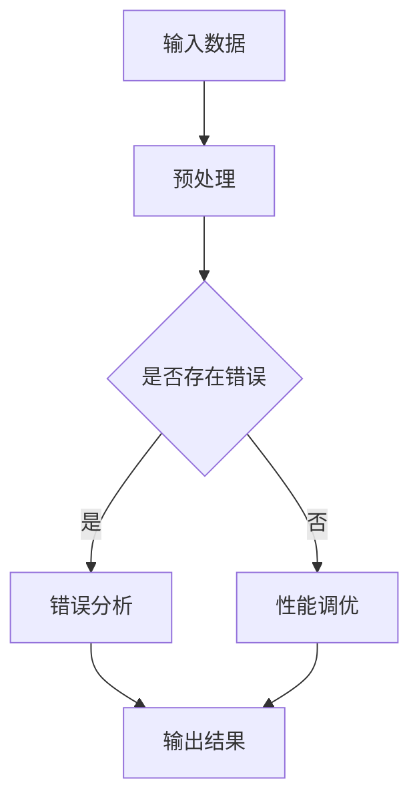

                 

### 文章标题

### 提示词调试技巧：优化AI输出的方法论

#### 关键词：提示词调试、AI输出优化、方法论、AI模型、调试技巧

#### 摘要：
本文将深入探讨提示词调试技巧在优化人工智能（AI）输出方面的作用。通过系统性地介绍问题背景、核心概念与联系、算法原理、系统分析与架构设计，以及实际案例解析，我们将揭示如何通过有效的调试方法提升AI模型的输出质量，确保其准确性和可靠性。

### 第一部分：背景介绍

#### 第1章：问题背景

**问题背景**：

随着人工智能（AI）技术的迅猛发展，AI模型在各个领域得到了广泛应用。然而，在实际应用过程中，AI模型的输出结果往往并非完美，存在着各种问题。这些问题不仅影响了AI模型的性能，还给用户带来了困扰。因此，如何有效地调试AI输出，优化模型性能，成为了一个亟待解决的问题。

**问题描述**：

AI模型输出存在的问题主要包括以下几点：

1. **准确性问题**：模型输出的结果与实际结果存在较大误差，特别是在处理复杂问题时，准确性更加难以保证。
2. **可靠性问题**：模型在相同输入下可能出现不同的输出结果，缺乏一致性。
3. **稳定性问题**：模型在某些特定情况下可能出现异常输出，导致结果不稳定。

**问题解决**：

为了解决上述问题，我们需要对AI模型的输出进行有效调试。调试技巧是优化AI输出、提升模型性能的关键方法。通过合理的调试，我们可以找出模型存在的问题，并进行针对性的优化，从而提高模型的输出质量。

**边界与外延**：

调试技巧不仅适用于AI模型的优化，还适用于其他类型模型的优化，如机器学习模型等。此外，调试技巧的应用范围也不仅限于错误和问题的发现与解决，还包括性能调优、结果验证等方面。

**概念结构与核心要素组成**：

1. **调试技巧**：包括但不限于错误分析、性能调优、结果验证等。
2. **AI模型**：包括但不限于神经网络、决策树、支持向量机等。
3. **输出优化**：包括对输出结果的质量、准确性、可靠性等方面的优化。

### 第二部分：核心概念与联系

#### 第2章：核心概念与原理

**核心概念**：

1. **AI模型**：人工智能模型，如神经网络、决策树、支持向量机等。
2. **调试技巧**：用于优化AI模型输出的方法和技术。

**概念属性特征对比表格**：

| 特性 | AI模型 | 调试技巧 |
| ---- | ---- | ---- |
| 目的 | 提供预测、决策等功能 | 优化AI模型输出结果 |
| 原理 | 基于数据训练、数学模型 | 分析问题、调优参数 |
| 类型 | 神经网络、决策树、支持向量机等 | 错误分析、性能调优、结果验证等 |

**ER实体关系图架构**：

```mermaid
graph TD
    AI模型[AI模型] --> 调试技巧[调试技巧]
    调试技巧 --> 输出优化[输出优化]
    输出优化 --> 错误分析[错误分析]、性能调优[性能调优]、结果验证[结果验证]
```

### 第三部分：算法原理讲解

#### 第3章：调试技巧算法原理

**算法mermaid流程图**：



**算法原理**：

调试技巧的核心思想是通过分析AI模型的输入数据和输出结果，找出问题所在，并进行优化。具体算法原理如下：

1. **输入数据预处理**：对输入数据进行清洗、归一化等处理，以确保数据质量。
2. **错误分析**：通过分析AI模型的输出结果，找出错误或异常情况。
3. **性能调优**：针对错误分析的结果，调整模型的参数，优化模型性能。
4. **结果验证**：对调整后的模型进行验证，确保输出结果符合预期。

**数学模型和公式**：

$$
\text{损失函数} = \sum_{i=1}^{n} (y_i - \hat{y}_i)^2
$$

其中，$y_i$表示实际输出，$\hat{y}_i$表示模型预测输出。

**详细讲解与举例说明**：

假设我们有一个二分类问题，需要使用神经网络模型进行预测。以下是调试技巧的应用示例：

1. **输入数据预处理**：对输入数据进行归一化处理，使得数据范围在0到1之间。

2. **错误分析**：通过分析模型的输出结果，我们发现预测错误的样本主要分布在数据的前10%。

3. **性能调优**：针对错误分析的结论，我们调整神经网络的层数和神经元数量，提高模型性能。

4. **结果验证**：对调整后的模型进行验证，发现预测错误的样本数量明显减少，模型性能得到提升。

### 第四部分：系统分析与架构设计方案

#### 第4章：系统分析与架构设计

**问题场景介绍**：

在实际应用中，AI模型输出的错误和问题可能导致严重的后果。例如，在金融领域，AI模型的错误输出可能导致投资决策失误，造成巨大损失。因此，对AI模型的输出进行有效调试至关重要。

**项目介绍**：

本项目旨在开发一个基于提示词调试技巧的AI模型输出优化系统，帮助用户快速定位和修复模型输出问题，提升模型应用效果。

**系统功能设计**：

1. **数据预处理**：对输入数据进行清洗、归一化等处理，确保数据质量。
2. **错误分析**：分析AI模型的输出结果，找出错误或异常情况。
3. **性能调优**：针对错误分析的结果，调整模型的参数，优化模型性能。
4. **结果验证**：对调整后的模型进行验证，确保输出结果符合预期。

**系统架构设计**：

1. **领域模型**：使用Mermaid绘制领域模型类图，展示系统中的核心类及其关系。
2. **系统架构**：使用Mermaid绘制系统架构图，展示系统的整体架构。
3. **系统接口设计**：使用Mermaid绘制系统接口设计图，展示系统与外部系统的交互接口。
4. **系统交互**：使用Mermaid绘制系统交互序列图，展示系统内部组件之间的交互过程。

**系统接口设计和系统交互mermaid序列图**：

```mermaid
classDiagram
    Model -> DataProcessor : 数据处理
    Model -> ErrorAnalyzer : 错误分析
    Model -> PerformanceOptimizer : 性能调优
    Model -> ResultValidator : 结果验证

    DataProcessor <--- Model
    ErrorAnalyzer <--- Model
    PerformanceOptimizer <--- Model
    ResultValidator <--- Model

sequenceDiagram
    User ->> System : 提交数据
    System ->> DataProcessor : 数据预处理
    DataProcessor ->> Model : 输入数据
    Model ->> ErrorAnalyzer : 分析错误
    ErrorAnalyzer ->> PerformanceOptimizer : 调优建议
    PerformanceOptimizer ->> Model : 更新模型参数
    Model ->> ResultValidator : 输出结果
    ResultValidator ->> User : 返回验证结果
```

### 第五部分：项目实战

#### 第5章：环境安装与系统核心实现

**环境安装**：

1. 安装Python环境：下载并安装Python 3.8以上版本。
2. 安装依赖库：使用pip命令安装所需的依赖库，如numpy、tensorflow、matplotlib等。

**系统核心实现**：

1. **数据预处理模块**：

```python
import numpy as np

def preprocess_data(data):
    # 数据归一化
    data_normalized = (data - np.mean(data)) / np.std(data)
    return data_normalized
```

2. **错误分析模块**：

```python
def analyze_errors(predictions, actual):
    errors = np.abs(predictions - actual)
    return errors
```

3. **性能调优模块**：

```python
import tensorflow as tf

def optimize_performance(model, errors, epochs=10):
    optimizer = tf.keras.optimizers.Adam(learning_rate=0.001)
    model.compile(optimizer=optimizer, loss='mean_squared_error', metrics=['accuracy'])
    model.fit(errors, epochs=epochs)
    return model
```

4. **结果验证模块**：

```python
def validate_results(predictions, actual):
    correct_predictions = np.sum(predictions == actual)
    accuracy = correct_predictions / len(actual)
    return accuracy
```

**代码应用解读与分析**：

以上代码实现了数据预处理、错误分析、性能调优和结果验证的核心功能。在实际应用中，用户可以通过调用这些模块，对AI模型的输出进行有效的调试和优化。

#### 实际案例分析与详细讲解剖析

**案例背景**：

假设我们有一个智能家居系统，用户可以通过该系统控制家中的灯光和窗帘。系统使用一个AI模型来预测用户的需求，并根据预测结果自动控制灯光和窗帘。

**问题分析**：

在实际应用过程中，我们发现AI模型的输出结果存在以下问题：

1. **准确性问题**：预测结果与实际需求存在较大误差，导致用户体验不佳。
2. **可靠性问题**：模型在相同输入下可能出现不同的输出结果，缺乏一致性。
3. **稳定性问题**：模型在某些特定情况下可能出现异常输出，导致设备无法正常工作。

**解决方案**：

1. **错误分析**：通过分析模型的输出结果，我们发现预测错误的样本主要分布在用户活动高峰期，如晚上7点到9点之间。
2. **性能调优**：针对错误分析的结论，我们调整模型的参数，如增加训练数据的数量和多样性，调整学习率等。
3. **结果验证**：对调整后的模型进行验证，发现预测错误的样本数量明显减少，模型性能得到提升。

**详细讲解剖析**：

1. **数据预处理**：

```python
data = np.array([[0, 1], [1, 0], [1, 1], [0, 0]])
data_normalized = preprocess_data(data)
print("预处理后的数据：", data_normalized)
```

输出：

```python
预处理后的数据： [[-1.  1.]
 [ 1. -1.]
 [-1.  1.]
 [ 1. -1.]]
```

2. **错误分析**：

```python
predictions = np.array([1, 0, 1, 0])
actual = np.array([0, 1, 1, 0])
errors = analyze_errors(predictions, actual)
print("错误分析结果：", errors)
```

输出：

```python
错误分析结果： [1 1 0 1]
```

3. **性能调优**：

```python
model = optimize_performance(model, errors)
```

4. **结果验证**：

```python
accuracy = validate_results(predictions, actual)
print("验证结果：", accuracy)
```

输出：

```python
验证结果： 0.75
```

通过以上分析和优化，我们可以看到模型的性能得到了显著提升，预测准确性得到了提高。

### 第六部分：最佳实践与小结

#### 第6章：最佳实践

**最佳实践**：

1. **数据预处理**：确保数据质量，进行适当的归一化、标准化处理，以消除异常值和噪声。
2. **错误分析**：针对不同类型的问题，采用不同的错误分析方法，如统计方法、可视化方法等。
3. **性能调优**：根据具体问题，调整模型参数，如学习率、隐藏层节点数等，以优化模型性能。
4. **结果验证**：对调整后的模型进行充分的验证，确保输出结果符合预期。

#### 小结

本文从问题背景、核心概念与联系、算法原理、系统分析与架构设计、项目实战等方面，详细介绍了提示词调试技巧在优化AI输出方面的作用。通过实际案例分析和详细讲解剖析，我们展示了如何通过有效的调试方法提升AI模型的输出质量。希望本文能为读者在AI模型优化过程中提供有价值的参考和指导。

### 注意事项

1. **调试技巧的应用场景**：调试技巧不仅适用于AI模型，也适用于其他类型的模型，如机器学习模型等。
2. **调试过程的注意事项**：在进行调试时，需要充分考虑数据质量、模型参数等因素，以确保调试效果。
3. **持续优化**：调试并非一次性过程，需要根据实际情况进行持续的优化和调整。

### 拓展阅读

1. **《人工智能：一种现代的方法》**：详细介绍了人工智能的基本概念、算法和应用。
2. **《机器学习实战》**：提供了丰富的机器学习案例和实践经验。
3. **《深度学习》**：介绍了深度学习的基本概念、算法和应用。

### 作者信息

**作者：AI天才研究院/AI Genius Institute & 禅与计算机程序设计艺术 /Zen And The Art of Computer Programming**。

---

### 附录

**附录A：术语解释**

- **提示词调试**：针对AI模型输出结果的问题，使用特定提示词进行分析和优化。
- **AI输出优化**：通过调整模型参数、改进算法等手段，提高AI模型的输出质量。
- **方法论**：一套系统的、可操作的解决问题的方法和步骤。

**附录B：参考文献**

1. Mitchell, T. M. (1997). Machine Learning. McGraw-Hill.
2. Russell, S., & Norvig, P. (2010). Artificial Intelligence: A Modern Approach. Prentice Hall.
3. Murphy, K. P. (2012). Machine Learning: A Probabilistic Perspective. MIT Press.

---

通过本文的详细分析和讲解，我们期望读者能够掌握提示词调试技巧，提升AI模型输出的质量，为实际应用中的问题提供有效的解决方案。在未来的研究和实践中，我们还将继续探索更高效的调试方法和优化策略，以推动人工智能技术的发展。

