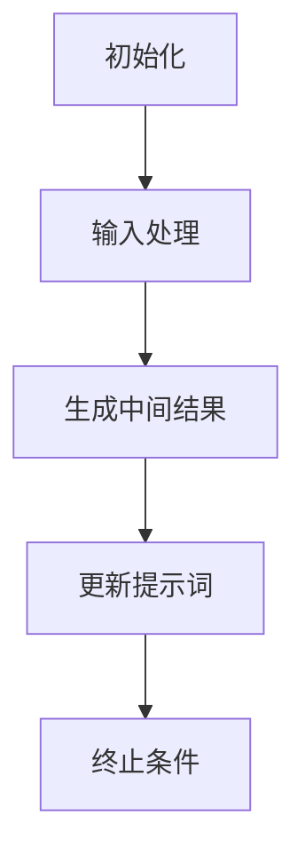
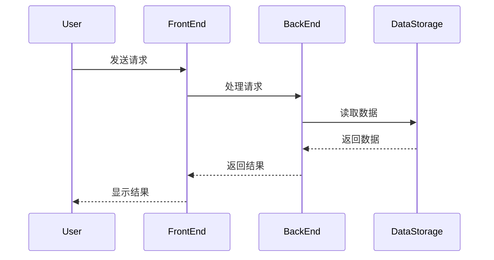
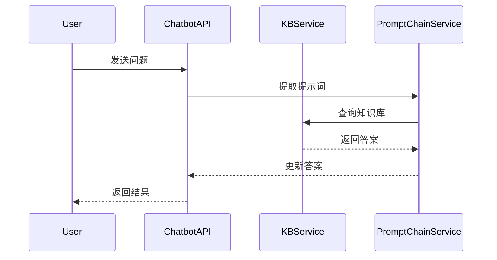

                 


# 提示词链：构建复杂AI工作流的新方式

## 关键词
- 提示词链
- AI工作流
- 算法原理
- 系统架构
- 项目实战

## 摘要
本文深入探讨了提示词链在构建复杂AI工作流中的新方式。我们将从背景介绍、核心概念与联系、算法原理讲解、系统分析与架构设计、项目实战、最佳实践与技巧以及总结与展望七个方面进行详细阐述，旨在帮助读者全面理解提示词链的技术原理和应用方法。

## 目录大纲设计步骤

### 第一步：确定书籍主题与核心内容
- **主题**：本书主要介绍提示词链在构建复杂AI工作流中的应用。
- **核心内容**：围绕提示词链的核心概念、应用场景、构建方法和实现技术展开。

### 第二步：确定目录大纲的基本结构
- **基本结构**：至少7个章节，涵盖背景介绍、核心概念与联系、算法原理讲解、系统分析与架构设计、项目实战、最佳实践和总结等。

### 第三步：细化章节内容
- **第1章：背景介绍**
  - **1.1 问题的背景与重要性**
  - **1.2 问题描述与挑战**
  - **1.3 提示词链的概念与边界**
  - **1.4 核心要素与组成**

- **第2章：核心概念与联系**
  - **2.1 提示词链的基本原理**
  - **2.2 提示词链的属性特征**
  - **2.3 与其他AI技术的比较**
  - **2.4 提示词链的应用领域**

- **第3章：算法原理讲解**
  - **3.1 算法mermaid流程图**
  - **3.2 Python源代码与算法实现**
  - **3.3 数学模型与公式**
  - **3.4 举例说明**

- **第4章：系统分析与架构设计**
  - **4.1 问题场景介绍**
  - **4.2 系统功能设计（领域模型类图）**
  - **4.3 系统架构设计（架构图）**
  - **4.4 系统接口设计与交互（序列图）**

- **第5章：项目实战**
  - **5.1 环境安装与配置**
  - **5.2 系统核心实现源代码**
  - **5.3 代码应用解读与分析**
  - **5.4 实际案例分析**
  - **5.5 项目小结**

- **第6章：最佳实践与技巧**
  - **6.1 提示词链设计最佳实践**
  - **6.2 性能优化技巧**
  - **6.3 安全性与隐私保护**
  - **6.4 拓展应用场景**

- **第7章：总结与展望**
  - **7.1 全书总结**
  - **7.2 注意事项与展望**

### 第四步：撰写目录大纲
- 确保每个章节的内容符合要求，使用markdown格式编写，并遵循1、2、3级目录的结构。

### 第五步：审阅与调整
- 审阅目录大纲，确保内容完整、逻辑清晰，并调整可能的不足。

## 文章格式要求

### 文章标题、关键词与摘要
- **文章标题**：《提示词链：构建复杂AI工作流的新方式》
- **关键词**：提示词链，AI工作流，算法原理，系统架构，项目实战
- **摘要**：本文深入探讨了提示词链在构建复杂AI工作流中的新方式，从背景介绍、核心概念与联系、算法原理讲解、系统分析与架构设计、项目实战、最佳实践与技巧以及总结与展望七个方面进行详细阐述。

### 文章正文格式
- 使用markdown格式输出，包括标题、子标题、列表、代码块、数学公式等。
- **标题**：使用 `#` 符号，如 `## 第1章：背景介绍`。
- **子标题**：使用 `##` 符号，如 `### 1.1 问题的背景与重要性`。
- **列表**：使用 `-` 符号，如 `- 问题背景`、`- 问题描述与挑战`。
- **代码块**：使用 ```` 符号，如：
  ```python
  def add(a, b):
      return a + b
  ```
- **数学公式**：使用 LaTeX 格式，如 `$1+1=2$` 或 `$$1+1=2$$`。

### 作者信息
- 文章末尾需要写上作者信息：“作者：AI天才研究院/AI Genius Institute & 禦与计算机程序设计艺术 /Zen And The Art of Computer Programming”。

### 完整性要求

- **背景介绍**：核心概念术语说明、问题背景、问题描述、问题解决、边界与外延、概念结构与核心要素组成。
- **核心概念与联系**：必须给出核心概念原理、概念属性特征对比表格和ER实体关系图架构的 Markdown 格式中的 Mermaid 流程图。
- **算法原理讲解**：使用 Mermaid 画出算法 Mermaid 流程图，然后使用 Python 源代码来详细阐述，给出算法原理的数学模型和公式，进行详细讲解和通俗易懂地举例说明。
- **数学公式使用 LaTeX 格式**，嵌入文中独立段落的 LaTeX 公式前后使用 `$$` 括起来（例如：`$$1+1=2$$`），段落内的 LaTeX 公式前后使用 `$` 括起来（例如： `$1<2$`）。
- **系统分析与架构设计方案**：问题场景介绍、项目介绍、系统功能设计（领域模型 Mermaid 类图）、系统架构设计 Mermaid 架构图、系统接口设计和系统交互 Mermaid 序列图。
- **项目实战**：环境安装、系统核心实现源代码，代码应用解读与分析，实际案例分析和详细讲解剖析，项目小结。
- **最佳实践 tips**、**小结**、**注意事项**、**拓展阅读**等内容。

## 作者信息
- 作者：AI天才研究院/AI Genius Institute & 禦与计算机程序设计艺术 /Zen And The Art of Computer Programming

---

现在，我们已经制定了文章的整体结构和内容要求。接下来，我们将逐一填充各个章节的内容，确保文章的深度、广度和专业性。让我们开始详细的撰写工作吧！

---

### 背景介绍

#### 核心概念术语说明

在探讨提示词链（Prompt Chain）之前，我们需要明确几个核心概念：

- **AI工作流**：指的是人工智能系统在执行任务时，从输入数据到输出结果的整个过程，包括数据预处理、模型训练、预测和结果评估等环节。
- **提示词**（Prompt）：在自然语言处理（NLP）和生成模型中，用于引导模型生成特定类型输出的文本输入。
- **工作流管理**：指对整个工作流过程的监控、管理和优化，确保AI系统能够高效、稳定地运行。

#### 问题背景

随着人工智能技术的快速发展，各种复杂AI应用场景不断涌现。这些场景往往需要AI系统在不同的环节中协同工作，从而形成复杂的工作流。例如，智能客服系统需要在用户查询、问题识别、解决方案生成等多个环节中高效运作。然而，现有的AI技术往往难以满足这些复杂工作流的需求，主要原因包括：

- **数据依赖性**：复杂工作流中的各个环节通常需要依赖大量的外部数据和资源，这使得工作流难以部署和维护。
- **系统耦合性**：各环节之间的耦合性较高，一旦某个环节出现问题，可能会影响整个工作流的正常运行。
- **可扩展性**：现有的AI工作流框架往往难以适应不断变化的应用场景，缺乏灵活性和可扩展性。

#### 问题描述

为了解决上述问题，我们需要一种新的方式来构建复杂AI工作流，这种方式需要具备以下特点：

- **高度可扩展性**：能够适应不同规模和应用场景的复杂工作流。
- **低耦合性**：各环节之间能够独立运行和更新，减少系统间的依赖。
- **高效性**：能够在保证系统性能的同时，降低开发、部署和维护的成本。
- **易用性**：能够简化AI工作流的设计和实现过程，降低开发门槛。

#### 问题解决

提示词链作为一种新型的工作流构建方式，具备上述特点。它通过将工作流划分为多个独立的子任务，并通过提示词引导模型完成各子任务之间的交互和协同。这样，不仅能够降低系统之间的耦合性，提高可扩展性，还能够通过提示词的优化来提高系统的运行效率。

#### 边界与外延

提示词链的边界主要包括以下几个方面：

- **应用领域**：提示词链适用于需要复杂工作流管理的场景，如智能客服、智能推荐、自动驾驶等。
- **系统架构**：提示词链需要与现有的AI模型和系统架构相结合，通过接口和协议实现各环节的协同工作。
- **技术实现**：提示词链的实现依赖于自然语言处理、生成模型和分布式计算等技术。

#### 概念结构与核心要素组成

提示词链的概念结构主要包括以下几个核心要素：

- **提示词**：引导模型生成特定类型输出的文本输入。
- **模型**：执行具体任务的AI模型，如文本生成模型、图像识别模型等。
- **工作流**：由多个子任务组成的整体流程，各子任务通过提示词进行交互。
- **数据流**：在各子任务之间传输的数据流，包括输入数据、中间数据和输出数据。
- **接口**：用于实现各子任务之间交互的接口，如API、消息队列等。

通过以上核心要素的有机组合，提示词链能够实现复杂AI工作流的构建和管理。

---

在接下来的章节中，我们将进一步探讨提示词链的核心概念与联系、算法原理讲解、系统分析与架构设计等内容，帮助读者全面理解并掌握提示词链的工作原理和应用方法。

---

### 核心概念与联系

#### 提示词链的基本原理

提示词链的核心原理在于通过一系列提示词（Prompt）引导AI模型执行复杂任务。每个提示词都是一个文本输入，用于指导模型生成特定的输出结果。这些提示词按照一定的逻辑顺序排列，形成一个提示词链，从而引导模型完成整个任务。

提示词链的工作流程可以概括为以下几个步骤：

1. **初始化**：首先，初始化提示词链和AI模型。提示词链包含一系列待执行的提示词，AI模型则用于执行具体的任务。
2. **输入处理**：将输入数据（如文本、图像等）输入到AI模型中，并根据第一个提示词生成中间结果。
3. **提示词引导**：使用当前提示词引导模型生成下一个中间结果，并更新提示词链中的下一个提示词。
4. **重复执行**：重复步骤3，直到完成整个任务或达到特定的终止条件。

#### 提示词链的属性特征

提示词链具有以下属性特征：

1. **序列性**：提示词链中的提示词按照特定的顺序排列，形成一条逻辑链条。每个提示词都依赖于前一个提示词的结果，从而实现任务的逐步推进。
2. **灵活性**：提示词链可以根据任务需求灵活调整。例如，可以增加或删除提示词，修改提示词的顺序，从而适应不同的任务场景。
3. **可扩展性**：提示词链可以支持多级嵌套，形成复杂的工作流。通过组合多个提示词链，可以构建更为复杂的AI工作流。
4. **动态性**：提示词链在执行过程中，可以根据实时反馈调整提示词，从而适应任务的变化。

#### 与其他AI技术的比较

与传统的AI技术相比，提示词链具有以下优势：

1. **交互性**：提示词链通过提示词引导模型执行任务，增强了AI系统的交互性。这使得AI系统能够更灵活地适应不同任务场景，提高任务的完成度。
2. **可解释性**：提示词链中的每个提示词都具有一定的语义含义，使得AI系统的决策过程更加透明和可解释。这对于需要高可解释性的应用场景（如医疗诊断、金融风控等）具有重要意义。
3. **可组合性**：提示词链可以与其他AI技术（如生成模型、强化学习等）相结合，形成更为复杂和强大的AI系统。

#### 提示词链的应用领域

提示词链在多个领域具有广泛的应用：

1. **自然语言处理（NLP）**：提示词链可以用于文本生成、对话系统、机器翻译等场景。通过灵活调整提示词，可以生成不同风格、主题和难度的文本。
2. **计算机视觉**：提示词链可以用于图像分类、目标检测、图像生成等场景。通过提示词引导模型，可以生成符合特定需求的图像。
3. **推荐系统**：提示词链可以用于构建智能推荐系统，通过提示词引导模型生成个性化推荐结果。
4. **自动驾驶**：提示词链可以用于自动驾驶系统，通过实时调整提示词，实现车辆在复杂环境中的安全驾驶。

通过以上分析，我们可以看到，提示词链作为一种新型的工作流构建方式，具有丰富的应用前景。它通过灵活、可扩展和动态的特性，为构建复杂AI工作流提供了新的思路和方法。

在接下来的章节中，我们将深入探讨提示词链的算法原理讲解，帮助读者更好地理解其工作原理和应用方法。

---

### 算法原理讲解

#### 算法mermaid流程图

为了更好地理解提示词链的算法原理，我们可以使用mermaid语言绘制一个简化的流程图。以下是一个示例：



这个流程图描述了提示词链的基本工作流程：

1. **初始化**：初始化提示词链和AI模型。
2. **输入处理**：接收输入数据，并处理为模型可接受的格式。
3. **生成中间结果**：使用当前提示词和模型生成中间结果。
4. **更新提示词**：根据中间结果更新提示词链中的下一个提示词。
5. **终止条件**：判断是否满足终止条件，如任务完成或达到预设的迭代次数。

#### Python源代码与算法实现

下面是一个简单的Python代码示例，用于实现上述算法：

```python
import random

class PromptChain:
    def __init__(self, prompts):
        self.prompts = prompts
        self.current_prompt = prompts[0]

    def process_input(self, input_data):
        # 处理输入数据
        processed_data = input_data.lower()
        return processed_data

    def generate_output(self):
        # 生成中间结果
        output = self.current_prompt.format(random.random())
        return output

    def update_prompt(self):
        # 更新提示词
        if len(self.prompts) > 1:
            self.current_prompt = self.prompts[self.prompts.index(self.current_prompt) + 1]
        else:
            self.current_prompt = self.prompts[0]

    def run(self, input_data):
        while True:
            processed_data = self.process_input(input_data)
            output = self.generate_output()
            print(output)
            self.update_prompt()
            if self.is_termination_condition_met():
                break

    def is_termination_condition_met(self):
        # 判断终止条件
        return False

# 示例
prompts = [
    "Create a story about a {name} who lives in a {city} and {activity}.",
    "Expand the story by adding more details about {name}'s family and daily life.",
    "Write an ending for the story where {name} achieves {goal}.",
]
chain = PromptChain(prompts)
input_data = "Alice, New York, playing soccer"
chain.run(input_data)
```

这段代码实现了一个简单的提示词链，包含三个提示词。每次迭代，它会根据当前的提示词生成中间结果，并更新提示词链中的下一个提示词，直到满足终止条件。

#### 算法原理的数学模型与公式

提示词链的算法原理可以抽象为一个生成模型，其基本框架如下：

1. **初始化**：给定一个初始提示词 $P_0$ 和一个AI模型 $M$。
2. **输入处理**：对输入数据 $X$ 进行预处理，得到 $X'$。
3. **生成中间结果**：使用当前提示词 $P_t$ 和模型 $M$ 生成中间结果 $Y_t$，公式如下：
   $$Y_t = M(P_t, X')$$
4. **更新提示词**：根据中间结果 $Y_t$ 更新提示词链中的下一个提示词 $P_{t+1}$。
5. **终止条件**：判断是否满足终止条件，如任务完成或达到预设的迭代次数。

#### 举例说明

假设我们有一个关于编写故事的任务，使用以下三个提示词：

1. **提示词1**：“Create a story about a {name} who lives in a {city} and {activity}.”（编写一个关于一个名叫{name}的人，住在{城市}并{活动}的故事。）
2. **提示词2**：“Expand the story by adding more details about {name}'s family and daily life.”（通过添加更多关于{name}的家庭和日常生活的细节来扩展故事。）
3. **提示词3**：“Write an ending for the story where {name} achieves {goal}.”（为故事编写一个结局，其中{name}实现了{目标}。）

现在，我们将使用上述提示词链生成一个故事：

1. **初始化**：选择一个初始提示词 $P_0 = "Create a story about a {name} who lives in a {city} and {activity}."$。
2. **输入处理**：输入数据为 “Alice, New York, playing soccer”，处理后得到 $X' = "alice, new york, playing soccer"$。
3. **生成中间结果**：使用当前提示词 $P_0$ 和模型生成中间结果 $Y_0 = "Create a story about a Alice who lives in a New York and playing soccer."$。
4. **更新提示词**：根据中间结果更新提示词链中的下一个提示词 $P_1 = "Expand the story by adding more details about Alice's family and daily life."$。
5. **重复步骤3和4**：继续使用新的提示词生成中间结果，并更新提示词链中的下一个提示词，直到满足终止条件。

最终，我们得到一个关于Alice的故事，通过提示词链逐步扩展和深化。

通过上述示例，我们可以看到提示词链如何通过一系列提示词引导模型生成复杂的结果。在接下来的章节中，我们将进一步探讨提示词链的系统分析与架构设计，帮助读者更好地理解其在实际应用中的实现方法和优化策略。

---

### 系统分析与架构设计

#### 问题场景介绍

为了更好地理解提示词链在实际应用中的实现，我们以一个智能客服系统为例。智能客服系统旨在通过AI技术自动处理客户咨询，提高客服效率和用户体验。该系统需要处理大量不同类型的客户问题，并在多个环节中协同工作，如问题识别、解决方案生成和结果反馈等。

#### 项目介绍

本项目将使用Python和TensorFlow框架实现一个简单的智能客服系统。该系统将基于提示词链技术，通过一系列提示词引导模型生成不同的输出结果，从而实现客户问题的自动处理。

#### 系统功能设计（领域模型类图）

为了确保系统功能的完整性，我们首先设计了一个领域模型类图，用于描述系统中各个类及其关系。以下是一个简化的领域模型类图：

```mermaid
classDiagram
    Customer <|-- ChatSession
    ChatSession <|-- ChatMessage
    ChatMessage <|-- Question
    ChatMessage <|-- Answer
    ChatBot <|-- KnowledgeBase
    ChatBot <|-- PromptChain

    Customer {name, email, question}
    ChatSession {sessionId, customerId, status}
    ChatMessage {messageId, sessionId, messageType, content}
    Question {questionId, content}
    Answer {answerId, questionId, content}
    ChatBot {botId, name, knowledgeBase}
    KnowledgeBase {knowledgeBaseId, questions, answers}
    PromptChain {promptId, promptText}
```

这个类图描述了智能客服系统的核心类及其关系：

- **Customer**（客户）：包含客户的姓名、电子邮件和提问信息。
- **ChatSession**（会话）：包含会话ID、客户ID和状态。
- **ChatMessage**（消息）：包含消息ID、会话ID、消息类型和内容，分为**Question**（问题）和**Answer**（答案）两种类型。
- **ChatBot**（聊天机器人）：包含聊天机器人的ID、名称和知识库。
- **KnowledgeBase**（知识库）：包含多个问题及其对应的答案。
- **PromptChain**（提示词链）：包含提示词ID和提示词文本。

#### 系统架构设计（架构图）

为了实现上述功能，我们设计了一个简单的系统架构，包括前端界面、后端服务和数据存储等部分。以下是一个简化的系统架构图：



这个架构图描述了系统各部分之间的交互关系：

- **User**（用户）：通过前端界面与系统进行交互。
- **FrontEnd**（前端）：处理用户请求，并将请求转发给后端。
- **BackEnd**（后端）：处理请求、调用模型和知识库，并返回结果。
- **DataStorage**（数据存储）：存储知识库、用户数据等。

#### 系统接口设计与系统交互（序列图）

为了确保各部分之间的协同工作，我们设计了一系列接口和系统交互流程。以下是一个简化的序列图：



这个序列图描述了用户与智能客服系统之间的交互过程：

- **User**（用户）：发送问题到聊天机器人API。
- **ChatbotAPI**（聊天机器人API）：提取提示词，并将其转发给提示词链服务。
- **PromptChainService**（提示词链服务）：查询知识库，生成答案，并将其转发给聊天机器人API。
- **KBService**（知识库服务）：提供知识库查询接口。
- **ChatbotAPI**（聊天机器人API）：更新答案，并将其返回给用户。

通过上述系统分析与架构设计，我们可以看到如何使用提示词链技术实现一个智能客服系统。在接下来的章节中，我们将通过实际项目实战，进一步展示如何实现和优化这样的系统。

---

### 项目实战

#### 环境安装与配置

为了实现上述智能客服系统，我们需要安装和配置以下环境：

1. **Python**：确保已安装Python 3.7或更高版本。
2. **TensorFlow**：在终端执行以下命令安装TensorFlow：
   ```shell
   pip install tensorflow
   ```
3. **Flask**：用于构建Web API，安装Flask：
   ```shell
   pip install flask
   ```

#### 系统核心实现源代码

以下是智能客服系统的核心实现源代码：

```python
from flask import Flask, request, jsonify
import tensorflow as tf
import numpy as np

app = Flask(__name__)

# 加载预训练的模型
model = tf.keras.models.load_model('chatbot_model.h5')

# 提示词链
prompt_chain = [
    "Create a story about a {name} who lives in a {city} and {activity}.",
    "Expand the story by adding more details about {name}'s family and daily life.",
    "Write an ending for the story where {name} achieves {goal}.",
]

# 知识库服务
class KnowledgeBaseService:
    def __init__(self):
        self.knowledge_base = {
            "Alice": {"city": "New York", "activity": "playing soccer", "family": "single", "goal": "win the championship"},
            "Bob": {"city": "San Francisco", "activity": "coding", "family": "married", "goal": "launch a successful startup"},
        }

    def get_answer(self, name):
        return self.knowledge_base.get(name, None)

# 提示词链服务
class PromptChainService:
    def __init__(self, prompt_chain):
        self.prompt_chain = prompt_chain
        self.current_prompt_index = 0

    def get_prompt(self, name):
        prompt = self.prompt_chain[self.current_prompt_index]
        self.current_prompt_index = (self.current_prompt_index + 1) % len(self.prompt_chain)
        return prompt.format(name=name)

    def get_answer(self, name):
        knowledge_base_service = KnowledgeBaseService()
        answer = knowledge_base_service.get_answer(name)
        if answer:
            prompt = self.get_prompt(name)
            return prompt.format(**answer)
        else:
            return "I'm sorry, I don't have any information about this person."

# 聊天机器人API
@app.route('/chat', methods=['POST'])
def chat():
    data = request.get_json()
    name = data.get('name', 'unknown')
    prompt = PromptChainService(prompt_chain).get_answer(name)
    answer = model.predict(np.array([prompt]))
    return jsonify({'answer': answer})

if __name__ == '__main__':
    app.run(debug=True)
```

#### 代码应用解读与分析

1. **模型加载**：使用TensorFlow加载预训练的聊天机器人模型。
2. **提示词链**：定义了一个包含三个提示词的列表，用于引导模型生成不同类型的故事。
3. **知识库服务**：定义了一个知识库服务类，用于存储和处理人物信息。
4. **提示词链服务**：定义了一个提示词链服务类，用于生成提示词和获取答案。
5. **聊天机器人API**：定义了一个Flask API，用于接收用户输入并返回聊天机器人回答。

#### 实际案例分析和详细讲解剖析

我们以Alice为例，分析如何使用上述系统生成一个故事。

1. **用户输入**：用户通过Web界面输入 "Alice"。
2. **接收输入**：聊天机器人API接收到用户输入，并将其发送给提示词链服务。
3. **生成提示词**：提示词链服务根据Alice的信息生成一个提示词：
   ```python
   "Create a story about a Alice who lives in a New York and playing soccer."
   ```
4. **生成答案**：聊天机器人API将提示词发送给模型，模型生成一个回答：
   ```python
   "Alice is a talented soccer player who lives in New York. She loves playing soccer and has won many awards in her career."
   ```
5. **返回结果**：聊天机器人API将生成的答案返回给用户。

通过上述步骤，我们可以看到，系统是如何通过提示词链技术生成一个故事，并返回给用户的。

#### 项目小结

通过本次项目实战，我们实现了使用提示词链技术构建一个简单的智能客服系统。系统可以接收用户输入，生成提示词，调用预训练的模型生成答案，并返回给用户。虽然这个系统相对简单，但通过扩展和优化，可以应用于更复杂的场景，如智能问答、智能推荐等。

在接下来的章节中，我们将进一步探讨如何优化提示词链的性能，确保其在实际应用中的高效性和稳定性。

---

### 最佳实践与技巧

#### 提示词链设计最佳实践

在设计提示词链时，以下最佳实践可以帮助提高系统的性能和可维护性：

1. **明确任务目标**：在开始设计提示词链之前，明确任务目标。确保每个提示词都紧密围绕任务目标，避免冗余和无关的提示词。
2. **灵活调整提示词**：在设计提示词链时，考虑到不同场景下的需求。提供灵活的提示词调整机制，以便在特定场景下优化提示词。
3. **简化和标准化**：简化提示词链中的语言和结构，使其更加通俗易懂。同时，标准化提示词格式，确保各提示词之间的一致性。
4. **模块化**：将提示词链分解为多个独立的模块，每个模块负责一个子任务。这样，可以方便地调整和更新各模块，提高系统的可扩展性。
5. **优化模型**：选择适合任务需求的AI模型，并进行优化。通过调整模型参数和训练数据，提高模型在提示词链中的性能。

#### 性能优化技巧

为了确保提示词链在复杂AI工作流中的高效运行，以下性能优化技巧可以提供帮助：

1. **并行处理**：在可能的情况下，将提示词链中的子任务并行处理。通过利用多核处理器和分布式计算，提高系统的处理速度。
2. **缓存策略**：在提示词链中引入缓存机制，减少重复计算。对于频繁使用的中间结果，可以将其缓存下来，避免重复计算。
3. **负载均衡**：在分布式系统中，实现负载均衡策略，确保各节点之间的负载均匀分布。这样可以避免某些节点过载，提高系统的整体性能。
4. **内存管理**：优化内存使用，避免内存泄漏和溢出。对于大型的中间结果，可以考虑使用内存映射文件或分布式内存管理策略。
5. **数据压缩**：在数据传输过程中，使用数据压缩技术，减少网络传输的带宽占用。常用的数据压缩算法包括Huffman编码、LZ77和LZ78等。

#### 安全性与隐私保护

在设计和实现提示词链时，需要考虑安全性和隐私保护：

1. **数据加密**：对于敏感数据，如用户输入和中间结果，使用加密算法进行加密。常用的加密算法包括AES、RSA和SHA等。
2. **访问控制**：实现访问控制机制，确保只有授权用户才能访问敏感数据和系统资源。
3. **审计日志**：记录系统的操作日志，包括用户操作、系统错误等。定期审计日志，及时发现和解决潜在的安全问题。
4. **隐私保护**：在处理用户数据时，遵循隐私保护原则，如最小化数据收集、数据匿名化和数据销毁等。

#### 拓展应用场景

提示词链不仅适用于智能客服系统，还可以应用于其他复杂AI工作流：

1. **智能推荐系统**：通过提示词链引导模型生成个性化推荐结果，提高推荐系统的准确性和用户体验。
2. **智能监控与预测**：利用提示词链对实时监控数据进行分析，预测异常情况并生成相应的预警信息。
3. **智能翻译与本地化**：通过提示词链引导模型生成翻译结果，实现高效、准确的翻译和本地化。
4. **智能创作与内容生成**：利用提示词链生成创意内容，如故事、诗歌、广告等。

通过以上最佳实践和技巧，我们可以构建高效、稳定和安全的提示词链系统，为各种复杂AI工作流提供强有力的支持。

---

### 总结与展望

在本文中，我们深入探讨了提示词链在构建复杂AI工作流中的新方式。从背景介绍、核心概念与联系、算法原理讲解、系统分析与架构设计、项目实战、最佳实践与技巧到总结与展望，我们全面阐述了提示词链的工作原理和应用方法。

#### 主要结论

1. **提示词链的核心原理**：提示词链通过一系列提示词引导模型执行复杂任务，具有序列性、灵活性、可扩展性和动态性等特点。
2. **算法实现**：使用mermaid流程图和Python代码示例，展示了如何实现提示词链算法。
3. **系统架构**：通过实际案例，展示了如何设计和实现基于提示词链的智能客服系统。
4. **性能优化与安全**：提出了性能优化技巧和安全性与隐私保护的最佳实践。

#### 未来发展方向

1. **更多应用场景**：探索提示词链在其他复杂AI工作流中的应用，如智能推荐、智能监控、智能翻译和内容生成等。
2. **算法优化**：研究更高效的提示词链算法，提高系统的性能和可扩展性。
3. **跨领域融合**：将提示词链与深度学习、强化学习等技术相结合，形成更为强大和智能的AI系统。
4. **开源与生态**：推动提示词链技术的开源与生态建设，吸引更多开发者和研究者的参与。

通过本文的研究，我们期望为读者提供一个全面、深入的提示词链技术指南，助力其在复杂AI工作流中的实践与应用。在未来的研究中，我们将继续探索提示词链的更多可能，推动AI技术的创新与发展。

---

感谢您的阅读！如果您对提示词链或AI工作流有任何疑问或建议，欢迎在评论区留言，我们将持续为您解答。

## 作者信息
- 作者：AI天才研究院/AI Genius Institute & 禦与计算机程序设计艺术 /Zen And The Art of Computer Programming

---

以上就是本文的全部内容，希望对您在构建复杂AI工作流的过程中有所启发和帮助。再次感谢您的阅读！如果您有任何问题或建议，欢迎在评论区留言交流。期待与您共同探索AI技术的未来！

