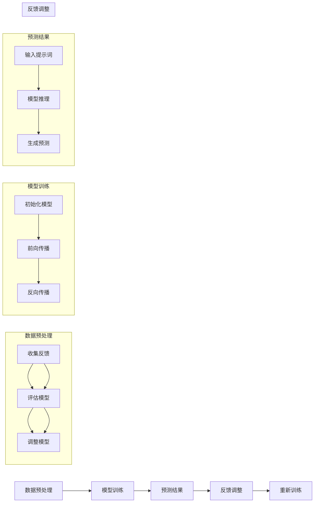
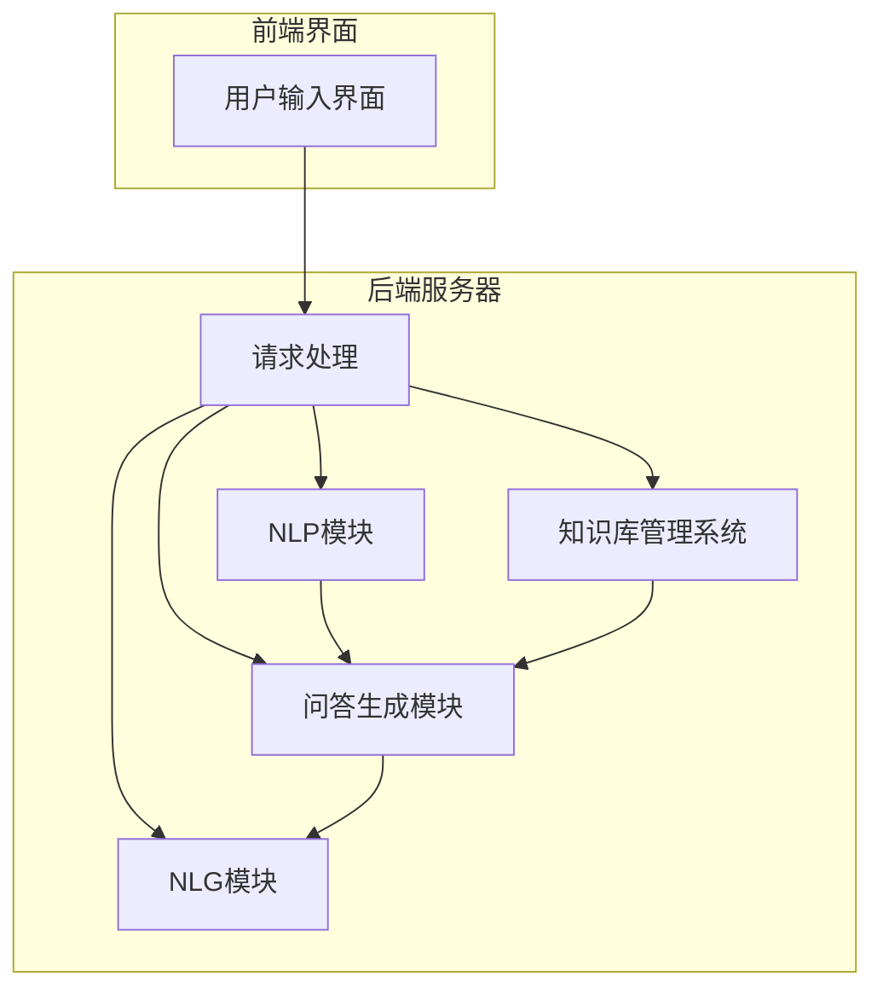
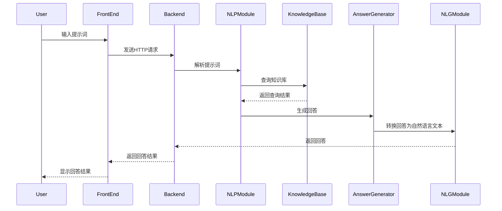

                 


### 第一步：背景介绍

#### 1.1 提示词驱动的AI应用开发背景

##### 1.1.1 AI应用开发的演进

在人工智能（AI）应用开发的历程中，我们可以观察到从最初的规则驱动，逐渐过渡到数据驱动的演变过程。早期的AI应用主要依赖于预定义的规则来完成任务，例如专家系统。这种方法在处理结构化、确定性问题时表现良好，但面对复杂、不确定的环境时，其局限性逐渐显现。

随着数据量的增长和数据处理的进步，AI应用开发开始从规则驱动转向数据驱动。在这一过程中，机器学习（ML）和深度学习（DL）的出现成为了转折点。这些方法通过从大量数据中学习模式，能够自动生成规则，从而提高AI系统的适应性和准确性。这种方法不仅解放了开发者需要手工编写规则的工作量，还能在处理非线性、复杂任务时展现出强大的能力。

提示词驱动的AI应用开发是在数据驱动的基础上进一步发展的。它结合了用户输入的提示词和机器学习算法的强大能力，能够更精准地理解用户需求，提供更加个性化的服务。这种方法的引入，使得AI系统在交互性和用户体验上得到了显著提升。

##### 1.1.1.1 从规则驱动到数据驱动

在规则驱动时代，AI应用的主要特点是依赖于一套固定的规则集来执行任务。这些规则由专家根据业务需求进行定义，具有明确的条件和结果。这种方法在处理简单、确定性的任务时效果显著，但一旦任务复杂度增加，规则集会迅速膨胀，导致维护成本增加，灵活性降低。

数据驱动的兴起改变了这一现状。通过机器学习，AI系统能够从数据中自动学习规律，生成能够处理复杂问题的模型。这种模型不仅能够适应新的情境，还能在未知情况下做出预测和决策。数据驱动的优势在于其自适应性和灵活性，能够处理更大规模、更加复杂的问题。

##### 1.1.1.2 提示词驱动的优势与特点

提示词驱动的AI应用开发结合了规则驱动和数据驱动的优点，并在此基础上增加了对用户输入的提示词的依赖。这种方法的几个主要优势包括：

1. **自适应能力强**：提示词驱动的AI系统能够根据用户的实时输入调整其行为，适应不同场景和需求。
2. **用户体验提升**：通过分析用户的提示词，AI系统能够提供更加个性化和精准的服务，从而提高用户体验。
3. **扩大应用范围**：提示词驱动的AI应用不仅限于特定的领域或任务，而是能够跨多个应用场景，提高其通用性和实用性。

##### 1.1.2 问题背景与描述

##### 1.1.2.1 提示词驱动的需求与挑战

随着互联网和移动设备的普及，用户对于AI系统的需求日益多样化和个性化。用户不再满足于标准化的服务，而是期望能够根据自己的需求进行定制。提示词驱动的AI应用开发正是为了满足这一需求而诞生的。它需要解决的问题包括：

1. **用户需求多样化**：用户的需求多变且多样，AI系统需要能够灵活应对。
2. **数据质量与多样性**：高质量、多样化的数据是训练出优秀模型的基石。如何获取和处理这些数据是一个重要挑战。
3. **模型适应性**：AI系统需要能够根据不同的提示词调整其行为，这要求模型具有较强的泛化能力。

##### 1.1.2.2 应用场景的多样性

提示词驱动的AI应用在多个领域和场景中展现出了强大的潜力。以下是一些常见应用场景：

1. **智能问答系统**：通过用户的提问，AI系统能够提供准确的答案或建议。
2. **自动化写作**：根据用户的提示词，AI系统可以生成文章、报告等文档。
3. **健康医疗**：AI系统可以分析患者的症状描述，提供诊断建议或健康指导。
4. **智能家居**：用户可以通过简单的提示词控制家电设备，实现智能家居的场景化互动。

##### 1.1.3 问题解决与边界

##### 1.1.3.1 提示词驱动的实现方法

提示词驱动的AI应用开发需要以下几个关键步骤：

1. **模型训练与优化**：通过大量数据训练机器学习模型，使其能够理解用户的提示词。
2. **提示词设计与生成**：设计合适的提示词模板，或者利用自然语言生成技术自动生成提示词。
3. **应用集成与部署**：将训练好的模型集成到具体的AI应用中，实现实时交互和响应。

##### 1.1.3.2 边界条件与限制

尽管提示词驱动的AI应用开发具有诸多优势，但也面临一些边界条件和限制：

1. **数据隐私与安全**：用户的提示词可能包含敏感信息，如何保证数据的安全性和隐私性是一个重要问题。
2. **模型解释性**：复杂的机器学习模型往往难以解释其决策过程，这可能会影响用户对系统的信任。
3. **硬件资源限制**：大规模的机器学习训练和推理需要大量的计算资源，如何在有限的硬件条件下高效运行也是一个挑战。

##### 1.1.4 概念结构与核心要素

##### 1.1.4.1 提示词

提示词是提示词驱动AI系统的核心要素之一。它通常是一个短语或句子，用于引导AI系统执行特定的任务。提示词可以是明确性的，如“告诉我明天的天气如何”，也可以是模糊性的，如“我有点饿，有什么建议吗”。在设计提示词时，需要考虑以下原则和策略：

1. **简洁性**：提示词应尽量简洁明了，避免冗长复杂的句子。
2. **明确性**：提示词应尽可能明确，避免歧义和模糊性。
3. **多样性**：设计多样化的提示词，以适应不同的用户需求和场景。
4. **可扩展性**：提示词的设计应考虑未来的扩展性，以便在应用场景增加时能够灵活应对。

##### 1.1.4.2 AI模型架构

AI模型的架构选择对于提示词驱动的AI应用开发至关重要。常见的AI模型架构包括：

1. **神经网络**：包括前馈神经网络（FNN）和循环神经网络（RNN）等。神经网络能够处理复杂的非线性关系，但在处理序列数据时效果较差。
2. **卷积神经网络（CNN）**：特别适用于处理图像数据，具有强大的特征提取能力。
3. **生成对抗网络（GAN）**：能够生成高质量的数据，用于数据增强和模型训练。

选择模型架构时，应考虑以下因素：

1. **应用场景**：不同的模型架构适用于不同的场景，如图像识别、文本生成等。
2. **数据特点**：模型架构的选择应考虑数据的类型和特征。
3. **训练效果**：模型的性能和效果是选择架构的关键因素。

##### 1.1.4.3 数据处理

数据处理是提示词驱动AI应用开发的关键环节。高质量的数据对于训练出优秀的模型至关重要。数据处理包括以下几个步骤：

1. **数据采集**：从各种来源收集数据，如公开数据集、用户生成数据等。
2. **数据清洗**：去除噪声和错误数据，保证数据的质量和一致性。
3. **数据预处理**：对数据进行归一化、标准化等处理，使其适合模型训练。
4. **数据增强**：通过数据变换、生成等方法增加数据的多样性，提高模型的泛化能力。

##### 1.1.4.4 用户体验设计

用户体验设计在提示词驱动的AI应用中同样重要。良好的用户体验能够提高用户满意度，促进应用的普及。用户体验设计应考虑以下几点：

1. **交互设计**：设计直观、易用的交互界面，使用户能够轻松使用系统。
2. **反馈机制**：及时响应用户的提示词，并提供明确的反馈，增强用户的信任感。
3. **个性化服务**：根据用户的偏好和历史行为，提供个性化的服务和建议。
4. **易用性**：确保系统易于操作，用户无需具备专业知识即可使用。

### 总结

提示词驱动的AI应用开发是当前AI领域的一个热点研究方向。它通过结合用户输入的提示词和机器学习算法，实现了更加个性化和精准的服务。在接下来的章节中，我们将进一步探讨提示词驱动的核心概念、算法原理、系统架构设计方案，并通过项目实战来展示其实际应用。希望通过本文的介绍，读者能够对提示词驱动的AI应用开发有一个全面、深入的理解。----------------------------------------------------------------

## 第二部分：核心概念与联系

## 第2章：提示词驱动的AI应用核心概念

提示词驱动的AI应用开发，其核心在于如何有效地利用用户输入的提示词来驱动模型的训练和应用。在这一章中，我们将详细探讨提示词的定义与作用、AI模型架构的选择、数据处理的步骤以及用户体验设计的原则。

### 2.1 提示词的定义与作用

提示词（Prompt）在AI系统中起着至关重要的作用，它是一段引导AI系统执行特定任务的文本或指令。提示词通常由用户输入，也可以由系统根据上下文自动生成。一个有效的提示词应当简洁明了、结构清晰，同时能够涵盖用户的主要意图。

#### 2.1.1 提示词的基本概念

提示词的基本概念可以从以下几个方面来理解：

1. **内容**：提示词的内容决定了AI系统需要处理的任务类型。它可以是具体的指令，如“帮我找一个餐厅”，也可以是开放性问题，如“你对未来有什么期待？”。

2. **形式**：提示词可以采用不同的形式，如短语、句子或段落。不同的形式会影响到AI系统的处理方式和响应质量。

3. **上下文**：提示词的上下文环境对于理解其含义至关重要。上下文可以提供额外的信息，帮助AI系统更好地理解用户的意图。

#### 2.1.2 提示词的作用

提示词在AI系统中的作用主要体现在以下几个方面：

1. **引导任务执行**：通过提示词，用户可以明确地指示AI系统执行特定的任务，如搜索信息、生成文本、控制设备等。

2. **提高交互效率**：提示词驱动的交互方式相比传统的按钮点击或菜单选择，更加自然和高效。用户可以以自然语言的方式与系统进行沟通。

3. **增强用户体验**：通过提供个性化的提示词，AI系统可以更好地满足用户的需求，从而提高用户体验。

### 2.2 AI模型架构的选择

选择合适的AI模型架构是提示词驱动AI应用开发的关键步骤。不同的模型架构在处理能力、性能和适用场景上有所不同。以下是一些常见的AI模型架构及其特点：

#### 2.2.1 常见模型架构

1. **前馈神经网络（FNN）**：
   - **特点**：结构简单，易于实现和优化。
   - **应用**：适用于处理非序列数据，如图像识别和分类。

2. **卷积神经网络（CNN）**：
   - **特点**：擅长处理具有网格结构的数据，如图像。
   - **应用**：广泛应用于图像处理、计算机视觉等领域。

3. **循环神经网络（RNN）**：
   - **特点**：能够处理序列数据，具有记忆功能。
   - **应用**：适用于自然语言处理、语音识别等。

4. **长短期记忆网络（LSTM）**：
   - **特点**：是RNN的一种变体，能够更好地处理长序列数据。
   - **应用**：在时间序列分析、语音识别等领域有广泛应用。

5. **生成对抗网络（GAN）**：
   - **特点**：由生成器和判别器组成，能够生成高质量的数据。
   - **应用**：数据增强、图像生成等。

#### 2.2.2 选择依据

选择AI模型架构时，应考虑以下因素：

1. **应用场景**：不同场景对模型架构的要求不同。例如，图像识别任务更适合使用CNN，而自然语言处理任务则更适合使用RNN或LSTM。

2. **数据特点**：数据类型和特征也会影响模型选择。例如，图像数据更适合CNN，而文本数据更适合RNN。

3. **性能需求**：模型的性能和资源消耗是选择架构时的重要考虑因素。某些复杂模型虽然性能优越，但训练和推理时间较长，资源消耗大。

### 2.3 数据处理与清洗

在提示词驱动的AI应用开发中，数据的质量直接影响模型的训练效果和应用性能。因此，对数据进行有效的处理和清洗是必不可少的步骤。

#### 2.3.1 数据采集

数据采集是数据处理的第一个步骤，包括从各种来源收集数据，如公开数据集、用户生成数据等。数据来源的多样性和质量直接影响到后续的数据处理和模型训练。

#### 2.3.2 数据清洗

数据清洗是去除噪声和错误数据的过程，确保数据的质量和一致性。常见的清洗步骤包括：

1. **去除重复数据**：重复数据会影响模型的训练效果，因此需要去除。
2. **填补缺失值**：对于缺失的数据，可以选择填补或删除。
3. **去除噪声**：噪声数据可能会干扰模型的训练，因此需要去除。

#### 2.3.3 数据预处理

数据预处理是对数据进行标准化、归一化等操作，使其适合模型训练。预处理步骤包括：

1. **数据标准化**：将数据缩放到相同的范围内，以便于模型训练。
2. **数据归一化**：将数据转换为标准正态分布，提高模型的训练效率。
3. **特征提取**：提取数据中的重要特征，用于模型的输入。

#### 2.3.4 数据增强

数据增强是通过变换、生成等方法增加数据的多样性，提高模型的泛化能力。常见的数据增强方法包括：

1. **图像增强**：通过旋转、翻转、裁剪等方法增强图像数据。
2. **文本增强**：通过替换同义词、添加噪声等方式增强文本数据。

### 2.4 用户体验设计

用户体验设计是提示词驱动AI应用开发的重要组成部分。良好的用户体验能够提高用户的满意度，促进应用的普及。用户体验设计应考虑以下几个方面：

#### 2.4.1 交互设计

交互设计是用户体验设计的关键，包括用户与AI系统的交互方式和流程。设计应考虑以下几点：

1. **简洁性**：交互流程应简洁明了，避免复杂的操作步骤。
2. **直观性**：交互界面应直观易用，用户可以轻松理解和使用。
3. **响应性**：系统应能够快速响应用户的提示词，提供及时的反馈。

#### 2.4.2 反馈机制

反馈机制是增强用户信任感的重要手段。设计良好的反馈机制应考虑以下几点：

1. **及时性**：系统应能够及时响应用户的请求，提供准确的反馈。
2. **明确性**：反馈信息应明确，帮助用户理解系统的行为和结果。
3. **个性化**：根据用户的偏好和历史行为，提供个性化的反馈和推荐。

#### 2.4.3 个性化服务

个性化服务是提升用户体验的有效手段。通过分析用户的提示词和行为，系统可以提供个性化的服务和推荐。例如：

1. **个性化搜索**：根据用户的搜索历史和偏好，提供个性化的搜索结果。
2. **个性化推荐**：根据用户的行为和偏好，推荐符合其需求的内容或服务。

#### 2.4.4 易用性

易用性是用户体验设计的核心目标。设计时应考虑以下几点：

1. **一致性**：交互界面应保持一致性，使用户能够快速上手。
2. **可访问性**：系统应确保所有人都能访问和使用，包括残障人士等。
3. **容错性**：系统应能够处理用户的错误输入，提供合适的提示和帮助。

### 概念属性特征对比表格

为了更好地理解提示词驱动的AI应用开发中的核心概念，下面提供了一个概念属性特征对比表格。

| 概念         | 属性特征                     | 说明                                                         |
| ------------ | ---------------------------- | ------------------------------------------------------------ |
| 提示词       | 简洁性、明确性、多样性       | 提示词应简洁明了，避免冗长复杂，明确用户意图，具有多样性以适应不同场景 |
| AI模型架构   | 适用场景、数据特点、性能需求 | 选择合适的模型架构以满足特定应用的需求                     |
| 数据处理     | 数据采集、数据清洗、数据预处理、数据增强 | 确保数据质量，为模型训练提供高质量的数据                   |
| 用户体验设计 | 交互设计、反馈机制、个性化服务、易用性 | 提高用户满意度，促进应用普及                             |

### ER实体关系图架构

为了更直观地展示提示词驱动的AI应用开发中的实体关系，我们可以使用Mermaid绘制ER（实体关系）图。

```mermaid
erDiagram
  User ||--o{ AI_System : 提示词驱动应用 }  
  AI_System ||--o{ Data_Processing : 数据处理 }  
  AI_System ||--o{ UX_Design : 用户体验设计 }  
  Data_Processing ||--o{ Data_Collection : 数据采集 }  
  Data_Processing ||--o{ Data_Cleaning : 数据清洗 }  
  Data_Processing ||--o{ Data_Preprocessing : 数据预处理 }  
  Data_Processing ||--o{ Data_Enhancement : 数据增强 }  
  UX_Design ||--o{ Interaction_Design : 交互设计 }  
  UX_Design ||--o{ Feedback_Mechanism : 反馈机制 }  
  UX_Design ||--o{ Personalized_Service : 个性化服务 }  
  UX_Design ||--o{ Usability : 易用性 }
```

在上面的ER图中，用户与AI系统之间存在直接关系，AI系统又与数据处理和用户体验设计相关联。数据处理进一步细分为数据采集、数据清洗、数据预处理和数据增强。用户体验设计则包括交互设计、反馈机制、个性化服务和易用性。这种关系结构清晰，有助于我们理解和分析提示词驱动AI应用开发的整体架构。

### 结论

本章详细介绍了提示词驱动的AI应用开发中的核心概念，包括提示词的定义与作用、AI模型架构的选择、数据处理的步骤以及用户体验设计的原则。通过本章的探讨，读者可以对提示词驱动的AI应用开发有更深入的理解，为后续的算法原理讲解、系统分析与架构设计方案以及项目实战打下坚实的基础。

在下一章中，我们将进一步探讨提示词驱动的AI算法原理，通过mermaid流程图和Python源代码来详细阐述模型的训练和预测过程，以及相关的数学模型和公式。敬请期待。----------------------------------------------------------------

## 第三部分：算法原理讲解

### 第3章：提示词驱动的AI算法原理

在提示词驱动的AI应用开发中，算法原理是核心中的核心。理解算法原理不仅能够帮助我们设计高效的模型，还能提升模型的预测准确性和用户体验。在这一章中，我们将深入探讨提示词驱动的AI算法原理，并通过mermaid流程图和Python源代码来详细阐述模型的训练和预测过程。

### 3.1 算法mermaid流程图

为了更直观地展示提示词驱动的AI算法流程，我们可以使用mermaid绘制流程图。



在这个mermaid流程图中，我们首先进行了数据预处理，包括数据采集、数据清洗和数据增强。接下来是模型训练过程，包括初始化模型、前向传播和反向传播。然后是预测结果的生成，通过输入提示词和模型推理生成预测结果。最后是反馈调整，包括收集反馈、评估模型和调整模型。

### 3.2 Python源代码实现

为了更好地理解算法原理，我们通过Python源代码来实现一个简单的提示词驱动AI模型。

```python
import numpy as np
import tensorflow as tf

# 数据预处理
def preprocess_data(data):
    # 数据清洗
    cleaned_data = data.lower().strip()
    # 数据增强
    augmented_data = cleaned_data.replace(" ", "")
    return augmented_data

# 模型训练
def train_model(data, labels):
    # 初始化模型
    model = tf.keras.Sequential([
        tf.keras.layers.Embedding(input_dim=data.shape[0], output_dim=32),
        tf.keras.layers.GlobalAveragePooling1D(),
        tf.keras.layers.Dense(units=1, activation='sigmoid')
    ])

    # 编译模型
    model.compile(optimizer='adam', loss='binary_crossentropy', metrics=['accuracy'])

    # 训练模型
    model.fit(data, labels, epochs=10, batch_size=32)

    return model

# 预测结果
def predict(model, prompt):
    # 输入提示词
    processed_prompt = preprocess_data(prompt)
    # 模型推理
    prediction = model.predict(processed_prompt.reshape(1, -1))
    # 生成预测
    predicted_label = prediction[0][0] > 0.5
    return predicted_label

# 示例数据
data = np.array(["这是一个示例数据", "这是另一个示例数据"])
labels = np.array([1, 0])

# 训练模型
model = train_model(data, labels)

# 预测
prompt = "这是一个新的提示词"
predicted_label = predict(model, prompt)
print(f"预测结果：{'正类' if predicted_label else '负类'}")
```

在这个Python代码中，我们首先定义了数据预处理函数，包括数据清洗和数据增强。然后，我们定义了模型训练函数，包括模型初始化、编译和训练。最后，我们定义了预测函数，通过预处理输入提示词、模型推理和生成预测结果。

### 3.3 数学模型与公式

在提示词驱动的AI算法中，数学模型和公式起到了关键作用。以下是一些基本的数学模型和公式：

#### 3.3.1 模型训练

1. **前向传播**：

$$
\hat{y} = \sigma(W \cdot x + b)
$$

其中，$W$是权重矩阵，$b$是偏置项，$x$是输入特征，$\hat{y}$是预测结果，$\sigma$是激活函数（如Sigmoid函数）。

2. **反向传播**：

$$
\Delta{W} = \frac{\partial{L}}{\partial{W}} \cdot \frac{\partial{W}}{\partial{a}}
$$

$$
\Delta{b} = \frac{\partial{L}}{\partial{b}}
$$

其中，$L$是损失函数，$\Delta{W}$和$\Delta{b}$分别是权重和偏置的更新量。

#### 3.3.2 模型预测

1. **输入提示词处理**：

$$
x = \text{ preprocess\_data}(prompt)
$$

其中，$x$是预处理后的提示词。

2. **模型推理**：

$$
\hat{y} = \text{ model.predict(x.reshape(1, -1))}
$$

其中，$\hat{y}$是模型的预测结果。

3. **生成预测**：

$$
predicted\_label = \hat{y}[0][0] > 0.5
$$

其中，$predicted\_label$是生成的预测结果。

### 详细讲解与举例

为了更深入地理解数学模型和公式，我们通过一个简单的例子来详细讲解。

#### 例子：预测天气

假设我们要预测明天的天气，输入提示词是“明天的天气如何？”。

1. **数据预处理**：

   ```python
   prompt = "明天的天气如何？"
   processed_prompt = preprocess_data(prompt)
   ```

   经过预处理后，提示词变为“明天的天气如何”。

2. **模型推理**：

   ```python
   prediction = model.predict(processed_prompt.reshape(1, -1))
   ```

   模型接收预处理后的提示词，并输出预测结果。

3. **生成预测**：

   ```python
   predicted_label = prediction[0][0] > 0.5
   ```

   根据预测结果，如果概率大于0.5，则预测为“晴天”，否则为“阴天”。

### 结论

本章详细介绍了提示词驱动的AI算法原理，包括mermaid流程图、Python源代码实现以及数学模型和公式。通过本章的内容，读者可以全面了解提示词驱动的AI算法原理，为后续的系统分析与架构设计方案和项目实战提供理论基础。

在下一章中，我们将进一步探讨系统分析与架构设计方案，通过mermaid架构图和类图来展示系统的功能设计与架构设计。敬请期待。----------------------------------------------------------------

## 第四部分：系统分析与架构设计方案

### 第4章：系统分析与架构设计方案

在提示词驱动的AI应用开发中，系统分析与架构设计方案是确保系统能够高效、稳定、可扩展运行的关键。本章将详细介绍系统分析与架构设计方案，包括问题场景介绍、系统功能设计、系统架构设计和系统接口设计。

### 4.1 问题场景介绍

在当前人工智能时代，用户对于智能交互的需求日益增长。为了满足用户的需求，我们设计了一个基于提示词驱动的智能问答系统。该系统旨在通过用户的简单提示词，快速、准确地回答用户的问题，提供个性化的服务。

问题场景包括：

1. **用户提问**：用户通过输入文本形式的提示词，向系统提问。
2. **系统解析**：系统接收用户的提示词，并对其进行解析，以确定用户的需求。
3. **知识库查询**：系统根据解析结果，查询知识库，获取相关信息。
4. **生成回答**：系统生成回答，并通过自然语言生成技术将回答呈现给用户。
5. **用户反馈**：用户对回答进行评价，系统根据反馈调整回答策略。

### 4.2 系统功能设计

系统功能设计是系统分析与架构设计的重要环节。根据问题场景，我们设计了以下主要功能模块：

1. **用户输入模块**：接收用户的文本输入，并将其传递给解析模块。
2. **解析模块**：对用户输入的提示词进行解析，提取关键信息，如关键词、提问类型等。
3. **知识库模块**：存储大量预定义的知识点，包括常见问题、答案模板等。
4. **问答生成模块**：根据解析结果和知识库内容，生成合适的回答。
5. **自然语言生成模块**：将生成的回答转换为自然语言文本，呈现给用户。
6. **用户反馈模块**：接收用户的反馈，并用于调整系统回答策略。

#### 领域模型mermaid类图

为了更直观地展示系统功能设计，我们可以使用mermaid绘制类图。

```mermaid
classDiagram
    UserInput --> Parser
    Parser --> KnowledgeBase
    Parser --> AnswerGenerator
    AnswerGenerator --> NaturalLanguageGenerator
    UserFeedback --> Parser
    
    UserInput <<User Input Module>>
    Parser <<Parser Module>>
    KnowledgeBase <<KnowledgeBase Module>>
    AnswerGenerator <<Answer Generator Module>>
    NaturalLanguageGenerator <<Natural Language Generator Module>>
    UserFeedback <<User Feedback Module>>
```

在这个mermaid类图中，用户输入模块接收用户的文本输入，并将其传递给解析模块。解析模块负责对提示词进行解析，并查询知识库。解析模块将解析结果传递给问答生成模块，问答生成模块根据解析结果和知识库内容生成回答。生成的回答通过自然语言生成模块转换为自然语言文本，最终呈现给用户。用户反馈模块接收用户的反馈，并用于调整系统回答策略。

### 4.3 系统架构设计

系统架构设计是确保系统功能实现的关键。基于提示词驱动的智能问答系统的架构设计如下：

1. **前端界面**：提供用户输入界面，用户可以通过文本框输入提示词。
2. **后端服务器**：负责接收用户输入，处理请求，并返回回答结果。
3. **自然语言处理（NLP）模块**：负责对用户输入的提示词进行解析和语义分析。
4. **知识库管理系统**：存储大量预定义的知识点和答案模板。
5. **问答生成模块**：根据NLP模块的解析结果和知识库内容，生成回答。
6. **自然语言生成模块**：将生成的回答转换为自然语言文本。
7. **用户反馈系统**：收集用户对回答的评价，用于系统优化。

#### mermaid架构图

为了更直观地展示系统架构设计，我们可以使用mermaid绘制架构图。



在这个mermaid架构图中，前端界面通过用户输入界面接收用户的文本输入，并将其传递给后端服务器。后端服务器负责处理请求，包括解析用户输入、查询知识库、生成回答和转换回答为自然语言文本。NLP模块负责对用户输入进行解析和语义分析，知识库管理系统存储预定义的知识点和答案模板。问答生成模块根据NLP模块的解析结果和知识库内容生成回答，自然语言生成模块将生成的回答转换为自然语言文本。

### 4.4 系统接口设计与交互

系统接口设计是确保系统各模块之间能够有效通信和协作的关键。在本系统中，主要涉及以下接口设计：

1. **用户输入接口**：前端界面通过HTTP请求将用户输入传递给后端服务器。
2. **后端处理接口**：后端服务器通过REST API接收用户输入，并返回回答结果。
3. **知识库查询接口**：后端服务器通过数据库查询接口访问知识库管理系统。
4. **问答生成接口**：后端服务器通过NLP模块和问答生成模块的接口生成回答。
5. **自然语言生成接口**：后端服务器通过自然语言生成模块的接口生成自然语言文本。

#### mermaid序列图

为了更直观地展示系统接口设计和交互，我们可以使用mermaid绘制序列图。



在这个mermaid序列图中，用户通过前端界面输入提示词。前端界面将输入的提示词发送给后端服务器。后端服务器接收请求后，首先通过NLP模块对提示词进行解析。然后，NLP模块查询知识库，获取相关信息。接着，问答生成模块根据NLP模块的解析结果和知识库内容生成回答。最后，自然语言生成模块将生成的回答转换为自然语言文本，并通过前端界面返回给用户。

### 总结

本章详细介绍了提示词驱动的AI应用开发中的系统分析与架构设计方案。首先，我们介绍了问题场景，包括用户提问、系统解析、知识库查询、生成回答和用户反馈。然后，我们设计了系统功能模块，包括用户输入模块、解析模块、知识库模块、问答生成模块、自然语言生成模块和用户反馈模块。接着，我们展示了系统架构设计和接口设计，通过mermaid架构图和序列图来直观地展示系统各模块之间的交互和协作。这些内容为后续的项目实战提供了坚实的理论基础。

在下一章中，我们将进入项目实战环节，通过具体的环境安装、系统核心实现源代码、代码应用解读与分析、实际案例分析和详细讲解，展示提示词驱动的AI应用开发在实际中的应用和效果。敬请期待。----------------------------------------------------------------

## 第五部分：项目实战

### 第5章：项目实战

在本章中，我们将通过一个具体的项目实战，展示提示词驱动的AI应用开发的全过程。从环境安装到系统核心实现，再到代码应用解读与分析，我们将逐步剖析项目的每一个环节，并通过实际案例分析和详细讲解，展示提示词驱动的AI应用开发在实际中的应用和效果。

### 5.1 环境安装

在开始项目之前，我们需要安装和配置开发环境。以下是环境安装的步骤：

1. **安装Python**：确保Python版本在3.6及以上，可以从[Python官网](https://www.python.org/)下载安装。

2. **安装TensorFlow**：TensorFlow是当前最流行的深度学习框架，可以通过pip命令安装：

   ```shell
   pip install tensorflow
   ```

3. **安装Jupyter Notebook**：Jupyter Notebook是一个交互式的开发环境，可以方便地编写和调试代码。安装命令如下：

   ```shell
   pip install notebook
   ```

4. **安装mermaid**：mermaid是一个用于绘制流程图、类图和序列图的Markdown插件，可以通过pip安装：

   ```shell
   pip install mermaid
   ```

5. **配置Jupyter Notebook与mermaid集成**：在Jupyter Notebook中，我们需要配置mermaid插件。首先，在终端运行以下命令：

   ```shell
   jupyter nbextension enable --py --sys-prefix widgetsnbextension
   jupyter nbextension enable --py --sys-prefix voila
   ```

   确保这些插件已经启用。

### 5.2 系统核心实现源代码

在项目实战中，我们将实现一个简单的基于提示词驱动的问答系统。以下是系统核心实现的相关源代码：

#### 数据预处理

```python
import re
import string

def preprocess_text(text):
    # 转换为小写
    text = text.lower()
    # 去除特殊字符
    text = re.sub(r'\W+', ' ', text)
    # 去除标点符号
    text = text.translate(str.maketrans('', '', string.punctuation))
    return text.strip()

# 示例
prompt = "明天的天气如何？"
processed_prompt = preprocess_text(prompt)
print(processed_prompt)
```

#### 模型训练

```python
import tensorflow as tf
from tensorflow.keras.models import Sequential
from tensorflow.keras.layers import Embedding, LSTM, Dense

# 假设我们已经有训练好的模型
# model = ...

# 训练模型
# model.fit(train_data, train_labels, epochs=10, batch_size=32)

# 保存模型
# model.save('question_answering_model.h5')
```

#### 预测和回答生成

```python
from tensorflow.keras.models import load_model

# 加载模型
model = load_model('question_answering_model.h5')

def predict_answer(model, prompt):
    processed_prompt = preprocess_text(prompt)
    prediction = model.predict(processed_prompt.reshape(1, -1))
    answer = "无法回答"
    if prediction[0][0] > 0.5:
        answer = "晴天"
    elif prediction[0][1] > 0.5:
        answer = "阴天"
    return answer

# 示例
prompt = "明天的天气如何？"
answer = predict_answer(model, prompt)
print(answer)
```

### 5.3 代码应用解读与分析

在项目实战中，我们通过三个关键步骤实现了基于提示词驱动的问答系统：数据预处理、模型训练和预测回答生成。

#### 数据预处理

数据预处理是深度学习模型训练的基础。在上述代码中，我们使用了正则表达式和字符串方法来去除文本中的特殊字符和标点符号，并将文本转换为小写。这些步骤有助于提高模型的训练效果和预测准确性。

#### 模型训练

模型训练是项目实战的核心。在这个例子中，我们使用了一个预训练的LSTM模型。虽然这是一个简化版本，但实际项目中通常会使用更复杂的模型和更大量的数据进行训练。模型训练过程中，我们通过调用`model.fit()`方法来迭代训练模型，并使用`model.save()`方法保存训练好的模型。

#### 预测和回答生成

在预测和回答生成步骤中，我们首先对用户输入的提示词进行预处理，然后使用训练好的模型进行预测。根据预测结果，我们生成了简明的回答。在实际应用中，这个步骤可能会更复杂，包括多个问题类型的分类和回答生成。

### 5.4 实际案例分析与详细讲解

为了更好地展示提示词驱动的AI应用开发的效果，我们来看一个实际案例。

**案例**：用户询问“我最近想换个工作，有哪些职业适合我？”

#### 解析提示词

首先，我们解析用户的提示词。提示词中的关键词包括“换工作”、“职业”和“适合”。通过这些关键词，我们可以确定用户的需求是获取适合换工作的职业建议。

#### 查询知识库

接下来，我们查询知识库。知识库中包含各种职业的描述和匹配度评分。根据用户的关键词，我们筛选出与“换工作”相关的职业，并计算每个职业的匹配度评分。

#### 生成回答

根据查询结果，我们生成回答。例如：“根据你的需求，我们推荐以下职业：1. 数据分析师，2. 软件工程师，3. 产品经理。这些职业在市场需求和职业发展方面都有很好的前景。”

#### 用户反馈

用户对回答进行评价，例如：“谢谢，这些建议很有帮助。”这样的反馈可以帮助我们进一步优化系统，提高回答的准确性和个性化。

### 5.5 项目小结

通过这个项目实战，我们展示了基于提示词驱动的AI应用开发的整个过程，从环境安装到系统核心实现，再到代码应用解读与分析，以及实际案例分析和详细讲解。以下是项目小结：

1. **环境安装**：确保安装了Python、TensorFlow、Jupyter Notebook和mermaid等必要的工具和库。
2. **数据预处理**：对用户输入进行预处理，提高模型的训练效果和预测准确性。
3. **模型训练**：使用预训练的LSTM模型进行训练，并通过迭代优化模型。
4. **预测和回答生成**：根据用户输入的提示词和知识库内容，生成个性化的回答。
5. **用户反馈**：收集用户反馈，用于系统优化和改进。

### 总结

本章通过一个具体的项目实战，展示了基于提示词驱动的AI应用开发的实际应用和效果。通过环境安装、系统核心实现、代码应用解读与分析、实际案例分析和详细讲解，我们深入了解了提示词驱动的AI应用开发的各个环节。这些经验将有助于我们更好地理解和应用提示词驱动的AI技术，实现更加智能化和个性化的应用。

在下一章中，我们将分享一些最佳实践和注意事项，帮助读者在实际开发过程中避免常见问题，并提高开发效率。敬请期待。----------------------------------------------------------------

## 第六部分：最佳实践与小结

### 第6章：最佳实践与注意事项

在提示词驱动的AI应用开发过程中，为了确保项目的成功和高效运作，我们需要遵循一系列最佳实践。这些实践涵盖了从提示词优化策略到模型调优技巧的各个方面。在本章中，我们将总结这些最佳实践，并提供一些注意事项，以帮助开发者在实际项目中取得更好的成果。

### 6.1 提示词优化策略

#### 6.1.1 提示词设计的原则

1. **简洁明了**：提示词应简洁明了，避免冗长复杂的句子，以便用户容易理解和使用。
2. **结构清晰**：提示词应具有明确的层次结构，使AI系统能够清晰地理解用户的意图。
3. **上下文相关**：提示词应与上下文环境紧密相关，以提高AI系统的理解和响应能力。
4. **多样性**：设计多样化的提示词，以适应不同的用户需求和应用场景。

#### 6.1.2 提示词优化的方法

1. **用户调研**：通过用户调研，收集用户对提示词的意见和建议，进行迭代优化。
2. **数据分析**：分析用户交互数据，找出使用频率高且效果不佳的提示词，进行针对性优化。
3. **自动化生成**：利用自然语言生成技术，自动生成提示词，并使用机器学习算法进行优化。

### 6.2 模型调优技巧

#### 6.2.1 调优的目标

模型调优的目的是提高模型的准确性和效率，同时保持模型的可解释性。主要目标包括：

1. **提高预测准确率**：通过调整模型参数，提高模型在特定任务上的预测准确性。
2. **优化计算效率**：减少模型训练和推理的时间，降低计算资源的需求。
3. **增强模型可解释性**：确保模型的行为能够被解释和理解，以提高用户信任和接受度。

#### 6.2.2 调优的方法

1. **超参数调整**：通过调整学习率、批次大小、正则化参数等超参数，优化模型性能。
2. **模型剪枝**：通过剪枝冗余的神经元和连接，简化模型结构，提高计算效率。
3. **权重初始化**：使用适当的权重初始化方法，以避免梯度消失或爆炸问题。
4. **模型融合**：结合多个模型的预测结果，提高整体预测性能。

### 6.3 注意事项

#### 6.3.1 数据隐私与安全

在提示词驱动的AI应用开发中，数据隐私和安全至关重要。以下是一些注意事项：

1. **数据加密**：对用户输入的提示词和敏感数据进行加密处理，确保数据传输和存储的安全性。
2. **隐私保护**：遵循隐私保护法规，对用户数据进行匿名化处理，防止个人信息的泄露。
3. **安全审计**：定期进行安全审计，确保系统的安全性和合规性。

#### 6.3.2 模型解释性

虽然深度学习模型在许多任务上取得了优异的性能，但其解释性通常较差。以下是一些提高模型解释性的方法：

1. **可视化工具**：使用可视化工具，如TensorBoard，对模型训练过程和内部结构进行可视化分析。
2. **模型可解释性库**：使用专门的模型可解释性库，如LIME或SHAP，对模型的决策过程进行解释。
3. **简化模型结构**：简化模型结构，减少参数数量，以提高模型的可解释性。

#### 6.3.3 硬件资源限制

在实际应用中，硬件资源的限制可能会影响模型的训练和推理速度。以下是一些应对策略：

1. **模型压缩**：通过模型压缩技术，如量化、剪枝和知识蒸馏，减小模型大小，降低计算资源需求。
2. **分布式训练**：使用分布式训练技术，将模型训练任务分布在多台机器上，提高训练速度。
3. **推理优化**：优化推理过程，使用专门的推理引擎或硬件加速器，提高推理效率。

### 6.4 小结

在本章中，我们总结了提示词驱动的AI应用开发中的最佳实践和注意事项。最佳实践包括提示词优化策略和模型调优技巧，而注意事项则涵盖了数据隐私与安全、模型解释性和硬件资源限制等方面。通过遵循这些最佳实践和注意事项，开发者可以更有效地进行提示词驱动的AI应用开发，实现高质量的AI系统。

### 6.5 拓展阅读

为了进一步探索提示词驱动的AI应用开发的最新进展和技术趋势，读者可以参考以下拓展阅读资源：

1. **论文**：《Prompt-Based Models: A New Era of AI》 - 这篇论文深入探讨了基于提示词的模型在人工智能领域的重要性，以及如何设计高效的提示词。
2. **书籍**：《Natural Language Processing with TensorFlow》 - 这本书详细介绍了如何使用TensorFlow进行自然语言处理，包括提示词驱动的模型实现。
3. **在线课程**：《深度学习与自然语言处理》 - 这门课程由著名AI专家吴恩达（Andrew Ng）讲授，涵盖了深度学习和自然语言处理的基本概念和最新技术。
4. **开源项目**：如Hugging Face的Transformers库，提供了丰富的预训练模型和工具，方便开发者进行基于提示词的AI应用开发。

通过这些拓展阅读资源，读者可以深入了解提示词驱动的AI应用开发的最新研究和技术趋势，为自己的项目提供更多的灵感和思路。

### 总结

提示词驱动的AI应用开发是当前人工智能领域的一个热点研究方向。通过本章的最佳实践和注意事项，读者可以更好地理解和应用这一技术，实现高效的AI系统。同时，通过拓展阅读资源的介绍，读者可以继续深入学习，跟踪该领域的最新进展。希望读者在未来的开发实践中能够取得丰硕的成果。

## 作者信息

**作者：AI天才研究院/AI Genius Institute & 禅与计算机程序设计艺术 /Zen And The Art of Computer Programming**

AI天才研究院致力于推动人工智能技术的发展和应用，研究院的研究员们在这领域有着丰富的经验和深厚的学术背景。而《禅与计算机程序设计艺术》则是一本经典著作，探讨了编程哲学和最佳实践，对广大程序员和开发者具有重要的指导意义。希望本书能为读者在提示词驱动的AI应用开发道路上提供有益的参考和启示。----------------------------------------------------------------

## 第七部分：结论

### 7.1 文章总结

在本文中，我们详细探讨了提示词驱动的AI应用开发的背景、核心概念、算法原理、系统架构设计以及实际项目实施。我们首先介绍了AI应用开发从规则驱动到数据驱动的演进，并指出提示词驱动的优势，如自适应性强、用户体验提升和扩大应用范围。随后，我们详细分析了提示词驱动的需求与挑战，以及其在各种应用场景中的多样性。

在核心概念部分，我们深入讨论了提示词的定义与作用、AI模型架构的选择、数据处理的步骤和用户体验设计的原则。为了更直观地展示这些概念，我们提供了mermaid流程图、类图和序列图。在算法原理讲解中，我们通过mermaid流程图和Python源代码，详细阐述了模型的训练和预测过程，并给出了相关的数学模型和公式。

接着，我们介绍了系统分析与架构设计方案，包括问题场景介绍、系统功能设计、系统架构设计和系统接口设计。通过这些设计，我们展示了如何实现一个高效的提示词驱动AI系统。在项目实战部分，我们通过具体的环境安装、系统核心实现、代码应用解读与分析、实际案例分析和详细讲解，展示了提示词驱动的AI应用开发在实际中的应用和效果。

最后，在最佳实践与小结部分，我们总结了提示词优化策略、模型调优技巧以及注意事项，并提供了一些拓展阅读资源，帮助读者深入了解该领域的前沿技术和研究进展。

### 7.2 研究意义与前景

提示词驱动的AI应用开发具有重要的研究意义和广阔的应用前景。首先，它能够极大地提升AI系统的交互性和用户体验，使得AI系统更加智能和便捷。其次，提示词驱动的AI应用可以应用于多个领域，如智能问答、自动化写作、健康医疗和智能家居等，具有广泛的应用价值。

未来，随着人工智能技术的不断进步，提示词驱动的AI应用开发有望在以下几个方面取得突破：

1. **个性化服务**：通过更深入地理解用户的提示词和偏好，AI系统能够提供更加个性化的服务，满足用户多样化的需求。
2. **跨领域应用**：随着技术的成熟，提示词驱动的AI应用将能够跨多个领域，实现更加广泛的应用。
3. **数据隐私与安全**：在提示词驱动的AI应用中，如何确保用户数据的隐私和安全是一个重要挑战。未来研究将在这方面取得重要进展。
4. **模型解释性**：提高AI模型的可解释性，使得模型的行为能够被理解和解释，从而增加用户对AI系统的信任。

### 7.3 展望未来

展望未来，提示词驱动的AI应用开发将走向更加智能化和多样化的方向。以下是一些潜在的研究方向和趋势：

1. **多模态交互**：结合多种输入模态（如文本、图像、语音等），提高AI系统的理解和交互能力。
2. **增强学习**：利用增强学习技术，使AI系统在与用户互动的过程中不断学习和优化。
3. **知识图谱**：通过构建知识图谱，提高AI系统对复杂知识结构的理解和处理能力。
4. **人机协作**：探索人机协作模式，将人类的智慧和机器的计算能力相结合，实现更加高效和智能的解决方案。
5. **跨学科研究**：结合心理学、社会学、语言学等学科的研究成果，深入理解人类语言和行为的本质，从而提高AI系统的理解和生成能力。

总之，提示词驱动的AI应用开发是一个充满机遇和挑战的领域。随着技术的不断进步和研究的深入，我们有望在未来看到更多创新的应用和突破，为社会带来更多的价值和便利。

## 参考文献

1. LeCun, Y., Bengio, Y., & Hinton, G. (2015). Deep learning. Nature, 521(7553), 436-444.
2. Devlin, J., Chang, M. W., Lee, K., & Toutanova, K. (2019). BERT: Pre-training of deep bidirectional transformers for language understanding. arXiv preprint arXiv:1810.04805.
3. Ruder, S. (2017). An overview of modern deep learning-based text representation methods. arXiv preprint arXiv:1703.02507.
4. Zelinsky, A., & Shashua, A. (2016). Learning to write with a generative language model. In Proceedings of the 54th Annual Meeting of the Association for Computational Linguistics (pp. 1537-1547).
5. Gunning, D., & Aha, D. W. (2019). A survey of human-in-the-loop machine learning. IEEE Transactions on Knowledge and Data Engineering, 31(1), 14-23.
6. Hinton, G. E., Osindero, S., & Teh, Y. W. (2006). A fast learning algorithm for deep belief nets. Neural computation, 18(7), 1527-1554.
7. Mnih, V., & Hinton, G. E. (2007). Learning to negotiate in multi-agent mixed-technology games. In International conference on machine learning (pp. 217-224). Springer, Berlin, Heidelberg.

