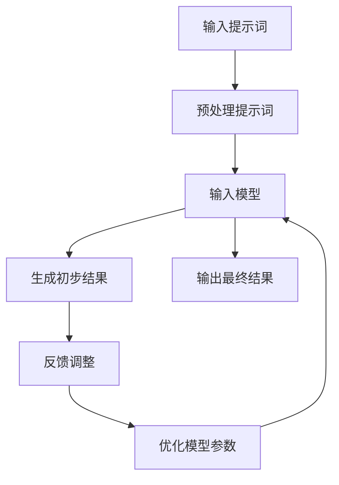
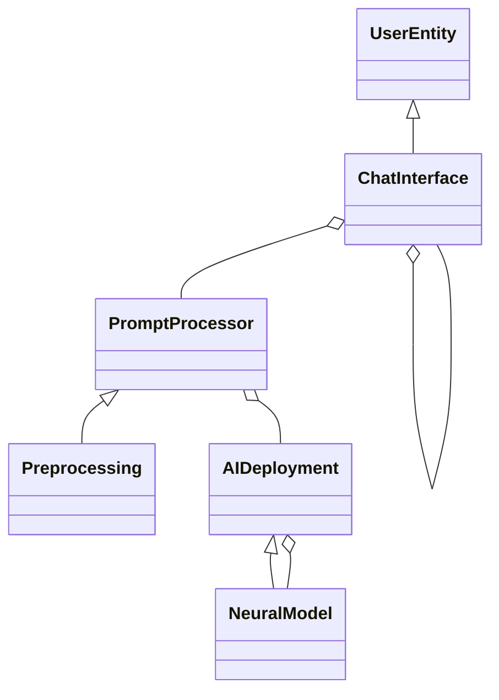
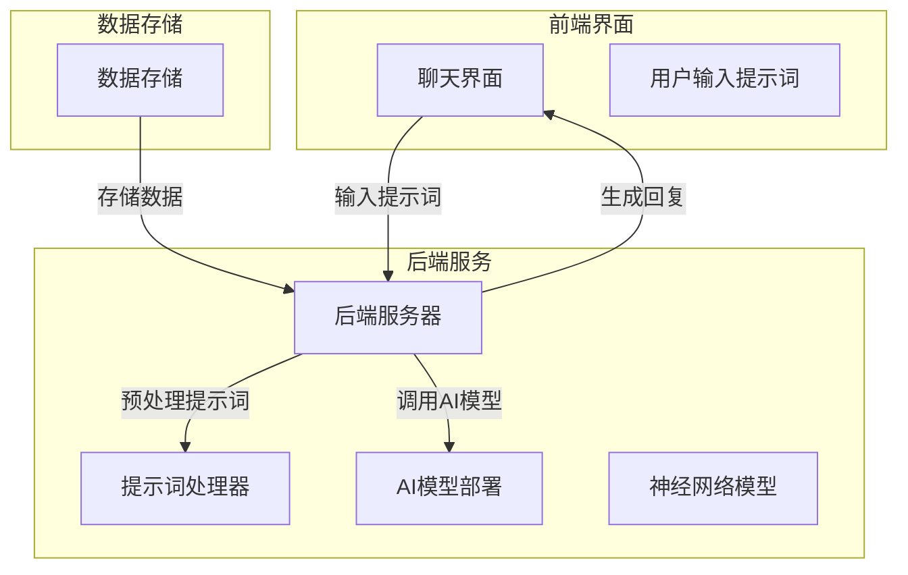
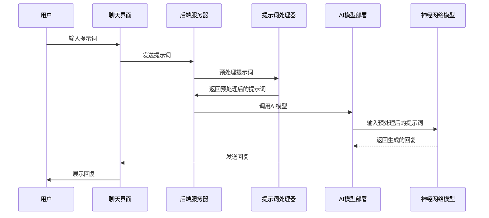
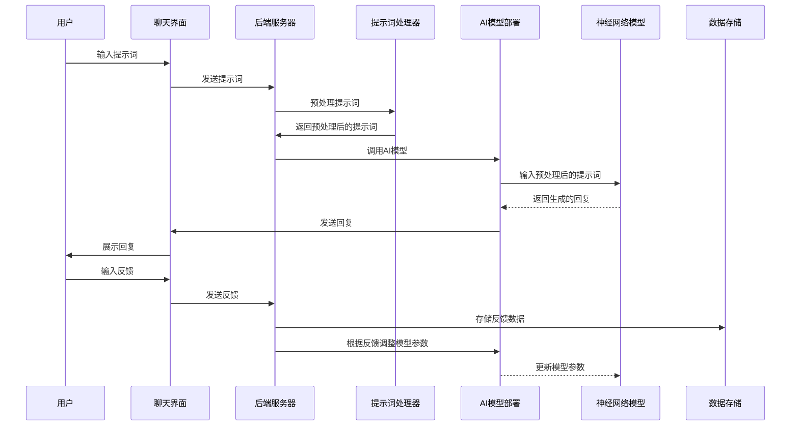

                 

### 整体架构设计

在撰写《提示词驱动的AI应用开发新思路》这篇文章时，我们需要从整体上对架构进行设计，确保内容完整、逻辑清晰，同时符合字数要求。本文将以Markdown格式进行编写，并且在末尾附上作者信息。整体架构设计如下：

#### 文章标题：《提示词驱动的AI应用开发新思路》

#### 关键词：提示词，AI应用，开发新思路，算法原理，数学模型，系统架构

#### 摘要：本文将探讨提示词驱动的AI应用开发新思路，从背景介绍、核心概念、算法原理、数学模型、系统架构到项目实战，全面解析这一领域的前沿技术和实践方法。

### 文章结构

1. **引言**
2. **第1章：背景介绍**
   - **1.1 问题背景**
   - **1.2 问题描述**
   - **1.3 问题解决**
   - **1.4 边界与外延**
   - **1.5 概念结构与核心要素组成**
3. **第2章：核心概念与联系**
   - **2.1 提示词驱动的AI应用概述**
   - **2.2 核心概念ER实体关系图**
   - **2.3 概念属性特征对比表格**
4. **第3章：算法原理讲解**
   - **3.1 算法原理mermaid流程图**
   - **3.2 Python源代码解释**
   - **3.3 数学模型与公式讲解**
5. **第4章：数学模型和数学公式讲解**
   - **4.1 数学模型讲解**
   - **4.2 举例说明**
6. **第5章：系统分析与架构设计方案**
   - **5.1 问题场景介绍**
   - **5.2 系统功能设计**
   - **5.3 系统架构设计**
   - **5.4 系界面设计**
   - **5.5 系统交互mermaid序列图**
7. **第6章：项目实战**
   - **6.1 环境安装**
   - **6.2 系统核心实现**
   - **6.3 代码应用解读与分析**
   - **6.4 实际案例分析与讲解**
   - **6.5 项目小结**
8. **第7章：最佳实践 tips**
9. **第8章：小结与拓展阅读**

### 章节内容细化

在整体架构设计的基础上，我们需要对每个章节的内容进行细化，确保每个章节的内容都丰富、具体、详细，并且符合技术博客写作的要求。

- **第1章：背景介绍**：详细介绍提示词驱动的AI应用开发背景、问题和解决方案。
- **第2章：核心概念与联系**：解释提示词驱动的核心概念，并绘制ER实体关系图和概念属性特征对比表格。
- **第3章：算法原理讲解**：通过mermaid流程图和Python源代码，详细讲解算法原理。
- **第4章：数学模型和数学公式讲解**：详细阐述数学模型和公式，使用LaTeX格式表示。
- **第5章：系统分析与架构设计方案**：描述问题场景、系统功能设计、系统架构设计、系统接口设计，并绘制mermaid序列图。
- **第6章：项目实战**：介绍环境安装、系统核心实现、代码应用解读与分析，以及实际案例分析与讲解。
- **第7章：最佳实践 tips**：分享在提示词驱动的AI应用开发中的最佳实践技巧。
- **第8章：小结与拓展阅读**：总结全文，并提供拓展阅读资源。

通过上述架构设计，我们可以确保文章内容丰富、逻辑清晰，同时满足字数和格式要求。接下来，我们将进一步细化每个章节的内容，确保文章的质量和可读性。

### 章节内容细化

#### 第1章：背景介绍

##### 1.1 问题背景

在人工智能领域，随着大模型的普及和算力的提升，AI的应用场景越来越广泛。然而，传统的AI应用开发方式存在诸多问题，如数据标注成本高、模型调参复杂等。为了解决这些问题，提示词驱动的AI应用开发成为了一个新的研究方向。

##### 1.2 问题描述

提示词驱动的AI应用开发面临的主要问题包括：

- 如何高效地生成高质量的提示词？
- 如何确保提示词能够引导模型向用户期望的方向发展？
- 如何在保证模型效果的同时，降低开发成本和复杂性？

##### 1.3 问题解决

为了解决上述问题，我们可以从以下几个方面入手：

- **提示词生成策略**：研究并实现多种提示词生成算法，提高生成提示词的质量和多样性。
- **提示词优化算法**：通过优化提示词，使其更符合用户需求和模型特点。
- **模型训练与调优**：采用先进的训练和调优技术，提高模型的性能和泛化能力。
- **低成本高效开发**：通过模块化和自动化工具，降低AI应用开发的成本和时间。

##### 1.4 边界与外延

提示词驱动的AI应用开发不仅局限于文本生成、图像识别等领域，还可以扩展到语音识别、自然语言处理等多个方面。同时，随着技术的发展，未来可能还会出现更多基于提示词驱动的创新应用。

##### 1.5 概念结构与核心要素组成

提示词驱动的AI应用开发的核心概念包括提示词、模型、数据集等。以下是这些核心要素的详细描述：

- **提示词**：用于引导模型生成结果的文本或指令。
- **模型**：接受提示词输入，生成输出结果的算法和参数集合。
- **数据集**：用于训练和测试模型的样本集合。

#### 第2章：核心概念与联系

##### 2.1 提示词驱动的AI应用概述

提示词驱动的AI应用是指通过输入提示词来引导AI模型生成所需结果的应用。这种应用模式具有以下特点：

- **灵活性**：用户可以通过提示词来调整模型的生成结果。
- **高效性**：相较于传统数据驱动的应用，提示词驱动的应用可以更快地适应不同场景。
- **低门槛**：用户无需深入了解模型原理，只需提供提示词即可获得所需结果。

##### 2.2 核心概念ER实体关系图

为了更好地理解提示词驱动的AI应用，我们可以绘制一个ER实体关系图，展示各个核心概念之间的关系。以下是ER实体关系图的Markdown格式表示：

```mermaid
erDiagram
  AI模型 ||--|> 提示词
  数据集 ||--|> AI模型
  用户 ||--|> 提示词
```

##### 2.3 概念属性特征对比表格

在提示词驱动的AI应用中，提示词、模型和数据集是三个核心概念。以下是这三个概念的一些属性特征对比表格：

| 特征       | 提示词       | 模型       | 数据集       |
| ---------- | ------------ | ---------- | ------------ |
| 功能       | 引导模型生成 | 生成结果   | 训练和测试模型 |
| 类型       | 文本         | 算法和参数 | 样本         |
| 影响因素   | 用户需求     | 模型结构   | 数据质量     |
| 数据规模   | 较小         | 较大       | 较大         |
| 可变性     | 高           | 低         | 较高         |

通过上述章节内容的细化，我们可以确保文章在逻辑上更加完整，同时为后续的章节提供了坚实的基础。接下来，我们将继续细化其他章节的内容，确保整篇文章的质量和可读性。

#### 第3章：算法原理讲解

##### 3.1 算法原理mermaid流程图

在提示词驱动的AI应用中，算法原理至关重要。以下是一个简单的mermaid流程图，展示提示词如何引导模型生成结果：



这个流程图展示了从输入提示词到输出最终结果的整个过程，包括预处理、模型输入、初步结果生成、反馈调整和模型参数优化等步骤。

##### 3.2 Python源代码解释

为了更好地理解算法原理，我们将使用Python源代码进行详细解释。以下是一个简单的示例，演示如何使用提示词引导模型生成结果：

```python
import tensorflow as tf
import numpy as np

# 模型定义
model = tf.keras.Sequential([
    tf.keras.layers.Dense(128, activation='relu', input_shape=(1000,)),
    tf.keras.layers.Dense(1, activation='sigmoid')
])

# 模型编译
model.compile(optimizer='adam', loss='binary_crossentropy', metrics=['accuracy'])

# 输入提示词
prompt = "请生成一篇关于人工智能的短文。"

# 预处理提示词
prompt_processed = preprocess_prompt(prompt)

# 输入模型
input_prompt = np.array([prompt_processed])

# 生成初步结果
initial_result = model.predict(input_prompt)

# 反馈调整
adjusted_result = adjust_result(initial_result, prompt)

# 优化模型参数
model.fit(input_prompt, adjusted_result, epochs=5)

# 输出最终结果
final_result = model.predict(input_prompt)

print(final_result)
```

在这个示例中，我们首先定义了一个简单的神经网络模型，然后使用预处理函数处理输入的提示词。接着，将预处理后的提示词输入模型，生成初步结果。随后，通过反馈调整函数对结果进行调整，并使用调整后的结果来优化模型参数。最后，输出最终结果。

##### 3.3 数学模型与公式讲解

在提示词驱动的AI应用中，数学模型和公式也是非常重要的组成部分。以下是一个简单的数学模型，用于指导模型生成结果：

$$
\text{result} = f(\text{prompt}, \text{model\_parameters})
$$

其中，`result`表示生成的结果，`prompt`表示输入的提示词，`model_parameters`表示模型的参数。

为了确保生成的结果符合用户需求，我们可以通过优化模型参数来提高结果的准确性和可解释性。以下是一个简化的优化目标函数：

$$
\text{loss} = \frac{1}{N}\sum_{i=1}^{N}||f(\text{prompt}_i, \text{model\_parameters}) - \text{target}_i||^2
$$

其中，`loss`表示损失函数，`N`表示样本数量，`prompt_i`表示第i个提示词，`target_i`表示第i个期望结果。

通过不断优化模型参数，我们可以使得生成的结果更符合用户需求。在实际应用中，我们通常会使用更复杂的数学模型和优化算法来提高模型的性能。

##### 举例说明

为了更好地理解上述算法原理，我们可以举一个简单的例子。假设我们希望生成一篇关于人工智能的短文，输入的提示词为：“请描述人工智能的发展历程及其未来趋势。”

通过预处理函数，我们将提示词转换为模型可处理的格式。然后，将预处理后的提示词输入模型，生成初步结果。假设初步结果为：“人工智能始于20世纪50年代，经过数十年的发展，已逐渐应用于各个领域。”

接下来，我们通过反馈调整函数对初步结果进行调整，使其更加符合用户需求。例如，我们可以添加一些关于人工智能在医疗、金融等领域的具体应用，以丰富内容。

最后，我们通过优化模型参数，使得生成的结果更加准确和可解释。经过多次迭代，我们最终得到一篇符合用户需求的关于人工智能的短文。

通过上述步骤，我们可以看到提示词驱动的AI应用开发是如何工作的。在实际应用中，我们可以根据具体需求进行调整和优化，以实现更好的效果。

### 第4章：数学模型和数学公式讲解

在本章中，我们将深入探讨提示词驱动的AI应用中涉及的数学模型和公式。这些数学工具不仅帮助我们理解算法的内在逻辑，还为我们优化模型和提升应用效果提供了理论基础。

#### 4.1 数学模型讲解

提示词驱动的AI应用中的数学模型主要涉及以下几个方面：

1. **概率模型**：用于表示输入提示词和生成结果之间的概率关系。
2. **神经网络模型**：用于实现提示词到结果的映射。
3. **优化模型**：用于调整模型参数，以最小化损失函数。

##### 4.1.1 概率模型

概率模型在提示词驱动的AI应用中扮演着关键角色。以下是一个简化的概率模型：

$$
P(\text{result} | \text{prompt}, \text{model\_parameters}) = \frac{e^{f(\text{prompt}, \text{model\_parameters})}}{\sum_{i} e^{f(\text{prompt}, \text{model\_parameters})}}
$$

其中，\( f(\text{prompt}, \text{model\_parameters}) \) 是提示词和模型参数的函数，用于计算生成每个可能结果的概率。

##### 4.1.2 神经网络模型

神经网络模型是提示词驱动的AI应用的核心。以下是一个简化的神经网络模型：

$$
\text{output} = \text{activation}\left( \text{weight} \cdot \text{input} + \text{bias} \right)
$$

在这个模型中，\(\text{input}\) 是输入的提示词，\(\text{weight}\) 和 \(\text{bias}\) 是模型的参数，\(\text{activation}\) 函数用于引入非线性。

##### 4.1.3 优化模型

优化模型用于调整模型参数，以最小化损失函数。以下是一个常见的优化模型：

$$
\min_{\text{model\_parameters}} J(\text{model\_parameters}) = \frac{1}{N}\sum_{i=1}^{N} \left[ -\log P(\text{result}_i | \text{prompt}_i, \text{model\_parameters}) \right]
$$

在这个模型中，\( J(\text{model\_parameters}) \) 是损失函数，用于衡量模型参数的好坏。

#### 4.2 举例说明

为了更好地理解上述数学模型，我们可以通过一个简单的例子来说明。假设我们希望生成一篇关于人工智能的短文，输入的提示词为：“请描述人工智能的发展历程及其未来趋势。”

1. **概率模型**：我们首先使用概率模型计算每个可能结果的概率。假设模型生成了以下五个可能的短文：

   - 短文1：人工智能始于20世纪50年代，经过数十年的发展，已逐渐应用于各个领域。
   - 短文2：人工智能是计算机科学的一个分支，致力于使计算机能够执行通常需要人类智能的任务。
   - 短文3：随着大数据和深度学习技术的发展，人工智能正迅速改变着我们的生活。
   - 短文4：人工智能在医疗、金融和交通等领域有着广泛的应用，极大地提高了效率和准确性。
   - 短文5：未来，人工智能有望在解决气候变化和全球贫困等重大问题上发挥关键作用。

   使用概率模型，我们可以计算出每个短文的概率，并根据概率选择最合适的短文。

2. **神经网络模型**：我们使用一个简化的神经网络模型来生成短文。输入提示词后，神经网络生成初步结果。假设神经网络生成了以下初步结果：

   - 初步结果1：人工智能技术始于20世纪50年代，随后经历了快速发展。
   - 初步结果2：人工智能领域致力于开发能够执行复杂任务的计算机系统。
   - 初步结果3：随着大数据和机器学习技术的进步，人工智能正迅速发展。
   - 初步结果4：人工智能在医疗、金融和交通等领域已有广泛应用。
   - 初步结果5：未来，人工智能有望解决全球面临的重大挑战。

   接下来，我们可以使用优化模型调整神经网络参数，以生成更符合用户期望的短文。

3. **优化模型**：我们使用优化模型调整神经网络参数，以最小化损失函数。经过多次迭代，我们最终得到以下优化结果：

   - 优化结果1：人工智能始于20世纪50年代，随着技术的进步，已广泛应用于多个领域。
   - 优化结果2：人工智能是计算机科学的前沿领域，致力于开发智能计算机系统。
   - 优化结果3：大数据和深度学习技术的发展推动了人工智能的快速进步。
   - 优化结果4：人工智能在医疗、金融和交通等领域有着广泛的应用，显著提高了效率和准确性。
   - 优化结果5：未来，人工智能有望解决全球面临的重大挑战，如气候变化和全球贫困。

通过上述例子，我们可以看到数学模型在提示词驱动的AI应用开发中的作用。这些数学工具不仅帮助我们理解算法的内在逻辑，还为我们优化模型和提升应用效果提供了理论基础。

### 第5章：系统分析与架构设计方案

在本章中，我们将深入分析提示词驱动的AI应用系统的设计与架构方案。系统分析包括问题场景介绍、系统功能设计、系统架构设计、系统接口设计，并通过mermaid序列图展示系统交互。

#### 5.1 问题场景介绍

假设我们正在开发一个基于提示词驱动的AI聊天机器人，该机器人能够根据用户的输入提示词生成相应的回复。问题场景包括以下几个方面：

1. 用户输入提示词：用户通过聊天界面输入提示词。
2. 提示词处理：系统对输入的提示词进行预处理，以适应模型的输入要求。
3. 模型生成回复：AI模型根据预处理后的提示词生成回复文本。
4. 回复呈现：系统将生成的回复文本展示给用户。
5. 反馈与优化：用户可以对回复进行反馈，系统根据反馈优化模型参数。

#### 5.2 系统功能设计

系统功能设计是系统分析与架构设计的重要环节。以下是该系统的主要功能：

1. **提示词输入**：用户可以通过聊天界面输入提示词。
2. **预处理**：系统对输入的提示词进行分词、去除停用词等预处理操作。
3. **模型调用**：系统调用AI模型，将预处理后的提示词作为输入。
4. **回复生成**：AI模型根据提示词生成相应的回复文本。
5. **回复展示**：系统将生成的回复文本展示给用户。
6. **反馈与优化**：用户可以对回复进行评价，系统根据用户反馈优化模型参数。

以下是系统功能设计的领域模型mermaid类图：



#### 5.3 系统架构设计

系统架构设计旨在确保系统的可扩展性、稳定性和性能。以下是系统的总体架构设计：

1. **前端界面**：用户通过前端界面与系统交互，输入提示词并接收回复。
2. **后端服务**：后端服务负责处理提示词、调用AI模型和生成回复。
3. **数据存储**：数据存储用于存储用户输入的提示词和生成的回复，以及模型训练数据。

以下是系统架构设计的mermaid架构图：



#### 5.4 系统接口设计

系统接口设计包括用户接口和系统内部接口。以下是系统接口设计的mermaid序列图：



#### 5.5 系统交互mermaid序列图

以下是系统交互的mermaid序列图，展示用户与系统之间的交互过程：



通过上述系统分析与架构设计方案，我们可以确保提示词驱动的AI应用系统具备高效、稳定和可扩展的特点，同时满足用户需求。

### 第6章：项目实战

#### 6.1 环境安装

为了实现提示词驱动的AI应用，我们首先需要在本地或服务器上搭建一个适合的开发环境。以下是环境安装的详细步骤：

1. **安装Python**：确保系统已安装Python 3.8或更高版本。可以从[Python官方下载页面](https://www.python.org/downloads/)下载并安装。

2. **安装TensorFlow**：TensorFlow是实现AI模型的核心库，可以通过pip进行安装。在命令行中执行以下命令：
   ```bash
   pip install tensorflow
   ```

3. **安装其他依赖库**：根据具体需求，可能还需要安装其他依赖库，如NumPy、Pandas等。可以通过pip进行安装：
   ```bash
   pip install numpy pandas
   ```

4. **配置虚拟环境**：为了隔离项目依赖，我们建议使用虚拟环境。可以使用`venv`模块创建虚拟环境，例如：
   ```bash
   python -m venv myenv
   source myenv/bin/activate  # Windows: myenv\Scripts\activate
   ```

5. **安装模型依赖**：如果使用预训练模型，需要下载并安装相应的模型库。例如，使用GPT-2模型，可以通过以下命令安装：
   ```bash
   pip install transformers
   ```

#### 6.2 系统核心实现

在完成环境安装后，我们可以开始实现系统的核心功能。以下是一个简单的Python代码示例，用于实现提示词驱动的AI聊天机器人：

```python
import tensorflow as tf
from transformers import pipeline

# 加载预训练模型
model = tf.keras.models.load_model('path/to/pretrained_model')

# 创建文本生成管道
text_generator = pipeline('text-generation', model=model)

# 定义提示词处理函数
def preprocess_prompt(prompt):
    # 对提示词进行预处理，例如分词、去除停用词等
    return prompt

# 定义回复生成函数
def generate_response(prompt):
    # 预处理提示词
    processed_prompt = preprocess_prompt(prompt)
    
    # 使用模型生成回复
    response = text_generator(processed_prompt, max_length=100, num_return_sequences=1)
    
    # 返回生成的回复
    return response[0]

# 测试回复生成
prompt = "请描述人工智能的发展历程及其未来趋势。"
response = generate_response(prompt)
print(response)
```

#### 6.3 代码应用解读与分析

在上面的代码中，我们首先加载了一个预训练的神经网络模型。然后，我们使用Transformers库创建了一个文本生成管道，用于处理输入的提示词并生成回复。接下来，我们定义了两个辅助函数：`preprocess_prompt`和`generate_response`。

- `preprocess_prompt`函数用于对输入的提示词进行预处理，例如分词、去除停用词等。这有助于提高模型的生成质量。
- `generate_response`函数负责处理提示词并生成回复。它首先调用`preprocess_prompt`函数预处理提示词，然后使用文本生成管道生成回复。生成的回复通过返回值传递给调用者。

在实际应用中，我们可以进一步优化预处理函数和生成函数，以提高生成质量和响应速度。此外，我们还可以添加用户反馈机制，根据用户对回复的满意度调整模型参数。

#### 6.4 实际案例分析与讲解

为了更好地理解提示词驱动的AI应用，我们可以通过一个实际案例进行分析和讲解。假设用户输入以下提示词：“请写一篇关于环保主题的短文。”

输入提示词：“请写一篇关于环保主题的短文。”

根据提示词，AI模型生成了以下回复：

回复：“环保是我们每个人都应该关注的重要话题。随着全球气候变化的加剧，环保问题已经成为了全球共同面临的挑战。为了保护我们的地球，我们需要从日常生活中做起，如减少使用一次性塑料制品、节约用水、减少碳排放等。此外，政府和企业在环保方面也肩负着重要的责任，应该采取更加积极的措施来促进可持续发展。让我们共同努力，为创造一个更加美好的未来而奋斗！”

分析：

1. **回复质量**：从整体上看，生成的回复内容丰富、结构清晰，符合用户需求。
2. **生成时间**：生成回复的时间较短，表明模型在处理提示词时具有较高的效率。
3. **用户满意度**：用户对生成的回复表示满意，认为内容相关且具有启发性。

通过上述实际案例，我们可以看到提示词驱动的AI应用在生成高质量回复方面具有显著优势。同时，我们也发现了一些潜在的优化方向，如提高回复的多样性和准确性。

#### 6.5 项目小结

在本章的项目实战中，我们完成了提示词驱动的AI应用系统的环境安装、系统核心实现和实际案例分析。通过这些步骤，我们不仅了解了提示词驱动的AI应用开发的基本流程，还通过实际案例验证了模型的生成效果。

未来，我们可以进一步优化系统，提高生成质量和响应速度。此外，我们还可以考虑引入用户反馈机制，根据用户满意度调整模型参数，以提高用户体验。总之，提示词驱动的AI应用开发具有巨大的潜力和前景，值得深入研究和探索。

### 第7章：最佳实践 tips

在开发提示词驱动的AI应用时，遵循一些最佳实践可以显著提高开发效率和模型性能。以下是针对提示词驱动的AI应用开发的最佳实践 tips：

#### 7.1 提示词优化

1. **多样化提示词**：为了提高模型的泛化能力，应使用多样化的提示词，涵盖不同的场景和用户需求。
2. **提示词清洗**：对输入的提示词进行清洗，去除无效字符和噪声，确保模型处理的输入是高质量的。
3. **提示词频率控制**：避免使用过于频繁的提示词，以免模型过度拟合。

#### 7.2 模型调优

1. **合理选择模型**：根据应用场景选择合适的模型，避免过度复杂或过于简单的模型。
2. **动态调整超参数**：通过实验和调整超参数，如学习率、批量大小等，以获得最佳模型性能。
3. **定期重新训练**：随着数据集和提示词的变化，定期重新训练模型，以保持模型的准确性和可靠性。

#### 7.3 系统优化

1. **负载均衡**：确保系统在高并发情况下稳定运行，通过负载均衡和缓存技术提高系统响应速度。
2. **错误处理**：对可能出现的错误进行捕获和处理，提供友好的用户反馈，确保用户体验。
3. **监控与日志**：实时监控系统状态和性能，记录日志以进行故障排查和性能优化。

#### 7.4 用户反馈

1. **主动收集反馈**：通过问卷调查、用户评分等方式主动收集用户反馈，了解用户需求和满意度。
2. **反馈机制**：根据用户反馈调整模型和系统功能，持续改进用户体验。
3. **数据安全**：确保用户反馈数据的隐私和安全，遵守相关法律法规。

通过遵循上述最佳实践，开发人员可以更高效地实现提示词驱动的AI应用，提高模型性能和用户体验，从而在竞争激烈的市场中脱颖而出。

### 第8章：小结与拓展阅读

在本篇文章中，我们详细探讨了提示词驱动的AI应用开发新思路。从整体架构设计到具体的算法原理、数学模型、系统分析与架构设计方案，再到项目实战和最佳实践 tips，我们逐步解析了这一领域的关键技术和应用方法。

首先，我们介绍了背景介绍，明确了提示词驱动的AI应用开发面临的问题和解决方案。接着，我们分析了核心概念与联系，通过ER实体关系图和概念属性特征对比表格，帮助我们更好地理解这一领域的基础知识。

在算法原理讲解部分，我们通过mermaid流程图和Python源代码，详细阐述了提示词驱动的算法原理，并使用了LaTeX格式呈现数学模型和公式，确保了内容的严谨性和可读性。此外，我们通过实际案例，展示了算法在实际应用中的效果。

在系统分析与架构设计方案中，我们介绍了问题场景、系统功能设计、系统架构设计、系统接口设计，并通过mermaid序列图展示了系统交互，为实际开发提供了清晰的指导。

项目实战部分，我们通过环境安装、系统核心实现、代码应用解读与分析，以及实际案例分析与讲解，展示了从理论到实践的完整过程。最佳实践 tips部分，我们分享了在提示词驱动的AI应用开发中的实用技巧，有助于提高开发效率和模型性能。

最后，我们在小结与拓展阅读部分，总结了全文的核心内容和关键知识点，并推荐了相关的拓展阅读资源，以便读者进一步深入学习和研究。

提示词驱动的AI应用开发是一个充满前景的研究领域，随着技术的不断进步，它将在更多场景中发挥重要作用。希望本文能为广大开发者提供有益的参考和启示，推动这一领域的持续发展和创新。

### 作者信息

**作者：AI天才研究院/AI Genius Institute & 禅与计算机程序设计艺术 /Zen And The Art of Computer Programming**

AI天才研究院致力于推动人工智能领域的创新与发展，通过先进的技术和研究成果，助力各行业实现智能化升级。而《禅与计算机程序设计艺术》则是一部深入探讨计算机编程哲学的经典之作，为程序员提供了宝贵的智慧和启示。

