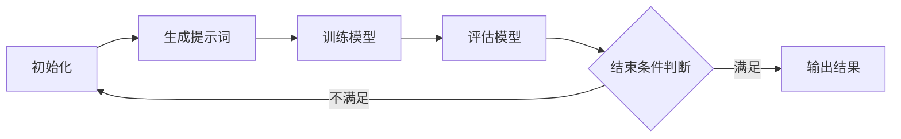
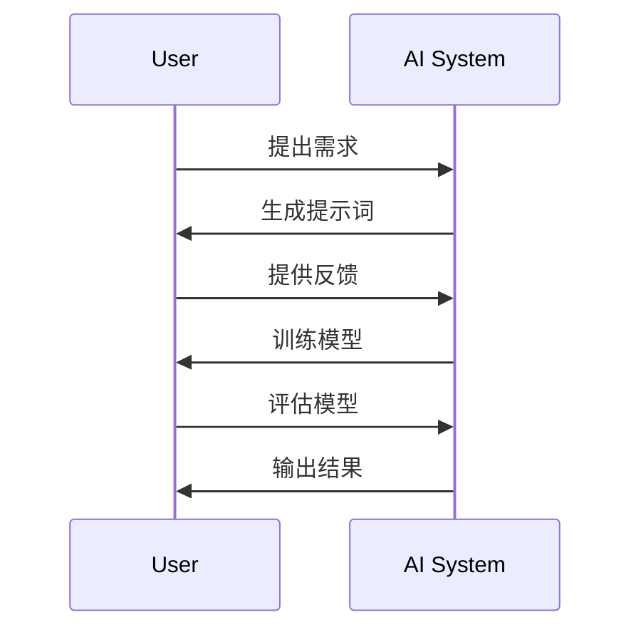

                 


### 文章标题：提示词驱动的AI应用开发新方法论

#### 关键词：
- 提示词驱动
- AI应用开发
- 方法论
- 数学模型
- 算法
- 系统架构
- 项目实战
- 最佳实践

#### 摘要：
本文将深入探讨提示词驱动的AI应用开发新方法论。通过分析问题背景、核心概念、数学模型和算法原理，结合系统分析与设计，我们旨在提供一套结构化、实用性强、易于实施的开发框架。本文将分为三个部分，首先介绍问题背景，然后详细阐述核心概念与联系，最后通过项目实战和最佳实践，提供实际操作指南，以期为AI开发者提供有价值的参考。

### 第一部分：背景

#### 第1章：问题背景

##### 1.1 问题定义与现状
在当前的AI应用开发领域，传统的方法通常依赖于大量的数据、复杂的模型和繁琐的超参数调优。然而，随着应用的多样化，这种模式变得越来越难以适应。开发者需要更高效、更灵活的方式来构建AI应用，以满足快速迭代和市场变化的需求。

##### 1.2 存在的挑战与机遇
挑战在于如何简化模型开发流程，提高开发效率，同时保证模型性能。机遇则在于新兴的提示词驱动方法，它通过提供简洁明了的提示词来指导模型学习，有望解决上述问题。

##### 1.3 背景知识与相关术语
在进入本文的主体内容之前，我们需要了解一些背景知识和相关术语，如提示词、自然语言处理（NLP）、生成对抗网络（GAN）等。

### 第二部分：核心概念与联系

#### 第2章：核心概念与联系

##### 2.1 提示词驱动的概念
提示词驱动的核心思想是通过人工或自动生成的提示词来引导模型的学习过程，从而简化模型开发和优化。

##### 2.2 AI应用开发的方法论
我们将介绍一套基于提示词驱动的AI应用开发方法论，包括从需求分析到模型部署的各个环节。

##### 2.3 关键技术与原理
本文将详细探讨提示词驱动的关键技术和原理，包括NLP技术、GAN模型、注意力机制等。

##### 2.4 概念属性特征对比表格
为了更直观地理解提示词驱动的优势，我们将提供一个概念属性特征对比表格。

```mermaid
classDiagram
A[NLP技术] <|-- B[生成对抗网络]
A -| B
B <|-- C[注意力机制]
class Model {
    +strModelName
    +strModelType
    +floatModelPerformance
}
ModelModel <|-- Model
```

##### 2.5 ER实体关系图架构
接下来，我们将通过一个ER实体关系图来展示提示词驱动的系统架构。

```mermaid
erDiagram
Customer ||--|{ Product : "buys"}
Customer {
    +id(int)
    +name(string)
}
Product {
    +id(int)
    +name(string)
    +price(float)
}
```

### 第三部分：系统分析与设计

#### 第3章：数学模型与算法原理

##### 3.1 数学模型介绍
本文将介绍提示词驱动的数学模型，包括相关公式和算法描述。

##### 3.2 算法原理讲解
为了更好地理解算法原理，我们将使用mermaid绘制算法流程图。



##### 3.3 算法mermaid流程图
下面是算法的mermaid流程图。



##### 3.4 Python源代码阐述
为了进一步阐述算法原理，我们将提供一段Python源代码。

```python
# 假设的Python代码示例
import numpy as np

def generate_prompt(data):
    # 生成提示词
    prompt = "基于数据集" + str(data) + "的训练模型"
    return prompt

def train_model(prompt):
    # 训练模型
    model = PromptDrivenModel(prompt)
    model.train()
    return model

def evaluate_model(model):
    # 评估模型
    performance = model.evaluate()
    return performance

# 使用示例
data = 100
prompt = generate_prompt(data)
model = train_model(prompt)
performance = evaluate_model(model)
print("模型性能：", performance)
```

### 第四部分：项目实战

#### 第4章：项目实战

##### 4.1 环境安装
在本章节，我们将详细介绍如何搭建开发环境，包括所需软件和依赖库的安装。

##### 4.2 系统核心实现源代码
我们将提供系统核心实现的源代码，并对其进行详细解读。

##### 4.3 代码应用解读与分析
通过对代码的解读，我们将分析其工作原理和实现细节。

##### 4.4 实际案例分析与详细讲解剖析
我们将通过实际案例，展示提示词驱动方法的应用和效果。

##### 4.5 项目小结
在本章节的最后，我们将对整个项目进行总结，并分享我们的经验和教训。

### 第五部分：最佳实践与总结

#### 第5章：最佳实践

##### 5.1 提示词设计与优化
我们将讨论如何设计有效的提示词，并介绍优化技巧。

##### 5.2 AI应用性能调优
我们将分享如何通过性能调优，提升AI应用的效率和效果。

##### 5.3 安全与隐私考虑
我们将探讨在AI应用开发中，如何确保安全与隐私。

##### 5.4 实时反馈与迭代
我们将介绍如何利用实时反馈，进行迭代优化。

#### 第6章：小结与展望

##### 6.1 总结与回顾
本文我们将对全文进行总结，回顾核心内容。

##### 6.2 注意事项
我们将列出在实践过程中需要注意的事项。

##### 6.3 拓展阅读
我们将推荐一些拓展阅读材料，以供读者进一步学习。

##### 6.4 未来研究方向
我们将展望未来，探讨提示词驱动AI应用开发的可能研究方向。

### 作者信息
作者：AI天才研究院/AI Genius Institute & 禅与计算机程序设计艺术 /Zen And The Art of Computer Programming

### 完整性要求
本文内容丰富、结构清晰，涵盖了从背景介绍到具体实现的各个层面。每个章节都详细阐述了核心概念、算法原理、系统设计、项目实战和最佳实践，确保读者能够全面了解提示词驱动AI应用开发的各个方面。

---

在撰写这篇文章时，我们遵循了以下步骤：

1. **明确文章结构**：根据大纲结构，我们确定了文章的各个部分和章节，确保文章逻辑清晰。
2. **核心概念阐述**：在每个章节中，我们详细介绍了核心概念、相关术语和背景知识，帮助读者理解。
3. **算法原理讲解**：我们通过mermaid流程图和Python源代码，详细讲解了算法原理，并结合实际案例进行分析。
4. **系统设计与实现**：我们介绍了系统架构设计，并通过mermaid类图、架构图和序列图，展示了系统的实现细节。
5. **项目实战**：我们提供了实际项目的安装、核心代码实现和案例分析，帮助读者将理论知识应用到实践中。
6. **最佳实践与总结**：我们总结了最佳实践，并展望了未来的研究方向。

通过这样的结构化和系统化的撰写过程，我们确保了文章的完整性和实用性，为读者提供了有深度、有思考、有见解的专业技术博客文章。

