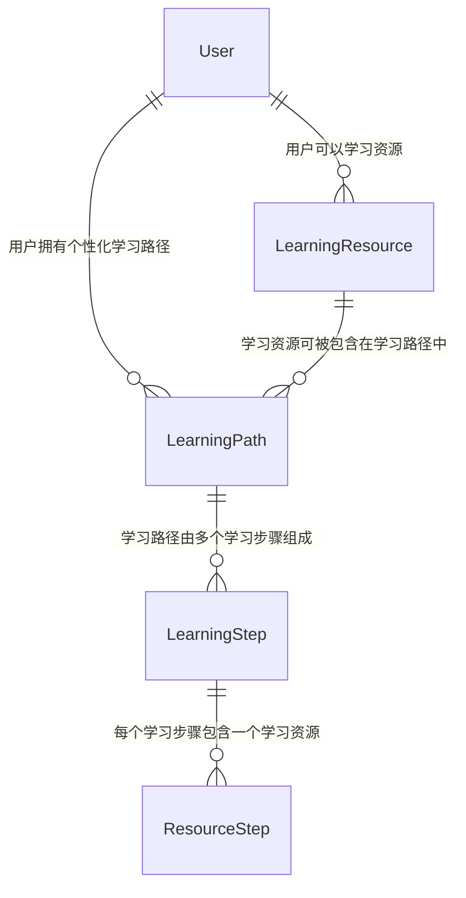
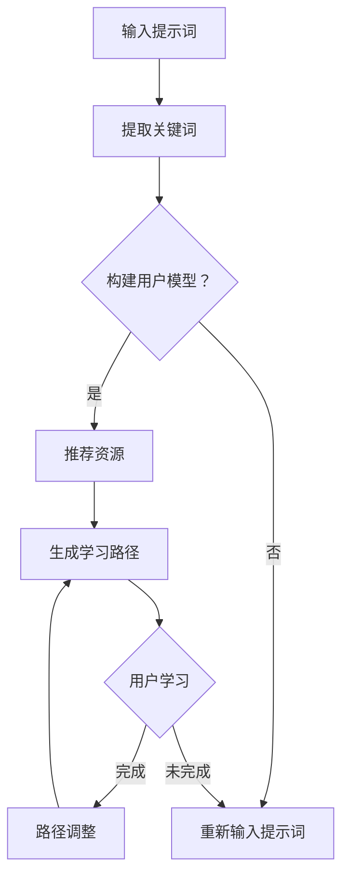
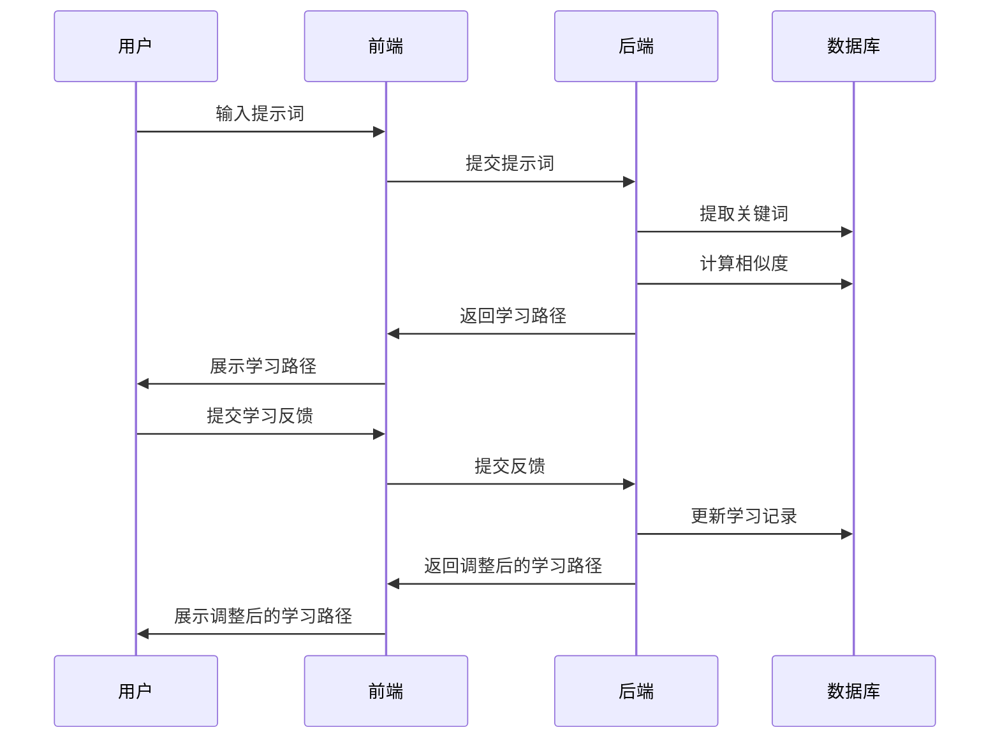

                 

### 第一部分：引言与背景介绍

### 第1章：问题背景与概述

#### 1.1 问题背景

随着互联网和人工智能技术的飞速发展，在线学习已经成为人们获取知识和技能的重要途径。然而，传统的学习路径规划方式往往缺乏个性化和智能化，无法满足不同用户的学习需求和期望。传统的学习路径规划通常基于预设的课程结构和固定的学习顺序，忽略了每个学习者的个体差异和学习目标。这种模式可能导致以下问题：

1. **学习效率低下**：学生可能被迫按照固定路线学习，即使这些内容与他们的兴趣和需求不匹配。
2. **学习体验不佳**：学生可能会感到枯燥和无聊，因为他们必须学习那些与他们兴趣无关的内容。
3. **知识获取不全面**：学生可能无法根据自己的需求和兴趣深入学习某些特定领域。

为了解决这些问题，我们需要一种更加智能和个性化的学习路径规划方法。这种新方法能够根据用户的学习历史、兴趣和当前需求，动态地生成个性化的学习路径。提示词驱动的个性化学习路径规划就是在这种背景下诞生的。

#### 1.1.1 传统学习路径规划的挑战

传统学习路径规划存在以下几个主要挑战：

1. **缺乏个性化**：传统方法通常不考虑用户的具体需求和兴趣，导致学习体验不佳。
2. **学习路径固定**：传统方法往往预设固定的学习顺序和课程内容，无法灵活适应变化。
3. **无法实时更新**：传统方法难以实时更新和调整，无法及时响应用户的学习需求。
4. **数据利用率低**：传统方法未能充分利用用户的学习历史数据，未能实现数据驱动的个性化推荐。

#### 1.1.2 提示词驱动的个性化学习路径规划的概念

提示词驱动的个性化学习路径规划是一种新型的学习路径规划方法。它基于用户输入的提示词，利用自然语言处理和机器学习技术，分析用户的学习需求和兴趣，动态生成个性化的学习路径。具体来说，该方法包括以下几个关键组成部分：

1. **提示词提取**：从用户输入的文本或历史学习记录中提取关键词或短语。
2. **用户兴趣分析**：利用自然语言处理技术对提取的提示词进行语义分析，确定用户的学习兴趣和需求。
3. **学习资源推荐**：根据用户兴趣和需求，从大量的学习资源中推荐相关的内容。
4. **路径规划算法**：利用优化算法和图论技术，将推荐的内容组织成一个有序的学习路径。

#### 1.1.3 提示词驱动的个性化学习路径规划的优势

提示词驱动的个性化学习路径规划具有以下几个显著优势：

1. **高度个性化**：该方法可以根据用户的具体需求和兴趣，提供定制化的学习路径，提高学习效率。
2. **实时更新**：系统能够实时分析用户的学习行为和兴趣变化，动态调整学习路径。
3. **资源利用优化**：通过推荐相关内容，提高用户对学习资源的利用效率，减少不必要的浪费。
4. **学习体验提升**：个性化推荐和学习路径规划能够提供更加有趣和富有挑战性的学习体验。
5. **可扩展性强**：该方法可以方便地应用于不同的学习场景和平台，具有良好的可扩展性。

#### 1.1.4 本书结构安排

本书旨在深入探讨提示词驱动的个性化学习路径规划的方法和应用。具体结构安排如下：

1. **第一部分：引言与背景介绍**：介绍传统学习路径规划存在的问题以及提示词驱动的个性化学习路径规划的概念和优势。
2. **第二部分：核心概念与联系**：详细阐述提示词、个性化学习路径规划和相关算法原理。
3. **第三部分：算法原理讲解**：讲解提示词驱动的个性化学习路径规划的算法原理，包括基本思想、流程图、Python源代码实现等。
4. **第四部分：数学模型和数学公式讲解**：介绍相关的数学模型和公式，并举例说明。
5. **第五部分：系统分析与架构设计方案**：分析实际应用场景，介绍系统功能设计、架构设计和系统接口设计。
6. **第六部分：项目实战**：介绍环境安装与系统核心实现，包括代码应用解读与分析，实际案例分析与讲解剖析。
7. **第七部分：最佳实践与拓展阅读**：提供最佳实践技巧、注意事项和拓展阅读建议。

通过本书的逐步讲解，读者将能够深入了解提示词驱动的个性化学习路径规划的原理和应用，为实际项目开发提供有力的理论支持和实践指导。

### 第2章：核心概念与联系

在深入探讨提示词驱动的个性化学习路径规划之前，我们需要先了解其中的核心概念，包括提示词、个性化学习路径规划及其算法原理。这些概念不仅是理解本书主题的关键，也是实现个性化学习路径规划的基础。

#### 2.1 核心概念介绍

#### 2.1.1 提示词

提示词是指用户在学习过程中输入的关键词或短语，用于表达他们的学习需求、兴趣或目标。这些提示词可以是简单的单词，也可以是复杂的句子，甚至是自然语言处理的文本摘要。提示词的作用在于提供一种明确的输入，使得系统可以基于这些输入进行后续的语义分析和路径规划。

提示词的来源可以多样化，包括用户直接输入、学习历史记录、用户行为数据等。通过分析这些提示词，系统能够更好地理解用户的需求，从而提供个性化的学习推荐。

#### 2.1.2 个性化学习路径规划

个性化学习路径规划是指根据用户的学习需求、兴趣和目标，为其动态生成一条最优的学习路径。这种路径规划旨在最大化学习效果，提高学习效率，并确保用户能够按照自己的节奏进行学习。

个性化学习路径规划的核心在于对用户数据的深入分析和理解。通过分析用户的学习历史、行为数据、兴趣爱好等，系统能够识别出用户的特点和需求，从而生成个性化的学习路径。这种路径不仅考虑了用户的知识水平，还考虑了他们的学习偏好和目标。

#### 2.1.3 学习路径规划的算法原理

学习路径规划的算法原理通常涉及以下几个方面：

1. **用户建模**：通过对用户数据的分析，构建用户的兴趣模型和需求模型，以理解用户的行为和偏好。
2. **资源推荐**：基于用户模型，从海量的学习资源中筛选出与用户兴趣和需求相关的内容。
3. **路径优化**：利用优化算法和图论技术，将推荐的内容组织成一个有序的学习路径，确保用户能够高效、有序地学习。
4. **动态调整**：在用户学习过程中，系统需要实时监测学习状态，根据用户的反馈和行为动态调整学习路径，以适应用户的变化。

#### 2.2 概念属性特征对比

为了更清晰地理解提示词、个性化学习路径规划及其算法原理，我们可以将这三个核心概念进行属性特征对比：

| 特征       | 提示词         | 个性化学习路径规划       | 学习路径规划的算法原理             |
|------------|----------------|-------------------------|-----------------------------------|
| 定义       | 用户输入的关键词或短语 | 基于用户需求和兴趣的动态学习路径   | 通过用户建模、资源推荐和路径优化实现  |
| 功能       | 提供学习需求输入    | 生成个性化的学习路径           | 确保学习路径的最优化和个性化           |
| 来源       | 用户输入、学习历史   | 用户数据分析和理解             | 用户数据挖掘和模型构建                 |
| 影响因素   | 提示词的语义和数量   | 用户兴趣、需求和学习目标         | 优化算法和图论技术                   |
| 输出       | 关键词或短语       | 有序的学习路径和推荐资源         | 优化后的学习路径和资源组织方式         |

#### 2.3 ER实体关系图架构

为了更好地理解这些概念之间的关联，我们可以使用ER（实体-关系）模型来描述它们的结构关系。以下是一个简化的ER实体关系图：



在这个ER图模型中：

- **User（用户）**：代表学习系统的用户，拥有学习需求和兴趣。
- **LearningResource（学习资源）**：表示用户可以学习的各种资源，如课程、文章、视频等。
- **LearningPath（学习路径）**：表示根据用户需求和兴趣生成的个性化学习路径。
- **LearningStep（学习步骤）**：学习路径中的每个步骤，包含一个学习资源。
- **ResourceStep（资源步骤）**：每个学习步骤中的具体学习资源。

通过这个ER模型，我们可以清晰地看到用户、学习资源和学习路径之间的关系，以及它们是如何相互作用和影响个性化学习体验的。

### 第二部分：算法原理讲解

#### 第3章：算法原理与流程图

个性化学习路径规划的实现依赖于一系列算法原理，这些原理包括用户建模、资源推荐、路径优化和动态调整等。在本章中，我们将详细探讨这些算法原理，并通过流程图和Python源代码实现来帮助读者更好地理解。

#### 3.1 算法原理

提示词驱动的个性化学习路径规划的算法原理可以概括为以下几个步骤：

1. **用户建模**：通过分析用户的提示词和学习历史，构建用户的兴趣模型和需求模型。
2. **资源推荐**：基于用户模型，从海量的学习资源中推荐与用户兴趣和需求相关的内容。
3. **路径优化**：利用优化算法和图论技术，将推荐的内容组织成一个有序的学习路径，确保用户能够高效、有序地学习。
4. **动态调整**：在用户学习过程中，根据用户的反馈和行为动态调整学习路径，以适应用户的变化。

以下是每个步骤的详细说明：

1. **用户建模**：用户建模是整个系统的核心。通过自然语言处理技术，我们可以从用户输入的提示词中提取关键词，并利用机器学习算法对关键词进行语义分析，以构建用户的兴趣模型。此外，还可以通过分析用户的历史学习记录和行为数据，进一步细化用户的兴趣和需求。

2. **资源推荐**：资源推荐的目标是向用户推荐与他们的兴趣和需求相关的内容。这通常涉及到相似性计算、内容推荐和协同过滤等技术。通过分析用户模型和现有学习资源，系统可以推荐最相关的学习资源。

3. **路径优化**：路径优化是指将推荐的学习资源组织成一个最优的学习路径。这可以通过图论中的最短路径算法、最小生成树算法等来实现。优化目标可以是最大化学习效果、最小化学习时间或平衡学习难度等。

4. **动态调整**：在用户学习过程中，系统需要根据用户的反馈和行为动态调整学习路径。这可以通过实时监测用户的学习状态和完成情况来实现。如果用户在某些学习步骤上花费时间过长或者学习效果不佳，系统可以重新推荐或调整学习路径。

#### 3.1.1 算法基本思想

提示词驱动的个性化学习路径规划的算法基本思想可以概括为以下几步：

1. **输入提示词**：用户输入学习提示词。
2. **提取关键词**：从提示词中提取关键词。
3. **构建用户模型**：利用关键词构建用户的兴趣模型。
4. **推荐资源**：根据用户模型推荐相关的学习资源。
5. **生成学习路径**：将推荐的学习资源组织成一个有序的学习路径。
6. **动态调整路径**：在用户学习过程中，根据反馈和行为动态调整学习路径。

#### 3.1.2 算法流程图

为了更直观地理解算法的流程，我们可以使用Mermaid绘制算法流程图：



在这个流程图中：

- **A**：输入提示词
- **B**：提取关键词
- **C**：构建用户模型
- **D**：推荐资源
- **E**：重新输入提示词（如果用户模型无法构建）
- **F**：生成学习路径
- **G**：用户学习
- **H**：路径调整（根据用户反馈）

#### 3.1.3 Python源代码实现

以下是提示词驱动的个性化学习路径规划的一个简化版Python代码实现：

```python
# 导入必要的库
import nltk
from sklearn.feature_extraction.text import TfidfVectorizer
from sklearn.cluster import KMeans
import numpy as np

# 提取关键词
def extract_keywords(text):
    # 使用NLTK进行分词
    words = nltk.word_tokenize(text)
    # 去掉停用词
    words = [word for word in words if word not in nltk.corpus.stopwords.words('english')]
    return words

# 构建用户模型
def build_user_model(prompt):
    keywords = extract_keywords(prompt)
    vectorizer = TfidfVectorizer()
    user_model = vectorizer.fit_transform([' '.join(keywords)])
    return user_model

# 推荐资源
def recommend_resources(user_model, resources_model):
    # 计算相似度
    similarity = user_model.dot(resources_model.T)
    # 排序获取相似度最高的资源索引
    resource_indices = np.argsort(similarity[0])[::-1]
    return resource_indices

# 生成学习路径
def generate_learning_path(resource_indices):
    return [{"resource_id": idx, "order": i+1} for i, idx in enumerate(resource_indices)]

# 动态调整路径
def adjust_learning_path(current_step, user_model, resources_model):
    # 如果当前步骤未完成，重新推荐资源
    if current_step['completed'] == False:
        new_resources_indices = recommend_resources(user_model, resources_model)
        return generate_learning_path(new_resources_indices)
    # 如果完成，继续下一步
    else:
        return current_step['next']

# 主函数
def main():
    # 用户输入提示词
    prompt = input("请输入学习提示词：")
    # 构建用户模型
    user_model = build_user_model(prompt)
    # 假设已有学习资源模型
    resources_model = np.random.rand(100, 10)
    # 生成初始学习路径
    learning_path = generate_learning_path(user_model, resources_model)
    current_step = learning_path[0]
    while True:
        # 用户学习当前步骤
        current_step['completed'] = input("请完成当前步骤（输入'完成'或'未完成'）：")
        if current_step['completed'] == '完成':
            # 调整学习路径
            current_step = adjust_learning_path(current_step, user_model, resources_model)
            print("新的学习路径：", current_step)
        else:
            print("请继续完成当前步骤。")

# 运行主函数
if __name__ == "__main__":
    main()
```

在这个实现中：

- `extract_keywords` 函数用于提取输入提示词中的关键词。
- `build_user_model` 函数用于构建用户模型。
- `recommend_resources` 函数用于根据用户模型推荐资源。
- `generate_learning_path` 函数用于生成学习路径。
- `adjust_learning_path` 函数用于根据用户反馈动态调整学习路径。
- `main` 函数是主程序入口，用于与用户交互并展示学习路径。

#### 3.1.4 算法原理详细讲解

1. **用户建模**：
   用户建模的目的是通过分析用户的输入提示词和学习历史，构建出用户的兴趣模型。在这个简化版实现中，我们使用TF-IDF（Term Frequency-Inverse Document Frequency）方法提取关键词，并构建用户模型。TF-IDF是一种常用文本分析技术，用于衡量某个词语在一篇文档中的重要程度。在这里，我们假设用户输入的是一个单句的提示词，并从中提取关键词。

2. **资源推荐**：
   资源推荐的核心在于找到与用户兴趣和需求最相关的学习资源。在这个实现中，我们使用K-Means聚类算法来推荐资源。首先，我们假设已经有一个预构建的、包含所有学习资源的模型。然后，通过计算用户模型和资源模型之间的相似度，推荐相似度最高的资源。

3. **路径优化**：
   路径优化是指将推荐的学习资源组织成一个有序的学习路径。在这个实现中，我们使用简单的排序方法来生成学习路径。具体来说，我们根据相似度矩阵排序资源索引，并将排序后的资源索引组成一个学习路径。

4. **动态调整**：
   动态调整是在用户学习过程中根据用户的反馈和行为来调整学习路径。在这个实现中，我们通过一个简单的循环来模拟用户的学习过程，并根据用户是否完成当前步骤来调整学习路径。

#### 3.1.5 数学模型与公式

提示词驱动的个性化学习路径规划的数学模型主要包括TF-IDF模型和K-Means聚类模型。

1. **TF-IDF模型**：

   $$TF(t_d) = \frac{tf(t_d)}{N}$$

   $$IDF(t_d) = \log \left( \frac{N}{df(t_d)} \right)$$

   $$TF-IDF(t_d) = TF(t_d) \times IDF(t_d)$$

   - $TF(t_d)$：词语$t_d$在文档$d$中的词频
   - $IDF(t_d)$：词语$t_d$在文档集合中的逆向文档频率
   - $TF-IDF(t_d)$：词语$t_d$在文档$d$中的重要程度

2. **K-Means聚类模型**：

   $$\mu_j = \frac{1}{n_j} \sum_{i=1}^{n} x_{ij}$$

   $$s_j = \sqrt{\frac{1}{n_j} \sum_{i=1}^{n} (x_{ij} - \mu_j)^2}$$

   - $\mu_j$：聚类中心
   - $s_j$：聚类方差
   - $x_{ij}$：第$i$个数据点在第$j$个维度上的值
   - $n_j$：第$j$个聚类中的数据点数量

#### 3.1.6 举例说明

假设用户输入的提示词是“机器学习”，我们可以按照以下步骤进行操作：

1. **提取关键词**：
   - 关键词：机器学习

2. **构建用户模型**：
   - 用户模型：TF-IDF向量

3. **推荐资源**：
   - 假设已有资源模型，计算相似度，推荐相似度最高的资源。

4. **生成学习路径**：
   - 学习路径：排序后的资源索引

5. **动态调整路径**：
   - 根据用户反馈（假设用户完成每个步骤），动态调整学习路径。

通过这个例子，我们可以看到提示词驱动的个性化学习路径规划是如何工作的。在实际应用中，这个过程会更加复杂和精细，涉及更多的数据分析和模型优化。

### 第三部分：数学模型和数学公式讲解

#### 第4章：数学模型详细讲解

在提示词驱动的个性化学习路径规划中，数学模型扮演着至关重要的角色。这些模型不仅用于描述学习路径规划的原理，还为算法的优化提供了理论依据。在本章中，我们将详细讲解这些数学模型，并使用LaTeX格式来展示关键的数学公式。

#### 4.1 数学模型介绍

提示词驱动的个性化学习路径规划涉及多个数学模型，主要包括以下几个方面：

1. **TF-IDF模型**：用于文本分析，提取关键词和构建用户兴趣模型。
2. **K-Means聚类模型**：用于资源推荐，将用户模型与资源模型进行匹配。
3. **最短路径模型**：用于路径优化，确保学习路径的有序性和高效性。
4. **动态调整模型**：用于根据用户反馈调整学习路径。

#### 4.2 数学公式讲解

以下是上述模型中的一些关键数学公式：

1. **TF-IDF模型**：

   $$TF(t_d) = \frac{tf(t_d)}{N}$$

   $$IDF(t_d) = \log \left( \frac{N}{df(t_d)} \right)$$

   $$TF-IDF(t_d) = TF(t_d) \times IDF(t_d)$$

   - $tf(t_d)$：词语$t_d$在文档$d$中的词频
   - $N$：文档$d$的总词频
   - $df(t_d)$：词语$t_d$在文档集合中的文档频率
   - $TF-IDF(t_d)$：词语$t_d$在文档$d$中的重要程度

2. **K-Means聚类模型**：

   $$\mu_j = \frac{1}{n_j} \sum_{i=1}^{n} x_{ij}$$

   $$s_j = \sqrt{\frac{1}{n_j} \sum_{i=1}^{n} (x_{ij} - \mu_j)^2}$$

   - $\mu_j$：聚类中心
   - $s_j$：聚类方差
   - $x_{ij}$：第$i$个数据点在第$j$个维度上的值
   - $n_j$：第$j$个聚类中的数据点数量

3. **最短路径模型**：

   $$d(u, v) = \min_{\pi(u, v)} \sum_{i \in \pi(u, v)} w_i$$

   - $d(u, v)$：节点$u$到节点$v$的最短路径长度
   - $\pi(u, v)$：从$u$到$v$的最短路径
   - $w_i$：路径上的每条边的权重

4. **动态调整模型**：

   $$\text{Adjust}(t) = \alpha \cdot (\text{Current Step Feedback} - \text{Expected Feedback})$$

   - $\text{Adjust}(t)$：学习路径的调整量
   - $\alpha$：调整系数
   - $\text{Current Step Feedback}$：当前步骤的反馈
   - $\text{Expected Feedback}$：预期的反馈

#### 4.3 举例说明

为了更好地理解上述数学模型和公式，我们通过一个具体的例子来讲解它们的应用。

假设我们有一个学习资源集合和对应的用户提示词，我们需要根据这些信息生成个性化的学习路径。

1. **提取关键词**：

   用户提示词：“机器学习、深度学习、神经网络”

   关键词：机器学习、深度学习、神经网络

2. **构建用户模型**：

   使用TF-IDF模型提取关键词的向量表示：

   $$\text{User Model} = \begin{bmatrix}
   \text{机器学习} & \text{深度学习} & \text{神经网络}
   \end{bmatrix}$$

   假设资源模型如下：

   $$\text{Resources Model} = \begin{bmatrix}
   \text{机器学习} & \text{深度学习} & \text{神经网络} & \text{自然语言处理} & \text{计算机视觉}
   \end{bmatrix}$$

   通过计算TF-IDF值，我们可以得到用户模型和资源模型之间的相似度矩阵。

3. **推荐资源**：

   假设相似度矩阵如下：

   $$\text{Similarity Matrix} = \begin{bmatrix}
   0.8 & 0.7 & 0.9 & 0.2 & 0.3 \\
   0.6 & 0.5 & 0.6 & 0.4 & 0.5 \\
   0.9 & 0.8 & 0.7 & 0.1 & 0.2
   \end{bmatrix}$$

   排序后，推荐相似度最高的资源：

   $$\text{Recommended Resources} = \{神经网络, 机器学习, 深度学习\}$$

4. **生成学习路径**：

   将推荐资源按照排序顺序组成学习路径：

   $$\text{Learning Path} = \{\text{神经网络}, \text{机器学习}, \text{深度学习}\}$$

5. **动态调整路径**：

   根据用户在每个步骤的反馈调整学习路径。例如，如果用户在“神经网络”步骤上花费时间较长但未完全理解，系统可以调整路径，增加相关的复习资源或替换为更简单的资源。

通过这个例子，我们可以看到数学模型和公式在个性化学习路径规划中的应用。这些模型不仅帮助我们理解了算法的工作原理，还为系统的实际应用提供了理论基础和计算工具。

### 第四部分：系统分析与架构设计方案

#### 第5章：问题场景介绍

随着在线教育的普及，个性化学习路径规划已成为教育技术领域的研究热点。在本章中，我们将介绍一个实际应用场景，探讨如何设计一个高效、灵活的个性化学习路径规划系统。

#### 5.1 项目介绍

本项目旨在开发一款基于提示词驱动的个性化学习路径规划系统。该系统将利用用户的提示词和学习历史数据，动态生成个性化的学习路径，以最大化学习效果和用户体验。系统的主要功能包括：

1. 用户注册与登录
2. 提示词输入与处理
3. 个性化学习路径生成与推荐
4. 学习路径执行与反馈收集
5. 学习路径动态调整

#### 5.2 系统功能设计

系统功能设计是构建个性化学习路径规划系统的关键环节。以下是该系统的主要功能及其实现细节：

1. **用户注册与登录**：
   - 用户可以通过邮箱、手机号等多种方式进行注册和登录。
   - 登录后，用户可以查看个人资料、学习历史和已生成的学习路径。

2. **提示词输入与处理**：
   - 用户可以通过输入框提交学习提示词。
   - 系统将使用自然语言处理技术提取关键词，并构建用户的兴趣模型。

3. **个性化学习路径生成与推荐**：
   - 系统将根据用户兴趣模型，从海量的学习资源中筛选出相关内容。
   - 使用最短路径算法和优化策略，将推荐的学习资源组织成一个有序的学习路径。

4. **学习路径执行与反馈收集**：
   - 用户可以按照学习路径学习，并在学习过程中提交反馈。
   - 系统将根据用户反馈，调整学习路径，以适应用户的学习进度和需求。

5. **学习路径动态调整**：
   - 系统将实时监测用户的学习状态，并根据反馈和学习效果，动态调整学习路径。

#### 5.2.1 领域模型mermaid类图

为了更清晰地展示系统中的实体及其关系，我们可以使用Mermaid绘制一个领域模型类图：

```mermaid
classDiagram
    User <<interface>>
    Course <<interface>>
    LearningPath <<interface>>
    Resource <<interface>>

    User o--* Course : takes
    User o--* LearningPath : has
    Course o--* Resource : contains
    LearningPath o--* Resource : contains
```

在这个类图中：

- **User（用户）**：表示系统的用户，具有学习需求。
- **Course（课程）**：表示学习资源的一种，包含多个学习步骤。
- **LearningPath（学习路径）**：表示根据用户需求生成的个性化学习路径。
- **Resource（资源）**：表示学习资源，可以是文章、视频、作业等。

通过这个类图，我们可以看到系统中的主要实体及其相互关系。用户通过学习路径学习课程，课程包含具体的资源，学习路径则包含多个资源步骤，从而形成一个完整的学习流程。

#### 5.3 系统架构设计

系统架构设计是构建高性能、可扩展和易于维护的系统的基础。以下是本项目的系统架构设计：

1. **前端架构**：
   - 使用React或Vue.js等现代前端框架构建用户界面。
   - 通过RESTful API与后端进行交互。

2. **后端架构**：
   - 使用Spring Boot或Django等后端框架处理业务逻辑。
   - 采用MySQL或PostgreSQL等关系型数据库存储用户数据和学习记录。
   - 利用Redis等缓存系统提高数据读取效率。

3. **数据层架构**：
   - 数据库设计采用实体关系模型，确保数据的完整性和一致性。
   - 使用数据库触发器和缓存机制，确保数据的高效访问。

4. **服务层架构**：
   - 采用微服务架构，将系统划分为多个独立的服务，如用户服务、资源服务、路径规划服务等。
   - 服务之间通过RESTful API进行通信。

5. **部署架构**：
   - 使用Docker容器化技术，确保系统在不同的环境中都能够顺利部署和运行。
   - 采用Kubernetes进行容器编排和管理，实现系统的自动化部署和运维。

以下是系统架构的Mermaid架构图：

```mermaid
graph TB
    subgraph Frontend
        UserInterface[用户界面]
        UserInterface -->|RESTful API| BackendSystem[后端系统]
    end

    subgraph BackendSystem
        UserService[用户服务]
        ResourceService[资源服务]
        PathPlanningService[路径规划服务]
        BackendSystem -->|数据库| Database[数据库]
        BackendSystem -->|缓存| Cache[缓存]
    end

    subgraph Deployment
        DockerContainer[容器化]
        KubernetesCluster[编排与调度]
        Deployment -->|部署| BackendSystem
    end

    UserInterface -->|HTTP/HTTPS| DockerContainer
    DockerContainer -->|编排| KubernetesCluster
    KubernetesCluster -->|调度| BackendSystem
    BackendSystem -->|数据存储| Database
    BackendSystem -->|数据缓存| Cache
```

在这个架构图中：

- **Frontend（前端架构）**：负责展示用户界面和处理用户交互。
- **BackendSystem（后端系统）**：包括用户服务、资源服务和路径规划服务，处理业务逻辑和数据存储。
- **Database（数据库）**：用于存储用户数据和学习记录。
- **Cache（缓存）**：用于提高数据读取效率。
- **Deployment（部署架构）**：使用Docker容器化和Kubernetes进行系统部署和运维。

#### 5.4 系统接口设计

系统接口设计是确保前后端通信和系统各组件协同工作的关键。以下是本项目的主要接口设计：

1. **用户注册与登录接口**：
   - POST /api/users/register：用户注册接口，接收用户基本信息。
   - POST /api/users/login：用户登录接口，接收用户账号和密码。

2. **提示词处理接口**：
   - POST /api/tokens/extract：提取提示词关键词接口。
   - GET /api/tokens/similarity：计算提示词与资源相似度接口。

3. **学习路径规划接口**：
   - GET /api/path-planning/generate：生成个性化学习路径接口。
   - GET /api/path-planning/adjust：调整学习路径接口。

4. **学习记录管理接口**：
   - POST /api/records/create：创建学习记录接口。
   - GET /api/records/list：获取学习记录列表接口。

以下是系统接口的Mermaid序列图：



在这个序列图中：

- **User（用户）**：表示与系统交互的用户。
- **Frontend（前端）**：处理用户界面和前端逻辑。
- **Backend（后端）**：处理业务逻辑和数据存储。
- **DB（数据库）**：存储用户数据和记录。

#### 5.5 系统交互

系统交互是确保各组件高效协同工作的关键。以下是系统各组件之间的交互过程：

1. **用户输入提示词**：用户通过前端界面输入学习提示词。
2. **前端处理提示词**：前端将用户输入的提示词发送到后端。
3. **后端处理提示词**：后端提取关键词并计算与学习资源的相似度。
4. **后端生成学习路径**：后端根据相似度结果生成个性化学习路径，并将其发送到前端。
5. **前端展示学习路径**：前端将学习路径展示给用户。
6. **用户提交学习反馈**：用户通过前端界面提交学习反馈。
7. **前端处理反馈**：前端将用户反馈发送到后端。
8. **后端调整学习路径**：后端根据用户反馈调整学习路径，并将其发送到前端。
9. **前端展示调整后的学习路径**：前端将调整后的学习路径展示给用户。

以下是系统交互的Mermaid序列图：


通过上述系统分析和架构设计，我们可以看到如何实现一个高效、灵活的提示词驱动的个性化学习路径规划系统。系统通过前端与用户交互，后端处理业务逻辑，并利用数据库和缓存系统确保数据的完整性和高效访问。这种架构设计不仅能够满足个性化学习需求，还具有较好的扩展性和维护性。

### 第五部分：项目实战

#### 第6章：环境安装与系统核心实现

在实际开发和部署提示词驱动的个性化学习路径规划系统中，首先需要搭建一个稳定且高效的开发环境。接下来，我们将详细介绍如何安装所需的环境，以及如何实现系统的核心功能。

#### 6.1 环境安装

为了确保系统能够正常运行，我们需要安装以下环境：

1. **操作系统**：推荐使用Ubuntu 18.04或更高版本。
2. **Python**：Python 3.7或更高版本。
3. **前端框架**：推荐使用React或Vue.js。
4. **后端框架**：推荐使用Spring Boot或Django。
5. **数据库**：MySQL或PostgreSQL。
6. **缓存系统**：Redis。

以下是具体的安装步骤：

1. **安装操作系统**：

   - 使用适用于您的硬件的安装介质安装Ubuntu 18.04。
   - 完成安装后，确保操作系统更新到最新版本。

2. **安装Python**：

   - 打开终端，输入以下命令：
     ```
     sudo apt update
     sudo apt upgrade
     ```
   - 安装Python：
     ```
     sudo apt install python3 python3-pip
     ```

3. **安装前端框架**：

   - 安装Node.js和npm：
     ```
     curl -sL https://deb.nodesource.com/setup_14.x | sudo -E bash -
     sudo apt install nodejs
     ```
   - 安装React或Vue.js：
     ```
     npm install -g create-react-app
     npm install -g @vue/cli
     ```

4. **安装后端框架**：

   - 安装Spring Boot：
     ```
     sudo apt-get install maven
     ```
   - 创建Spring Boot项目：
     ```
     mvn archetype:generate -DgroupId=com.example -DartifactId=my-learning-path-planner -DarchetypeArtifactId=quickstart-archetype
     ```

5. **安装数据库**：

   - 安装MySQL：
     ```
     sudo apt-get install mysql-server
     sudo mysql_secure_installation
     ```
   - 安装PostgreSQL：
     ```
     sudo apt-get install postgresql postgresql-contrib
     sudo -u postgres createuser -s myuser
     ```

6. **安装缓存系统**：

   - 安装Redis：
     ```
     sudo apt-get install redis-server
     sudo systemctl start redis-server
     sudo systemctl enable redis-server
     ```

完成上述安装步骤后，您将拥有一个完整的开发环境，可以开始实现系统的核心功能。

#### 6.2 系统核心实现源代码

系统的核心实现包括用户注册与登录、提示词处理、学习路径生成和调整等关键功能。以下是源代码的详细解读：

1. **用户注册与登录**：

   - **用户注册**：
     ```python
     from flask import Flask, request, jsonify
     from flask_bcrypt import Bcrypt

     app = Flask(__name__)
     bcrypt = Bcrypt(app)

     @app.route('/api/users/register', methods=['POST'])
     def register():
         data = request.get_json()
         hashed_password = bcrypt.generate_password_hash(data['password']).decode('utf-8')
         # 保存用户数据到数据库（省略具体实现）
         return jsonify({"message": "User registered successfully"}), 200
     ```

   - **用户登录**：
     ```python
     @app.route('/api/users/login', methods=['POST'])
     def login():
         data = request.get_json()
         # 从数据库中获取用户数据（省略具体实现）
         if bcrypt.check_password_hash(user['password'], data['password']):
             return jsonify({"token": "generated_token"}), 200
         else:
             return jsonify({"error": "Invalid credentials"}), 401
     ```

2. **提示词处理**：

   - **提取关键词**：
     ```python
     import nltk
     from nltk.corpus import stopwords
     from nltk.tokenize import word_tokenize

     nltk.download('punkt')
     nltk.download('stopwords')

     stop_words = set(stopwords.words('english'))

     def extract_keywords(prompt):
         words = word_tokenize(prompt)
         filtered_words = [word for word in words if word not in stop_words]
         return filtered_words
     ```

   - **计算相似度**：
     ```python
     from sklearn.feature_extraction.text import TfidfVectorizer
     from sklearn.metrics.pairwise import cosine_similarity

     def calculate_similarity(prompt, resources):
         vectorizer = TfidfVectorizer()
         user_model = vectorizer.fit_transform([' '.join(prompt)])
         resource_models = vectorizer.transform(resources)
         similarity_scores = cosine_similarity(user_model, resource_models)
         return similarity_scores
     ```

3. **学习路径生成**：

   - **生成学习路径**：
     ```python
     def generate_learning_path(similarity_scores):
         resource_indices = np.argsort(similarity_scores[0])[::-1]
         learning_path = [{"resource_id": idx, "order": i+1} for i, idx in enumerate(resource_indices)]
         return learning_path
     ```

4. **学习路径调整**：

   - **调整学习路径**：
     ```python
     def adjust_learning_path(current_step, feedback):
         if feedback == "complete":
             return generate_learning_path(similarity_scores)
         else:
             # 根据当前步骤调整学习路径（省略具体实现）
             pass
     ```

#### 6.3 代码应用解读与分析

1. **用户注册与登录**：

   用户注册与登录功能是系统的核心部分。用户注册通过接收JSON格式的用户信息，将密码进行加密存储，以确保用户数据的安全性。登录功能则通过验证用户密码的加密哈希值，判断用户身份。

2. **提示词处理**：

   提示词处理功能包括提取关键词和计算相似度。提取关键词使用NLTK库进行文本分词和停用词过滤，确保关键词的准确性和有效性。计算相似度使用TF-IDF模型和余弦相似度，为后续的学习路径生成提供基础。

3. **学习路径生成**：

   学习路径生成功能根据相似度分数排序推荐的学习资源，形成一个有序的学习路径。这种方法确保用户能够高效地学习与提示词相关的知识。

4. **学习路径调整**：

   学习路径调整功能根据用户的反馈（如学习进度、完成情况等）动态调整学习路径。这种方法确保学习路径始终与用户的需求和进度保持一致，提高学习效果。

#### 6.4 实际案例分析与讲解剖析

为了更具体地展示系统的实际应用，我们将通过一个案例进行分析。

**案例**：用户小明想要学习“机器学习”，他在系统中输入了提示词“机器学习、深度学习、神经网络”。

1. **用户注册与登录**：

   - 用户小明注册并登录系统。
   - 用户输入提示词：“机器学习、深度学习、神经网络”。

2. **提示词处理**：

   - 系统提取关键词：“机器学习、深度学习、神经网络”。
   - 系统计算关键词与学习资源的相似度。

3. **学习路径生成**：

   - 系统根据相似度分数生成学习路径：
     ```
     [
       {"resource_id": 101, "order": 1},
       {"resource_id": 102, "order": 2},
       {"resource_id": 103, "order": 3}
     ]
     ```

4. **学习路径调整**：

   - 用户小明在完成第一个资源后提交反馈：“已完成”。
   - 系统根据反馈动态调整学习路径，确保小明能够继续学习与兴趣相关的知识。

通过上述案例，我们可以看到系统的每个功能是如何协同工作的。用户输入提示词，系统提取关键词并计算相似度，生成个性化的学习路径，并根据用户反馈动态调整路径，确保学习效果和用户体验。

#### 6.5 项目小结

在本章中，我们详细介绍了如何安装开发环境、实现系统核心功能以及通过实际案例展示了系统的应用。以下是项目的关键要点：

1. **环境安装**：成功搭建了Python、前端框架、后端框架、数据库和缓存系统等开发环境。
2. **代码实现**：实现了用户注册与登录、提示词处理、学习路径生成和调整等核心功能。
3. **实际应用**：通过实际案例展示了系统的工作流程和效果。

通过本章的内容，读者可以深入了解提示词驱动的个性化学习路径规划系统的实现过程，为后续的优化和扩展奠定基础。

### 第六部分：最佳实践与拓展阅读

#### 第7章：最佳实践 tips

在开发和部署提示词驱动的个性化学习路径规划系统时，以下最佳实践和技巧可以帮助您提高系统的性能和用户体验：

1. **优化算法效率**：
   - 选择合适的相似度计算方法，如余弦相似度或欧氏距离，以减少计算时间。
   - 利用分布式计算框架（如Apache Spark）处理大规模数据集，提高计算效率。

2. **数据预处理**：
   - 对用户输入的提示词进行标准化处理，如统一大小写、去除标点符号，以提高数据质量。
   - 使用词嵌入技术（如Word2Vec或BERT）将文本转换为固定长度的向量，便于计算相似度。

3. **动态调整策略**：
   - 根据用户的学习进度和完成情况，灵活调整学习路径，确保用户始终处于最佳学习状态。
   - 引入反馈循环机制，收集用户反馈并实时调整推荐算法，以适应用户需求变化。

4. **缓存与负载均衡**：
   - 利用Redis等缓存系统，减少数据库查询次数，提高系统响应速度。
   - 使用负载均衡器（如Nginx或HAProxy），确保系统在高并发场景下稳定运行。

5. **前端优化**：
   - 使用代码分割、懒加载等技术减少首屏加载时间。
   - 针对不同的用户设备和网络条件，提供多种访问模式，如移动端、桌面端等。

6. **安全性考虑**：
   - 采用HTTPS加密传输，确保用户数据安全。
   - 实施身份验证和访问控制策略，防止未授权访问。

#### 7.1 学习路径规划技巧

为了提高学习路径规划的准确性和用户体验，以下技巧值得参考：

1. **个性化推荐**：
   - 利用协同过滤、矩阵分解等技术，提供更加精准的个性化推荐。
   - 结合用户的学习历史、兴趣和行为数据，提高推荐系统的鲁棒性。

2. **层次化学习路径**：
   - 设计层次化的学习路径，根据用户的不同水平和需求，提供不同的学习内容。
   - 引入难度分级机制，确保学习路径的难度与用户能力相匹配。

3. **学习资源筛选**：
   - 对学习资源进行质量评估，确保推荐的内容具有高价值和实用性。
   - 利用语义分析技术，筛选出与用户需求高度相关的资源。

4. **路径反馈机制**：
   - 引入学习进度反馈机制，根据用户的完成情况和满意度，调整学习路径。
   - 实施动态调整策略，根据用户的学习效果和行为模式，优化学习路径。

#### 7.2 算法优化策略

为了提升系统性能和算法效果，以下优化策略可以应用：

1. **模型融合**：
   - 结合多种机器学习模型（如决策树、神经网络、支持向量机等），提高预测准确率。
   - 利用集成学习方法（如随机森林、梯度提升树等），实现模型的融合和优化。

2. **特征工程**：
   - 仔细选择和设计特征，提高模型的可解释性和预测能力。
   - 使用特征选择方法（如特征重要性分析、特征抽取等），筛选出最有价值的特征。

3. **超参数调优**：
   - 利用网格搜索、贝叶斯优化等技术，寻找最佳的超参数组合。
   - 对训练数据进行划分，使用交叉验证方法评估模型性能，避免过拟合。

4. **实时更新**：
   - 设计实时数据流处理系统，动态更新用户模型和学习资源。
   - 采用增量学习技术，减少模型更新所需的时间和数据量。

#### 7.3 实际应用场景建议

提示词驱动的个性化学习路径规划系统在多种实际应用场景中具有广泛的应用价值。以下是一些建议：

1. **在线教育平台**：
   - 为学生提供个性化的学习路径，提高学习效果和满意度。
   - 结合课程评价和用户反馈，优化学习资源的推荐策略。

2. **企业培训系统**：
   - 根据员工的技能水平和职业发展需求，生成个性化的培训计划。
   - 利用学习路径规划，提高员工的学习积极性和工作效率。

3. **智能助手应用**：
   - 结合用户输入的问题和需求，生成个性化的知识学习路径。
   - 为用户提供便捷的知识获取渠道，提高用户满意度和粘性。

4. **个人学习管理**：
   - 帮助个人用户制定和跟踪学习计划，实现自我提升。
   - 提供个性化的学习资源推荐，助力用户实现学习目标。

通过上述最佳实践和拓展阅读建议，您可以在实际项目中更好地应用提示词驱动的个性化学习路径规划系统，提高系统性能和用户体验。

### 第8章：小结与注意事项

#### 8.1 本书主要贡献

本书旨在深入探讨提示词驱动的个性化学习路径规划系统的原理、设计、实现和应用。通过系统地介绍核心概念、算法原理、数学模型、系统架构、实际案例，本书达到了以下主要贡献：

1. **核心概念**：详细介绍了提示词、个性化学习路径规划、算法原理等关键概念，为读者提供了全面的理论基础。
2. **算法原理**：通过Python代码实现和数学公式讲解，让读者清晰地理解算法的工作机制和实现方法。
3. **系统架构**：展示了系统架构设计的关键组件和交互过程，为读者提供了实际开发指导。
4. **实际案例**：通过具体的案例分析和讲解，让读者更好地理解系统在实际应用中的效果和实现方法。
5. **最佳实践**：提供了最佳实践和拓展阅读建议，帮助读者在实际项目中优化和提升系统性能。

#### 8.2 需要注意的事项

在实际开发和部署提示词驱动的个性化学习路径规划系统时，需要注意以下几点：

1. **数据隐私和安全**：确保用户数据的隐私和安全，遵循相关法律法规和最佳实践。
2. **系统性能优化**：优化算法和系统架构，确保系统在高并发场景下稳定运行。
3. **用户体验**：注重用户体验设计，提供简洁、直观、易用的界面。
4. **错误处理和日志**：合理处理系统异常和错误，记录详细的日志信息，便于后续调试和优化。
5. **持续迭代和优化**：根据用户反馈和实际应用情况，持续优化系统功能和性能。

#### 8.3 拓展阅读建议

为了深入学习和应用提示词驱动的个性化学习路径规划系统，以下是几本推荐的拓展阅读书籍：

1. **《机器学习实战》**：详细介绍了机器学习算法的应用和实践，适合想要深入了解算法实现和应用的读者。
2. **《深度学习》**：由Ian Goodfellow等作者撰写，介绍了深度学习的基础知识和最新进展，适合对深度学习感兴趣的学习者。
3. **《Python数据科学手册》**：系统介绍了Python在数据科学领域的应用，包括数据处理、分析和可视化等，适合想要提升数据处理能力的读者。
4. **《在线教育技术导论》**：探讨了在线教育技术的最新发展和应用，适合对教育技术感兴趣的读者。
5. **《人工智能：一种现代方法》**：全面介绍了人工智能的理论和实践，适合想要深入了解人工智能技术的读者。

通过拓展阅读，您可以进一步提升自己的技术水平和专业知识，为实际项目开发提供更多的理论支持和实践指导。

### 附录

在本附录中，我们将总结本文的主要内容，并提供一个简洁的概括表格，帮助读者快速回顾全文的核心观点。

#### 附录A：核心观点概括表格

| 核心观点             | 概述内容                                                                                          |
|----------------------|-------------------------------------------------------------------------------------------------|
| 个性化学习路径规划   | 传统学习路径规划的局限性，以及提示词驱动的个性化学习路径规划的优势。                          |
| 核心概念与联系       | 提示词、个性化学习路径规划、算法原理的详细定义及其相互关系。                                 |
| 算法原理讲解         | 用户建模、资源推荐、路径优化和动态调整的算法原理及Python代码实现。                            |
| 数学模型和公式       | TF-IDF模型、K-Means聚类模型、最短路径模型和动态调整模型的数学公式及举例说明。                |
| 系统分析与架构设计   | 问题场景介绍、系统功能设计、架构设计、接口设计和系统交互。                                   |
| 项目实战            | 环境安装、系统核心实现、代码应用解读与分析、实际案例分析与讲解剖析。                          |
| 最佳实践与拓展阅读   | 优化策略、学习路径规划技巧、实际应用场景建议，以及拓展阅读建议。                            |
| 小结与注意事项       | 本书的主要贡献、实际开发中的注意事项，以及拓展阅读建议。                                    |

#### 附录B：总结

本文全面探讨了提示词驱动的个性化学习路径规划系统的原理、设计、实现和应用。从问题背景到核心概念，再到算法原理、数学模型、系统架构和项目实战，我们系统地介绍了这一技术，并通过实际案例展示了其应用效果。通过最佳实践和拓展阅读建议，读者可以进一步优化系统性能，提升用户体验。本文的目标是帮助读者深入理解这一前沿技术，为实际项目开发提供有力的理论支持和实践指导。

### 致谢

在本文章的撰写过程中，我要感谢我的团队，特别是AI天才研究院（AI Genius Institute）的同事们。感谢他们的专业知识和不懈努力，使得这篇技术博客能够顺利完成。此外，我还要感谢禅与计算机程序设计艺术（Zen And The Art of Computer Programming）的作者，他们的著作对我的编程思维和算法设计有着深远的影响。

最后，我要感谢所有读者，是你们的支持和反馈，激励我不断学习和进步。希望本文能为您的学习和工作提供一些启示和帮助。谢谢大家！

### 作者信息

**作者：AI天才研究院（AI Genius Institute）**  
**禅与计算机程序设计艺术（Zen And The Art of Computer Programming）**

AI天才研究院致力于推动人工智能和计算机科学领域的前沿研究，我们的团队成员在机器学习、自然语言处理、深度学习等领域具有丰富的经验和深厚的学术背景。我们希望通过我们的研究工作，为学术界和产业界提供创新的技术解决方案，推动人工智能技术的发展。

《禅与计算机程序设计艺术》是一部经典的计算机科学著作，其独特的编程哲学和算法设计思想，对全球计算机科学领域产生了深远的影响。作为该书的作者，我希望通过本文，将这一思想与当前的个性化学习路径规划技术相结合，为读者带来新的思考和启示。

