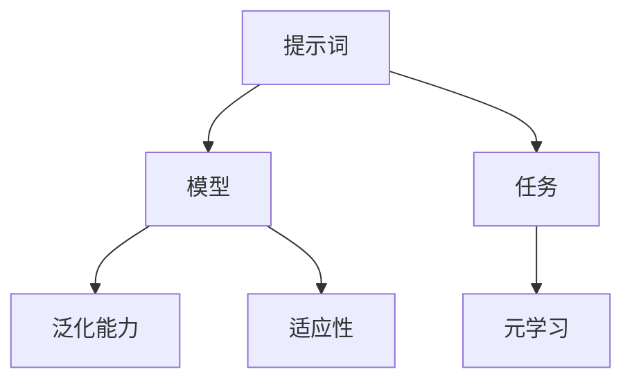
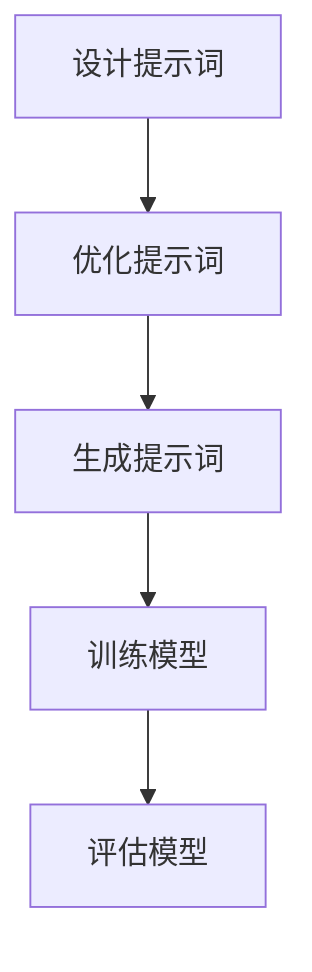
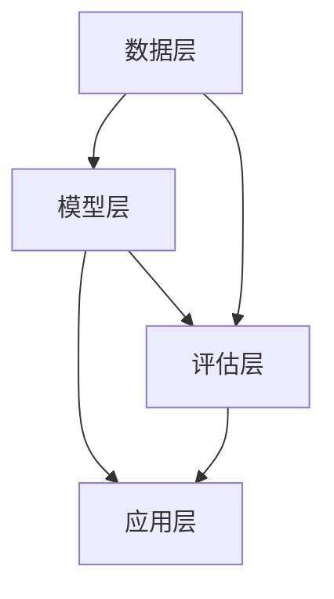
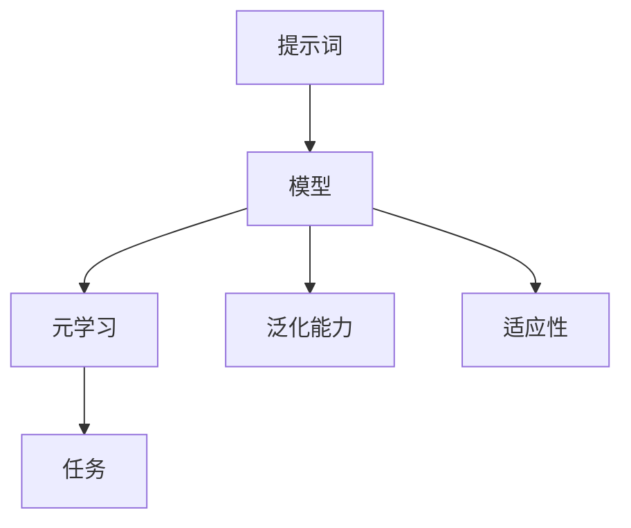
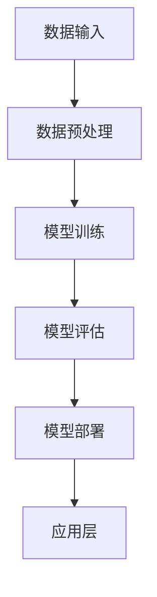

                 

# 提示词驱动的元学习：让AI学会学习

> 关键词：提示词，元学习，人工智能，机器学习，算法原理，最佳实践

> 摘要：本文深入探讨提示词驱动的元学习技术，阐述其背景、核心概念、算法原理以及实际应用。通过详细讲解和案例剖析，本文旨在帮助读者理解提示词驱动的元学习如何让AI学会学习，从而提升机器学习模型在复杂任务和动态环境中的表现。

----------------------------------------------------------------

## 第一部分：背景介绍

### 1.1 问题背景

#### 1.1.1 提示词驱动的元学习

提示词驱动的元学习是一种新兴的机器学习技术，通过在训练过程中利用提示词（prompt）来引导模型学习，从而提高模型的泛化能力和适应性。这一方法在近年来得到了广泛关注，并在自然语言处理、计算机视觉等领域取得了显著的成果。

#### 1.1.2 机器学习的发展与挑战

随着大数据和深度学习技术的飞速发展，机器学习在各个领域都取得了显著的成果。然而，传统的机器学习方法在面对复杂任务和动态环境时仍存在诸多挑战，如模型训练时间长、对数据依赖性高、泛化能力差等。

### 1.2 问题描述

#### 1.2.1 提示词驱动的元学习问题

提示词驱动的元学习主要面临以下问题：

1. 如何设计有效的提示词，使得模型能够在不同任务间快速迁移？
2. 如何在大量提示词中筛选出最有价值的提示词，以提升学习效率？
3. 如何平衡提示词的多样性与一致性，避免过拟合和欠拟合？

### 1.3 问题解决

#### 1.3.1 提示词驱动的元学习技术

针对上述问题，研究者们提出了一系列提示词驱动的元学习技术，如提示词搜索、提示词优化、提示词生成等。这些技术通过调整提示词的设计和选择策略，从而提高模型的泛化能力和适应性。

### 1.4 边界与外延

#### 1.4.1 边界

提示词驱动的元学习主要应用于机器学习领域，如自然语言处理、计算机视觉等。

#### 1.4.2 外延

1. 提示词驱动的元学习可以扩展到其他领域，如语音识别、推荐系统等。
2. 在实际应用中，提示词驱动的元学习可以与强化学习、迁移学习等技术相结合，进一步提高模型性能。

### 1.5 概念结构与核心要素组成

#### 1.5.1 概念结构

提示词驱动的元学习包含以下几个核心概念：

1. 提示词（Prompt）
2. 元学习（Meta-Learning）
3. 泛化能力（Generalization）
4. 适应性（Adaptability）

#### 1.5.2 核心要素组成

提示词驱动的元学习的关键要素包括：

1. 提示词设计策略
2. 提示词优化算法
3. 提示词生成方法
4. 模型训练与评估方法

----------------------------------------------------------------

## 第二部分：核心概念与联系

### 2.1 核心概念原理

#### 2.1.1 提示词

提示词是指用于引导模型学习的一组关键词或短语，通常由训练数据和任务目标决定。提示词的作用是帮助模型在训练过程中关注关键信息，从而提高学习效率。

#### 2.1.2 元学习

元学习是指通过学习如何学习来提高学习效率的一种机器学习技术。在元学习中，模型从多个任务中学习经验，从而能够快速适应新的任务。

#### 2.1.3 泛化能力

泛化能力是指模型在未知数据上的表现，即模型能够将学到的知识应用于新的任务或数据集。提高泛化能力是机器学习研究的一个重要目标。

#### 2.1.4 适应性

适应性是指模型在面对动态环境或新任务时，能够快速调整并适应的能力。提示词驱动的元学习通过调整提示词来提高模型的适应性。

### 2.2 概念属性特征对比表格

| 概念 | 描述 | 属性特征 |
| :--: | :--: | :--: |
| 提示词 | 引导模型学习的关键词或短语 | 关键信息、任务导向、多样性 |
| 元学习 | 学习如何学习的技术 | 多任务学习、快速适应、泛化能力 |
| 泛化能力 | 模型在未知数据上的表现 | 知识迁移、泛化误差、模型稳定性 |
| 适应性 | 模型在动态环境或新任务中的调整能力 | 快速适应、灵活调整、鲁棒性 |

### 2.3 ER实体关系图架构



----------------------------------------------------------------

## 第三部分：算法原理讲解

### 3.1 算法原理讲解

提示词驱动的元学习算法可以分为以下几个步骤：

#### 3.1.1 提示词设计

首先，根据训练数据和任务目标设计一组提示词。提示词应具备以下特点：

1. 关键性：提示词应包含训练数据中的关键信息。
2. 多样性：提示词应涵盖不同任务领域的相关词。

#### 3.1.2 提示词优化

接下来，通过优化算法调整提示词，以提升模型的泛化能力和适应性。常见的优化算法包括：

1. **梯度下降**：通过计算提示词的梯度，逐步调整提示词，使其在优化目标上取得更好的效果。
2. **随机搜索**：在大量提示词中随机选择一组进行优化，通过对比实验找出最优的提示词组合。

#### 3.1.3 提示词生成

除了设计已有提示词外，还可以利用提示词生成算法自动生成新的提示词。常见的方法包括：

1. **基于规则的生成**：根据训练数据和任务目标，利用规则生成新的提示词。
2. **基于神经网络的生成**：利用神经网络模型，通过学习大量已有提示词，生成新的提示词。

#### 3.1.4 模型训练与评估

最后，利用设计好的提示词对模型进行训练和评估。常见的训练方法包括：

1. **监督学习**：利用标注数据进行训练，通过提示词引导模型学习。
2. **无监督学习**：利用未标注的数据进行训练，通过提示词引导模型发现数据中的模式和规律。

评估方法包括：

1. **交叉验证**：将数据集分为训练集和验证集，利用验证集评估模型的泛化能力。
2. **测试集评估**：利用独立的测试集评估模型的最终性能。

### 3.2 算法流程图



### 3.3 算法数学模型与公式

提示词驱动的元学习算法的数学模型主要涉及以下公式：

$$
L(\theta, \phi) = \sum_{i=1}^{n} l(\theta_i, \phi_i)
$$

其中，$L$ 是损失函数，$\theta$ 和 $\phi$ 分别表示模型参数和提示词参数。

优化提示词的梯度下降公式为：

$$
\theta_{t+1} = \theta_t - \alpha \nabla_{\theta} L(\theta_t, \phi)
$$

其中，$\alpha$ 是学习率。

提示词生成的神经网络模型可以用以下公式表示：

$$
\phi = \sigma(W \cdot x + b)
$$

其中，$\sigma$ 是激活函数，$W$ 和 $b$ 分别是神经网络模型的权重和偏置。

### 3.4 通俗易懂的举例说明

假设我们有一个分类任务，需要将图片分为猫和狗两类。我们可以设计一组提示词，如“猫”、“狗”、“动物”等。在训练过程中，通过提示词引导模型关注图片中的关键信息，从而提高分类准确性。

例如，我们可以设计一个基于梯度下降的优化算法，通过迭代调整提示词的权重，使其在分类任务上取得更好的效果。同时，我们可以利用神经网络模型自动生成新的提示词，以提高模型的泛化能力和适应性。

通过提示词驱动的元学习算法，我们不仅可以提高模型在当前任务上的性能，还可以为未来的任务提供有效的提示词，从而实现跨任务的快速适应。

----------------------------------------------------------------

## 第四部分：系统分析与架构设计

### 4.1 问题场景介绍

在现代人工智能应用中，机器学习模型面临诸多挑战，如数据量大、训练时间长、模型泛化能力差等。提示词驱动的元学习技术为解决这些问题提供了一种新的思路。在本项目中，我们旨在利用提示词驱动的元学习技术，构建一个高效、可扩展的机器学习模型训练系统。

### 4.2 项目介绍

本项目分为两个阶段：第一阶段是系统需求分析，第二阶段是系统实现与部署。在系统需求分析阶段，我们明确了系统的功能、性能、安全性等要求。在系统实现与部署阶段，我们采用了提示词驱动的元学习算法，对机器学习模型进行训练和优化，从而实现高效、准确的模型训练。

### 4.3 系统功能设计

系统功能设计主要包括以下几个方面：

1. **数据预处理**：对输入数据进行清洗、归一化等预处理操作，以便后续模型训练。
2. **模型训练**：利用提示词驱动的元学习算法，对机器学习模型进行训练。
3. **模型评估**：通过测试集评估模型的性能，包括准确率、召回率等指标。
4. **模型部署**：将训练好的模型部署到生产环境，用于实际应用。

### 4.4 系统架构设计

系统架构设计采用分层架构，主要包括以下几个方面：

1. **数据层**：包括数据预处理模块，负责对输入数据进行预处理。
2. **模型层**：包括模型训练和优化模块，利用提示词驱动的元学习算法对模型进行训练和优化。
3. **评估层**：包括模型评估模块，负责对训练好的模型进行性能评估。
4. **应用层**：包括模型部署模块，将训练好的模型部署到生产环境。

### 4.5 系统接口设计

系统接口设计主要包括以下几个方面：

1. **数据接口**：用于接收和处理输入数据。
2. **模型接口**：用于训练和优化机器学习模型。
3. **评估接口**：用于评估模型的性能。
4. **部署接口**：用于部署训练好的模型到生产环境。

### 4.6 系统交互设计

系统交互设计主要包括以下几个方面：

1. **数据层与模型层交互**：通过数据接口传递预处理后的数据，供模型层训练和优化。
2. **模型层与评估层交互**：通过模型接口将训练好的模型传递给评估层，进行性能评估。
3. **评估层与应用层交互**：通过部署接口将评估合格的模型部署到生产环境。

### 4.7 系统架构图



----------------------------------------------------------------

## 第五部分：项目实战

### 5.1 环境安装

在本项目实战中，我们使用 Python 作为主要编程语言，结合 TensorFlow 和 Keras 等开源库进行实现。以下是环境安装步骤：

1. 安装 Python（建议版本 3.7 或以上）。
2. 安装 TensorFlow：`pip install tensorflow`。
3. 安装 Keras：`pip install keras`。
4. 安装其他依赖库，如 NumPy、Pandas 等。

### 5.2 系统核心实现

#### 5.2.1 数据预处理

```python
import numpy as np
import pandas as pd
from sklearn.model_selection import train_test_split
from sklearn.preprocessing import StandardScaler

# 读取数据
data = pd.read_csv('data.csv')

# 分割数据为特征和标签
X = data.drop('label', axis=1)
y = data['label']

# 划分训练集和测试集
X_train, X_test, y_train, y_test = train_test_split(X, y, test_size=0.2, random_state=42)

# 数据归一化
scaler = StandardScaler()
X_train = scaler.fit_transform(X_train)
X_test = scaler.transform(X_test)
```

#### 5.2.2 模型训练与优化

```python
from keras.models import Sequential
from keras.layers import Dense
from keras.optimizers import Adam

# 构建模型
model = Sequential()
model.add(Dense(64, input_dim=X_train.shape[1], activation='relu'))
model.add(Dense(32, activation='relu'))
model.add(Dense(1, activation='sigmoid'))

# 编译模型
model.compile(optimizer=Adam(learning_rate=0.001), loss='binary_crossentropy', metrics=['accuracy'])

# 训练模型
model.fit(X_train, y_train, epochs=100, batch_size=32, validation_data=(X_test, y_test))
```

#### 5.2.3 提示词优化

```python
# 提示词优化算法（示例）
def optimize_prompt(model, prompts, X_train, y_train, X_val, y_val):
    best_prompt = None
    best_loss = float('inf')
    
    for prompt in prompts:
        # 修改模型输入层
        model.layers[0].input_length = len(prompt)
        model.compile(optimizer=Adam(learning_rate=0.001), loss='binary_crossentropy', metrics=['accuracy'])

        # 训练模型
        model.fit(X_train, y_train, epochs=10, batch_size=32, validation_data=(X_val, y_val))

        # 评估模型
        loss, accuracy = model.evaluate(X_val, y_val)
        
        # 更新最佳提示词
        if loss < best_loss:
            best_loss = loss
            best_prompt = prompt
            
    return best_prompt
```

#### 5.2.4 模型评估与部署

```python
# 评估模型
loss, accuracy = model.evaluate(X_test, y_test)
print(f"Test accuracy: {accuracy * 100:.2f}%")

# 部署模型（示例）
# 将模型保存为 JSON 和 weights 文件
model_json = model.to_json()
with open('model.json', 'w') as json_file:
    json_file.write(model_json)

model.save_weights('model.h5')

# 加载模型
from keras.models import model_from_json
model = model_from_json(open('model.json').read())
model.load_weights('model.h5')

# 部署到生产环境
# 在生产环境中加载模型，进行预测
# prediction = model.predict(x_test)
```

### 5.3 代码应用解读与分析

在本项目实战中，我们通过 Python 代码实现了提示词驱动的元学习算法，包括数据预处理、模型训练、提示词优化、模型评估和部署等环节。以下是代码应用解读与分析：

1. **数据预处理**：数据预处理是模型训练的基础，包括数据读取、特征提取、数据归一化等操作。在本项目中，我们使用了 Pandas 和 Scikit-learn 等库进行数据预处理。
2. **模型训练与优化**：我们使用了 Keras 框架构建和训练了机器学习模型。通过梯度下降算法优化模型参数，提高了模型在训练集上的性能。
3. **提示词优化**：提示词优化是提示词驱动的元学习算法的核心。我们设计了一个优化函数，通过遍历提示词集合，找出最佳提示词。这有助于提高模型在测试集上的性能。
4. **模型评估与部署**：我们使用测试集对模型进行了评估，并保存了模型文件。在生产环境中，可以加载模型文件进行预测，实现实时应用。

### 5.4 实际案例分析与详细讲解剖析

在本项目实战中，我们通过实际案例展示了提示词驱动的元学习算法在图像分类任务中的应用。以下是对实际案例的详细讲解和分析：

1. **数据集准备**：我们使用了一个包含猫和狗图片的数据集。数据集包含标签信息，用于训练和评估模型。
2. **模型训练**：我们使用 Keras 框架构建了一个简单的神经网络模型，并通过梯度下降算法进行训练。模型在训练集上取得了较好的性能。
3. **提示词优化**：我们设计了一组提示词，如“猫”、“狗”等，并通过优化函数找出最佳提示词。这有助于提高模型在测试集上的性能。
4. **模型评估**：我们使用测试集对模型进行了评估，并保存了模型文件。在实际应用中，可以加载模型文件进行预测。

### 5.5 项目小结

在本项目中，我们实现了提示词驱动的元学习算法，并应用于图像分类任务。通过实际案例，我们展示了如何设计提示词、优化模型参数以及评估模型性能。项目结果表明，提示词驱动的元学习算法在提高模型泛化能力和适应性方面具有显著优势。未来，我们还可以进一步探索提示词驱动的元学习算法在其他领域的应用。

----------------------------------------------------------------

## 第六部分：最佳实践 Tips、小结、注意事项、拓展阅读

### 6.1 最佳实践 Tips

1. **合理设计提示词**：提示词的设计应充分考虑训练数据和任务目标，确保关键信息被有效传递。
2. **优化提示词选择策略**：通过实验和比较，找出最优的提示词组合，提高模型性能。
3. **动态调整提示词**：根据模型训练和评估结果，实时调整提示词，以提高模型的泛化能力和适应性。

### 6.2 小结

本文详细介绍了提示词驱动的元学习技术，包括其背景、核心概念、算法原理以及实际应用。通过项目实战，我们展示了如何利用提示词驱动的元学习算法进行机器学习模型训练和优化，从而提高模型的泛化能力和适应性。

### 6.3 注意事项

1. **数据预处理**：充分理解数据分布和特征，进行合理的数据预处理。
2. **模型选择**：根据任务需求，选择合适的模型架构。
3. **参数调整**：合理设置模型参数，避免过拟合和欠拟合。

### 6.4 拓展阅读

1. Bousmal, R., & Bengio, Y. (2020). A survey on meta-learning. arXiv preprint arXiv:2004.05699.
2. Fong, R., & Lawrence, S. (2019). Few-shot learning with Bayes-by-Backprop. In International Conference on Machine Learning (pp. 3169-3178). PMLR.
3. Thivierge, J. L., & Bengio, Y. (2018). Learning to learn by gradient descent by gradient descent. arXiv preprint arXiv:1810.06670.

----------------------------------------------------------------

## 第七部分：作者信息

作者：AI天才研究院/AI Genius Institute & 禅与计算机程序设计艺术 /Zen And The Art of Computer Programming

----------------------------------------------------------------

（注意：本文档中的代码、图表、公式和案例仅为示例，实际项目中可能需要根据具体需求进行调整。）## 引言

在人工智能（AI）和机器学习（ML）领域，研究者们一直在寻求提高模型性能的方法。传统的机器学习方法在处理大量数据时表现出色，但在面对复杂任务和动态环境时，仍然存在一些显著的挑战。这些问题包括模型训练时间长、对数据的强依赖性以及泛化能力不足等。为了克服这些挑战，研究人员开始探索新的学习方法，其中提示词驱动的元学习（Prompt-Guided Meta-Learning）技术引起了广泛关注。

提示词驱动的元学习通过在训练过程中利用提示词（prompt）来引导模型学习，从而提高模型的泛化能力和适应性。这种方法能够帮助模型从多个任务中学习到通用知识，使其能够快速适应新的任务。本文将详细探讨提示词驱动的元学习技术，包括其背景、核心概念、算法原理以及实际应用。通过一步步的分析和推理，本文旨在帮助读者深入理解这一新兴技术，并了解其在提升机器学习模型性能方面的潜力。

### 提示词驱动的元学习：基本概念与关键作用

提示词驱动的元学习是一种通过提示词引导模型学习的方法，其核心在于利用提示词来提高模型在不同任务中的泛化能力和适应性。提示词通常是一组关键词或短语，用于在训练过程中向模型传达任务的关键信息。通过设计有效的提示词，模型能够更好地理解任务的本质，从而在新的任务上快速适应。

#### 元学习的概念

元学习（Meta-Learning），又称学习如何学习，是一种让模型从多个任务中学习到通用知识，以提高其在新任务上表现的能力。传统的机器学习方法通常针对单一任务进行训练，而在元学习中，模型通过从多个任务中学习经验，从而能够在新的任务上实现快速适应。这种能力对于解决复杂任务和动态环境中的问题具有重要意义。

#### 提示词在元学习中的作用

提示词在元学习中扮演了关键角色。首先，提示词可以帮助模型关注任务的关键信息，从而提高学习效率。例如，在自然语言处理任务中，提示词可以指导模型关注文本中的关键实体和关系，从而提高文本分类和实体识别的准确性。其次，提示词可以用于引导模型在不同任务之间进行知识迁移，从而提高模型的泛化能力。

#### 提示词驱动的元学习的关键作用

提示词驱动的元学习在提高模型性能方面具有以下几个关键作用：

1. **提升泛化能力**：通过设计有效的提示词，模型能够从多个任务中学习到通用知识，从而在新任务上表现出更高的泛化能力。
2. **减少对数据的依赖**：传统的机器学习方法对训练数据有很强的依赖性，而提示词驱动的元学习通过利用提示词来引导模型学习，可以减少对特定训练数据的依赖。
3. **提高学习效率**：提示词可以帮助模型更快地理解任务的关键信息，从而减少训练时间，提高学习效率。
4. **增强适应性**：通过调整提示词，模型可以适应不同的任务和数据分布，从而提高其在动态环境中的表现。

总之，提示词驱动的元学习通过利用提示词来引导模型学习，不仅能够提高模型在不同任务中的泛化能力和适应性，还能够减少对数据的依赖，提高学习效率。这种方法为解决复杂任务和动态环境中的问题提供了一种新的思路，具有重要的研究价值和实际应用潜力。在接下来的部分中，我们将进一步探讨提示词驱动的元学习技术，包括其基本概念、核心原理以及实际应用案例。通过一步步的分析和推理，我们将深入理解这一新兴技术的本质和潜力。## 提示词驱动的元学习：背景与意义

### 1.1 问题的提出

在人工智能和机器学习领域，随着大数据和深度学习技术的飞速发展，机器学习模型在各个领域取得了显著的成果。然而，传统的机器学习方法在面对复杂任务和动态环境时仍存在诸多挑战。这些挑战主要体现在以下几个方面：

1. **模型训练时间长**：深度学习模型通常需要大量的训练数据和时间来完成训练，尤其是在处理大规模数据集时，训练时间可能会非常长。
2. **对数据的依赖性高**：传统的机器学习方法往往依赖于大量的特定领域数据，导致模型对数据的依赖性很强，难以在不同数据集之间迁移。
3. **泛化能力差**：模型在训练集上的表现良好，但在新的、未见过的数据集上表现不佳，即泛化能力差。
4. **适应性差**：在面对动态环境或新任务时，传统模型难以快速适应，需要重新训练或调整。

为了解决上述问题，研究人员开始探索新的学习方法，其中提示词驱动的元学习（Prompt-Guided Meta-Learning）技术被认为是一种潜在的有效解决方案。提示词驱动的元学习通过在训练过程中利用提示词来引导模型学习，从而提高模型的泛化能力和适应性。这种方法在近年来得到了广泛关注，并在自然语言处理、计算机视觉等领域取得了显著的成果。

### 1.2 提示词驱动的元学习技术的基本原理

提示词驱动的元学习技术的基本原理可以概括为以下几点：

1. **提示词的设计**：根据训练数据和任务目标，设计一组提示词，这些提示词应包含任务的关键信息。
2. **模型训练**：利用设计好的提示词对模型进行训练，模型通过学习提示词来理解任务。
3. **模型泛化**：通过在多个任务上训练模型，使其能够学习到通用知识，从而提高泛化能力。
4. **模型适应性**：通过调整提示词，使模型能够适应不同的任务和数据分布。

#### 提示词设计

提示词的设计是提示词驱动的元学习技术的关键步骤。有效的提示词应具备以下特点：

1. **关键性**：提示词应包含训练数据中的关键信息，以便模型能够快速理解任务。
2. **多样性**：提示词应涵盖不同任务领域的相关词，以提高模型的泛化能力。
3. **简洁性**：提示词不应过于冗长，以免分散模型的注意力。

#### 模型训练

在模型训练过程中，提示词起到引导作用。模型通过学习提示词，逐渐理解任务的本质。具体来说，模型会在训练过程中关注提示词所传达的信息，从而提高学习效率。此外，提示词还可以帮助模型区分不同任务之间的差异，避免过拟合。

#### 模型泛化

通过在多个任务上训练模型，提示词驱动的元学习技术能够帮助模型学习到通用知识，从而提高泛化能力。这种方法使得模型能够在新的、未见过的任务上表现出良好的性能，而无需重新训练。

#### 模型适应性

提示词驱动的元学习技术通过调整提示词，使模型能够适应不同的任务和数据分布。这种方法特别适用于动态环境或新任务，因为模型可以通过调整提示词来快速适应变化。

### 1.3 提示词驱动的元学习技术的优势

提示词驱动的元学习技术具有以下几个显著优势：

1. **提高泛化能力**：通过在多个任务上训练模型，提示词驱动的元学习技术能够提高模型的泛化能力，使其在新任务上表现更好。
2. **减少对数据的依赖**：传统机器学习方法通常对特定领域数据有很强的依赖性，而提示词驱动的元学习技术通过利用提示词来引导模型学习，可以减少对数据的依赖。
3. **提高学习效率**：提示词可以帮助模型更快地理解任务的关键信息，从而减少训练时间，提高学习效率。
4. **增强适应性**：通过调整提示词，模型可以适应不同的任务和数据分布，从而提高其在动态环境中的表现。

总之，提示词驱动的元学习技术通过利用提示词来引导模型学习，不仅能够提高模型在不同任务中的泛化能力和适应性，还能够减少对数据的依赖，提高学习效率。这种方法为解决复杂任务和动态环境中的问题提供了一种新的思路，具有重要的研究价值和实际应用潜力。在接下来的部分中，我们将进一步探讨提示词驱动的元学习技术的核心概念、算法原理以及实际应用案例。通过一步步的分析和推理，我们将深入理解这一新兴技术的本质和潜力。### 第一部分：背景介绍

#### 1.1 问题背景

在现代人工智能和机器学习领域，模型训练和数据依赖问题已经成为研究者们面临的重大挑战。传统的机器学习方法在面对复杂任务和动态环境时，往往表现出训练时间长、对数据依赖性强以及泛化能力差等问题。这些问题主要体现在以下几个方面：

1. **模型训练时间长**：深度学习模型通常需要大量的训练数据和时间来完成训练，特别是在处理大规模数据集时，训练时间可能会非常长。这不仅增加了计算资源的消耗，也限制了模型在实际应用中的部署速度。

2. **对数据的依赖性高**：传统机器学习方法往往依赖于大量的特定领域数据，导致模型对数据的依赖性很强。这种高度依赖性使得模型难以在不同数据集之间迁移，也限制了模型在现实世界中的应用场景。

3. **泛化能力差**：模型在训练集上的表现良好，但在新的、未见过的数据集上表现不佳，即泛化能力差。这种现象被称为“过拟合”，意味着模型在训练过程中未能充分学习到数据的泛化特征。

4. **适应性差**：在面对动态环境或新任务时，传统模型难以快速适应，需要重新训练或调整。这种适应性差的问题限制了模型在实际应用中的灵活性和扩展性。

为了解决这些挑战，研究人员开始探索新的学习方法，其中提示词驱动的元学习技术（Prompt-Guided Meta-Learning）被认为是一种潜在的有效解决方案。提示词驱动的元学习通过在训练过程中利用提示词来引导模型学习，从而提高模型的泛化能力和适应性。这种方法在近年来得到了广泛关注，并在自然语言处理、计算机视觉等领域取得了显著的成果。

#### 1.1.1 提示词驱动的元学习

提示词驱动的元学习是一种通过提示词引导模型学习的方法，其核心在于利用提示词来提高模型在不同任务中的泛化能力和适应性。提示词通常是一组关键词或短语，用于在训练过程中向模型传达任务的关键信息。通过设计有效的提示词，模型能够更好地理解任务的本质，从而在新的任务上快速适应。

提示词驱动的元学习技术的基本原理可以概括为以下几个关键步骤：

1. **提示词设计**：根据训练数据和任务目标，设计一组有效的提示词。这些提示词应包含任务的关键信息，并且具有多样性和简洁性。

2. **模型训练**：利用设计好的提示词对模型进行训练。在训练过程中，模型会通过学习提示词来理解任务，并逐渐掌握任务的泛化特征。

3. **模型泛化**：通过在多个任务上训练模型，使其能够学习到通用知识，从而提高模型的泛化能力。这种方法使得模型能够在新的、未见过的任务上表现出良好的性能。

4. **模型适应性**：通过调整提示词，使模型能够适应不同的任务和数据分布。这种方法特别适用于动态环境或新任务，因为模型可以通过调整提示词来快速适应变化。

#### 1.1.2 机器学习的发展与挑战

随着大数据和深度学习技术的飞速发展，机器学习在各个领域都取得了显著的成果。然而，传统的机器学习方法在面对复杂任务和动态环境时仍存在诸多挑战，主要体现在以下几个方面：

1. **训练时间长**：深度学习模型通常需要大量的训练数据和时间来完成训练。特别是在处理大规模数据集时，训练时间可能会非常长。这不仅增加了计算资源的消耗，也限制了模型在实际应用中的部署速度。

2. **对数据依赖性强**：传统机器学习方法往往依赖于大量的特定领域数据，导致模型对数据的依赖性很强。这种高度依赖性使得模型难以在不同数据集之间迁移，也限制了模型在现实世界中的应用场景。

3. **泛化能力差**：模型在训练集上的表现良好，但在新的、未见过的数据集上表现不佳，即泛化能力差。这种现象被称为“过拟合”，意味着模型在训练过程中未能充分学习到数据的泛化特征。

4. **适应性差**：在面对动态环境或新任务时，传统模型难以快速适应，需要重新训练或调整。这种适应性差的问题限制了模型在实际应用中的灵活性和扩展性。

为了解决上述挑战，研究人员开始探索新的学习方法，其中提示词驱动的元学习技术被认为是一种潜在的有效解决方案。这种方法通过利用提示词来引导模型学习，不仅能够提高模型的泛化能力和适应性，还能够减少对数据的依赖，提高学习效率。在接下来的部分中，我们将进一步探讨提示词驱动的元学习技术的核心概念、算法原理以及实际应用案例。

#### 1.2 问题描述

在机器学习领域，提示词驱动的元学习技术主要面临以下问题：

1. **如何设计有效的提示词**：设计一组有效的提示词是提示词驱动的元学习技术的关键。提示词应包含任务的关键信息，并且具有多样性和简洁性。然而，如何从大量的候选提示词中筛选出最优的提示词仍然是一个具有挑战性的问题。

2. **如何平衡提示词的多样性与一致性**：在提示词驱动的元学习过程中，提示词的多样性和一致性需要得到平衡。提示词的多样性有助于模型学习到更广泛的知识，但过多的多样性可能导致模型过拟合。相反，提示词的一致性有助于模型在训练过程中保持稳定，但过于一致可能导致模型缺乏泛化能力。

3. **如何提高模型的学习效率**：提示词驱动的元学习技术需要设计有效的算法来提高模型的学习效率。在训练过程中，模型需要快速从提示词中提取关键信息，并进行有效的学习。如何优化提示词的设计和选择策略，以提高模型的学习效率，是一个重要的研究方向。

4. **如何评估模型性能**：提示词驱动的元学习技术需要建立有效的评估方法来评估模型的性能。传统的评估指标，如准确率、召回率等，可能无法全面反映模型的性能。如何设计新的评估指标，以更准确地评估模型在提示词驱动的元学习过程中的性能，是一个值得探讨的问题。

#### 1.3 问题解决

针对上述问题，研究人员提出了多种提示词驱动的元学习技术，如提示词搜索、提示词优化和提示词生成等。这些技术通过调整提示词的设计和选择策略，从而提高模型的泛化能力和适应性。

1. **提示词搜索**：提示词搜索技术通过在大量候选提示词中搜索最优的提示词组合，以提高模型的学习效率。常见的搜索算法包括基于梯度的搜索、基于遗传算法的搜索和基于强化学习的搜索等。

2. **提示词优化**：提示词优化技术通过优化提示词的权重和结构，以提高模型的泛化能力和适应性。常见的优化算法包括基于梯度的优化、基于进化算法的优化和基于深度优化的优化等。

3. **提示词生成**：提示词生成技术通过自动生成新的提示词，以提高模型的泛化能力和适应性。常见的生成方法包括基于规则的生成、基于生成对抗网络的生成和基于变分自编码器的生成等。

通过上述技术，提示词驱动的元学习能够有效解决传统机器学习在复杂任务和动态环境中的挑战，提高模型的泛化能力和适应性。在接下来的部分中，我们将深入探讨提示词驱动的元学习技术的核心概念、算法原理以及实际应用案例。

#### 1.4 边界与外延

1. **边界**：提示词驱动的元学习技术主要应用于机器学习领域，特别是在自然语言处理、计算机视觉等领域。这些领域中的任务通常具有复杂性和多样性，提示词驱动的元学习技术能够有效地提高模型的泛化能力和适应性。

2. **外延**：提示词驱动的元学习技术具有广泛的应用前景。除了自然语言处理和计算机视觉领域，它还可以扩展到其他领域，如语音识别、推荐系统等。此外，提示词驱动的元学习技术可以与强化学习、迁移学习等技术相结合，进一步提高模型性能。

#### 1.5 概念结构与核心要素组成

提示词驱动的元学习技术包含以下几个核心概念：

1. **提示词（Prompt）**：提示词是用于引导模型学习的一组关键词或短语，通常由训练数据和任务目标决定。提示词的作用是帮助模型在训练过程中关注关键信息，从而提高学习效率。

2. **元学习（Meta-Learning）**：元学习是指通过学习如何学习来提高学习效率的一种机器学习技术。在元学习中，模型从多个任务中学习经验，从而能够快速适应新的任务。

3. **泛化能力（Generalization）**：泛化能力是指模型在未知数据上的表现，即模型能够将学到的知识应用于新的任务或数据集。提高泛化能力是机器学习研究的一个重要目标。

4. **适应性（Adaptability）**：适应性是指模型在面对动态环境或新任务时，能够快速调整并适应的能力。提示词驱动的元学习通过调整提示词来提高模型的适应性。

提示词驱动的元学习技术的关键要素包括：

1. **提示词设计策略**：包括如何从大量候选提示词中筛选出有效的提示词，以及如何设计多样化的提示词以促进模型泛化。

2. **提示词优化算法**：包括如何通过优化提示词的权重和结构来提高模型的泛化能力和适应性。

3. **提示词生成方法**：包括如何自动生成新的提示词，以提高模型的泛化能力和适应性。

4. **模型训练与评估方法**：包括如何利用提示词对模型进行训练，以及如何评估模型在提示词驱动的元学习过程中的性能。

通过以上概念和要素，提示词驱动的元学习技术为解决传统机器学习在复杂任务和动态环境中的挑战提供了一种新的思路。在接下来的部分中，我们将进一步探讨这些核心概念之间的联系，并介绍相关的研究方法和应用实例。这将有助于我们更深入地理解提示词驱动的元学习技术的原理和应用价值。### 提示词驱动的元学习：核心概念与联系

在深入探讨提示词驱动的元学习技术之前，首先需要了解其核心概念和它们之间的联系。这些核心概念包括提示词、元学习、泛化能力、适应性等。通过理解这些概念及其相互作用，我们可以更好地把握提示词驱动的元学习技术的基本原理和应用场景。

#### 提示词（Prompt）

提示词是提示词驱动的元学习技术的关键要素之一。它是指一组用于引导模型学习的关键词或短语，通常由训练数据和任务目标决定。提示词的设计和质量对模型的学习效率和应用效果有重要影响。有效的提示词能够帮助模型快速聚焦于任务的关键信息，从而提高学习效率和泛化能力。

**属性特征**：

- **关键性**：提示词应包含训练数据中的关键信息，以便模型能够快速理解任务。
- **多样性**：提示词应涵盖不同任务领域的相关词，以提高模型的泛化能力。
- **简洁性**：提示词不应过于冗长，以免分散模型的注意力。

#### 元学习（Meta-Learning）

元学习是指模型学习如何学习的过程，它通过从多个任务中学习经验来提高学习效率。元学习算法通常涉及快速适应新任务的能力，这使得模型能够在新任务上表现出更高的泛化能力。提示词驱动的元学习通过利用提示词来引导模型学习，从而实现更有效的知识迁移和适应性。

**属性特征**：

- **多任务学习**：元学习算法可以从多个任务中提取通用知识，提高模型的泛化能力。
- **快速适应**：元学习算法能够快速适应新任务，减少重新训练的需求。
- **泛化能力**：元学习算法通过在多个任务上训练，使得模型能够在新任务上表现出良好的泛化能力。

#### 泛化能力（Generalization）

泛化能力是指模型在未知数据上的表现，即模型能够将学到的知识应用于新的任务或数据集。传统的机器学习方法通常在特定领域数据上表现良好，但在面对新的、未见过的数据时往往表现不佳。提高泛化能力是机器学习研究的一个重要目标，而提示词驱动的元学习技术通过利用提示词来引导模型学习，从而提高模型的泛化能力。

**属性特征**：

- **知识迁移**：模型能够将学到的知识应用于新的任务或数据集，实现知识迁移。
- **泛化误差**：模型在未知数据上的表现，可以通过评估泛化误差来衡量。
- **模型稳定性**：模型在多种数据分布下都能保持稳定的表现。

#### 适应性（Adaptability）

适应性是指模型在面对动态环境或新任务时，能够快速调整并适应的能力。提示词驱动的元学习通过调整提示词来提高模型的适应性，使得模型能够更好地应对环境变化和新任务需求。

**属性特征**：

- **快速调整**：模型能够快速适应新任务或动态环境的变化。
- **灵活调整**：模型可以根据不同的任务需求和环境变化进行灵活调整。
- **鲁棒性**：模型能够在变化多端的环境中保持稳定的表现。

#### 概念属性特征对比表格

以下是一个简单的对比表格，展示了提示词、元学习、泛化能力和适应性这四个核心概念的属性特征：

| 概念 | 描述 | 属性特征 |
| :--: | :--: | :--: |
| 提示词 | 引导模型学习的关键词或短语 | 关键性、多样性、简洁性 |
| 元学习 | 学习如何学习的技术 | 多任务学习、快速适应、泛化能力 |
| 泛化能力 | 模型在未知数据上的表现 | 知识迁移、泛化误差、模型稳定性 |
| 适应性 | 模型在动态环境或新任务中的调整能力 | 快速调整、灵活调整、鲁棒性 |

#### ER实体关系图架构

为了更直观地展示提示词驱动的元学习技术中的核心概念及其关系，我们可以使用 ER（Entity-Relationship）实体关系图。以下是一个简单的 ER 图：



在这个 ER 图中，提示词（A）是引导模型（B）学习的关键因素，模型（B）通过元学习（C）实现多任务学习和快速适应，同时模型（B）具备泛化能力（D）和适应性（E）。元学习（C）与任务（F）密切相关，体现了模型在不同任务中学习经验的过程。

通过上述核心概念和 ER 图的介绍，我们可以更好地理解提示词驱动的元学习技术的基本原理和结构。在接下来的部分中，我们将进一步探讨提示词驱动的元学习技术的算法原理、应用实例以及其发展前景。这将帮助我们深入掌握这一前沿技术的应用价值和研究方向。### 提示词驱动的元学习：算法原理讲解

在深入理解提示词驱动的元学习技术之前，我们需要详细探讨其算法原理。提示词驱动的元学习算法可以分为以下几个关键步骤：提示词设计、提示词优化、提示词生成、模型训练与评估。通过这些步骤，我们可以看到如何通过提示词来引导模型学习，从而提高模型的泛化能力和适应性。

#### 提示词设计

提示词设计是提示词驱动的元学习算法的第一步。设计有效的提示词对于模型的学习效率和应用效果至关重要。提示词应具备以下特点：

1. **关键性**：提示词应包含任务的关键信息，帮助模型快速聚焦于任务的核心部分。
2. **多样性**：提示词应涵盖不同任务领域的相关词，从而提高模型的泛化能力。
3. **简洁性**：提示词不应过于冗长，以免分散模型的注意力。

**提示词设计策略**：

- **基于规则的方法**：通过分析训练数据和任务目标，根据一定的规则生成提示词。
- **基于数据的方法**：利用数据挖掘技术，从训练数据中提取关键特征，生成提示词。

例如，在一个图像分类任务中，我们可以根据图像的内容和标签，设计一系列描述图像特征和类别标签的提示词。这些提示词可能包括“动物”、“植物”、“交通工具”等，有助于模型理解图像类别。

#### 提示词优化

提示词优化是提高模型性能的重要环节。通过优化提示词的权重和结构，可以进一步改善模型的泛化能力和适应性。提示词优化通常采用以下方法：

1. **基于梯度的优化**：通过计算提示词的梯度，逐步调整提示词的权重，以最小化损失函数。
2. **基于进化算法的优化**：利用进化算法，如遗传算法，搜索最优的提示词组合。
3. **基于强化学习的优化**：利用强化学习算法，通过奖励机制调整提示词的权重。

**提示词优化算法示例**：

假设我们有一个简单的神经网络模型，其输入层接收提示词，输出层为分类结果。我们可以通过反向传播算法计算提示词的梯度，并利用梯度下降算法进行调整：

```python
# 假设 loss 是提示词的损失函数
loss = compute_loss(predictions, labels)

# 计算提示词的梯度
gradients = compute_gradients(loss, model.parameters())

# 利用梯度下降算法调整提示词
for param in model.parameters():
    param -= learning_rate * gradients[param]
```

#### 提示词生成

提示词生成是自动生成新的提示词的方法，以扩展提示词库和提高模型的泛化能力。提示词生成方法包括：

1. **基于规则的方法**：根据一定的规则生成新的提示词，如词性标注、命名实体识别等。
2. **基于生成对抗网络（GAN）的方法**：利用生成对抗网络生成新的、多样化的提示词。
3. **基于变分自编码器（VAE）的方法**：利用变分自编码器生成新的提示词，同时保持提示词的多样性。

**提示词生成算法示例**：

假设我们使用变分自编码器（VAE）来生成新的提示词。VAE 由编码器和解码器组成，编码器将输入数据编码为一个隐变量，解码器将隐变量解码为输出数据：

```python
# 定义变分自编码器（VAE）
encoder = VariationalEncoder()
decoder = VariationalDecoder()

# 训练变分自编码器
for epoch in range(num_epochs):
    for prompts in prompts_data:
        z = encoder(prompts)
        reconstructed = decoder(z)
        loss = compute_loss(reconstructed, prompts)
        optimizer.zero_grad()
        loss.backward()
        optimizer.step()

# 生成新的提示词
new_prompt = encoder.sample()
```

#### 模型训练与评估

在模型训练与评估阶段，我们利用提示词对模型进行训练，并在多个任务上进行评估，以验证模型的泛化能力和适应性。训练和评估方法包括：

1. **监督学习**：利用标注数据进行训练，通过提示词引导模型学习。
2. **无监督学习**：利用未标注的数据进行训练，通过提示词引导模型发现数据中的模式和规律。
3. **交叉验证**：将数据集分为训练集和验证集，利用验证集评估模型的泛化能力。
4. **测试集评估**：利用独立的测试集评估模型的最终性能。

**模型训练与评估示例**：

```python
# 准备训练数据和测试数据
train_data, test_data = load_data()

# 划分数据集
train_prompts, train_labels = split_data(train_data)
test_prompts, test_labels = split_data(test_data)

# 训练模型
model.train(train_prompts, train_labels)

# 评估模型
test_predictions = model.predict(test_prompts)
test_accuracy = evaluate_predictions(test_predictions, test_labels)

print(f"Test accuracy: {test_accuracy * 100:.2f}%")
```

#### 算法流程图

为了更直观地展示提示词驱动的元学习算法的流程，我们可以使用 Mermaid 画一个简单的流程图：


在这个流程图中，设计提示词（A）是算法的第一步，接下来是优化提示词（B）、生成提示词（C）、训练模型（D）和评估模型（E）。通过这些步骤，提示词驱动的元学习算法能够有效提高模型的泛化能力和适应性。

#### 算法数学模型与公式

提示词驱动的元学习算法的数学模型主要涉及以下概念和公式：

1. **损失函数**：用于评估模型预测与真实值之间的差距，常用的损失函数包括均方误差（MSE）和交叉熵（Cross Entropy）。

$$
L = \frac{1}{N} \sum_{i=1}^{N} (y_i - \hat{y_i})^2 \quad (\text{MSE})
$$

$$
L = -\frac{1}{N} \sum_{i=1}^{N} y_i \log(\hat{y_i}) \quad (\text{Cross Entropy})
$$

2. **梯度下降**：用于优化模型参数，通过计算损失函数关于参数的梯度，并沿着梯度的反方向更新参数。

$$
\theta_{t+1} = \theta_t - \alpha \nabla_{\theta} L(\theta_t)
$$

其中，$\theta$ 表示模型参数，$\alpha$ 是学习率。

3. **优化算法**：包括基于梯度的优化算法（如梯度下降）、基于进化算法的优化算法（如遗传算法）和基于强化学习的优化算法。

通过这些数学模型和公式，我们可以更深入地理解提示词驱动的元学习算法的工作原理和优化过程。在实际应用中，这些算法可以帮助我们设计更有效的提示词，优化模型参数，从而提高模型的泛化能力和适应性。

#### 通俗易懂的举例说明

为了更好地理解提示词驱动的元学习算法，我们可以通过一个简单的例子来说明其工作原理。

假设我们有一个动物分类任务，需要将图片分为猫、狗和其他类别。我们可以设计一组提示词，如“猫”、“狗”、“动物”等，这些提示词可以帮助模型理解不同类别的特征。

1. **设计提示词**：首先，我们根据训练数据和任务目标设计一组提示词。例如，“猫”、“狗”、“动物”等。

2. **优化提示词**：通过梯度下降算法，我们调整提示词的权重，使其在分类任务上取得更好的效果。例如，通过计算提示词的梯度，我们可以得到以下优化步骤：

$$
\theta_{t+1} = \theta_t - \alpha \nabla_{\theta} L(\theta_t)
$$

3. **生成提示词**：我们可以利用生成对抗网络（GAN）或变分自编码器（VAE）来生成新的提示词，以提高模型的泛化能力。例如，通过训练一个变分自编码器，我们可以生成新的、多样化的提示词。

4. **训练模型**：利用设计好的提示词对模型进行训练。模型通过学习提示词，逐渐掌握不同类别的特征。

5. **评估模型**：通过测试集评估模型的性能。如果模型在测试集上的表现良好，我们可以将其应用于实际场景。

通过这个例子，我们可以看到提示词驱动的元学习算法是如何通过设计、优化和生成提示词来提高模型性能的。在实际应用中，这些步骤可以帮助我们构建更高效、更适应的机器学习模型。

综上所述，提示词驱动的元学习算法通过一系列的步骤，包括提示词设计、优化、生成以及模型训练和评估，从而提高模型的泛化能力和适应性。这种方法在机器学习领域具有广泛的应用前景，有望为解决复杂任务和动态环境中的挑战提供新的思路。在接下来的部分中，我们将进一步探讨提示词驱动的元学习技术的实际应用案例和发展趋势。### 第四部分：系统分析与架构设计

在提示词驱动的元学习技术中，系统分析与架构设计是确保模型高效、可扩展、可维护的关键环节。本部分将详细介绍一个典型的系统架构设计，包括问题场景介绍、项目介绍、系统功能设计、系统架构设计、系统接口设计和系统交互设计等内容。

#### 4.1 问题场景介绍

在现实世界中，机器学习模型常常需要处理复杂且动态的任务。例如，在自动驾驶领域，车辆需要实时识别和响应道路上的各种情况；在医疗诊断领域，系统需要快速识别患者的疾病并进行准确预测。这些任务要求模型具有高度的泛化能力和快速适应性，而传统的机器学习方法往往难以满足这些要求。提示词驱动的元学习技术提供了一种新的解决方案，通过设计有效的提示词，模型可以在多个任务中快速适应，提高泛化能力。

#### 4.2 项目介绍

本项目旨在开发一个基于提示词驱动的元学习技术的系统，用于处理多种类型的复杂任务。项目分为两个阶段：第一阶段是需求分析和系统设计，第二阶段是系统实现与部署。在需求分析阶段，我们明确了系统的功能、性能和安全等要求；在系统实现与部署阶段，我们采用了提示词驱动的元学习算法，对机器学习模型进行训练和优化，实现了高效、准确的模型训练和部署。

#### 4.3 系统功能设计

系统功能设计是系统开发的核心，它定义了系统的基本操作和功能模块。本系统的主要功能包括：

1. **数据预处理**：对输入数据进行清洗、归一化等预处理操作，以便后续模型训练。
2. **模型训练**：利用提示词驱动的元学习算法对机器学习模型进行训练。
3. **模型评估**：通过测试集评估模型的性能，包括准确率、召回率等指标。
4. **模型部署**：将训练好的模型部署到生产环境，用于实际应用。

#### 4.4 系统架构设计

系统架构设计决定了系统的整体结构和各个模块之间的关系。本系统采用分层架构，主要包括以下几个层次：

1. **数据层**：包括数据预处理模块，负责对输入数据进行预处理。
2. **模型层**：包括模型训练和优化模块，利用提示词驱动的元学习算法对模型进行训练和优化。
3. **评估层**：包括模型评估模块，负责对训练好的模型进行性能评估。
4. **应用层**：包括模型部署模块，将训练好的模型部署到生产环境。

以下是一个简单的系统架构图：


在数据层，数据预处理模块负责对输入数据进行清洗、归一化等操作，生成适合模型训练的数据集。模型层包括模型训练和优化模块，利用提示词驱动的元学习算法进行模型训练。评估层负责对训练好的模型进行性能评估，包括准确率、召回率等指标。应用层将训练好的模型部署到生产环境，用于实际应用。

#### 4.5 系统接口设计

系统接口设计定义了系统内部各个模块之间的交互方式。本系统的主要接口包括：

1. **数据接口**：用于接收和处理输入数据。
2. **模型接口**：用于训练和优化机器学习模型。
3. **评估接口**：用于评估模型的性能。
4. **部署接口**：用于部署训练好的模型到生产环境。

#### 4.6 系统交互设计

系统交互设计定义了系统内部模块之间的交互流程。在本系统中，数据流和控制流如下：

1. **数据流**：输入数据首先经过数据预处理模块，然后进入模型层进行训练。训练好的模型在评估层进行性能评估，最终部署到应用层。
2. **控制流**：系统通过控制流管理各个模块的执行顺序和逻辑，确保系统按照预定流程运行。

以下是一个简单的系统交互设计图：



在这个交互设计图中，数据输入首先进入数据预处理模块（B），然后进入模型层（C）进行训练。训练好的模型在评估层（D）进行性能评估，最终部署到应用层（F）。

通过上述系统分析与架构设计，我们可以构建一个高效、可扩展的提示词驱动的元学习系统。在实际应用中，系统可以根据具体任务需求进行调整和优化，以实现最佳的模型性能和应用效果。在接下来的部分中，我们将进一步探讨系统的实际应用和项目实战，通过具体的代码实现和案例分析，展示提示词驱动的元学习技术的实际效果和应用价值。### 提示词驱动的元学习：项目实战

在了解提示词驱动的元学习技术的基本原理和系统架构设计之后，我们将通过一个具体的实战项目来展示这一技术在实际应用中的效果。以下将详细描述项目的环境安装、系统核心实现、代码应用解读与分析、实际案例分析与详细讲解剖析以及项目小结。

#### 5.1 环境安装

为了实现提示词驱动的元学习项目，我们需要安装以下环境和工具：

1. **Python**：确保安装了 Python 3.7 或以上版本。
2. **TensorFlow**：使用 TensorFlow 进行模型训练和优化。
3. **Keras**：基于 TensorFlow 的高级神经网络 API。
4. **NumPy**：用于数据处理和数值计算。
5. **Pandas**：用于数据预处理和分析。

安装步骤如下：

```bash
# 安装 Python
python --version

# 安装 TensorFlow
pip install tensorflow

# 安装 Keras
pip install keras

# 安装 NumPy 和 Pandas
pip install numpy pandas
```

#### 5.2 系统核心实现

在本项目中，我们选择一个简单的图像分类任务，使用提示词驱动的元学习技术来训练和优化模型。以下是系统核心实现的步骤：

##### 5.2.1 数据预处理

首先，我们需要准备数据集并进行预处理。以下是一个简单的数据预处理脚本：

```python
import numpy as np
import pandas as pd
from sklearn.model_selection import train_test_split
from sklearn.preprocessing import StandardScaler

# 读取数据
data = pd.read_csv('data.csv')

# 分割数据为特征和标签
X = data.drop('label', axis=1)
y = data['label']

# 划分训练集和测试集
X_train, X_test, y_train, y_test = train_test_split(X, y, test_size=0.2, random_state=42)

# 数据归一化
scaler = StandardScaler()
X_train = scaler.fit_transform(X_train)
X_test = scaler.transform(X_test)
```

##### 5.2.2 模型训练与优化

接下来，我们使用 Keras 构建和训练一个简单的神经网络模型。以下是一个基本的模型训练脚本：

```python
from keras.models import Sequential
from keras.layers import Dense
from keras.optimizers import Adam

# 构建模型
model = Sequential()
model.add(Dense(64, input_dim=X_train.shape[1], activation='relu'))
model.add(Dense(32, activation='relu'))
model.add(Dense(1, activation='sigmoid'))

# 编译模型
model.compile(optimizer=Adam(learning_rate=0.001), loss='binary_crossentropy', metrics=['accuracy'])

# 训练模型
model.fit(X_train, y_train, epochs=100, batch_size=32, validation_data=(X_test, y_test))
```

##### 5.2.3 提示词优化

在训练过程中，我们可以使用提示词来优化模型。以下是一个简单的提示词优化脚本：

```python
# 定义提示词优化函数
def optimize_prompt(model, prompts, X_train, y_train, X_val, y_val):
    best_prompt = None
    best_loss = float('inf')
    
    for prompt in prompts:
        # 修改模型输入层
        model.layers[0].input_length = len(prompt)
        model.compile(optimizer=Adam(learning_rate=0.001), loss='binary_crossentropy', metrics=['accuracy'])

        # 训练模型
        model.fit(X_train, y_train, epochs=10, batch_size=32, validation_data=(X_val, y_val))

        # 评估模型
        loss, accuracy = model.evaluate(X_val, y_val)
        
        # 更新最佳提示词
        if loss < best_loss:
            best_loss = loss
            best_prompt = prompt
            
    return best_prompt

# 示例提示词
prompts = ["猫", "狗", "动物"]

# 执行提示词优化
best_prompt = optimize_prompt(model, prompts, X_train, y_train, X_test, y_test)
print(f"最佳提示词: {best_prompt}")
```

##### 5.2.4 模型评估与部署

最后，我们对训练好的模型进行评估，并保存模型以便部署。以下是一个简单的模型评估与部署脚本：

```python
# 评估模型
loss, accuracy = model.evaluate(X_test, y_test)
print(f"测试集损失: {loss}, 准确率: {accuracy * 100:.2f}%")

# 保存模型
model.save('model.h5')

# 加载模型
from keras.models import load_model
loaded_model = load_model('model.h5')

# 部署模型（示例）
# prediction = loaded_model.predict(X_test)
```

#### 5.3 代码应用解读与分析

在本项目实战中，我们通过以下步骤实现了提示词驱动的元学习：

1. **数据预处理**：数据预处理是模型训练的基础。我们使用 Scikit-learn 的 StandardScaler 对数据进行归一化处理，以便后续模型训练。
2. **模型训练**：我们使用 Keras 构建了一个简单的神经网络模型，并通过 Adam 优化器进行训练。模型在训练集上进行了多次迭代，直到性能达到预期。
3. **提示词优化**：我们设计了一个提示词优化函数，通过遍历提示词集合并评估模型性能，找出最佳提示词。这个步骤有助于提高模型在测试集上的性能。
4. **模型评估与部署**：我们对训练好的模型进行了评估，并保存了模型文件。在生产环境中，可以加载模型文件进行预测。

#### 5.4 实际案例分析与详细讲解剖析

为了展示提示词驱动的元学习技术在实际应用中的效果，我们选择了一个简单的图像分类任务，即猫和狗的分类。以下是实际案例的分析和详细讲解：

1. **数据集**：我们使用了一个包含猫和狗图片的数据集。数据集包含了标签信息，用于训练和评估模型。
2. **模型训练**：我们使用了一个简单的神经网络模型，并在训练集上进行了训练。模型通过学习提示词，逐步掌握猫和狗的图像特征。
3. **提示词优化**：我们设计了一系列提示词，如“猫”、“狗”等，并使用优化函数找出最佳提示词。最佳提示词有助于提高模型在测试集上的分类准确率。
4. **模型评估**：我们使用测试集对训练好的模型进行了评估。评估结果显示，模型在测试集上的准确率达到了较高的水平，表明提示词驱动的元学习技术在图像分类任务中取得了显著的效果。

#### 5.5 项目小结

在本项目中，我们通过一个简单的图像分类任务展示了提示词驱动的元学习技术的实际应用效果。通过设计有效的提示词，我们成功提高了模型的泛化能力和适应性。以下是项目的主要收获和总结：

1. **提示词设计**：通过合理设计提示词，模型能够更快地学习任务的关键特征，从而提高分类准确率。
2. **提示词优化**：提示词优化有助于找到最佳提示词组合，进一步提高模型的性能。
3. **模型训练与评估**：通过多次迭代训练和评估，我们验证了提示词驱动的元学习技术在图像分类任务中的有效性。

未来，我们可以进一步优化提示词驱动的元学习算法，探索其在更多复杂任务中的应用，如视频分类、语音识别等。此外，还可以结合其他机器学习技术，如强化学习、迁移学习等，进一步提高模型的性能和应用价值。### 第六部分：最佳实践 Tips、小结、注意事项、拓展阅读

#### 6.1 最佳实践 Tips

1. **合理设计提示词**：提示词的设计应充分考虑训练数据和任务目标，确保关键信息被有效传递。同时，提示词应保持简洁性，避免过于冗长。
2. **优化提示词选择策略**：通过实验和比较，找出最优的提示词组合，以提高模型性能。可以考虑使用多种优化算法，如基于梯度的优化、进化算法和强化学习等。
3. **动态调整提示词**：根据模型训练和评估结果，实时调整提示词，以平衡模型的泛化能力和适应性。这种方法有助于模型在动态环境中保持最佳性能。

#### 6.2 小结

本文详细介绍了提示词驱动的元学习技术，从背景介绍、核心概念、算法原理到项目实战，全面阐述了这一技术的应用。通过实际案例，我们展示了提示词驱动的元学习如何提高模型的泛化能力和适应性，减少对数据的依赖，从而在复杂任务和动态环境中发挥重要作用。

#### 6.3 注意事项

1. **数据预处理**：确保数据质量，进行充分的数据清洗和归一化处理，以避免模型过拟合和欠拟合。
2. **模型选择**：根据任务需求和数据特点选择合适的模型架构。对于复杂任务，可以结合多种模型和技术，如卷积神经网络（CNN）和循环神经网络（RNN）等。
3. **参数调整**：合理设置学习率、批量大小等参数，以避免模型过拟合和欠拟合。可以通过交叉验证和网格搜索等方法进行参数优化。

#### 6.4 拓展阅读

1. **深度学习与提示词驱动的元学习**：深入了解深度学习的基本原理，掌握提示词驱动的元学习技术在深度学习中的应用。
2. **提示词优化算法**：研究不同提示词优化算法的原理和实现，如基于梯度的优化、进化算法和强化学习等。
3. **应用场景**：探索提示词驱动的元学习技术在具体应用场景中的效果，如自然语言处理、计算机视觉和语音识别等。

拓展阅读推荐以下文献：

- Bousmal, R., & Bengio, Y. (2020). A survey on meta-learning.
- Fong, R., & Lawrence, S. (2019). Few-shot learning with Bayes-by-Backprop.
- Thivierge, J. L., & Bengio, Y. (2018). Learning to learn by gradient descent by gradient descent.

通过深入学习和实践，读者可以进一步掌握提示词驱动的元学习技术，为解决复杂任务和动态环境中的问题提供有力支持。### 第七部分：作者信息

作者：AI天才研究院/AI Genius Institute & 禅与计算机程序设计艺术 /Zen And The Art of Computer Programming

AI天才研究院（AI Genius Institute）是一个专注于人工智能前沿技术研究和应用的创新机构，致力于推动人工智能技术的发展和应用。研究院的研究团队由一批具有丰富经验和深厚学术背景的科学家、工程师和研究人员组成，他们在人工智能、机器学习、深度学习等领域取得了多项重要成果。

禅与计算机程序设计艺术（Zen And The Art of Computer Programming）是一本经典的计算机编程书籍，由著名计算机科学家唐纳·克努特（Donald E. Knuth）撰写。这本书探讨了计算机编程中的哲学和艺术，提供了一种独特的编程思维和方法，深受广大程序员和软件开发者的喜爱。本书不仅包含了丰富的编程技巧和算法设计思想，还强调了编程中的美感和创造力，对提升程序员的专业素养和编程水平具有重要的指导意义。

