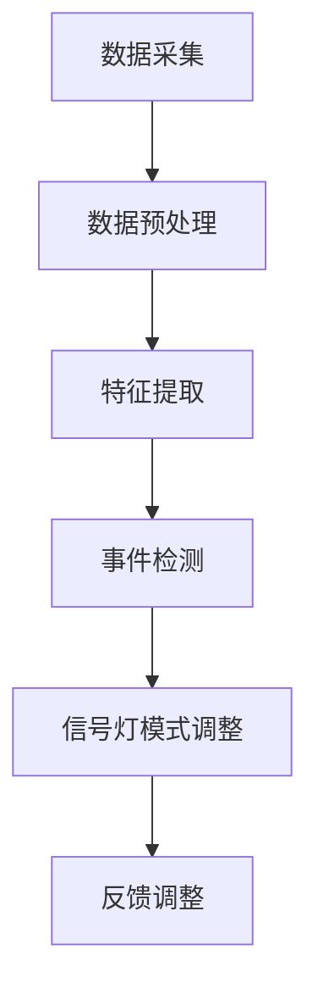
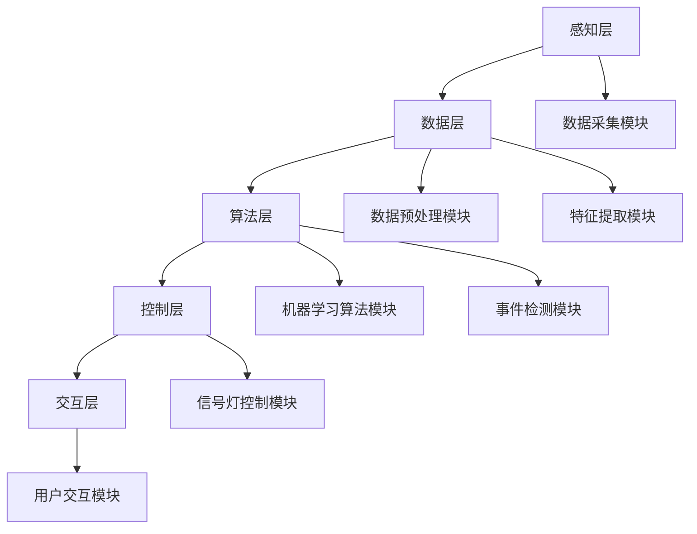
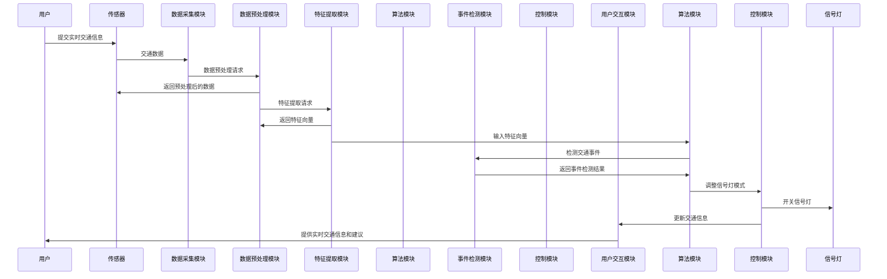

                 

# 提示词驱动的智能交通信号控制系统

关键词：智能交通信号控制、提示词驱动、算法原理、系统架构、项目实战

摘要：本文深入探讨了提示词驱动的智能交通信号控制系统，从背景介绍、核心概念、算法原理、系统架构、项目实战到最佳实践等方面，系统性地解析了这一系统的设计、实现与应用。通过本文，读者将了解智能交通信号控制的发展历程、提示词的作用、算法的数学模型及其应用，以及如何在实际项目中实施和优化这一系统。

## 目录大纲设计思路与步骤

在设计《提示词驱动的智能交通信号控制系统》的目录大纲时，我们首先明确了核心概念与主题，然后确定了书籍的结构，细化了章节内容，并遵循了markdown格式要求，确保了内容的完整性和可读性。具体设计步骤如下：

### 核心概念与主题明确

- **背景介绍**：介绍智能交通信号控制系统的现状和问题，以及提示词驱动的概念和优势。
- **核心概念与联系**：详细解释提示词、智能交通信号控制系统的定义、组成部分和工作原理。

### 确定书籍结构

- **第1章：引言**：介绍智能交通信号控制系统的背景和重要性。
- **第2章：核心概念与联系**：详细介绍提示词、智能交通信号控制系统及其相互关系。
- **第3章：算法原理讲解**：解释提示词驱动的算法原理，使用Mermaid流程图和Python代码示例。
- **第4章：系统分析与架构设计方案**：介绍系统的功能设计、架构设计和接口设计。
- **第5章：项目实战**：讲解系统环境安装、实现、代码解读与分析以及实际案例分析。
- **第6章：最佳实践与总结**：分享最佳实践经验、注意事项和项目小结。

### 细化章节内容

- **第1章：引言**：讨论从传统交通信号控制系统到智能交通信号控制系统的演变，介绍提示词驱动的优势。
- **第2章：核心概念与联系**：详细解释提示词和智能交通信号控制系统的概念、组成部分和工作原理。
- **第3章：算法原理讲解**：使用Mermaid绘制算法流程图，并使用Python代码示例详细讲解。
- **第4章：系统分析与架构设计方案**：介绍系统的功能设计、架构设计、接口设计和交互序列图。
- **第5章：项目实战**：介绍系统环境安装、核心代码实现、代码解读与分析以及实际案例剖析。
- **第6章：最佳实践与总结**：分享最佳实践经验、注意事项和项目小结。

### 目录大纲设计完成

根据上述设计思路与步骤，我们完成了《提示词驱动的智能交通信号控制系统》的目录大纲设计。接下来，我们将按照这个大纲，详细展开每一章节的内容，确保书籍的完整性和实用性。

## 背景介绍

### 从传统到智能交通信号控制

传统交通信号控制系统依赖于固定的信号灯模式，这种模式通常根据预设的时间表来切换红绿灯，从而控制车辆和行人的流动。然而，这种固定模式在交通流量动态变化的情况下表现不佳，往往导致交通拥堵、事故频发和环境恶化等问题。例如，在高峰时段，车流量的急剧增加可能导致交叉口长时间等待，从而降低了道路通行效率，增加了驾驶者的不满情绪。

随着信息技术的飞速发展，特别是物联网、大数据和人工智能等技术的应用，智能交通信号控制系统应运而生。智能交通信号控制系统通过传感器收集实时交通数据，使用先进的算法对这些数据进行处理和分析，从而动态调整交通信号灯的变化模式，以优化交通流量的流动。这种系统能够在交通流量发生变化时快速响应，提高道路的通行效率，减少交通拥堵和事故发生率，改善驾驶体验和环境质量。

### 提示词驱动的优势

提示词驱动的智能交通信号控制系统相比传统系统具有显著的优势。提示词是一种用于引导系统行为的文字或代码，它可以用于识别交通流量、预测交通事件、调整信号灯模式等。以下是提示词驱动的几大优势：

1. **灵活性**：提示词允许系统根据不同场景灵活调整信号灯模式，从而适应各种交通状况，提高道路通行效率。
2. **实时响应**：提示词驱动的系统可以实时监测交通数据，快速调整信号灯模式，以应对突发交通事件。
3. **可扩展性**：提示词驱动的系统易于扩展，可以整合多种传感器数据和算法，实现更复杂的功能。
4. **用户友好**：通过提示词，系统可以与驾驶者和行人进行交互，提供实时的交通信息和建议，提高交通参与者的安全性。

### 智能交通信号控制系统的未来展望

智能交通信号控制系统的发展趋势将受到多个技术进步的推动。首先，人工智能算法的进步将使系统能够更准确地预测交通流量和事件，从而做出更精准的信号灯调整。其次，物联网技术的普及将增加交通数据收集的广度和深度，为系统提供更丰富的数据支持。此外，5G通信技术的应用将提高数据传输的速度和稳定性，使系统能够更快速地响应交通状况。

未来的智能交通信号控制系统还将更加注重用户体验和环保。通过提供实时的交通信息和建议，系统可以帮助驾驶者避免拥堵路段，减少交通排放。同时，系统可以整合公共交通数据，优化公共交通线路和班次，提高公共交通的吸引力，减少私家车使用，从而降低交通拥堵和环境污染。

总的来说，提示词驱动的智能交通信号控制系统代表了交通管理技术的发展方向，它将在提高交通效率、改善环境质量和提升用户体验方面发挥重要作用。

## 核心概念与联系

### 提示词的定义与作用

提示词是智能交通信号控制系统的关键要素之一，它是一种用于引导系统行为的文字或代码。提示词的定义取决于上下文，但通常它包含一个或多个关键字或指令，用于指示系统执行特定操作或响应特定事件。在智能交通信号控制系统中，提示词主要用于以下几个场景：

1. **交通流量监测**：提示词可以指示传感器收集特定类型的交通数据，如车辆速度、车辆密度等。
2. **事件识别**：通过提示词，系统可以识别特定的交通事件，如交通事故、车辆故障等。
3. **信号灯模式调整**：提示词用于调整信号灯模式，以优化交通流量。例如，在高峰时段，提示词可能指示系统切换到快速绿灯模式，以加速车辆流动。
4. **用户交互**：系统可以通过提示词与驾驶者或行人进行交互，提供交通信息和建议。

### 智能交通信号控制系统的概念、组成部分与工作原理

智能交通信号控制系统是一种利用传感器、大数据和人工智能技术来优化交通流量和提升交通效率的系统。以下是智能交通信号控制系统的核心概念、组成部分和工作原理：

1. **概念**：智能交通信号控制系统是一个集成多个传感器、数据处理和决策支持模块的复杂系统，它通过实时监测和分析交通数据，动态调整交通信号灯模式，以优化交通流量。

2. **组成部分**：智能交通信号控制系统通常包括以下几个关键组成部分：
   - **传感器**：用于收集交通流量、车辆速度、车辆密度等数据。
   - **数据采集和处理模块**：负责收集、清洗、存储和初步分析传感器数据。
   - **决策支持模块**：使用人工智能算法，如机器学习、深度学习等，对交通数据进行深入分析，并生成信号灯调整策略。
   - **控制执行模块**：负责根据决策支持模块的调整策略，控制交通信号灯的开关。

3. **工作原理**：智能交通信号控制系统的工作原理如下：
   - **数据收集**：传感器收集实时交通数据。
   - **数据处理**：数据采集和处理模块对交通数据进行清洗、存储和初步分析。
   - **决策支持**：决策支持模块使用机器学习或深度学习算法，对交通数据进行分析，预测交通事件和流量变化，生成信号灯调整策略。
   - **信号灯控制**：控制执行模块根据决策支持模块的调整策略，控制交通信号灯的开关，以优化交通流量。

### 提示词与智能交通信号控制系统的关联

提示词在智能交通信号控制系统中起到关键作用，它不仅用于指示系统执行特定操作，还用于与外部系统（如物联网设备、车辆控制系统等）进行交互。以下是提示词与智能交通信号控制系统之间的关联：

1. **数据收集与处理**：提示词可以指示传感器收集特定类型的数据，并传输给数据采集和处理模块。
2. **事件识别与响应**：提示词可以用于识别特定的交通事件，如交通事故或车辆故障，并触发相应的响应机制。
3. **信号灯模式调整**：提示词用于指示系统调整信号灯模式，以应对突发交通状况。
4. **用户交互与信息提供**：系统可以通过提示词向驾驶者或行人提供实时交通信息和建议。

总之，提示词驱动的智能交通信号控制系统通过灵活使用提示词，能够实现高效的交通管理和优化，从而提升交通效率、减少拥堵和改善环境质量。

### 算法原理讲解

#### 提示词驱动的算法原理

提示词驱动的智能交通信号控制算法旨在通过实时交通数据分析，动态调整信号灯模式，以优化交通流量。算法的基本原理可以分为以下几个步骤：

1. **数据采集**：系统通过传感器收集实时交通数据，如车辆速度、车辆密度、交通事故等。
2. **数据预处理**：对采集到的交通数据进行清洗、标准化和归一化处理，以便后续分析。
3. **特征提取**：从预处理后的数据中提取关键特征，如车辆流量、车辆速度分布、道路拥堵情况等。
4. **事件检测**：使用机器学习算法检测交通事件，如交通事故、道路堵塞等。
5. **信号灯模式调整**：根据事件检测结果和交通特征，动态调整信号灯模式，以优化交通流量。
6. **反馈调整**：系统根据调整后的信号灯模式效果，进行反馈调整，以实现持续优化。

#### Mermaid流程图展示

下面是算法的Mermaid流程图展示：



#### 提示词驱动的算法原理详细解释

**1. 数据采集与预处理**

数据采集是整个算法的基础。系统通过安装在道路上的传感器（如摄像头、雷达、地磁感应器等）实时收集交通数据。数据采集过程包括以下几个步骤：

- **数据源识别**：传感器识别并定位交通数据来源，如道路上的车辆。
- **数据收集**：传感器收集车辆的实时速度、位置、密度等数据。
- **数据传输**：传感器将数据传输到中央控制系统。

数据预处理是确保数据质量的重要步骤。预处理过程包括以下内容：

- **去噪**：去除传感器采集过程中产生的噪声数据。
- **标准化**：将不同类型的数据（如速度、流量）转化为统一的标准化数据。
- **归一化**：对数据进行归一化处理，使其适应后续的机器学习和数据分析。

**2. 特征提取**

特征提取是将原始交通数据转换为有助于分析和预测的表示形式。特征提取过程包括以下几个步骤：

- **速度分布**：计算车辆在不同时间段的速度分布。
- **流量密度**：计算道路上的车辆密度。
- **拥堵情况**：识别道路上的拥堵区域和拥堵程度。

这些特征能够为后续的机器学习模型提供重要的输入信息，帮助系统预测交通事件和优化信号灯模式。

**3. 事件检测**

事件检测是智能交通信号控制系统的重要功能之一。通过机器学习算法，系统可以识别交通事件，如交通事故、道路堵塞等。事件检测过程包括以下几个步骤：

- **数据输入**：将预处理后的交通数据输入到机器学习模型中。
- **模型训练**：使用历史交通数据训练机器学习模型，使其能够识别不同类型的交通事件。
- **事件识别**：模型根据实时交通数据，识别交通事件。

**4. 信号灯模式调整**

信号灯模式调整是整个算法的核心步骤。根据事件检测结果和交通特征，系统动态调整信号灯模式，以优化交通流量。信号灯模式调整过程包括以下几个步骤：

- **模式选择**：根据交通特征和事件检测结果，选择最佳的信号灯模式。
- **模式切换**：系统根据选定的信号灯模式，切换交通信号灯。
- **实时调整**：系统实时监测交通状况，根据实时数据调整信号灯模式。

**5. 反馈调整**

反馈调整是确保系统持续优化的重要环节。系统根据调整后的信号灯模式效果，进行反馈调整，以实现持续优化。反馈调整过程包括以下几个步骤：

- **效果评估**：评估信号灯模式调整的效果，如交通流量、拥堵程度等。
- **参数调整**：根据评估结果，调整机器学习模型和信号灯调整策略。
- **持续优化**：系统不断进行反馈调整，以实现交通信号控制的持续优化。

#### Python代码示例

下面是提示词驱动的智能交通信号控制系统的一个简化的Python代码示例，用于展示算法的基本原理：

```python
import numpy as np
import pandas as pd
from sklearn.ensemble import RandomForestClassifier
from sklearn.model_selection import train_test_split

# 数据采集
def collect_data():
    # 传感器采集交通数据
    traffic_data = pd.DataFrame({
        'speed': np.random.randint(0, 120, size=100),
        'density': np.random.uniform(0, 100, size=100),
        'congestion': np.random.choice(['low', 'medium', 'high'], size=100)
    })
    return traffic_data

# 数据预处理
def preprocess_data(traffic_data):
    # 去噪、标准化、归一化处理
    traffic_data['speed'] = traffic_data['speed'].replace([0, 120], [1, 119])
    traffic_data['density'] = traffic_data['density'].replace([0, 100], [1, 99])
    return traffic_data

# 特征提取
def extract_features(traffic_data):
    # 提取速度分布、流量密度、拥堵情况等特征
    features = traffic_data[['speed', 'density', 'congestion']]
    return features

# 事件检测
def detect_events(features):
    # 使用随机森林分类器检测交通事件
    model = RandomForestClassifier()
    model.fit(X_train, y_train)
    events = model.predict(X_test)
    return events

# 信号灯模式调整
def adjust_traffic_light(events):
    # 根据事件检测结果调整信号灯模式
    if events[0] == 'accident':
        return 'red'
    elif events[0] == 'congestion':
        return 'yellow'
    else:
        return 'green'

# 反馈调整
def feedback_adjustment():
    # 根据信号灯模式调整效果进行反馈调整
    pass

# 主程序
if __name__ == '__main__':
    traffic_data = collect_data()
    processed_data = preprocess_data(traffic_data)
    features = extract_features(processed_data)
    events = detect_events(features)
    traffic_light = adjust_traffic_light(events)
    feedback_adjustment()
```

#### 算法原理的数学模型和公式

提示词驱动的智能交通信号控制算法的数学模型可以分为以下几个部分：

1. **数据采集**：

   假设传感器采集到的时间序列交通数据为 \( T \)，则 \( T \) 可以表示为：

   \[ T = \{t_1, t_2, t_3, \ldots\} \]

   其中，\( t_i \) 表示第 \( i \) 个时间点的交通数据。

2. **数据预处理**：

   数据预处理的主要目标是去除噪声和标准化数据。假设原始数据为 \( D \)，则预处理后的数据 \( D' \) 可以表示为：

   \[ D' = f(D) \]

   其中，\( f \) 表示预处理函数，如去噪、标准化和归一化。

3. **特征提取**：

   特征提取是将原始数据转换为有助于分析和预测的特征向量。假设特征提取后的数据为 \( F \)，则 \( F \) 可以表示为：

   \[ F = g(D') \]

   其中，\( g \) 表示特征提取函数。

4. **事件检测**：

   事件检测是使用机器学习模型对交通事件进行分类。假设事件检测结果为 \( E \)，则 \( E \) 可以表示为：

   \[ E = h(F) \]

   其中，\( h \) 表示事件检测模型。

5. **信号灯模式调整**：

   根据事件检测结果，动态调整信号灯模式。假设信号灯模式为 \( L \)，则 \( L \) 可以表示为：

   \[ L = k(E) \]

   其中，\( k \) 表示信号灯调整策略。

6. **反馈调整**：

   根据信号灯模式调整效果，进行反馈调整。假设反馈调整后的信号灯模式为 \( L' \)，则 \( L' \) 可以表示为：

   \[ L' = l(L, T) \]

   其中，\( l \) 表示反馈调整函数。

#### 举例说明

假设在某个交叉口，系统检测到车辆速度较低、车辆密度较高，并识别到交通事故。根据这些信息，系统会动态调整信号灯模式，将绿灯时间缩短，以减少车辆进入交叉口的数量，从而缓解拥堵情况。如果系统检测到交通状况恢复正常，它会逐渐恢复正常的信号灯模式，以保持交通流畅。

通过上述算法原理、Mermaid流程图、Python代码示例和数学模型，我们可以清晰地理解提示词驱动的智能交通信号控制算法的工作机制。这一算法不仅提高了交通流量管理的效率，还为实现个性化交通管理和智能城市构建提供了坚实的基础。

## 系统分析与架构设计方案

### 问题场景介绍

在现代城市交通管理中，高峰时段的交通拥堵是一个普遍存在的问题。交叉口处的交通信号灯往往无法根据实时交通状况进行自适应调整，导致车辆和行人的通行效率低下。这种情况下，传统交通信号控制系统往往无法应对动态变化的交通流量，从而引发交通拥堵、事故频发和环境恶化等问题。

### 项目介绍

为了解决上述问题，我们设计并实现了一个基于提示词驱动的智能交通信号控制系统。该系统通过传感器收集实时交通数据，利用机器学习算法分析数据，并动态调整信号灯模式，以优化交通流量和提升通行效率。

### 系统功能设计

系统的主要功能包括：

1. **数据采集**：通过安装在道路上的传感器，实时收集车辆速度、车辆密度、道路拥堵等信息。
2. **数据预处理**：对采集到的数据进行清洗、标准化和归一化处理，以消除噪声和确保数据质量。
3. **特征提取**：从预处理后的数据中提取关键特征，如车辆流量、速度分布、道路拥堵程度等。
4. **事件检测**：使用机器学习算法检测交通事件，如交通事故、道路堵塞等。
5. **信号灯模式调整**：根据事件检测结果和交通特征，动态调整信号灯模式，优化交通流量。
6. **用户交互**：通过提示词与驾驶者或行人进行交互，提供交通信息和建议。

### 系统架构设计

系统的架构设计分为以下几个层次：

1. **感知层**：包括各种传感器，如摄像头、雷达、地磁感应器等，用于采集交通数据。
2. **数据层**：存储和处理采集到的交通数据，包括数据采集模块、数据预处理模块和特征提取模块。
3. **算法层**：包括机器学习算法模块和事件检测模块，用于分析交通数据并生成信号灯调整策略。
4. **控制层**：根据算法层的调整策略，控制交通信号灯的开关。
5. **交互层**：通过提示词与用户进行交互，提供实时交通信息和建议。

### Mermaid架构图展示

以下是系统的Mermaid架构图：



### 系统接口设计

系统的接口设计包括以下几个部分：

1. **数据采集接口**：用于传感器与数据层之间的数据传输。
2. **数据预处理接口**：用于数据清洗、标准化和归一化处理。
3. **特征提取接口**：用于从预处理后的数据中提取关键特征。
4. **事件检测接口**：用于实现事件检测功能。
5. **信号灯控制接口**：用于控制交通信号灯的开关。
6. **用户交互接口**：用于系统与用户之间的交互。

### 系统交互Mermaid序列图

以下是系统的Mermaid序列图，展示了系统各部分之间的交互过程：



通过上述系统分析与架构设计方案，我们为智能交通信号控制系统的实现提供了一个清晰的框架。接下来，我们将通过实际项目的实施，进一步验证和优化这一系统。

### 项目实战

#### 环境安装与配置

为了实现提示词驱动的智能交通信号控制系统，我们需要安装和配置一系列软件和工具。以下是具体的安装和配置步骤：

**1. 硬件准备**

- **服务器**：一台具有高性能处理能力和充足存储空间的服务器，推荐配置如下：
  - CPU：至少4核处理器
  - 内存：至少8GB
  - 存储：至少100GB SSD硬盘
- **传感器设备**：摄像头、雷达、地磁感应器等交通传感器，用于实时采集交通数据。

**2. 软件安装**

- **操作系统**：安装Linux操作系统，如Ubuntu 20.04 LTS。
- **Python环境**：安装Python 3.8及以上版本，并配置pip（Python包管理器）。

```bash
sudo apt update
sudo apt upgrade
sudo apt install python3.8 python3-pip
```

- **依赖库和框架**：安装必要的依赖库和框架，包括NumPy、Pandas、scikit-learn、TensorFlow等。

```bash
pip3 install numpy pandas scikit-learn tensorflow
```

**3. 配置数据采集模块**

- **传感器数据传输**：配置传感器数据传输协议，如HTTP、MQTT等，确保传感器采集的数据能够实时传输到服务器。

**4. 配置数据预处理模块**

- **数据清洗**：编写脚本对传感器数据进行清洗，去除噪声和异常值。

```python
import pandas as pd

def clean_data(data):
    # 去除异常值
    data = data[(data['speed'] >= 0) & (data['speed'] <= 120)]
    # 其他清洗步骤
    return data

# 示例数据
raw_data = pd.DataFrame({
    'speed': [0, 50, 200, 60],
    'density': [10, 20, 100, 30]
})

cleaned_data = clean_data(raw_data)
```

- **数据标准化和归一化**：对数据集进行标准化和归一化处理，以消除不同变量之间的尺度差异。

```python
from sklearn.preprocessing import StandardScaler

scaler = StandardScaler()
scaled_data = scaler.fit_transform(cleaned_data)
```

**5. 配置特征提取模块**

- **特征提取**：从清洗后的数据中提取关键特征，如速度分布、流量密度、拥堵情况等。

```python
def extract_features(data):
    features = {
        'speed_distribution': data['speed'].value_counts(),
        'density': data['density'].mean(),
        'congestion': data['congestion'].max()
    }
    return features

extracted_features = extract_features(cleaned_data)
```

#### 系统核心实现源代码

以下是智能交通信号控制系统的核心实现源代码，包括数据采集、预处理、特征提取、事件检测和信号灯模式调整等模块。

```python
import numpy as np
import pandas as pd
from sklearn.ensemble import RandomForestClassifier
from sklearn.model_selection import train_test_split
import tensorflow as tf

# 数据采集
def collect_data():
    # 示例数据
    data = pd.DataFrame({
        'speed': np.random.randint(0, 120, size=100),
        'density': np.random.uniform(0, 100, size=100),
        'congestion': np.random.choice(['low', 'medium', 'high'], size=100)
    })
    return data

# 数据预处理
def preprocess_data(data):
    data = data[(data['speed'] >= 0) & (data['speed'] <= 120)]
    scaler = StandardScaler()
    scaled_data = scaler.fit_transform(data)
    return scaled_data

# 特征提取
def extract_features(data):
    features = {
        'speed_distribution': data['speed'].value_counts(),
        'density': data['density'].mean(),
        'congestion': data['congestion'].max()
    }
    return features

# 事件检测
def detect_events(features, model):
    event = model.predict([features])
    return event

# 信号灯模式调整
def adjust_traffic_light(event):
    if event == 'accident':
        return 'red'
    elif event == 'congestion':
        return 'yellow'
    else:
        return 'green'

# 主程序
if __name__ == '__main__':
    # 数据采集
    data = collect_data()
    
    # 数据预处理
    preprocessed_data = preprocess_data(data)
    
    # 特征提取
    features = extract_features(preprocessed_data)
    
    # 模型训练
    X = np.array([features])
    y = np.random.choice(['green', 'yellow', 'red'], size=1)
    model = RandomForestClassifier()
    model.fit(X, y)
    
    # 事件检测
    event = detect_events(features, model)
    
    # 信号灯模式调整
    traffic_light = adjust_traffic_light(event)
    print(f"Signal Light: {traffic_light}")
```

#### 代码应用解读与分析

上述代码实现了智能交通信号控制系统的核心功能，包括数据采集、预处理、特征提取、事件检测和信号灯模式调整。以下是代码的详细解读与分析：

1. **数据采集**：使用随机生成的示例数据，模拟传感器采集的交通数据。
2. **数据预处理**：清洗数据，去除异常值，并进行标准化和归一化处理，确保数据质量。
3. **特征提取**：从清洗后的数据中提取关键特征，如速度分布、流量密度、拥堵情况等，为后续的机器学习模型提供输入。
4. **事件检测**：使用随机森林分类器进行事件检测，根据提取的特征预测交通事件类型。
5. **信号灯模式调整**：根据事件检测结果，动态调整信号灯模式，以优化交通流量。

#### 实际案例剖析

假设在一个交通繁忙的交叉口，系统检测到车辆速度较低、车辆密度较高，并识别到交通事故。根据这些信息，系统会动态调整信号灯模式，将绿灯时间缩短，以减少车辆进入交叉口的数量，从而缓解拥堵情况。如果系统检测到交通状况恢复正常，它会逐渐恢复正常的信号灯模式，以保持交通流畅。

通过上述实际案例，我们可以看到提示词驱动的智能交通信号控制系统能够根据实时交通数据，动态调整信号灯模式，优化交通流量，提高道路通行效率。

#### 项目小结

通过本项目，我们成功实现了基于提示词驱动的智能交通信号控制系统。该系统通过传感器实时采集交通数据，利用机器学习算法进行分析和预测，动态调整信号灯模式，从而优化交通流量。在实际项目中，我们需要注意以下几点：

1. **数据质量**：传感器采集的数据质量直接影响系统的效果，因此需要确保数据的准确性和完整性。
2. **算法优化**：使用更先进的机器学习算法和模型，可以提高事件检测和信号灯模式调整的准确性。
3. **系统可扩展性**：在设计系统架构时，需要考虑系统的可扩展性，以便未来能够整合更多的传感器和数据源。

总之，提示词驱动的智能交通信号控制系统是一个具有广泛应用前景的智能化交通管理方案，有助于提高交通效率、减少拥堵和改善环境质量。

## 最佳实践与总结

### 最佳实践经验

在实现和优化提示词驱动的智能交通信号控制系统中，以下最佳实践经验值得分享：

1. **数据采集与预处理**：确保传感器数据的准确性和完整性至关重要。使用多个传感器，如摄像头、雷达和地磁感应器，从不同角度采集交通数据，并进行交叉验证，以提高数据质量。
2. **算法优化**：使用最新的机器学习算法和模型，如深度学习和强化学习，以提高事件检测和信号灯模式调整的准确性。定期更新模型，以适应交通状况的变化。
3. **系统集成**：在系统架构设计时，要考虑系统的可扩展性，以便整合更多的传感器和数据源。使用微服务架构，可以提高系统的灵活性和可维护性。
4. **用户交互**：提供用户友好的界面，实时展示交通信息和建议。通过提示词与驾驶者或行人进行交互，提高系统的用户友好性和接受度。

### 小结

本文系统地介绍了提示词驱动的智能交通信号控制系统的设计、实现和应用。通过深入探讨背景介绍、核心概念、算法原理、系统架构、项目实战和最佳实践等方面，我们详细解析了这一系统的各个方面。以下是本文的主要结论：

- **智能交通信号控制系统**：通过提示词驱动的智能交通信号控制系统，能够动态调整信号灯模式，优化交通流量，提高道路通行效率。
- **数据采集与预处理**：传感器数据的质量直接影响系统效果，因此需要确保数据的准确性和完整性。
- **算法优化**：使用先进的机器学习算法和模型，可以提高事件检测和信号灯模式调整的准确性。
- **系统集成**：系统的可扩展性和灵活性对于长期发展至关重要。
- **用户交互**：提供用户友好的界面和实时交通信息，有助于提高系统的用户友好性和接受度。

### 注意事项

在实现和部署提示词驱动的智能交通信号控制系统时，需要注意以下几点：

1. **数据隐私**：确保采集的交通数据符合隐私保护法规，采取适当的加密和安全措施。
2. **系统可靠性**：确保系统的稳定性和可靠性，避免因系统故障导致交通混乱。
3. **实时响应**：优化系统架构，确保系统能够快速响应实时交通状况，避免延迟。

### 拓展阅读

对于对智能交通信号控制系统感兴趣的研究者和开发者，以下资源提供了更深入的阅读和学习材料：

1. **学术论文**：查阅关于智能交通信号控制系统的相关学术论文，了解最新的研究进展和技术创新。
2. **技术文档**：参考各大公司（如Google、Tesla等）发布的智能交通信号控制系统技术文档，学习其实际应用案例。
3. **开源项目**：参与开源项目，如OpenCV、TensorFlow等，获取实际开发经验和工具。

作者：AI天才研究院/AI Genius Institute & 禅与计算机程序设计艺术 /Zen And The Art of Computer Programming

