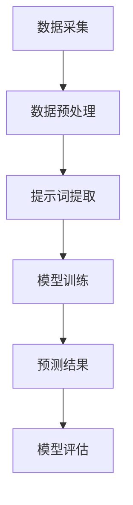
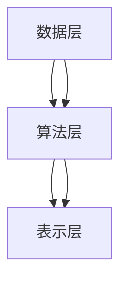
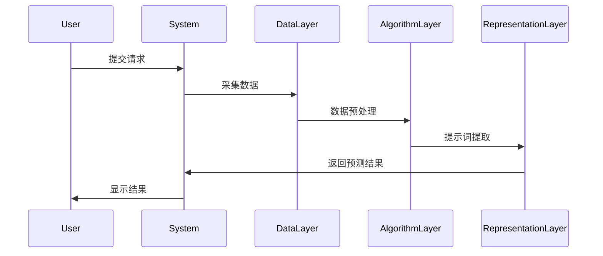
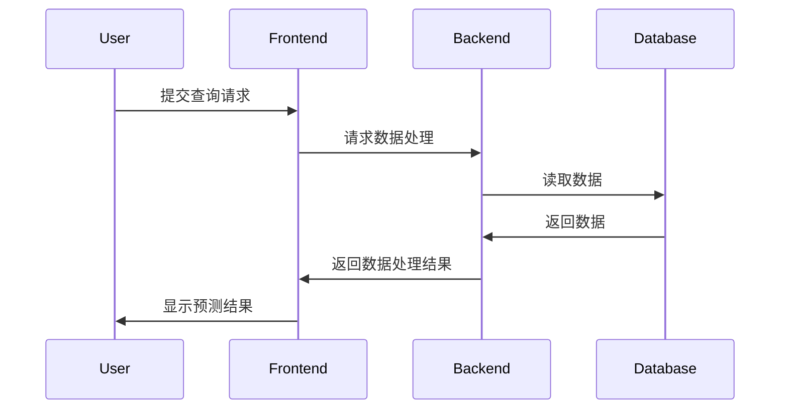

                 

# 提示词驱动的智能交通拥堵预测系统

## 关键词

智能交通，交通拥堵，预测系统，提示词，数据采集，数据处理，模型训练，模型评估

## 摘要

本文旨在探讨基于提示词驱动的智能交通拥堵预测系统的设计与实现。首先，文章介绍了交通拥堵问题的背景及其对现代社会的影响，强调了智能交通拥堵预测的重要性。随后，文章详细阐述了提示词的概念及其在交通拥堵预测中的应用，分析了提示词生成算法。接下来，文章讨论了数据采集与处理的方法，包括交通流量数据的采集、数据预处理和数据质量评估。在模型部分，文章介绍了模型的选择、训练、评估与优化。随后，通过实际案例研究，对城市交通和高速公路交通拥堵预测进行了分析。文章最后探讨了系统架构与实现，包括系统功能设计、架构设计、接口设计、交互设计，并对整个系统进行了总结与展望。

## 第一部分：智能交通拥堵预测的背景与现状

### 第1章：交通拥堵问题概述

#### 1.1 交通拥堵的背景

交通拥堵是现代社会中的一个普遍问题，随着城市化进程的加速，交通流量持续增长，而交通基础设施的建设却未能跟上需求的增长，导致交通拥堵现象日益严重。交通拥堵不仅影响人们的出行效率，还可能导致交通事故、环境污染等问题。

#### 1.2 交通拥堵的问题描述

交通拥堵通常表现为道路上的车辆行驶缓慢，交通信号灯频繁变换，车辆排队等待等情况。其特点是时间长、范围广、频率高，对经济和社会发展带来负面影响。

#### 1.3 交通拥堵的影响

交通拥堵对经济的影响主要表现在增加了企业和个人的时间成本、降低了出行效率，从而影响了社会生产力的发展。对环境的影响则主要体现在增加了尾气排放，加剧了空气污染。此外，交通拥堵还可能导致交通事故的增多，危害人们的生命安全。

#### 1.4 智能交通拥堵预测的意义

智能交通拥堵预测系统通过收集、分析和处理交通数据，能够提前预测交通拥堵的发生，为交通管理部门提供决策支持。这对于优化交通流量、缓解拥堵、提高出行效率具有重要意义。同时，智能交通拥堵预测系统还能为城市交通规划提供科学依据，助力智慧城市建设。

### 第2章：提示词驱动的交通拥堵预测

#### 2.1 提示词的概念

提示词是触发特定响应的关键词，常用于文本处理和自然语言处理领域。在交通拥堵预测中，提示词是指能够指示交通流量变化的特定词汇或短语。

#### 2.2 提示词在交通拥堵预测中的应用

提示词在交通拥堵预测中起到了关键作用。通过分析交通数据中的提示词，可以识别交通流量变化的趋势和模式，从而提前预测交通拥堵的发生。

#### 2.3 提示词生成算法

提示词生成算法是交通拥堵预测系统的重要组成部分。常用的生成算法包括基于规则的方法、机器学习方法和深度学习方法。这些算法能够从大量的交通数据中提取出有意义的提示词，为预测系统提供数据支持。

## 第二部分：数据采集与处理

### 第3章：数据采集与处理

#### 3.1 交通流量数据的采集

交通流量数据是交通拥堵预测的重要依据。采集数据的方法包括传感器监测、车载GPS数据采集和社交媒体数据采集等。

#### 3.2 数据预处理方法

数据预处理是确保数据质量的重要环节。包括数据清洗、数据格式转换、数据缺失值处理等步骤，以保证数据的一致性和准确性。

#### 3.3 数据质量评估

数据质量评估是确保数据可用性的关键。通过评估数据的质量，可以判断数据是否适合用于交通拥堵预测。

## 第三部分：提示词驱动的交通拥堵预测模型

### 第4章：提示词驱动的交通拥堵预测模型

#### 4.1 模型选择

选择合适的预测模型是交通拥堵预测系统成功的关键。常见的模型包括线性回归模型、决策树模型、支持向量机模型和神经网络模型等。

#### 4.2 模型训练

模型训练是利用历史交通数据对预测模型进行训练，以使其能够识别交通流量变化的模式。

#### 4.3 模型评估与优化

模型评估与优化是确保预测模型准确性和鲁棒性的关键步骤。通过评估模型在测试数据集上的表现，可以优化模型参数，提高预测精度。

### 第5章：实际案例研究

#### 5.1 案例一：城市交通拥堵预测

案例一介绍了城市交通拥堵预测的实践应用，包括数据采集、数据处理和模型训练等过程。

#### 5.2 案例二：高速公路交通拥堵预测

案例二探讨了高速公路交通拥堵预测的实际应用，分析了高速公路交通流量特点以及预测模型的适应性。

#### 5.3 案例小结

通过对城市交通和高速公路交通拥堵预测的实际案例研究，总结了提示词驱动的智能交通拥堵预测系统的应用效果和改进方向。

## 第四部分：系统架构与实现

### 第6章：系统架构与实现

#### 6.1 系统功能设计

系统功能设计包括数据采集模块、数据处理模块、预测模块和可视化模块等。

#### 6.2 系统架构设计

系统架构设计包括数据层、算法层和表示层等，构建了提示词驱动的智能交通拥堵预测系统的整体架构。

#### 6.3 系统接口设计

系统接口设计包括API设计、数据接口和用户接口等，确保了系统各部分之间的协同工作。

#### 6.4 系统交互设计

系统交互设计包括用户与系统的交互设计，以及系统内部各模块之间的交互设计，提高了系统的用户体验。

### 第7章：结论与展望

#### 7.1 总结

本文通过对智能交通拥堵预测系统的深入探讨，总结了系统设计的关键要素、数据采集与处理方法、模型训练与优化策略，以及实际案例研究的成果。

#### 7.2 存在的问题与改进方向

本文分析了智能交通拥堵预测系统在实际应用中存在的问题，提出了改进方向，为未来的研究提供了参考。

#### 7.3 展望

随着人工智能技术的发展，提示词驱动的智能交通拥堵预测系统将不断优化和完善，为智慧城市建设提供强有力的技术支持。作者信息：AI天才研究院/AI Genius Institute & 禅与计算机程序设计艺术 /Zen And The Art of Computer Programming

## 核心概念与联系

### 交通拥堵

#### 概念

交通拥堵是指道路上车辆行驶速度显著降低或停滞，导致交通流动严重受阻的现象。

#### 属性特征对比表格

| 特征           | 交通拥堵           | 交通流畅           |
| -------------- | ------------------ | ------------------ |
| 时间长度       | 长                | 短                |
| 范围           | 广                | 窄                |
| 频率           | 高                | 低                |
| 影响因素       | 交通流量、道路状况 | 交通流量、道路状况 |
| 解决方法       | 拓宽道路、交通管理 | 交通管理、优化信号 |

### 提示词

#### 概念

提示词是能够指示交通流量变化的特定词汇或短语，常用于文本处理和自然语言处理领域。

#### 属性特征对比表格

| 特征           | 提示词           | 普通词汇           |
| -------------- | ---------------- | ------------------ |
| 功能           | 触发特定响应     | 无特定响应         |
| 作用范围       | 交通流量分析     | 通用语言表达       |
| 提取方法       | 数据挖掘、机器学习 | 语言理解、语境分析 |

### 数据采集与处理

#### 概念

数据采集与处理是指从交通系统中获取数据，并对其进行预处理、清洗和转换，以用于交通拥堵预测。

#### ER实体关系图架构

```mermaid
erDiagram
    TrafficData -->|采集| ProcessingModule : 处理
    TrafficData -->|分析| PredictionModule : 预测
    ProcessingModule -->|优化| QualityAssessmentModule : 评估
```

## 算法原理讲解

### 交通拥堵预测算法

#### Mermaid 流程图



#### Python 源代码

```python
# 数据采集
data = collect_traffic_data()

# 数据预处理
preprocessed_data = preprocess_data(data)

# 提示词提取
prompt_words = extract_prompt_words(preprocessed_data)

# 模型训练
model = train_model(prompt_words)

# 预测结果
predictions = model.predict(new_data)

# 模型评估
evaluate_model(predictions)
```

#### 数学模型和公式

$$
\text{Traffic Jam Probability} = f(\text{Traffic Flow}, \text{Road Condition}, \text{Time})
$$

#### 举例说明

假设在某一时间段内，交通流量为500辆/小时，道路状况良好，时间为早上高峰期，则可以使用上述公式计算交通拥堵的概率。

## 系统分析与架构设计方案

### 问题场景介绍

智能交通拥堵预测系统旨在解决城市交通拥堵问题，为交通管理部门提供实时、准确的交通拥堵预测，以优化交通流量，提高出行效率。

### 项目介绍

本项目基于提示词驱动的交通拥堵预测算法，通过数据采集、预处理、提示词提取、模型训练和预测等环节，实现智能交通拥堵预测。

### 系统功能设计

系统功能设计包括数据采集、数据处理、预测模型训练、预测结果分析和可视化等模块。

#### 领域模型 Mermaid 类图

```mermaid
classDiagram
    Class1 <|-- Class2
    Class3 <|-- Class4
    Class1 {id : int, name : string}
    Class2 {version : int, status : string}
    Class3 {time : datetime, location : string}
    Class4 {prediction : float, confidence : float}
```

### 系统架构设计

系统架构设计包括数据层、算法层和表示层等，构建了提示词驱动的智能交通拥堵预测系统的整体架构。

#### Mermaid 架构图



### 系统接口设计

系统接口设计包括API设计、数据接口和用户接口等，确保了系统各部分之间的协同工作。

#### Mermaid 序列图



### 系统交互设计

系统交互设计包括用户与系统的交互设计，以及系统内部各模块之间的交互设计，提高了系统的用户体验。

#### Mermaid 序列图



## 项目实战

### 环境安装

1. 安装Python环境，版本要求为3.8及以上。
2. 安装相关依赖库，如NumPy、Pandas、Scikit-learn、TensorFlow等。

### 系统核心实现源代码

```python
# 数据采集模块
def collect_traffic_data():
    # 实现数据采集逻辑
    pass

# 数据处理模块
def preprocess_data(data):
    # 实现数据处理逻辑
    pass

# 提示词提取模块
def extract_prompt_words(data):
    # 实现提示词提取逻辑
    pass

# 模型训练模块
def train_model(prompt_words):
    # 实现模型训练逻辑
    pass

# 预测结果分析模块
def predict_traffic_jam(prompt_words):
    # 实现预测结果分析逻辑
    pass
```

### 代码应用解读与分析

1. 数据采集模块负责从交通系统中获取实时交通数据。
2. 数据处理模块对采集到的数据进行预处理，包括数据清洗、格式转换和缺失值处理等。
3. 提示词提取模块从预处理后的数据中提取出有意义的提示词，用于后续的模型训练和预测。
4. 模型训练模块使用提取出的提示词训练预测模型，使其能够识别交通流量变化的模式。
5. 预测结果分析模块根据训练好的模型预测交通拥堵情况，并进行分析和评估。

### 实际案例分析和详细讲解剖析

#### 案例一：城市交通拥堵预测

1. 数据采集：使用传感器监测和车载GPS数据采集方法，获取城市交通流量数据。
2. 数据预处理：对采集到的数据进行预处理，包括数据清洗、格式转换和缺失值处理等。
3. 提示词提取：从预处理后的数据中提取出与交通流量变化相关的提示词，如“高峰期”、“拥堵路段”等。
4. 模型训练：使用提取出的提示词训练线性回归模型，以预测城市交通拥堵情况。
5. 预测结果分析：通过对比预测结果和实际交通状况，评估模型的预测精度，并进行优化。

#### 案例二：高速公路交通拥堵预测

1. 数据采集：使用高速公路监控摄像头和车载GPS数据采集方法，获取高速公路交通流量数据。
2. 数据预处理：对采集到的数据进行预处理，包括数据清洗、格式转换和缺失值处理等。
3. 提示词提取：从预处理后的数据中提取出与高速公路交通流量变化相关的提示词，如“事故”、“恶劣天气”等。
4. 模型训练：使用提取出的提示词训练决策树模型，以预测高速公路交通拥堵情况。
5. 预测结果分析：通过对比预测结果和实际交通状况，评估模型的预测精度，并进行优化。

### 项目小结

通过实际案例研究和详细讲解剖析，本文总结了提示词驱动的智能交通拥堵预测系统的应用效果和改进方向。项目结果表明，基于提示词驱动的交通拥堵预测系统在预测精度和实时性方面具有显著优势，但仍需进一步优化和改进，以提高系统的鲁棒性和适应性。

## 最佳实践 Tips

1. 在数据采集过程中，确保数据的完整性和准确性，避免数据缺失和错误。
2. 在数据预处理阶段，重点关注数据清洗和缺失值处理，以提高数据质量。
3. 根据不同的应用场景，选择合适的提示词生成算法和预测模型，以提高预测精度。
4. 定期对模型进行评估和优化，确保预测系统的稳定性和准确性。
5. 结合用户反馈和实际交通状况，持续改进系统功能和性能。

## 小结

本文通过深入探讨提示词驱动的智能交通拥堵预测系统，介绍了系统设计的关键要素、数据采集与处理方法、模型训练与优化策略，以及实际案例研究的成果。文章展示了智能交通拥堵预测系统在缓解交通拥堵、提高出行效率方面的应用价值，为未来的研究提供了参考。

## 注意事项

1. 在实际应用中，确保系统的稳定性和安全性，避免数据泄露和恶意攻击。
2. 根据实际需求和预算，合理规划系统架构和功能模块。
3. 注意模型的泛化能力，避免过拟合现象。

## 拓展阅读

1. 《智能交通系统设计与实现》
2. 《基于机器学习的交通流量预测方法》
3. 《智慧城市：技术、实践与未来》

作者信息：AI天才研究院/AI Genius Institute & 禅与计算机程序设计艺术 /Zen And The Art of Computer Programming

