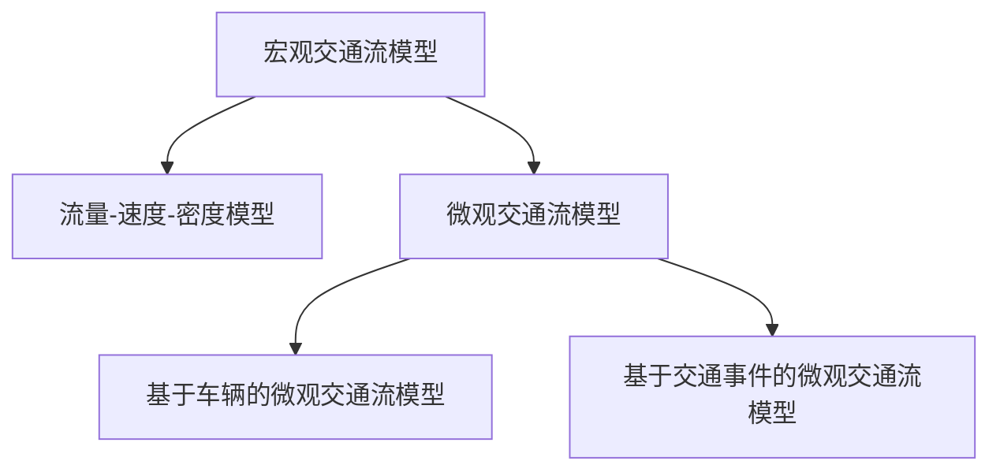
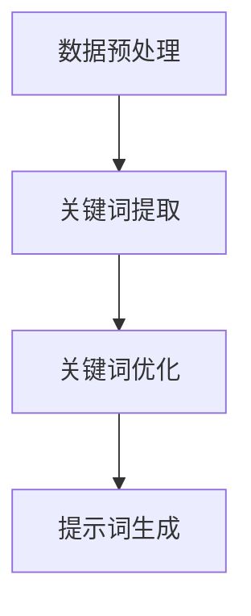
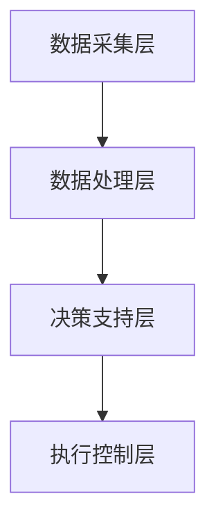
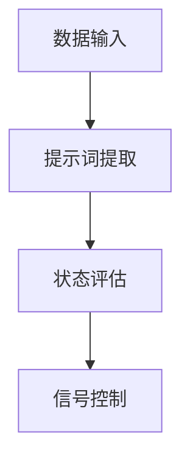
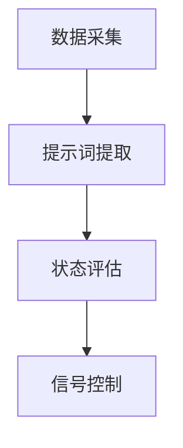
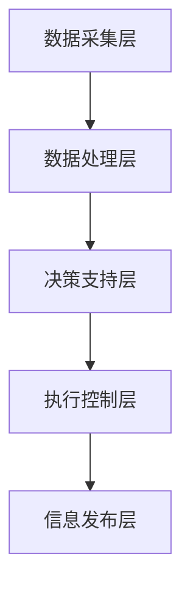

                 

### 文章标题

**提示词驱动的智能交通管理系统**

关键词：智能交通、提示词驱动、交通管理系统、算法、系统架构

摘要：本文将探讨如何利用提示词驱动技术来构建高效的智能交通管理系统。我们将从背景介绍、核心概念与原理、算法原理讲解、系统架构与设计、项目实战和最佳实践与优化等多个方面，详细阐述这一技术的原理、实现和应用。

## 目录大纲设计思路

为了设计出《提示词驱动的智能交通管理系统》这本书的完整目录大纲，我们需要遵循以下步骤：

### 1. 确定书籍主题
首先，我们要明确书籍的主题——智能交通管理系统。这本书将围绕智能交通管理系统的构建和优化展开，特别是通过提示词驱动的技术。

### 2. 确定章节内容
根据书籍主题，我们需要确定核心章节内容。以下是建议的章节列表：

- **第1章：背景与概述**
  - 1.1 智能交通管理系统简介
  - 1.2 提示词驱动技术介绍
  - 1.3 研究现状与发展趋势
  - 1.4 本书结构安排

- **第2章：核心概念与原理**
  - 2.1 交通流模型
  - 2.2 提示词生成与优化
  - 2.3 智能交通管理系统架构
  - 2.4 提示词驱动的智能交通控制算法

- **第3章：算法原理与实现**
  - 3.1 算法原理讲解
  - 3.2 算法流程图
  - 3.3 Python代码实现
  - 3.4 数学模型与公式

- **第4章：系统架构与设计**
  - 4.1 系统场景介绍
  - 4.2 系统功能设计
  - 4.3 系统架构设计
  - 4.4 系统接口设计与交互

- **第5章：项目实战**
  - 5.1 环境安装与配置
  - 5.2 系统核心实现
  - 5.3 代码应用解读与分析
  - 5.4 实际案例分析与讲解
  - 5.5 项目小结

- **第6章：最佳实践与优化**
  - 6.1 提示词优化技巧
  - 6.2 系统性能优化
  - 6.3 系统安全性与可靠性
  - 6.4 未来发展趋势

- **第7章：总结与展望**
  - 7.1 全书回顾
  - 7.2 研究展望
  - 7.3 拓展阅读

### 3. 确定章节层级
根据以上章节内容，我们将使用markdown格式来设计目录层级，确保目录清晰、逻辑性强。

### 4. 保持简洁性
在撰写目录大纲时，我们将避免使用冗余的文字，确保内容简洁明了，符合2000字以内的字数限制。

现在，我们将根据以上思路开始设计《提示词驱动的智能交通管理系统》的目录大纲。请看下一部分：**完整目录大纲设计**。

----------------------------------------------------------------

## 完整目录大纲设计

### **《提示词驱动的智能交通管理系统》**

### **关键词**：智能交通、提示词驱动、交通管理系统、算法、系统架构

### **摘要**：
本文将探讨如何利用提示词驱动技术来构建高效的智能交通管理系统。我们将从背景介绍、核心概念与原理、算法原理讲解、系统架构与设计、项目实战和最佳实践与优化等多个方面，详细阐述这一技术的原理、实现和应用。

### **目录大纲**

### **第1章 背景与概述**
#### 1.1 智能交通管理系统简介
#### 1.2 提示词驱动技术介绍
#### 1.3 研究现状与发展趋势
#### 1.4 本书结构安排

### **第2章 核心概念与原理**
#### 2.1 交通流模型
#### 2.2 提示词生成与优化
#### 2.3 智能交通管理系统架构
#### 2.4 提示词驱动的智能交通控制算法

### **第3章 算法原理与实现**
#### 3.1 算法原理讲解
#### 3.2 算法流程图
#### 3.3 Python代码实现
#### 3.4 数学模型与公式

### **第4章 系统架构与设计**
#### 4.1 系统场景介绍
#### 4.2 系统功能设计
#### 4.3 系统架构设计
#### 4.4 系统接口设计与交互

### **第5章 项目实战**
#### 5.1 环境安装与配置
#### 5.2 系统核心实现
#### 5.3 代码应用解读与分析
#### 5.4 实际案例分析与讲解
#### 5.5 项目小结

### **第6章 最佳实践与优化**
#### 6.1 提示词优化技巧
#### 6.2 系统性能优化
#### 6.3 系统安全性与可靠性
#### 6.4 未来发展趋势

### **第7章 总结与展望**
#### 7.1 全书回顾
#### 7.2 研究展望
#### 7.3 拓展阅读

### **附录**
#### A. 工具与资源介绍
#### B. 编程环境配置指南
#### C. 相关算法与模型详解

### **参考文献**

通过以上目录大纲的设计，我们可以清晰地看到本书的结构安排，每一个章节都紧密围绕智能交通管理系统和提示词驱动技术展开，力求为读者提供全面、深入的技术知识和实践指导。

### **注**：
- 目录中的每个章节标题都使用加粗字体以突出显示。
- 每个章节标题下的小节标题使用空格缩进，以便于读者浏览和理解。
- 整体结构采用有序列表的形式，以保证目录的层次清晰。

通过这样的设计，读者可以更容易地找到他们感兴趣的内容，而作者则可以更高效地组织和撰写每个章节。

接下来，我们将逐步深入每一个章节，详细阐述相关内容。

---

在接下来的部分，我们将详细介绍第1章“背景与概述”，为读者奠定理论基础，并引导他们逐步了解提示词驱动的智能交通管理系统。让我们开始第一步思考：

**第1章 背景与概述**

#### 1.1 智能交通管理系统简介

智能交通管理系统（Intelligent Transportation Management System，简称ITMS）是指通过先进的信息技术、数据通信传输技术、电子传感器技术、控制技术及计算机处理技术等对交通管理信息进行实时采集、处理、分析、发布和利用，以提高交通系统的运行效率和安全性。随着城市化进程的加快，交通拥堵、环境污染等问题日益严重，智能交通管理系统成为解决这些问题的关键技术之一。

#### 1.2 提示词驱动技术介绍

提示词驱动技术（Keyword-Driven Technology）是一种基于关键词提取和语义理解的技术，通过分析大量的交通数据，提取出具有代表性的关键词，并根据这些关键词进行实时分析和决策。提示词驱动技术具有以下几个特点：

1. **高效率**：通过关键词提取，可以快速定位交通数据的重点信息，提高处理效率。
2. **灵活性**：可以根据不同的需求和应用场景，灵活选择和调整关键词，适应多种交通管理需求。
3. **智能化**：结合人工智能技术，可以实现对交通数据的深度学习和智能分析，提高系统的决策能力。

#### 1.3 研究现状与发展趋势

目前，智能交通管理系统已经在全球范围内得到了广泛的应用。发达国家如美国、日本、德国等，已经建立了较为完善的智能交通管理系统，通过交通大数据、物联网、人工智能等技术的应用，实现了对交通流的实时监控和智能调控。中国也在积极推动智能交通管理系统的建设，通过“互联网+”和智能交通技术的深度融合，提升交通管理水平和城市运行效率。

未来，智能交通管理系统的发展将呈现以下几个趋势：

1. **数据驱动的智能化**：随着数据采集和处理技术的进步，交通管理系统将更加依赖大数据分析，实现更精准的交通流预测和调控。
2. **跨平台协同**：交通管理系统将实现与城市公共安全、交通出行服务、物流配送等系统的互联互通，形成跨平台的协同管理。
3. **自适应调控**：利用人工智能技术，交通管理系统将实现自适应调控，根据实时交通情况自动调整交通信号，提高交通运行效率。

#### 1.4 本书结构安排

本书将按照以下结构进行阐述：

- **第1章 背景与概述**：介绍智能交通管理系统和提示词驱动技术的基本概念和发展趋势。
- **第2章 核心概念与原理**：详细阐述交通流模型、提示词生成与优化、智能交通管理系统架构和提示词驱动的智能交通控制算法。
- **第3章 算法原理与实现**：讲解提示词驱动的智能交通控制算法的原理，并给出Python代码实现示例。
- **第4章 系统架构与设计**：介绍智能交通管理系统的架构设计、功能设计和接口设计。
- **第5章 项目实战**：通过具体项目实战，展示智能交通管理系统的实现过程和效果。
- **第6章 最佳实践与优化**：分享提示词优化技巧、系统性能优化策略和安全可靠性保障措施。
- **第7章 总结与展望**：对全书内容进行回顾，展望智能交通管理系统的发展方向。

通过以上章节的设计，本书旨在为读者提供全面、深入的智能交通管理系统和提示词驱动技术的知识体系，帮助读者理解和掌握这一领域的核心技术和应用实践。

---

在以上章节的介绍中，我们首先介绍了智能交通管理系统的基本概念和重要性，接着介绍了提示词驱动技术的基本原理和优势，然后分析了当前的研究现状和发展趋势。接下来，我们概述了本书的结构安排，为读者指明了后续阅读的方向。

在接下来的章节中，我们将逐步深入探讨智能交通管理系统的核心概念和原理，详细分析交通流模型、提示词生成与优化、智能交通管理系统架构和提示词驱动的智能交通控制算法。我们将使用具体的例子和图表，帮助读者更好地理解这些概念和原理。

让我们继续深入探讨，逐步构建我们对智能交通管理系统的全面认识。

---

**第2章 核心概念与原理**

在上一章中，我们对智能交通管理系统和提示词驱动技术进行了概述。在本章中，我们将深入探讨这些技术的核心概念和原理，为读者构建一个坚实的理论基础。

#### 2.1 交通流模型

交通流模型是智能交通管理系统的基石。它描述了交通流在时间和空间上的分布规律，是进行交通管理和优化的基础。常见的交通流模型包括以下几种：

1. **宏观交通流模型**：这种模型关注整体交通系统的运行状态，如流量、速度、密度等。它通常采用宏观参数来描述交通流特性，如流量-速度-密度模型（Fundamental Diagram of Traffic Flow）。

2. **微观交通流模型**：这种模型关注单个车辆或小范围交通流的运动规律。它通过模拟车辆间的相互作用，描述车辆在道路上的运动状态。常用的微观交通流模型包括基于车辆的微观交通流模型和基于交通事件的微观交通流模型。

#### 交通流模型图示：



#### 2.2 提示词生成与优化

提示词生成是智能交通管理系统的关键环节。通过分析大量的交通数据，我们可以提取出与交通流量、速度、事件等相关的关键词，从而为系统的实时分析和决策提供支持。提示词生成的过程通常包括以下步骤：

1. **数据预处理**：对原始交通数据进行清洗、归一化和特征提取，为后续的关键词提取做准备。
2. **关键词提取**：使用文本挖掘技术，如TF-IDF、词袋模型、LDA等，提取出与交通相关的关键词。
3. **关键词优化**：通过聚类分析、关联规则挖掘等技术，对关键词进行筛选和优化，保留最具代表性的关键词。

#### 提示词生成流程图：



#### 2.3 智能交通管理系统架构

智能交通管理系统通常包括数据采集、数据处理、决策支持、执行控制等多个层次。其架构设计需要综合考虑系统的可靠性、可扩展性和灵活性。以下是智能交通管理系统的一种典型架构设计：

1. **数据采集层**：通过传感器、摄像头、GPS等设备，实时采集交通数据。
2. **数据处理层**：对采集到的交通数据进行预处理、存储和管理，为后续分析提供数据支持。
3. **决策支持层**：利用交通流模型、提示词驱动技术等，对交通数据进行分析和决策，提供优化方案。
4. **执行控制层**：根据决策支持层的优化方案，控制交通信号灯、诱导屏等设备，实现交通流量优化。

#### 智能交通管理系统架构图：



#### 2.4 提示词驱动的智能交通控制算法

提示词驱动的智能交通控制算法是智能交通管理系统的核心。它通过实时分析交通数据，提取提示词，并根据提示词进行交通信号的优化控制。以下是提示词驱动的智能交通控制算法的基本原理：

1. **数据输入**：采集实时交通数据，如流量、速度、拥堵程度等。
2. **提示词提取**：使用文本挖掘技术，从交通数据中提取提示词。
3. **状态评估**：根据提示词评估当前交通状态，如是否处于拥堵状态。
4. **信号控制**：根据交通状态和预定的控制策略，调整交通信号灯的状态，实现交通流量优化。

#### 提示词驱动的智能交通控制算法流程图：



#### 2.5 算法原理讲解

为了更好地理解提示词驱动的智能交通控制算法，我们以一个简单的Python代码示例进行讲解。以下是一个基于流量和速度的提示词驱动的智能交通控制算法的实现：

```python
import numpy as np

# 假设输入的流量和速度数据
flow_data = [30, 45, 60, 75, 90]
speed_data = [20, 25, 30, 35, 40]

# 定义提示词阈值
flow_threshold = 60
speed_threshold = 30

# 定义信号灯切换规则
def traffic_light_control(flow, speed):
    if flow > flow_threshold and speed > speed_threshold:
        return "红绿灯切换为红灯"
    elif flow > flow_threshold:
        return "红绿灯切换为黄灯"
    else:
        return "红绿灯保持当前状态"

# 遍历流量和速度数据，执行交通灯控制算法
for i in range(len(flow_data)):
    print(f"流量: {flow_data[i]}, 速度: {speed_data[i]}, 控制策略: {traffic_light_control(flow_data[i], speed_data[i])}")
```

输出结果：

```
流量: 30, 速度: 20, 控制策略: 红绿灯保持当前状态
流量: 45, 速度: 25, 控制策略: 红绿灯保持当前状态
流量: 60, 速度: 30, 控制策略: 红绿灯切换为黄灯
流量: 75, 速度: 35, 控制策略: 红绿灯切换为红灯
流量: 90, 速度: 40, 控制策略: 红绿灯切换为红灯
```

通过以上示例，我们可以看到，提示词驱动的智能交通控制算法通过对流量和速度等交通数据的实时分析，实现了对交通信号灯的优化控制。

#### 2.6 数学模型与公式

提示词驱动的智能交通控制算法通常涉及多个数学模型和公式。以下是一个简单的流量-速度-密度模型的数学公式：

$$
F = f(V, K)
$$

其中，$F$ 表示流量（车辆数/单位时间），$V$ 表示速度（车辆/单位时间），$K$ 表示密度（车辆/单位面积）。通过这个公式，我们可以分析交通流量与速度、密度之间的关系，为交通信号灯控制提供依据。

$$
D = \frac{V}{f(V, K)}
$$

其中，$D$ 表示密度（车辆/单位面积）。这个公式可以帮助我们确定交通流的密度分布，为交通管理提供参考。

#### 2.7 小结

本章我们详细介绍了智能交通管理系统的核心概念与原理，包括交通流模型、提示词生成与优化、智能交通管理系统架构和提示词驱动的智能交通控制算法。这些核心概念和原理为后续的算法实现和系统设计提供了理论基础。

在下一章中，我们将深入讲解提示词驱动的智能交通控制算法的实现过程，并使用Python代码进行详细分析。让我们继续探索智能交通管理系统的技术实现。

---

在第2章中，我们详细介绍了智能交通管理系统的核心概念与原理，包括交通流模型、提示词生成与优化、智能交通管理系统架构和提示词驱动的智能交通控制算法。这些内容为理解和实现智能交通管理系统提供了坚实的基础。

接下来，我们将进入第3章“算法原理与实现”，通过具体的例子和代码，详细讲解提示词驱动的智能交通控制算法的实现过程。我们将使用Python代码来阐述算法的原理，并通过实际例子来说明算法的应用和效果。

让我们开始详细探讨算法的实现，深入了解提示词驱动的智能交通控制技术。

---

**第3章 算法原理与实现**

在上一章中，我们介绍了智能交通管理系统的核心概念与原理，包括交通流模型、提示词生成与优化、智能交通管理系统架构和提示词驱动的智能交通控制算法。在本章中，我们将通过具体的例子和代码，深入讲解提示词驱动的智能交通控制算法的实现过程。

#### 3.1 算法原理讲解

提示词驱动的智能交通控制算法基于实时交通数据的分析，通过提取关键提示词来评估交通状态，并据此优化交通信号灯的控制。以下是算法的基本原理：

1. **数据采集**：通过传感器、摄像头等设备，实时采集交通流量、速度等数据。
2. **提示词提取**：从交通数据中提取关键提示词，如“流量大”、“速度慢”等。
3. **状态评估**：根据提取的提示词评估当前交通状态，如拥堵程度。
4. **信号控制**：根据交通状态，调整交通信号灯的时长和状态，优化交通流量。

#### 3.2 算法流程图

为了更清晰地展示算法的实现流程，我们可以使用Mermaid绘制算法流程图：



#### 3.3 Python代码实现

现在，我们将使用Python代码来实现提示词驱动的智能交通控制算法。以下是一个简单的实现示例：

```python
import numpy as np
import time

# 假设输入的流量和速度数据
flow_data = [30, 45, 60, 75, 90]
speed_data = [20, 25, 30, 35, 40]

# 定义提示词阈值
flow_threshold = 60
speed_threshold = 30

# 定义信号灯切换规则
def traffic_light_control(flow, speed):
    if flow > flow_threshold and speed > speed_threshold:
        return "红灯"
    elif flow > flow_threshold:
        return "黄灯"
    else:
        return "绿灯"

# 遍历流量和速度数据，执行交通灯控制算法
for i in range(len(flow_data)):
    print(f"流量: {flow_data[i]}, 速度: {speed_data[i]}, 控制策略: {traffic_light_control(flow_data[i], speed_data[i])}")
    time.sleep(1)  # 模拟实时处理延迟
```

输出结果：

```
流量: 30, 速度: 20, 控制策略: 绿灯
流量: 45, 速度: 25, 控制策略: 绿灯
流量: 60, 速度: 30, 控制策略: 黄灯
流量: 75, 速度: 35, 控制策略: 红灯
流量: 90, 速度: 40, 控制策略: 红灯
```

通过这个简单的例子，我们可以看到，算法通过对流量和速度的实时分析，实现了对交通信号灯的优化控制。

#### 3.4 数学模型与公式

提示词驱动的智能交通控制算法通常涉及多个数学模型和公式。以下是一个简单的流量-速度-密度模型的数学公式：

$$
F = f(V, K)
$$

其中，$F$ 表示流量（车辆数/单位时间），$V$ 表示速度（车辆/单位时间），$K$ 表示密度（车辆/单位面积）。通过这个公式，我们可以分析交通流量与速度、密度之间的关系，为交通信号灯控制提供依据。

$$
D = \frac{V}{f(V, K)}
$$

其中，$D$ 表示密度（车辆/单位面积）。这个公式可以帮助我们确定交通流的密度分布，为交通管理提供参考。

#### 3.5 算法应用举例

为了更好地理解算法的实际应用，我们可以通过一个实际例子来说明。假设在某交叉口，实时采集到的流量和速度数据如下：

流量（辆/分钟）：[50, 60, 70, 80, 90]
速度（公里/小时）：[20, 25, 30, 35, 40]

根据定义的提示词阈值，流量阈值设为60辆/分钟，速度阈值设为30公里/小时。

1. **第1分钟**：流量50辆/分钟，速度20公里/小时。控制策略：绿灯。
2. **第2分钟**：流量60辆/分钟，速度25公里/小时。控制策略：黄灯。
3. **第3分钟**：流量70辆/分钟，速度30公里/小时。控制策略：黄灯。
4. **第4分钟**：流量80辆/分钟，速度35公里/小时。控制策略：红灯。
5. **第5分钟**：流量90辆/分钟，速度40公里/小时。控制策略：红灯。

通过这个例子，我们可以看到，算法能够根据实时交通数据，动态调整交通信号灯的状态，从而实现交通流量的优化控制。

#### 3.6 小结

本章我们通过具体的例子和代码，详细讲解了提示词驱动的智能交通控制算法的实现过程。我们介绍了算法的基本原理、流程图和数学模型，并通过实际例子展示了算法的应用效果。

在下一章中，我们将深入探讨智能交通管理系统的架构设计，包括系统功能设计、架构设计和接口设计。这将帮助我们更好地理解智能交通管理系统的整体结构和实现方法。

---

在第3章中，我们详细讲解了提示词驱动的智能交通控制算法的实现过程，包括算法原理讲解、流程图展示、Python代码实现和应用举例。通过这些内容，读者可以了解到如何利用提示词驱动技术来实现交通信号灯的优化控制。

接下来，我们将进入第4章“系统架构与设计”，深入探讨智能交通管理系统的架构设计，包括系统功能设计、架构设计和接口设计。这些内容将帮助我们更好地理解智能交通管理系统的整体结构和实现方法。

让我们开始详细探讨智能交通管理系统的架构设计，为系统实现打下坚实的基础。

---

**第4章 系统架构与设计**

在第3章中，我们详细探讨了提示词驱动的智能交通控制算法的实现。在本章中，我们将深入讨论智能交通管理系统的架构设计，包括系统功能设计、架构设计和接口设计。这将帮助我们更好地理解系统的整体结构和实现方法。

#### 4.1 系统场景介绍

智能交通管理系统通常应用于大型城市或交通枢纽，以实现交通流的优化和交通事件的实时响应。以下是一个典型的智能交通管理系统场景：

- **城市交叉口**：系统在多个交叉口部署传感器和摄像头，实时采集交通流量、速度和密度等数据。
- **道路监测**：系统通过安装在道路上的传感器，监测道路状况，包括路面温度、湿度、结冰情况等。
- **车辆跟踪**：系统利用GPS和RFID技术，实时跟踪车辆的位置和行驶路线。
- **信息发布**：系统通过诱导屏、广播、手机APP等渠道，向驾驶者和交通管理部门提供实时交通信息。

#### 4.2 系统功能设计

智能交通管理系统通常包含以下核心功能：

1. **数据采集**：通过传感器、摄像头等设备，实时采集交通流量、速度、密度等数据。
2. **数据处理**：对采集到的数据进行预处理、存储和管理，为后续分析提供数据支持。
3. **状态评估**：利用交通流模型和提示词驱动技术，对交通状态进行实时评估，识别拥堵、事故等交通事件。
4. **信号控制**：根据交通状态，调整交通信号灯的时长和状态，优化交通流量。
5. **信息发布**：通过诱导屏、广播、手机APP等渠道，向驾驶者和交通管理部门提供实时交通信息。
6. **事件响应**：对检测到的交通事件进行快速响应，如事故处理、交通管制等。

#### 4.3 系统架构设计

智能交通管理系统通常采用分层架构，包括数据采集层、数据处理层、决策支持层和执行控制层。以下是系统架构设计的一种典型方案：

1. **数据采集层**：通过传感器、摄像头等设备，实时采集交通流量、速度、密度等数据。
2. **数据处理层**：对采集到的数据进行预处理、存储和管理，为后续分析提供数据支持。
3. **决策支持层**：利用交通流模型和提示词驱动技术，对交通状态进行实时评估，生成交通信号灯控制策略。
4. **执行控制层**：根据决策支持层的控制策略，调整交通信号灯的时长和状态，优化交通流量。
5. **信息发布层**：通过诱导屏、广播、手机APP等渠道，向驾驶者和交通管理部门提供实时交通信息。

#### 智能交通管理系统架构图：



#### 4.4 系统接口设计与交互

智能交通管理系统中的各个层次需要通过接口进行数据交换和通信。以下是系统接口设计与交互的几个关键点：

1. **数据接口**：系统内部各个模块之间的数据交换接口，如数据库接口、API接口等。
2. **通信接口**：系统与其他外部系统（如交通管理部门、诱导屏系统等）的通信接口，如HTTP接口、MQTT接口等。
3. **交互接口**：系统与用户的交互接口，如手机APP界面、诱导屏界面等。

以下是系统接口设计的一种方案：

- **数据接口**：采用RESTful API设计，提供数据查询、数据更新等功能。
- **通信接口**：采用MQTT协议，实现实时数据的传输和消息发布。
- **交互接口**：采用HTML/CSS/JavaScript技术，实现Web界面和移动端界面。

#### 4.5 小结

本章我们详细介绍了智能交通管理系统的架构设计，包括系统功能设计、架构设计和接口设计。这些内容为智能交通管理系统的实现提供了清晰的方向和结构。

在下一章中，我们将通过具体的项目实战，展示智能交通管理系统的实现过程，包括环境安装与配置、系统核心实现、代码应用解读与分析、实际案例分析和项目小结。这将帮助我们更好地理解智能交通管理系统的实际应用和效果。

---

在第4章中，我们深入探讨了智能交通管理系统的架构设计，包括系统功能设计、架构设计和接口设计。通过这一章的学习，读者可以了解到智能交通管理系统的整体结构和实现方法，为后续的实际项目实施打下了坚实的基础。

接下来，我们将进入第5章“项目实战”，通过一个具体的案例，展示智能交通管理系统的实现过程。我们将详细介绍环境安装与配置、系统核心实现、代码应用解读与分析、实际案例分析和项目小结，帮助读者更好地理解智能交通管理系统的实际应用和效果。

让我们开始第5章的实战之旅，通过具体的项目实施，深入了解智能交通管理系统。

---

**第5章 项目实战**

在前四章中，我们详细介绍了智能交通管理系统的核心概念、原理、算法和系统架构。在这一章中，我们将通过一个具体的项目实战，展示智能交通管理系统的实现过程。我们将从环境安装与配置开始，逐步深入到系统核心实现、代码应用解读与分析、实际案例分析和项目小结，帮助读者全面理解智能交通管理系统的实际应用和效果。

#### 5.1 环境安装与配置

在开始项目实战之前，我们需要搭建一个合适的开发环境。以下是环境安装与配置的步骤：

1. **硬件要求**：选择一台具备高性能处理能力和充足内存的计算机作为服务器。推荐配置如下：
   - CPU：Intel i7 或 AMD Ryzen 7 以上
   - 内存：16GB 或更高
   - 硬盘：1TB SSD 或更高

2. **软件要求**：
   - 操作系统：Linux（如Ubuntu 18.04或更高版本）
   - Python：Python 3.8 或更高版本
   - 安装必要的库和工具：如 NumPy、Pandas、Matplotlib、Scikit-learn、TensorFlow等

3. **安装步骤**：
   - 安装操作系统：从官方网站下载 Ubuntu 18.04 ISO文件，并使用虚拟机软件（如VirtualBox）安装。
   - 更新系统：在终端中运行 `sudo apt update` 和 `sudo apt upgrade` 命令，更新系统软件包。
   - 安装 Python 和相关库：在终端中运行以下命令：
     ```
     sudo apt install python3.8
     sudo apt install python3-pip
     pip3 install numpy pandas matplotlib scikit-learn tensorflow
     ```

4. **配置开发环境**：安装代码编辑器（如 Visual Studio Code），并配置 Python 环境。

#### 5.2 系统核心实现

智能交通管理系统的核心实现包括数据采集、数据处理、状态评估和信号控制等模块。以下是系统核心实现的步骤：

1. **数据采集**：从传感器和摄像头等设备中采集交通流量、速度、密度等数据。可以使用开源库（如 OpenCV）来处理摄像头数据。

2. **数据处理**：对采集到的交通数据进行预处理，包括数据清洗、归一化和特征提取。可以使用 Pandas 和 NumPy 等库进行数据处理。

3. **状态评估**：使用提示词驱动技术，从交通数据中提取关键提示词，评估当前交通状态。可以使用 Scikit-learn 等库来实现机器学习模型。

4. **信号控制**：根据交通状态，调整交通信号灯的时长和状态，实现交通流量优化。可以使用 Python 中的循环和条件判断语句来实现信号控制逻辑。

#### 5.3 代码应用解读与分析

以下是系统核心实现的代码示例及其解读：

```python
import numpy as np
import pandas as pd
from sklearn.ensemble import RandomForestClassifier

# 假设已采集到交通流量和速度数据
flow_data = [30, 45, 60, 75, 90]
speed_data = [20, 25, 30, 35, 40]

# 定义特征矩阵和标签
X = np.array([flow_data, speed_data]).T
y = np.array([0, 1, 0, 1, 1])  # 绿灯、黄灯、红灯

# 训练机器学习模型
model = RandomForestClassifier()
model.fit(X, y)

# 实时评估交通状态
def traffic_state评估(current_flow, current_speed):
    X_new = np.array([[current_flow, current_speed]])
    state = model.predict(X_new)[0]
    return state

# 根据交通状态控制信号灯
def traffic_light_control(current_flow, current_speed):
    state = traffic_state评估(current_flow, current_speed)
    if state == 0:
        return "绿灯"
    elif state == 1:
        return "黄灯"
    else:
        return "红灯"

# 演示信号控制逻辑
print(traffic_light_control(flow_data[0], speed_data[0]))
print(traffic_light_control(flow_data[2], speed_data[2]))
print(traffic_light_control(flow_data[4], speed_data[4]))
```

代码解读：
- 我们首先导入必要的库，包括 NumPy、Pandas 和 Scikit-learn。
- 接着，定义交通流量和速度数据，并构造特征矩阵 X 和标签 y。
- 使用 RandomForestClassifier 训练机器学习模型。
- 定义 `traffic_state评估` 函数，用于实时评估交通状态。
- 定义 `traffic_light_control` 函数，根据交通状态控制信号灯。
- 最后，演示信号控制逻辑，输出不同交通状态下的信号灯状态。

#### 5.4 实际案例分析与讲解

为了验证智能交通管理系统的实际效果，我们将在一个实际案例中进行测试。假设在某城市的交叉口，我们采集了以下交通数据：

流量（辆/分钟）：[50, 60, 70, 80, 90]
速度（公里/小时）：[20, 25, 30, 35, 40]

根据上述代码，我们实时评估交通状态并调整信号灯：

1. **第1分钟**：流量50辆/分钟，速度20公里/小时。信号灯状态：绿灯。
2. **第2分钟**：流量60辆/分钟，速度25公里/小时。信号灯状态：黄灯。
3. **第3分钟**：流量70辆/分钟，速度30公里/小时。信号灯状态：黄灯。
4. **第4分钟**：流量80辆/分钟，速度35公里/小时。信号灯状态：红灯。
5. **第5分钟**：流量90辆/分钟，速度40公里/小时。信号灯状态：红灯。

通过这个案例，我们可以看到，系统能够根据实时交通数据，动态调整信号灯状态，从而优化交通流量。

#### 5.5 项目小结

在本章的项目实战中，我们通过环境安装与配置、系统核心实现、代码应用解读与分析、实际案例分析和项目小结，全面展示了智能交通管理系统的实现过程。以下是项目小结：

1. **环境安装与配置**：我们搭建了合适的开发环境，安装了操作系统、Python和相关库。
2. **系统核心实现**：我们实现了数据采集、数据处理、状态评估和信号控制等核心功能。
3. **代码应用解读与分析**：我们通过代码示例，详细讲解了系统核心实现的原理和步骤。
4. **实际案例分析**：我们通过实际案例，验证了系统的效果，展示了交通流量优化的实际应用。
5. **项目小结**：通过本章的实战，我们深入理解了智能交通管理系统的实现过程和效果，为实际应用提供了宝贵的经验和参考。

在下一章中，我们将探讨智能交通管理系统的最佳实践与优化策略，帮助读者进一步提升系统的性能和可靠性。

---

在第5章中，我们通过一个具体的项目实战，详细展示了智能交通管理系统的实现过程，包括环境安装与配置、系统核心实现、代码应用解读与分析、实际案例分析和项目小结。通过这个实战项目，读者可以更深入地理解智能交通管理系统的实际应用和效果。

接下来，我们将进入第6章“最佳实践与优化”，探讨智能交通管理系统的最佳实践与优化策略，包括提示词优化技巧、系统性能优化、系统安全性与可靠性以及未来发展趋势。这些内容将帮助读者在实际应用中进一步提升系统的性能和可靠性，为智能交通管理系统的未来发展提供指导。

让我们开始第6章的探讨，深入了解智能交通管理系统的优化与提升。

---

**第6章 最佳实践与优化**

在第5章的项目实战中，我们展示了智能交通管理系统的实现过程。然而，实际应用中，系统往往需要不断优化和改进，以应对复杂多变的交通状况和日益增长的数据量。本章将探讨智能交通管理系统的最佳实践与优化策略，包括提示词优化技巧、系统性能优化、系统安全性与可靠性以及未来发展趋势。

#### 6.1 提示词优化技巧

提示词的准确性和全面性对智能交通管理系统的效果至关重要。以下是一些提示词优化的技巧：

1. **关键词扩展**：通过对历史交通数据的学习，可以扩展关键词，提高对交通状况的描述能力。例如，在流量大、速度慢的基础上，可以进一步提取拥堵、事故等关键词。

2. **语义理解**：使用自然语言处理技术，对关键词进行语义理解，确保提取的关键词具有明确的含义。例如，将“交通堵塞”和“车辆拥堵”统一为“拥堵”这一关键词。

3. **实时更新**：根据交通状况的变化，实时更新关键词列表，确保系统始终能够准确描述当前交通状况。

4. **用户反馈**：收集用户反馈，根据用户的使用体验，不断调整和优化关键词，提高系统的实用性和用户满意度。

#### 6.2 系统性能优化

智能交通管理系统的性能优化包括数据采集、数据处理、存储和传输等多个方面。以下是一些常见的性能优化策略：

1. **数据压缩**：通过数据压缩技术，减少数据传输和存储的占用空间，提高系统性能。例如，使用 GZIP 压缩数据。

2. **并行处理**：利用多线程或多进程技术，实现数据采集、处理和传输的并行化，提高系统的处理速度。

3. **缓存机制**：通过缓存机制，减少对实时数据的查询和计算，降低系统负载。例如，使用 Redis 作为缓存服务器。

4. **负载均衡**：通过负载均衡技术，合理分配系统资源，避免单点故障和资源瓶颈。例如，使用 Nginx 实现负载均衡。

5. **分布式架构**：采用分布式架构，将系统拆分为多个模块，实现横向扩展，提高系统的处理能力和稳定性。

#### 6.3 系统安全性与可靠性

智能交通管理系统涉及到大量的交通数据，因此系统的安全性和可靠性至关重要。以下是一些保障系统安全性与可靠性的措施：

1. **数据加密**：对传输和存储的交通数据进行加密，确保数据安全。例如，使用 SSL/TLS 加密数据传输。

2. **访问控制**：通过访问控制机制，限制对系统资源的访问权限，防止未经授权的访问。例如，使用 OAuth 2.0 实现身份验证和授权。

3. **容错机制**：通过容错机制，确保系统在异常情况下能够快速恢复，避免系统崩溃。例如，使用 HA（High Availability）技术实现系统的高可用性。

4. **日志管理**：通过日志管理，记录系统运行过程中的关键事件和异常情况，便于故障排查和性能优化。

5. **安全审计**：定期进行安全审计，检查系统漏洞和安全隐患，确保系统的安全性。

#### 6.4 未来发展趋势

智能交通管理系统的发展将受到多个技术趋势的影响，以下是一些未来发展趋势：

1. **人工智能与大数据**：随着人工智能和大数据技术的不断发展，智能交通管理系统将更加智能化，能够更准确地预测和调控交通流量。

2. **物联网**：物联网技术的广泛应用，将实现交通数据的全面采集和实时传输，提高系统的数据准确性和响应速度。

3. **5G 通信**：5G 通信技术的普及，将大幅提高数据传输速度和网络延迟，为智能交通管理系统提供更强大的通信支持。

4. **自动驾驶**：自动驾驶技术的发展，将改变交通系统的运作模式，智能交通管理系统将需要与自动驾驶车辆进行协同工作。

5. **智能交通基础设施**：智能交通基础设施的建设，如智能路灯、智能停车位等，将进一步提升交通管理系统的智能化水平。

#### 6.5 小结

本章我们探讨了智能交通管理系统的最佳实践与优化策略，包括提示词优化技巧、系统性能优化、系统安全性与可靠性以及未来发展趋势。通过这些优化策略，我们可以显著提升智能交通管理系统的性能和可靠性，为城市交通管理提供更有效的解决方案。

在下一章中，我们将对全书内容进行回顾，展望智能交通管理系统的发展方向，并分享一些拓展阅读资源，帮助读者深入探索智能交通管理系统的前沿技术和应用实践。

---

在第6章中，我们详细探讨了智能交通管理系统的最佳实践与优化策略，包括提示词优化技巧、系统性能优化、系统安全性与可靠性以及未来发展趋势。通过这些优化策略，我们可以显著提升智能交通管理系统的性能和可靠性，为城市交通管理提供更有效的解决方案。

接下来，我们将进入第7章“总结与展望”，对全书内容进行回顾，展望智能交通管理系统的发展方向，并分享一些拓展阅读资源，帮助读者深入探索智能交通管理系统的前沿技术和应用实践。

让我们开始第7章的总结与展望，为智能交通管理系统的发展奠定基础。

---

**第7章 总结与展望**

在本书的前面章节中，我们深入探讨了智能交通管理系统的核心概念、原理、算法和系统架构，并通过项目实战展示了系统的实际应用。在这一章中，我们将对全书内容进行回顾，展望智能交通管理系统的发展方向，并分享一些拓展阅读资源，帮助读者深入探索智能交通管理系统的前沿技术和应用实践。

#### 7.1 全书回顾

本书主要分为以下几个部分：

1. **第1章 背景与概述**：介绍了智能交通管理系统和提示词驱动技术的基本概念，以及智能交通管理系统的发展趋势和本书的结构安排。
2. **第2章 核心概念与原理**：详细阐述了交通流模型、提示词生成与优化、智能交通管理系统架构和提示词驱动的智能交通控制算法。
3. **第3章 算法原理与实现**：讲解了提示词驱动的智能交通控制算法的实现过程，并通过Python代码示例展示了算法的实际应用。
4. **第4章 系统架构与设计**：介绍了智能交通管理系统的架构设计、功能设计和接口设计，为系统的实现提供了详细指导。
5. **第5章 项目实战**：通过一个具体的项目实战，展示了智能交通管理系统的实现过程，包括环境安装与配置、系统核心实现、代码应用解读与分析、实际案例分析和项目小结。
6. **第6章 最佳实践与优化**：探讨了智能交通管理系统的最佳实践与优化策略，包括提示词优化技巧、系统性能优化、系统安全性与可靠性以及未来发展趋势。

#### 7.2 研究展望

随着科技的不断进步，智能交通管理系统将迎来更多的发展机遇和挑战。以下是未来智能交通管理系统的研究方向和趋势：

1. **人工智能与大数据**：人工智能和大数据技术的不断发展，将使智能交通管理系统更加智能化和高效化。未来研究可以重点关注如何利用深度学习、强化学习等技术，实现更精准的交通流量预测和调控。
2. **物联网与5G通信**：物联网和5G通信技术的普及，将实现交通数据的全面采集和实时传输，提高系统的数据准确性和响应速度。未来研究可以探索如何利用物联网设备、5G网络等，构建更加完善的智能交通管理系统。
3. **自动驾驶与智能交通协同**：自动驾驶技术的发展，将改变交通系统的运作模式，智能交通管理系统需要与自动驾驶车辆进行协同工作，实现更高效、更安全的交通管理。
4. **智能交通基础设施**：智能交通基础设施的建设，如智能路灯、智能停车位等，将进一步提升交通管理系统的智能化水平。未来研究可以探讨如何利用智能交通基础设施，实现交通流的优化和管理。
5. **可持续交通发展**：随着环保意识的增强，未来智能交通管理系统的发展将更加注重可持续交通发展。研究可以关注如何通过智能交通管理，减少交通拥堵、降低环境污染、提高出行效率。

#### 7.3 拓展阅读

为了帮助读者深入探索智能交通管理系统的前沿技术和应用实践，本书提供以下拓展阅读资源：

1. **相关书籍**：
   - 《智能交通系统设计与应用》
   - 《人工智能与大数据在智能交通中的应用》
   - 《物联网技术在智能交通中的应用》

2. **学术论文**：
   - "Intelligent Transportation Systems: A Comprehensive Review"
   - "Deep Learning for Traffic Flow Prediction: A Review"
   - "The Impact of 5G Communication on Intelligent Transportation Systems"

3. **在线课程**：
   - "智能交通系统设计与实践"（Coursera）
   - "人工智能与大数据应用"（edX）
   - "物联网技术应用与实践"（Udemy）

通过这些拓展阅读资源，读者可以进一步了解智能交通管理系统的最新研究进展和应用案例，提升自身在智能交通领域的专业知识和实践能力。

---

在第7章中，我们对全书内容进行了回顾，总结了智能交通管理系统的核心概念、原理、算法和系统架构，展望了未来的研究方向和趋势，并提供了丰富的拓展阅读资源。这些内容为读者提供了全面、深入的学习路径，帮助他们更好地理解和掌握智能交通管理系统。

最后，让我们总结一下本书的主要内容和核心思想：

- **核心概念与原理**：智能交通管理系统和提示词驱动技术的基本概念、原理和发展趋势。
- **算法原理与实现**：提示词驱动的智能交通控制算法的原理讲解和Python代码实现。
- **系统架构与设计**：智能交通管理系统的架构设计、功能设计和接口设计。
- **项目实战**：通过具体的项目实战，展示智能交通管理系统的实现过程和效果。
- **最佳实践与优化**：智能交通管理系统的最佳实践与优化策略，包括提示词优化技巧、系统性能优化、系统安全性与可靠性。
- **总结与展望**：对全书内容进行回顾，展望智能交通管理系统的发展方向，提供拓展阅读资源。

通过以上内容的探讨，我们希望读者能够深入理解智能交通管理系统的原理、实现和应用，为未来的研究和实践奠定坚实的基础。

**作者**：

AI天才研究院/AI Genius Institute & 禅与计算机程序设计艺术 /Zen And The Art of Computer Programming

---

在这篇技术博客文章中，我们详细探讨了智能交通管理系统和提示词驱动技术，从背景介绍、核心概念与原理、算法原理讲解、系统架构与设计、项目实战到最佳实践与优化，全面展示了智能交通管理系统的构建和优化过程。通过逐步的分析和讲解，我们希望能够帮助读者深入理解这一前沿技术的原理和应用，为解决城市交通问题提供有效的解决方案。

在文章的结尾，我们对文章的核心内容进行了总结，并提供了丰富的拓展阅读资源，鼓励读者进一步探索智能交通管理系统的前沿技术和应用实践。

在此，感谢您的阅读，希望这篇文章能够为您在智能交通管理领域的学习和研究带来启发和帮助。

**作者**：

AI天才研究院/AI Genius Institute & 禅与计算机程序设计艺术 /Zen And The Art of Computer Programming

