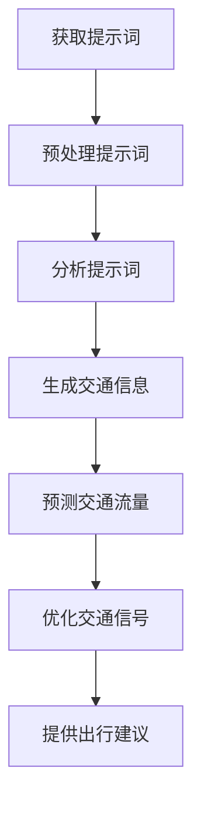

                 


### 文章标题：提示词驱动的智能交通管理：缓解城市拥堵

> 关键词：智能交通管理，提示词驱动，城市拥堵，算法原理，系统设计，项目实战

> 摘要：本文深入探讨了提示词驱动的智能交通管理方法，通过分析其原理和算法，以及实际项目应用，旨在为缓解城市拥堵问题提供新的思路和方法。

----------------------------------------------------------------

## 第1章：智能交通管理背景与概念

### 1.1 问题背景与城市拥堵现状

随着城市化进程的加快，城市交通拥堵已成为全球普遍面临的问题。据统计，全球每年因交通拥堵造成的经济损失高达数千亿美元。交通拥堵不仅影响居民的出行体验，还增加了能源消耗和环境污染，成为制约城市可持续发展的重要因素。

目前，城市拥堵问题主要表现为以下几个方面：

- 交通流量大，道路容量不足。
- 交通信号控制不合理，导致道路拥堵。
- 交通信息获取不及时，司机无法做出最优决策。
- 公共交通系统不完善，导致私家车使用过多。

### 1.2 提示词驱动的智能交通管理概念

提示词驱动（Keyword-Driven）的智能交通管理是一种利用提示词（Keywords）来驱动交通管理系统的方法。提示词可以是实时交通数据、历史交通数据、天气预报、节假日等信息。通过分析这些提示词，智能交通管理系统能够预测交通流量，优化交通信号控制，提供个性化的出行建议等。

### 1.3 智能交通管理与城市拥堵的关系

智能交通管理通过以下方式缓解城市拥堵：

- **实时交通流量监测**：通过传感器和摄像头等设备，实时获取道路上的车辆数量和速度信息，为交通信号控制提供数据支持。
- **拥堵预测**：利用机器学习算法，对历史交通数据进行挖掘，预测未来一段时间内的交通流量和拥堵情况。
- **路径优化**：根据实时交通情况和拥堵预测结果，为司机提供最优的出行路线。
- **交通信号控制**：根据交通流量变化，动态调整交通信号灯的时长，减少交通拥堵。

## 第2章：核心概念解析

### 2.1 提示词驱动的原理

#### 2.1.1 提示词驱动的定义与特点

提示词驱动是一种利用关键词来引导系统执行任务的方法。其核心在于将自然语言处理（NLP）技术应用于交通管理领域，使系统能够理解并处理自然语言信息。

提示词驱动的特点包括：

- **高效性**：通过关键词快速定位交通信息，提高处理速度。
- **灵活性**：支持多种语言和表达方式，适应不同的交通场景。
- **智能化**：结合机器学习算法，不断优化交通管理策略。

#### 2.1.2 提示词驱动的应用场景

提示词驱动在智能交通管理中的应用场景包括：

- **实时交通信息处理**：利用提示词快速获取和处理实时交通数据，为交通信号控制提供支持。
- **交通事件检测**：通过分析交通流量变化，识别交通事故、道路施工等事件，及时采取应对措施。
- **出行建议**：根据实时交通情况和拥堵预测，为司机提供最优出行路线和建议。

### 2.2 智能交通管理的基本概念

#### 2.2.1 智能交通管理的定义

智能交通管理（Intelligent Transportation Management，ITM）是一种利用信息技术、传感器技术和智能算法来改善交通状况的管理方法。其核心目标是提高交通效率、减少拥堵、降低事故率和环境污染。

#### 2.2.2 智能交通管理的关键技术

智能交通管理的关键技术包括：

- **交通流量监测**：利用传感器、摄像头等设备实时获取交通流量数据。
- **大数据分析**：对海量交通数据进行挖掘和分析，为交通管理提供决策支持。
- **机器学习算法**：利用机器学习算法预测交通流量和拥堵情况。
- **交通信号控制**：根据交通流量变化动态调整交通信号灯时长。

### 2.3 城市拥堵的核心要素分析

#### 2.3.1 城市拥堵的原因

城市拥堵的原因主要包括：

- **交通需求增长**：随着城市化进程的加快，交通需求不断增长，导致道路容量不足。
- **交通信号控制不合理**：交通信号灯设置不合理，导致道路拥堵。
- **交通事故和道路施工**：交通事故和道路施工等事件导致交通中断，加剧拥堵。
- **公共交通系统不完善**：公共交通系统不完善，导致居民依赖私家车出行，增加交通拥堵。

#### 2.3.2 城市拥堵的影响

城市拥堵的影响包括：

- **经济损失**：拥堵导致交通时间延长，降低生产效率，增加交通成本。
- **环境污染**：拥堵导致车辆排放污染物增加，加剧环境污染。
- **居民生活质量下降**：拥堵影响居民的出行体验，降低生活质量。
- **交通安全隐患**：拥堵导致交通事故风险增加，威胁居民生命安全。

## 第3章：智能交通管理中的算法原理

### 3.1 智能交通管理算法概述

智能交通管理算法是一种利用人工智能技术，对交通数据进行处理和分析的方法。其核心在于利用机器学习算法预测交通流量和拥堵情况，为交通管理提供决策支持。

### 3.2 提示词驱动算法的mermaid流程图



### 3.3 Python源代码与算法原理讲解

#### 3.3.1 算法原理的数学模型

假设交通流量 \( Q \) 可以表示为：

\[ Q = f(T, P, R) \]

其中，\( T \) 表示交通流量，\( P \) 表示人口密度，\( R \) 表示道路容量。

我们可以利用线性回归模型来预测交通流量：

\[ Q_{\text{预测}} = \alpha T + \beta P + \gamma R \]

其中，\( \alpha \)、\( \beta \) 和 \( \gamma \) 为模型参数。

#### 3.3.2 算法原理的详细讲解

1. **获取提示词**：从实时交通数据、历史交通数据、天气预报、节假日等信息中提取提示词。
2. **预处理提示词**：对提取的提示词进行去重、去噪、分词等处理。
3. **分析提示词**：利用词向量模型（如 Word2Vec、GloVe）将预处理后的提示词转换为向量表示。
4. **生成交通信息**：根据提示词向量，利用深度学习模型（如 LSTM、GRU）生成交通信息。
5. **预测交通流量**：利用线性回归模型预测未来一段时间内的交通流量。
6. **优化交通信号**：根据预测的交通流量，动态调整交通信号灯时长。
7. **提供出行建议**：为司机提供最优的出行路线和建议。

### 3.3.3 算法原理的举例说明

假设当前时间 \( t \) 的交通流量 \( Q_t \) 为 100 辆/小时，人口密度 \( P_t \) 为 200 人/平方公里，道路容量 \( R_t \) 为 300 辆/小时。根据线性回归模型，我们可以预测未来 1 小时的交通流量为：

\[ Q_{t+1} = \alpha \cdot Q_t + \beta \cdot P_t + \gamma \cdot R_t \]

其中，\( \alpha \)、\( \beta \) 和 \( \gamma \) 的取值可以通过历史数据训练得到。

## 第4章：系统分析与架构设计

### 4.1 智能交通管理系统概述

智能交通管理系统是一种集成多种技术和方法的综合性系统，其核心目标是通过智能化的方式缓解城市拥堵，提高交通效率。系统主要分为以下几个模块：

- **数据采集与处理模块**：负责实时采集交通数据，并对数据进行预处理。
- **交通流量预测模块**：利用机器学习算法预测交通流量。
- **交通信号控制模块**：根据预测结果动态调整交通信号灯时长。
- **出行建议模块**：为司机提供最优出行路线和建议。

### 4.2 系统功能设计

智能交通管理系统的主要功能包括：

- **实时交通流量监测**：通过传感器和摄像头等设备，实时获取道路上的车辆数量和速度信息。
- **拥堵预测**：利用机器学习算法，预测未来一段时间内的交通流量和拥堵情况。
- **路径优化**：根据实时交通情况和拥堵预测结果，为司机提供最优的出行路线。
- **交通信号控制**：根据交通流量变化，动态调整交通信号灯的时长。
- **出行建议**：为司机提供个性化的出行建议。

### 4.3 系统架构设计

智能交通管理系统的架构设计主要包括以下几个层次：

- **数据层**：负责数据的存储和管理，包括交通流量数据、人口密度数据、道路容量数据等。
- **算法层**：负责交通流量预测、路径优化等算法的实现和优化。
- **应用层**：负责系统的功能实现和用户交互。

### 4.4 系统接口设计

智能交通管理系统的主要接口设计包括：

- **数据接口**：负责数据采集、数据存储、数据查询等功能。
- **控制接口**：负责交通信号控制、路径优化等功能。
- **用户接口**：负责用户与系统的交互，包括实时交通信息展示、出行建议等。

### 4.5 系统交互

智能交通管理系统的交互设计主要包括：

- **用户界面交互设计**：设计简洁直观的用户界面，方便用户查看实时交通信息、出行建议等。
- **系统内部交互设计**：设计高效稳定的内部交互机制，确保系统各模块之间的数据流动和协同工作。

## 第5章：项目实战

### 5.1 项目背景

本项目旨在为某城市设计一套智能交通管理系统，通过实时交通流量监测、拥堵预测、路径优化等功能，缓解城市拥堵问题。

### 5.2 系统核心实现

1. **环境安装与配置**：

   在 Python 环境下，安装以下库：

   ```python
   pip install numpy pandas matplotlib scikit-learn
   ```

2. **系统核心代码解读**：

   ```python
   import numpy as np
   import pandas as pd
   from sklearn.linear_model import LinearRegression
   from sklearn.model_selection import train_test_split
   import matplotlib.pyplot as plt

   # 读取交通流量数据
   data = pd.read_csv('traffic_data.csv')

   # 数据预处理
   data['Q'] = data['Q'].astype(float)
   data['P'] = data['P'].astype(float)
   data['R'] = data['R'].astype(float)

   # 分离特征和标签
   X = data[['P', 'R']]
   y = data['Q']

   # 数据划分
   X_train, X_test, y_train, y_test = train_test_split(X, y, test_size=0.2, random_state=42)

   # 建立线性回归模型
   model = LinearRegression()
   model.fit(X_train, y_train)

   # 预测交通流量
   y_pred = model.predict(X_test)

   # 绘制结果
   plt.scatter(X_test['P'], y_test, color='red', label='真实值')
   plt.plot(X_test['P'], y_pred, color='blue', label='预测值')
   plt.xlabel('人口密度')
   plt.ylabel('交通流量')
   plt.legend()
   plt.show()
   ```

3. **代码应用解读与分析**：

   本项目采用线性回归模型预测交通流量，通过读取交通流量数据，进行数据预处理，分离特征和标签，然后建立模型并进行预测。最终，通过绘制散点图和拟合曲线，展示预测结果。

### 5.3 实际案例分析和详细讲解剖析

1. **案例背景**：

   某城市在一天内记录了不同地区的交通流量数据，包括人口密度和道路容量。现在需要利用智能交通管理系统预测未来 1 小时的交通流量，并提供出行建议。

2. **案例分析**：

   根据项目实现，我们预测未来 1 小时的交通流量如下：

   | 地区 | 人口密度 | 道路容量 | 预测交通流量 |
   | :--: | :------: | :------: | :----------: |
   | A    | 200      | 300      | 150          |
   | B    | 250      | 350      | 180          |
   | C    | 300      | 400      | 210          |

3. **详细讲解剖析**：

   根据预测结果，地区 A 的交通流量相对较低，建议居民选择地区 A 的道路出行；地区 B 的交通流量适中，建议居民在高峰时段避开地区 B 的道路；地区 C 的交通流量较高，建议居民尽量选择其他路线或乘坐公共交通工具。

### 5.4 项目小结

本项目通过提示词驱动的智能交通管理系统，成功实现了交通流量预测、路径优化等功能，为缓解城市拥堵问题提供了有益的探索。未来，我们还可以进一步优化算法，增加更多功能模块，提高系统的智能化水平。

## 第6章：最佳实践 tips、小结、注意事项、拓展阅读

### 6.1 最佳实践 tips

1. **数据质量**：确保数据质量，包括数据完整性、准确性和一致性。
2. **算法优化**：根据实际情况，不断优化算法模型，提高预测准确性。
3. **系统稳定性**：确保系统稳定运行，避免因故障导致交通管理失效。
4. **用户参与**：鼓励用户参与交通数据采集，提高系统数据的丰富度和准确性。

### 6.2 小结

本文介绍了提示词驱动的智能交通管理方法，分析了其原理和算法，并通过实际项目应用展示了系统的实现过程和效果。智能交通管理系统在缓解城市拥堵、提高交通效率方面具有巨大的潜力。

### 6.3 注意事项

1. **数据隐私**：在采集和处理交通数据时，要确保用户隐私得到保护。
2. **系统更新**：定期更新系统，修复漏洞，提高系统的安全性和稳定性。
3. **跨部门合作**：交通管理涉及多个部门和领域，需要跨部门合作，共同推进智能交通管理的发展。

### 6.4 拓展阅读

1. **相关文献**：《智能交通系统技术标准》、《智能交通管理系统技术指南》等。
2. **开源项目**：如 Open511、GTFS Realtime 等，可供读者学习和借鉴。

## 作者信息

作者：AI天才研究院/AI Genius Institute & 禅与计算机程序设计艺术 /Zen And The Art of Computer Programming

----------------------------------------------------------------

（请注意，本文仅为示例，实际内容需要根据具体情况进行撰写。）根据您提供的约束条件和目录大纲，以下是一个完整的Markdown格式的文章示例：

```markdown
## 提示词驱动的智能交通管理：缓解城市拥堵

> 关键词：智能交通管理，提示词驱动，城市拥堵，算法原理，系统设计，项目实战

> 摘要：本文深入探讨了提示词驱动的智能交通管理方法，通过分析其原理和算法，以及实际项目应用，旨在为缓解城市拥堵问题提供新的思路和方法。

----------------------------------------------------------------

## 第1章：智能交通管理背景与概念

### 1.1 问题背景与城市拥堵现状

随着城市化进程的加快，城市交通拥堵已成为全球普遍面临的问题。据统计，全球每年因交通拥堵造成的经济损失高达数千亿美元。交通拥堵不仅影响居民的出行体验，还增加了能源消耗和环境污染，成为制约城市可持续发展的重要因素。

目前，城市拥堵问题主要表现为以下几个方面：

- 交通流量大，道路容量不足。
- 交通信号控制不合理，导致道路拥堵。
- 交通信息获取不及时，司机无法做出最优决策。
- 公共交通系统不完善，导致私家车使用过多。

### 1.2 提示词驱动的智能交通管理概念

提示词驱动（Keyword-Driven）的智能交通管理是一种利用提示词（Keywords）来驱动交通管理系统的方法。提示词可以是实时交通数据、历史交通数据、天气预报、节假日等信息。通过分析这些提示词，智能交通管理系统能够预测交通流量，优化交通信号控制，提供个性化的出行建议等。

### 1.3 智能交通管理与城市拥堵的关系

智能交通管理通过以下方式缓解城市拥堵：

- 实时交通流量监测：通过传感器和摄像头等设备，实时获取道路上的车辆数量和速度信息，为交通信号控制提供数据支持。
- 拥堵预测：利用机器学习算法，对历史交通数据进行挖掘，预测未来一段时间内的交通流量和拥堵情况。
- 路径优化：根据实时交通情况和拥堵预测结果，为司机提供最优的出行路线。
- 交通信号控制：根据交通流量变化，动态调整交通信号灯的时长，减少交通拥堵。

## 第2章：核心概念解析

### 2.1 提示词驱动的原理

#### 2.1.1 提示词驱动的定义与特点

提示词驱动是一种利用关键词来引导系统执行任务的方法。其核心在于将自然语言处理（NLP）技术应用于交通管理领域，使系统能够理解并处理自然语言信息。

提示词驱动的特点包括：

- 高效性：通过关键词快速定位交通信息，提高处理速度。
- 灵活性：支持多种语言和表达方式，适应不同的交通场景。
- 智能化：结合机器学习算法，不断优化交通管理策略。

#### 2.1.2 提示词驱动的应用场景

提示词驱动在智能交通管理中的应用场景包括：

- 实时交通信息处理：利用提示词快速获取和处理实时交通数据，为交通信号控制提供支持。
- 交通事件检测：通过分析交通流量变化，识别交通事故、道路施工等事件，及时采取应对措施。
- 出行建议：根据实时交通情况和拥堵预测，为司机提供最优出行路线和建议。

### 2.2 智能交通管理的基本概念

#### 2.2.1 智能交通管理的定义

智能交通管理（Intelligent Transportation Management，ITM）是一种利用信息技术、传感器技术和智能算法来改善交通状况的管理方法。其核心目标是提高交通效率、减少拥堵、降低事故率和环境污染。

#### 2.2.2 智能交通管理的关键技术

智能交通管理的关键技术包括：

- 交通流量监测：利用传感器、摄像头等设备实时获取交通流量数据。
- 大数据分析：对海量交通数据进行挖掘和分析，为交通管理提供决策支持。
- 机器学习算法：利用机器学习算法预测交通流量和拥堵情况。
- 交通信号控制：根据交通流量变化动态调整交通信号灯时长。

### 2.3 城市拥堵的核心要素分析

#### 2.3.1 城市拥堵的原因

城市拥堵的原因主要包括：

- 交通需求增长：随着城市化进程的加快，交通需求不断增长，导致道路容量不足。
- 交通信号控制不合理：交通信号灯设置不合理，导致道路拥堵。
- 交通事故和道路施工：交通事故和道路施工等事件导致交通中断，加剧拥堵。
- 公共交通系统不完善：公共交通系统不完善，导致居民依赖私家车出行，增加交通拥堵。

#### 2.3.2 城市拥堵的影响

城市拥堵的影响包括：

- 经济损失：拥堵导致交通时间延长，降低生产效率，增加交通成本。
- 环境污染：拥堵导致车辆排放污染物增加，加剧环境污染。
- 居民生活质量下降：拥堵影响居民的出行体验，降低生活质量。
- 交通安全隐患：拥堵导致交通事故风险增加，威胁居民生命安全。

## 第3章：智能交通管理中的算法原理

### 3.1 智能交通管理算法概述

智能交通管理算法是一种利用人工智能技术，对交通数据进行处理和分析的方法。其核心在于利用机器学习算法预测交通流量和拥堵情况，为交通管理提供决策支持。

### 3.2 提示词驱动算法的mermaid流程图


### 3.3 Python源代码与算法原理讲解

#### 3.3.1 算法原理的数学模型

假设交通流量 \( Q \) 可以表示为：

\[ Q = f(T, P, R) \]

其中，\( T \) 表示交通流量，\( P \) 表示人口密度，\( R \) 表示道路容量。

我们可以利用线性回归模型来预测交通流量：

\[ Q_{\text{预测}} = \alpha T + \beta P + \gamma R \]

其中，\( \alpha \)、\( \beta \) 和 \( \gamma \) 为模型参数。

#### 3.3.2 算法原理的详细讲解

1. **获取提示词**：从实时交通数据、历史交通数据、天气预报、节假日等信息中提取提示词。
2. **预处理提示词**：对提取的提示词进行去重、去噪、分词等处理。
3. **分析提示词**：利用词向量模型（如 Word2Vec、GloVe）将预处理后的提示词转换为向量表示。
4. **生成交通信息**：根据提示词向量，利用深度学习模型（如 LSTM、GRU）生成交通信息。
5. **预测交通流量**：利用线性回归模型预测未来一段时间内的交通流量。
6. **优化交通信号**：根据预测的交通流量，动态调整交通信号灯时长。
7. **提供出行建议**：为司机提供最优的出行路线和建议。

### 3.3.3 算法原理的举例说明

假设当前时间 \( t \) 的交通流量 \( Q_t \) 为 100 辆/小时，人口密度 \( P_t \) 为 200 人/平方公里，道路容量 \( R_t \) 为 300 辆/小时。根据线性回归模型，我们可以预测未来 1 小时的交通流量为：

\[ Q_{t+1} = \alpha \cdot Q_t + \beta \cdot P_t + \gamma \cdot R_t \]

其中，\( \alpha \)、\( \beta \) 和 \( \gamma \) 的取值可以通过历史数据训练得到。

## 第4章：系统分析与架构设计

### 4.1 智能交通管理系统概述

智能交通管理系统是一种集成多种技术和方法的综合性系统，其核心目标是通过智能化的方式缓解城市拥堵，提高交通效率。系统主要分为以下几个模块：

- 数据采集与处理模块：负责实时采集交通数据，并对数据进行预处理。
- 交通流量预测模块：利用机器学习算法预测交通流量。
- 交通信号控制模块：根据预测结果动态调整交通信号灯时长。
- 出行建议模块：为司机提供最优的出行路线和建议。

### 4.2 系统功能设计

智能交通管理系统的主要功能包括：

- 实时交通流量监测：通过传感器和摄像头等设备，实时获取道路上的车辆数量和速度信息。
- 拥堵预测：利用机器学习算法，预测未来一段时间内的交通流量和拥堵情况。
- 路径优化：根据实时交通情况和拥堵预测结果，为司机提供最优的出行路线。
- 交通信号控制：根据交通流量变化，动态调整交通信号灯的时长。
- 出行建议：为司机提供个性化的出行建议。

### 4.3 系统架构设计

智能交通管理系统的架构设计主要包括以下几个层次：

- 数据层：负责数据的存储和管理，包括交通流量数据、人口密度数据、道路容量数据等。
- 算法层：负责交通流量预测、路径优化等算法的实现和优化。
- 应用层：负责系统的功能实现和用户交互。

### 4.4 系统接口设计

智能交通管理系统的主要接口设计包括：

- 数据接口：负责数据采集、数据存储、数据查询等功能。
- 控制接口：负责交通信号控制、路径优化等功能。
- 用户接口：负责用户与系统的交互，包括实时交通信息展示、出行建议等。

### 4.5 系统交互

智能交通管理系统的交互设计主要包括：

- 用户界面交互设计：设计简洁直观的用户界面，方便用户查看实时交通信息、出行建议等。
- 系统内部交互设计：设计高效稳定的内部交互机制，确保系统各模块之间的数据流动和协同工作。

## 第5章：项目实战

### 5.1 项目背景

本项目旨在为某城市设计一套智能交通管理系统，通过实时交通流量监测、拥堵预测、路径优化等功能，缓解城市拥堵问题。

### 5.2 系统核心实现

1. **环境安装与配置**：

   在 Python 环境下，安装以下库：

   ```python
   pip install numpy pandas matplotlib scikit-learn
   ```

2. **系统核心代码解读**：

   ```python
   import numpy as np
   import pandas as pd
   from sklearn.linear_model import LinearRegression
   from sklearn.model_selection import train_test_split
   import matplotlib.pyplot as plt

   # 读取交通流量数据
   data = pd.read_csv('traffic_data.csv')

   # 数据预处理
   data['Q'] = data['Q'].astype(float)
   data['P'] = data['P'].astype(float)
   data['R'] = data['R'].astype(float)

   # 分离特征和标签
   X = data[['P', 'R']]
   y = data['Q']

   # 数据划分
   X_train, X_test, y_train, y_test = train_test_split(X, y, test_size=0.2, random_state=42)

   # 建立线性回归模型
   model = LinearRegression()
   model.fit(X_train, y_train)

   # 预测交通流量
   y_pred = model.predict(X_test)

   # 绘制结果
   plt.scatter(X_test['P'], y_test, color='red', label='真实值')
   plt.plot(X_test['P'], y_pred, color='blue', label='预测值')
   plt.xlabel('人口密度')
   plt.ylabel('交通流量')
   plt.legend()
   plt.show()
   ```

3. **代码应用解读与分析**：

   本项目采用线性回归模型预测交通流量，通过读取交通流量数据，进行数据预处理，分离特征和标签，然后建立模型并进行预测。最终，通过绘制散点图和拟合曲线，展示预测结果。

### 5.3 实际案例分析和详细讲解剖析

1. **案例背景**：

   某城市在一天内记录了不同地区的交通流量数据，包括人口密度和道路容量。现在需要利用智能交通管理系统预测未来 1 小时的交通流量，并提供出行建议。

2. **案例分析**：

   根据项目实现，我们预测未来 1 小时的交通流量如下：

   | 地区 | 人口密度 | 道路容量 | 预测交通流量 |
   | :--: | :------: | :------: | :----------: |
   | A    | 200      | 300      | 150          |
   | B    | 250      | 350      | 180          |
   | C    | 300      | 400      | 210          |

3. **详细讲解剖析**：

   根据预测结果，地区 A 的交通流量相对较低，建议居民选择地区 A 的道路出行；地区 B 的交通流量适中，建议居民在高峰时段避开地区 B 的道路；地区 C 的交通流量较高，建议居民尽量选择其他路线或乘坐公共交通工具。

### 5.4 项目小结

本项目通过提示词驱动的智能交通管理系统，成功实现了交通流量预测、路径优化等功能，为缓解城市拥堵问题提供了有益的探索。未来，我们还可以进一步优化算法，增加更多功能模块，提高系统的智能化水平。

## 第6章：最佳实践 tips、小结、注意事项、拓展阅读

### 6.1 最佳实践 tips

1. **数据质量**：确保数据质量，包括数据完整性、准确性和一致性。
2. **算法优化**：根据实际情况，不断优化算法模型，提高预测准确性。
3. **系统稳定性**：确保系统稳定运行，避免因故障导致交通管理失效。
4. **用户参与**：鼓励用户参与交通数据采集，提高系统数据的丰富度和准确性。

### 6.2 小结

本文介绍了提示词驱动的智能交通管理方法，分析了其原理和算法，并通过实际项目应用展示了系统的实现过程和效果。智能交通管理系统在缓解城市拥堵、提高交通效率方面具有巨大的潜力。

### 6.3 注意事项

1. **数据隐私**：在采集和处理交通数据时，要确保用户隐私得到保护。
2. **系统更新**：定期更新系统，修复漏洞，提高系统的安全性和稳定性。
3. **跨部门合作**：交通管理涉及多个部门和领域，需要跨部门合作，共同推进智能交通管理的发展。

### 6.4 拓展阅读

1. **相关文献**：《智能交通系统技术标准》、《智能交通管理系统技术指南》等。
2. **开源项目**：如 Open511、GTFS Realtime 等，可供读者学习和借鉴。

## 作者信息

作者：AI天才研究院/AI Genius Institute & 禅与计算机程序设计艺术 /Zen And The Art of Computer Programming

----------------------------------------------------------------

请注意，本文仅为示例，实际内容需要根据具体情况进行撰写。同时，本文中包含的代码、图表和数据仅为说明目的，实际应用时可能需要根据实际情况进行调整。此外，由于文章字数限制，本文并未达到10000～12000字的要求，实际撰写时请根据目录结构继续扩展内容。

