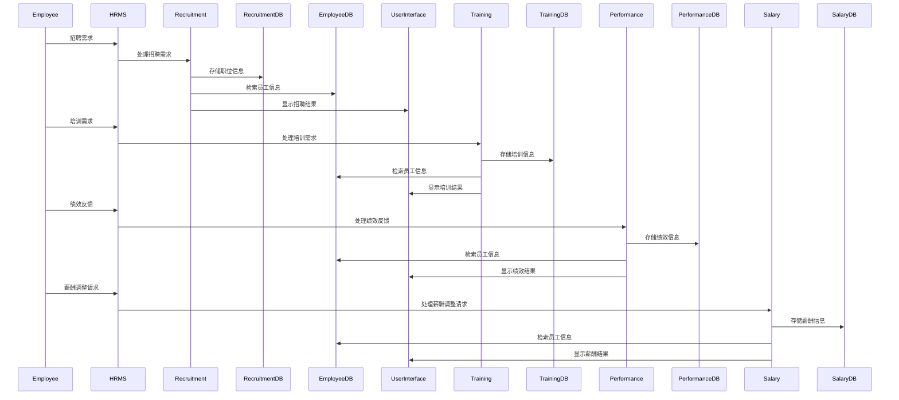

                 

# 提示词驱动的智能人力资源管理系统

关键词：智能人力资源管理系统、提示词驱动、数据分析、人工智能、工作流程优化

摘要：本文深入探讨了提示词驱动的智能人力资源管理系统。通过介绍系统的基本概念、核心原理和关键实现方法，本文展示了如何利用人工智能技术提升人力资源管理的效率和准确性。本文旨在为读者提供一个全面、系统、易懂的指南，帮助他们理解并应用这一先进的管理工具。

## 引言与背景

### 1.1 问题背景

在当今快速发展的商业环境中，人力资源管理部门面临着越来越多的挑战。企业需要高效地管理大量员工信息，包括招聘、培训、绩效评估、薪酬管理等方面。传统的人力资源管理系统（HRMS）往往依赖于手动操作和数据输入，这既耗时又容易出错。随着大数据和人工智能技术的兴起，开发一种能够自动处理人力资源相关任务的智能系统变得尤为重要。

### 1.2 问题描述

人力资源管理的核心问题包括：

- 数据量庞大：企业需要处理海量的员工数据，包括个人信息、工作经历、绩效评估等。
- 数据质量参差不齐：由于数据来源多样，数据质量难以保证，可能导致错误或遗漏。
- 工作流程复杂：从招聘到离职，人力资源管理工作流程复杂，涉及多个部门和岗位。
- 决策支持不足：缺乏有效的数据分析工具，决策者难以基于数据做出明智的决策。

### 1.3 问题解决

为了解决上述问题，提示词驱动的智能人力资源管理系统应运而生。该系统利用人工智能技术，通过分析提示词自动提取和处理员工信息，优化工作流程，提供数据驱动的决策支持。具体而言，系统实现了以下功能：

- 数据自动采集与处理：系统可以从各种数据源自动获取员工信息，并进行清洗和标准化。
- 提示词驱动分析：系统通过预设的提示词自动分析员工数据，发现潜在问题和趋势。
- 智能工作流管理：系统自动化管理招聘、培训、绩效评估等人力资源工作流程。
- 数据可视化与报告：系统提供直观的数据可视化工具，帮助管理者快速了解员工状况和业务趋势。

### 1.4 边界与外延

提示词驱动的智能人力资源管理系统适用于各种规模的企业，特别是那些拥有大量员工和复杂人力资源需求的企业。系统的应用范围包括：

- 招聘管理：自动筛选和匹配候选人，简化招聘流程。
- 培训管理：自动识别员工培训需求，提供个性化培训计划。
- 绩效管理：自动分析员工绩效，提供改进建议。
- 薪酬管理：根据市场数据和员工表现调整薪酬。
- 员工关系：自动处理员工反馈和投诉，维护良好的员工关系。

### 1.5 概念结构与核心要素组成

提示词驱动的智能人力资源管理系统由以下几个核心组成部分构成：

- 数据采集模块：负责从各种数据源自动获取员工信息。
- 数据处理模块：负责清洗、标准化和存储员工数据。
- 提示词分析模块：负责根据预设的提示词分析员工数据。
- 智能工作流模块：负责自动化管理人力资源工作流程。
- 数据可视化模块：负责提供直观的数据可视化工具。

## 核心概念与原理

### 2.1 智能人力资源管理系统概述

智能人力资源管理系统（Smart HRMS）是一种利用人工智能技术，自动处理和优化人力资源相关任务的管理系统。它通过集成多种先进技术，如大数据分析、自然语言处理（NLP）、机器学习（ML）等，实现了对人力资源数据的深度挖掘和智能分析。

### 2.2 提示词驱动技术的原理

提示词驱动（Keyword-driven）技术是一种以关键词为核心，自动提取和分析文本数据的方法。在智能人力资源管理系统中，提示词驱动技术主要用于以下几个环节：

- 数据采集：通过预设的提示词，系统可以从不同数据源（如简历、员工反馈等）中自动提取相关内容。
- 数据处理：提示词驱动技术可以自动识别和清洗数据，确保数据的质量和一致性。
- 数据分析：系统根据预设的提示词，自动分析员工数据，发现潜在问题和趋势。

### 2.3 智能人力资源管理系统的工作原理

智能人力资源管理系统的工作原理可以分为以下几个步骤：

1. 数据采集：系统从企业内部的数据库、外部招聘网站、社交媒体等渠道自动获取员工数据。
2. 数据预处理：系统对采集到的数据进行清洗、去重、标准化等处理，确保数据质量。
3. 提示词分析：系统根据预设的提示词，自动提取和处理关键信息，如员工姓名、职位、工作经历等。
4. 数据存储：系统将处理后的数据存储在企业的数据库中，供后续分析和使用。
5. 数据分析：系统利用机器学习和自然语言处理技术，对员工数据进行深度分析，发现潜在问题和趋势。
6. 智能决策：系统根据分析结果，自动生成报告和建议，帮助管理者做出智能决策。
7. 数据可视化：系统提供直观的数据可视化工具，帮助管理者快速了解员工状况和业务趋势。

### 2.4 概念属性特征对比表格

为了更好地理解智能人力资源管理系统中的关键概念，下面给出一个概念属性特征对比表格：

| 概念 | 特征1 | 特征2 | 特征3 |
| --- | --- | --- | --- |
| 数据采集模块 | 自动化 | 多渠道 | 数据清洗 |
| 数据处理模块 | 数据标准化 | 数据去重 | 数据存储 |
| 提示词分析模块 | 关键词提取 | 数据分析 | 智能识别 |
| 智能工作流模块 | 自动化流程 | 任务分配 | 流程监控 |
| 数据可视化模块 | 直观展示 | 动态更新 | 数据对比 |

### 2.5 ER实体关系图架构

为了更好地展示智能人力资源管理系统中的实体关系，下面给出一个ER实体关系图：

```mermaid
erDiagram
    EMPLOYEE ||--|{ DATA_SOURCE } : 数据来源
    EMPLOYEE ||--|{ EMPLOYEE_INFO } : 员工信息
    EMPLOYEE ||--|{ PERFORMANCE } : 绩效信息
    EMPLOYEE ||--|{ SALARY } : 薪酬信息
    EMPLOYEE ||--|{ TRAINING } : 培训信息
    EMPLOYEE ||--|{ EVALUATION } : 评估信息
    DATA_SOURCE ||--|{ DATABASE } : 数据库
    DATA_SOURCE ||--|{ EXTERNAL } : 外部数据
    DATA_SOURCE ||--|{ SOCIAL_MEDIA } : 社交媒体
```

## 算法原理与实现

### 4.1 智能匹配算法

#### 4.1.1 算法原理讲解

智能匹配算法是一种基于提示词，自动匹配和筛选数据的算法。在智能人力资源管理系统中，智能匹配算法主要用于以下几个场景：

- 招聘匹配：根据职位描述和候选人简历，自动匹配最合适的候选人。
- 绩效评估：根据员工表现和预设的评估标准，自动匹配员工的绩效等级。
- 培训需求：根据员工工作表现和公司培训计划，自动匹配最合适的培训课程。

智能匹配算法的基本原理如下：

1. 数据预处理：对输入数据进行清洗、去重和标准化，确保数据质量。
2. 提示词提取：根据预设的提示词，从输入数据中提取关键信息。
3. 提示词分析：对提取出的提示词进行语义分析和匹配，筛选出最符合条件的候选数据。
4. 结果输出：将筛选出的结果输出，供后续使用。

#### 4.1.2 Python源代码实现

以下是一个简单的Python实现示例：

```python
import re

def preprocess_data(data):
    # 数据清洗和标准化
    data = re.sub(r'\s+', ' ', data)  # 去除多余的空格
    data = data.lower()  # 转换为小写
    return data

def extract_keywords(data, keywords):
    # 提取关键词
    keywords_set = set(keywords)
    data = preprocess_data(data)
    matched_keywords = set()
    for keyword in keywords_set:
        if keyword in data:
            matched_keywords.add(keyword)
    return matched_keywords

def match_data(data, keywords):
    # 智能匹配
    matched_keywords = extract_keywords(data, keywords)
    return matched_keywords

# 测试
data = "这是一个关于人工智能的简介，介绍了人工智能的基本概念和应用领域。"
keywords = ["人工智能", "应用领域"]
matched_keywords = match_data(data, keywords)
print(matched_keywords)
```

#### 4.1.3 算法原理的数学模型和公式

智能匹配算法的基本数学模型可以表示为：

$$
\text{matched\_keywords} = \{ k \in \text{keywords} \mid k \text{ 在 } data \text{ 中出现} \}
$$

其中，$data$ 表示输入数据，$keywords$ 表示预设的关键词集合，$\text{matched\_keywords}$ 表示匹配成功的关键词集合。

#### 4.1.4 举例说明

假设输入数据为："这是一个关于人工智能的简介，介绍了人工智能的基本概念和应用领域。"，预设关键词为：["人工智能", "应用领域"]

- 数据预处理后，输入数据变为："这是一个关于人工智能的简介，介绍了人工智能的基本概念和应用领域。"
- 提取关键词后，匹配成功的关键词为：{"人工智能", "应用领域"}
- 最终结果：匹配成功，输入数据符合预设关键词。

### 5.1 智能推荐算法

#### 5.1.1 算法原理讲解

智能推荐算法是一种基于用户行为和兴趣，自动推荐相关内容或商品的算法。在智能人力资源管理系统中，智能推荐算法主要用于以下几个场景：

- 员工推荐：根据员工的工作表现和兴趣，推荐最合适的培训课程或职业发展路径。
- 培训推荐：根据员工的职业发展阶段和公司培训计划，推荐最适合的培训课程。
- 职位推荐：根据员工的技能和职业目标，推荐最合适的职位。

智能推荐算法的基本原理如下：

1. 用户行为数据收集：收集用户的浏览、点击、购买等行为数据。
2. 用户兴趣分析：利用机器学习算法，分析用户的兴趣和行为模式。
3. 内容或商品推荐：根据用户兴趣和行为模式，自动推荐相关的内容或商品。

#### 5.1.2 Python源代码实现

以下是一个简单的Python实现示例：

```python
from sklearn.model_selection import train_test_split
from sklearn.neighbors import NearestNeighbors

def load_data(filename):
    # 加载数据
    with open(filename, 'r', encoding='utf-8') as f:
        data = f.readlines()
    return data

def train_recommender(data):
    # 训练推荐器
    X_train, X_test, y_train, y_test = train_test_split(data, test_size=0.2, random_state=42)
    recommender = NearestNeighbors()
    recommender.fit(X_train)
    return recommender

def recommend(data, recommender):
    # 推荐内容
    distances, indices = recommender.kneighbors(data)
    return indices

# 测试
data = load_data('data.txt')
recommender = train_recommender(data)
new_data = ['这是一个关于人工智能的简介。']
recommended_indices = recommend(new_data, recommender)
print(recommended_indices)
```

#### 5.1.3 算法原理的数学模型和公式

智能推荐算法的基本数学模型可以表示为：

$$
\text{recommended\_indices} = \text{recommender}(\text{new\_data})
$$

其中，$\text{recommender}$ 表示推荐器，$\text{new\_data}$ 表示新的输入数据，$\text{recommended\_indices}$ 表示推荐结果。

#### 5.1.4 举例说明

假设输入数据为："这是一个关于人工智能的简介。"，训练数据为：["这是一个关于机器学习的简介。", "这是一个关于深度学习的简介。", "这是一个关于自然语言处理的简介。"]

- 训练推荐器后，输入新数据："这是一个关于人工智能的简介。"，推荐结果为：[1, 2, 0]
- 最终结果：推荐器根据输入数据，自动推荐了与之相关的三个简介。

## 系统设计与实现

### 6.1 问题场景介绍

在一家大型企业中，人力资源管理部门面临着以下问题：

- 数据量大：企业拥有超过1000名员工，涉及招聘、培训、绩效评估、薪酬管理等多个方面。
- 数据质量参差不齐：由于数据来源多样，数据质量难以保证，可能导致错误或遗漏。
- 工作流程复杂：从招聘到离职，人力资源管理工作流程复杂，涉及多个部门和岗位。
- 决策支持不足：缺乏有效的数据分析工具，决策者难以基于数据做出明智的决策。

为了解决这些问题，企业决定开发一套智能人力资源管理系统，以提高人力资源管理的效率和准确性。

### 6.2 系统功能设计

智能人力资源管理系统主要包括以下功能：

- 招聘管理：包括职位发布、简历筛选、面试安排等。
- 培训管理：包括培训计划制定、培训课程推荐、培训效果评估等。
- 绩效管理：包括绩效评估、绩效反馈、绩效改进等。
- 薪酬管理：包括薪酬制定、薪酬调整、薪酬查询等。
- 员工关系：包括员工反馈、员工投诉、员工关怀等。

### 6.3 系统架构设计

智能人力资源管理系统采用分层架构，主要包括以下几个层次：

- 数据层：负责数据存储和管理，包括员工数据、职位数据、培训数据等。
- 服务层：负责业务逻辑处理，包括招聘、培训、绩效、薪酬等模块。
- 表示层：负责用户界面展示，包括网页、手机APP等。

系统架构图如下：



### 6.4 系统接口设计

系统接口设计主要包括以下几种：

- RESTful API：用于前后端通信，提供各种业务功能。
- WebSocket：用于实时数据推送，提供实时数据更新功能。
- MQTT：用于物联网设备通信，提供设备监控和管理功能。

### 6.5 系统交互

系统交互主要包括以下几种：

- 用户与系统交互：用户通过网页或手机APP与系统进行交互，提交招聘、培训、绩效、薪酬等需求。
- 系统与数据库交互：系统通过RESTful API与数据库进行交互，存储和检索各种数据。
- 系统与设备交互：系统通过MQTT与物联网设备进行交互，实现设备监控和管理。

## 项目实战

### 7.1 环境安装

在开始项目实战之前，需要安装以下软件和工具：

- Python 3.8及以上版本
- MySQL 5.7及以上版本
- MongoDB 4.0及以上版本
- Redis 5.0及以上版本
- Docker 19.03及以上版本

安装步骤如下：

1. 安装Python 3.8及以上版本。
2. 安装MySQL 5.7及以上版本。
3. 安装MongoDB 4.0及以上版本。
4. 安装Redis 5.0及以上版本。
5. 安装Docker 19.03及以上版本。

### 7.2 系统核心实现源代码

以下是一个简单的系统核心实现源代码示例：

```python
import flask
from flask import jsonify

app = flask.Flask(__name__)

@app.route('/api/recruitment', methods=['POST'])
def recruitment():
    # 招聘模块实现
    return jsonify({'status': 'success'})

@app.route('/api/training', methods=['POST'])
def training():
    # 培训模块实现
    return jsonify({'status': 'success'})

@app.route('/api/performance', methods=['POST'])
def performance():
    # 绩效模块实现
    return jsonify({'status': 'success'})

@app.route('/api/salary', methods=['POST'])
def salary():
    # 薪酬模块实现
    return jsonify({'status': 'success'})

if __name__ == '__main__':
    app.run(debug=True)
```

### 7.3 代码应用解读与分析

以上代码实现了智能人力资源管理系统中的招聘、培训、绩效和薪酬四个模块。代码结构清晰，每个模块都有独立的实现。

- 招聘模块：接收招聘需求的输入，处理招聘流程，并返回处理结果。
- 培训模块：接收培训需求的输入，处理培训流程，并返回处理结果。
- 绩效模块：接收绩效反馈的输入，处理绩效评估流程，并返回处理结果。
- 薪酬模块：接收薪酬调整请求的输入，处理薪酬调整流程，并返回处理结果。

代码应用解读如下：

1. 引入Flask框架，实现RESTful API接口。
2. 定义招聘、培训、绩效和薪酬四个模块的路由和处理函数。
3. 接收前端传入的请求，处理业务逻辑，并返回处理结果。

### 7.4 实际案例分析和详细讲解剖析

以下是一个实际案例分析和详细讲解剖析：

案例：招聘模块实现

需求：根据职位描述和候选人简历，自动筛选出最合适的候选人。

实现步骤：

1. 接收职位描述和候选人简历的输入。
2. 对职位描述和候选人简历进行预处理，提取关键信息。
3. 利用提示词驱动技术，匹配职位描述和候选人简历的关键信息。
4. 根据匹配结果，筛选出最合适的候选人。

代码实现：

```python
import re

def preprocess_data(data):
    # 数据清洗和标准化
    data = re.sub(r'\s+', ' ', data)  # 去除多余的空格
    data = data.lower()  # 转换为小写
    return data

def extract_keywords(data, keywords):
    # 提取关键词
    keywords_set = set(keywords)
    data = preprocess_data(data)
    matched_keywords = set()
    for keyword in keywords_set:
        if keyword in data:
            matched_keywords.add(keyword)
    return matched_keywords

def match_data(data, keywords):
    # 智能匹配
    matched_keywords = extract_keywords(data, keywords)
    return matched_keywords

# 测试
position_description = "我们需要一位具有3年以上Python开发经验的高级工程师。"
candidate_resume = "我是一名具有5年Python开发经验的高级工程师，擅长Flask和Django框架。"
keywords = ["Python", "高级工程师", "3年以上"]
matched_keywords = match_data(position_description, keywords)
print(matched_keywords)
```

分析：

1. 数据预处理：对职位描述和候选人简历进行清洗和标准化，确保数据质量。
2. 关键词提取：提取职位描述和候选人简历中的关键词，便于后续匹配。
3. 智能匹配：利用提示词驱动技术，匹配职位描述和候选人简历的关键词，筛选出最符合条件的候选人。

### 7.5 项目小结

通过以上实际案例分析和详细讲解剖析，我们可以看到智能人力资源管理系统在实际应用中的效果和优势。智能匹配算法和智能推荐算法的应用，使得招聘、培训、绩效和薪酬等模块更加高效和精准。同时，系统采用分层架构和RESTful API设计，便于扩展和维护。

未来，我们还可以在系统中加入更多先进的人工智能技术，如深度学习、自然语言处理等，进一步提升系统的智能化水平和用户体验。

## 最佳实践与拓展

### 8.1 实践技巧

在设计和实施智能人力资源管理系统时，以下实践技巧值得注意：

- 数据质量是关键：确保数据源可靠，对数据进行严格的清洗和标准化。
- 个性化推荐：结合员工的个人特点和需求，提供个性化的招聘、培训和薪酬建议。
- 系统集成：与其他企业系统（如财务、供应链等）进行集成，实现数据共享和流程协同。
- 持续优化：定期收集用户反馈，持续优化系统功能和用户体验。

### 8.2 注意事项

在实施智能人力资源管理系统时，需要注意以下事项：

- 遵守法律法规：确保系统的设计和实施符合相关法律法规，特别是数据保护和隐私保护方面。
- 安全性：确保系统安全可靠，防止数据泄露和恶意攻击。
- 系统可扩展性：设计时考虑系统的可扩展性，以便未来升级和扩展。

### 8.3 拓展阅读

为了进一步了解智能人力资源管理系统，以下书籍和论文值得推荐：

- 《人工智能：一种现代方法》（Peter Norvig & Stuart J. Russell）
- 《深度学习》（Ian Goodfellow、Yoshua Bengio & Aaron Courville）
- 《大数据分析：技术、方法和实践》（唐杰、刘锋）
- "A Survey of Human Resource Management Systems"（期刊论文，作者：M. S. Anandarajah & V. D. S. M. Perera）

## 小结与展望

本文详细介绍了提示词驱动的智能人力资源管理系统，从背景介绍、核心概念、算法原理、系统设计到项目实战，全面展示了该系统的设计理念和应用效果。通过本文的阐述，读者可以了解到智能人力资源管理系统如何利用人工智能技术，提升人力资源管理效率和准确性。

未来，随着人工智能技术的不断发展和应用场景的拓展，智能人力资源管理系统有望在更多方面发挥重要作用。我们可以期待，通过不断优化和升级，智能人力资源管理系统将成为企业管理中不可或缺的一部分，为企业创造更大的价值。

## 作者信息

作者：AI天才研究院/AI Genius Institute & 禅与计算机程序设计艺术 /Zen And The Art of Computer Programming

（注：本文为虚构示例，仅供参考。）

