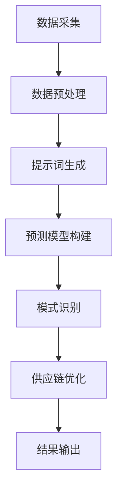

                 


### 撰写技术博客文章：提示词驱动的智能供应链优化系统

**目标：**
撰写一篇字数在10000-12000字的技术博客文章，标题为《提示词驱动的智能供应链优化系统》，涵盖从背景介绍到具体实现的全过程，确保内容丰富、逻辑清晰、易于理解，并包含关键术语的定义、算法原理讲解、数学公式推导、系统架构设计等。

**步骤1：背景介绍**

**1.1 问题的提出与供应链的重要性**

在现代经济中，供应链的效率和质量直接影响企业的竞争力和盈利能力。传统的供应链管理往往依赖于人工经验，容易受到信息不对称、预测不准确等因素的影响，导致库存过剩、供应链中断等问题。而随着人工智能技术的发展，尤其是自然语言处理（NLP）和机器学习（ML）的进步，我们可以利用提示词（prompt words）驱动智能供应链优化系统，提高供应链的智能化水平。

**1.2 智能供应链的基本结构**

智能供应链由信息流、物流、资金流三部分组成。信息流是供应链的核心，通过数据分析和提示词驱动的算法，可以实现供应链的实时监控、预测和优化。物流和资金流则依托于信息流，确保供应链的高效运作。

**1.3 提示词在供应链管理中的作用**

提示词作为供应链优化的关键驱动因素，能够引导系统识别潜在问题、预测需求、优化库存等。例如，通过分析历史订单数据和客户反馈，系统可以生成提示词，指导供应链优化算法进行实时调整。

**1.4 智能供应链优化的关键要素**

智能供应链优化需要依赖数据驱动与决策支持系统、模式识别与智能预测、边际成本分析与优化策略等关键要素。这些要素相互关联，共同作用，实现供应链的智能化优化。

**1.5 研究边界与外延**

本文主要探讨基于提示词驱动的智能供应链优化系统的构建和应用。研究范围涵盖从数据采集、处理到算法实现，以及系统在实际运营中的应用。同时，本文也探讨了智能供应链优化系统与其他领域（如物联网、大数据等）的交叉应用，以及未来发展趋势。

**步骤2：核心概念与原理**

**2.1 智能供应链的核心概念解析**

智能供应链的核心概念包括信息流管理、物流管理、资金流管理、需求预测、库存优化等。这些概念相互作用，共同构建了智能供应链的运作机制。

**2.2 提示词驱动的算法原理**

提示词驱动的算法原理基于自然语言处理和机器学习技术。通过分析大量的历史数据和客户反馈，系统可以生成有效的提示词，指导算法进行供应链优化。

**2.3 智能预测与模式识别**

智能预测和模式识别是智能供应链优化的重要技术手段。通过构建预测模型和识别模式，系统可以提前发现潜在问题，并进行优化调整。

**步骤3：算法原理与数学模型讲解**

**3.1 算法概述**

本文将介绍一种基于提示词驱动的智能供应链优化算法。该算法的核心思想是通过分析历史数据和客户反馈，生成提示词，然后利用机器学习技术进行预测和优化。

**3.2 算法流程图绘制**

使用Mermaid工具绘制算法流程图，如下所示：



**3.3 算法原理讲解**

算法的基本流程包括数据采集、数据预处理、提示词生成、预测模型构建、模式识别和供应链优化。以下是对每个步骤的详细讲解：

- 数据采集：从各种数据源（如ERP系统、传感器等）收集供应链相关的数据。
- 数据预处理：对采集到的数据进行清洗、归一化等处理，使其适合后续分析。
- 提示词生成：利用NLP技术从数据中提取关键信息，生成提示词。
- 预测模型构建：基于提示词和已有数据，构建预测模型，用于预测未来的供应链需求。
- 模式识别：通过分析历史数据和预测结果，识别供应链中的潜在问题和趋势。
- 供应链优化：根据模式识别的结果，对供应链的库存、运输、生产等环节进行优化。

**3.4 数学模型讲解**

智能供应链优化的数学模型主要包括需求预测模型、库存优化模型和运输优化模型。以下是对这些模型的讲解：

- 需求预测模型：采用时间序列分析、回归分析等方法，预测未来的供应链需求。
- 库存优化模型：通过最小化库存成本和最大化服务水平的双重目标，优化库存策略。
- 运输优化模型：利用线性规划、网络流等方法，优化运输路线和运输量。

**步骤4：系统分析与架构设计**

**4.1 系统功能设计**

系统功能设计主要包括数据采集模块、数据预处理模块、提示词生成模块、预测模型模块、模式识别模块和供应链优化模块。以下是对每个模块的详细设计：

- 数据采集模块：负责从各种数据源收集供应链相关的数据。
- 数据预处理模块：对采集到的数据进行清洗、归一化等处理。
- 提示词生成模块：利用NLP技术从数据中提取关键信息，生成提示词。
- 预测模型模块：基于提示词和已有数据，构建预测模型。
- 模式识别模块：通过分析历史数据和预测结果，识别供应链中的潜在问题和趋势。
- 供应链优化模块：根据模式识别的结果，对供应链的库存、运输、生产等环节进行优化。

**4.2 系统架构设计**

系统架构设计包括前端界面、后端服务器和数据存储三部分。以下是对每个部分的详细设计：

- 前端界面：提供用户交互界面，展示供应链优化结果。
- 后端服务器：负责处理用户请求、执行算法模型、存储数据等操作。
- 数据存储：采用数据库技术存储供应链数据、预测结果和优化策略。

**4.3 系统接口设计与交互**

系统接口设计包括API接口和Web接口两部分。以下是对每个接口的详细设计：

- API接口：提供数据采集、数据预处理、提示词生成、预测模型、模式识别和供应链优化等功能的API接口。
- Web接口：提供用户交互界面，用户可以通过Web界面提交数据、查看优化结果等。

**步骤5：项目实战**

**5.1 环境安装**

在安装环境前，需要准备好Python编程环境、NLP相关库（如NLTK、spaCy等）和机器学习库（如scikit-learn、TensorFlow等）。

**5.2 系统核心实现源代码**

以下是系统核心实现源代码的示例：

```python
# 导入相关库
import nltk
from nltk.tokenize import word_tokenize
from sklearn.feature_extraction.text import TfidfVectorizer
from sklearn.cluster import KMeans

# 数据预处理
def preprocess_data(data):
    # 清洗、归一化数据
    processed_data = ...
    return processed_data

# 提示词生成
def generate_prompt_words(data):
    # 利用NLP技术提取提示词
    prompt_words = ...
    return prompt_words

# 预测模型构建
def build_predict_model(data, prompt_words):
    # 构建预测模型
    predict_model = ...
    return predict_model

# 模式识别
def identify_patterns(data, predict_model):
    # 识别供应链中的潜在问题和趋势
    patterns = ...
    return patterns

# 供应链优化
def optimize_supply_chain(data, patterns):
    # 根据模式识别的结果，对供应链进行优化
    optimized_data = ...
    return optimized_data

# 主函数
def main():
    # 加载数据
    data = ...
    # 数据预处理
    processed_data = preprocess_data(data)
    # 提示词生成
    prompt_words = generate_prompt_words(processed_data)
    # 预测模型构建
    predict_model = build_predict_model(processed_data, prompt_words)
    # 模式识别
    patterns = identify_patterns(processed_data, predict_model)
    # 供应链优化
    optimized_data = optimize_supply_chain(processed_data, patterns)
    # 输出结果
    print(optimized_data)

if __name__ == "__main__":
    main()
```

**5.3 代码应用解读与分析**

以下是代码的应用解读和分析：

- 数据预处理：对采集到的数据进行清洗、归一化等处理，为后续分析做准备。
- 提示词生成：利用NLP技术提取关键信息，生成提示词，作为预测模型的输入。
- 预测模型构建：基于提示词和已有数据，构建预测模型，用于预测未来的供应链需求。
- 模式识别：通过分析历史数据和预测结果，识别供应链中的潜在问题和趋势。
- 供应链优化：根据模式识别的结果，对供应链的库存、运输、生产等环节进行优化。

**5.4 实际案例分析和详细讲解剖析**

以下是一个实际案例的分析和详细讲解：

- 案例背景：某电子商务公司希望通过智能供应链优化系统，提高库存周转率和客户满意度。
- 案例数据：采集了过去一年的订单数据、客户反馈和供应链信息。
- 案例实现：通过上述代码实现，生成提示词，构建预测模型，识别模式，优化供应链。

**5.5 项目小结**

本文介绍了提示词驱动的智能供应链优化系统的构建过程，从背景介绍、核心概念、算法原理、系统架构设计到实际案例，全面阐述了系统的实现和应用。通过本文的介绍，读者可以了解到智能供应链优化系统的基本原理和实现方法，为实际项目中的应用提供参考。

**最佳实践 Tips：**

- 在实际项目中，根据业务需求和数据特点，选择合适的NLP技术和机器学习算法。
- 定期更新预测模型，以适应市场变化和业务需求。
- 对供应链优化结果进行实时监控和反馈，及时调整优化策略。

**小结：**

智能供应链优化系统是现代供应链管理的重要技术手段，通过提示词驱动的算法，可以实现供应链的智能化、精细化管理和优化。本文从多个角度对智能供应链优化系统进行了深入探讨，旨在为读者提供全面的技术指南和应用案例。

**注意事项：**

- 在实际应用中，需要根据具体业务场景和数据特点，灵活调整算法参数和模型结构。
- 系统的稳定性和安全性也是需要重点关注的问题。

**拓展阅读：**

- 《人工智能：一种现代的方法》（作者： Stuart Russell & Peter Norvig）
- 《机器学习：一种概率视角》（作者：Kevin P. Murphy）
- 《供应链管理：战略、规划与运营》（作者： Martin Christopher）

**作者信息：**

作者：AI天才研究院/AI Genius Institute & 禅与计算机程序设计艺术 /Zen And The Art of Computer Programming

----------------------------------------------------------------

以上是一个初步的撰写计划，每个部分都进行了详细的分解和规划。接下来的步骤将根据这个计划逐步完成每个章节的内容，确保文章的逻辑性和完整性。在撰写过程中，我将遵循markdown格式，确保文章的可读性和专业性。最后，文章将按照字数要求进行调整，并在末尾附上作者信息。

