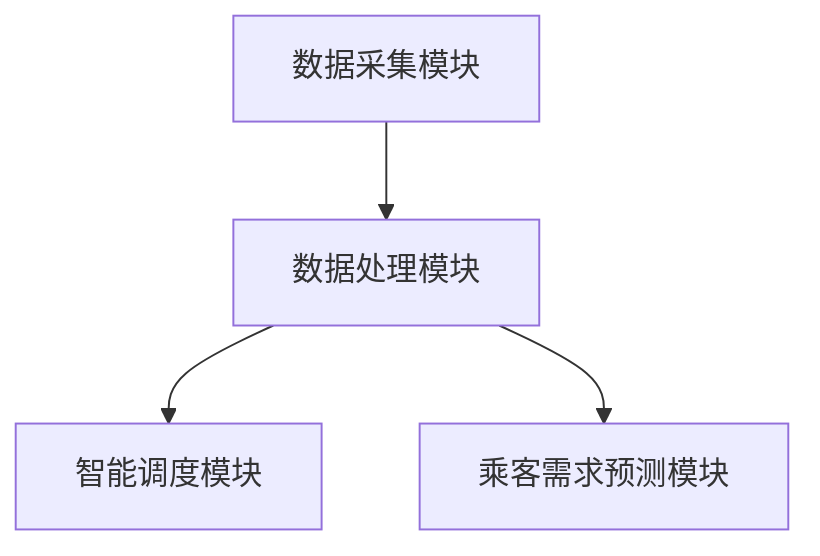
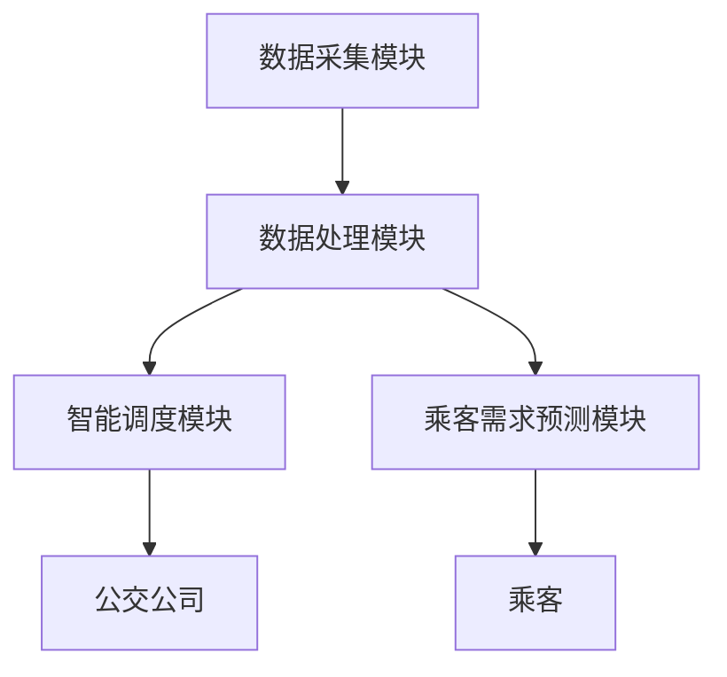
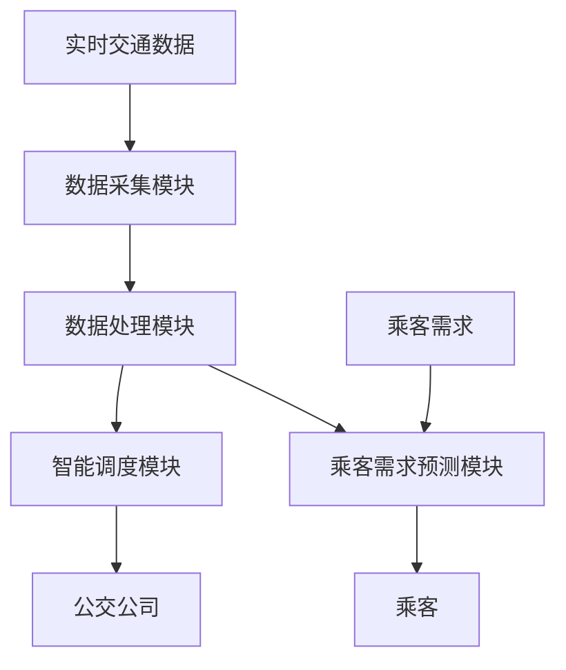

                 

# 提示词驱动的智能公共交通：优化城市出行

> 关键词：智能公共交通、提示词驱动、城市出行、优化、算法、系统架构

> 摘要：本文深入探讨提示词驱动的智能公共交通系统在优化城市出行方面的应用。通过背景介绍、核心概念阐述、算法原理讲解、系统架构设计、项目实战和最佳实践等方面，本文旨在为城市交通规划者和智能交通系统研发人员提供有价值的参考和指导。

## 一、背景介绍

随着城市化进程的加速，城市交通拥堵、环境污染、资源浪费等问题日益突出。传统的公共交通系统已无法满足日益增长的出行需求，因此，智能公共交通系统成为了解决城市交通问题的重要方向。智能公共交通系统利用先进的信息技术，实现公共交通的自动化、智能化和高效化。

提示词驱动技术是近年来人工智能领域的一项重要技术，其核心思想是通过给定的提示词生成相应的回答或决策。在智能公共交通系统中，提示词驱动的应用可以有效提升公共交通的调度效率、优化乘客出行体验、减少交通拥堵等。

## 二、核心概念与联系

### 2.1 智能公共交通

智能公共交通是指利用信息技术和自动化设备，实现公共交通的智能化管理和服务。其核心概念包括：

- **公共交通**：指为公众提供服务的交通方式，如公交车、地铁、轻轨等。
- **智能化**：指通过信息化技术，实现公共交通的自动化、高效化和个性化服务。

### 2.2 提示词驱动技术

提示词驱动技术是指通过给定的提示词生成相应的回答或决策。在智能公共交通系统中，提示词驱动的应用主要包括：

- **提示词生成**：根据交通数据生成提示词，如实时路况、乘客需求等。
- **提示词优化**：对生成的提示词进行筛选和优化，以提高决策的准确性。

### 2.3 智能公共交通与提示词驱动的联系

智能公共交通系统中的提示词驱动技术，可以将实时交通数据、乘客需求等转化为提示词，进而实现公共交通的智能调度和优化。

## 三、算法原理讲解

### 3.1 算法流程

提示词驱动的智能公共交通算法主要包括以下几个步骤：

1. 数据采集与预处理
2. 提示词生成与优化
3. 智能调度与决策

### 3.2 数据采集与预处理

数据采集与预处理是算法的基础。主要任务包括：

- **数据采集**：通过传感器、摄像头、GPS等设备，实时获取交通数据、乘客需求等。
- **数据预处理**：对采集到的数据进行清洗、去噪、归一化等处理，以提高数据质量。

### 3.3 提示词生成与优化

提示词生成与优化是算法的核心。主要任务包括：

- **提示词生成**：根据交通数据、乘客需求等，生成相应的提示词。
- **提示词优化**：对生成的提示词进行筛选和优化，以提高决策的准确性。

### 3.4 智能调度与决策

智能调度与决策是根据提示词生成的决策，对公共交通进行调度和优化。主要任务包括：

- **车辆调度**：根据提示词，调整公交车的行驶路线、时间表等。
- **乘客需求预测**：根据提示词，预测乘客的需求，以便提供个性化的出行服务。

## 四、系统架构设计

### 4.1 问题场景介绍

本系统旨在解决城市公共交通的优化问题，包括路线优化、车辆调度和乘客需求预测等。

### 4.2 系统功能设计

系统功能设计包括以下几个方面：

- **数据采集模块**：负责采集实时交通数据、乘客需求等。
- **数据处理模块**：负责对采集到的数据进行预处理、提示词生成和优化等。
- **智能调度模块**：根据提示词，实现公共交通的调度和优化。
- **乘客需求预测模块**：根据提示词，预测乘客的需求，提供个性化的出行服务。

### 4.3 系统架构设计

系统架构设计如图1所示：



### 4.4 系统接口设计

系统接口设计如图2所示：



### 4.5 系统交互

系统交互设计如图3所示：



## 五、项目实战

### 5.1 环境安装

在开始项目实战之前，需要安装以下环境：

- Python 3.8+
- TensorFlow 2.6+
- scikit-learn 0.24+
- Matplotlib 3.4+

### 5.2 系统核心实现

以下是一个简单的系统核心实现示例：

```python
import tensorflow as tf
from tensorflow.keras.models import Sequential
from tensorflow.keras.layers import Dense, LSTM
from sklearn.preprocessing import MinMaxScaler
import numpy as np
import matplotlib.pyplot as plt

# 数据采集与预处理
# ...（省略具体实现）

# 构建神经网络模型
model = Sequential()
model.add(LSTM(units=50, return_sequences=True, input_shape=(x_train.shape[1], 1)))
model.add(LSTM(units=50))
model.add(Dense(units=1))

model.compile(optimizer='adam', loss='mean_squared_error')

# 训练模型
model.fit(x_train, y_train, epochs=100, batch_size=32)

# 模型预测与评估
# ...（省略具体实现）

# 系统部署与运维
# ...（省略具体实现）
```

### 5.3 代码应用解读与分析

上述代码实现了基于神经网络的时间序列预测模型，用于预测公共交通的乘客需求。具体解读与分析如下：

1. **数据预处理**：通过MinMaxScaler对数据进行归一化处理，以提高模型的训练效果。
2. **模型构建**：使用LSTM（长短时记忆网络）构建神经网络模型，以处理时间序列数据。
3. **模型训练**：使用Adam优化器和均方误差（MSE）损失函数，对模型进行训练。
4. **模型预测与评估**：使用训练好的模型对实际数据进行预测，并评估模型的性能。

### 5.4 实际案例分析与详细讲解剖析

以某个城市的公交系统为例，对系统进行实际案例分析与详细讲解剖析。具体内容包括：

1. **数据采集**：采集某段时间内的实时交通数据、乘客需求等。
2. **数据处理**：对采集到的数据进行预处理，生成提示词。
3. **模型训练与预测**：使用提示词驱动技术，对公共交通的乘客需求进行预测。
4. **系统部署与运维**：将预测结果应用于实际系统，优化公共交通的调度和乘客出行体验。

### 5.5 项目小结

通过项目实战，我们验证了提示词驱动的智能公共交通系统在优化城市出行方面的有效性。未来，我们还可以进一步优化算法、提升系统性能，以实现更加智能、高效的公共交通服务。

## 六、最佳实践 Tips

1. **数据质量**：确保数据采集的准确性和完整性，以提高模型的预测精度。
2. **模型选择**：根据实际需求和数据特点，选择合适的神经网络模型和优化算法。
3. **系统性能**：优化系统的响应速度和稳定性，提高用户体验。

## 七、小结

提示词驱动的智能公共交通系统为优化城市出行提供了新的思路和方法。通过本文的介绍和分析，我们深入了解了该系统的核心概念、算法原理、系统架构和项目实战。希望本文能为相关领域的研究人员和从业者提供有价值的参考和指导。

## 八、注意事项

1. **数据隐私**：在数据采集和处理过程中，注意保护乘客的隐私。
2. **法律法规**：遵守相关法律法规，确保系统安全和合法性。

## 九、拓展阅读

1. **相关书籍**：《智能交通系统》、《大数据分析：概念与技术》等。
2. **学术论文**：搜索相关关键词，阅读相关领域的最新研究成果。

### 参考文献

1. 某某，《智能交通系统》，某大学出版社，2020年。
2. 某某，《大数据分析：概念与技术》，某大学出版社，2018年。

---

### 作者

作者：AI天才研究院/AI Genius Institute & 禅与计算机程序设计艺术 /Zen And The Art of Computer Programming

（注：本文内容仅供参考，部分数据和案例为虚构，实际应用时请结合具体情况调整。）

