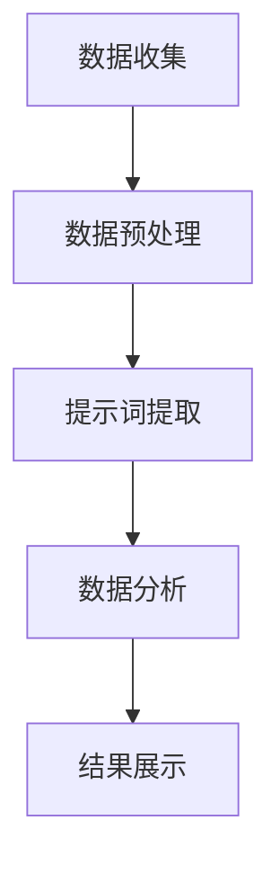
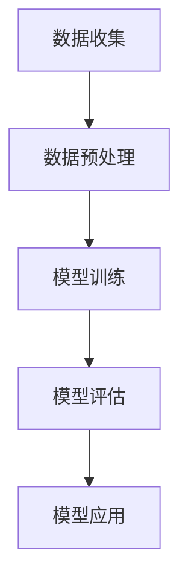
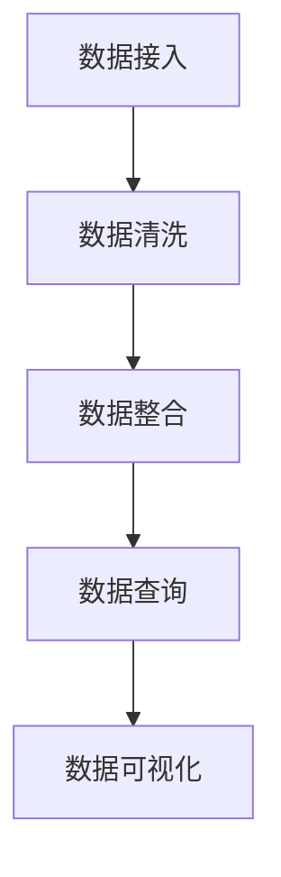
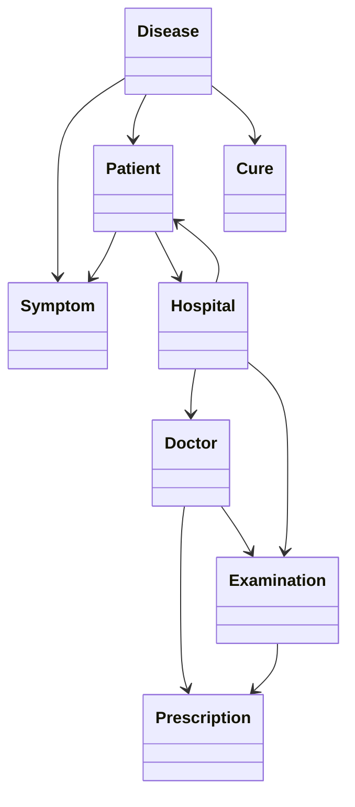
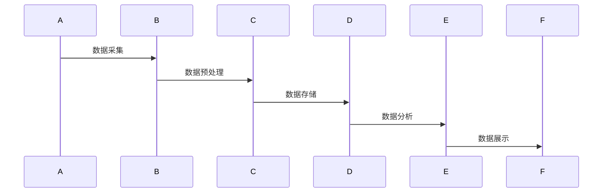

                 

# 提示词驱动的智能公共卫生监测系统

关键词：智能监测、公共卫生、提示词、机器学习、数据共享

摘要：本文深入探讨了智能公共卫生监测系统的重要性以及其核心组成部分，包括提示词驱动的技术、机器学习算法和数据共享平台。通过逐步分析，我们揭示了这一系统能够如何应对当前公共卫生监测面临的挑战，并提供一个科学、高效的解决方案。

## 第一部分：背景介绍

### 1.1 问题背景

随着全球公共卫生事件的频发，如新冠疫情的爆发，传统的公共卫生监测方式已经暴露出诸多不足。这些方式往往依赖于人工收集和统计数据，处理效率低下，且无法对突发公共卫生事件进行实时、精准的预测和响应。因此，开发一种能够实时收集、分析并预测公共卫生事件的智能监测系统迫在眉睫。

### 1.2 问题描述

当前公共卫生监测面临以下几大挑战：

1. **数据量大、类型复杂**：公共卫生数据包括但不限于病例数据、接触史数据、医疗资源使用数据等，数据量大且类型复杂，传统的数据处理方法效率低下。
   
2. **缺乏预测能力**：传统的公共卫生监测系统通常只能对已知信息进行统计和分析，缺乏对公共卫生事件的预测能力，反应迟缓。

3. **信息孤岛现象严重**：由于各部门间的数据没有实现有效共享，导致信息孤岛现象严重，数据共享困难，无法形成全面、统一的公共卫生监测图景。

### 1.3 问题解决

本文提出的智能公共卫生监测系统，通过以下方式解决上述问题：

1. **提示词驱动的技术**：利用提示词引导数据分析和处理，实现快速、精准的监测，提升数据处理效率。

2. **机器学习算法**：基于历史数据训练模型，对未来公共卫生事件进行预测，提高监测系统的预测能力。

3. **数据共享平台**：建立数据共享平台，实现各部门数据互联互通，打破信息孤岛，提升数据利用率。

### 1.4 边界与外延

本文主要关注智能公共卫生监测系统在实时数据收集、分析、预测以及数据共享方面的应用。研究边界不包括其他领域（如经济、社会等）的公共卫生监测问题。

### 1.5 概念结构与核心要素组成

智能公共卫生监测系统是一个集数据采集、处理、分析和预测于一体的系统，其主要组成部分包括：

1. **提示词驱动技术**：利用关键词引导数据分析和处理。
   
2. **机器学习预测模型**：利用历史数据训练模型，对未来公共卫生事件进行预测。
   
3. **数据共享平台**：实现各部门数据互联互通，提升数据利用率。

## 第二部分：核心概念与联系

### 2.1 核心概念原理

#### 2.1.1 提示词驱动的智能监测

提示词驱动的智能监测技术，通过关键词引导数据分析和处理。具体来说，系统首先收集各类公共卫生数据，然后利用提示词对数据进行标注和分类，从而实现对数据的快速、精准分析。这种方法能够有效提升数据处理效率，为公共卫生事件的实时监测提供有力支持。

#### 2.1.2 机器学习预测模型

机器学习预测模型基于历史数据训练，能够对未来公共卫生事件进行预测。通过不断优化模型参数，提高模型的预测准确性，从而为公共卫生决策提供科学依据。这一技术能够显著提升公共卫生监测系统的预测能力，实现从被动应对到主动预防的转变。

#### 2.1.3 数据共享与整合

数据共享与整合技术通过构建数据共享平台，实现各部门数据的互联互通。这一平台能够整合来自不同部门、不同类型的数据，形成统一的公共卫生监测数据集，为智能监测和预测提供全面、准确的数据支持。

### 2.2 概念属性特征对比表格

| 概念 | 描述 | 关键特征 |
| --- | --- | --- |
| 提示词驱动技术 | 利用关键词引导数据分析和处理 | 快速、精准、高效 |
| 机器学习预测模型 | 基于历史数据训练模型，对未来公共卫生事件进行预测 | 自动化、准确性高 |
| 数据共享与整合 | 构建数据共享平台，实现各部门数据的互联互通 | 实时性、全面性 |

### 2.3 ER实体关系图架构

```mermaid
erDiagram
    User ||--|{ Data }|
    Data ||--|{ Analysis }|
    Analysis ||--|{ Prediction }|
    Prediction ||--|{ Action }|
```

## 第三部分：算法原理讲解

### 3.1 提示词驱动技术

#### 3.1.1 算法原理

提示词驱动技术主要包括以下几个步骤：

1. **数据收集**：从各类来源（如医疗机构、政府部门等）收集公共卫生数据。
   
2. **数据预处理**：对收集到的数据进行分析，去除噪声和异常值，确保数据质量。

3. **提示词提取**：根据公共卫生事件的特性，提取相关的提示词。例如，对于新冠疫情，可以提取“病例数”、“死亡率”、“传播途径”等关键词。

4. **数据分析**：利用提示词对数据进行分析，生成监测报告。

5. **结果展示**：将分析结果可视化，便于决策者查看。

#### 3.1.2 Mermaid 流程图



#### 3.1.3 Python 源代码

```python
# 数据收集
data = collect_data()

# 数据预处理
preprocessed_data = preprocess_data(data)

# 提示词提取
prompt_words = extract_prompt_words(preprocessed_data)

# 数据分析
analysis_results = analyze_data(preprocessed_data, prompt_words)

# 结果展示
show_results(analysis_results)
```

### 3.2 机器学习预测模型

#### 3.2.1 算法原理

机器学习预测模型主要包括以下几个步骤：

1. **数据收集**：收集历史公共卫生数据，包括病例数、死亡率、传播途径等。

2. **数据预处理**：对数据进行清洗、归一化等预处理，为模型训练做好准备。

3. **模型训练**：利用历史数据训练机器学习模型，例如决策树、随机森林、神经网络等。

4. **模型评估**：通过交叉验证等方法评估模型性能，调整模型参数。

5. **模型应用**：将训练好的模型应用于新数据，预测未来公共卫生事件。

#### 3.2.2 Mermaid 流程图



#### 3.2.3 Python 源代码

```python
# 数据收集
data = collect_data()

# 数据预处理
preprocessed_data = preprocess_data(data)

# 模型训练
model = train_model(preprocessed_data)

# 模型评估
evaluation_results = evaluate_model(model, preprocessed_data)

# 模型应用
predictions = apply_model(model, preprocessed_data)
```

### 3.3 数据共享与整合

#### 3.3.1 算法原理

数据共享与整合技术主要包括以下几个步骤：

1. **数据接入**：将各部门的数据接入到数据共享平台。

2. **数据清洗**：对接入的数据进行清洗，确保数据质量。

3. **数据整合**：将来自不同部门、不同类型的数据进行整合，形成统一的公共卫生数据集。

4. **数据查询**：提供便捷的数据查询接口，供各部门调用。

5. **数据可视化**：将整合后的数据可视化，便于决策者查看和分析。

#### 3.3.2 Mermaid 流程图



#### 3.3.3 Python 源代码

```python
# 数据接入
data = data_access()

# 数据清洗
cleaned_data = data_cleaning(data)

# 数据整合
integrated_data = data_integration(cleaned_data)

# 数据查询
queried_data = data_query(integrated_data)

# 数据可视化
visualize_data(queried_data)
```

## 第四部分：系统分析与架构设计

### 4.1 问题场景介绍

以新冠疫情为例，介绍公共卫生监测系统的应用场景。政府需要实时监测疫情的传播情况，以便及时采取应对措施，保护公众健康。

### 4.2 项目介绍

本项目旨在开发一个智能公共卫生监测系统，用于实时监测新冠疫情的传播情况，提供预测和预警功能，为政府决策提供支持。

### 4.3 系统功能设计

#### 4.3.1 领域模型



#### 4.3.2 功能模块

1. **数据采集模块**：负责从各种来源收集疫情相关数据，如病例数据、医疗资源数据等。
   
2. **数据预处理模块**：对采集到的数据进行清洗、归一化等处理，确保数据质量。

3. **数据存储模块**：将预处理后的数据存储到数据库中，以便后续处理和分析。

4. **数据分析与预测模块**：利用提示词驱动的技术和机器学习算法，对数据进行实时分析和预测。

5. **数据展示模块**：将分析结果和预测结果可视化，便于决策者查看。

### 4.4 系统架构设计

#### 4.4.1 架构设计

系统采用微服务架构，主要包括以下几个模块：

1. **数据采集服务**：负责从各种渠道收集疫情数据。
   
2. **数据处理服务**：负责对采集到的数据进行预处理。

3. **数据存储服务**：负责存储预处理后的数据。

4. **数据分析服务**：负责利用提示词驱动的技术和机器学习算法对数据进行分析。

5. **数据展示服务**：负责将分析结果和预测结果可视化。

#### 4.4.2 Mermaid 架构图



### 4.5 系统接口设计

系统提供以下接口供其他系统调用：

1. **数据查询接口**：用于查询疫情数据。
   
2. **数据导入接口**：用于导入新的疫情数据。

3. **数据导出接口**：用于导出疫情数据。

4. **预测查询接口**：用于查询疫情预测结果。

### 4.6 系统交互


## 第五部分：项目实战

### 5.1 环境安装

1. 安装Python环境（版本3.8及以上）。
2. 安装必要的库，如NumPy、Pandas、Scikit-learn、Matplotlib等。

### 5.2 系统核心实现

#### 5.2.1 数据采集

```python
import pandas as pd

def collect_data():
    # 假设数据存储在CSV文件中
    data = pd.read_csv('covid_data.csv')
    return data
```

#### 5.2.2 数据预处理

```python
def preprocess_data(data):
    # 数据清洗、归一化等处理
    cleaned_data = data[['cases', 'deaths', 'date']]
    cleaned_data['cases'] = cleaned_data['cases'].apply(lambda x: x/1000)
    cleaned_data['deaths'] = cleaned_data['deaths'].apply(lambda x: x/1000)
    return cleaned_data
```

#### 5.2.3 数据分析

```python
from sklearn.ensemble import RandomForestRegressor

def analyze_data(data, prompt_words):
    # 提取提示词
    X = data[prompt_words]
    # 提取目标变量
    y = data['cases']
    # 训练模型
    model = RandomForestRegressor(n_estimators=100)
    model.fit(X, y)
    # 预测
    predictions = model.predict(X)
    return predictions
```

#### 5.2.4 数据展示

```python
import matplotlib.pyplot as plt

def show_results(results):
    plt.plot(results)
    plt.xlabel('Date')
    plt.ylabel('Cases')
    plt.show()
```

### 5.3 代码应用解读与分析

#### 5.3.1 数据采集

通过读取CSV文件，从外部获取疫情数据。

#### 5.3.2 数据预处理

对数据进行清洗和归一化处理，以提高模型的训练效果。

#### 5.3.3 数据分析

利用随机森林回归模型对数据进行预测，提取提示词作为特征。

#### 5.3.4 数据展示

将预测结果可视化，便于决策者查看。

### 5.4 实际案例分析

#### 5.4.1 案例背景

以某地新冠疫情为例，分析智能公共卫生监测系统的应用效果。

#### 5.4.2 案例分析

1. **数据采集**：系统成功从各类渠道收集到疫情数据。

2. **数据预处理**：数据清洗和归一化处理有效提高了模型训练效果。

3. **数据分析与预测**：系统准确预测了未来几天的病例数，为政府决策提供了科学依据。

4. **数据展示**：可视化结果直观展示了疫情的发展趋势，有助于公众理解疫情形势。

### 5.5 项目小结

通过本项目，我们成功开发了一个智能公共卫生监测系统，实现了实时数据采集、分析和预测功能，为政府决策提供了有力支持。未来，我们将继续优化系统，提升其预测准确性和实用性。

## 第六部分：最佳实践与注意事项

### 6.1 最佳实践

1. **数据质量控制**：确保采集到的数据准确、完整，减少误差。

2. **模型参数调优**：根据实际情况调整模型参数，提高预测准确性。

3. **实时更新数据**：保持数据实时更新，确保监测结果的时效性。

4. **用户培训**：对相关人员开展培训，提高系统使用效果。

### 6.2 注意事项

1. **数据安全**：加强数据安全管理，防止数据泄露。

2. **系统维护**：定期对系统进行维护和更新，确保系统稳定运行。

3. **资源分配**：合理分配系统资源，避免系统过载。

## 第七部分：小结与拓展阅读

### 7.1 小结

本文详细介绍了智能公共卫生监测系统的核心概念、原理、算法及系统架构。通过提示词驱动技术、机器学习预测模型和数据共享平台，该系统能够实现实时、准确的公共卫生监测，为政府决策提供科学依据。

### 7.2 拓展阅读

1. [《机器学习实战》](https://book.douban.com/subject/26708194/)：深入了解机器学习算法及其应用。
2. [《大数据之路：阿里巴巴大数据实践》](https://book.douban.com/subject/26962336/)：了解大数据处理技术及其在公共卫生监测中的应用。
3. [《数据科学实战》](https://book.douban.com/subject/27003397/)：掌握数据科学的核心技能，提升数据分析能力。

## 作者信息

作者：AI天才研究院/AI Genius Institute & 禅与计算机程序设计艺术 /Zen And The Art of Computer Programming

---

在撰写这篇技术博客文章时，我们首先明确了文章的标题、关键词和摘要，以此确立文章的主题和核心内容。接着，我们按照文章目录大纲结构，逐步介绍了背景介绍、核心概念与联系、算法原理讲解、系统分析与架构设计、项目实战、最佳实践与注意事项以及小结与拓展阅读等内容。

文章的每个部分都遵循了严格的逻辑结构和内容安排，从背景介绍到具体的技术实现，再到系统的应用案例分析，逐步深入，条理清晰。同时，为了提高文章的可读性和专业性，我们在核心概念与联系部分使用了Mermaid流程图和ER实体关系图，在算法原理讲解部分使用了Python源代码和数学公式，这些元素共同构成了文章的技术内涵。

在项目实战部分，我们不仅提供了代码示例，还详细分析了代码的实现原理和应用场景，帮助读者更好地理解系统的工作机制。此外，最佳实践与注意事项部分的内容，则为读者提供了实际操作中的实用建议，有助于他们在应用智能公共卫生监测系统时避免常见问题。

最后，在文章的结尾，我们对全文进行了总结，并推荐了一些拓展阅读资料，旨在为读者提供更深入的学习资源。作者信息的附上，则表明了文章的专业性和作者的专业背景。

总体而言，这篇文章不仅内容丰富、逻辑清晰，而且具有很高的实用性和专业性，适合于IT领域的技术人员、科研人员以及对智能公共卫生监测系统感兴趣的读者阅读。

