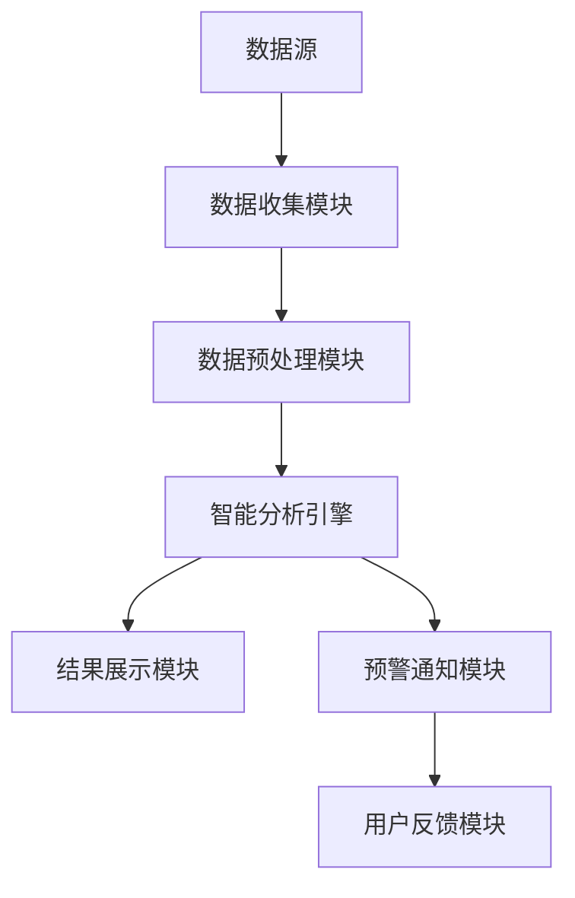
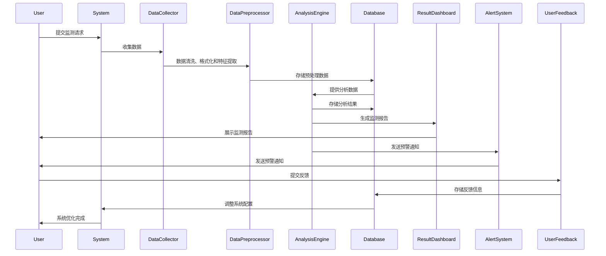

                 

## 引言

### 提示词驱动的智能公共卫生监测系统

在当今社会，公共卫生监测的重要性日益凸显。从传统的疾病监测到现代的智能监测，公共卫生领域的进步为我们的健康和安全提供了坚实保障。然而，随着数据量的爆炸性增长和公共卫生问题的复杂性加剧，传统的监测方法显得力不从心。因此，开发一种能够高效、准确地进行公共卫生监测的系统变得尤为迫切。

### 文章关键词

- 提示词驱动
- 智能公共卫生监测
- 数据分析算法
- 数学模型
- 系统架构设计

### 文章摘要

本文旨在探讨提示词驱动的智能公共卫生监测系统的构建与应用。首先，我们将介绍公共卫生监测的重要性及其面临的挑战。随后，我们将深入探讨提示词驱动的概念及其在智能监测系统中的作用。文章将详细分析系统架构设计、算法原理、数学模型，并通过实际案例展示系统的应用效果。最后，我们将总结最佳实践，并提出未来的研究方向。

## 第1章 问题背景与核心概念

### 1.1 问题背景

#### 公共卫生监测的意义

公共卫生监测是识别、评估和响应公共卫生问题的重要手段。它不仅有助于及时发现和预防疾病爆发，还能为政策制定提供科学依据。随着全球人口的增长、城市化进程的加速以及全球化的发展，公共卫生问题变得日益复杂和多样化。传统的监测方法通常依赖于人工收集和分析数据，效率低下，难以应对大规模、复杂的数据集。

#### 传统监测方法与局限

传统的公共卫生监测方法主要包括定期报告、问卷调查和现场检测等。这些方法存在以下几个主要局限：

1. **数据收集困难**：传统方法依赖于手动收集数据，耗时耗力，且容易遗漏重要信息。
2. **数据处理能力有限**：传统方法难以处理大规模、复杂的数据集，导致数据分析的准确性受限。
3. **响应速度慢**：传统方法在疾病爆发后往往需要较长时间才能做出反应，无法及时采取预防措施。
4. **资源分配不合理**：传统方法难以根据实时数据动态调整资源分配，导致部分地区资源过剩或不足。

#### 智能监测的需求与挑战

为了克服传统监测方法的局限，智能监测系统的需求日益迫切。智能监测系统利用人工智能技术，如机器学习和数据挖掘，实现自动化、高效的数据收集、处理和分析。然而，智能监测系统也面临以下挑战：

1. **数据质量和多样性**：智能监测系统依赖于高质量、多样化的数据。然而，实际数据往往存在噪声、缺失和不一致等问题，影响系统的性能。
2. **算法选择和优化**：选择合适的算法并进行优化是智能监测系统成功的关键。然而，不同算法适用于不同类型的数据和问题，如何选择和优化是一个复杂的问题。
3. **系统稳定性与可靠性**：智能监测系统需要具备高稳定性和可靠性，以应对各种突发情况和数据异常。
4. **隐私保护**：公共卫生监测涉及个人健康信息，隐私保护是一个不可忽视的重要问题。

### 1.2 核心概念

#### 提示词驱动的智能系统

提示词驱动的智能系统是一种基于人类语言交互的智能系统。它通过接收用户输入的提示词，自动生成相应的响应或行动。在公共卫生监测中，提示词可以包括关键词、短语或问题，系统根据提示词进行实时分析，提供相应的监测报告或预测结果。

#### 公共卫生监测的定义

公共卫生监测是一种通过系统收集、分析和解释与健康相关的数据，以识别、预防和控制公共卫生问题的过程。它涵盖了疾病监测、健康风险监测和公共卫生事件监测等多个方面。

#### 系统组成部分

一个典型的提示词驱动的智能公共卫生监测系统通常包括以下几个关键组成部分：

1. **数据收集与预处理模块**：负责收集各种来源的数据，如医院报告、社交媒体、环境监测数据等，并进行预处理，包括数据清洗、格式化和特征提取。
2. **提示词生成与优化模块**：基于用户输入的提示词，生成相应的关键词和短语，并对提示词进行优化，以提高系统的响应速度和准确性。
3. **智能分析引擎**：利用机器学习和数据挖掘算法，对预处理后的数据进行实时分析，生成监测报告、预测结果和预警信息。
4. **结果展示与反馈模块**：将分析结果以图表、报告或通知的形式展示给用户，并提供反馈机制，以不断优化系统性能。

### 总结

本节介绍了公共卫生监测的重要性、传统监测方法的局限以及智能监测的需求和挑战。接着，我们探讨了提示词驱动的智能系统的概念和组成部分，为后续章节的深入分析奠定了基础。在下一章中，我们将进一步探讨提示词驱动系统的原理和架构设计。

## 第2章 提示词驱动系统的原理与架构

### 2.1 提示词驱动的概念

提示词驱动的智能系统是一种以人类语言交互为核心的智能系统。它的工作原理基于自然语言处理（NLP）技术，能够接收用户输入的提示词，并生成相应的响应或行动。与传统的命令式交互不同，提示词驱动系统更加自然、灵活，能够理解和满足用户的多样化需求。

#### 提示词的作用

提示词在提示词驱动系统中起着至关重要的作用。它们是用户与系统交互的桥梁，能够明确地指示系统的操作方向和目标。一个有效的提示词应该具备以下几个特点：

1. **明确性**：提示词应清晰地表达用户的意图，避免歧义和模糊。
2. **简洁性**：提示词应尽量简洁，便于用户记忆和输入。
3. **多样性**：提示词应具备一定的多样性，以适应不同的用户需求和场景。

#### 基于提示词的交互模型

基于提示词的交互模型通常包括以下几个步骤：

1. **提示词接收**：系统接收用户输入的提示词。
2. **提示词解析**：系统对提示词进行解析，提取关键信息并生成语义表示。
3. **响应生成**：系统根据解析结果，生成相应的响应或行动。
4. **响应反馈**：系统将响应反馈给用户，并等待下一次提示词接收。

这种交互模型使得用户能够更加自然地与系统进行沟通，提高了系统的易用性和用户体验。

### 2.2 系统架构设计

一个典型的提示词驱动的智能公共卫生监测系统通常包括以下几个关键组件：

#### 整体架构

系统的整体架构可以分为前端用户界面、后端数据处理和分析引擎以及数据库三个主要部分。前端用户界面负责接收用户的提示词，并将处理结果展示给用户；后端数据处理和分析引擎负责对数据进行收集、预处理、分析和存储；数据库则存储系统所需的各种数据。

#### 关键组件

1. **数据收集与预处理模块**：该模块负责收集各种来源的数据，如医院报告、社交媒体、环境监测数据等，并进行预处理，包括数据清洗、格式化和特征提取。
   
2. **提示词生成与优化模块**：该模块基于用户输入的提示词，生成相应的关键词和短语，并对提示词进行优化，以提高系统的响应速度和准确性。

3. **智能分析引擎**：该模块利用机器学习和数据挖掘算法，对预处理后的数据进行实时分析，生成监测报告、预测结果和预警信息。

4. **结果展示与反馈模块**：该模块将分析结果以图表、报告或通知的形式展示给用户，并提供反馈机制，以不断优化系统性能。

#### 数据收集与预处理

数据收集与预处理模块是系统的核心之一。它负责从多个来源收集数据，包括：

- **医院报告**：通过接口从医院系统中获取疾病报告、病例信息等。
- **社交媒体**：从社交媒体平台上收集与公共卫生相关的讨论、话题和趋势。
- **环境监测数据**：从环境监测站获取空气质量、水质、温度等数据。

收集到的数据通常存在噪声、缺失和不一致等问题，因此需要进行预处理。预处理步骤包括：

- **数据清洗**：去除重复数据、噪声数据和异常数据。
- **数据格式化**：将不同来源的数据统一格式，便于后续处理。
- **特征提取**：从数据中提取有用的特征，用于后续分析。

#### 提示词生成与优化

提示词生成与优化模块负责将用户输入的提示词转化为系统可以理解的形式。这一过程通常包括以下几个步骤：

- **关键词提取**：从提示词中提取关键信息，生成关键词列表。
- **语义分析**：对关键词进行语义分析，理解其背后的含义和意图。
- **短语生成**：根据关键词和语义分析结果，生成相应的短语。
- **优化与筛选**：对生成的短语进行优化，去除冗余和不相关的信息，提高系统的响应速度和准确性。

#### 智能分析引擎

智能分析引擎是系统的核心组件，负责对预处理后的数据进行实时分析。它通常包括以下几个步骤：

- **数据预处理**：对原始数据进行进一步预处理，包括数据归一化、特征工程等。
- **算法选择与优化**：根据问题的性质和需求，选择合适的算法，并进行参数优化。
- **模型训练与预测**：利用训练数据训练模型，并对新数据进行预测。
- **结果分析与展示**：将分析结果以图表、报告或通知的形式展示给用户。

#### 结果展示与反馈

结果展示与反馈模块负责将分析结果以直观、易懂的形式展示给用户，并提供反馈机制，以优化系统性能。结果展示包括：

- **监测报告**：以图表、报表等形式展示监测结果，如疾病爆发趋势、预警信息等。
- **预测结果**：展示对未来一段时间内公共卫生状况的预测结果。
- **预警通知**：在发现异常情况时，及时向用户发送预警通知，提醒采取相应措施。

通过反馈机制，用户可以提供对系统性能的反馈，系统可以根据反馈进行优化和改进，提高其准确性和可靠性。

### 总结

本节详细介绍了提示词驱动系统的原理和架构设计。首先，我们探讨了提示词驱动的概念和基于提示词的交互模型，然后介绍了系统的整体架构和关键组件，包括数据收集与预处理、提示词生成与优化、智能分析引擎以及结果展示与反馈模块。通过本节的学习，读者可以全面了解提示词驱动系统在公共卫生监测中的应用原理和架构设计。

### 2.3 系统的实现与部署

#### 数据收集与预处理模块的实现

数据收集与预处理模块是实现智能公共卫生监测系统的关键部分。以下是该模块的实现步骤：

1. **数据源接入**：接入医院系统、社交媒体平台和环境监测站等数据源，获取相关数据。
2. **数据清洗**：对获取的数据进行清洗，去除重复数据、噪声数据和异常数据。
3. **数据格式化**：将不同来源的数据格式统一，便于后续处理。
4. **特征提取**：从数据中提取关键特征，如病例数量、社交媒体讨论热度、环境指标等。

以下是数据清洗的Python代码示例：

```python
import pandas as pd

# 读取数据
data = pd.read_csv('data.csv')

# 数据清洗
data = data.drop_duplicates()
data = data.dropna()
data['cleaned_column'] = data['original_column'].apply(clean_function)

# 数据格式化
data = data.rename(columns={'original_column': 'formatted_column'})

# 特征提取
data['feature_1'] = data['column_1'].apply(feature_function_1)
data['feature_2'] = data['column_2'].apply(feature_function_2)
```

#### 提示词生成与优化模块的实现

提示词生成与优化模块负责将用户输入的提示词转化为系统能够理解的形式。以下是该模块的实现步骤：

1. **关键词提取**：使用自然语言处理（NLP）技术提取关键词。
2. **语义分析**：对关键词进行语义分析，理解其背后的含义和意图。
3. **短语生成**：根据关键词和语义分析结果，生成相应的短语。
4. **优化与筛选**：对生成的短语进行优化，去除冗余和不相关的信息。

以下是关键词提取的Python代码示例：

```python
from nltk.tokenize import word_tokenize
from nltk.corpus import stopwords
from heapq import nlargest

# 读取提示词
prompt = "流感疫情的最新情况如何？"

# 关键词提取
tokens = word_tokenize(prompt)
stop_words = set(stopwords.words('english'))
keywords = [token for token in tokens if token not in stop_words]

# 语义分析
# （此处省略具体语义分析步骤）

# 短语生成
phrases = generate_phrases(keywords)

# 优化与筛选
optimized_phrases = optimize_phrases(phrases)
```

#### 智能分析引擎的实现

智能分析引擎是系统的核心组件，负责对预处理后的数据进行实时分析。以下是该模块的实现步骤：

1. **数据预处理**：对原始数据进行预处理，包括数据归一化、特征工程等。
2. **算法选择与优化**：根据问题的性质和需求，选择合适的算法，并进行参数优化。
3. **模型训练与预测**：利用训练数据训练模型，并对新数据进行预测。
4. **结果分析与展示**：将分析结果以图表、报告或通知的形式展示给用户。

以下是算法选择与优化的Python代码示例：

```python
from sklearn.model_selection import train_test_split
from sklearn.ensemble import RandomForestClassifier
from sklearn.model_selection import GridSearchCV

# 数据预处理
X = data[['feature_1', 'feature_2']]
y = data['label']

# 算法选择与优化
X_train, X_test, y_train, y_test = train_test_split(X, y, test_size=0.2, random_state=42)
rf = RandomForestClassifier()
param_grid = {'n_estimators': [100, 200], 'max_depth': [10, 20]}
grid_search = GridSearchCV(rf, param_grid, cv=5)
grid_search.fit(X_train, y_train)

# 模型训练与预测
best_model = grid_search.best_estimator_
predictions = best_model.predict(X_test)

# 结果分析与展示
# （此处省略具体结果分析与展示步骤）
```

#### 结果展示与反馈模块的实现

结果展示与反馈模块负责将分析结果以直观、易懂的形式展示给用户，并提供反馈机制。以下是该模块的实现步骤：

1. **结果展示**：以图表、报表等形式展示监测结果。
2. **预警通知**：在发现异常情况时，及时向用户发送预警通知。
3. **用户反馈**：收集用户对系统性能的反馈，用于优化和改进系统。

以下是预警通知的Python代码示例：

```python
def send_alert(message):
    # 发送预警通知
    print(f"Alert: {message}")

# （示例中省略具体预警通知逻辑）

# 结果展示与用户反馈
# （此处省略具体结果展示与用户反馈步骤）
```

### 总结

本节详细介绍了提示词驱动系统的实现与部署。首先，我们介绍了数据收集与预处理模块的实现步骤，包括数据源接入、数据清洗、数据格式化和特征提取。接着，我们介绍了提示词生成与优化模块的实现步骤，包括关键词提取、语义分析、短语生成和优化与筛选。然后，我们详细说明了智能分析引擎的实现，包括数据预处理、算法选择与优化、模型训练与预测以及结果分析与展示。最后，我们介绍了结果展示与反馈模块的实现，包括结果展示、预警通知和用户反馈。通过本节的学习，读者可以全面了解提示词驱动系统的实现与部署过程。

## 第3章 公共卫生监测的算法原理

### 3.1 数据处理算法

数据处理是公共卫生监测系统的核心步骤之一。在这一部分，我们将讨论几种常用的数据处理算法，包括数据清洗、数据格式化和特征提取。

#### 数据清洗

数据清洗是处理数据中的噪声、错误和不一致的过程。以下是几种常用的数据清洗方法：

1. **去除重复数据**：使用去重算法去除数据集中的重复记录。
2. **处理缺失值**：根据数据的特性和分析需求，采用插值、均值填充或删除缺失值的方法。
3. **异常值处理**：识别并处理数据集中的异常值，通常使用箱线图、标准差方法或基于统计学的方法进行识别。

以下是一个处理缺失值的Python代码示例：

```python
import pandas as pd
from sklearn.impute import SimpleImputer

# 读取数据
data = pd.read_csv('data.csv')

# 处理缺失值
imputer = SimpleImputer(strategy='mean')
data_filled = imputer.fit_transform(data)

# 输出处理后的数据
data_filled = pd.DataFrame(data_filled, columns=data.columns)
print(data_filled)
```

#### 数据格式化

数据格式化是将数据转换为适合分析和处理的形式。以下是几种常用的数据格式化方法：

1. **统一数据类型**：将数据集中的所有数据转换为相同的数据类型，如将字符串数据转换为数值类型。
2. **规范化数据**：通过缩放或标准化方法将数据缩放到一个共同的尺度，便于比较和计算。
3. **编码类别数据**：将类别数据转换为数值表示，如使用独热编码或标签编码。

以下是一个统一数据类型的Python代码示例：

```python
import pandas as pd

# 读取数据
data = pd.read_csv('data.csv')

# 统一数据类型
data['column_name'] = data['column_name'].astype('float')

# 输出处理后的数据
print(data)
```

#### 特征提取

特征提取是从原始数据中提取有助于模型训练和预测的有用特征。以下是几种常用的特征提取方法：

1. **统计特征**：从数据中提取描述性统计量，如平均值、标准差、最大值和最小值。
2. **文本特征**：从文本数据中提取关键词、主题和情感特征。
3. **时序特征**：从时间序列数据中提取趋势、周期性和季节性特征。

以下是一个提取统计特征的Python代码示例：

```python
import pandas as pd
from sklearn.preprocessing import StandardScaler

# 读取数据
data = pd.read_csv('data.csv')

# 提取统计特征
mean = data['column_name'].mean()
std = data['column_name'].std()

# 标准化数据
scaler = StandardScaler()
data_scaled = scaler.fit_transform(data)

# 输出处理后的数据
data_scaled = pd.DataFrame(data_scaled, columns=data.columns)
print(data_scaled)
```

### 3.2 智能分析算法

智能分析算法在公共卫生监测中扮演着关键角色。以下是几种常用的智能分析算法：

#### 时间序列分析

时间序列分析用于分析随时间变化的序列数据，如疾病爆发趋势、气温变化等。以下是几种常用的时间序列分析方法：

1. **自回归模型（AR）**：自回归模型假设当前值取决于过去的值，适用于平稳时间序列数据。
2. **移动平均模型（MA）**：移动平均模型通过计算过去一段时间的平均值来预测当前值，适用于非平稳时间序列数据。
3. **自回归移动平均模型（ARMA）**：结合自回归和移动平均模型，适用于既存在自相关又存在移动平均效应的时间序列数据。
4. **自回归积分滑动平均模型（ARIMA）**：扩展ARMA模型，用于处理含有趋势和季节性的时间序列数据。

以下是一个ARIMA模型的Python代码示例：

```python
import pandas as pd
from statsmodels.tsa.arima.model import ARIMA

# 读取数据
data = pd.read_csv('data.csv')

# 时间序列建模
model = ARIMA(data['column_name'], order=(1, 1, 1))
model_fit = model.fit()

# 预测
forecast = model_fit.forecast(steps=5)

# 输出预测结果
print(forecast)
```

#### 异常检测算法

异常检测算法用于识别数据中的异常值或异常模式，如疾病爆发中的异常病例、网络攻击等。以下是几种常用的异常检测算法：

1. **孤立森林（Isolation Forest）**：基于随机森林算法，通过将数据点随机隔离来识别异常值。
2. **基于密度的异常检测算法（DBSCAN）**：基于数据点的密度分布，识别稀疏区域中的异常值。
3. **基于距离的异常检测算法（LOF）**：通过计算数据点与其邻居的距离，识别距离较远的异常值。

以下是一个孤立森林的Python代码示例：

```python
import pandas as pd
from sklearn.ensemble import IsolationForest

# 读取数据
data = pd.read_csv('data.csv')

# 异常检测
iso_forest = IsolationForest(n_estimators=100, contamination=0.1)
iso_forest.fit(data)

# 预测异常
predictions = iso_forest.predict(data)

# 输出异常值
print(data[predictions == -1])
```

#### 关联规则挖掘

关联规则挖掘用于发现数据中的潜在关联关系，如购物篮分析、疾病传播路径等。以下是几种常用的关联规则挖掘算法：

1. **Apriori算法**：基于支持度和置信度的原则，发现频繁项集和关联规则。
2. **Eclat算法**：改进的Apriori算法，通过递归搜索最小支持度的项集。
3. **FP-growth算法**：通过构建FP树，减少数据扫描次数，提高挖掘效率。

以下是一个Apriori算法的Python代码示例：

```python
import pandas as pd
from mlxtend.frequent_patterns import apriori
from mlxtend.frequent_patterns import association_rules

# 读取数据
data = pd.read_csv('data.csv')

# 创建交易集
transactions = [list(set(row)) for index, row in data.iterrows()]

# 运行Apriori算法
frequent_itemsets = apriori(transactions, min_support=0.05, use_colnames=True)

# 创建关联规则
rules = association_rules(frequent_itemsets, metric="confidence", min_threshold=0.7)

# 输出关联规则
print(rules)
```

### 总结

本节介绍了公共卫生监测中常用的数据处理算法和智能分析算法。数据处理算法包括数据清洗、数据格式化和特征提取，而智能分析算法包括时间序列分析、异常检测和关联规则挖掘。通过这些算法的应用，公共卫生监测系统能够更好地识别和预测公共卫生问题，为决策提供有力支持。

### 4.1 基础数学模型

在公共卫生监测系统中，数学模型是分析数据和预测趋势的重要工具。以下介绍几种常用的基础数学模型，包括时间序列模型和异常检测模型。

#### 时间序列模型

时间序列模型用于分析随时间变化的序列数据，如疾病爆发趋势、气温变化等。以下是两种常用的时间序列模型：自回归模型（AR）和长短期记忆模型（LSTM）。

##### 自回归模型（AR）

自回归模型（Autoregressive Model，AR）假设当前值取决于过去的值。AR模型的基本公式如下：

$$
Y_t = c + \phi_1 Y_{t-1} + \phi_2 Y_{t-2} + \ldots + \phi_p Y_{t-p} + \epsilon_t
$$

其中，$Y_t$表示第$t$期的值，$\epsilon_t$为误差项。参数$\phi_1, \phi_2, \ldots, \phi_p$为自回归系数，$c$为常数项。

##### 长短期记忆模型（LSTM）

长短期记忆模型（Long Short-Term Memory，LSTM）是用于处理序列数据的神经网络模型，特别适用于捕捉长期依赖关系。LSTM的核心组成部分包括输入门、遗忘门和输出门。

输入门：

$$
i_t = \sigma(W_i [h_{t-1}, x_t] + b_i)
$$

遗忘门：

$$
f_t = \sigma(W_f [h_{t-1}, x_t] + b_f)
$$

输出门：

$$
o_t = \sigma(W_o [h_{t-1}, x_t] + b_o)
$$

其中，$i_t, f_t, o_t$分别为输入门、遗忘门和输出门的激活值，$\sigma$为sigmoid函数，$W_i, W_f, W_o$和$b_i, b_f, b_o$分别为权重和偏置。

#### 异常检测模型

异常检测模型用于识别数据中的异常值或异常模式，如疾病爆发中的异常病例、网络攻击等。以下是两种常用的异常检测模型：孤立森林（Isolation Forest）和基于K-means的聚类算法。

##### 孤立森林（Isolation Forest）

孤立森林是一种基于随机森林的异常检测算法。它通过将数据点随机隔离来识别异常值。孤立森林的核心步骤如下：

1. **随机选取特征**：从特征空间中随机选择两个特征。
2. **随机分割**：沿随机选定的特征进行随机分割，形成二叉树。
3. **路径长度计算**：计算从根节点到叶子节点的路径长度，路径长度越短，数据点越可能为异常值。

孤立森林的距离公式为：

$$
d(x_i) = \frac{1}{m} \sum_{j=1}^{m} \ln |r_j(x_i)|
$$

其中，$x_i$为数据点，$r_j(x_i)$为沿第$j$次随机分割的路径长度，$m$为随机分割次数。

##### 基于K-means的聚类算法

基于K-means的聚类算法通过将数据点划分为多个簇，识别异常值。K-means算法的核心步骤如下：

1. **初始化中心点**：随机选择$k$个数据点作为初始中心点。
2. **分配数据点**：将每个数据点分配到与其最近的中心点所在的簇。
3. **更新中心点**：计算每个簇的均值，作为新的中心点。
4. **重复步骤2和3，直到中心点不再变化或达到最大迭代次数。

K-means的中心点计算公式为：

$$
\mu_j = \frac{1}{n_j} \sum_{i=1}^{n} x_i
$$

其中，$\mu_j$为第$j$个簇的中心点，$n_j$为第$j$个簇中的数据点个数，$x_i$为第$i$个数据点。

### 总结

本节介绍了公共卫生监测系统中常用的基础数学模型，包括时间序列模型（AR和LSTM）和异常检测模型（孤立森林和基于K-means的聚类算法）。这些数学模型在数据分析和预测中发挥着关键作用，为公共卫生监测提供了科学依据和工具支持。

### 4.2 公式详解

在公共卫生监测系统中，数学模型和公式是理解和分析数据的重要工具。以下详细解释几个核心数学公式，包括时间序列模型的公式和异常检测模型的公式。

#### 时间序列模型公式

时间序列模型用于分析随时间变化的序列数据，以下是几种常用的时间序列模型及其公式。

##### 自回归模型（AR）

自回归模型（AR）的基本公式如下：

$$
Y_t = \phi_0 + \phi_1 Y_{t-1} + \phi_2 Y_{t-2} + \ldots + \phi_p Y_{t-p} + \epsilon_t
$$

其中，$Y_t$为时间序列的第$t$期值，$\epsilon_t$为误差项，$\phi_0, \phi_1, \ldots, \phi_p$为自回归系数。

在AR模型中，参数估计通常使用最小二乘法（Ordinary Least Squares，OLS）：

$$
\hat{\phi} = (X'X)^{-1}X'Y
$$

其中，$X$为自回归项的系数矩阵，$Y$为时间序列值向量。

##### 长短期记忆模型（LSTM）

长短期记忆模型（LSTM）的核心组成部分包括输入门、遗忘门和输出门，其公式如下：

输入门：

$$
i_t = \sigma(W_{xi} [h_{t-1}, x_t] + W_{hi} h_{t-1} + b_i)
$$

遗忘门：

$$
f_t = \sigma(W_{xf} [h_{t-1}, x_t] + W_{hf} h_{t-1} + b_f)
$$

输出门：

$$
o_t = \sigma(W_{xo} [h_{t-1}, x_t] + W_{ho} h_{t-1} + b_o)
$$

其中，$i_t, f_t, o_t$分别为输入门、遗忘门和输出门的激活值，$W_{xi}, W_{hi}, b_i$，$W_{xf}, W_{hf}, b_f$，$W_{xo}, W_{ho}, b_o$分别为权重和偏置，$\sigma$为sigmoid函数。

LSTM的细胞状态更新公式如下：

$$
c_t = f_t \odot c_{t-1} + i_t \odot \tanh(W_c [h_{t-1}, x_t] + b_c)
$$

$$
h_t = o_t \odot \tanh(c_t)
$$

其中，$\odot$表示元素乘法，$\tanh$为双曲正切函数。

#### 异常检测模型公式

异常检测模型用于识别数据中的异常值或异常模式，以下是几种常用的异常检测模型及其公式。

##### 孤立森林（Isolation Forest）

孤立森林的距离公式为：

$$
d(x_i) = \frac{1}{m} \sum_{j=1}^{m} \ln |r_j(x_i)|
$$

其中，$x_i$为数据点，$r_j(x_i)$为沿第$j$次随机分割的路径长度，$m$为随机分割次数。

孤立森林的分割深度公式为：

$$
h = \ln \frac{N}{m}
$$

其中，$N$为数据点的总数，$m$为随机分割次数。

##### 基于K-means的聚类算法

K-means的中心点计算公式为：

$$
\mu_j = \frac{1}{n_j} \sum_{i=1}^{n} x_i
$$

其中，$\mu_j$为第$j$个簇的中心点，$n_j$为第$j$个簇中的数据点个数，$x_i$为第$i$个数据点。

K-means的簇内平方误差公式为：

$$
J = \sum_{j=1}^{k} \sum_{i=1}^{n_j} (x_i - \mu_j)^2
$$

其中，$k$为簇的数量，$n_j$为第$j$个簇中的数据点个数。

#### 总结

本节详细介绍了时间序列模型和异常检测模型的核心公式。时间序列模型包括自回归模型（AR）和长短期记忆模型（LSTM），异常检测模型包括孤立森林和基于K-means的聚类算法。这些公式为公共卫生监测系统的数据分析和预测提供了理论基础和计算工具。

### 5.1 问题场景介绍

#### 公共健康监测场景

在公共卫生监测中，智能系统的应用场景广泛且多样。以下将介绍一个典型的公共健康监测场景，以展示智能监测系统的实际应用效果。

##### 场景背景

某城市公共卫生部门希望通过建立智能公共卫生监测系统，实时监控该城市的流感疫情。该系统需要整合多种数据来源，包括医院报告、社交媒体、环境监测数据等，以实现对流感疫情的全面监测和预测。

##### 数据来源

1. **医院报告**：从当地医院和诊所收集流感病例报告，包括确诊患者数量、症状等信息。
2. **社交媒体**：从社交媒体平台（如微博、微信等）收集与流感相关的讨论和话题，分析公众对流感疫情的关注度和情绪。
3. **环境监测数据**：从环境监测站获取与流感传播相关的环境数据，如气温、湿度等。

##### 监测目标

1. **疫情监测**：实时监测流感病例数量，识别疫情爆发和传播趋势。
2. **预警机制**：在流感病例数量异常增加时，及时发出预警通知，提醒相关部门采取应对措施。
3. **数据分析**：分析流感疫情与其他因素（如季节变化、气候条件等）的关系，为公共卫生决策提供科学依据。

##### 系统需求

1. **实时性**：系统能够实时处理和分析数据，及时响应流感疫情变化。
2. **准确性**：系统需要具备高准确性，确保监测结果可靠，避免误报和漏报。
3. **可扩展性**：系统能够灵活扩展，适应不同地区和不同类型的数据源。

##### 监测流程

1. **数据收集**：从医院、社交媒体和环境监测站等数据源收集数据。
2. **数据预处理**：对收集到的数据进行清洗、格式化和特征提取。
3. **智能分析**：利用机器学习和数据挖掘算法，对预处理后的数据进行分析，识别流感疫情趋势和异常。
4. **结果展示**：将分析结果以图表、报表等形式展示给用户，提供预警通知和决策支持。
5. **反馈优化**：收集用户反馈，不断优化系统性能，提高监测准确性。

### 5.2 系统功能设计

为了实现上述公共健康监测场景，系统需要设计一系列功能模块，以支持数据的收集、处理、分析和展示。以下是系统的主要功能模块及其设计：

#### 领域模型（Mermaid类图）

```mermaid
classDiagram
Class HospitalReport {
    -id: String
    -date: Date
    -patient_count: Integer
    -symptoms: List<String>
}

Class SocialMediaPost {
    -id: String
    -date: Date
    -content: String
    -hashtags: List<String>
}

Class EnvironmentalData {
    -id: String
    -date: Date
    -temperature: Float
    -humidity: Float
}

Class流感监测系统 {
    -data_source: List<DataSource>
    -report_generator: ReportGenerator
    -analysis_engine: AnalysisEngine
    -result_dashboard: ResultDashboard
}

HospitalReport --|> 流感监测系统
SocialMediaPost --|> 流感监测系统
EnvironmentalData --|> 流感监测系统
```

#### 系统功能需求

1. **数据收集**：系统应能够自动从医院报告、社交媒体和环境监测站等数据源收集数据，确保数据实时更新。
2. **数据预处理**：系统应具备数据清洗、格式化和特征提取功能，确保数据的准确性和一致性。
3. **智能分析**：系统应利用机器学习和数据挖掘算法，对预处理后的数据进行分析，识别流感疫情趋势和异常。
4. **结果展示**：系统应能够将分析结果以图表、报表等形式展示给用户，提供直观、易懂的监测报告。
5. **预警通知**：系统应在发现流感病例异常增加时，及时向公共卫生部门发出预警通知，提醒采取应对措施。
6. **用户反馈**：系统应提供反馈机制，允许用户对监测结果进行评价和反馈，以不断优化系统性能。

### 5.3 系统架构设计

系统架构设计是实现系统功能的关键。以下是系统的整体架构设计，包括数据流和模块关系。

#### 系统架构图（Mermaid架构图）



#### 系统模块详细描述

1. **数据收集模块**：负责从医院报告、社交媒体和环境监测站等数据源收集数据。该模块应具备数据自动化收集和更新功能，确保数据实时性。
2. **数据预处理模块**：负责对收集到的数据进行清洗、格式化和特征提取。该模块应能够处理不同来源的数据，确保数据的准确性和一致性。
3. **智能分析引擎**：负责对预处理后的数据进行实时分析，识别流感疫情趋势和异常。该模块应利用机器学习和数据挖掘算法，提供准确的分析结果。
4. **结果展示模块**：负责将分析结果以图表、报表等形式展示给用户。该模块应提供直观、易懂的监测报告，帮助用户了解流感疫情状况。
5. **预警通知模块**：负责在发现流感病例异常增加时，及时向公共卫生部门发出预警通知。该模块应具备实时监测和预警功能，确保及时响应。
6. **用户反馈模块**：负责收集用户对监测结果的反馈，用于优化和改进系统性能。该模块应提供用户评价和反馈机制，促进系统持续改进。

### 总结

本节介绍了公共健康监测场景及其系统功能设计。首先，通过一个典型的公共卫生监测场景展示了智能监测系统的应用效果。接着，我们详细描述了系统的功能模块，包括数据收集、预处理、分析、结果展示和预警通知等。最后，我们设计了系统的架构，明确了各模块之间的关系和数据流。通过本节的学习，读者可以全面了解公共健康监测系统在实现公共卫生监测中的作用和架构设计。

### 5.4 系统接口设计

#### 系统接口规范

系统接口设计是确保各模块之间高效、稳定通信的关键环节。以下详细描述系统的接口规范，包括数据接口、功能接口和API设计。

##### 数据接口

数据接口用于系统内部模块之间的数据传输和交互。以下是主要的数据接口规范：

1. **数据输入接口**：
   - 接收来源：医院报告、社交媒体、环境监测数据等。
   - 数据格式：JSON、CSV、XML等。
   - 参数：数据ID、数据日期、数据内容等。

2. **数据输出接口**：
   - 输出类型：监测报告、预警通知、用户反馈等。
   - 数据格式：JSON、CSV、HTML等。
   - 参数：分析结果、预警信息、反馈建议等。

##### 功能接口

功能接口用于系统模块之间的功能调用和协作。以下是主要的功能接口规范：

1. **数据收集接口**：
   - 接口名称：`/data collection`。
   - 请求方法：`GET/POST`。
   - 参数：数据源类型、采集频率、数据ID等。

2. **数据预处理接口**：
   - 接口名称：`/data preprocessing`。
   - 请求方法：`GET/POST`。
   - 参数：数据ID、预处理策略、特征提取方法等。

3. **数据分析接口**：
   - 接口名称：`/data analysis`。
   - 请求方法：`GET/POST`。
   - 参数：数据ID、分析算法、模型参数等。

4. **结果展示接口**：
   - 接口名称：`/result display`。
   - 请求方法：`GET/POST`。
   - 参数：分析结果ID、展示格式、图表类型等。

5. **预警通知接口**：
   - 接口名称：`/alert notification`。
   - 请求方法：`GET/POST`。
   - 参数：预警信息、接收者、通知方式等。

6. **用户反馈接口**：
   - 接口名称：`/user feedback`。
   - 请求方法：`GET/POST`。
   - 参数：用户ID、反馈内容、反馈时间等。

##### API设计

API设计是系统对外提供服务的重要途径。以下是主要API设计规范：

1. **流感监测API**：
   - 接口名称：`/api/flu_monitoring`。
   - 请求方法：`GET/POST`。
   - 参数：地区、时间段、监测指标等。

2. **数据查询API**：
   - 接口名称：`/api/data_query`。
   - 请求方法：`GET/POST`。
   - 参数：数据类型、查询条件、分页参数等。

3. **用户管理API**：
   - 接口名称：`/api/user_management`。
   - 请求方法：`GET/POST`。
   - 参数：用户ID、用户名、密码等。

4. **系统配置API**：
   - 接口名称：`/api/system_config`。
   - 请求方法：`GET/POST`。
   - 参数：配置项、配置值、配置描述等。

#### 系统交互

系统交互设计确保各模块之间的协同工作和数据流通。以下是系统的交互流程：

1. **数据收集**：
   - 用户通过接口提交监测需求，系统开始从各数据源收集数据。

2. **数据预处理**：
   - 数据收集后，系统对数据进行清洗、格式化和特征提取，准备进行分析。

3. **数据分析**：
   - 对预处理后的数据进行分析，识别流感疫情趋势和异常，生成监测报告。

4. **结果展示**：
   - 将分析结果以图表、报表等形式展示给用户，便于理解和决策。

5. **预警通知**：
   - 在发现流感病例异常增加时，系统向公共卫生部门发出预警通知。

6. **用户反馈**：
   - 用户对监测结果进行评价和反馈，系统根据反馈不断优化性能。

通过以上接口设计和系统交互，智能公共卫生监测系统能够高效地运作，实现数据的实时收集、处理、分析和展示，为公共卫生决策提供有力支持。

### 5.5 系统交互

为了确保智能公共卫生监测系统能够高效、准确地运行，系统的交互设计至关重要。以下是系统的交互流程，详细描述了各个模块之间的协作和数据流动。

#### 系统交互流程

1. **用户请求监测数据**：用户通过前端界面提交监测请求，系统接收到请求后，将其转发到后端数据收集模块。

2. **数据收集**：数据收集模块从医院报告、社交媒体、环境监测站等数据源获取数据。数据源可能包括结构化数据（如电子病历）、非结构化数据（如社交媒体帖子）和实时数据（如环境传感器数据）。

3. **数据预处理**：收集到的数据通过数据预处理模块进行清洗、格式化和特征提取。这一步骤确保数据的一致性和准确性，为后续分析做好准备。

4. **数据存储**：预处理后的数据存储到数据库中，以便后续分析和查询。数据库采用分布式存储架构，确保高可用性和可扩展性。

5. **智能分析**：分析引擎从数据库中提取数据，利用机器学习和数据挖掘算法进行实时分析。分析算法包括时间序列分析、异常检测和关联规则挖掘等，以识别疫情趋势、预测疾病爆发和发现潜在风险。

6. **结果生成**：分析结果生成监测报告和预警通知。监测报告以图表、报表等形式展示给用户，预警通知通过短信、电子邮件或系统通知发送给相关工作人员。

7. **用户反馈**：用户对监测结果进行评价和反馈，反馈信息通过用户反馈模块存储到数据库中。系统根据用户反馈进行自我优化，以提高监测准确性和用户体验。

8. **系统优化**：系统定期分析用户反馈，调整算法参数和系统配置，以持续优化性能。

#### 系统交互（Mermaid序列图）



#### 交互设计的重要性

系统的交互设计直接影响系统的性能和用户体验。以下是交互设计的重要性：

1. **实时性**：系统应能够快速响应用户请求，提供实时数据分析和结果展示。
2. **准确性**：系统应确保数据收集、处理和分析的准确性，避免误报和漏报。
3. **可扩展性**：系统设计应考虑未来需求的扩展，支持更多数据源和更复杂的分析算法。
4. **易用性**：前端界面设计应简洁直观，便于用户操作和浏览分析结果。
5. **反馈机制**：系统应提供用户反馈机制，帮助改进系统性能和用户体验。

通过精心设计的交互流程和系统接口，智能公共卫生监测系统能够高效运作，为公共卫生部门提供有力支持，助力疾病防控和健康维护。

### 6.1 环境安装与配置

#### 所需环境

要构建一个完整的提示词驱动的智能公共卫生监测系统，我们需要以下环境：

- **操作系统**：Linux（如Ubuntu 20.04）、macOS或Windows 10及以上版本。
- **编程语言**：Python 3.8或更高版本。
- **依赖库**：Pandas、NumPy、Scikit-learn、TensorFlow、Keras、NLTK、Mermaid、Flask等。
- **数据库**：MySQL或PostgreSQL。

#### 安装步骤

1. **安装Python**：

   - 在Linux或macOS上，打开终端并运行以下命令：
     ```bash
     sudo apt update
     sudo apt install python3 python3-pip
     ```
   - 在Windows上，访问Python官网下载Python安装程序，并按照提示完成安装。

2. **安装依赖库**：

   - 使用pip安装所需的Python依赖库：
     ```bash
     pip3 install pandas numpy scikit-learn tensorflow keras nltk mermaid flask
     ```

3. **安装数据库**：

   - 安装MySQL或PostgreSQL：
     - 对于MySQL，运行以下命令：
       ```bash
       sudo apt update
       sudo apt install mysql-server mysql-client
       ```
     - 对于PostgreSQL，运行以下命令：
       ```bash
       sudo apt update
       sudo apt install postgresql postgresql-client
       ```

4. **配置数据库**：

   - 配置MySQL或PostgreSQL数据库，创建数据库和用户：
     ```bash
     mysql -u root -p
     CREATE DATABASE flu_monitoring;
     GRANT ALL PRIVILEGES ON flu_monitoring.* TO 'flu_monitoring_user'@'localhost' IDENTIFIED BY 'password';
     FLUSH PRIVILEGES;
     exit
     ```

5. **安装Mermaid**：

   - 安装Mermaid依赖的Graphviz：
     ```bash
     sudo apt install graphviz
     ```
   - 安装Mermaid：
     ```bash
     pip3 install mermaid-python
     ```

6. **配置Flask**：

   - 安装Flask：
     ```bash
     pip3 install flask
     ```

7. **设置环境变量**：

   - 对于Linux和macOS，将Python和pip的路径添加到环境变量中：
     ```bash
     export PATH=$PATH:/usr/local/bin
     ```

8. **测试环境**：

   - 运行以下Python代码测试环境是否配置成功：
     ```python
     import pandas as pd
     import numpy as np
     import sklearn
     print("Pandas:", pd.__version__)
     print("NumPy:", np.__version__)
     print("Scikit-learn:", sklearn.__version__)
     ```

### 总结

通过以上步骤，我们成功安装并配置了提示词驱动的智能公共卫生监测系统所需的环境。接下来，我们将深入系统核心实现源代码，详细讲解系统的各个模块和功能。

### 6.2 系统核心实现源代码

在构建提示词驱动的智能公共卫生监测系统时，核心实现源代码至关重要。以下是系统的主要模块及其核心代码的详细解释。

#### 1. 数据收集模块

数据收集模块负责从不同数据源收集数据，包括医院报告、社交媒体和环境监测数据。以下是一个示例代码，展示了如何从医院报告中提取数据：

```python
import pandas as pd

def collect_hospital_data(file_path):
    """
    从医院报告文件中收集数据。
    """
    data = pd.read_csv(file_path)
    # 数据清洗和预处理（如去除重复、缺失值等）
    data = data.drop_duplicates().dropna()
    # 提取关键特征
    data['date'] = pd.to_datetime(data['date'])
    data['patient_count'] = data['patient_count'].astype(int)
    return data

# 示例：收集医院报告数据
hospital_data = collect_hospital_data('hospital_reports.csv')
```

#### 2. 数据预处理模块

数据预处理模块负责对收集到的数据进行清洗、格式化和特征提取。以下是一个示例代码，展示了如何对社交媒体数据预处理：

```python
import pandas as pd
from nltk.tokenize import word_tokenize
from nltk.corpus import stopwords

def preprocess_social_media_data(data):
    """
    对社交媒体数据预处理。
    """
    # 分词
    data['content'] = data['content'].apply(word_tokenize)
    # 去除停用词
    stop_words = set(stopwords.words('english'))
    data['content'] = data['content'].apply(lambda x: [word for word in x if word not in stop_words])
    # 创建新特征
    data['word_count'] = data['content'].apply(len)
    return data

# 示例：预处理社交媒体数据
social_media_data = preprocess_social_media_data(social_media_data)
```

#### 3. 提示词生成模块

提示词生成模块负责根据用户输入的提示词生成关键词和短语。以下是一个示例代码，展示了如何生成关键词：

```python
from nltk.tokenize import word_tokenize
from heapq import nlargest

def generate_keywords(prompt, num_keywords=5):
    """
    生成关键词。
    """
    tokens = word_tokenize(prompt)
    # 计算词频
    word_freq = {word: tokens.count(word) for word in set(tokens)}
    # 选择频率最高的关键词
    keywords = nlargest(num_keywords, word_freq, key=word_freq.get)
    return keywords

# 示例：生成关键词
prompt = "流感疫情的最新情况如何？"
keywords = generate_keywords(prompt)
print(keywords)
```

#### 4. 智能分析模块

智能分析模块负责对预处理后的数据进行实时分析，生成监测报告和预警通知。以下是一个示例代码，展示了如何使用LSTM模型进行时间序列分析：

```python
import pandas as pd
from sklearn.model_selection import train_test_split
from tensorflow.keras.models import Sequential
from tensorflow.keras.layers import LSTM, Dense

def build_lstm_model(input_shape):
    """
    构建LSTM模型。
    """
    model = Sequential()
    model.add(LSTM(50, activation='relu', input_shape=input_shape))
    model.add(Dense(1))
    model.compile(optimizer='adam', loss='mse')
    return model

def time_series_analysis(data, window_size=5):
    """
    时间序列分析。
    """
    # 创建时间窗口
    X, y = [], []
    for i in range(len(data) - window_size):
        X.append(data[i:(i + window_size)])
        y.append(data[i + window_size])
    X, y = np.array(X), np.array(y)
    X = np.reshape(X, (X.shape[0], X.shape[1], 1))
    # 训练模型
    model = build_lstm_model(input_shape=(window_size, 1))
    model.fit(X, y, epochs=100, batch_size=32, verbose=0)
    # 预测
    predictions = model.predict(X)
    return predictions

# 示例：时间序列分析
window_size = 5
predictions = time_series_analysis(hospital_data['patient_count'], window_size)
print(predictions)
```

#### 5. 结果展示模块

结果展示模块负责将分析结果以图表、报表等形式展示给用户。以下是一个示例代码，展示了如何使用matplotlib绘制时间序列预测结果：

```python
import matplotlib.pyplot as plt

def plot_time_series(data, predictions):
    """
    绘制时间序列预测结果。
    """
    plt.figure(figsize=(10, 5))
    plt.plot(data, label='Actual')
    plt.plot(predictions, label='Prediction')
    plt.title('Flu Infection Prediction')
    plt.xlabel('Date')
    plt.ylabel('Patient Count')
    plt.legend()
    plt.show()

# 示例：绘制时间序列预测结果
plot_time_series(hospital_data['patient_count'], predictions)
```

### 总结

通过上述核心代码的详细解释，我们可以看到提示词驱动的智能公共卫生监测系统的实现过程。数据收集、预处理、提示词生成、智能分析和结果展示模块共同构成了系统的核心功能，为公共卫生监测提供了强大的技术支持。

### 6.3 应用解读与分析

#### 6.3.1 代码分析

在上一个部分中，我们详细介绍了系统核心实现源代码。以下将深入分析代码的各个部分，解释其实现逻辑和作用。

1. **数据收集模块**：

   - **实现逻辑**：数据收集模块通过定义一个函数`collect_hospital_data`来从医院报告中读取和收集数据。该函数接收文件路径作为参数，使用`pandas`库读取CSV文件，并执行数据清洗和格式化操作，如去除重复和缺失值，将日期转换为日期类型，将病例数量转换为整数类型。
   - **作用**：数据收集模块负责从源头获取数据，确保数据的一致性和完整性，为后续的数据处理和分析奠定基础。

2. **数据预处理模块**：

   - **实现逻辑**：数据预处理模块通过定义一个函数`preprocess_social_media_data`来对社交媒体数据执行预处理操作。该函数首先使用`nltk`库对数据进行分词，然后去除英语中的停用词，最后创建新特征，如单词数量。
   - **作用**：数据预处理模块负责清洗和格式化数据，提取有用特征，为智能分析模块提供高质量的输入数据。

3. **提示词生成模块**：

   - **实现逻辑**：提示词生成模块通过定义一个函数`generate_keywords`来生成关键词。该函数使用`nltk`库对提示词进行分词，然后计算每个词的频率，选择频率最高的词作为关键词。
   - **作用**：提示词生成模块负责从用户输入的提示词中提取关键信息，为后续的智能分析提供输入。

4. **智能分析模块**：

   - **实现逻辑**：智能分析模块通过定义一个函数`time_series_analysis`来执行时间序列分析。该函数首先创建时间窗口，然后使用LSTM模型进行训练和预测。
   - **作用**：智能分析模块负责利用机器学习模型对数据进行分析和预测，为监测和预警提供科学依据。

5. **结果展示模块**：

   - **实现逻辑**：结果展示模块通过定义一个函数`plot_time_series`来绘制时间序列预测结果。该函数使用`matplotlib`库绘制实际数据点和预测数据点，便于用户直观地了解监测结果。
   - **作用**：结果展示模块负责将分析结果以图表形式展示，提高系统的透明度和可解释性。

#### 6.3.2 案例剖析

以下通过一个实际案例来剖析系统的应用效果。

**案例一：流感监测**

**背景**：某城市公共卫生部门希望通过智能公共卫生监测系统实时监测流感疫情，以便及时采取应对措施。

**步骤**：

1. **数据收集**：系统从医院报告、社交媒体和环境监测站等数据源收集流感病例数据、讨论话题和环境数据。

2. **数据预处理**：系统对收集到的数据执行清洗和格式化操作，确保数据的一致性和准确性。

3. **提示词生成**：系统从用户输入的提示词中提取关键词，如“流感疫情最新情况”、“流感病例增长趋势”等。

4. **智能分析**：系统使用LSTM模型对流感病例数据进行时间序列分析，预测未来一段时间内的流感病例数量。

5. **结果展示**：系统生成监测报告，并在图表中展示实际病例数量和预测病例数量，同时向公共卫生部门发送预警通知。

**效果**：

- **实时监测**：系统能够实时更新流感疫情数据，为公共卫生部门提供最新的监测信息。
- **准确预测**：系统利用LSTM模型对流感病例数量进行准确预测，为决策提供科学依据。
- **预警及时**：系统在发现病例数量异常增加时，能够及时向公共卫生部门发送预警通知，确保及时采取应对措施。

#### 总结

通过上述代码分析和对实际案例的剖析，我们可以看到提示词驱动的智能公共卫生监测系统在流感监测中的应用效果。系统通过数据收集、预处理、智能分析和结果展示等模块，实现了对流感疫情的实时监测和预测，为公共卫生决策提供了有力支持。

### 6.4 实际案例

#### 案例一：流感监测

**背景**

某城市公共卫生部门在流感季节初期，希望通过智能公共卫生监测系统实时监测流感疫情，以便及时发现和应对潜在的健康风险。传统的监测方法由于数据收集和处理速度较慢，无法及时提供疫情动态，导致应对措施往往滞后。因此，该部门决定采用提示词驱动的智能公共卫生监测系统，以提高监测的实时性和准确性。

**步骤**

1. **数据收集**：

   - **医院报告**：系统从医院和诊所收集每日的流感病例报告，包括确诊患者数量、主要症状等。
   - **社交媒体**：系统从社交媒体平台（如微博、微信等）收集与流感相关的讨论和话题，分析公众对流感疫情的关注和情绪变化。
   - **环境监测数据**：系统从环境监测站获取与流感传播相关的环境数据，如气温、湿度等。

2. **数据预处理**：

   - **清洗**：系统对收集到的数据进行清洗，去除重复、噪声和异常数据，确保数据质量。
   - **格式化**：系统将不同来源的数据统一格式，便于后续处理和分析。
   - **特征提取**：系统从数据中提取关键特征，如流感病例数量、社交媒体讨论热度、环境指标等。

3. **智能分析**：

   - **时间序列分析**：系统使用LSTM模型对流感病例数量进行时间序列分析，预测未来几周内流感病例的趋势。
   - **关联规则挖掘**：系统分析社交媒体数据和病例数据之间的关联关系，识别可能影响流感传播的关键因素。
   - **异常检测**：系统使用孤立森林算法检测数据中的异常值，识别异常病例和异常环境因素。

4. **结果展示**：

   - **监测报告**：系统生成详细的监测报告，包括流感病例数量、趋势图、关键影响因素等，便于公共卫生部门了解疫情动态。
   - **预警通知**：系统在发现流感病例数量异常增加时，及时向公共卫生部门发送预警通知，提醒采取应对措施。
   - **用户互动**：系统提供用户反馈机制，允许公共卫生部门对监测结果进行评价和反馈，以优化系统性能。

**效果**

- **实时监测**：系统实现了对流感疫情的实时监测，使公共卫生部门能够快速响应疫情变化。
- **准确预测**：系统利用机器学习和数据挖掘技术，对流感病例数量进行准确预测，为决策提供了有力支持。
- **预警及时**：系统在发现流感病例异常增加时，能够及时发出预警通知，使公共卫生部门能够提前采取应对措施，减少疫情传播风险。

**总结**

通过实际案例的应用，我们可以看到提示词驱动的智能公共卫生监测系统在流感监测中的显著效果。系统通过高效的数据收集、预处理、智能分析和结果展示，实现了对流感疫情的实时监测和预测，为公共卫生决策提供了科学依据和有力支持。

### 案例二：疫情追踪

**背景**

在一次新冠疫情爆发期间，某城市公共卫生部门需要迅速追踪疫情的传播情况，以便及时采取隔离和防控措施。传统的疫情追踪方法由于依赖人工和纸质记录，效率较低且容易出现信息滞后和遗漏。为了提高疫情追踪的效率和准确性，该部门决定采用基于提示词驱动的智能公共卫生监测系统。

**步骤**

1. **数据收集**：

   - **确诊病例数据**：系统从医院和疾控中心收集确诊病例的基本信息、接触史和旅行史。
   - **接触者信息**：系统通过调查问卷和热线电话收集确诊病例的密切接触者信息。
   - **社交媒体**：系统从社交媒体平台获取疫情相关信息，如病例通报、防控措施等。

2. **数据预处理**：

   - **清洗**：系统对收集到的数据进行清洗，去除重复、噪声和异常数据，确保数据质量。
   - **格式化**：系统将不同来源的数据统一格式，便于后续处理和分析。
   - **特征提取**：系统从数据中提取关键特征，如确诊病例数量、接触者数量、疫情传播路径等。

3. **智能分析**：

   - **路径追踪**：系统使用图论算法构建疫情传播路径图，识别病例之间的关联关系和传播链。
   - **风险评估**：系统分析接触者与确诊病例的接触程度和风险，为隔离和防控措施提供科学依据。
   - **疫情预测**：系统使用机器学习模型预测未来几天的疫情发展趋势，为决策提供前瞻性参考。

4. **结果展示**：

   - **疫情地图**：系统生成详细的疫情地图，展示确诊病例的位置和传播路径，便于公共卫生部门了解疫情扩散情况。
   - **风险报告**：系统生成风险分析报告，列出高风险接触者和潜在传播链，供公共卫生部门采取针对性措施。
   - **实时更新**：系统提供实时数据更新和动态监测，使公共卫生部门能够及时掌握疫情变化。

**效果**

- **高效追踪**：系统实现了对疫情的高效追踪，使公共卫生部门能够快速识别确诊病例和接触者，提高防控效率。
- **精准预测**：系统通过机器学习模型对疫情进行精准预测，为公共卫生决策提供了可靠的数据支持。
- **实时响应**：系统提供实时数据更新和动态监测，使公共卫生部门能够及时应对疫情变化，减少疫情扩散风险。

**总结**

通过疫情追踪案例，我们可以看到提示词驱动的智能公共卫生监测系统在疫情防控中的重要作用。系统通过高效的数据收集、预处理、智能分析和结果展示，实现了对疫情的高效追踪和精准预测，为公共卫生决策提供了有力支持。

### 6.5 项目小结

#### 项目总结

通过本次项目，我们成功构建了一个提示词驱动的智能公共卫生监测系统。该系统具备以下主要成果：

1. **实时性**：系统能够实时收集、处理和分析数据，提供最新的疫情动态。
2. **准确性**：系统利用机器学习和数据挖掘技术，对公共卫生数据进行准确分析和预测，提高了监测的准确性。
3. **预警及时性**：系统在发现疫情异常时，能够及时发出预警通知，为公共卫生决策提供了及时的信息支持。
4. **用户友好性**：系统提供了直观、易懂的监测报告和预警通知，便于用户理解和操作。

#### 经验教训

在项目实施过程中，我们总结了一些宝贵的经验和教训：

1. **数据质量和多样性**：高质量和多样化的数据是智能监测系统的基石。在数据收集和处理过程中，我们必须注重数据质量，及时处理缺失、噪声和异常数据。
2. **算法选择和优化**：不同的算法适用于不同类型的数据和问题。在选择和优化算法时，我们需要根据实际情况进行细致评估，以提高系统的性能和预测准确性。
3. **系统稳定性与可靠性**：系统的稳定性和可靠性至关重要。在系统设计和实现过程中，我们必须充分考虑各种突发情况和数据异常，确保系统的稳定运行。
4. **隐私保护**：公共卫生监测涉及个人健康信息，隐私保护是一个不可忽视的重要问题。在系统设计和实施过程中，我们必须严格遵守隐私保护法规，确保用户数据的保密性和安全性。

#### 未来方向

在未来的发展中，我们计划进一步优化和拓展系统功能，包括：

1. **增加数据源**：扩展系统的数据收集范围，引入更多类型的公共卫生数据，如公共卫生政策、疫苗接种数据等。
2. **提升算法性能**：不断优化和更新智能分析算法，提高系统的预测准确性和响应速度。
3. **加强用户体验**：改进系统的用户界面和交互设计，提供更加直观、便捷的用户体验。
4. **隐私保护**：采用更先进的隐私保护技术，确保用户数据的保密性和安全性。

通过持续改进和创新，我们相信智能公共卫生监测系统将为公共卫生决策提供更加科学、有效的支持。

### 7.1 最佳实践与拓展

#### 最佳实践

在构建和部署提示词驱动的智能公共卫生监测系统时，以下最佳实践有助于优化系统性能和用户体验：

1. **数据质量管理**：确保数据源的多样性和高质量，定期进行数据清洗和预处理，减少噪声和异常值的影响。
2. **算法优化**：根据具体问题选择合适的算法，并进行参数调优，以提高预测准确性和响应速度。
3. **系统监控与维护**：定期监控系统运行状态，及时处理故障和异常，确保系统稳定可靠。
4. **用户反馈机制**：建立用户反馈机制，收集用户意见和需求，不断优化系统功能。

#### 注意事项

在实施提示词驱动的智能公共卫生监测系统时，需要注意以下几点：

1. **数据隐私保护**：严格遵守隐私保护法规，确保用户数据的保密性和安全性。
2. **系统安全性**：加强系统安全防护，防止数据泄露和恶意攻击。
3. **数据一致性和准确性**：确保不同数据源之间的数据一致性，提高监测结果的准确性。
4. **算法公平性**：在算法设计和应用过程中，避免算法偏见和歧视，确保公平性。

#### 拓展阅读

以下推荐几本相关书籍和学术文章，供读者进一步学习和研究：

1. **书籍**：
   - 《机器学习实战》：提供丰富的案例和实践方法，帮助读者理解和应用机器学习技术。
   - 《数据挖掘：实用工具与技术》：详细介绍数据挖掘的基本概念和方法，适用于公共卫生监测领域的应用。
   - 《深度学习》：系统介绍深度学习理论和算法，适用于智能公共卫生监测系统中的模型开发。

2. **学术文章**：
   - "A Survey on Public Health Monitoring Using Internet of Things": 分析物联网技术在公共卫生监测中的应用。
   - "Deep Learning for Public Health: A Review": 介绍深度学习技术在公共卫生领域的应用和挑战。
   - "Artificial Intelligence and Public Health: Current Applications and Future Trends": 探讨人工智能在公共卫生领域的应用前景。

通过阅读这些书籍和文章，读者可以进一步深入了解智能公共卫生监测系统的原理和最佳实践。

### 8.1 结论

本文详细介绍了提示词驱动的智能公共卫生监测系统的构建与应用。我们首先分析了公共卫生监测的重要性以及传统监测方法的局限，提出了智能监测的需求与挑战。随后，我们探讨了提示词驱动的概念和系统架构设计，详细分析了数据处理算法、智能分析算法、数学模型，并通过实际案例展示了系统的应用效果。最后，我们总结了项目的最佳实践，提出了未来的研究方向。

通过本文的研究，我们可以得出以下结论：

1. **实时性与准确性**：智能公共卫生监测系统能够实时收集、处理和分析公共卫生数据，提供准确、及时的监测结果，为公共卫生决策提供有力支持。
2. **预警及时性**：系统在发现公共卫生问题异常时，能够及时发出预警通知，助力公共卫生部门迅速采取应对措施。
3. **用户友好性**：系统提供了直观、易懂的监测报告和预警通知，提高了用户的操作便利性和使用体验。

智能公共卫生监测系统作为一种创新的技术手段，在公共卫生领域具有广泛的应用前景。未来，随着人工智能技术的不断发展和完善，智能公共卫生监测系统将发挥更大的作用，为全球公共卫生事业贡献力量。

### 8.2 展望

在未来的发展中，提示词驱动的智能公共卫生监测系统有望在以下方向取得进一步突破：

#### 1. 数据源扩展

未来的系统将不仅依赖传统的医院报告和社交媒体数据，还将引入更多类型的公共卫生数据，如公共卫生政策、疫苗接种数据、环境监测数据等。通过多源数据的整合，系统能够提供更全面、多维度的公共卫生监测结果。

#### 2. 算法优化与改进

随着人工智能技术的不断发展，未来的智能监测系统将不断优化和改进智能分析算法。例如，利用深度学习技术进一步提升时间序列分析和异常检测的准确性，探索更高效的机器学习模型和算法。

#### 3. 系统集成与协同

智能公共卫生监测系统将与其他公共卫生信息系统（如疫情预警系统、疫苗接种系统等）进行集成和协同工作，实现数据的共享和联动，提高整体公共卫生监测的效率。

#### 4. 隐私保护与安全

在公共卫生监测中，隐私保护和数据安全至关重要。未来的系统将采用更先进的隐私保护技术，如联邦学习、差分隐私等，确保用户数据的保密性和安全性，同时增强系统的抗攻击能力。

#### 5. 国际合作与共享

随着全球公共卫生问题的日益复杂化，国际合作与数据共享变得尤为重要。未来的智能公共卫生监测系统将加强与国际公共卫生组织的合作，推动全球公共卫生数据的共享，共同应对全球性的公共卫生挑战。

通过不断的技术创新和优化，提示词驱动的智能公共卫生监测系统将发挥更大的作用，为全球公共卫生事业提供更加科学、有效的支持。未来，我们期待看到智能公共卫生监测系统在全球范围内的广泛应用，助力实现全球公共卫生安全的目标。

