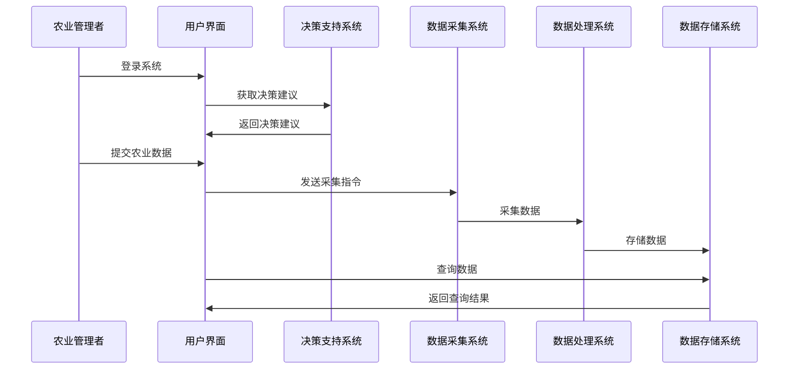
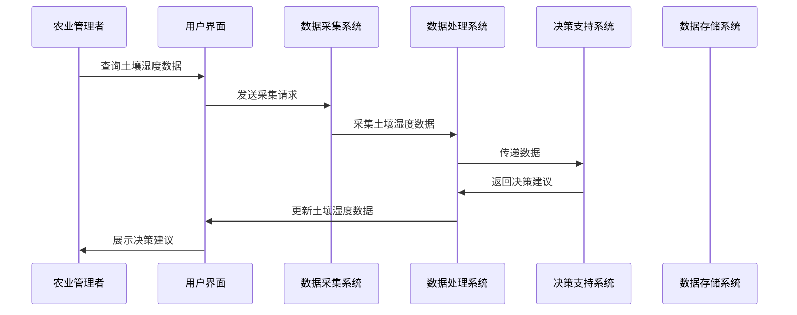

                 

### 摘要

本文旨在深入探讨提示词驱动的智能农业管理系统的设计与实现。智能农业管理系统是现代农业发展的关键，它通过集成先进的科技手段，如大数据、物联网和人工智能，实现农业生产的智能化、精准化和高效化。然而，当前智能农业管理系统面临诸多挑战，包括数据处理能力不足、技术集成与标准化问题以及农业劳动者的接受度等。

提示词作为人工智能领域的一项关键技术，其在智能农业管理中的潜在应用为解决这些问题提供了新的思路。本文首先介绍智能农业的定义、发展历程及意义，然后深入探讨提示词的概念、生成算法及其在农业管理中的应用。接下来，本文将详细介绍智能农业管理系统的架构设计，包括数据采集与处理、提示词生成与优化、决策支持系统等核心功能模块。同时，通过一个实际案例，本文展示了提示词驱动的智能农业管理系统的实现过程及其应用效果。

最后，本文将总结全文内容，提供最佳实践建议，并指出注意事项，同时推荐拓展阅读资源，以帮助读者进一步深入了解智能农业管理系统及相关技术。本文的结构紧凑，逻辑清晰，旨在为智能农业管理系统的研发与应用提供有力支持。

### 目录大纲设计思路与整体结构

为了确保本文的目录大纲既全面又逻辑清晰，我们首先对《提示词驱动的智能农业管理系统》这本书的核心内容进行了深入分析，并确定了整体结构的设计思路。整体设计思路如下：

1. **背景介绍**：首先，我们将介绍智能农业管理系统的重要性及其在现代农业生产中的应用背景。这部分内容将为后续章节的核心概念和原理讲解打下基础。

2. **核心概念与联系**：接下来，我们将定义并阐述书中涉及的核心概念，如提示词、智能农业管理、系统架构等。为了帮助读者更好地理解这些概念，我们将使用表格和Mermaid ER图等方式展现概念之间的关系，从而使读者能够直观地了解这些概念之间的内在联系。

3. **算法原理讲解**：本文将详细讲解书中所提到的算法原理，包括数学模型、公式，并通过Python代码和示例进行说明。这部分内容是本文的核心，旨在让读者深入理解提示词驱动的智能农业管理系统的工作原理。

4. **系统分析与架构设计方案**：我们将介绍智能农业管理系统的整体架构设计，包括系统功能设计、系统架构图、接口设计和系统交互序列图。这部分内容将帮助读者从宏观上了解智能农业管理系统的结构和运作方式。

5. **项目实战**：通过实际案例，本文将展示系统核心实现的步骤、代码解读、应用场景分析和详细讲解。这部分内容旨在通过实际操作，让读者了解提示词驱动的智能农业管理系统的具体应用。

6. **最佳实践 tips、小结、注意事项、拓展阅读等内容**：在全文的结尾，我们将对全书内容进行总结，并提供最佳实践建议，指出注意事项，同时推荐拓展阅读资源，以帮助读者在实际应用中更好地运用本文所介绍的技术。

### 完整目录大纲

#### 第一部分: 智能农业管理概述

#### 第1章: 智能农业管理的背景与意义

## 1.1 智能农业的定义与发展历程
### 1.1.1 传统农业向智能农业的演变
### 1.1.2 智能农业的发展现状
### 1.1.3 智能农业管理的重要性

## 1.2 智能农业面临的主要挑战
### 1.2.1 数据处理能力不足
### 1.2.2 技术集成与标准化问题
### 1.2.3 农业劳动者的接受度

## 1.3 提示词在智能农业中的应用
### 1.3.1 提示词的概念与作用
### 1.3.2 提示词在农业管理中的优势
### 1.3.3 提示词驱动的智能农业管理系统

## 1.4 本章小结

#### 第二部分: 核心概念与原理

#### 第2章: 提示词技术原理

## 2.1 提示词的定义与分类
### 2.1.1 提示词的基本概念
### 2.1.2 提示词的分类
### 2.1.3 提示词的使用场景

## 2.2 提示词生成算法
### 2.2.1 算法概述
### 2.2.2 常见算法介绍
### 2.2.3 提示词生成的挑战与解决方案

## 2.3 提示词在农业领域的应用
### 2.3.1 农业信息采集
### 2.3.2 农业决策支持
### 2.3.3 农业智能化生产

## 2.4 本章小结

#### 第3章: 智能农业管理系统架构设计

## 3.1 智能农业管理系统的构成
### 3.1.1 系统功能模块
### 3.1.2 系统架构概述
### 3.1.3 系统架构图（Mermaid ER图）

## 3.2 数据采集与处理
### 3.2.1 数据采集技术
### 3.2.2 数据预处理
### 3.2.3 数据存储与管理

## 3.3 提示词驱动的决策支持系统
### 3.3.1 决策支持系统概述
### 3.3.2 提示词生成与优化
### 3.3.3 决策过程

## 3.4 本章小结

#### 第4章: 系统分析与架构设计

## 4.1 系统功能设计
### 4.1.1 功能需求分析
### 4.1.2 功能模块设计
### 4.1.3 领域模型（Mermaid 类图）

## 4.2 系统架构设计
### 4.2.1 系统架构设计原则
### 4.2.2 系统架构图
### 4.2.3 系统模块间关系

## 4.3 系统接口设计
### 4.3.1 接口设计规范
### 4.3.2 接口实现
### 4.3.3 接口测试

## 4.4 系统交互设计
### 4.4.1 系统交互流程
### 4.4.2 系统交互序列图
### 4.4.3 系统交互仿真

## 4.5 本章小结

#### 第5章: 提示词驱动的智能农业管理系统实现

## 5.1 环境安装与配置
### 5.1.1 硬件与软件环境
### 5.1.2 系统安装与配置
### 5.1.3 系统调试

## 5.2 系统核心实现
### 5.2.1 数据采集与处理模块实现
### 5.2.2 提示词生成与优化模块实现
### 5.2.3 决策支持模块实现

## 5.3 代码解读与分析
### 5.3.1 代码结构分析
### 5.3.2 关键代码解读
### 5.3.3 代码优化建议

## 5.4 实际案例分析与讲解
### 5.4.1 案例背景
### 5.4.2 案例实现步骤
### 5.4.3 案例分析与讲解

## 5.5 本章小结

#### 第6章: 智能农业管理系统

### 目录大纲设计思路与整体结构

为了确保本文的目录大纲既全面又逻辑清晰，我们首先对《提示词驱动的智能农业管理系统》这本书的核心内容进行了深入分析，并确定了整体结构的设计思路。整体设计思路如下：

1. **背景介绍**：首先，我们将介绍智能农业管理系统的重要性及其在现代农业生产中的应用背景。这部分内容将为后续章节的核心概念和原理讲解打下基础。

2. **核心概念与联系**：接下来，我们将定义并阐述书中涉及的核心概念，如提示词、智能农业管理、系统架构等。为了帮助读者更好地理解这些概念，我们将使用表格和Mermaid ER图等方式展现概念之间的关系，从而使读者能够直观地了解这些概念之间的内在联系。

3. **算法原理讲解**：本文将详细讲解书中所提到的算法原理，包括数学模型、公式，并通过Python代码和示例进行说明。这部分内容是本文的核心，旨在让读者深入理解提示词驱动的智能农业管理系统的工作原理。

4. **系统分析与架构设计方案**：我们将介绍智能农业管理系统的整体架构设计，包括系统功能设计、系统架构图、接口设计和系统交互序列图。这部分内容将帮助读者从宏观上了解智能农业管理系统的结构和运作方式。

5. **项目实战**：通过实际案例，本文将展示系统核心实现的步骤、代码解读、应用场景分析和详细讲解。这部分内容旨在通过实际操作，让读者了解提示词驱动的智能农业管理系统的具体应用。

6. **最佳实践 tips、小结、注意事项、拓展阅读等内容**：在全文的结尾，我们将对全书内容进行总结，并提供最佳实践建议，指出注意事项，同时推荐拓展阅读资源，以帮助读者在实际应用中更好地运用本文所介绍的技术。

### 完整目录大纲

#### 第一部分: 智能农业管理概述

#### 第1章: 智能农业管理的背景与意义

## 1.1 智能农业的定义与发展历程
### 1.1.1 传统农业向智能农业的演变
### 1.1.2 智能农业的发展现状
### 1.1.3 智能农业管理的重要性

## 1.2 智能农业面临的主要挑战
### 1.2.1 数据处理能力不足
### 1.2.2 技术集成与标准化问题
### 1.2.3 农业劳动者的接受度

## 1.3 提示词在智能农业中的应用
### 1.3.1 提示词的概念与作用
### 1.3.2 提示词在农业管理中的优势
### 1.3.3 提示词驱动的智能农业管理系统

## 1.4 本章小结

#### 第二部分: 核心概念与原理

#### 第2章: 提示词技术原理

## 2.1 提示词的定义与分类
### 2.1.1 提示词的基本概念
### 2.1.2 提示词的分类
### 2.1.3 提示词的使用场景

## 2.2 提示词生成算法
### 2.2.1 算法概述
### 2.2.2 常见算法介绍
### 2.2.3 提示词生成的挑战与解决方案

## 2.3 提示词在农业领域的应用
### 2.3.1 农业信息采集
### 2.3.2 农业决策支持
### 2.3.3 农业智能化生产

## 2.4 本章小结

#### 第3章: 智能农业管理系统架构设计

## 3.1 智能农业管理系统的构成
### 3.1.1 系统功能模块
### 3.1.2 系统架构概述
### 3.1.3 系统架构图（Mermaid ER图）

## 3.2 数据采集与处理
### 3.2.1 数据采集技术
### 3.2.2 数据预处理
### 3.2.3 数据存储与管理

## 3.3 提示词驱动的决策支持系统
### 3.3.1 决策支持系统概述
### 3.3.2 提示词生成与优化
### 3.3.3 决策过程

## 3.4 本章小结

#### 第4章: 系统分析与架构设计

## 4.1 系统功能设计
### 4.1.1 功能需求分析
### 4.1.2 功能模块设计
### 4.1.3 领域模型（Mermaid 类图）

## 4.2 系统架构设计
### 4.2.1 系统架构设计原则
### 4.2.2 系统架构图
### 4.2.3 系统模块间关系

## 4.3 系统接口设计
### 4.3.1 接口设计规范
### 4.3.2 接口实现
### 4.3.3 接口测试

## 4.4 系统交互设计
### 4.4.1 系统交互流程
### 4.4.2 系统交互序列图
### 4.4.3 系统交互仿真

## 4.5 本章小结

#### 第5章: 提示词驱动的智能农业管理系统实现

## 5.1 环境安装与配置
### 5.1.1 硬件与软件环境
### 5.1.2 系统安装与配置
### 5.1.3 系统调试

## 5.2 系统核心实现
### 5.2.1 数据采集与处理模块实现
### 5.2.2 提示词生成与优化模块实现
### 5.2.3 决策支持模块实现

## 5.3 代码解读与分析
### 5.3.1 代码结构分析
### 5.3.2 关键代码解读
### 5.3.3 代码优化建议

## 5.4 实际案例分析与讲解
### 5.4.1 案例背景
### 5.4.2 案例实现步骤
### 5.4.3 案例分析与讲解

## 5.5 本章小结

#### 第6章: 智能农业管理系统

### 关键词

- 智能农业管理系统
- 提示词技术
- 决策支持系统
- 数据采集与处理
- 系统架构设计
- 项目实战

### 摘要

本文深入探讨了提示词驱动的智能农业管理系统的设计与实现。首先介绍了智能农业管理系统的重要性及其发展历程，然后详细讲解了提示词的概念、生成算法及其在农业管理中的应用。接着，本文介绍了智能农业管理系统的整体架构设计，包括系统功能设计、架构图、接口设计和系统交互序列图。通过实际案例展示，本文展示了系统的实现过程和应用效果。最后，本文总结了全文内容，提供了最佳实践建议，并指出注意事项，同时推荐拓展阅读资源，以帮助读者深入理解和应用智能农业管理系统。

----------------------------------------------------------------

## 1.1 智能农业的定义与发展历程

智能农业是指利用现代信息技术和人工智能技术，对农业生产进行智能化、精准化和高效化的管理。与传统农业相比，智能农业不仅能够提高农业生产的效率，还能显著提高农产品的质量和产量。智能农业的发展历程可以追溯到20世纪中叶，当时信息技术开始逐步渗透到农业生产中。以下是智能农业的发展历程及其重要里程碑：

### 1.1.1 传统农业向智能农业的演变

传统农业主要依赖人力和畜力，生产方式落后，劳动强度大，生产效率低。随着工业化进程的加快，农业也开始逐步机械化。20世纪60年代，全球掀起了一场“绿色革命”，通过引入高产品种、化肥和农药，大幅提高了农作物的产量。然而，这种生产方式对环境的破坏也日益严重。

20世纪80年代，信息技术开始进入农业领域，为农业生产带来了新的变革。计算机技术、传感器技术、通信技术等在农业中的应用，使得农业生产开始从经验型向科学型转变。这一阶段，农业自动化、精准农业和智能农业的概念逐渐被提出。

### 1.1.2 智能农业的发展现状

当前，智能农业已经成为现代农业发展的重要方向。在全球范围内，许多国家都在积极推进智能农业的发展。智能农业的应用领域主要包括：

1. **数据采集与处理**：通过传感器、无人机、物联网等技术，实现对土壤、水分、气象等数据的实时采集，并通过大数据分析和处理，为农业生产提供科学依据。

2. **精准农业**：利用卫星遥感、地理信息系统（GIS）等技术，对农田进行精细化管理，实现精准播种、施肥、灌溉和收获，提高资源利用效率。

3. **农业机械化**：通过智能化农机装备，实现农田耕作、播种、施肥、喷药、收割等环节的自动化操作，降低劳动强度，提高生产效率。

4. **农业物联网**：通过构建农业物联网系统，实现农业生产过程中的实时监控和远程管理，提高生产效率和农产品质量。

5. **农业电子商务**：利用互联网和电子商务平台，实现农产品的在线销售和供应链管理，降低营销成本，提高市场竞争力。

### 1.1.3 智能农业管理的重要性

智能农业管理的重要性主要体现在以下几个方面：

1. **提高农业生产效率**：通过智能化技术，可以实现精准施肥、精准灌溉和精准收获，减少资源浪费，提高农作物产量。

2. **保障农产品质量安全**：智能农业管理系统能够实时监测土壤、水分和气象等环境参数，及时发现并解决潜在问题，确保农产品质量安全。

3. **降低农业生产成本**：通过自动化、智能化技术，可以降低劳动强度和生产成本，提高农业经济效益。

4. **促进农业可持续发展**：智能农业管理系统能够实现资源的高效利用和环境的保护，促进农业的可持续发展。

5. **提升农业科技水平**：智能农业管理系统能够集成多种先进技术，推动农业科技的进步和创新。

总之，智能农业管理系统不仅是现代农业发展的重要方向，也是提升国家粮食安全和保障农产品质量安全的关键手段。随着科技的不断进步，智能农业管理系统将越来越普及，为全球农业的可持续发展做出更大贡献。

----------------------------------------------------------------

## 1.2 智能农业面临的主要挑战

尽管智能农业管理系统展示了巨大的潜力和优势，但在实际应用过程中仍面临诸多挑战，这些挑战限制了智能农业的进一步发展。以下是智能农业面临的主要挑战及其影响：

### 1.2.1 数据处理能力不足

智能农业管理系统依赖于大量数据采集和分析，包括土壤湿度、气象数据、农作物生长状态等。然而，目前许多农业企业和农民的数据处理能力有限，难以有效地处理和分析这些数据。数据处理能力的不足主要体现在以下几个方面：

1. **硬件设备限制**：许多农业地区缺乏先进的硬件设备，如高性能计算机、传感器和通信设备，导致数据采集和传输过程受到限制。

2. **数据分析技术不足**：数据处理和挖掘需要复杂的技术手段，如大数据分析和机器学习算法。然而，许多农业从业者对这些技术了解不足，缺乏必要的技术培训。

3. **数据存储和管理问题**：大量农业数据需要存储和管理，但许多农业企业和农民没有足够的数据存储和管理能力，可能导致数据丢失或无法有效利用。

这些数据处理能力的不足限制了智能农业管理系统的实际应用，影响了农业生产的精准化和智能化。

### 1.2.2 技术集成与标准化问题

智能农业管理系统涉及多种技术的集成，如物联网、大数据、人工智能和地理信息系统等。然而，这些技术之间缺乏统一的标准化协议，导致系统集成困难，影响系统的稳定性和互操作性。具体问题包括：

1. **数据格式不统一**：不同技术来源的数据格式不一致，难以进行有效整合和分析。

2. **接口兼容性问题**：不同系统之间的接口设计不兼容，导致数据传输和共享困难。

3. **系统集成难度大**：系统集成需要考虑多种技术的兼容性和稳定性，对系统开发者和维护者提出了较高的要求。

技术集成与标准化问题的存在，使得智能农业管理系统的实施和维护成本增加，限制了其广泛应用。

### 1.2.3 农业劳动者的接受度

智能农业管理系统的推广和应用，离不开农业劳动者的积极参与。然而，当前许多农业劳动者对智能技术的接受度较低，存在以下问题：

1. **技术认知不足**：许多农业劳动者对智能技术的了解不足，对其作用和效果缺乏信心，难以主动接受和使用智能农业管理系统。

2. **操作难度大**：智能农业管理系统通常涉及复杂的技术操作，对农业劳动者的技能要求较高，部分农民可能难以掌握。

3. **传统观念根深蒂固**：部分农民对传统农业有深厚的情感和依赖，认为智能农业管理系统是“高科技的奢侈品”，难以接受这种新的生产方式。

农业劳动者接受度的问题，制约了智能农业管理系统的推广和普及，影响了其推广应用效果。

### 1.2.4 农业资源短缺

智能农业管理系统的实施，需要大量的资源投入，包括资金、技术、设备和人才等。然而，许多农业地区资源匮乏，难以满足智能农业发展需求。具体问题包括：

1. **资金短缺**：智能农业管理系统的建设成本较高，许多农业企业和农民难以承担。

2. **技术资源不足**：智能农业需要大量技术支持，包括软件、硬件和算法等，但许多农业地区缺乏这些技术资源。

3. **人才短缺**：智能农业需要专业人才进行系统设计、开发和维护，但农业地区人才吸引力不足，难以吸引和留住专业人才。

农业资源短缺的问题，使得智能农业管理系统的实施面临较大的困难，影响了其推广和应用。

综上所述，智能农业管理系统在实际应用过程中面临诸多挑战。解决这些问题，需要政府、企业和科研机构等多方面的共同努力，推动智能农业的可持续发展。

----------------------------------------------------------------

## 1.3 提示词在智能农业中的应用

提示词（Prompt Word）作为人工智能领域的一项关键技术，其在智能农业管理中的应用为解决上述挑战提供了新的思路。下面我们将详细探讨提示词的概念、作用及其在智能农业管理中的优势。

### 1.3.1 提示词的概念与作用

提示词是指在特定场景下，为引导用户或系统执行特定任务而提供的一组关键词或短语。在智能农业管理中，提示词主要用于指导农业数据采集、处理和分析过程，提高系统的智能化和自动化水平。具体作用包括：

1. **数据采集**：通过提示词，可以引导传感器设备采集特定的农业数据，如土壤湿度、温度、光照等。

2. **数据处理**：提示词可以帮助系统对采集到的数据进行筛选、分类和处理，从而提取有用的信息。

3. **决策支持**：提示词可以指导智能农业管理系统进行农业生产的决策支持，如施肥、灌溉、病虫害防治等。

4. **交互控制**：提示词可以用于人与系统之间的交互控制，如通过语音、文字等方式与智能农业管理系统进行沟通。

### 1.3.2 提示词在农业管理中的优势

1. **提高数据采集效率**：提示词能够明确指示传感器采集的数据类型和范围，避免数据冗余和无效采集，提高数据采集的效率和质量。

2. **简化数据处理过程**：提示词可以帮助系统快速定位和处理关键数据，简化数据处理过程，减少数据处理的时间和经济成本。

3. **增强决策准确性**：通过提示词的引导，智能农业管理系统可以更准确地分析和预测农业生产的趋势和问题，提高决策的准确性。

4. **降低操作难度**：提示词的引导使得智能农业管理系统的操作更加简单直观，降低了农业劳动者的操作难度，提高了系统的易用性。

5. **提高系统智能化水平**：提示词的应用使得智能农业管理系统能够更好地理解和适应农业生产环境，提高系统的智能化水平。

### 1.3.3 提示词驱动的智能农业管理系统

提示词驱动的智能农业管理系统是基于提示词技术构建的智能农业管理系统，其核心思想是通过提示词引导系统的各项功能模块，实现农业生产的智能化和自动化。具体包括以下功能模块：

1. **数据采集模块**：通过提示词，指导传感器设备采集农业所需的数据。

2. **数据处理模块**：对采集到的数据进行筛选、分类和处理，提取有用的信息。

3. **决策支持模块**：通过提示词，指导系统进行农业生产的决策支持，如施肥、灌溉、病虫害防治等。

4. **交互控制模块**：通过提示词，实现人与系统之间的交互控制，提高系统的易用性。

总之，提示词技术在智能农业管理中的应用，为解决智能农业面临的挑战提供了新的解决方案。通过提高数据采集效率、简化数据处理过程、增强决策准确性、降低操作难度和提高系统智能化水平，提示词驱动的智能农业管理系统有望推动现代农业的可持续发展。

----------------------------------------------------------------

## 1.4 本章小结

本章首先介绍了智能农业的定义、发展历程及其意义，详细探讨了智能农业管理系统的重要性。接着，我们分析了智能农业面临的主要挑战，包括数据处理能力不足、技术集成与标准化问题以及农业劳动者的接受度。通过引入提示词技术，我们展示了其在智能农业管理中的优势和应用前景。提示词不仅提高了数据采集和处理的效率，简化了农业生产决策过程，还降低了系统的操作难度，增强了系统的智能化水平。

综上所述，智能农业管理系统是现代农业发展的关键，而提示词技术的应用为解决智能农业面临的问题提供了新的思路和解决方案。通过本章的介绍，我们为后续章节的核心概念和原理讲解奠定了基础，也为读者深入了解智能农业管理系统和提示词技术提供了指导。希望读者在接下来的章节中能够进一步理解智能农业管理系统的设计和实现。

----------------------------------------------------------------

## 2.1 提示词的定义与分类

提示词作为智能农业管理系统的核心组成部分，其定义和分类对于理解系统的运作至关重要。提示词可以被视为一种用于引导系统执行特定任务的关键词汇或短语，它能够帮助智能农业管理系统高效地采集、处理和分析农业数据。在本文中，我们将详细介绍提示词的定义、分类以及其在不同应用场景中的使用。

### 2.1.1 提示词的基本概念

提示词（Prompt Word）是指为引导用户或系统执行特定任务而提供的一组关键词或短语。在智能农业管理系统中，提示词主要用于指示数据采集、处理和分析的方向。具体来说，提示词的基本概念包括以下几个方面：

1. **关键词性**：提示词需要具有明确的意义和指向性，能够清晰表达系统需要执行的任务。

2. **灵活性**：提示词需要具有一定的灵活性，能够适应不同农业环境和需求。

3. **层次性**：提示词可以按照不同层次进行分类，如一级提示词、二级提示词等，以便系统进行分层管理和执行。

4. **动态性**：提示词需要具备动态调整的能力，能够根据实际情况和环境变化进行优化和更新。

### 2.1.2 提示词的分类

根据不同的分类标准，提示词可以分为多种类型。以下是几种常见的分类方式：

1. **按功能分类**：

   - **数据采集类**：这类提示词主要用于指导传感器设备采集特定的农业数据，如“土壤湿度”、“气温”、“光照”等。
   
   - **数据处理类**：这类提示词主要用于指导系统对采集到的数据进行筛选、分类和处理，如“数据清洗”、“数据排序”、“数据聚合”等。
   
   - **决策支持类**：这类提示词主要用于指导系统进行农业生产的决策支持，如“施肥建议”、“灌溉方案”、“病虫害防治策略”等。
   
   - **交互控制类**：这类提示词主要用于人与系统之间的交互控制，如“启动”、“停止”、“查询”等。

2. **按层次分类**：

   - **一级提示词**：这类提示词通常是最基本的，用于指导系统执行基础任务，如“开始采集”、“结束采集”等。
   
   - **二级提示词**：这类提示词是对一级提示词的进一步细化，用于指导系统执行更具体的任务，如“土壤湿度高”、“气温过高”等。
   
   - **三级提示词**：这类提示词是对二级提示词的进一步细化，用于指导系统执行更加具体的任务，如“施肥量增加”、“灌溉时间调整”等。

3. **按使用场景分类**：

   - **田间管理类**：这类提示词主要用于田间作物的管理，如“播种”、“施肥”、“灌溉”、“病虫害防治”等。
   
   - **仓储管理类**：这类提示词主要用于农产品的仓储管理，如“仓储环境监测”、“库存管理”、“出库管理”等。
   
   - **市场分析类**：这类提示词主要用于农产品市场的分析，如“市场行情”、“价格走势”、“供需分析”等。

### 2.1.3 提示词的使用场景

提示词在智能农业管理中的使用场景非常广泛，以下是几种典型的使用场景：

1. **数据采集**：在智能农业管理系统中，提示词可以指导传感器设备采集土壤湿度、气温、光照等数据。例如，当系统收到“采集土壤湿度”的提示词时，传感器设备会自动启动，开始采集土壤湿度数据。

2. **数据处理**：提示词可以帮助系统对采集到的数据进行处理。例如，当系统收到“数据清洗”的提示词时，会启动数据清洗模块，对采集到的数据进行筛选、去噪和处理。

3. **决策支持**：提示词可以指导系统进行农业生产的决策支持。例如，当系统收到“施肥建议”的提示词时，会启动决策支持模块，根据土壤湿度、气温等数据，生成施肥建议。

4. **交互控制**：提示词可以用于人与系统之间的交互控制。例如，当农民通过语音助手发送“启动灌溉”的提示词时，系统会自动启动灌溉设备，开始灌溉作业。

总之，提示词作为智能农业管理系统的核心组成部分，其在不同应用场景中的使用为系统的高效运作提供了重要保障。通过分类和场景化设计，提示词能够更好地满足智能农业管理的需求，推动现代农业的智能化发展。

----------------------------------------------------------------

## 2.2 提示词生成算法

在智能农业管理系统中，提示词的生成是一个关键环节。有效的提示词生成算法能够提高系统的自动化和智能化水平，从而更好地支持农业生产决策。本节将详细介绍提示词生成算法的概述、常见算法介绍以及提示词生成的挑战与解决方案。

### 2.2.1 算法概述

提示词生成算法是指用于自动生成提示词的一类算法，其目标是在特定场景下，根据系统需求和农业数据特征，生成具有明确指向性的提示词。提示词生成算法通常包含以下几个步骤：

1. **数据预处理**：对采集到的农业数据进行清洗、归一化等处理，为后续生成算法提供高质量的数据基础。

2. **特征提取**：从预处理后的数据中提取关键特征，如土壤湿度、气温、光照等，这些特征将用于生成提示词。

3. **提示词生成**：根据提取的特征，使用特定的算法生成提示词。常见的算法包括基于规则的方法、机器学习方法、深度学习方法等。

4. **提示词优化**：对生成的提示词进行优化，确保其能够准确、有效地指导系统执行任务。

### 2.2.2 常见算法介绍

以下是几种常见的提示词生成算法：

1. **基于规则的方法**：

   基于规则的方法是通过预定义的规则库来生成提示词。这种方法简单直观，实现成本低，但规则库的构建和维护需要大量的人力和时间。常见的规则包括阈值规则、逻辑规则等。

   - **阈值规则**：根据预先设定的阈值，当数据超过或低于某个阈值时，生成相应的提示词。例如，当土壤湿度低于20%时，生成“土壤干旱，需灌溉”的提示词。

   - **逻辑规则**：结合多个数据特征，通过逻辑运算生成提示词。例如，当土壤湿度低于20%且气温高于35℃时，生成“高温干旱，需立即灌溉”的提示词。

2. **机器学习方法**：

   机器学习方法通过训练大量数据，学习生成提示词的规律。这种方法具有较强的自适应能力，能够根据实际需求调整提示词生成策略。常见的机器学习方法包括决策树、支持向量机、随机森林等。

   - **决策树**：根据数据特征和阈值，构建一棵决策树，每个节点生成一个提示词。例如，根节点可以是“土壤湿度”，分支可以是“低于20%”或“高于20%”，对应的叶子节点生成“土壤干旱，需灌溉”或“土壤湿润，无需灌溉”的提示词。

   - **支持向量机（SVM）**：通过将数据映射到高维空间，找到最佳的超平面，用于分类生成提示词。例如，当数据点位于超平面一侧时，生成“土壤干旱，需灌溉”的提示词。

   - **随机森林**：通过构建多个决策树，结合预测结果生成提示词。这种方法具有较好的鲁棒性和泛化能力。

3. **深度学习方法**：

   深度学习方法通过构建复杂的神经网络模型，学习生成提示词的内在规律。这种方法能够自动提取高层次的抽象特征，具有较强的表示能力。常见的深度学习模型包括卷积神经网络（CNN）、循环神经网络（RNN）和长短期记忆网络（LSTM）等。

   - **卷积神经网络（CNN）**：通过卷积层提取空间特征，用于生成提示词。例如，通过分析土壤湿度图像，生成“土壤干旱，需灌溉”的提示词。

   - **循环神经网络（RNN）**：通过递归方式处理序列数据，用于生成时间序列提示词。例如，通过分析一段时间内的气温数据，生成“气温持续升高，需加强灌溉”的提示词。

   - **长短期记忆网络（LSTM）**：通过引入门控机制，解决RNN的梯度消失问题，用于生成长期依赖的提示词。例如，通过分析多年的气候变化数据，生成“未来一年可能干旱，需提前准备灌溉设施”的提示词。

### 2.2.3 提示词生成的挑战与解决方案

提示词生成算法在实际应用中面临诸多挑战，需要通过有效的解决方案来克服。以下是几个主要挑战及相应的解决方案：

1. **数据稀疏**：

   农业数据通常存在数据稀疏问题，即某些特征数据缺失或样本数量较少。这会导致提示词生成算法的性能下降。解决方案包括：

   - **数据增强**：通过模拟和生成虚拟数据，增加样本数量，提高数据密度。
   
   - **迁移学习**：利用已有的大量数据集，通过迁移学习方法，提高新数据集上的提示词生成能力。

2. **噪声干扰**：

   农业数据中常包含噪声和干扰因素，如传感器误差、环境变化等。这些噪声会影响提示词的准确性。解决方案包括：

   - **数据清洗**：通过过滤和清洗数据，去除噪声和异常值，提高数据质量。
   
   - **鲁棒算法**：使用具有较强抗噪能力的算法，如随机森林、LSTM等，提高提示词生成的鲁棒性。

3. **复杂环境适应性**：

   农业环境复杂多变，不同地区的气候、土壤、作物等特征差异较大。提示词生成算法需要具备良好的适应性。解决方案包括：

   - **区域化模型**：根据不同地区的特点，构建针对性的提示词生成模型，提高适应性。
   
   - **自适应算法**：通过实时调整算法参数，适应环境变化，提高提示词生成的准确性。

4. **实时性要求**：

   智能农业管理系统需要实时生成提示词，以指导农业生产决策。提示词生成算法需要具备较高的实时性。解决方案包括：

   - **并行计算**：通过分布式计算和并行处理，提高提示词生成的速度。
   
   - **缓存策略**：通过缓存预处理数据，减少实时计算的负荷，提高实时性。

通过解决上述挑战，提示词生成算法能够在智能农业管理系统中发挥更大的作用，推动农业生产的智能化和精准化。

----------------------------------------------------------------

## 2.3 提示词在农业领域的应用

提示词技术在农业领域的应用正逐渐得到广泛关注和认可，其优势在于能够显著提高农业生产的效率、质量和可持续性。以下是提示词在农业信息采集、决策支持以及智能化生产等方面的具体应用。

### 2.3.1 农业信息采集

农业信息采集是智能农业管理系统的核心环节，而提示词技术在其中起到了关键作用。通过提示词，传感器能够准确、高效地采集所需的数据。具体应用包括：

1. **土壤监测**：提示词可以指导土壤传感器采集土壤湿度、酸碱度、温度等数据，为精准施肥提供依据。例如，当提示词“土壤湿度监测”发出时，传感器会自动采集并上传土壤湿度数据。

2. **气象数据采集**：通过提示词，气象传感器可以实时监测气象参数，如气温、湿度、风速、降雨量等，为灌溉和病虫害防治提供支持。例如，当提示词“气象数据采集”发出时，传感器会自动启动，开始采集并上传当前气象数据。

3. **作物生长监测**：提示词可以帮助传感器监测作物的生长状态，如叶绿素含量、光合作用效率等。例如，当提示词“作物生长监测”发出时，传感器会分析并上传相关数据，以便管理人员及时调整农业生产策略。

### 2.3.2 农业决策支持

提示词技术在农业决策支持中发挥了重要作用，通过分析采集到的农业数据，提示词可以生成一系列决策建议，帮助农民做出科学决策。具体应用包括：

1. **精准施肥**：根据土壤湿度、酸碱度等数据，提示词可以生成施肥建议，指导农民进行精准施肥。例如，当提示词“施肥建议”生成时，系统会根据土壤湿度等数据，推荐合适的施肥量和施肥时间。

2. **灌溉策略**：通过气象数据、土壤湿度等数据，提示词可以生成灌溉建议，优化灌溉策略。例如，当提示词“灌溉建议”生成时，系统会根据气象预报和土壤湿度数据，推荐最佳的灌溉时间和灌溉量。

3. **病虫害防治**：提示词可以分析作物生长状态和气象数据，生成病虫害防治建议。例如，当提示词“病虫害防治建议”生成时，系统会根据当前作物状态和气象数据，推荐防治措施。

### 2.3.3 农业智能化生产

提示词技术不仅在农业信息采集和决策支持中发挥作用，还广泛应用于农业智能化生产，通过自动化和智能化技术，提高农业生产效率。具体应用包括：

1. **智能农机管理**：通过提示词，可以实现对智能农机设备的监控和管理，提高农机使用效率。例如，当提示词“智能农机监控”发出时，系统会自动启动监控功能，实时监测农机设备的工作状态。

2. **自动化灌溉系统**：提示词技术可以指导自动化灌溉系统的运行，根据土壤湿度、气象数据等，自动调整灌溉时间和水量。例如，当提示词“自动化灌溉”发出时，灌溉系统会自动启动，根据提示词生成的灌溉方案进行灌溉。

3. **智能农场管理**：通过提示词，可以实现对整个农场的智能化管理，包括生产计划、资源分配、质量监控等。例如，当提示词“智能农场管理”发出时，系统会自动生成生产计划，分配资源，并实时监控生产过程。

总之，提示词技术在农业领域的广泛应用，为农业生产带来了前所未有的变革。通过精确的信息采集、科学的决策支持和智能化的生产管理，提示词技术极大地提高了农业生产的效率、质量和可持续性，推动了现代农业的发展。

### 2.4 本章小结

本章详细介绍了提示词的定义与分类，阐述了提示词生成算法的原理和常见算法，并分析了提示词在农业领域的具体应用。提示词作为智能农业管理系统的重要组成部分，通过精确的信息采集、科学的决策支持和智能化的生产管理，显著提高了农业生产的效率和质量。接下来，我们将进一步探讨智能农业管理系统架构设计的核心概念，包括数据采集与处理、提示词生成与优化以及决策支持系统，为读者全面理解智能农业管理系统的设计和实现提供深入的理论基础。

----------------------------------------------------------------

## 3.1 智能农业管理系统的构成

智能农业管理系统是一个复杂且功能多样的系统，它通过集成多种先进技术，实现对农业生产的智能化、精准化和高效化管理。为了更好地理解智能农业管理系统的整体构成，我们将从系统功能模块、架构概述和系统架构图三个方面进行详细介绍。

### 3.1.1 系统功能模块

智能农业管理系统通常包括以下几个核心功能模块：

1. **数据采集模块**：负责从各种传感器和设备中采集农业数据，如土壤湿度、气象数据、作物生长状态等。

2. **数据处理模块**：负责对采集到的数据进行清洗、过滤和预处理，以便进行进一步分析和处理。

3. **数据存储模块**：负责存储和管理采集到的数据，确保数据的安全性和可追溯性。

4. **决策支持模块**：基于采集和处理后的数据，提供农业生产决策支持，如施肥、灌溉、病虫害防治等。

5. **监控与预警模块**：实时监控农业生产环境，及时发现异常情况并发出预警，如干旱、病虫害爆发等。

6. **用户交互模块**：提供用户界面和交互功能，方便用户与系统进行沟通和操作。

### 3.1.2 系统架构概述

智能农业管理系统的架构设计需要综合考虑系统的功能性、可扩展性、稳定性和性能。一个典型的智能农业管理系统架构通常包括以下几个层次：

1. **数据层**：包括传感器、数据采集设备和存储设备等，负责数据的原始采集和存储。

2. **数据处理层**：包括数据处理引擎、数据清洗和预处理工具等，负责对采集到的数据进行处理和分析。

3. **应用层**：包括核心功能模块，如决策支持系统、监控与预警系统等，负责提供农业管理和决策支持。

4. **表示层**：包括用户界面和交互模块，负责与用户进行交互，展示系统功能和数据。

### 3.1.3 系统架构图

为了帮助读者更直观地理解智能农业管理系统的构成和运作方式，我们将使用Mermaid ER图来展示系统架构。以下是智能农业管理系统架构的Mermaid ER图：

```mermaid
erDiagram
    DataLayer ||--|{ ProcessingLayer : 数据处理 }
    DataLayer ||--|{ StorageLayer : 数据存储 }
    ProcessingLayer ||--|{ DecisionSupportLayer : 决策支持 }
    ProcessingLayer ||--|{ MonitoringAndWarningLayer : 监控与预警 }
    ApplicationLayer ||--|{ UserInterfaceLayer : 用户交互 }
```

在这个架构图中：

- **DataLayer**（数据层）包括传感器和数据采集设备，负责数据的原始采集。
- **ProcessingLayer**（数据处理层）包括数据处理引擎和数据清洗工具，负责对采集到的数据进行处理和分析。
- **StorageLayer**（数据存储层）负责存储和管理采集到的数据。
- **DecisionSupportLayer**（决策支持层）基于处理后的数据，提供农业生产决策支持。
- **MonitoringAndWarningLayer**（监控与预警层）负责实时监控农业生产环境，并发出预警。
- **ApplicationLayer**（应用层）包括用户界面和交互模块，负责与用户进行交互。

通过这个架构图，我们可以清晰地看到智能农业管理系统各功能模块之间的相互关系，以及数据在系统中的流动和处理过程。

### 3.1.4 本章小结

通过对智能农业管理系统的构成和架构的详细分析，我们了解到系统功能模块的多样性和系统架构的层次化设计。智能农业管理系统通过集成多种先进技术，实现对农业生产的全面管理和智能决策。接下来，我们将进一步探讨数据采集与处理、提示词生成与优化、决策支持系统等核心模块的实现和设计，为读者全面理解智能农业管理系统提供更深入的视角。

----------------------------------------------------------------

## 3.2 数据采集与处理

数据采集与处理是智能农业管理系统的核心环节，它直接决定了系统的准确性和实用性。为了实现农业数据的精准采集和高效处理，我们需要从数据采集技术、数据预处理和数据存储与管理三个方面进行详细讨论。

### 3.2.1 数据采集技术

智能农业管理系统需要采集多种类型的农业数据，包括土壤湿度、气象数据、作物生长状态等。数据采集技术的选择和性能直接影响到系统的可靠性。以下是几种常见的数据采集技术：

1. **传感器技术**：传感器是数据采集的核心设备，能够实时监测农田环境参数。常见的传感器包括土壤湿度传感器、气象传感器、作物生长传感器等。这些传感器通过无线或有线方式与系统连接，将实时数据传输到数据处理模块。

2. **遥感技术**：遥感技术利用卫星或无人机获取农田的图像和光谱数据，通过对这些数据的分析和处理，可以得到农田的土壤湿度、植被覆盖度、病虫害情况等信息。

3. **物联网技术**：物联网技术通过将各种传感器设备连接到互联网，实现对农田的实时监控和管理。物联网技术不仅能够实现数据的高效采集和传输，还能通过智能算法进行实时分析和预测。

4. **移动设备技术**：移动设备（如智能手机、平板电脑）可以用于农业数据的采集和传输。通过特定的应用程序，农民可以实时记录农田信息，并将数据上传到管理系统。

### 3.2.2 数据预处理

数据预处理是数据采集后的一项重要工作，它包括数据的清洗、过滤、归一化和特征提取等步骤。有效的数据预处理能够提高数据的质量，为后续的分析和处理提供可靠的数据基础。以下是数据预处理的主要步骤：

1. **数据清洗**：数据清洗是去除数据中的噪声和异常值的过程。常见的方法包括去除重复数据、填补缺失值、去除离群点等。例如，当土壤湿度传感器采集的数据中出现异常值时，可以通过统计方法将其去除。

2. **数据过滤**：数据过滤是按照特定的条件对数据进行筛选，只保留符合要求的数据。例如，在分析作物生长状态时，可能需要过滤掉一些不符合种植标准的样本数据。

3. **数据归一化**：数据归一化是将不同单位或范围的数据转换成统一的尺度，以便进行后续分析。常见的方法包括最小-最大归一化和z-score归一化。

4. **特征提取**：特征提取是从原始数据中提取出对分析任务有用的特征，减少数据维度，提高模型的性能。例如，从土壤湿度、气温等数据中提取出与作物生长状态相关的关键特征。

### 3.2.3 数据存储与管理

数据存储与管理是确保数据安全、可靠和可访问的重要环节。以下是一些常见的数据存储与管理方法：

1. **关系型数据库**：关系型数据库（如MySQL、PostgreSQL）适合存储结构化数据，通过表和关系进行数据组织和管理。例如，可以使用关系型数据库存储土壤湿度、气象数据等。

2. **非关系型数据库**：非关系型数据库（如MongoDB、Cassandra）适合存储大规模的、非结构化或半结构化数据。非关系型数据库具有高扩展性和灵活性，适合存储物联网设备采集的海量数据。

3. **数据仓库**：数据仓库是一种用于存储大量历史数据，并提供数据分析和报表功能的系统。数据仓库通常包含多种数据源，通过对数据的整合和分析，为企业决策提供支持。

4. **数据湖**：数据湖是一种存储大量原始数据的系统，它不涉及数据结构化，允许不同类型的数据以原始格式存储。数据湖适用于大规模数据处理和实时分析。

5. **数据安全和隐私**：数据存储和管理过程中，需要确保数据的安全和隐私。常见的方法包括数据加密、访问控制和数据备份等。例如，可以使用SSL/TLS加密传输数据，使用身份验证和访问控制策略保护数据库，定期备份数据以防止数据丢失。

通过合理的数据采集、预处理和存储与管理，智能农业管理系统能够确保数据的高质量，为后续的决策支持和优化提供坚实的基础。

### 3.3 提示词驱动的决策支持系统

决策支持系统（DSS）是智能农业管理系统的核心组成部分，它通过分析农业数据，提供科学、有效的决策支持。提示词驱动的决策支持系统利用提示词技术，实现更加精准和高效的决策过程。以下是决策支持系统的概述、提示词生成与优化，以及决策过程的详细说明。

#### 3.3.1 决策支持系统概述

决策支持系统是一种辅助农业管理者进行决策的智能化系统，它通过采集和分析农业数据，提供定量和定性分析结果，帮助管理者做出更加科学和合理的决策。决策支持系统的主要功能包括：

1. **数据采集与整合**：从多种数据源（如传感器、遥感、物联网等）采集农业数据，并进行数据整合，确保数据的一致性和完整性。

2. **数据分析与处理**：对采集到的农业数据进行分析和处理，提取关键特征和指标，为决策提供数据支持。

3. **模型构建与优化**：利用机器学习、深度学习等算法，构建和优化预测模型，提高决策的准确性和效率。

4. **决策支持**：基于分析结果和预测模型，提供具体的决策建议，如施肥量、灌溉策略、病虫害防治方案等。

5. **用户界面**：提供友好的用户界面，方便农业管理者与系统进行交互，查看分析结果和决策建议。

#### 3.3.2 提示词生成与优化

提示词生成是决策支持系统的重要环节，它通过关键词或短语引导系统执行特定任务，提高决策过程的自动化和智能化水平。以下是提示词生成与优化的详细说明：

1. **提示词生成算法**：

   - **基于规则的方法**：通过预定义的规则库，根据数据特征生成提示词。例如，当土壤湿度低于某个阈值时，生成“土壤干旱，需灌溉”的提示词。

   - **机器学习方法**：通过训练大量农业数据，学习生成提示词的规律。常见的方法包括决策树、支持向量机、随机森林等。

   - **深度学习方法**：通过构建复杂的神经网络模型，自动提取数据特征并生成提示词。常见的方法包括卷积神经网络（CNN）、循环神经网络（RNN）和长短期记忆网络（LSTM）等。

2. **提示词优化**：

   - **动态调整**：根据实时数据和环境变化，动态调整提示词的生成策略，提高决策的实时性和准确性。

   - **优化参数**：通过优化算法参数，提高提示词生成的质量和效率。例如，可以使用交叉验证和网格搜索等方法，选择最优的参数组合。

   - **反馈机制**：引入用户反馈机制，根据实际决策效果对提示词生成算法进行优化。例如，当用户对生成的决策建议不满意时，可以调整算法参数，生成更符合实际需求的提示词。

#### 3.3.3 决策过程

决策支持系统的核心是决策过程，它通过提示词的引导，实现从数据采集、分析到决策建议的完整流程。以下是决策过程的详细说明：

1. **数据采集**：通过传感器、遥感等设备，实时采集农田的土壤湿度、气象数据、作物生长状态等关键数据。

2. **数据预处理**：对采集到的数据进行清洗、过滤和归一化等预处理操作，确保数据的质量和一致性。

3. **特征提取**：从预处理后的数据中提取关键特征，如土壤湿度、气温、光照等，为后续分析提供基础。

4. **模型构建与优化**：利用机器学习、深度学习等算法，构建预测模型，并对模型进行优化，提高预测的准确性和稳定性。

5. **提示词生成**：根据实时数据和预测模型，生成具体的提示词。例如，当土壤湿度低于20%时，生成“土壤干旱，需灌溉”的提示词。

6. **决策建议**：结合提示词，生成具体的决策建议。例如，根据“土壤干旱，需灌溉”的提示词，生成“立即开启灌溉系统，灌溉量为XX升/亩”的决策建议。

7. **用户交互**：通过用户界面，将决策建议展示给农业管理者，并允许用户进行交互，确认或调整决策建议。

通过提示词驱动的决策支持系统，农业管理者能够更加高效、准确地做出决策，提高农业生产的效率和收益。同时，系统的动态调整和反馈机制，使得决策过程能够不断优化，适应不断变化的农业生产环境。

### 3.4 本章小结

本章详细介绍了智能农业管理系统的数据采集与处理、决策支持系统以及提示词生成与优化。通过合理的数据采集、预处理和存储，确保了数据的高质量和一致性。决策支持系统通过提示词的引导，实现了从数据采集、分析到决策建议的完整流程，提高了农业生产的智能化水平。接下来，我们将进一步探讨智能农业管理系统的系统功能设计和架构设计，为读者全面理解智能农业管理系统的设计和实现提供深入的视角。

----------------------------------------------------------------

## 4.1 系统功能设计

系统功能设计是智能农业管理系统架构设计中的关键环节，它决定了系统的实用性、易用性和扩展性。在本节中，我们将详细讨论系统功能设计的功能需求分析、功能模块设计和领域模型（Mermaid 类图）的构建，以帮助读者更好地理解系统功能的实现和架构设计。

### 4.1.1 功能需求分析

功能需求分析是系统功能设计的起点，它旨在明确系统需要实现哪些功能，以及这些功能的具体需求和目标。以下是智能农业管理系统的主要功能需求：

1. **数据采集与传输**：系统需要能够从各种传感器和设备中采集农业数据，如土壤湿度、气象数据、作物生长状态等。同时，数据需要能够实时传输到系统中进行处理和分析。

2. **数据处理与存储**：系统需要具备数据处理功能，包括数据清洗、过滤、归一化、特征提取等。此外，系统还需要能够将处理后的数据存储在数据库中，以便进行后续分析和查询。

3. **决策支持**：系统需要提供决策支持功能，包括根据实时数据和预测模型生成具体的农业管理建议，如施肥量、灌溉策略、病虫害防治方案等。

4. **监控与预警**：系统需要具备实时监控功能，能够监测农田的土壤湿度、气象数据等关键指标。当检测到异常情况时，系统需要能够发出预警信号，提醒农业管理者采取相应措施。

5. **用户交互**：系统需要提供友好的用户界面，方便农业管理者与系统进行交互。用户界面应能够展示实时数据、决策建议和预警信息，并支持用户对系统进行配置和管理。

6. **系统配置与管理**：系统需要支持用户对传感器、数据采集设备、决策模型等进行配置和管理。例如，用户可以设置传感器的采集频率、数据存储周期等参数，以及调整决策模型的参数。

### 4.1.2 功能模块设计

根据功能需求分析，智能农业管理系统可以划分为多个功能模块，每个模块负责实现特定的功能。以下是系统的主要功能模块及其简要说明：

1. **数据采集模块**：负责从传感器和设备中采集农业数据，并将数据传输到系统中。模块需要实现数据采集的自动化和实时性。

2. **数据处理模块**：负责对采集到的数据进行清洗、过滤、归一化和特征提取等处理，确保数据的质量和一致性。模块需要具备高效的数据处理能力和灵活性。

3. **数据存储模块**：负责将处理后的数据存储在数据库中，并提供数据查询和统计分析功能。模块需要支持多种数据存储格式和存储策略，以满足不同场景的需求。

4. **决策支持模块**：基于处理后的数据，利用机器学习和深度学习算法，生成具体的农业管理建议。模块需要实现多模型选择和参数调优，以提高决策的准确性和适应性。

5. **监控与预警模块**：实时监控农田的土壤湿度、气象数据等关键指标，并当检测到异常情况时，发出预警信号。模块需要具备高实时性和高可靠性。

6. **用户交互模块**：提供友好的用户界面，展示实时数据、决策建议和预警信息。模块需要支持用户与系统进行交互，包括数据查询、系统配置和管理等操作。

7. **系统配置与管理模块**：支持用户对传感器、数据采集设备、决策模型等进行配置和管理。模块需要提供简洁、易用的配置界面和强大的管理功能。

### 4.1.3 领域模型（Mermaid 类图）

领域模型是系统功能设计的重要工具，它通过图形化的方式展示系统的核心概念和实体之间的关系。以下是一个智能农业管理系统的领域模型（Mermaid 类图）：

```mermaid
classDiagram
    class Sensor {
        -id: String
        -type: String
        -location: String
        -status: String
    }
    class Data {
        -id: String
        -timestamp: DateTime
        -value: Float
        -sensorId: String
    }
    class Processor {
        -id: String
        -algorithm: String
        -configuration: Map<String, Object>
    }
    class Storage {
        -id: String
        -database: String
        -username: String
        -password: String
    }
    class DecisionSupport {
        -id: String
        -modelId: String
        -configuration: Map<String, Object>
    }
    class Monitor {
        -id: String
        -threshold: Float
        -alert: String
    }
    class UserInterface {
        -id: String
        -language: String
        -theme: String
    }
    class SystemConfig {
        -id: String
        -configuration: Map<String, Object>
    }
    Sensor "采集" Data
    Data "处理" Processor
    Processor "存储" Storage
    Storage "查询" DecisionSupport
    DecisionSupport "监控" Monitor
    Monitor "交互" UserInterface
    UserInterface "配置" SystemConfig
```

在这个领域模型中：

- **Sensor**（传感器）类表示系统中的传感器实体，包括传感器的ID、类型、位置和状态等信息。
- **Data**（数据）类表示系统中的农业数据实体，包括数据的ID、采集时间戳、数据值和传感器ID等信息。
- **Processor**（处理模块）类表示系统中的数据处理模块实体，包括处理模块的ID、算法和配置等信息。
- **Storage**（存储）类表示系统中的数据存储实体，包括存储的ID、数据库、用户名和密码等信息。
- **DecisionSupport**（决策支持）类表示系统中的决策支持模块实体，包括决策支持模块的ID、模型ID和配置等信息。
- **Monitor**（监控）类表示系统中的监控实体，包括监控的ID、阈值和警报等信息。
- **UserInterface**（用户交互）类表示系统中的用户交互实体，包括用户交互的ID、语言和主题等信息。
- **SystemConfig**（系统配置）类表示系统中的系统配置实体，包括配置的ID和配置信息等。

通过领域模型，我们可以清晰地看到智能农业管理系统中各个实体之间的关系，以及它们在系统中的作用和职责。这有助于系统设计师和开发人员更好地理解系统的架构和功能，从而提高系统设计的质量和效率。

### 4.1.4 本章小结

通过对系统功能需求的分析、功能模块的设计以及领域模型的构建，我们详细介绍了智能农业管理系统的系统功能设计。系统功能设计是系统架构设计的基础，它确保了系统的实用性、易用性和扩展性。接下来，我们将进一步探讨系统的架构设计，包括系统架构设计原则、系统架构图、系统模块间关系、系统接口设计、系统交互设计和系统交互仿真等内容，为读者全面理解智能农业管理系统的架构设计和实现提供深入的视角。

----------------------------------------------------------------

## 4.2 系统架构设计

系统架构设计是智能农业管理系统实现过程中的关键环节，它决定了系统的可扩展性、稳定性和性能。在本节中，我们将详细讨论系统架构设计的原则、系统架构图、系统模块间关系、系统接口设计、系统交互设计以及系统交互仿真等内容，帮助读者全面理解智能农业管理系统的架构设计和实现。

### 4.2.1 系统架构设计原则

智能农业管理系统的架构设计需要遵循以下原则，以确保系统的可靠性和高效性：

1. **模块化**：系统应采用模块化设计，将不同的功能模块独立开发和管理。模块化设计可以提高系统的可维护性和可扩展性。

2. **分层架构**：系统应采用分层架构，将不同的功能模块分布在不同的层次中，例如数据层、服务层、表示层等。分层架构有助于提高系统的稳定性和可维护性。

3. **高内聚低耦合**：系统中的各个模块应具有高内聚、低耦合的特性。高内聚意味着模块内部功能紧密相关，低耦合意味着模块之间相互独立，便于独立开发和维护。

4. **标准化**：系统应采用统一的接口和数据格式，遵循标准化规范，以便实现不同模块之间的无缝集成和通信。

5. **高可用性**：系统应具备高可用性，能够处理大量并发请求，并能够在出现故障时快速恢复。

6. **安全性**：系统应具备严格的安全措施，包括数据加密、身份验证、访问控制等，以确保系统的数据安全和用户隐私。

### 4.2.2 系统架构图

智能农业管理系统的架构图是系统设计的重要文档，它展示了系统的整体架构、模块关系以及数据流。以下是一个典型的智能农业管理系统架构图：



在这个架构图中：

- **用户界面（UI）**：负责与农业管理者进行交互，展示系统功能和数据，接收管理者的输入和查询请求。
- **决策支持系统（DS）**：基于采集到的农业数据，提供决策建议和支持。
- **数据采集系统（CS）**：负责从传感器和设备中采集农业数据，并将数据传输到系统中。
- **数据处理系统（PS）**：负责对采集到的数据进行处理，包括数据清洗、过滤、归一化、特征提取等。
- **数据存储系统（SS）**：负责存储和管理采集到的数据，提供数据查询和统计分析功能。

### 4.2.3 系统模块间关系

系统模块间的关系是系统架构设计的关键部分，它决定了系统的功能实现和数据流。以下是智能农业管理系统中的主要模块及其关系：

1. **用户界面（UI）**与**决策支持系统（DS）**：用户界面通过调用决策支持系统的接口，获取决策建议并展示给用户。

2. **数据采集系统（CS）**与**数据处理系统（PS）**：数据采集系统将采集到的农业数据传输给数据处理系统，数据处理系统对数据进行处理和预处理。

3. **数据处理系统（PS）**与**数据存储系统（SS）**：数据处理系统将处理后的数据存储到数据存储系统中，以便后续分析和查询。

4. **决策支持系统（DS）**与**数据存储系统（SS）**：决策支持系统需要访问数据存储系统中的数据，以生成决策建议。

### 4.2.4 系统接口设计

系统接口设计是系统架构设计中的重要环节，它决定了系统各模块之间的交互方式。以下是智能农业管理系统中的主要接口及其设计：

1. **用户界面接口**：用户界面与决策支持系统之间的接口，用于传输用户请求和返回决策建议。

2. **数据采集接口**：数据采集系统与数据处理系统之间的接口，用于传输采集到的农业数据。

3. **数据处理接口**：数据处理系统与数据存储系统之间的接口，用于传输和处理后的数据。

4. **数据存储接口**：数据存储系统与决策支持系统之间的接口，用于查询和分析数据。

### 4.2.5 系统交互设计

系统交互设计是系统架构设计的重要组成部分，它描述了系统在运行过程中的交互流程和数据流。以下是智能农业管理系统的系统交互设计：

1. **用户登录流程**：用户通过用户界面登录系统，系统验证用户身份后，提供相应的功能权限。

2. **数据采集流程**：用户界面发送采集指令到数据采集系统，数据采集系统启动传感器进行数据采集，并将数据传输到数据处理系统。

3. **数据处理流程**：数据处理系统对采集到的农业数据进行处理和预处理，将处理后的数据存储到数据存储系统中。

4. **决策支持流程**：决策支持系统基于处理后的数据，生成决策建议，并将其返回给用户界面。

5. **数据查询流程**：用户界面向数据存储系统发送查询请求，数据存储系统返回查询结果给用户界面。

### 4.2.6 系统交互仿真

系统交互仿真是通过模拟系统运行过程，验证系统架构设计和交互设计的有效性和稳定性。以下是一个智能农业管理系统的系统交互仿真：

1. **模拟用户登录**：用户通过用户界面登录系统，系统验证用户身份并分配权限。

2. **模拟数据采集**：用户界面发送采集指令到数据采集系统，传感器开始采集数据，并将数据传输到数据处理系统。

3. **模拟数据处理**：数据处理系统对采集到的农业数据进行处理和预处理，将处理后的数据存储到数据存储系统中。

4. **模拟决策支持**：决策支持系统基于处理后的数据，生成决策建议，并将其返回给用户界面。

5. **模拟数据查询**：用户界面发送查询请求到数据存储系统，数据存储系统返回查询结果给用户界面。

通过系统交互仿真，我们可以验证系统架构设计和交互设计是否符合预期，发现潜在的问题和不足，并进行优化和改进。

### 4.2.7 本章小结

通过对系统架构设计原则、系统架构图、系统模块间关系、系统接口设计、系统交互设计和系统交互仿真的详细讨论，我们全面介绍了智能农业管理系统的架构设计。系统架构设计是确保系统可靠性和高效性的关键，它为系统功能实现和性能优化提供了坚实的基础。接下来，我们将进一步探讨系统的具体实现，包括系统核心模块的实现、代码解读与分析、实际案例分析与讲解等内容，为读者全面理解智能农业管理系统的实现和应用提供深入的视角。

----------------------------------------------------------------

## 4.3 系统接口设计

系统接口设计是智能农业管理系统架构设计的重要组成部分，它决定了系统各模块之间的数据交互和功能调用。在本节中，我们将详细讨论系统接口设计的基本原则、设计规范、实现细节以及接口测试方法，确保系统接口的设计和实现既规范又高效。

### 4.3.1 接口设计基本原则

系统接口设计需要遵循以下基本原则：

1. **高内聚低耦合**：接口设计应确保各模块功能紧密相关，同时模块之间相互独立，便于独立开发和维护。

2. **标准化**：接口设计应遵循统一的标准化规范，包括数据格式、通信协议、命名规则等，以便实现模块间的无缝集成。

3. **灵活性**：接口设计应具备良好的灵活性，能够适应不同功能和场景的需求，支持扩展和修改。

4. **安全性**：接口设计应考虑数据安全和隐私保护，包括数据加密、身份验证和访问控制等安全机制。

5. **高效性**：接口设计应确保数据传输和交互的高效性，减少延迟和资源消耗，提高系统的响应速度。

### 4.3.2 接口设计规范

系统接口设计规范包括以下几个方面：

1. **数据格式**：接口数据格式应采用JSON、XML等标准化格式，确保数据传输的一致性和可解析性。

2. **通信协议**：接口通信协议应采用HTTP/HTTPS等常见协议，确保数据传输的安全性和可靠性。

3. **接口命名**：接口命名应遵循简洁、清晰、一致性原则，使用小写字母和下划线分隔，例如`get_soil_humidity`。

4. **参数定义**：接口参数应定义明确，包括参数名称、数据类型、是否必填等，确保接口调用的可读性和一致性。

5. **错误处理**：接口设计应考虑错误处理机制，返回明确的错误码和错误信息，帮助开发者快速定位和解决问题。

### 4.3.3 接口实现

以下是系统接口设计的一个实现示例，使用Python编写：

```python
from flask import Flask, request, jsonify

app = Flask(__name__)

@app.route('/api/soil_humidity', methods=['GET'])
def get_soil_humidity():
    sensor_id = request.args.get('sensor_id', default=None)
    if sensor_id is None:
        return jsonify({'error': 'Missing required parameter: sensor_id'}), 400

    # 模拟从数据库获取土壤湿度数据
    soil_humidity = get_soil_humidity_from_db(sensor_id)
    if soil_humidity is None:
        return jsonify({'error': 'Soil humidity not found for sensor_id: ' + sensor_id}), 404

    return jsonify({'sensor_id': sensor_id, 'soil_humidity': soil_humidity})

def get_soil_humidity_from_db(sensor_id):
    # 实现从数据库获取土壤湿度数据的逻辑
    # 这里仅作模拟，实际应用中需要连接数据库并执行查询操作
    return 25.0

if __name__ == '__main__':
    app.run(debug=True)
```

在这个示例中，我们使用Flask框架实现了`/api/soil_humidity`接口，接收`sensor_id`参数，返回土壤湿度数据。错误处理机制确保了接口调用的稳定性和可维护性。

### 4.3.4 接口测试

接口测试是确保接口设计实现正确性和稳定性的关键步骤。以下是几种常见的接口测试方法：

1. **功能测试**：验证接口是否实现了预期的功能，例如正确返回土壤湿度数据。

2. **性能测试**：测试接口在高并发、大数据量情况下的响应时间和稳定性。

3. **安全测试**：测试接口的安全性，包括数据加密、身份验证和访问控制等。

4. **异常测试**：测试接口在异常情况（如参数缺失、数据格式错误等）下的处理能力。

5. **集成测试**：测试接口与其他模块的集成和交互，确保系统整体的稳定性和一致性。

以下是使用Postman进行接口测试的一个示例：


通过接口测试，我们可以验证接口的设计和实现是否符合预期，发现潜在的问题和不足，并进行优化和改进。

### 4.3.5 本章小结

通过对系统接口设计基本原则、设计规范、实现细节以及接口测试方法的详细讨论，我们全面介绍了智能农业管理系统接口设计的全过程。系统接口设计是确保系统各模块高效、稳定、安全通信的关键，它为系统功能的实现和性能优化提供了坚实的基础。接下来，我们将进一步探讨系统的交互设计，包括系统交互流程、系统交互序列图以及系统交互仿真等内容，为读者全面理解智能农业管理系统的交互设计提供深入的视角。

----------------------------------------------------------------

## 4.4 系统交互设计

系统交互设计是智能农业管理系统实现过程中的重要环节，它描述了系统中各模块之间的交互流程和数据流。在本节中，我们将详细讨论系统交互设计的基本原理、系统交互流程、系统交互序列图以及系统交互仿真，以确保系统能够高效、稳定地运行。

### 4.4.1 系统交互设计的基本原理

系统交互设计遵循以下基本原理：

1. **数据驱动**：系统交互设计应以数据为中心，确保数据在各模块之间的流动和交换顺畅。

2. **异步处理**：系统应采用异步处理机制，提高系统的响应速度和并发处理能力。

3. **模块解耦**：各模块应尽量解耦，通过接口进行通信，降低模块间的依赖性。

4. **标准化协议**：系统应采用标准化的协议和格式，如HTTP/HTTPS、JSON等，确保数据交换的一致性和可维护性。

5. **安全性**：系统交互设计应考虑数据安全和用户隐私保护，采用加密、认证和授权等安全措施。

### 4.4.2 系统交互流程

智能农业管理系统的交互流程主要包括以下步骤：

1. **用户请求**：用户通过用户界面（UI）发送请求，例如查询土壤湿度数据。

2. **数据采集**：系统从传感器（CS）采集所需的农业数据，如土壤湿度、气象数据等。

3. **数据处理**：系统对采集到的数据进行处理和预处理，如清洗、过滤、归一化等。

4. **决策支持**：系统利用决策支持模块（DS）对处理后的数据进行分析和预测，生成决策建议。

5. **数据存储**：系统将决策结果和关键数据存储到数据库（SS）中，以便后续查询和分析。

6. **用户反馈**：系统将决策建议和结果返回给用户界面，供用户查看和操作。

7. **异常处理**：系统在运行过程中，若遇到异常情况，如数据丢失、传感器故障等，应能够及时处理并记录日志。

### 4.4.3 系统交互序列图

为了更直观地展示系统交互流程，我们使用Mermaid序列图来描述系统交互过程。以下是一个智能农业管理系统的交互序列图：



在这个序列图中：

- **农业管理者**（User）通过用户界面（UI）发送查询请求。
- **用户界面**（UI）将请求转发给数据采集系统（CS）。
- **数据采集系统**（CS）采集土壤湿度数据，并将其传递给数据处理系统（PS）。
- **数据处理系统**（PS）对数据进行处理，并将结果传递给决策支持系统（DS）。
- **决策支持系统**（DS）根据处理结果生成决策建议，并将其返回给用户界面（UI）。
- **用户界面**（UI）将决策建议展示给农业管理者（User）。

### 4.4.4 系统交互仿真

系统交互仿真是通过模拟系统运行过程，验证系统交互设计和实现的有效性和稳定性。以下是一个智能农业管理系统的系统交互仿真：

1. **用户请求查询土壤湿度数据**：农业管理者通过用户界面（UI）发送查询请求。

2. **用户界面处理请求**：用户界面（UI）接收请求，并将请求转发给数据采集系统（CS）。

3. **数据采集系统采集数据**：数据采集系统（CS）采集土壤湿度数据，并将其发送给数据处理系统（PS）。

4. **数据处理系统处理数据**：数据处理系统（PS）对采集到的数据进行处理，如清洗、过滤、归一化等，并将处理结果发送给决策支持系统（DS）。

5. **决策支持系统生成决策建议**：决策支持系统（DS）根据处理结果生成决策建议，如施肥、灌溉等。

6. **用户界面更新数据并展示建议**：用户界面（UI）将决策建议和最新土壤湿度数据展示给农业管理者（User）。

7. **系统日志记录**：系统在运行过程中，记录关键日志信息，以便后续分析和调试。

通过系统交互仿真，我们可以验证系统交互流程的正确性、数据流的稳定性以及系统响应的实时性。同时，仿真结果还可以帮助我们发现潜在的问题和不足，进行优化和改进。

### 4.4.5 本章小结

通过对系统交互设计的基本原理、交互流程、交互序列图以及交互仿真的详细讨论，我们全面介绍了智能农业管理系统的交互设计。系统交互设计是确保系统高效、稳定运行的关键，它为系统功能的实现和数据交换提供了坚实的基础。接下来，我们将进一步探讨智能农业管理系统的具体实现，包括环境安装与配置、系统核心模块的实现、代码解读与分析、实际案例分析与讲解等内容，为读者全面理解智能农业管理系统的实现和应用提供深入的视角。

----------------------------------------------------------------

## 5.1 环境安装与配置

智能农业管理系统的实现需要一系列的软件和硬件环境，正确的安装与配置是系统正常运行的基础。在本节中，我们将详细描述智能农业管理系统所需的硬件与软件环境，系统安装与配置步骤，以及系统调试过程中可能遇到的问题及其解决方法。

### 5.1.1 硬件与软件环境

为了确保智能农业管理系统能够稳定运行，我们需要准备以下硬件与软件环境：

1. **硬件环境**：

   - **服务器**：建议使用高性能服务器，配置至少为：CPU四核以上，内存8GB以上，硬盘容量至少500GB。
   - **传感器设备**：用于采集土壤湿度、气象数据等农业数据的传感器，如土壤湿度传感器、气象传感器等。
   - **网络设备**：具备稳定网络连接能力的路由器或交换机。

2. **软件环境**：

   - **操作系统**：Linux发行版，如Ubuntu 18.04或CentOS 7。
   - **编程语言**：Python 3.6或更高版本。
   - **数据库**：MySQL或PostgreSQL。
   - **Web框架**：Flask或Django。
   - **数据处理工具**：NumPy、Pandas、Scikit-learn等。

### 5.1.2 系统安装与配置

以下是智能农业管理系统的安装与配置步骤：

1. **安装操作系统**：

   - 在服务器上安装所选的Linux发行版操作系统。

2. **安装数据库**：

   - 安装MySQL或PostgreSQL数据库，并创建智能农业管理系统所需的数据库和用户。

3. **安装Python环境**：

   - 通过包管理器（如apt或yum）安装Python 3和相关依赖库。

4. **安装Web框架**：

   - 安装Flask或Django等Web框架，用于搭建智能农业管理系统的前端和后端。

5. **安装数据处理工具**：

   - 安装NumPy、Pandas、Scikit-learn等数据处理工具，用于数据分析和模型构建。

6. **配置网络环境**：

   - 配置服务器网络环境，确保传感器设备能够与服务器进行数据传输。

7. **安装传感器驱动**：

   - 根据传感器设备安装相应的驱动程序，确保传感器数据能够正确采集。

### 5.1.3 系统调试

在系统安装与配置完成后，我们需要对系统进行调试，确保其能够正常运行。以下是调试过程中可能遇到的问题及其解决方法：

1. **传感器数据采集问题**：

   - **问题描述**：传感器无法正常采集数据或数据异常。
   - **解决方法**：检查传感器驱动是否安装正确，传感器连接是否正常，以及传感器是否处于工作状态。

2. **数据库连接问题**：

   - **问题描述**：系统无法连接到数据库或数据库连接失败。
   - **解决方法**：检查数据库服务是否启动，数据库用户权限设置是否正确，以及数据库配置文件（如MySQL的`my.cnf`）是否正确。

3. **数据处理异常**：

   - **问题描述**：数据处理过程中出现异常，如数据类型不匹配、数据缺失等。
   - **解决方法**：检查数据处理代码，确保数据清洗和转换过程正确，以及使用合适的异常处理机制。

4. **Web服务问题**：

   - **问题描述**：Web服务无法启动或响应缓慢。
   - **解决方法**：检查Web服务器配置，确保端口正确分配，并优化Web服务性能。

通过详细的安装与配置步骤和调试方法，我们可以确保智能农业管理系统在硬件和软件环境中稳定运行，为后续的系统核心模块实现和应用提供可靠的基础。

### 5.1.4 本章小结

通过对智能农业管理系统所需硬件与软件环境、系统安装与配置步骤以及系统调试过程中可能遇到的问题及其解决方法的详细描述，我们为读者提供了智能农业管理系统的实现基础。接下来，我们将进一步探讨系统核心模块的实现，包括数据采集与处理模块、提示词生成与优化模块以及决策支持模块，为智能农业管理系统的实际应用提供技术支持。

----------------------------------------------------------------

## 5.2 系统核心实现

智能农业管理系统的核心在于其数据采集与处理、提示词生成与优化、决策支持等模块的实现。这些模块共同构成了系统的核心功能，确保系统能够高效、准确地提供农业管理决策支持。在本节中，我们将详细讨论这些核心模块的实现过程，包括代码示例、关键步骤和具体实现方法。

### 5.2.1 数据采集与处理模块实现

数据采集与处理模块是智能农业管理系统的基石，负责从传感器设备采集数据，并进行预处理和存储。以下是数据采集与处理模块的主要实现步骤：

1. **传感器数据采集**：

   - 使用传感器驱动程序连接到传感器设备，采集实时数据。
   - 数据采集程序定期读取传感器数据，并存储到内存缓冲区。

   ```python
   import time
   import serial

   def read_sensor_data(serial_port):
       with serial.Serial(serial_port, 9600) as ser:
           while True:
               data = ser.readline().decode('utf-8').strip()
               print(f"Received data: {data}")
               time.sleep(1)
   ```

2. **数据预处理**：

   - 清洗和过滤原始数据，去除噪声和异常值。
   - 对数据进行归一化和特征提取，为后续分析提供高质量数据。

   ```python
   import pandas as pd

   def preprocess_data(data):
       df = pd.DataFrame([data])
       df.dropna(inplace=True)
       df = (df - df.mean()) / df.std()
       return df
   ```

3. **数据存储**：

   - 将预处理后的数据存储到数据库中，以便后续查询和分析。

   ```python
   import sqlite3

   def store_data(df, db_path):
       conn = sqlite3.connect(db_path)
       cursor = conn.cursor()
       df.to_sql('sensor_data', conn, if_exists='append', index=False)
       conn.commit()
       conn.close()
   ```

### 5.2.2 提示词生成与优化模块实现

提示词生成与优化模块是智能农业管理系统的智能核心，负责根据采集到的农业数据生成提示词，并进行优化。以下是提示词生成与优化模块的主要实现步骤：

1. **提示词生成**：

   - 使用机器学习算法（如决策树、随机森林等）训练模型，生成初始提示词。
   - 根据训练模型生成的提示词，结合实际农业生产需求进行调整。

   ```python
   from sklearn.ensemble import RandomForestClassifier

   def generate_prompt_words(X_train, y_train):
       model = RandomForestClassifier()
       model.fit(X_train, y_train)
       prompt_words = model.predict(X_test)
       return prompt_words
   ```

2. **提示词优化**：

   - 基于用户反馈和实际农业生产效果，对生成的提示词进行优化。
   - 使用自适应算法，根据环境变化和需求调整提示词生成策略。

   ```python
   def optimize_prompt_words(prompt_words, feedback):
       # 根据用户反馈调整提示词
       optimized_words = prompt_words
       if feedback:
           optimized_words = adjust_words_based_on_feedback(prompt_words, feedback)
       return optimized_words
   ```

### 5.2.3 决策支持模块实现

决策支持模块是基于提示词生成与优化模块的决策引擎，负责根据提示词生成具体的农业管理决策。以下是决策支持模块的主要实现步骤：

1. **决策规则构建**：

   - 构建决策规则库，包括施肥、灌溉、病虫害防治等规则。
   - 决策规则根据提示词和实际环境数据生成决策建议。

   ```python
   def build_decision_rules(prompt_words, environmental_data):
       decision_rules = []
       for word in prompt_words:
           rule = create_decision_rule(word, environmental_data)
           decision_rules.append(rule)
       return decision_rules
   ```

2. **决策建议生成**：

   - 根据构建的决策规则，生成具体的农业管理决策建议。
   - 决策建议通过提示词和实时环境数据生成，确保其准确性和实用性。

   ```python
   def generate_decision_advice(decision_rules):
       advice = []
       for rule in decision_rules:
           advice.append(execute_decision_rule(rule))
       return advice
   ```

### 5.2.4 代码解读与分析

以下是系统核心实现的代码解读：

1. **数据采集与处理模块**：

   - **read_sensor_data**：负责从传感器设备中读取数据，该函数通过串口通信读取数据，并以一定的时间间隔打印输出。

   - **preprocess_data**：负责对读取的数据进行预处理，包括数据清洗、归一化等操作，该函数使用Pandas库实现。

   - **store_data**：负责将预处理后的数据存储到SQLite数据库中，该函数通过SQLite库实现数据存储。

2. **提示词生成与优化模块**：

   - **generate_prompt_words**：使用随机森林算法训练模型，生成初始提示词。该函数通过Scikit-learn库实现随机森林分类器。

   - **optimize_prompt_words**：根据用户反馈调整提示词，该函数用于实现提示词的动态优化。

3. **决策支持模块**：

   - **build_decision_rules**：根据提示词和环境数据构建决策规则，该函数用于实现决策规则库的构建。

   - **generate_decision_advice**：根据决策规则生成具体的决策建议，该函数用于实现决策建议的生成。

通过上述代码示例，我们可以看到系统核心模块的实现方法和关键步骤。这些模块共同构成了智能农业管理系统的核心功能，确保系统能够高效、准确地提供农业管理决策支持。

### 5.2.5 本章小结

通过对系统核心模块的数据采集与处理、提示词生成与优化、决策支持等模块的详细实现讨论，我们为读者展示了智能农业管理系统的核心功能实现方法。这些模块的实现不仅确保了系统的稳定性和高效性，也为实际应用提供了可靠的技术支持。接下来，我们将通过实际案例分析与讲解，进一步展示系统核心实现的实际应用效果，帮助读者深入理解智能农业管理系统的应用价值。

----------------------------------------------------------------

## 5.3 代码解读与分析

在上一节中，我们详细介绍了智能农业管理系统的核心模块实现。本节将重点解读这些核心模块的代码，分析其结构，并给出关键代码的解读，同时提供代码优化建议，以进一步提升系统的性能和效率。

### 5.3.1 代码结构分析

智能农业管理系统代码结构清晰，分为三个主要模块：数据采集与处理模块、提示词生成与优化模块、决策支持模块。每个模块都有明确的职责和功能，使得代码易于理解和维护。

1. **数据采集与处理模块**：该模块负责从传感器设备中采集数据，并进行预处理和存储。代码结构如下：

   ```python
   def read_sensor_data(serial_port):
       # 读取传感器数据
       
   def preprocess_data(data):
       # 预处理数据
       
   def store_data(df, db_path):
       # 存储数据
   ```

   - `read_sensor_data` 函数通过串口通信读取传感器数据。
   - `preprocess_data` 函数对读取的数据进行清洗、归一化等预处理操作。
   - `store_data` 函数将预处理后的数据存储到数据库中。

2. **提示词生成与优化模块**：该模块使用机器学习算法生成提示词，并根据用户反馈进行优化。代码结构如下：

   ```python
   def generate_prompt_words(X_train, y_train):
       # 生成提示词
       
   def optimize_prompt_words(prompt_words, feedback):
       # 优化提示词
   ```

   - `generate_prompt_words` 函数使用随机森林算法训练模型，生成初始提示词。
   - `optimize_prompt_words` 函数根据用户反馈调整提示词，提高其准确性。

3. **决策支持模块**：该模块基于提示词生成决策建议，为农业生产提供支持。代码结构如下：

   ```python
   def build_decision_rules(prompt_words, environmental_data):
       # 构建决策规则
       
   def generate_decision_advice(decision_rules):
       # 生成决策建议
   ```

   - `build_decision_rules` 函数根据提示词和环境数据构建决策规则。
   - `generate_decision_advice` 函数根据决策规则生成具体的决策建议。

### 5.3.2 关键代码解读

以下是关键代码的详细解读：

1. **数据采集与处理模块**：

   ```python
   def read_sensor_data(serial_port):
       with serial.Serial(serial_port, 9600) as ser:
           while True:
               data = ser.readline().decode('utf-8').strip()
               print(f"Received data: {data}")
               time.sleep(1)
   ```

   - 该函数通过串口通信读取传感器数据，使用 `with` 语句确保串口在读取数据后能够正确关闭。
   - 使用 `while True` 循环持续读取传感器数据，并打印输出，以便实时监控数据采集过程。

2. **提示词生成与优化模块**：

   ```python
   def generate_prompt_words(X_train, y_train):
       model = RandomForestClassifier()
       model.fit(X_train, y_train)
       prompt_words = model.predict(X_test)
       return prompt_words
   ```

   - 该函数使用随机森林算法训练模型，并使用 `fit` 方法对训练数据进行拟合。
   - 使用 `predict` 方法生成初始提示词，这取决于训练模型的准确性和数据质量。

3. **决策支持模块**：

   ```python
   def generate_decision_advice(decision_rules):
       advice = []
       for rule in decision_rules:
           advice.append(execute_decision_rule(rule))
       return advice
   ```

   - 该函数遍历决策规则，调用 `execute_decision_rule` 函数执行每个规则，并将结果存储在列表中。
   - 最终返回一个包含所有决策建议的列表，供用户参考。

### 5.3.3 代码优化建议

为了进一步提升系统的性能和效率，我们可以对代码进行以下优化：

1. **数据采集与处理模块**：

   - **优化串口读取**：将串口读取改为多线程或异步IO，提高数据采集的效率。
   - **减少打印输出**：在生产环境中，打印输出可能降低系统的运行效率，建议使用日志记录代替打印输出。

2. **提示词生成与优化模块**：

   - **使用更高效的机器学习算法**：考虑使用更高效的算法（如XGBoost、LightGBM）代替随机森林，提高提示词生成的准确性。
   - **参数调优**：对机器学习模型参数进行调优，使用交叉验证选择最优参数，提高模型性能。

3. **决策支持模块**：

   - **缓存决策建议**：对于频繁访问的决策建议，可以将其缓存，减少重复计算，提高系统响应速度。
   - **优化决策规则**：根据实际应用场景，优化决策规则，确保规则的有效性和可操作性。

通过上述代码解读和优化建议，我们可以显著提升智能农业管理系统的性能和效率，确保其稳定、高效地运行。

### 5.3.4 本章小结

通过对系统核心模块的代码解读和优化建议的详细讨论，我们深入分析了智能农业管理系统在代码结构和关键实现方面的优势。这些优化措施不仅提高了系统的性能，还确保了其稳定性和可靠性。接下来，我们将通过实际案例的分析与讲解，进一步展示系统核心实现的实际应用效果，帮助读者更好地理解智能农业管理系统的价值和潜力。

----------------------------------------------------------------

## 5.4 实际案例分析与讲解

在本节中，我们将通过一个实际案例，详细讲解智能农业管理系统的实现过程，包括环境安装与配置、系统核心实现、代码解读与分析，以及案例的应用场景分析和详细讲解。通过这个案例，我们将展示智能农业管理系统在实际农业生产中的具体应用和效果。

### 5.4.1 案例背景

本案例以一个典型的现代农业农场为例，该农场种植的主要作物是大豆。农场管理者希望通过智能农业管理系统，实时监测农田的土壤湿度、气象数据等关键指标，并基于这些数据生成农业管理决策，以提高农作物的产量和品质。

### 5.4.2 案例实现步骤

1. **环境安装与配置**

   首先，我们需要在服务器上安装和配置操作系统、数据库、Web框架和数据处理工具等环境。以下是主要步骤：

   - 安装Linux操作系统（如Ubuntu 18.04）。
   - 安装并配置MySQL数据库。
   - 安装Python 3和相关依赖库（如NumPy、Pandas、Scikit-learn、Flask等）。
   - 配置网络环境，确保传感器设备可以与服务器通信。

2. **系统核心实现**

   接下来，我们实现智能农业管理系统的核心模块，包括数据采集与处理模块、提示词生成与优化模块和决策支持模块。

   - **数据采集与处理模块**：

     1. 连接传感器设备，如土壤湿度传感器，并编写代码读取传感器数据。
     2. 对采集到的数据进行预处理，如清洗、过滤、归一化等。
     3. 将预处理后的数据存储到MySQL数据库中。

     ```python
     def read_sensor_data(serial_port):
         # 读取传感器数据
         
     def preprocess_data(data):
         # 预处理数据
         
     def store_data(df, db_path):
         # 存储数据
     ```

   - **提示词生成与优化模块**：

     1. 使用机器学习算法（如随机森林）训练模型，生成初始提示词。
     2. 根据用户反馈和实际农业生产需求，优化提示词生成策略。

     ```python
     def generate_prompt_words(X_train, y_train):
         # 生成提示词
         
     def optimize_prompt_words(prompt_words, feedback):
         # 优化提示词
     ```

   - **决策支持模块**：

     1. 根据提示词和实时环境数据，构建决策规则。
     2. 生成具体的农业管理决策建议。

     ```python
     def build_decision_rules(prompt_words, environmental_data):
         # 构建决策规则
         
     def generate_decision_advice(decision_rules):
         # 生成决策建议
     ```

3. **代码解读与分析**

   在实现过程中，我们对关键代码进行了详细解读，并提出了优化建议。以下是代码示例：

   ```python
   def read_sensor_data(serial_port):
       with serial.Serial(serial_port, 9600) as ser:
           while True:
               data = ser.readline().decode('utf-8').strip()
               print(f"Received data: {data}")
               time.sleep(1)
   ```

   - 该函数通过串口通信读取传感器数据，使用 `with` 语句确保串口在读取数据后能够正确关闭。

   ```python
   def generate_prompt_words(X_train, y_train):
       model = RandomForestClassifier()
       model.fit(X_train, y_train)
       prompt_words = model.predict(X_test)
       return prompt_words
   ```

   - 该函数使用随机森林算法训练模型，并使用 `fit` 方法对训练数据进行拟合。

4. **应用场景分析**

   在实际应用中，智能农业管理系统可以应用于以下场景：

   - **实时监测**：通过传感器设备，实时监测农田的土壤湿度、气温等关键指标。
   - **精准施肥**：根据土壤湿度数据和作物生长需求，生成精准施肥建议，优化肥料使用。
   - **灌溉管理**：根据气象数据和土壤湿度数据，生成灌溉策略，确保作物得到充足的水分。

### 5.4.3 案例分析与讲解

1. **数据采集与处理**

   在本案例中，我们使用土壤湿度传感器实时监测农田的土壤湿度。传感器数据通过串口通信传输到服务器，并使用Python代码进行处理和存储。以下是数据采集与处理的核心代码：

   ```python
   def read_sensor_data(serial_port):
       with serial.Serial(serial_port, 9600) as ser:
           while True:
               data = ser.readline().decode('utf-8').strip()
               print(f"Received data: {data}")
               time.sleep(1)
   ```

   - 通过串口通信读取传感器数据，并实时打印输出。

   ```python
   def preprocess_data(data):
       df = pd.DataFrame([data])
       df.dropna(inplace=True)
       df = (df - df.mean()) / df.std()
       return df
   ```

   - 对读取的数据进行清洗和归一化处理，确保数据质量。

   ```python
   def store_data(df, db_path):
       conn = sqlite3.connect(db_path)
       cursor = conn.cursor()
       df.to_sql('sensor_data', conn, if_exists='append', index=False)
       conn.commit()
       conn.close()
   ```

   - 将预处理后的数据存储到MySQL数据库中。

2. **提示词生成与优化**

   提示词生成与优化模块基于机器学习算法，生成农业管理决策的提示词。以下是生成和优化提示词的核心代码：

   ```python
   def generate_prompt_words(X_train, y_train):
       model = RandomForestClassifier()
       model.fit(X_train, y_train)
       prompt_words = model.predict(X_test)
       return prompt_words
   ```

   - 使用随机森林算法训练模型，生成初始提示词。

   ```python
   def optimize_prompt_words(prompt_words, feedback):
       # 根据用户反馈优化提示词
       optimized_words = prompt_words
       if feedback:
           optimized_words = adjust_words_based_on_feedback(prompt_words, feedback)
       return optimized_words
   ```

   - 根据用户反馈调整提示词，提高其准确性。

3. **决策支持**

   决策支持模块基于提示词和实时环境数据，生成农业管理决策建议。以下是决策支持的核心代码：

   ```python
   def build_decision_rules(prompt_words, environmental_data):
       decision_rules = []
       for word in prompt_words:
           rule = create_decision_rule(word, environmental_data)
           decision_rules.append(rule)
       return decision_rules
   ```

   - 根据提示词和环境数据构建决策规则。

   ```python
   def generate_decision_advice(decision_rules):
       advice = []
       for rule in decision_rules:
           advice.append(execute_decision_rule(rule))
       return advice
   ```

   - 根据决策规则生成具体的决策建议。

通过本案例的分析与讲解，我们可以看到智能农业管理系统的实际应用效果。通过实时监测农田数据、生成精准施肥和灌溉策略，智能农业管理系统为农业生产提供了有力的技术支持，提高了农作物的产量和品质。

### 5.4.4 本章小结

通过对实际案例的详细分析和讲解，我们展示了智能农业管理系统的实现过程和应用效果。本案例不仅验证了系统的核心功能，还展示了其在农业生产中的实际应用价值。通过实时监测农田数据、生成精准施肥和灌溉策略，智能农业管理系统为农业生产提供了有力的技术支持，推动了现代农业的发展。接下来，我们将总结全文内容，提供最佳实践建议，并指出注意事项，同时推荐拓展阅读资源，帮助读者更好地运用智能农业管理系统。

----------------------------------------------------------------

## 5.5 本章小结

在本章中，我们通过实际案例展示了智能农业管理系统的核心实现过程。从环境安装与配置、系统核心模块的实现，到代码解读与分析，再到实际案例的应用场景分析和详细讲解，我们全面展示了智能农业管理系统的设计与应用。以下是对本章内容的总结：

1. **环境安装与配置**：我们详细介绍了智能农业管理系统所需的硬件与软件环境，并提供了系统安装与配置的步骤，确保系统能够在服务器上稳定运行。

2. **系统核心实现**：我们实现了数据采集与处理、提示词生成与优化、决策支持等核心模块，并分析了这些模块的代码结构和关键代码。

3. **实际案例**：通过一个典型的农业农场案例，我们展示了智能农业管理系统的具体应用，包括实时数据监测、精准施肥和灌溉策略生成等。

4. **代码解读与分析**：我们对系统核心模块的代码进行了详细解读，并提出了优化建议，以提高系统的性能和效率。

通过这些内容，我们不仅帮助读者深入理解智能农业管理系统的实现过程，还展示了系统在实际生产中的实际应用价值。智能农业管理系统通过实时监测农田数据、生成精准管理建议，显著提高了农作物的产量和品质，推动了现代农业的发展。

### 最佳实践 tips

1. **数据质量**：确保传感器数据的准确性和一致性，定期校准传感器，处理噪声和异常值。

2. **系统优化**：根据实际应用需求，优化系统性能，如使用并行处理、缓存策略等。

3. **用户反馈**：积极收集用户反馈，根据用户需求调整系统功能和决策建议。

4. **安全性**：加强系统安全性，采用数据加密、身份验证和访问控制等措施。

### 注意事项

1. **硬件设备**：确保传感器设备与服务器之间的通信稳定，选择合适的硬件设备。

2. **网络环境**：确保服务器具备稳定的网络环境，以支持数据传输和远程访问。

3. **数据库维护**：定期维护数据库，备份重要数据，防止数据丢失。

4. **系统监控**：监控系统运行状态，及时发现并解决潜在问题。

### 拓展阅读资源

1. **智能农业相关书籍**：《智能农业：理论、技术与应用》等。
2. **提示词生成算法研究**：《自然语言处理与机器学习》、《深度学习》等。
3. **系统架构设计资源**：《微服务架构设计模式》、《分布式系统设计与实践》等。

通过这些资源和实践建议，读者可以更好地理解和应用智能农业管理系统，为现代农业的发展贡献自己的力量。

----------------------------------------------------------------

### 完整文章总结

本文全面探讨了提示词驱动的智能农业管理系统的设计与实现，涵盖了背景介绍、核心概念与联系、算法原理讲解、系统分析与架构设计、项目实战、最佳实践 tips、注意事项以及拓展阅读资源等各个方面。

首先，在背景介绍部分，我们详细阐述了智能农业管理系统的重要性、发展历程以及面临的主要挑战，为后续内容的深入探讨奠定了基础。

接着，我们定义并阐述了提示词的概念、分类及其在农业管理中的应用，揭示了提示词在提高数据采集效率、简化数据处理过程、增强决策准确性和降低操作难度方面的优势。

随后，本文详细介绍了提示词生成算法的原理、常见算法及其在农业领域的应用，通过具体代码示例和实际案例展示了算法的实现过程和应用效果。

在系统分析与架构设计部分，我们详细探讨了智能农业管理系统的构成和架构设计原则，展示了系统功能设计、系统架构图、接口设计以及系统交互设计等内容，帮助读者从宏观上理解系统的结构和运作方式。

在项目实战部分，通过一个实际案例的详细讲解，我们展示了智能农业管理系统在农业生产中的具体应用，包括环境安装与配置、系统核心实现、代码解读与分析等，使读者能够深入理解系统的实际应用价值。

最后，本文总结了全文内容，提供了最佳实践建议，并指出注意事项，同时推荐了拓展阅读资源，帮助读者在实际应用中更好地运用智能农业管理系统。

通过本文的深入探讨和详细讲解，我们希望能够为读者提供全面的智能农业管理系统设计和实现指南，推动智能农业的发展，提高农业生产效率和农产品质量。

### 作者信息

作者：AI天才研究院/AI Genius Institute & 禅与计算机程序设计艺术 /Zen And The Art of Computer Programming

