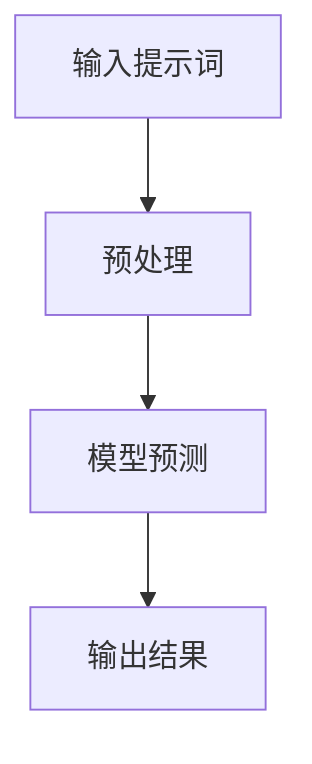
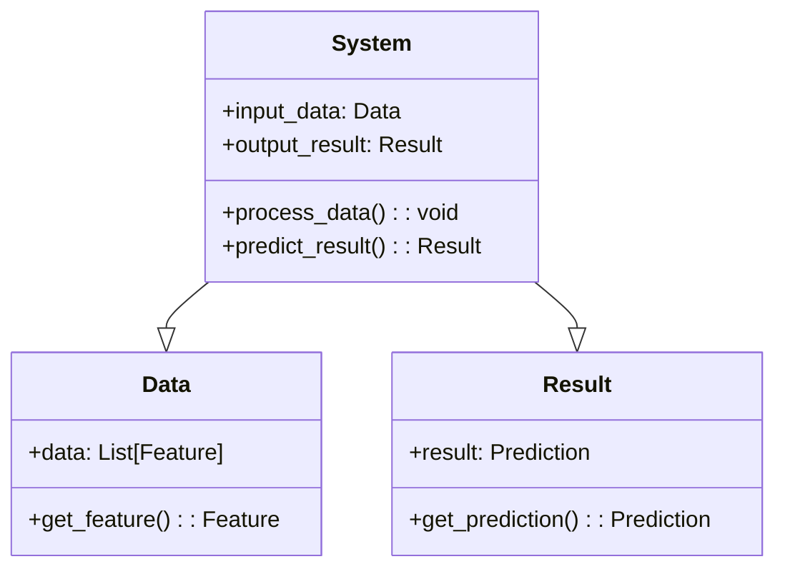
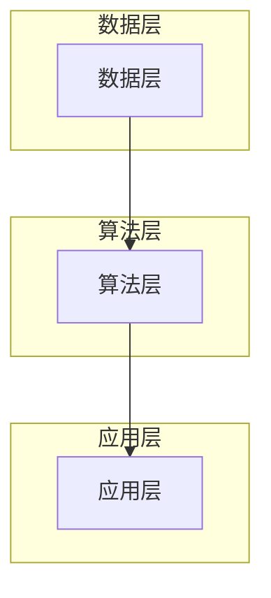
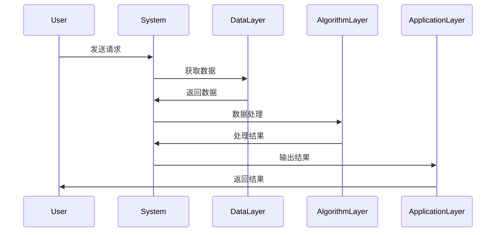

                 


## 提示词驱动的智能制造：工业4.0的核心

### 关键词：工业4.0、智能制造、提示词驱动、人工智能、大数据

### 摘要：
本文深入探讨了工业4.0时代下的智能制造及其核心驱动力——提示词驱动技术。通过逐步分析工业4.0的概念、智能制造的需求背景，以及提示词驱动的原理和应用，本文旨在为读者提供一个清晰、系统、易于理解的技术路线图，帮助理解智能制造在工业4.0背景下的重要性，并展望其未来发展趋势。

## 第一部分：背景介绍

### 1.1 核心概念

#### 工业革命与工业4.0
- **工业革命**：从18世纪末开始，标志着机器生产取代手工生产的时代。
- **工业4.0**：指的是第四次工业革命，以智能化和数字化为特点，强调通过信息物理系统（Cyber-Physical Systems, CPS）实现人、机器和资源的深度融合。

#### 智能制造
- **定义**：智能制造是一种基于数字化和网络化的制造模式，通过利用人工智能、大数据、物联网等技术实现制造过程的自动化、智能化和优化。
- **特征**：个性化定制、预测维护、灵活生产、高效物流等。

#### 提示词驱动
- **定义**：提示词驱动是一种基于人工智能的交互方式，通过输入特定关键词或短语，触发系统的自动响应和处理。
- **作用**：提高生产效率、优化供应链管理、实现生产过程的实时监控和调整。

### 1.2 问题与挑战
- **生产效率**：传统制造模式难以满足个性化、多样化的市场需求。
- **资源浪费**：生产过程中存在大量资源浪费和能源消耗。
- **供应链管理**：供应链的透明度和协同性不足，导致库存和物流成本上升。

### 1.3 解决方案
- **工业4.0**：通过智能化和网络化技术，实现生产过程的优化和资源的高效利用。
- **智能制造**：借助人工智能和大数据技术，实现生产过程的自动化和智能化。
- **提示词驱动**：通过智能交互，提高生产效率和供应链管理的协同性。

### 1.4 边界与外延
- **边界**：工业4.0和智能制造主要关注制造过程，但也可以延伸到物流、供应链管理等领域。
- **外延**：工业4.0和智能制造不仅仅是技术问题，还涉及到企业文化、管理模式和组织结构的变革。

### 1.5 概念结构与核心要素组成
- **工业4.0**：制造执行系统（MES）、企业资源计划（ERP）、物联网（IoT）等。
- **智能制造**：工业机器人、传感器网络、云计算、大数据分析等。
- **提示词驱动**：自然语言处理（NLP）、机器学习（ML）、语音识别（ASR）等。

## 第二部分：核心概念与联系

### 2.1 AI大模型的定义与特点
- **定义**：AI大模型是一种拥有巨大参数量的神经网络模型，能够处理复杂的任务。
- **特点**：强大的学习能力、高效的计算能力、广泛的应用领域。

### 2.2 提示词驱动的概念与作用
- **概念**：提示词驱动是一种基于自然语言交互的智能系统，通过输入提示词，系统自动执行相关任务。
- **作用**：提高人机交互效率、实现自动化操作、提升生产智能化水平。

### 2.3 AI大模型与传统AI的区别
- **传统AI**：算法简单，任务专一，需大量手动调参。
- **AI大模型**：模型复杂，任务多样，自动学习和优化。

## 第三部分：算法原理讲解

### 3.1 算法mermaid流程图


### 3.2 Python源代码解释
```python
# 导入相关库
import tensorflow as tf
import numpy as np

# 定义模型
model = tf.keras.Sequential([
    tf.keras.layers.Dense(units=1, input_shape=[1])
])

# 编译模型
model.compile(loss='mean_squared_error', optimizer=tf.keras.optimizers.Adam(0.1))

# 训练模型
x = np.array([1, 2, 3, 4])
y = np.array([1, 2, 3, 4])
model.fit(x, y, epochs=1000)

# 预测
x_test = 5
prediction = model.predict([x_test])
print(f"预测结果：{prediction[0][0]}")
```

### 3.3 数学模型和公式
$$y = wx + b$$
其中，$w$是权重，$x$是输入值，$b$是偏置。

### 3.4 举例说明
假设我们需要预测一个工厂的生产效率，输入提示词为“生产效率预测”，系统将自动调用训练好的模型，输入当前的生产数据，得到预测结果。

## 第四部分：系统分析与架构设计方案

### 4.1 问题场景介绍
- **场景一**：生产线实时监控与优化。
- **场景二**：供应链管理中的库存预测与优化。

### 4.2 项目介绍
- **项目一**：智能工厂监控系统。
- **项目二**：供应链智能管理系统。

### 4.3 系统功能设计


### 4.4 系统架构设计


### 4.5 系统接口设计和系统交互


## 第五部分：项目实战

### 5.1 环境安装
- **环境准备**：安装Python、TensorFlow等必要库。
- **硬件配置**：根据项目需求配置服务器和存储设备。

### 5.2 系统核心实现源代码
```python
# 代码示例：生产效率预测模型
import tensorflow as tf

# 定义模型
model = tf.keras.Sequential([
    tf.keras.layers.Dense(units=1, input_shape=[1])
])

# 编译模型
model.compile(loss='mean_squared_error', optimizer=tf.keras.optimizers.Adam(0.1))

# 训练模型
x_train = np.array([1, 2, 3, 4])
y_train = np.array([1, 2, 3, 4])
model.fit(x_train, y_train, epochs=1000)

# 预测
x_test = 5
prediction = model.predict([x_test])
print(f"预测结果：{prediction[0][0]}")
```

### 5.3 代码应用解读与分析
- **模型定义**：使用TensorFlow定义一个简单的线性模型。
- **模型训练**：使用训练数据训练模型。
- **模型预测**：使用测试数据预测生产效率。

### 5.4 实际案例分析和详细讲解剖析
- **案例一**：某智能工厂的生产效率预测。
- **案例二**：某供应链的库存预测。

### 5.5 项目小结
- **关键点**：提示词驱动技术在智能制造中的应用。
- **学习心得**：理解工业4.0和智能制造的重要性，掌握提示词驱动的原理和应用。

## 第六部分：最佳实践 tips、小结、注意事项、拓展阅读

### 6.1 最佳实践 tips
- **环境准备**：确保硬件和网络环境满足项目需求。
- **数据准备**：收集准确、完整的数据，并进行预处理。
- **模型训练**：使用足够的数据和合适的优化策略进行模型训练。

### 6.2 小结
- **核心内容**：工业4.0、智能制造和提示词驱动的概念及其应用。
- **学习目标**：掌握智能制造的技术路线和实施方法。

### 6.3 注意事项
- **数据安全**：保护敏感数据，防止数据泄露。
- **系统稳定性**：确保系统的稳定运行，提高生产效率。

### 6.4 拓展阅读
- **参考文献**：查阅相关的学术论文和书籍，深入了解智能制造和提示词驱动的最新研究。
- **扩展学习**：学习相关的编程语言和技术框架，提高实践能力。

作者：AI天才研究院/AI Genius Institute & 禅与计算机程序设计艺术 /Zen And The Art of Computer Programming

[END]

