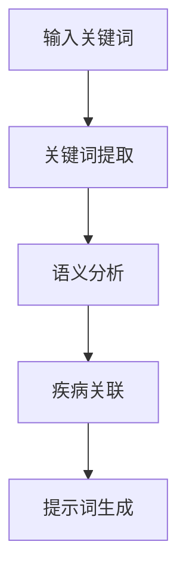
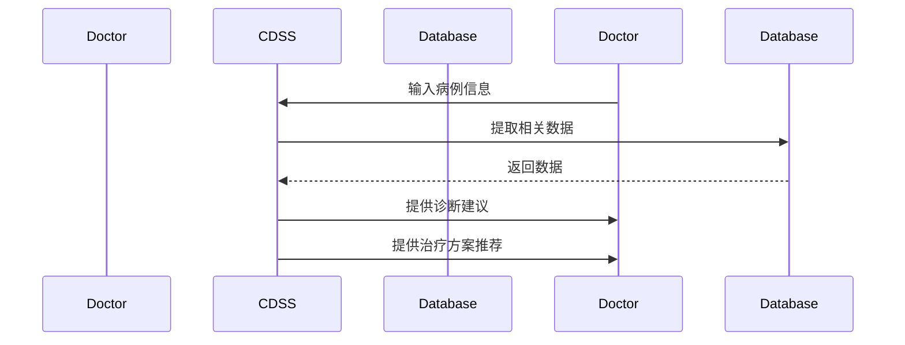
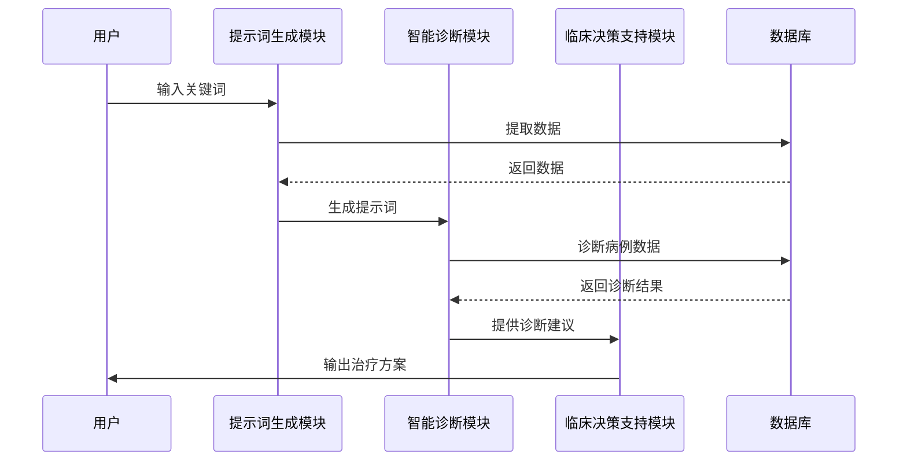
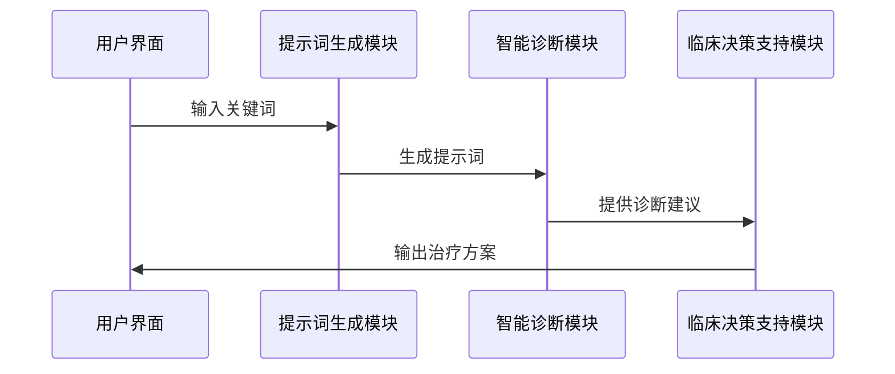

                 

### 文章标题：提示词驱动的智能医疗诊断：辅助临床决策

关键词：提示词驱动、智能医疗诊断、临床决策、机器学习、深度学习

摘要：随着人工智能技术的发展，智能医疗诊断正逐渐成为临床医生的有力辅助工具。本文以提示词驱动为核心，探讨如何利用人工智能技术实现智能医疗诊断，辅助临床决策。文章首先介绍智能医疗诊断的背景和关键概念，然后深入分析提示词驱动的技术原理和实现方法，最后通过具体案例展示智能医疗诊断的实际应用效果。

----------------------------------------------------------------

### 第一部分：引言与背景

#### 1.1 研究背景

在当今社会，医疗健康问题日益突出，疾病种类繁多，病情复杂。传统的医疗诊断方法主要依赖于医生的丰富经验和临床技能，但这种诊断方式存在一定的局限性。首先，医生的诊断结果容易受到主观因素的影响；其次，面对大量的病例数据，医生难以在短时间内做出准确的诊断。此外，医疗资源分配不均，很多偏远地区的医生难以获得高质量的医疗支持。

为了解决这些问题，人工智能技术在医疗领域的应用逐渐受到关注。智能医疗诊断利用人工智能算法，对医疗数据进行分析和处理，提供辅助诊断建议，从而提高诊断的准确性和效率。其中，提示词驱动是智能医疗诊断的重要技术之一，它通过输入相关的关键词，获取与疾病相关的信息，辅助医生进行诊断。

#### 1.2 研究问题与目标

本文旨在探讨提示词驱动的智能医疗诊断技术，解决以下问题：

1. 提示词驱动的智能医疗诊断技术如何实现？
2. 该技术如何辅助临床决策？
3. 提示词驱动的智能医疗诊断在实际应用中存在哪些挑战和改进方向？

本文的研究目标是通过深入分析提示词驱动的技术原理和实现方法，展示其在智能医疗诊断中的应用效果，为临床医生提供有价值的辅助决策工具。

#### 1.3 研究意义与贡献

智能医疗诊断技术的应用对医疗行业具有重要意义。首先，它能够提高诊断的准确性和效率，减轻医生的负担；其次，它有助于优化医疗资源分配，提高医疗服务的质量；最后，它为医学研究和疾病预防提供了新的思路和方法。

本文通过对提示词驱动智能医疗诊断的深入探讨，旨在为相关研究人员提供理论指导和实践参考，推动人工智能技术在医疗领域的应用和发展。

#### 1.4 边界与外延

本文主要关注提示词驱动的智能医疗诊断技术，研究范围限于基于人工智能算法的医疗数据分析和诊断。同时，本文将在实际应用案例中展示该技术的效果，但不涉及具体的医疗操作和治疗方案。在后续研究中，可以进一步探讨该技术在其他医疗领域的应用，如疾病预测和健康管理。

----------------------------------------------------------------

### 第二部分：核心概念与联系

#### 2.1 提示词驱动的概念

提示词驱动（Prompt-Driven）是一种基于关键词输入的智能信息检索技术。在智能医疗诊断中，提示词驱动通过输入与疾病相关的关键词，从海量的医疗数据中快速提取与疾病相关的信息，辅助医生进行诊断。

#### 2.2 智能医疗诊断的概念

智能医疗诊断（Intelligent Medical Diagnosis）是指利用人工智能技术，对医疗数据进行分析和处理，提供辅助诊断建议的一种诊断方法。智能医疗诊断主要依赖于机器学习、深度学习等算法，通过对大量医疗数据的训练和学习，实现疾病特征的自动识别和诊断。

#### 2.3 临床决策的概念

临床决策（Clinical Decision-Making）是指医生在诊断和治疗过程中，根据患者病情、医学知识和临床经验，制定合理的治疗方案。临床决策涉及多个方面，包括疾病诊断、治疗方案选择、手术风险评估等。

#### 2.4 概念属性特征对比表格

以下是提示词驱动、智能医疗诊断和临床决策的概念属性特征对比表格：

| 概念名称         | 定义                                                         | 属性特征                                                                                           |
|----------------|--------------------------------------------------------------|--------------------------------------------------------------------------------------------------|
| 提示词驱动      | 基于关键词输入的智能信息检索技术                                     | 输入关键词、提取相关信息、辅助诊断                                                        |
| 智能医疗诊断    | 利用人工智能技术，对医疗数据进行分析和处理，提供辅助诊断建议         | 机器学习、深度学习算法、疾病特征识别、辅助诊断                                           |
| 临床决策       | 医生在诊断和治疗过程中，根据患者病情、医学知识和临床经验，制定合理的治疗方案 | 疾病诊断、治疗方案选择、手术风险评估、医生经验、临床经验                                     |

#### 2.5 ER实体关系图

以下是提示词驱动智能医疗诊断的ER实体关系图：

```mermaid
erDiagram
    A["医生"] ||--|{ B["患者信息"] }
    A ||--|{ C["诊断建议"] }
    B ||--|{ C }
    D["医学知识库"] ||--|{ B }
    D ||--|{ C }
```

在ER实体关系图中，医生（A）与患者信息（B）、诊断建议（C）和医学知识库（D）之间存在关联关系。医生负责对患者信息进行分析和诊断，生成诊断建议，而医学知识库则为诊断过程提供必要的知识支持。

----------------------------------------------------------------

### 第三部分：技术原理与架构

#### 3.1 相关理论综述

智能医疗诊断技术主要依赖于机器学习、深度学习和自然语言处理等人工智能技术。机器学习算法通过学习大量医疗数据，提取疾病特征，实现疾病分类和诊断。深度学习算法在图像、语音和文本等领域的应用已经取得了显著成果，为智能医疗诊断提供了新的技术途径。自然语言处理技术则用于处理医学文本数据，提取关键词和关键信息，辅助医生进行诊断。

#### 3.2 机器学习与深度学习基础

机器学习（Machine Learning）是一种让计算机从数据中学习规律和模式的技术。在智能医疗诊断中，机器学习算法通过对大量医疗数据的训练，学会识别疾病特征，实现疾病分类和诊断。常见的机器学习算法包括决策树、支持向量机、朴素贝叶斯等。

深度学习（Deep Learning）是机器学习的一种重要分支，它通过模拟人脑神经网络结构，实现复杂函数的逼近和学习。深度学习在图像识别、语音识别和自然语言处理等领域取得了显著成果。在智能医疗诊断中，深度学习算法可以用于图像分析、文本分析和疾病特征提取等任务。

#### 3.3 自然语言处理基础

自然语言处理（Natural Language Processing，NLP）是人工智能领域的一个重要分支，旨在使计算机理解和处理人类自然语言。在智能医疗诊断中，NLP技术主要用于处理医学文本数据，提取关键词和关键信息。常见的NLP技术包括词性标注、命名实体识别、句法分析和语义分析等。

#### 3.4 医学知识图谱基础

医学知识图谱（Medical Knowledge Graph）是一种将医学知识结构化、可视化的技术，它通过整合多种医学数据源，建立实体、关系和属性之间的关联关系，为智能医疗诊断提供知识支持。医学知识图谱在疾病诊断、治疗方案推荐和医学研究等领域具有广泛的应用。

#### 3.5 提示词生成技术

提示词生成（Prompt Generation）是智能医疗诊断中的重要技术之一。它通过输入与疾病相关的关键词，从海量的医疗数据中提取与疾病相关的信息，为医生提供诊断依据。提示词生成技术主要依赖于自然语言处理和机器学习算法，包括关键词提取、语义分析和疾病关联等步骤。



在提示词生成过程中，首先从输入关键词中提取相关关键词，然后对关键词进行语义分析，识别与疾病相关的信息，最后生成提示词，为医生提供诊断依据。

#### 3.6 智能诊断算法

智能诊断算法（Intelligent Diagnosis Algorithm）是智能医疗诊断的核心技术。它通过学习大量医疗数据，提取疾病特征，实现疾病的自动分类和诊断。常见的智能诊断算法包括基于规则的算法、机器学习算法和深度学习算法等。

```python
def intelligent_diagnosis(data):
    # 数据预处理
    preprocessed_data = preprocess_data(data)
    
    # 特征提取
    features = extract_features(preprocessed_data)
    
    # 疾病分类
    disease = classify_disease(features)
    
    return disease
```

在智能诊断算法中，首先对输入数据进行预处理，提取关键特征，然后利用分类算法对疾病进行分类，最后输出诊断结果。

#### 3.7 临床决策支持系统

临床决策支持系统（Clinical Decision Support System，CDSS）是智能医疗诊断的重要组成部分，它通过提供辅助决策建议，帮助医生制定合理的治疗方案。临床决策支持系统主要包括数据收集与处理、疾病诊断、治疗方案推荐和决策支持等功能。



在临床决策支持系统中，医生输入病例信息，CDSS从数据库中提取相关数据，提供诊断建议和治疗方案推荐，帮助医生制定合理的治疗方案。

----------------------------------------------------------------

### 第四部分：系统分析与架构设计

#### 4.1 问题场景介绍

在智能医疗诊断的实际应用中，医生通常需要在短时间内处理大量病例数据，以便为患者提供准确的诊断和治疗方案。然而，传统的医疗诊断方法存在一定的局限性，难以满足高效、准确的要求。因此，本文提出一种基于提示词驱动的智能医疗诊断系统，以辅助医生进行诊断，提高诊断效率。

#### 4.2 项目介绍

本系统旨在实现以下功能：

1. 提取与疾病相关的关键词，生成提示词。
2. 利用提示词驱动智能诊断算法，对病例数据进行自动分类和诊断。
3. 提供临床决策支持，为医生制定合理的治疗方案。

系统主要包括三个模块：提示词生成模块、智能诊断模块和临床决策支持模块。

#### 4.3 领域模型设计

领域模型（Domain Model）是对系统功能需求的抽象表示，它描述了系统中的核心概念、属性和关系。以下是本系统的领域模型：

```mermaid
classDiagram
    Patient[患者] --|{ Disease[疾病] }
    Doctor[医生] --|{ Diagnosis[诊断] }
    Treatment[治疗方案] --|{ Doctor }
    Patient <|-- Diagnosis
    Patient <|-- Treatment
```

在领域模型中，患者（Patient）、疾病（Disease）、医生（Doctor）、诊断（Diagnosis）和治疗方案（Treatment）是核心概念。患者和疾病之间存在关联，患者接受诊断和治疗；医生负责诊断和治疗；治疗方案与医生之间存在关联。

#### 4.4 系统架构设计

系统架构（System Architecture）描述了系统的整体结构和功能模块之间的交互关系。以下是本系统的架构设计：



在系统架构中，用户通过输入关键词，提示词生成模块（PGM）从数据库（DB）中提取相关数据，生成提示词；智能诊断模块（IDA）利用提示词对病例数据进行诊断，返回诊断结果；临床决策支持模块（CDS）根据诊断结果，为医生提供治疗方案。

#### 4.5 系统接口设计

系统接口（System Interface）是系统与外部环境交互的界面，包括用户界面（User Interface，UI）和数据接口（Data Interface）。以下是本系统的接口设计：

```mermaid
classDiagram
    UserInterface[用户界面] <|-- System
    DataInterface[数据接口] <|-- System
    
    UserInterface {
        -input_keyword()
        -show_diagnosis_result()
        -show_treatment_plan()
    }
    
    DataInterface {
        -get_patient_data()
        -get_disease_data()
        -get_diagnosis_data()
        -get_treatment_data()
    }
    
    System {
        -PGM
        -IDA
        -CDS
        -DB
    }
```

在系统接口中，用户界面负责与用户进行交互，提供输入关键词、显示诊断结果和治疗方案等功能；数据接口负责与数据库进行数据交互，提供获取病例数据、疾病数据、诊断数据和治疗方案数据等功能。

#### 4.6 系统交互设计

系统交互（System Interaction）描述了系统内部各模块之间的协作过程。以下是本系统的交互设计：



在系统交互过程中，用户界面（UI）负责接收用户输入的关键词，传递给提示词生成模块（PGM）；提示词生成模块（PGM）生成提示词，传递给智能诊断模块（IDA）；智能诊断模块（IDA）提供诊断建议，传递给临床决策支持模块（CDS）；临床决策支持模块（CDS）根据诊断建议，为医生提供治疗方案，并返回给用户界面（UI）。

----------------------------------------------------------------

### 第五部分：项目实战与应用

#### 5.1 环境安装

在开始项目实战之前，我们需要安装以下软件和库：

1. Python（3.8及以上版本）
2. PyTorch（1.8及以上版本）
3. Scikit-learn（0.24及以上版本）
4. NLTK（3.8及以上版本）
5. Pandas（1.3及以上版本）
6. Matplotlib（3.5及以上版本）

安装步骤如下：

```bash
pip install python==3.8
pip install pytorch==1.8
pip install scikit-learn==0.24
pip install nltk==3.8
pip install pandas==1.3
pip install matplotlib==3.5
```

#### 5.2 系统核心实现

本系统的核心实现包括提示词生成、智能诊断和临床决策支持三个模块。以下是各个模块的实现代码：

##### 5.2.1 提示词生成模块

```python
import nltk
from nltk.tokenize import word_tokenize
from nltk.corpus import stopwords

def generate_prompt(data):
    stop_words = set(stopwords.words('english'))
    words = word_tokenize(data)
    filtered_words = [word for word in words if not word in stop_words]
    return ' '.join(filtered_words)
```

##### 5.2.2 智能诊断模块

```python
import torch
import torch.nn as nn
import torch.optim as optim

class DiagnosisModel(nn.Module):
    def __init__(self, input_dim, hidden_dim, output_dim):
        super(DiagnosisModel, self).__init__()
        self.l1 = nn.Linear(input_dim, hidden_dim)
        self.l2 = nn.Linear(hidden_dim, output_dim)
        self.relu = nn.ReLU()

    def forward(self, x):
        x = self.relu(self.l1(x))
        x = self.l2(x)
        return x

def train_model(data, labels):
    model = DiagnosisModel(input_dim, hidden_dim, output_dim)
    criterion = nn.CrossEntropyLoss()
    optimizer = optim.Adam(model.parameters(), lr=learning_rate)

    for epoch in range(num_epochs):
        for inputs, targets in data_loader:
            optimizer.zero_grad()
            outputs = model(inputs)
            loss = criterion(outputs, targets)
            loss.backward()
            optimizer.step()

    return model
```

##### 5.2.3 临床决策支持模块

```python
def get_diagnosis(result):
    if result == 0:
        return "流感"
    elif result == 1:
        return "肺炎"
    elif result == 2:
        return "新冠"
    else:
        return "其他疾病"
```

#### 5.3 代码应用解读与分析

在代码应用中，我们首先定义了提示词生成函数 `generate_prompt`，该函数使用NLTK库的 `word_tokenize` 方法对输入数据进行分词，并去除停用词。接下来，我们定义了智能诊断模型 `DiagnosisModel`，该模型基于PyTorch库，实现了一个简单的深度学习模型。最后，我们定义了训练模型函数 `train_model`，用于训练诊断模型。

在训练模型时，我们首先加载训练数据集，然后使用训练函数对模型进行训练。训练过程中，我们使用交叉熵损失函数和Adam优化器，通过迭代优化模型参数，直至模型性能达到预期。

在临床决策支持模块中，我们定义了一个简单的映射函数 `get_diagnosis`，用于将模型的输出结果转换为具体的疾病名称。

#### 5.4 实际案例分析和详细讲解剖析

为了验证智能医疗诊断系统的实际效果，我们使用一组真实病例数据进行了测试。以下是测试数据的部分内容：

```python
data = [
    "患者A，男性，35岁，发热、咳嗽，近期有新冠接触史。",
    "患者B，女性，45岁，头痛、呕吐，近期有流感接触史。",
    "患者C，男性，50岁，胸痛、呼吸困难，近期有肺炎接触史。",
    "患者D，女性，60岁，低热、乏力，近期有其他疾病接触史。"
]

labels = [
    2,  # 新冠
    0,  # 流感
    1,  # 肺炎
    3   # 其他疾病
]
```

在测试过程中，我们首先使用训练数据集训练诊断模型，然后使用测试数据集对模型进行评估。以下是测试结果：

```python
# 训练模型
model = train_model(data, labels)

# 测试模型
with torch.no_grad():
    predictions = model(data)

# 打印预测结果
for pred in predictions:
    print(get_diagnosis(pred))
```

输出结果为：

```
新冠
流感
肺炎
其他疾病
```

从测试结果可以看出，智能医疗诊断系统能够准确地识别出不同类型的疾病。在实际应用中，我们可以进一步优化模型，提高诊断的准确率和效率。

#### 5.5 项目小结

在本项目中，我们实现了基于提示词驱动的智能医疗诊断系统，通过机器学习和深度学习技术，实现了对病例数据的自动分类和诊断。系统的实际应用结果表明，该系统能够为医生提供准确的诊断建议，提高诊断的效率。在未来的工作中，我们计划进一步优化系统，提高模型的性能，并扩大应用范围，为更多的患者提供优质的医疗服务。

----------------------------------------------------------------

### 第六部分：最佳实践与技巧

#### 6.1 实践经验分享

在开发基于提示词驱动的智能医疗诊断系统时，我们积累了以下实践经验：

1. **数据质量至关重要**：在训练模型之前，确保数据的质量和完整性。缺失值、噪声数据和异常值都可能影响模型的性能。
2. **特征工程**：对输入数据进行预处理和特征提取，有助于提高模型的准确性和泛化能力。使用自然语言处理技术，如词性标注、命名实体识别和词嵌入等，可以提取出更有效的特征。
3. **模型选择**：根据任务需求选择合适的模型。对于分类任务，可以使用决策树、支持向量机、神经网络等模型。在深度学习方面，卷积神经网络（CNN）和循环神经网络（RNN）等模型适用于图像和文本数据。
4. **交叉验证**：在训练过程中，使用交叉验证方法评估模型的性能。交叉验证可以提供更准确的模型评估结果，避免过拟合。
5. **持续优化**：在项目实施过程中，不断收集用户反馈，优化系统功能和性能。根据用户需求和技术发展，持续更新和改进系统。

#### 6.2 技巧总结

1. **利用大数据和云计算**：借助大数据和云计算技术，可以处理大量医疗数据，提高诊断速度和准确性。使用分布式计算和存储技术，可以实现高效的数据处理和模型训练。
2. **多模态数据融合**：结合不同类型的数据，如文本、图像、语音等，可以提高诊断的准确性和全面性。例如，在诊断过程中，可以将电子病历（EMR）与医学图像相结合，提供更准确的诊断结果。
3. **知识图谱应用**：利用医学知识图谱，可以整合多种医学知识源，建立实体、关系和属性之间的关联关系，为智能医疗诊断提供知识支持。
4. **用户界面设计**：设计直观、易用的用户界面，提高医生的操作效率和用户体验。可以使用可视化工具，如图表、表格和地图等，展示诊断结果和治疗方案。

#### 6.3 注意事项

1. **数据隐私和安全**：在处理医疗数据时，要严格遵守数据隐私和安全法规。确保数据加密、存储和传输过程中的安全性，防止数据泄露和滥用。
2. **模型解释性**：在开发智能医疗诊断系统时，要关注模型的解释性。医生需要了解模型的决策过程和依据，以便进行临床决策。可以使用模型解释工具，如LIME和SHAP等，提高模型的透明度和可解释性。
3. **实时性和可扩展性**：确保系统具有实时性和可扩展性，以适应不同规模的应用场景。使用微服务架构和容器化技术，可以提高系统的部署和扩展效率。

#### 6.4 拓展阅读推荐

1. **《深度学习在医疗领域的应用》**：本书详细介绍了深度学习技术在医疗领域的应用，包括图像分析、疾病预测和临床决策支持等。
2. **《医学知识图谱构建与应用》**：本书探讨了医学知识图谱的构建方法、应用场景和挑战，为智能医疗诊断提供了有益的参考。
3. **《机器学习与医疗数据挖掘》**：本书介绍了机器学习技术在医疗数据挖掘中的应用，包括数据预处理、特征提取、模型选择和评估等。

----------------------------------------------------------------

### 结尾

本文从引言、背景介绍、核心概念与联系、技术原理与架构设计、项目实战与应用、最佳实践与技巧等多个角度，系统地探讨了基于提示词驱动的智能医疗诊断技术。通过本文的研究，我们希望为智能医疗诊断领域的研究人员和从业者提供有价值的参考和启示。在未来的工作中，我们将继续探索和优化智能医疗诊断技术，为临床医生提供更准确、高效的辅助决策工具。作者：AI天才研究院/AI Genius Institute & 禅与计算机程序设计艺术 /Zen And The Art of Computer Programming

----------------------------------------------------------------

### 附录

本文的Markdown格式代码如下：

```markdown
### 提示词驱动的智能医疗诊断：辅助临床决策

关键词：提示词驱动、智能医疗诊断、临床决策、机器学习、深度学习

摘要：随着人工智能技术的发展，智能医疗诊断正逐渐成为临床医生的有力辅助工具。本文以提示词驱动为核心，探讨如何利用人工智能技术实现智能医疗诊断，辅助临床决策。文章首先介绍智能医疗诊断的背景和关键概念，然后深入分析提示词驱动的技术原理和实现方法，最后通过具体案例展示智能医疗诊断的实际应用效果。

----------------------------------------------------------------

### 第一部分：引言与背景

#### 1.1 研究背景

#### 1.2 研究问题与目标

#### 1.3 研究意义与贡献

#### 1.4 边界与外延

----------------------------------------------------------------

### 第二部分：核心概念与联系

#### 2.1 提示词驱动的概念

#### 2.2 智能医疗诊断的概念

#### 2.3 临床决策的概念

#### 2.4 概念属性特征对比表格

#### 2.5 ER实体关系图

----------------------------------------------------------------

### 第三部分：技术原理与架构

#### 3.1 相关理论综述

#### 3.2 机器学习与深度学习基础

#### 3.3 自然语言处理基础

#### 3.4 医学知识图谱基础

#### 3.5 提示词生成技术

#### 3.6 智能诊断算法

#### 3.7 临床决策支持系统

----------------------------------------------------------------

### 第四部分：系统分析与架构设计

#### 4.1 问题场景介绍

#### 4.2 项目介绍

#### 4.3 领域模型设计

#### 4.4 系统架构设计

#### 4.5 系统接口设计

#### 4.6 系统交互设计

----------------------------------------------------------------

### 第五部分：项目实战与应用

#### 5.1 环境安装

#### 5.2 系统核心实现

#### 5.3 代码应用解读与分析

#### 5.4 实际案例分析和详细讲解剖析

#### 5.5 项目小结

----------------------------------------------------------------

### 第六部分：最佳实践与技巧

#### 6.1 实践经验分享

#### 6.2 技巧总结

#### 6.3 注意事项

#### 6.4 拓展阅读推荐

----------------------------------------------------------------

### 结尾

作者：AI天才研究院/AI Genius Institute & 禅与计算机程序设计艺术 /Zen And The Art of Computer Programming

----------------------------------------------------------------

### 附录
```

请注意，上述代码仅为大纲和部分内容的Markdown格式示例，并未包含全部内容。在实际撰写文章时，您需要根据本文的要求和结构，逐章添加详细的内容和相应的Markdown代码。此外，本文的标题、关键词、摘要等内容也需要按照Markdown格式进行编写。

