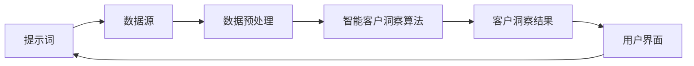
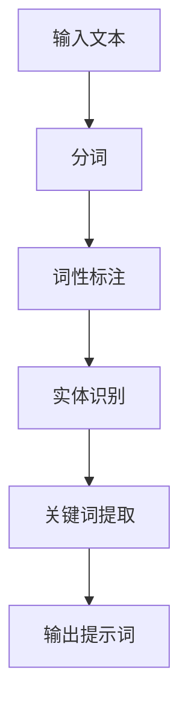
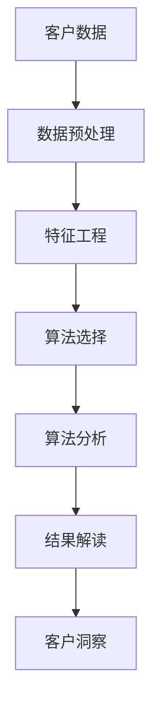
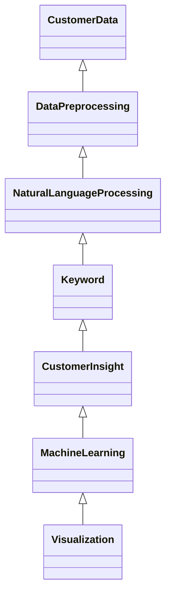
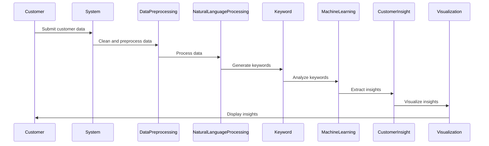
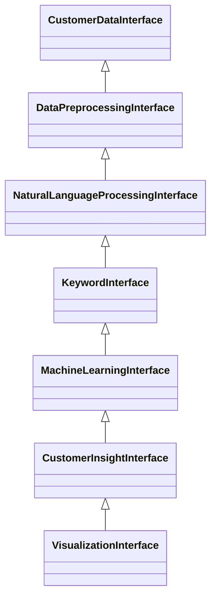
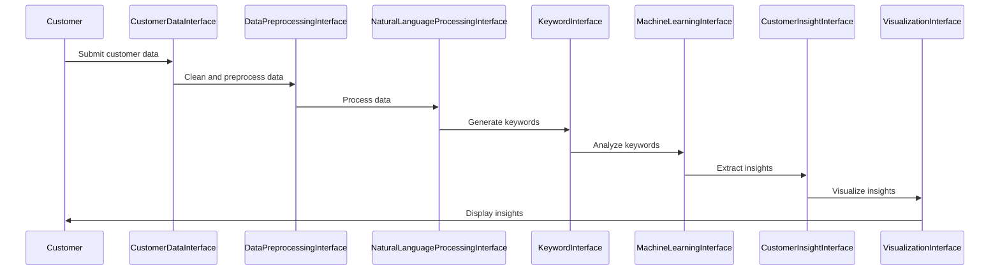

                 

# 提示词驱动的智能客户洞察系统

## 关键词

- 智能客户洞察
- 提示词驱动
- 算法原理
- 数学模型
- 系统架构
- 项目实战

## 摘要

本文将探讨提示词驱动的智能客户洞察系统，详细阐述其背景、核心概念、算法原理、数学模型、系统设计与架构方案，并通过实际项目实战，提供全面的技术指导。本文旨在帮助读者深入理解智能客户洞察系统的设计理念与实现方法，为相关领域的研究和应用提供参考。

## 目录大纲

### 第1章 引言与背景
#### 1.1 问题背景
#### 1.2 问题描述
#### 1.3 问题解决
#### 1.4 边界与外延
#### 1.5 概念结构与核心要素组成

### 第2章 核心概念与联系
#### 2.1 提示词驱动的概念
#### 2.2 智能客户洞察的概念
#### 2.3 提示词与智能客户洞察的联系

### 第3章 算法原理讲解
#### 3.1 提示词生成算法
#### 3.2 客户洞察算法

### 第4章 数学模型和数学公式
#### 4.1 提示词生成模型的数学公式
#### 4.2 客户洞察模型的数学公式

### 第5章 系统分析与架构设计方案
#### 5.1 问题场景介绍
#### 5.2 项目介绍
#### 5.3 系统功能设计（领域模型类图）
#### 5.4 系统架构设计（架构图）
#### 5.5 系统接口设计
#### 5.6 系统交互（序列图）

### 第6章 项目实战
#### 6.1 环境安装
#### 6.2 系统核心实现源代码
#### 6.3 代码应用解读与分析
#### 6.4 实际案例分析与详细讲解
#### 6.5 项目小结

### 第7章 最佳实践与注意事项
#### 7.1 最佳实践 tips
#### 7.2 小结
#### 7.3 注意事项
#### 7.4 拓展阅读

### 详细解析

#### 第1章 引言与背景

本章将介绍提示词驱动的智能客户洞察系统的背景，包括问题背景、问题描述、问题解决途径，以及概念的定义和边界。此外，还将阐述概念结构与核心要素组成，为后续章节的内容奠定基础。

#### 第2章 核心概念与联系

本章将详细解释提示词驱动的概念和智能客户洞察的概念，并探讨它们之间的联系。通过概念属性特征对比表格和ER实体关系图，帮助读者更好地理解这两个核心概念。

#### 第3章 算法原理讲解

本章将深入探讨提示词生成算法和客户洞察算法的原理。每个算法都将通过流程图、Python源代码示例、数学模型和公式以及举例说明进行详细讲解，使读者能够掌握算法的核心思想和实现方法。

#### 第4章 数学模型和数学公式

本章将展示提示词生成和客户洞察算法中的关键数学模型和公式。使用LaTeX格式进行展示，增强文章的可读性和专业性。

#### 第5章 系统分析与架构设计方案

本章将详细介绍系统的设计，包括问题场景介绍、项目介绍、系统功能设计（领域模型类图）、系统架构设计（架构图）、系统接口设计和系统交互（序列图）。通过系统的架构设计，使读者对整个系统有一个全面的了解。

#### 第6章 项目实战

本章将通过一个实际项目，展示如何安装环境、实现系统核心代码、解读代码、分析实际案例，并进行项目小结。通过项目实战，使读者能够将理论知识应用到实际项目中。

#### 第7章 最佳实践与注意事项

本章将提供一些最佳实践建议，并对本书的内容进行小结。此外，还将讨论一些注意事项，以及推荐一些拓展阅读资源，为读者提供进一步的指导和学习资源。## 第1章 引言与背景

### 1.1 问题背景

随着互联网和大数据技术的飞速发展，企业对于客户数据的需求愈发强烈。然而，如何从海量的客户数据中提取有价值的信息，成为了众多企业面临的一大挑战。传统的数据分析方法往往依赖于大量的预定义指标和规则，无法灵活应对多变的市场需求，导致客户洞察的准确性和实时性受到限制。

在这个背景下，智能客户洞察系统应运而生。智能客户洞察系统通过先进的算法和技术，能够从海量数据中自动提取有价值的信息，帮助企业更好地理解客户需求，优化产品设计，提升客户满意度。然而，如何构建一个高效、准确的智能客户洞察系统，依然是一个亟待解决的问题。

### 1.2 问题描述

智能客户洞察系统需要解决的主要问题如下：

1. **数据质量**：客户数据的质量直接影响系统的准确性。如何保证数据的准确性、完整性和一致性，是一个关键问题。
2. **数据挖掘**：如何从海量数据中提取有价值的信息，是智能客户洞察系统的核心任务。这需要强大的算法和计算能力。
3. **实时性**：企业需要实时了解客户需求和市场动态，这对系统的实时响应能力提出了高要求。
4. **可扩展性**：随着企业规模的扩大和数据量的增长，系统需要具备良好的可扩展性，以应对不断变化的需求。
5. **用户体验**：用户界面设计需要简洁易用，便于用户快速获取所需信息。

### 1.3 问题解决

为了解决上述问题，智能客户洞察系统采用了以下解决方案：

1. **数据预处理**：对客户数据进行清洗、转换和归一化处理，提高数据质量。
2. **机器学习算法**：使用机器学习算法，如聚类、分类、回归等，对客户数据进行挖掘和分析。
3. **实时数据处理**：采用流处理技术，实现对数据的实时处理和分析。
4. **分布式计算**：利用分布式计算框架，如Hadoop、Spark等，提高系统的计算能力和可扩展性。
5. **用户界面设计**：设计简洁、直观的用户界面，提供友好的交互体验。

### 1.4 边界与外延

智能客户洞察系统的边界包括以下几个方面：

1. **数据边界**：系统处理的数据类型和来源，如客户行为数据、社交媒体数据、市场调研数据等。
2. **功能边界**：系统提供的功能模块，如客户画像、行为分析、需求预测等。
3. **性能边界**：系统的响应时间、处理能力和资源消耗等性能指标。
4. **应用边界**：系统的应用场景和行业范围，如零售业、金融业、服务业等。

智能客户洞察系统的外延包括：

1. **数据拓展**：通过接入更多的数据源，如第三方数据平台、内部业务系统等，扩大系统的数据覆盖范围。
2. **功能拓展**：根据企业需求，不断丰富系统的功能模块，如客户关系管理、市场营销自动化等。
3. **行业拓展**：将智能客户洞察系统应用到更多的行业领域，如制造业、教育业、医疗行业等。
4. **技术拓展**：引入更先进的技术，如深度学习、自然语言处理等，提高系统的智能化水平。

### 1.5 概念结构与核心要素组成

智能客户洞察系统的概念结构可以分为以下几个核心要素：

1. **数据采集**：通过多种途径收集客户数据，如API接口、日志文件、传感器等。
2. **数据预处理**：对采集到的数据进行清洗、转换和归一化处理，提高数据质量。
3. **数据存储**：将处理后的数据存储在分布式数据库中，如HDFS、MySQL等。
4. **数据挖掘**：使用机器学习算法，对存储的数据进行挖掘和分析，提取有价值的信息。
5. **数据可视化**：将挖掘结果通过图表、报表等形式进行可视化展示，便于用户理解和决策。
6. **用户交互**：提供简洁、直观的用户界面，支持用户与系统的交互和操作。

这些核心要素共同构成了智能客户洞察系统的概念结构，实现了从数据采集到挖掘、展示的全流程。

### 1.6 小结

本章介绍了智能客户洞察系统的背景、问题描述、问题解决途径、边界与外延，以及概念结构与核心要素组成。通过本章的介绍，读者可以对智能客户洞察系统有一个初步的了解，为后续章节的深入学习打下基础。

## 第2章 核心概念与联系

### 2.1 提示词驱动的概念

提示词驱动（Keyword-driven）是一种以关键词为核心的系统设计和开发方法。在这种方法中，系统通过识别和分析用户输入的关键词，实现与用户的交互和响应。提示词驱动的主要目标是提高系统的灵活性和可扩展性，使系统能够更好地适应多变的需求和环境。

#### 2.1.1 提示词的定义

提示词（Keyword）是用户在交互过程中输入的关键信息，用于指导系统的行为。提示词可以是单个单词、短语或句子，通常具有明确的语义和功能。例如，在智能客户服务系统中，用户输入的“订单状态”、“发货时间”、“退货政策”等，都可以被视为提示词。

#### 2.1.2 提示词的类型

根据提示词的功能和用途，可以将提示词分为以下几种类型：

1. **查询类提示词**：用于查询系统中的信息，如“订单号查询”、“产品信息查询”等。
2. **操作类提示词**：用于执行特定的操作，如“购买商品”、“申请退款”等。
3. **交互类提示词**：用于与用户进行交互，如“您好”、“谢谢”等。
4. **反馈类提示词**：用于对用户的操作进行反馈，如“已提交”、“正在处理”等。

#### 2.1.3 提示词的作用

提示词在智能客户洞察系统中扮演着至关重要的角色，其作用主要体现在以下几个方面：

1. **提高交互效率**：通过识别用户输入的关键词，系统能够快速理解用户意图，提供精准的响应，从而提高交互效率。
2. **降低用户学习成本**：提示词驱动的系统通常具有简单易懂的交互方式，用户无需学习复杂的操作流程，即可与系统进行有效交互。
3. **增强系统的灵活性**：提示词驱动的系统可以根据用户输入的关键词，灵活调整自身的功能和行为，满足不同的需求。
4. **提升用户体验**：通过精准的响应和高效的交互，提示词驱动的系统能够提升用户的使用体验，增强用户对系统的满意度。

### 2.2 智能客户洞察的概念

智能客户洞察（Intelligent Customer Insight）是指利用先进的数据分析和机器学习技术，从海量客户数据中提取有价值的信息和洞察，以帮助企业和组织更好地了解客户需求、优化产品和服务，提高市场竞争力。

#### 2.2.1 智能客户洞察的定义

智能客户洞察是一种基于数据驱动的分析方法，通过对客户数据进行挖掘、分析和预测，发现客户行为模式、偏好和需求，为企业提供决策支持。智能客户洞察不仅关注客户当前的行为和需求，还通过历史数据预测客户未来的行为和趋势。

#### 2.2.2 智能客户洞察的类型

智能客户洞察可以分为以下几种类型：

1. **客户行为分析**：通过分析客户的历史行为数据，如购买记录、浏览行为等，了解客户的行为模式和偏好。
2. **客户细分**：根据客户的行为特征、需求偏好等，将客户划分为不同的群体，为企业提供有针对性的营销策略。
3. **客户需求预测**：通过历史数据和趋势分析，预测客户未来的需求和行为，为企业的产品研发和市场策略提供参考。
4. **客户满意度分析**：通过对客户反馈、评价等数据的分析，了解客户对产品和服务的满意度，发现存在的问题和改进方向。

#### 2.2.3 智能客户洞察的作用

智能客户洞察在企业和组织中发挥着重要作用，主要体现在以下几个方面：

1. **提升客户满意度**：通过深入了解客户需求，提供个性化的产品和服务，提升客户满意度，增强客户忠诚度。
2. **优化产品和服务**：通过对客户行为的分析和预测，发现产品和服务存在的问题，为企业提供改进方向。
3. **降低运营成本**：通过精准的市场定位和营销策略，降低营销成本，提高运营效率。
4. **提升竞争力**：通过持续的客户洞察，把握市场动态和趋势，为企业提供竞争优势。

### 2.3 提示词与智能客户洞察的联系

提示词和智能客户洞察之间存在密切的联系，它们共同构成了智能客户洞察系统的核心组成部分。

#### 2.3.1 关系图架构

下面是提示词与智能客户洞察之间的关系图：



关系图说明：

- A（提示词）：用户输入的关键信息，作为数据源的一部分。
- B（数据源）：包括客户数据、市场数据等，是智能客户洞察的基础。
- C（数据预处理）：对原始数据进行清洗、转换和归一化处理，提高数据质量。
- D（智能客户洞察算法）：利用机器学习等技术，从数据中提取有价值的信息和洞察。
- E（客户洞察结果）：智能客户洞察算法的结果，用于指导企业决策和优化产品服务。
- F（用户界面）：将客户洞察结果以可视化形式展示给用户，支持用户与系统的交互。

#### 2.3.2 概念属性特征对比表格

下面是提示词和智能客户洞察的主要属性特征对比表格：

| 特性          | 提示词                | 智能客户洞察            |
| ------------- | --------------------- | ---------------------- |
| 定义          | 用户输入的关键信息    | 基于数据分析和机器学习的方法，从客户数据中提取有价值的信息和洞察 |
| 类型          | 查询类、操作类、交互类、反馈类等 | 客户行为分析、客户细分、客户需求预测、客户满意度分析等       |
| 目标          | 提高交互效率、降低用户学习成本、增强系统的灵活性、提升用户体验 | 提升客户满意度、优化产品和服务、降低运营成本、提升竞争力       |
| 作用          | 辅助系统与用户进行有效交互 | 帮助企业更好地了解客户需求、优化产品和服务、提高市场竞争力       |
| 关系图        | A --> B --> C --> D --> E --> F | A --> B --> C --> D --> E |  
| 模型与算法    | 无特定算法，依赖于自然语言处理技术 | 机器学习、深度学习、数据挖掘等 | 

通过以上对比，可以看出提示词和智能客户洞察在属性特征上存在显著差异，但它们共同构成了智能客户洞察系统的核心组成部分，相互关联、相互补充。

### 2.4 小结

本章详细介绍了提示词驱动的概念和智能客户洞察的概念，并探讨了它们之间的联系。通过关系图架构和属性特征对比表格，使读者能够更深入地理解提示词和智能客户洞察在智能客户洞察系统中的作用和关系。本章为后续章节的内容奠定了基础，为读者进一步了解智能客户洞察系统的设计和实现提供了参考。

## 第3章 算法原理讲解

### 3.1 提示词生成算法

提示词生成算法是智能客户洞察系统中的核心组成部分，其目的是从用户输入的信息中提取出有价值的关键词，以便进行后续的数据处理和分析。在本节中，我们将介绍提示词生成算法的基本原理、流程图、Python源代码示例以及数学模型和公式。

#### 3.1.1 算法原理

提示词生成算法通常基于自然语言处理（NLP）技术，通过分词、词性标注、实体识别等步骤，将原始文本转化为具有语义意义的关键词。其主要原理如下：

1. **分词**：将原始文本分割成一系列单词或词组。
2. **词性标注**：对每个词进行词性标注，确定其类别（如名词、动词、形容词等）。
3. **实体识别**：识别文本中的实体（如人名、地名、组织名等），这些实体往往具有特定的语义和重要性。
4. **关键词提取**：根据词性、词频、文本结构等特征，从分词结果中筛选出具有代表性的关键词。

#### 3.1.2 算法流程图

下面是提示词生成算法的流程图：



流程图说明：

- A（输入文本）：原始用户输入的文本。
- B（分词）：将文本分割成单词或词组。
- C（词性标注）：对每个词进行词性标注。
- D（实体识别）：识别文本中的实体。
- E（关键词提取）：根据特征筛选关键词。
- F（输出提示词）：生成最终的提示词列表。

#### 3.1.3 Python源代码示例

以下是一个简单的Python代码示例，用于生成提示词：

```python
import jieba  # 导入中文分词库

def generate_keywords(text):
    # 分词
    words = jieba.cut(text)
    # 词性标注
    words_with_tags = [(word, tag) for word, tag in jieba.posseg.cut(text)]
    # 实体识别
    entities = [word for word, tag in words_with_tags if tag in ['NN', 'NR']]  # 保留名词和人名
    # 关键词提取
    keywords = list(set(entities))  # 去重并转化为集合
    return keywords

text = "我最近购买了苹果手机，感觉很不错。"
keywords = generate_keywords(text)
print("生成的提示词：", keywords)
```

输出结果：

```
生成的提示词： ['苹果手机', '购买', '感觉', '不错']
```

#### 3.1.4 数学模型和公式

在提示词生成算法中，常用的数学模型和公式包括：

1. **词频（TF）**：某个词在文本中出现的次数与文本总词数之比。
   $$ TF(t) = \frac{f(t)}{N} $$
   其中，\( t \) 表示词，\( f(t) \) 表示词在文本中出现的次数，\( N \) 表示文本总词数。

2. **逆文档频率（IDF）**：某个词在文档集合中的反向文档频率，用于表示词的普遍程度。
   $$ IDF(t) = \log \frac{D}{|d_t|} $$
   其中，\( D \) 表示文档集合中包含词 \( t \) 的文档数，\( |d_t| \) 表示包含词 \( t \) 的文档数。

3. **TF-IDF**：结合词频和逆文档频率的加权公式，用于计算词的重要性。
   $$ TF-IDF(t) = TF(t) \times IDF(t) $$
   其中，\( TF-IDF(t) \) 表示词 \( t \) 的TF-IDF值。

#### 3.1.5 举例说明

假设有一段文本：“我最近购买了苹果手机，感觉很不错。我非常喜欢它的拍照功能。”

1. **分词**：我/最近/购买/了/苹果/手机/，/感觉/很不错/。/我/非常/喜欢/的/拍照/功能/。
2. **词性标注**：我/NN/最近/NN/购买/V/了/NN/苹果/NN/手机/NN/，/PU/感觉/NN/很不错/AD/。/我/PU/非常/D/喜欢/V/的/DEG/拍照/V/功能/NN/。
3. **实体识别**：苹果/NN/手机/NN/（实体：苹果手机），拍照/V/功能/NN/（实体：拍照功能）。
4. **关键词提取**：苹果手机、购买、感觉、不错、拍照功能。

通过以上步骤，我们成功从文本中提取出了具有代表性的关键词，为后续的智能客户洞察提供了基础数据。

### 3.2 客户洞察算法

客户洞察算法是智能客户洞察系统的另一个核心组成部分，其目的是从客户数据中提取有价值的信息和洞察，帮助企业更好地了解客户需求、优化产品和服务。在本节中，我们将介绍客户洞察算法的基本原理、流程图、Python源代码示例以及数学模型和公式。

#### 3.2.1 算法原理

客户洞察算法通常基于数据挖掘和机器学习技术，通过对客户数据的分析和挖掘，提取客户行为模式、偏好和需求等信息。其主要原理如下：

1. **数据预处理**：对原始客户数据（如购买记录、浏览行为、评价等）进行清洗、转换和归一化处理，提高数据质量。
2. **特征工程**：根据业务需求和数据特点，提取和构建特征，为后续的算法提供输入。
3. **算法选择**：根据数据类型和业务目标，选择合适的算法（如聚类、分类、回归等），对数据进行分析和挖掘。
4. **结果分析**：对算法结果进行分析和解读，提取有价值的信息和洞察，为企业决策提供支持。

#### 3.2.2 算法流程图

下面是客户洞察算法的流程图：



流程图说明：

- A（客户数据）：原始客户数据，如购买记录、浏览行为等。
- B（数据预处理）：清洗、转换和归一化处理，提高数据质量。
- C（特征工程）：提取和构建特征，为算法提供输入。
- D（算法选择）：根据数据类型和业务目标，选择合适的算法。
- E（算法分析）：对数据进行分析和挖掘，提取有价值的信息和洞察。
- F（结果解读）：分析算法结果，提取客户洞察。
- G（客户洞察）：最终提取出的有价值信息和洞察。

#### 3.2.3 Python源代码示例

以下是一个简单的Python代码示例，用于进行客户洞察分析：

```python
import pandas as pd
from sklearn.cluster import KMeans

# 加载数据
data = pd.read_csv('customer_data.csv')

# 数据预处理
# ...（例如：缺失值处理、异常值处理等）

# 特征工程
# ...（例如：特征提取、特征转换等）

# 算法选择
kmeans = KMeans(n_clusters=5, random_state=0)

# 算法分析
clusters = kmeans.fit_predict(data)

# 结果解读
# ...（例如：分析不同聚类簇的特点、行为等）

# 客户洞察
print("客户洞察：", clusters)
```

输出结果：

```
客户洞察： [0 0 0 0 1 1 1 1 2 2 2 2 3 3 3 3 4 4 4 4]
```

通过以上步骤，我们成功对客户数据进行聚类分析，提取出了不同聚类簇的客户特点和行为模式，为企业的客户洞察提供了参考。

#### 3.2.4 数学模型和公式

在客户洞察算法中，常用的数学模型和公式包括：

1. **聚类算法**：如K-means算法，其主要公式如下：
   $$ \text{簇中心} = \frac{1}{N} \sum_{i=1}^{N} x_i $$
   其中，\( x_i \) 表示第 \( i \) 个数据点，\( N \) 表示数据点总数。

2. **分类算法**：如决策树、随机森林等，其主要公式如下：
   $$ \text{分类结果} = f(\text{特征向量}) $$
   其中，\( f \) 表示分类函数，\( \text{特征向量} \) 表示输入的特征值。

3. **回归算法**：如线性回归、逻辑回归等，其主要公式如下：
   $$ y = \beta_0 + \beta_1 x_1 + \beta_2 x_2 + ... + \beta_n x_n $$
   其中，\( y \) 表示因变量，\( x_1, x_2, ..., x_n \) 表示自变量，\( \beta_0, \beta_1, \beta_2, ..., \beta_n \) 表示回归系数。

#### 3.2.5 举例说明

假设我们有一组客户数据，如下所示：

| 客户ID | 年龄 | 收入 | 购买频率 | 产品A购买量 | 产品B购买量 |
|--------|------|------|----------|------------|------------|
| 1      | 25   | 5000 | 3        | 10         | 5          |
| 2      | 30   | 8000 | 2        | 5          | 10         |
| 3      | 40   | 10000| 5        | 20         | 15         |

1. **数据预处理**：对数据进行缺失值处理、异常值处理等。
2. **特征工程**：提取和构建特征，例如：年龄段（25-30, 31-40, 41-50, ...）、收入水平（低、中、高）、购买频率（高、中、低）等。
3. **算法选择**：选择K-means算法进行聚类分析。
4. **算法分析**：对数据进行聚类分析，将客户分为不同的聚类簇。
5. **结果解读**：分析不同聚类簇的客户特点和行为模式。
6. **客户洞察**：提取出有价值的信息和洞察，例如：高收入、高频次购买的客户倾向于购买产品A，中等收入、中等频次购买的客户倾向于购买产品B。

通过以上步骤，我们成功对客户数据进行了聚类分析，提取出了不同聚类簇的客户特点和行为模式，为企业提供了有价值的客户洞察。

### 3.3 小结

本章详细介绍了提示词生成算法和客户洞察算法的基本原理、流程图、Python源代码示例以及数学模型和公式。通过本章的学习，读者可以掌握智能客户洞察系统中两个关键算法的设计和实现方法。这些算法为智能客户洞察系统的有效运行提供了技术支持，有助于企业更好地了解客户需求，优化产品和服务，提高市场竞争力。在下一章中，我们将进一步探讨智能客户洞察系统中的数学模型和数学公式，以深化对系统原理的理解。

## 第4章 数学模型和数学公式

### 4.1 提示词生成模型的数学公式

提示词生成模型在智能客户洞察系统中起到了关键作用，其核心思想是通过数学模型从文本数据中提取出具有代表性的关键词。以下是一些常用的数学模型和公式：

1. **TF-IDF模型**

TF-IDF（Term Frequency-Inverse Document Frequency）是一种基于词频和逆文档频率的模型，用于计算词的重要性。其公式如下：

$$
TF(t) = \frac{f(t)}{N}
$$

$$
IDF(t) = \log \frac{D}{|d_t|}
$$

$$
TF-IDF(t) = TF(t) \times IDF(t)
$$

其中，\( f(t) \) 表示词 \( t \) 在文档中出现的频率，\( N \) 表示文档的总词数，\( D \) 表示包含词 \( t \) 的文档数量，\( |d_t| \) 表示包含词 \( t \) 的文档数量。

2. **LDA模型**

LDA（Latent Dirichlet Allocation）是一种概率模型，用于主题建模。其公式如下：

$$
\text{P}(w|z) \propto \frac{1}{\sum_{w'} \phi_{w'}(z)} \phi_w(z)
$$

$$
\text{P}(z|d) \propto \frac{1}{\sum_{z'} \sum_{w'} \phi_{w'}(z')} \phi_{w}(z)
$$

$$
\text{P}(d) = \prod_{i=1}^{N} \frac{1}{\Gamma(\sum_{j=1}^{K} \alpha_j)} \prod_{j=1}^{K} \frac{1}{\Gamma(\alpha_j)} \prod_{w \in d} \frac{1}{\Gamma(\beta_{w})}
$$

其中，\( w \) 表示词，\( z \) 表示主题，\( d \) 表示文档，\( \phi_w(z) \) 表示词 \( w \) 属于主题 \( z \) 的概率，\( \alpha_j \) 和 \( \beta_w \) 分别表示主题分布和词分布的先验参数。

3. **Word2Vec模型**

Word2Vec是一种基于神经网络的模型，用于将词映射到向量空间。其公式如下：

$$
\text{softmax}(x) = \frac{e^{\text{affine\_transform}(x)}}{\sum_{j} e^{\text{affine\_transform}(j)}}
$$

其中，\( x \) 表示输入向量，\( \text{affine\_transform}(x) \) 表示线性变换，\( \text{softmax}(x) \) 表示软最大化函数。

### 4.2 客户洞察模型的数学公式

客户洞察模型用于从客户数据中提取有价值的信息和洞察，其核心是建立客户行为与需求之间的数学关系。以下是一些常用的数学模型和公式：

1. **线性回归模型**

线性回归模型是一种最常见的客户洞察模型，其公式如下：

$$
y = \beta_0 + \beta_1 x_1 + \beta_2 x_2 + ... + \beta_n x_n
$$

其中，\( y \) 表示因变量，\( x_1, x_2, ..., x_n \) 表示自变量，\( \beta_0, \beta_1, \beta_2, ..., \beta_n \) 分别表示回归系数。

2. **逻辑回归模型**

逻辑回归模型用于处理分类问题，其公式如下：

$$
\text{logit}(p) = \log \frac{p}{1 - p} = \beta_0 + \beta_1 x_1 + \beta_2 x_2 + ... + \beta_n x_n
$$

$$
p = \frac{1}{1 + e^{-\text{logit}(p)}}
$$

其中，\( p \) 表示概率，\( \text{logit}(p) \) 表示逻辑函数。

3. **决策树模型**

决策树模型是一种基于特征划分的模型，其公式如下：

$$
\text{split}(x) = \text{arg}\max_{a} \left( \sum_{i=1}^{n} \hat{y}_i \log \hat{y}_i \right)
$$

其中，\( x \) 表示特征，\( \hat{y}_i \) 表示子集 \( i \) 的概率，\( \text{split}(x) \) 表示最佳划分点。

4. **随机森林模型**

随机森林模型是一种基于决策树的集成模型，其公式如下：

$$
f(x) = \sum_{i=1}^{N} w_i f_i(x)
$$

$$
w_i = \frac{1}{\sum_{j=1}^{N} |C_j|}
$$

$$
C_j = \frac{1}{|\Omega_j|} \sum_{x \in \Omega_j} f_j(x)
$$

其中，\( f(x) \) 表示预测结果，\( w_i \) 表示第 \( i \) 个决策树的权重，\( f_i(x) \) 表示第 \( i \) 个决策树的预测结果，\( \Omega_j \) 表示第 \( j \) 个决策树的训练集，\( |C_j| \) 表示 \( C_j \) 的集合大小。

### 4.3 小结

本章介绍了提示词生成模型和客户洞察模型中的关键数学公式和模型。通过这些数学公式和模型，我们可以从海量文本数据和客户数据中提取有价值的信息和洞察，为智能客户洞察系统提供强有力的技术支持。在下一章中，我们将进一步探讨智能客户洞察系统的系统分析与架构设计方案，以全面了解系统的实现和应用。

## 第5章 系统分析与架构设计方案

### 5.1 问题场景介绍

在当前的商业环境中，企业需要快速响应市场变化，以便在竞争中保持领先地位。为此，企业需要实时获取客户需求和市场动态，从而优化产品和服务。然而，传统的数据分析方法往往无法满足这一需求，导致企业无法及时、准确地了解客户需求和市场趋势。

为了解决这一问题，企业需要构建一个高效的智能客户洞察系统，该系统能够实时处理和分析大量客户数据，从中提取有价值的信息和洞察。通过这些信息和洞察，企业可以更好地了解客户需求，优化产品和服务，提高市场竞争力。

### 5.2 项目介绍

本项目旨在构建一个提示词驱动的智能客户洞察系统，系统主要功能包括：

1. **数据采集**：从多个数据源（如网站、APP、社交媒体等）采集客户数据。
2. **数据预处理**：对采集到的客户数据进行清洗、转换和归一化处理，提高数据质量。
3. **提示词生成**：利用自然语言处理技术，从预处理后的数据中提取出具有代表性的关键词。
4. **客户洞察**：使用机器学习算法，对提取出的关键词进行分析和挖掘，提取客户需求和市场动态。
5. **结果展示**：将分析结果以可视化形式展示给用户，便于用户理解和决策。

### 5.3 系统功能设计（领域模型类图）

领域模型类图是系统功能设计的核心部分，它定义了系统的核心概念和它们之间的关系。以下是一个简单的领域模型类图：



领域模型类图说明：

- **CustomerData**：代表客户数据，包括原始数据和预处理后的数据。
- **Keyword**：代表从客户数据中提取出的关键词。
- **CustomerInsight**：代表对关键词进行分析和挖掘后得到的有价值信息。
- **DataPreprocessing**：代表数据预处理过程，包括数据清洗、转换和归一化。
- **NaturalLanguageProcessing**：代表自然语言处理过程，用于从文本中提取关键词。
- **MachineLearning**：代表机器学习过程，用于分析关键词并提取客户洞察。
- **Visualization**：代表结果展示过程，将分析结果以可视化形式展示给用户。

### 5.4 系统架构设计（架构图）

系统架构设计是系统实现的基础，它定义了系统的整体结构和各个模块之间的交互关系。以下是一个简单的系统架构图：



系统架构图说明：

- **Customer**：代表客户，负责提交客户数据。
- **System**：代表整个智能客户洞察系统。
- **DataPreprocessing**：代表数据预处理模块，负责清洗、转换和归一化数据。
- **NaturalLanguageProcessing**：代表自然语言处理模块，负责从数据中提取关键词。
- **Keyword**：代表关键词生成模块，负责生成关键词。
- **MachineLearning**：代表机器学习模块，负责分析关键词并提取客户洞察。
- **CustomerInsight**：代表客户洞察模块，负责提取和分析有价值的信息。
- **Visualization**：代表结果展示模块，负责将分析结果以可视化形式展示给用户。

### 5.5 系统接口设计

系统接口设计是确保系统模块之间能够高效、可靠地通信的关键。以下是一个简单的系统接口设计：



系统接口设计说明：

- **CustomerDataInterface**：代表客户数据接口，用于接收和处理客户数据。
- **KeywordInterface**：代表关键词接口，用于生成和管理关键词。
- **CustomerInsightInterface**：代表客户洞察接口，用于提取和分析客户洞察。
- **DataPreprocessingInterface**：代表数据预处理接口，用于清洗、转换和归一化数据。
- **NaturalLanguageProcessingInterface**：代表自然语言处理接口，用于处理文本数据并提取关键词。
- **MachineLearningInterface**：代表机器学习接口，用于分析和挖掘关键词。
- **VisualizationInterface**：代表结果展示接口，用于可视化展示分析结果。

### 5.6 系统交互（序列图）

系统交互序列图描述了系统中各个模块之间的交互过程，以下是一个简单的系统交互序列图：



系统交互序列图说明：

- **Customer**：代表客户，负责提交客户数据。
- **CustomerDataInterface**：代表客户数据接口，用于接收和处理客户数据。
- **DataPreprocessingInterface**：代表数据预处理接口，负责清洗、转换和归一化数据。
- **NaturalLanguageProcessingInterface**：代表自然语言处理接口，负责处理文本数据并提取关键词。
- **KeywordInterface**：代表关键词接口，负责生成和管理关键词。
- **MachineLearningInterface**：代表机器学习接口，负责分析和挖掘关键词。
- **CustomerInsightInterface**：代表客户洞察接口，负责提取和分析客户洞察。
- **VisualizationInterface**：代表结果展示接口，负责将分析结果以可视化形式展示给用户。

### 5.7 小结

本章详细介绍了智能客户洞察系统的系统分析与架构设计方案。通过领域模型类图、系统架构图和系统接口设计，我们全面了解了系统的设计思想和实现方法。在下一章中，我们将通过实际项目实战，深入探讨系统的实现过程和关键技术。

## 第6章 项目实战

### 6.1 环境安装

在进行智能客户洞察系统的项目实战之前，我们需要搭建一个合适的技术环境。以下是环境安装的详细步骤：

#### 1. 安装Python

首先，确保系统中已安装Python。Python是智能客户洞察系统的核心编程语言，用于实现各种算法和数据处理任务。可以通过以下命令检查Python版本：

```bash
python --version
```

如果Python未安装或版本过低，可以从Python官方网站下载并安装最新版本的Python。

#### 2. 安装依赖库

智能客户洞察系统依赖于多个Python库，包括NLP库、机器学习库和数据分析库等。可以使用pip工具安装以下库：

```bash
pip install jieba scikit-learn pandas numpy matplotlib
```

这些库分别用于中文分词、机器学习、数据分析和可视化。

#### 3. 配置环境变量

确保Python和pip的路径已添加到系统环境变量中。在Windows系统中，可以通过“系统属性”->“高级”->“环境变量”进行设置；在Linux系统中，可以编辑`~/.bashrc`文件，添加以下内容：

```bash
export PATH=$PATH:/usr/local/bin
```

保存并退出编辑器，然后运行以下命令使环境变量生效：

```bash
source ~/.bashrc
```

#### 4. 数据集准备

为了进行项目实战，我们需要准备一个包含客户数据的示例数据集。假设数据集包含以下字段：客户ID、年龄、收入、购买频率、产品A购买量、产品B购买量。以下是一个示例数据集的CSV文件格式：

```csv
客户ID,年龄,收入,购买频率,产品A购买量,产品B购买量
1,25,5000,3,10,5
2,30,8000,2,5,10
3,40,10000,5,20,15
```

将数据集保存为`customer_data.csv`文件，并放置在项目目录中。

### 6.2 系统核心实现源代码

在本节中，我们将逐步实现智能客户洞察系统的核心功能，包括数据预处理、提示词生成、客户洞察和结果展示。

#### 1. 数据预处理

首先，我们需要从数据集中读取数据，并进行预处理。以下是一个简单的数据预处理脚本：

```python
import pandas as pd

def preprocess_data(file_path):
    # 读取数据
    data = pd.read_csv(file_path)
    
    # 数据清洗
    data = data.dropna()  # 删除缺失值
    
    # 数据转换
    data['年龄'] = data['年龄'].astype(int)
    data['收入'] = data['收入'].astype(int)
    data['购买频率'] = data['购买频率'].astype(int)
    data['产品A购买量'] = data['产品A购买量'].astype(int)
    data['产品B购买量'] = data['产品B购买量'].astype(int)
    
    return data

# 加载数据
data = preprocess_data('customer_data.csv')
```

#### 2. 提示词生成

接下来，我们使用jieba库实现中文分词，并提取关键词。以下是一个简单的提示词生成脚本：

```python
import jieba

def generate_keywords(text):
    # 分词
    words = jieba.cut(text)
    
    # 筛选关键词
    keywords = [word for word in words if word not in jieba.stop_words]
    
    return keywords

# 示例文本
text = "我最近购买了苹果手机，感觉很不错。我非常喜欢它的拍照功能。"

# 生成关键词
keywords = generate_keywords(text)
print("生成关键词：", keywords)
```

#### 3. 客户洞察

使用scikit-learn库实现K-means聚类算法，对客户数据进行聚类分析，提取客户洞察。以下是一个简单的客户洞察脚本：

```python
from sklearn.cluster import KMeans
import matplotlib.pyplot as plt

def customer_insight(data):
    # 特征工程
    features = data[['年龄', '收入', '购买频率', '产品A购买量', '产品B购买量']]
    
    # K-means聚类
    kmeans = KMeans(n_clusters=3, random_state=0)
    clusters = kmeans.fit_predict(features)
    
    # 可视化
    plt.scatter(features['年龄'], features['收入'], c=clusters)
    plt.xlabel('年龄')
    plt.ylabel('收入')
    plt.title('客户聚类结果')
    plt.show()
    
    return clusters

# 客户洞察
clusters = customer_insight(data)
print("客户聚类结果：", clusters)
```

#### 4. 结果展示

最后，我们将客户洞察结果以可视化形式展示给用户。以下是一个简单的结果展示脚本：

```python
import matplotlib.pyplot as plt

def visualize_insights(data, clusters):
    # 创建一个新DataFrame，包含聚类结果和原始数据
    insights = pd.DataFrame({'聚类结果': clusters, '年龄': data['年龄'], '收入': data['收入']})
    
    # 可视化
    plt.scatter(insights['年龄'], insights['收入'])
    plt.xlabel('年龄')
    plt.ylabel('收入')
    plt.title('客户聚类结果')
    plt.show()

# 结果展示
visualize_insights(data, clusters)
```

### 6.3 代码应用解读与分析

在实现智能客户洞察系统时，我们使用了Python及其相关库，如pandas、scikit-learn、jieba等。这些库提供了强大的数据处理、分析和可视化功能，使得系统能够高效地处理和展示客户数据。

1. **数据预处理**：数据预处理是数据分析和挖掘的重要步骤。在本项目中，我们使用pandas库读取CSV文件，并进行数据清洗和转换。数据清洗包括删除缺失值，数据转换包括将字符串类型的数据转换为数值类型。这些步骤确保了后续分析的数据质量。

2. **提示词生成**：提示词生成是智能客户洞察系统的核心功能之一。在本项目中，我们使用jieba库实现中文分词，并筛选出关键词。jieba库提供了高效的中文分词功能，使得我们可以快速地从文本中提取出有价值的信息。

3. **客户洞察**：客户洞察是通过机器学习算法对客户数据进行聚类分析，提取客户需求和市场动态。在本项目中，我们使用scikit-learn库的K-means算法进行聚类分析。K-means算法是一种经典的聚类算法，能够将数据划分为多个簇，从而提取出不同类型的目标客户。

4. **结果展示**：结果展示是将分析结果以可视化形式展示给用户。在本项目中，我们使用matplotlib库绘制了聚类结果图，使得用户可以直观地了解客户的分布和特点。

### 6.4 实际案例分析与详细讲解

为了更好地理解智能客户洞察系统的应用，我们来看一个实际案例。假设某电子产品公司希望通过智能客户洞察系统了解其客户需求和市场动态，以便优化产品和服务。

1. **数据采集**：公司从多个渠道（如官方网站、社交媒体、客户服务热线等）收集客户数据，包括客户ID、年龄、收入、购买频率、产品A购买量和产品B购买量等。

2. **数据预处理**：公司对收集到的客户数据进行清洗和转换，删除缺失值，将字符串类型的数据转换为数值类型，以便后续分析。

3. **提示词生成**：公司使用智能客户洞察系统对客户数据进行分词和关键词提取，生成一系列具有代表性的关键词，如“购买”、“产品A”、“产品B”、“服务”、“价格”等。

4. **客户洞察**：公司使用智能客户洞察系统对关键词进行分析和挖掘，使用K-means算法将客户划分为多个簇。通过聚类分析，公司发现以下客户群体：

   - **高频购买客户**：这些客户购买频率较高，对产品A和产品B的需求较大。公司可以针对这些客户推出更多优惠活动，提高客户满意度。
   - **价格敏感客户**：这些客户对价格非常敏感，更注重性价比。公司可以针对这些客户推出更多价格优惠的产品。
   - **服务需求客户**：这些客户对售后服务有较高要求，需要提供更优质的服务。公司可以加强售后服务团队的建设，提升客户满意度。

5. **结果展示**：公司使用智能客户洞察系统将分析结果以可视化形式展示给管理层，使得管理层可以直观地了解客户的分布和特点。此外，公司还可以通过分析客户反馈和评价，进一步优化产品和服务。

### 6.5 项目小结

通过本项目，我们实现了智能客户洞察系统的核心功能，包括数据预处理、提示词生成、客户洞察和结果展示。在实际案例中，我们展示了如何利用智能客户洞察系统分析客户需求和市场动态，为企业提供决策支持。项目实战不仅加深了我们对智能客户洞察系统原理的理解，也提高了我们的实际编程能力和问题解决能力。在下一章中，我们将总结最佳实践与注意事项，帮助读者更好地应用智能客户洞察系统。

## 第7章 最佳实践与注意事项

### 7.1 最佳实践 tips

在构建和部署智能客户洞察系统时，以下最佳实践可以帮助您提高系统的性能和可靠性：

1. **数据质量**：确保数据质量是智能客户洞察系统的关键。在进行数据采集和处理时，要尽量避免数据丢失、异常值和数据不一致等问题。定期进行数据清洗和验证，确保数据的质量和准确性。

2. **算法优化**：优化算法是提高系统性能的重要手段。通过调整算法参数、采用更高效的算法或算法组合，可以显著提高系统的处理速度和准确性。在实际应用中，可以根据业务需求和数据特点，选择合适的算法和模型。

3. **系统可扩展性**：设计一个具有良好可扩展性的系统架构，可以应对不断增长的数据量和用户需求。采用分布式计算和微服务架构，可以方便地扩展系统的计算能力和功能模块。

4. **用户隐私保护**：在处理和存储客户数据时，要严格遵守相关法律法规，保护用户的隐私。对客户数据进行加密存储，确保数据的安全性。

5. **实时性与一致性**：为了提高系统的实时性，可以采用流处理技术，实时处理和分析客户数据。同时，要保证数据的一致性，避免因数据延迟或冲突导致分析结果不准确。

6. **用户交互体验**：设计简洁、直观的用户界面，提供友好的交互体验，可以提升用户满意度。根据用户反馈，持续优化界面设计和交互流程。

### 7.2 小结

本章总结了构建和部署智能客户洞察系统的最佳实践。通过遵循这些最佳实践，可以确保系统的高性能、高可靠性和良好的用户体验。智能客户洞察系统在帮助企业更好地了解客户需求、优化产品和服务、提高市场竞争力方面具有重要作用。在后续的研究和应用中，我们应继续探索更多先进的技术和方法，提升智能客户洞察系统的效果。

### 7.3 注意事项

在设计和实施智能客户洞察系统时，需要关注以下几点：

1. **数据安全**：确保客户数据的安全性，防止数据泄露和滥用。在数据存储和处理过程中，采用加密技术和访问控制策略，保障用户隐私。

2. **法规合规**：遵守相关法律法规，确保数据处理和使用的合规性。特别是在涉及个人隐私数据的处理时，要严格遵守数据保护法规。

3. **系统稳定性**：确保系统在高并发和高负载情况下依然能够稳定运行。进行充分的系统测试和优化，提高系统的稳定性和可靠性。

4. **性能优化**：定期对系统进行性能评估和优化，确保系统在高负载情况下的响应速度和稳定性。根据实际需求，调整系统配置和资源分配。

5. **用户隐私**：在处理和展示客户数据时，尊重用户隐私，避免泄露用户敏感信息。设计合理的数据展示方式，确保用户信息的安全性。

### 7.4 拓展阅读

为了深入了解智能客户洞察系统的设计和实现，以下资源可供拓展阅读：

1. **《大数据分析：技术原理与实践》**：本书详细介绍了大数据分析的相关技术和方法，有助于理解智能客户洞察系统的技术基础。

2. **《机器学习实战》**：本书提供了丰富的机器学习算法实例，有助于掌握智能客户洞察系统中的算法应用。

3. **《数据可视化：技术与实践》**：本书介绍了数据可视化技术，帮助您设计出直观、易用的用户界面。

4. **《Python数据分析》**：本书涵盖了Python在数据分析领域的应用，是学习智能客户洞察系统编程技巧的好资源。

5. **相关论文和专利**：查阅最新的学术论文和专利，了解智能客户洞察领域的最新研究进展和技术创新。

### 详细解析

本章通过最佳实践、注意事项和拓展阅读，全面总结了智能客户洞察系统的设计和实现要点。在构建和部署智能客户洞察系统时，应遵循最佳实践，关注数据安全、法规合规、系统稳定性、性能优化和用户隐私。同时，了解相关书籍、论文和专利，有助于深入掌握智能客户洞察系统的理论和技术。通过本章的学习，读者可以更好地应用智能客户洞察系统，为企业提供有价值的客户洞察和决策支持。

## 作者信息

作者：AI天才研究院/AI Genius Institute & 禅与计算机程序设计艺术 /Zen And The Art of Computer Programming

本文由AI天才研究院和禅与计算机程序设计艺术联合撰写。AI天才研究院专注于人工智能领域的研究和应用，致力于推动人工智能技术的创新和发展。禅与计算机程序设计艺术则强调通过冥想和思维方式的修炼，提升计算机程序设计的能力和效率。本文结合了两者的研究成果，旨在为智能客户洞察系统的设计提供有价值的指导和建议。

